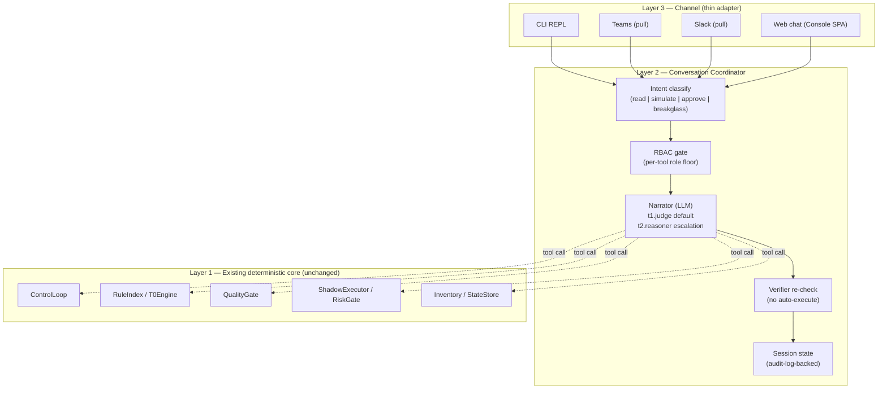

# Operator Console (Conversational)

How a human operator talks *back to* FDAI through a conversational
interface - CLI REPL first, Teams / Slack chat next, web chat last. This
document is authoritative for the **conversational surface**: the layered
architecture, the tool catalog, the LLM tier model, session persistence,
per-tool RBAC, safety invariants, and the phased rollout.

Push-direction notifications (system → human) live in
[channels-and-notifications.md](channels-and-notifications.md); the read-only
console SPA lives under
[project-structure.md § console/](project-structure.md#console-static-web-app).
This doc covers the **pull direction** - the operator asks, simulates,
approves - across every channel the notification doc already ships adapters
for. Push and pull share the same channel credentials and the same audit
contract, but they are distinct integration surfaces.

> Customer-agnostic: every channel id, LLM deployment name, resource id, and
> group name below is a placeholder. A fork supplies concrete values via
> config
> ([generic-scope.instructions.md](../../.github/instructions/generic-scope.instructions.md)).

## 1. Framing - what this is (and what it is not)

The operator console does **not** carry judgment authority. FDAI's
judgment stays where it already is - the deterministic engine (T0),
the quality gate (T2 verifier), the risk gate, and the shipped Rego
policies. The console is the **conversational surface** through which
an operator inspects that judgment, simulates change, and approves
what the system has already queued.

Three properties follow directly:

- **LLM is a translator, not a judge.** Natural language in, tool calls out;
  tool results in, natural language out. The LLM never grants execution
  eligibility - only the verifier does
  ([architecture.instructions.md § Design Principles](../../.github/instructions/architecture.instructions.md#design-principles)).
- **Tools expose pipeline stages, not primitive data sources.** Instead of
  `query_log()` + `query_metric()` + `read_config()` that the LLM must
  compose into a diagnosis, the console exposes
  `describe_event()`, `explain_verdict()`, `simulate_change()`. The system
  has already done the reasoning; the operator asks about the result.
- **Growth is catalog growth, not model memory growth.** Recurring
  investigation patterns become new rule candidates via the discovery loop
  ([architecture.instructions.md § Rule Catalog](../../.github/instructions/architecture.instructions.md#rule-catalog)) -
  not opaque LLM session memory. Every state that persists across
  conversations lives in `audit_log` + `operator_memory` where it is
  auditable, exportable, and CSP-neutral.

### 1.1 Vocabulary added to the shared glossary

The following tokens are added to the shared vocabulary in
[architecture.instructions.md](../../.github/instructions/architecture.instructions.md)
and are used consistently by every referring doc:

- **operator-console** - the layered surface documented here.
- **narrator** - the LLM tier of the operator console (translator role;
  never a judge). Distinct from the T2 quality-gate role, which is a
  domain reasoner over a proposed action.
- **operator-conversation** - one bounded exchange between an operator and
  the console (multi-turn, RBAC-scoped, audited).
- **console-tool** - one exposed pipeline stage or catalog view the narrator
  may call.

## 2. Three-layer architecture



- **Layer 3 (Channel)** is thin. Every channel adapter converts one turn
  from the wire format (stdin / Teams Activity / Slack event / WebSocket
  frame) into a `ConversationTurn` and back. No judgment lives here.
- **Layer 2 (Coordinator)** owns intent classification, RBAC gating, tool
  dispatch, verifier re-check, and session bookkeeping. The narrator is a
  DI seam (`ConversationalModel` Protocol - see §5) so a fork can bind any
  LLM provider; the upstream default is Azure OpenAI.
- **Layer 1 (Core)** is exactly the deterministic core that already ships.
  The console adds no new judgment path, no new persistence store, and no
  new execution vector. A console tool call resolves to a call the
  existing pipeline already knows how to make.

### 2.1 Module map

- [`src/fdai/core/conversation/`](../../src/fdai/core/conversation/)
  - `coordinator.py` - `ConversationCoordinator` (Layer 2 orchestrator).
  - `tools.py` - `ConsoleTool` Protocol + per-tool implementations that
    delegate to Layer 1 modules only.
  - `narrator.py` - `ConversationalModel` Protocol + the tier-select logic
    (t1.judge default, t2.reasoner.primary escalation).
  - `session.py` - `ConversationSession` dataclass; state is projected from
    the append-only audit log.
- `src/fdai/delivery/channels/` (planned layout; today's Teams adapter
  lives in [`src/fdai/delivery/chatops/`](../../src/fdai/delivery/chatops/))
  - `cli_repl.py` - Day-1 channel adapter (stdin/stdout).
  - `teams_bot.py` - pull-direction Teams adapter (Bot Framework messaging).
  - `slack_bot.py` - pull-direction Slack adapter (Socket Mode).
  - `web_chat.py` - WebSocket adapter surfaced by the read-console API.
- [`tools/chat.py`](../../tools/chat.py) - the CLI entry point.

The CSP-neutral rule stays intact: `core/conversation/` imports **only**
Protocols. All Azure SDK / httpx / Bot Framework calls live under
`delivery/`.

## 3. Tool catalog

Tools are **pipeline-stage views**. Each one has a stable name, a JSON
Schema for arguments (generated from the function signature at
registration time), an RBAC floor, and a documented failure surface. New
tools are additive; they never override a rule or a policy.

### 3.1 Day-1 tool set (read-only + explain)

| Tool | Purpose | RBAC floor | Delegates to |
|------|---------|-----------|--------------|
| `describe_event(payload)` | Run one event through `EventIngest → TrustRouter → T0Engine` in memory (no PR, no audit write); return the resulting routing decision + candidate rule ids. | Reader | `EventIngest`, `TrustRouter`, `T0Engine` |
| `explain_verdict(event_id)` | Read the audit trail for one already-processed event; return the tier, decision, citing rule ids, verifier report, mode. | Reader | `StateStore.query_audit()` |
| `explore_catalog(query)` | Search the shipped rule catalog / action-type catalog / ontology vocabulary by id, keyword, or resource_type. | Reader | Loaded catalogs (no I/O) |
| `query_audit(filters)` | Structured audit query: by event id, actor, decision, mode, time window. Paginated. | Reader | `StateStore.query_audit()` |
| `query_inventory(resource_type, filter)` | ARG-backed inventory query, CSP-neutral vocabulary in, CSP-neutral records out. Paginated. | Reader | `Inventory.list(...)` |

**Reader-floor tools are provably side-effect-free.** `describe_event`
runs `EventIngest -> TrustRouter -> T0Engine` **in memory only**: it does
not invoke T1 embedding lookups, T2 models, external adapters, or any
mutation surface, and it writes no PR and no audit entry. Its
`side_effect_class` is `read`, and a shadow-mode test asserts it never
touches the executor, the PR adapter, or the state store. This is what
keeps it safe at the Reader floor.

### 3.2 Week-1 additions (write / approve / runbook)

| Tool | Purpose | RBAC floor | Notes |
|------|---------|-----------|-------|
| `simulate_change(scenario)` | End-to-end `ControlLoop.process()` in **shadow** mode; return the executor outcome + generated PR intent without publishing. | Contributor | Shadow-only; still writes an audit entry so the operator can find it in `query_audit`. |
| `approve_hil(approval_id, decision, justification)` | Resolve one queued HIL item. Verifier + `no_self_approval` invariant re-checked. | Approver | Approver group; same principal as PR gate enforcement in [security-and-identity.md](security-and-identity.md). |
| `list_hil()` | Return currently queued HIL items visible to the caller's role. | Approver | Reader-visible would leak intent to non-approvers; kept Approver-scoped. |
| `run_runbook(name, params, dry_run)` | Execute one runbook under `docs/runbooks/`. `dry_run=true` requires Contributor; `dry_run=false` requires Owner. | Contributor / Owner | Concrete runbook adapters (e.g. `db_dr_drill_cli`) are already shipped; this tool routes by name. |
| `activate_break_glass(reason, expiry)` | Explicitly promote the current session to BreakGlass. Time-boxed, distinct from role gates, always audited + paged to Owners. | Any authenticated user | Session-scoped only; expires when the session ends or `expiry` passes. No permanent grant. |

Two clarifications on the write set:

- **`simulate_change` writing an audit entry does not violate "shadow
  never mutates".** The audit log is append-only; recording *that a
  simulation ran* is not a mutation of any managed resource. The
  shadow-mode property test asserts no executor / PR / state-store write,
  and explicitly allows the audit append.
- **`list_hil` (Approver) vs the read-console HIL view (Reader) are
  different surfaces.** The read-only Console SPA shows Reader the
  *existence and count* of queued HIL items (dashboard tile); `list_hil`
  returns the *full item detail* (target, proposed action, requester),
  which can reveal sensitive intent, so it stays Approver-scoped. The two
  are intentionally not the same visibility.

### 3.3 Month-1 additions (observation depth)

| Tool | Purpose | RBAC floor | Depends on |
|------|---------|-----------|-------------|
| `query_log(query, window)` | Log Analytics KQL query. | Reader | new `AzureMonitorAdapter` |
| `query_metric(namespace, metric, window, aggregation)` | Azure Monitor metrics API. | Reader | new `AzureMonitorAdapter` |
| `query_deployments(window)` | Git + ARM deployment-history join. | Reader | new `DeploymentHistoryAdapter` |
| `correlate_incident(incident_id)` | Multi-signal correlation over ingest events + audit + inventory + logs + metrics for one incident id. | Reader | Above three + `event_ingest` |

The Month-1 additions bring the console close to a multi-signal
incident-response experience, but they still surface
**already-correlated** results; the correlator lives in Layer 1, not
inside the narrator.

### 3.4 Tool discovery contract

Each tool declares:

- `name` - CLI-friendly snake_case verb (no `describe-*` / `explore-*`
  prefix taxonomy; the verb itself is the category).
- `description` - one sentence, English, no marketing language.
- `parameters` - JSON Schema generated from a typed `TypedDict` /
  dataclass; validation is boundary-enforced (invalid arguments → HTTP-400-
  shaped error, never a partial call).
- `rbac_floor` - the lowest role that MAY call the tool.
- `side_effect_class` - `read` / `simulate` / `approve` / `execute` /
  `breakglass`. The audit entry carries this class so downstream analytics
  can slice cheaply.
- `failure_modes` - typed error surface documented in the tool's docstring.

A `list_tools()` administrative call returns the schema; the narrator
receives the same schema via the LLM function-calling contract.

## 4. Narrator - LLM tier model

The narrator is the console's LLM layer. It is a **DI seam**
(`ConversationalModel` Protocol; see §5.1) so a fork can swap providers.
Upstream binds Azure OpenAI to the deployed `oai-fdai-dev-krc`
account.

### 4.1 Three tiers (mirrors the trust router)

| Tier | Model | Handles | Default? |
|------|-------|---------|----------|
| **Chat T0** | none (regex / keyword intent) | Direct-hit tool calls: `list_hil`, `explain_verdict <id>`, `explore_catalog <keyword>`. | Yes (LLM not invoked when a T0 intent matches with confidence >= configured threshold) |
| **Chat T1** | `t1.judge` (mini reasoner) | Standard turns: natural language ↔ tool_calls, most read-only investigations, one-hop follow-ups. | **Yes (mini always active)** |
| **Chat T2** | `t2.reasoner.primary` (frontier) | Escalation only (see §4.2). | No (opt-in via escalation trigger) |

**Deterministic-first still holds.** Chat T0 (regex / keyword intent, no
LLM) is tried first on every turn and is expected to satisfy the bulk of
repeat operator verbs (`list_hil`, `explain_verdict <id>`,
`explore_catalog <keyword>`). The design target is that Chat T0 resolves a
majority of turns and Chat T2 stays a small minority (~5-10% of turns,
mirroring the event-side tier split) - but this is a **target to validate
against a measured baseline**, not a guarantee. The console emits per-tier
turn counts to the telemetry surface
([goals-and-metrics.md](goals-and-metrics.md)) so the split is measured,
never asserted. `t1.judge` being "always active" means it is the fallback
for non-T0 turns, not that the LLM runs when a confident T0 intent matches.

### 4.2 Escalation triggers (T1 -> T2)

The coordinator escalates to Chat T2 on any of:

- The narrator's T1 response has `finish_reason=abstain` or the aggregated
  confidence falls below the configured threshold. **Confidence is derived,
  not model-self-reported:** for a write-class turn it is the verifier
  result (§7.2); for a read-only turn - where the verifier does not run -
  it is composed from the Chat-T0 intent-match score, whether every
  proposed `tool_call` validated against its `argument_schema`, and
  whether the tool returned `status=ok`. A read-only turn whose tool calls
  all validate and succeed is high-confidence and never escalates on
  confidence alone.
- The verifier rejects the proposed tool_call sequence (see §7).
- The requested tool is `simulate_change`, `approve_hil`, `run_runbook`,
  or `activate_break_glass` **and** the turn required more than one tool
  hop to resolve arguments.
- The multi-turn hop count in the current session exceeds a configured
  limit (default 5) - a signal the intent is novel.
- The user explicitly asks for deeper analysis (natural-language marker
  patterns, configurable).

Escalation is **one-way per session**: once a session hits T2 the same
turn's continuation stays on T2, but subsequent turns start again at T1.
The audit entry records `tier`, `escalation_trigger`, and the T1 output
that triggered it.

### 4.3 What the narrator is not allowed to do

- **Assert execution eligibility.** Only the verifier does that (§7).
- **Bypass the RBAC gate.** The coordinator applies the floor **before**
  invoking the narrator, so the tool schema handed to the model only
  contains callable tools.
- **Read the audit log directly.** The narrator sees only what tool
  results provide; the audit store is behind a Protocol seam.
- **Emit natural-language "commands" the coordinator treats as tool
  calls.** Only structured `tool_calls` from the model's function-calling
  response count. Prose is prose; it never runs.
- **Treat tool-argument content as instructions.** Operator-supplied
  argument values (a `restart_reason`, a free-text filter) are untrusted
  input and a prompt-injection surface, exactly like T2 event payloads
  ([architecture.instructions.md § LLM Quality Gate](../../.github/instructions/architecture.instructions.md#llm-quality-gate-required-for-t2)).
  They are (a) schema-validated at the coordinator boundary, (b) never
  concatenated into the system prompt as trusted text, and (c) for
  write-class tools, re-checked by the verifier (§7.2) which is the
  authority - not any instruction the argument text may contain.
  Redaction (§5.2 of action-ontology) strips secrets; it is not the
  injection defense - the verifier re-check is.

### 4.4 Cost and rate limits

Per D12: mini (t1.judge) is always on and the operator budget assumption
is that this is the normal-cost surface. The upstream default ships a
**generous-but-finite** per-turn token budget and per-session hop cap
(config keys `console.max_completion_tokens_per_turn`, default 4096, and
`console.max_tool_hops_per_turn`, default 8) - a product whose Cost
Governance vertical polices spend cannot ship its own console with an
unbounded LLM surface. There is no per-user *rate* limit by default; a
fork MAY add one via config. Every LLM invocation records the tier, model
deployment id, and prompt/completion token counts to the audit log so a
fork can build a cost report post-hoc without instrumenting the console
further.

## 5. DI seams

Every seam is a Protocol; the composition root wires the concrete
implementation. `core/` imports Protocols only
([coding-conventions.instructions.md § Provider Protocols](../../.github/instructions/coding-conventions.instructions.md#safety)).

### 5.1 `ConversationalModel`

```python
class ConversationalModel(Protocol):
    async def turn(
        self,
        *,
        system_prompt: str,
        messages: Sequence[ChatMessage],
        tools_schema: Sequence[ToolSchema],
        tier: ChatTier,
    ) -> ConversationalResponse: ...
```

- `system_prompt` is composed once at coordinator construction from the
  narrator base prompt (`rule-catalog/prompts/narrator/base.vN.yaml`),
  the RBAC-scoped tool list, and any operator-memory scope that applies
  to the calling principal.
- `messages` is the current session transcript in
  OpenAI-style role/content shape. Prior tool_call results are inlined as
  role `tool`.
- `tools_schema` is the JSON-Schema tool set the coordinator has already
  filtered by RBAC.
- `tier` is `Chat T1` or `Chat T2` and drives model selection inside the
  adapter (fork-specific).
- `ConversationalResponse` carries `text`, optional `tool_calls`,
  `finish_reason`, `confidence_signals`, and audit-friendly metadata
  (`prompt_tokens`, `completion_tokens`, `model_deployment_id`).

The upstream default is
`AzureOpenAINarratorModel` under
[`src/fdai/delivery/azure/llm/narrator.py`](../../src/fdai/delivery/azure/llm/narrator.py)
(added Day 1). It calls Azure OpenAI chat completions with the function-
calling contract; the model deployment is selected from
`resolved-models.json` (`t1.judge` for tier T1, `t2.reasoner.primary` for
tier T2).

### 5.2 `ConsoleTool`

```python
class ConsoleTool(Protocol):
    name: str
    description: str
    parameters: type[TypedDict]
    rbac_floor: Role
    side_effect_class: SideEffectClass

    async def call(
        self,
        *,
        arguments: Mapping[str, Any],
        principal: Principal,
        session: ConversationSession,
    ) -> ToolResult: ...
```

- `call()` receives an **already-validated** arguments mapping (validation
  is done at the coordinator boundary against `parameters` schema).
- `principal` is the Layer-2 authenticated principal; `session` provides
  read access to prior turns.
- `ToolResult` is a typed dataclass with `data` (serialisable), `preview`
  (short human-readable string the narrator gets to summarise), and
  optional `evidence_refs` (audit ids, PR urls, ARG resource ids) the
  narrator MUST cite verbatim.

### 5.3 `ChannelAdapter`

```python
class ChannelAdapter(Protocol):
    channel_kind: ChannelKind
    async def receive(self) -> AsyncIterator[InboundTurn]: ...
    async def send(self, response: OutboundResponse) -> None: ...
```

- One adapter per wire (CLI, Teams Bot Framework, Slack Socket Mode,
  WebSocket).
- Push-direction adapters
  ([channels-and-notifications.md](channels-and-notifications.md)) are
  **not** merged with pull adapters; they share credentials via config
  only. This keeps `send-only` and `receive-plus-send` blast-radius
  distinct.

## 6. Session model + memory

A `ConversationSession` is bounded and stateless in memory - all state is
**projected from the audit log** at session load, so the coordinator can
crash and recover on any node.

### 6.1 Session fields

```python
@dataclass(frozen=True)
class ConversationSession:
    session_id: str                # UUID; generated at first turn
    principal_id: str              # Entra OID or CLI principal id
    channel_id: str                # channel adapter's channel identifier
    started_at: datetime
    break_glass: BreakGlassGrant | None  # if session activated it (§7.3)
    turns: tuple[Turn, ...]        # projected from audit log
```

- `Turn` = `{turn_id, role, content, tool_calls?, tool_results?, tier,
  audit_entry_id}`.
- `turns` is loaded lazily by paginating `query_audit(session_id=...)`.

### 6.2 Persistence rules

- **Day 1**: every turn (inbound + outbound + tool_call + tool_result +
  tier + escalation_trigger) writes one append-only audit entry with
  `action_kind=console.turn`. No new Postgres table.
- **Week 1**: `operator_memory` (already scaffolded by a parallel session
  under [`src/fdai/core/operator_memory/`](../../src/fdai/core/operator_memory/))
  becomes the store for **out-of-band operator preferences**: "this
  environment always uses tag X", "quarantine this pattern for
  investigation before firing", "resource Y is a legacy exception". The
  console read-writes it via a Protocol seam; it never becomes narrator
  memory.
- **Month 1+**: recurring investigation patterns detected across sessions
  become discovery-loop signals (§9). Still not narrator memory - a rule
  candidate in the catalog is the resulting artifact.

### 6.3 What we deliberately do not store

- The narrator's raw generation trace, per-token logs, or embedding
  vectors of the operator's prompts. The audit entry contains the tool
  calls and the *summary* the narrator returned; the model's internal
  chain is not persisted.
- Any secret redacted at the channel boundary. The redactor lives in the
  channel adapter (same policy as
  [channels-and-notifications.md § 8 - redaction](channels-and-notifications.md#8-redaction)).

## 7. Safety invariants (chat does not weaken them)

The four autonomy invariants from
[coding-conventions.instructions.md § Safety](../../.github/instructions/coding-conventions.instructions.md#safety)
apply unchanged. Chat adds three of its own on top.

### 7.1 The four existing invariants

Every write-class tool call (`simulate_change` in enforce mode -
disallowed today - `approve_hil`, `run_runbook --live`) MUST carry:

1. **Stop-condition** - the underlying ActionType already declares one;
   the console does not add or remove.
2. **Rollback path** - reused from the ActionType's `rollback_contract`.
3. **Blast-radius limit** - reused from the ActionType's
   `blast_radius` block; the operator cannot widen it via natural
   language.
4. **Audit entry** - written by the coordinator before the tool actually
   dispatches.

### 7.2 Three chat-specific invariants

5. **Verifier re-check on every write-class tool call.** After the
   narrator emits a `tool_calls` frame that targets a write-class tool,
   the coordinator re-runs the T0Engine + policy-as-code check against
   the tool arguments. On abstain / deny, the tool call is dropped and
   the turn falls through to HIL (see §7.4). This is the mechanical
   guarantee behind "the LLM never grants execution eligibility".
6. **No self-approval, chat-scoped.** `approve_hil` refuses when the
   caller's Entra `oid` matches the requester recorded on the queued
   item, even if the caller holds Owner. This is the same invariant as
   the PR gate ([security-and-identity.md](security-and-identity.md));
   chat adds the invariant name to the audit reason on refusal.
7. **BreakGlass must be time-boxed and explicit.** `activate_break_glass`
   requires `(reason, expiry <= 4h)` and pages every configured Owner via
   the push-direction Slack/Teams adapter
   ([channels-and-notifications.md](channels-and-notifications.md)). No
   silent elevation. **The grant is fail-closed on notification:** if the
   primary pager channel is down, the coordinator tries the configured
   fallback channel; if *no* channel confirms delivery, the grant is
   **refused** (a break-glass with no audit witness is more dangerous than
   a delayed emergency), and the refusal is itself audited so an Owner can
   see the attempt. A BreakGlass grant only raises the caller's
   *approval eligibility* for a HIL item they are otherwise under-
   privileged for; it never returns `auto` and never lets the caller
   approve their own request (invariant 6 still holds). The exact
   eligibility semantics are defined in
   [user-rbac-and-identity.md § 2](user-rbac-and-identity.md#2-role-model-4-tiers--break-glass)
   and mirrored by the RiskGate role axis
   ([execution-model.md § 2.5](execution-model.md#25-axis-f---role-rbac)).

### 7.3 BreakGlass grant shape

```python
@dataclass(frozen=True)
class BreakGlassGrant:
    activated_at: datetime
    expires_at: datetime           # <= activated_at + 4h
    reason: str                    # >= 20 char, no secret patterns
    pager_receipt: str             # id from the push notification
```

Break-glass is **session-scoped**; ending the session revokes it. The 4h
ceiling is the config key `console.break_glass_max_ttl_seconds` (default
`14400`); a fork MAY lower it but MAY NOT raise it (the loader rejects a
value above `14400`).

### 7.4 HIL fall-through when the LLM proposes a write

The narrator MAY, when the operator says "just fix it", emit a
`tool_call` for `run_runbook(dry_run=false)` or `approve_hil`. On the
verifier re-check (invariant 5):

- If verifier passes AND RBAC is satisfied → the tool call proceeds.
- If verifier abstains or RBAC is under the floor → the coordinator
  substitutes an `enqueue_hil(...)` call that files a review item in the
  existing HIL queue and returns "I filed a HIL item, id X" to the
  operator.
- Under no circumstance does the write happen without an audit entry
  before dispatch.

## 8. Channel integration (push vs pull)

The channel abstraction ([channels-and-notifications.md](channels-and-notifications.md))
already handles push (system → human). This doc adds the pull direction
(human → system) as a **separate adapter set** that shares credentials
and channel routing config with the push adapters. The separation matters
because the trust posture is different: a push adapter has send-only
credentials; a pull adapter must maintain a Bot Framework session /
Socket Mode socket that can receive user input.

| Channel | Push (existing) | Pull (this doc) | Shared config |
|---------|-----------------|-----------------|---------------|
| Teams | `TeamsHilAdapter` (Adaptive Card via Incoming Webhook or Bot Framework send) | `TeamsBotChannel` (Bot Framework receive + reply) | Tenant, channel id, app registration |
| Slack | `SlackWebhookChannel` (Block Kit via Incoming Webhook) | `SlackBotChannel` (Socket Mode receive + `chat.postMessage` reply) | Workspace, channel id, app credentials |
| Email | send-only | (not planned; asynchronous, ill-suited to interactive) | n/a |
| Webhook | send-only | (not planned; caller must own an interactive protocol themselves) | n/a |
| Pager (PagerDuty) | send-only | (not planned) | n/a |
| SMS | send-only | (not planned) | n/a |
| Web chat | n/a | `WebChatChannel` (WebSocket on read-console) | Console SPA config |
| CLI | n/a | `CliReplChannel` (stdin/stdout) | local az login |

### 8.1 Same channel routing config

A fork registers a channel once in
[`config/notifications-matrix.yaml`](../../config/notifications-matrix.yaml)
and gets **both** push and pull routing derived from it. This preserves
the "one abstraction, many adapters" rule from
[channels-and-notifications.md § 1](channels-and-notifications.md#1-design-principles).

## 9. Growth model (catalog + operator memory)

The console gets better over time via three deterministic mechanisms.
Model-side learning is **not** one of them.

### 9.1 Day 1

The Day-1 console can answer:

- "What rules apply to `network.nsg` in `example-rg`?"
  → `query_inventory` + `explore_catalog`.
- "Why did event `<id>` route to HIL?" → `explain_verdict`.
- "Show me every audit entry for `object-storage.public-access.deny` in
  the last 24h." → `query_audit`.
- "If I create a storage account with public access enabled, what would
  the loop do?" → `describe_event`.

No writes, no runbooks, no approvals - just orientation.

### 9.2 Week 1

Adds `simulate_change`, `approve_hil`, `run_runbook --dry-run`, and the
Teams / Slack pull adapters. The console can now:

- Preview a change end-to-end in shadow.
- Resolve queued HIL items with the same identity gate the PR flow uses.
- Trigger the shipped runbooks
  ([docs/runbooks/](../runbooks/)) from any channel.

### 9.3 Month 1

Adds the observation-depth tools (§3.3) and the discovery-loop hook:

- The coordinator publishes a `console.recurrent_query` signal to the
  discovery-loop input stream when the same tool-argument shape appears
  N times across distinct principals in a rolling window (N configured;
  default 5 / week).
- The rule-candidate generator
  ([rule-governance.md](rule-governance.md)) receives that signal like
  any other; the resulting rule ships shadow-first through the same
  promotion pipeline.

The result is that a common investigation pattern in chat becomes a
first-class rule in the catalog - **the console grows the catalog, not
itself**.

## 10. Phased rollout

Every phase is measurable and gated shadow-first, matching the phase
discipline in [phase-0-instrumentation.md](phases/phase-0-instrumentation.md).

### Day 1 (this session)

- `AzureCliWorkloadIdentity` (identity adapter for local az login).
- `ConversationalModel` Protocol + `AzureOpenAIConversationalModel`
  adapter.
- `ConversationCoordinator` + 5 Day-1 tools (§3.1).
- `CliReplChannel` + `tools/chat.py` entry point.
- Coordinator writes every turn to the existing audit log.
- **Exit gate**: a Reader-role operator can complete every Day-1 tool
  scenario from a CLI REPL against the deployed `rg-fdai-dev-krc`
  environment; unit tests cover RBAC gating, escalation triggers, and
  the verifier re-check invariants.

### Week 1

- `simulate_change`, `approve_hil`, `list_hil`, `run_runbook`,
  `activate_break_glass` (§3.2).
- `TeamsBotChannel` and `SlackBotChannel` (pull adapters).
- Read-API approval callback endpoint (POST
  `/hil/{approval_id}/decision`, HMAC verified).
- Composition-root `default_workload_identity_from_env()` picks between
  `ManagedIdentityWorkloadIdentity` (production Container Apps),
  `AzureCliWorkloadIdentity` (local dev), and `LocalWorkloadIdentity`
  (tests).
- **Exit gate**: an Approver in Teams can complete a full "detect →
  chat inspect → approve → shadow PR opens" cycle against the deployed
  environment; the audit log carries every turn, verdict, and PR link.

### Month 1

- Month-1 observation tools (§3.3).
- `operator_memory` read/write from the console (Week 1 landed the
  schema; Month 1 exposes it to the narrator as a scope-bounded seam).
- Discovery-loop hook (§9.3).
- Web chat channel on the Console SPA.
- **Exit gate**: at least one rule candidate produced by the recurrent-
  query signal has completed shadow evaluation and been reviewed; the
  Month-1 observation tools have unit + integration tests against real
  Azure Monitor / Log Analytics fixtures under
  [`tests/delivery/azure/`](../../tests/delivery/azure/).

## 11. Testability

- **Coordinator** - property tests: "verifier re-check runs on every
  write-class tool call", "RBAC floor is enforced before the narrator
  sees the tool schema", "audit entry precedes every tool dispatch",
  "escalation records tier and trigger".
- **Narrator adapter** - contract tests using `httpx.MockTransport` for
  the Azure OpenAI endpoint; deterministic responses; verify the tier
  selection round-trip.
- **Tools** - each tool has a shadow-mode test showing it never mutates
  when its `side_effect_class == read | simulate`; a `write` /
  `approve` test showing the verifier re-check gate.
- **Channels** - CLI REPL: golden transcript. Teams / Slack: adapter
  tests using MockTransport-equivalent for Bot Framework / Socket Mode
  frames.
- **RBAC matrix** - table-driven test over every (Role × Tool) cell to
  prove the floor from §3.1-§3.3 is applied.
- **Break-glass** - a test proving `activate_break_glass` refuses
  `expiry > 4h`, that a session end revokes the grant, and that the
  Owner notification fired.
- **Determinism** - two runs of the same CLI transcript through a fake
  `ConversationalModel` produce byte-identical audit trails (given fixed
  timestamps and idempotency keys).
- **Session recovery** - a session whose coordinator crashed mid-turn
  reloads by `session_id` and reprojects the exact prior `turns` from the
  append-only audit log (§6); an assertion compares the reprojected
  transcript to the pre-crash one, proving the coordinator holds no state
  the audit log does not.

## 12. Failure modes

- **Narrator unavailable** - fall through to Chat T0 direct-hit; if the
  turn does not match a T0 pattern, respond with a canned "reasoning
  layer is temporarily unavailable; here is the direct query surface"
  and expose the tools list.
- **Verifier abstain on write-class tool** - substitute
  `enqueue_hil(...)` (see §7.4), return the HIL id, audit reason
  `verifier_abstained`.
- **Channel adapter disconnects** - the coordinator persists no in-flight
  turn state beyond the audit trail; a reconnect resumes the session by
  session_id.
- **Break-glass expiry mid-turn** - the coordinator refuses the next
  tool_call requiring elevated capabilities, returns "grant expired, use
  `activate_break_glass` again with justification".
- **Tool implementation raises** - the tool's typed error surface (§3.4)
  is wrapped as a `ToolResult(status=error)`; the narrator sees a
  structured error, not an exception traceback.

## 13. Data + wire contracts

### 13.1 Audit entry - `console.turn` action_kind

```json
{
  "action_kind": "console.turn",
  "session_id": "…",
  "turn_id": "…",
  "principal": {"kind": "user|cli|bot", "id": "…", "role": "Reader|…"},
  "channel": "cli|teams|slack|web",
  "direction": "inbound|outbound|tool_call|tool_result",
  "tier": "T0|T1|T2",
  "escalation_trigger": "…",
  "tool_name": "…",
  "arguments": {…},
  "result_preview": "…",
  "evidence_refs": ["…"],
  "verifier_verdict": "pass|abstain|deny|n/a",
  "model_deployment_id": "…",
  "prompt_tokens": 0,
  "completion_tokens": 0,
  "started_at": "…",
  "finished_at": "…"
}
```

### 13.2 CLI REPL wire contract

- stdin: one operator utterance per line.
- stdout: JSON-Lines when `--json` flag is set; formatted text otherwise.
- stderr: coordinator log lines (structured; separate stream so the
  formatted view stays clean).
- Exit code: `0` on clean session end; `2` on invalid config; `3` on
  unrecoverable channel error.

### 13.3 Read-API approval callback (Week 1)

- `POST /hil/{approval_id}/decision`
- Body: `{"decision": "approve|reject|defer", "justification": "..."}`
- Headers: `X-FDAI-Signature: sha256=<hex>`,
  `X-FDAI-Timestamp: <RFC3339>`.
- Signature material: `HMAC-SHA256(secret, timestamp . approval_id . body)`
  where the three parts are joined by a literal `.` separator. Binding
  the URL path `approval_id` into the digest blocks a captured valid
  message from being replayed against a different pending item (URL
  swap). The bot MUST include the same `approval_id` it puts in the URL.
- Response: `200 {"queued": true, "audit_entry_id": "..."}`.

This is the only exception to the "read API is 3 GET routes only"
invariant currently enforced by the read-API tests; the invariant test
gets a documented allow-listed POST once Week 1 lands. This does **not**
break the "console never executes" rule from
[app-shape.instructions.md](../../.github/instructions/app-shape.instructions.md):
the endpoint only *records an approval decision* into the existing HIL
queue (a signal), which a separate executor principal later acts on. The
API process never holds the executor Managed Identity and never calls a
mutation surface itself; approval and execution stay distinct principals.
### 13.4 View snapshot - self-describing screen contract (web deck)

The read-only console SPA captures what the operator currently sees as a
`ViewSnapshot` and posts it as the `view_context` of `POST /chat`
(`console/src/deck/context.tsx`). The snapshot is a screen *model*, not just a
value digest, so the narrator can explain the screen and its vocabulary and
answer "why did this happen" without a per-screen answerer:

```jsonc
{
  "routeId": "agent-activity",
  "routeLabel": "Agent activity",
  "purpose": "What this screen is for and what an operator does here.",
  "glossary": [
    {
      "term": "correlation id",
      "plain": "the incident key grouping every agent step for one event",
      "tech": "correlation_id",   // precise internal token (optional)
      "seeAlso": "trace",          // route to dig deeper (optional)
      "match": "correlation_id"    // records column whose values this term explains (optional)
    }
  ],
  "facts": [{ "key": "rows", "value": 5, "group": "page" }],
  "records": {
    "activity": [
      { "correlation_id": "corr-j", "detail": "…why this happened…", "outcome": "…" }
    ]
  },
  "capturedAt": "2026-07-06T11:12:30Z"
}
```

Contract rules (enforced by `console/src/routes/view-contract.test.ts`):

- **Every publishing route MUST declare `purpose` and `glossary`**, composed
  from the shared catalog `console/src/deck/glossary.ts` so a term means the
  same thing on every screen. A route that publishes a snapshot without them
  fails the build - an under-described screen can never land silently.
- **Causal fields stay in `records`.** `detail`, `summary`, `reason`, `tier`,
  and `outcome` are NOT projected away, so "why did this start" is answered by
  quoting the recorded audit narrative (and the ordered hand-off chain) instead
  of shrugging.
- The narrator resolves questions with a **screen-agnostic** chain (causal ->
  glossary / value-chip -> route enhancer -> generic record search); a new
  screen becomes explainable by declaring its vocabulary, not by adding code.
  The offline deterministic answerer (`console/src/deck/answerer.ts`) and the
  server narrator (`chat.py`) both ground term and cause answers in the same
  `purpose`/`glossary`.
- The CLI narrator (`cli/src/narrator`) is a separate surface; carrying the
  same self-describing snapshot into its `console-tool` results is parallel
  follow-up work.
## 14. MCP - future work (Week 2+)

The upstream console does **not** ship an MCP server on Day 1. Once the
in-process tool set is stable and the RBAC matrix is exercised, the
Week-2+ addition is an MCP server surface at
`src/fdai/delivery/mcp/server.py` that publishes the same tool
catalog (`list_tools` / `call_tool`) plus the operator-console read
resources (rule catalog, action types, runbook index) as MCP resources.

The MCP layer is **additive**: the same coordinator handles MCP-sourced
tool calls exactly as CLI/Teams-sourced ones, and the RBAC gate stays
identical. A fork MAY expose the MCP server to external agents (Claude
Code, Copilot Chat, or any other MCP client) at their discretion; the
upstream surface documents the wire contract and ships the server
process but does not open it publicly.

**External principal mapping.** An MCP-sourced tool call MUST resolve to a
concrete `Principal` with a real role before the RBAC gate runs - there is
no anonymous MCP caller. The MCP server authenticates the calling agent
(mTLS client cert or an Entra token audience-scoped to `fdai-api`)
and maps it to a service `Principal` whose role is assigned exactly like a
human's (an `aw-*` group / App Role, §5 of
[user-rbac-and-identity.md](user-rbac-and-identity.md)). An agent with no
mapped role is denied at the gate, identically to an under-privileged
human; the audit entry records `principal.kind = "mcp-agent"` with the
resolved role.

## 15. Open decisions (tracked)

- **OD-C1** - narrator prompt catalog naming: `rule-catalog/prompts/narrator/`
  vs `rule-catalog/prompts/console/`. Blocking for Wave-N of the prompt
  composition doc ([prompt-composition.md](prompt-composition.md)).
- **OD-C2** - operator_memory schema. Owned by the parallel session;
  Week 1 signs off before console starts writing.
- **OD-C3** - "self-approval" definition for BreakGlass grants -
  whether an active break-glass grant reduces the no-self-approval
  invariant to a stronger form (paired-approver only). Owner:
  security-and-identity doc author.
- **OD-C4** - CLI REPL history file location & retention. Default
  proposal: `~/.fdai/console-history.jsonl`, capped at 10 MiB,
  redacted before write. Blocking Day 1 implementation.

## 16. Related docs

- [architecture.instructions.md](../../.github/instructions/architecture.instructions.md) -
  trust routing, verifier authority.
- [action-ontology.md](action-ontology.md) - ActionType schema with the
  `trigger_kind` axis (`operator_request`) that the console emits, plus
  the `argument_schema` the coordinator validates against.
- [execution-model.md](execution-model.md) - the unified RiskGate the
  chat verifier re-check (§7.2) invokes, and the 5-axis authority
  matrix that decides auto / HIL / deny for every write-class tool call.
- [channels-and-notifications.md](channels-and-notifications.md) - the
  push-direction channel matrix this doc's pull side extends.
- [user-rbac-and-identity.md](user-rbac-and-identity.md) - the RBAC role
  set the tool matrix (§3) references.
- [security-and-identity.md](security-and-identity.md) - no-self-approval,
  execution identity, safety invariants.
- [prompt-composition.md](prompt-composition.md) - narrator prompt
  layering, tool-schema exposure, debate orchestrator (Wave 4.5) that
  Month 1 may consume.
- [rule-governance.md](rule-governance.md) - the discovery loop the
  Month-1 console feeds.
- [project-structure.md § console/](project-structure.md#console-static-web-app) -
  the read-only console SPA the Month-1 web-chat channel extends.
