# Phase 0 — 계측과 언블록

**목표**: 측정을 확립하고 어떤 자율성도 출시되지 못하게 막을 블로커를 제거. P0에서 자율성은
구축되지 않음 — 이 phase는 자율성을 *측정 가능하게* 하고 *정책 준수* 하게 만듦. P0는 이후
phase들이 이득을 증명할 기준 베이스라인을 **확립** ; 자체로는 어떤 개선 배수도 주장하지 않음.

이 phase는 [goals-and-metrics-ko.md](../goals-and-metrics-ko.md) 를 운영으로 구현하고
[security-and-identity-ko.md](../security-and-identity-ko.md) 에 추적된 P0 아이덴티티/정책
블로커를 해결. 출력은 [phase-1-rule-catalog-t0-ko.md](phase-1-rule-catalog-t0-ko.md) 의 직접
전제조건.

## 재사용 용어

여기서 도메인 용어를 재정의하지 않음. `Event`, `Scenario set`, `Reference agent`,
`Human touchpoint`, `Auto-resolved event`, `Measurement window` 는
[goals-and-metrics-ko.md#정의definitions](../goals-and-metrics-ko.md#정의definitions) 에서
한 번 정의; 이 phase는 그 정의를 그대로 사용.

## 산출물

각 산출물은 수용 검사 있는 커밋·버전된 아티팩트. 산출물과 [Work Items](#work-items) 은 번호로
1:1 매핑.

| # | 산출물 | 수용 검사 |
|---|--------|----------|
| 1 | **원격측정 백본** — OpenTelemetry 배선 + audit/state/KPI 저장소 + `shared/contracts/` 의 버전된 이벤트 스키마 ([project-structure-ko.md](../project-structure-ko.md)). | 스키마가 CI에서 검증; 잘못된 입력에 config가 fail fast; golden-fixture 테스트가 기록된 원격측정에서 모든 대시보드 메트릭을 재현. |
| 2 | **KPI 대시보드** — 성공 메트릭 1–4, 모든 가드 메트릭, 선행 지표 렌더링 ([goals-and-metrics-ko.md#선행-vs-후행-지표leading-vs-lagging-indicators](../goals-and-metrics-ko.md#선행-vs-후행-지표leading-vs-lagging-indicators)), 각각 이름 있는 원격측정 소스로 추적. | 모든 패널이 소스(trace, 감사 로그, 비용 기록)에 매핑; 어떤 패널도 수동으로 채워지지 않음. |
| 3 | **베이스라인 리포트** — 고정된 시나리오 세트에서 측정된 pinned reference agent, 방법론과 원시 카운트 있는 커밋된 아티팩트로 기록. | 재현 가능: 같은 시나리오 세트 버전에서 pinned agent 재실행이 보고된 신뢰구간 내 수치 산출. |
| 4 | **아이덴티티 매핑** — 프로비저닝된 외부 IdP ↔ Entra ↔ Managed Identity 경로 ([security-and-identity-ko.md#인가-모델authorization-model](../security-and-identity-ko.md#인가-모델authorization-model)). | 종단 경로가 자동 최소권한 프로브 통과; deny-by-default 검증; 접근 재인증 스케줄. |
| 5 | **정책 예외 워크플로** — 준수하는 자율 배포를 위한 요청 가능, time-boxed, 감사, 소유자 승인된 예외 경로. | 워크플로가 소유자와 SLA로 문서화; dry-run 요청이 감사 하에 부여·만료, 어떤 컨트롤도 우회하지 않음. |
| 6 | **로컬 개발 프리셋** — `src/aiopspilot/shared/providers/` 의 storage / event-bus / secret / workload-identity provider 인터페이스, 오프라인 유닛 테스트 + 디버그 용 in-memory 페이크 페어, 리어-레벨 통합 테스트용 **pgvector + Redpanda** Docker Compose (`infra/local/`) 프리셋. [tech-stack-ko.md § 로컬 개발](../tech-stack-ko.md#로컬-개발) 의 로컬-개발 계약과 [project-structure-ko.md § 주입 가능한-seams](../project-structure-ko.md#주입-가능한-seams) 의 DI seam 을 실현. | Docker 없이 `pytest` 가 in-memory 페이크로 green; `scripts/dev-up.sh` 가 `pgvector/pgvector:pg16` + `redpandadata/redpanda` 컨테이너를 건강하게 울림; **동일 계약-테스트 스위트** 가 페이크와 Compose 스택 모두에 대해 통과. |

## Work Items

순서가 의존성 인코딩. 항목 1, 2, 5, 6은 병렬 진행 가능; 항목 3은 항목 2(시나리오 freeze) 완료
전 **시작해선 안 됨**; 항목 4는 critical path이며 첫날 시작.

1. **원격측정 백본**: OpenTelemetry 배선, audit/state/KPI 저장소
   ([tech-stack-ko.md](../tech-stack-ko.md)), 최소 `event_id`, `tier`, `decision`, `mode`
   (shadow/enforce), detect/resolve 타임스탬프를 운반하는 `shared/contracts/` 의 버전된
   이벤트 스키마.
2. **시나리오 세트**: Resilience, Change Safety, Cost Governance 시나리오 고정 세트를
   정의하고 **freeze** , 세 버티컬에 걸쳐 균형,
   걸쳐 균형, [goals-and-metrics-ko.md#정의definitions](../goals-and-metrics-ko.md#정의definitions)
   포맷에 매칭되는 버전(예: `v2026.07`) 태그, 고객-비종속 데이터로 저장. 고정 세트는
   베이스라인과 트리트먼트에 동일 사용.
3. **베이스라인 측정**: **pinned** reference agent(single-model, no tiering)를 명시된 측정
   윈도우 동안 고정 시나리오 세트에서 실행; 성공 메트릭 1–4 **와** 모든 가드 메트릭(CFR,
   false-positive, false-negative, rollback, policy-violation escape) 기록하여 이후 phase가
   성공뿐 아니라 가드 베이스라인도 가짐. 각 수치를 표본 크기, 신뢰구간, 시나리오 세트 버전과
   함께 보고.
4. **아이덴티티 블로커**: 외부 IdP ↔ Entra ↔ Managed Identity 매핑 프로비저닝 및 테스트;
   최소권한 프로브로 검증 및 재인증 스케줄. 완료를
   [security-and-identity-ko.md#open-decisions](../security-and-identity-ko.md#open-decisions)
   의 P0 행에 연결.
5. **정책 블로커**: 정책 예외 워크플로(요청 가능, time-boxed, 감사, 소유자 승인) 정의 —
   자율 배포가 플랫폼 정책을 우회하지 않고 준수 유지; 소유자와 SLA 할당.
6. **로컬 개발 프리셋**: provider 인터페이스(state store, event bus, secret,
   workload identity)를 공개하고 각각 **두** 개 구현을 계약 뒤에 함께 출시 — 유닛 테스트/
   디버거 세션용 in-memory 페이크(Docker 불필요)와 리어-레벨 통합 테스트용 Docker Compose
   프리셋(pgvector + Redpanda). 동일한 계약-테스트 스위트가 둘 다에 대해 실행되므로 페이크가
   실제 백엔드에서 drift 불가.

## 구현 계획

위 각 Work Item은 구체적 엔지니어링 태스크 세트로 확장. 태스크 ID는 안정 (`Wx.y`) — 시퀀싱
다이어그램과 상태 추적이 균일하게 참조. 크기는 대략 용량 신호(**S** ≤ 1일, **M** 2–5일,
**L** 1–2주); 실제 경과 시간은 병렬성에 따라 다름.

모든 태스크는 **shadow-first** 로 랜딩
([architecture.instructions.md § Shadow → Enforce Promotion](../../../.github/instructions/architecture.instructions.md#safety-invariants));
P0에는 enforce-mode 능력이 범위에 없음.

### WI1 — 원격측정 백본

| Task | 제목 | Deps | 산출물 | 수용 | 크기 |
|------|------|------|--------|------|------|
| **W1.1** | Monorepo 스켈레톤 | — | [project-structure-ko.md](../project-structure-ko.md) 의 디렉토리: `core/`, `shared/`, `rule-catalog/`, `delivery/`, `infra/`, `policies/`, `tests/`, `.github/` + placeholder README + 서브시스템별 lockfile | 디렉토리 의존 방향을 CI가 강제 (lint job이 금지된 import 플래그) | S |
| **W1.2** | 온톨로지 + 이벤트 계약 | W1.1 | `shared/contracts/ontology/{object-type,link-type,action-type}.json`, `shared/contracts/event/schema.json`; 언어별 생성 타입 | 스키마가 CI에서 검증 (`ajv`); breaking change는 semver bump | M |
| **W1.3** | Config 스키마 + fail-fast 로더 | W1.1 | `shared/config/schema.json` + 주 코어 언어의 로더; env + file provider | 잘못되거나 누락된 필수 필드가 구조화된 에러로 시작 중단 | S |
| **W1.4** | OpenTelemetry 배선 | W1.1 | `shared/telemetry/` traces, metrics, logs; `correlation_id` 있는 JSON-구조화 로그; `infra/` 의 collector config | 합성 이벤트가 하나의 correlation id로 종단 trace (ingest → tier → gate → audit) | M |
| **W1.5** | PostgreSQL DDL — instance + audit | W1.2 | `ontology_object_type`, `ontology_link_type`, `ontology_resource`, `ontology_finding`, `ontology_link`, `audit_log`(hash-chain) 마이그레이션 | `flyway`/`alembic` 마이그레이션이 빈 DB에서 클린 실행; DDL이 [llm-strategy-ko.md § Ontology Storage Layout](../llm-strategy-ko.md#ontology-storage-layout) 와 매칭 | M |
| **W1.6** | PostgreSQL DDL — 계층 캐시 | W1.5 | `learned_action`, `ontology_embedding` (pgvector), `t2_cache`(`catalog_version` 파티션) 마이그레이션 | pgvector 확장 활성; HNSW 인덱스 빌드; 파티션 로테이션 스크립트 테스트 | S |
| **W1.7** | CI baseline 파이프라인 | W1.1 | `.github/workflows/`: format, lint(English-only + non-ASCII 검사), secret scan (gitleaks), coverage 게이트 (safety-core placeholder에 ≥90%), dependency audit | 실패한 검사가 머지 블록; placeholder-only PR은 통과 | M |
| **W1.8** | Golden-fixture 메트릭 테스트 | W1.4, W1.5 | `tests/telemetry/` — 기록된 합성-이벤트 trace + 픽스처가 모든 대시보드 메트릭이 원격측정에서 재현되는지 단언 | CI에서 green; trace 속성 제거가 특정 메트릭 단언 실패 | M |
| **W1.9** | KPI 대시보드 | W1.4, W1.5, W1.8 | 성공 1–4, 가드 메트릭, 선행 지표 패널 — 각각 원격측정-소스 주석 | 어떤 패널도 수동으로 채워지지 않음; 소스 이름 변경이 패널 빌드 검사 실패 | M |

### WI2 — 시나리오 세트 (freeze)

| Task | 제목 | Deps | 산출물 | 수용 | 크기 |
|------|------|------|--------|------|------|
| **W2.1** | 시나리오 스키마 | W1.2 | `tests/scenarios/schema.json` — 이벤트 입력, 예상 판정, 도메인, 태그 | 스키마가 CI에서 검증; 알려지지 않은 도메인/판정 값은 거부 | S |
| **W2.2** | 균형 시나리오 작성 | W2.1 | `tests/scenarios/v2026.07/` — Change / DR / FinOps 균형 합성 이벤트(도메인당 목표 ≥ N, `N` 은 작성 시 결정) | CI에서 균형 검사: 어떤 도메인도 평균 카운트에서 10% 초과 편차 없음 | M |
| **W2.3** | Freeze + 버전 | W2.2 | 디렉토리 `tests/scenarios/v2026.07/` 가 브랜치 보호로 **불변** ; 새 세트는 새 버전 디렉토리 | CI가 기존 버전 디렉토리의 어떤 수정도 거부 | S |
| **W2.4** | 시나리오 커버리지 테스트 | W2.2 | Property 테스트: 고객 값 없음, English-only, 모든 시나리오가 성공과 가드 기대 모두 가짐 | 비-영문 문자열이나 GUID 패턴 주입이 테스트 실패 | S |

### WI3 — 베이스라인 측정 (WI2 freeze로 블록됨)

| Task | 제목 | Deps | 산출물 | 수용 | 크기 |
|------|------|------|--------|------|------|
| **W3.1** | Pinned reference agent | W1.2, W2.3 | `tools/reference-agent/` — single-model, no tiering wrapper; 모델 id + 버전 고정; temperature 0; seed 고정 | 같은 시나리오 버전에서 두 실행이 동일 출력(결정론) | M |
| **W3.2** | 베이스라인 러너 CLI | W3.1, W1.5 | `tools/baseline-run --scenarios v2026.07 --window 1h` — 성공 1–4 + 가드 메트릭 + 표본 크기 + 신뢰구간 기록 | CLI가 누락 메트릭에 대해 non-zero exit code | S |
| **W3.3** | 베이스라인 리포트 아티팩트 | W3.2 | `docs/baselines/v2026.07.md` — 방법론, 원시 카운트, 환경, CI, 표본 크기 | 리포트가 커밋되고 시나리오 세트 버전으로 다시 링크 | S |
| **W3.4** | 재현성 CI | W3.3 | CI job이 `v2026.07` 에서 pinned agent를 재실행하고 보고된 CI 내 수치 단언 | 재실행이 CI 밴드 밖으로 drift하면 job 실패 | M |

### WI4 — 아이덴티티 블로커 (critical path, 첫날 시작)

| Task | 제목 | Deps | 산출물 | 수용 | 크기 |
|------|------|------|--------|------|------|
| **W4.1** | Terraform / Bicep 부트스트랩 모듈 | — | Container Apps env, PostgreSQL Flexible + pgvector, Service Bus, Key Vault, Log Analytics, ACR, Azure OpenAI ([deploy-and-onboard-ko.md](../deploy-and-onboard-ko.md#azure-resource-inventory-minimum-set)) 을 위한 `infra/` 모듈 | `azd up` 이 dev 구독에 최소 인벤토리 프로비저닝 | L |
| **W4.2** | Executor MI (Phase 1 형상) | W4.1 | [security-and-identity-ko.md § Identity Mapping (Phased)](../security-and-identity-ko.md#identity-mapping-phased) 에 따른 RG-스코프 built-in 롤 구성의 `mi-aw-executor` | Terraform이 롤 할당 emit; `az role assignment list` 가 선언 세트와 매칭 | M |
| **W4.3** | Azure Policy deny-by-default | W4.2 | Phase 1 Change allowlist 밖의 executor MI 액션을 거부하는 정책 할당 | non-allowlisted 액션 시도하는 프로브가 ARM 레이어에서 거부됨 | M |
| **W4.4** | 최소권한 프로브 | W4.2, W4.3 | `tools/lpp-probe` — 허용 액션 성공, 거부 액션 실패 단언; CI에 기록된 실행 | 프로브 업데이트 없이 새 권한 추가하면 CI 실패 | S |
| **W4.5** | App registration (dev) | W4.1 | dev 테넌트의 `aiopspilot-console-spa`, `aiopspilot-api`, `aiopspilot-approval-bot` + [user-rbac-and-identity-ko.md § 4.4](../user-rbac-and-identity-ko.md#44-app-roles-token-surface) 에 따라 선언된 App Roles | `Contributor` 에 할당된 dev 사용자가 `roles: ["Contributor"]` 토큰 받음 | M |
| **W4.6** | Entra 보안 그룹 + App Role 바인딩 | W4.5 | 5 그룹 (`aw-readers/contributors/approvers/owners/break-glass`), 각각 Enterprise Applications에서 매칭 App Role에 바인딩 | 미할당 dev 사용자가 "administrator assignment required" body와 함께 HTTP 403 ([user-rbac-and-identity-ko.md § 10.3](../user-rbac-and-identity-ko.md#103-first-sign-in-unassigned-users)) | S |
| **W4.7** | Conditional Access 정책 | W4.6 | `aw-approvers`/`aw-owners` 에 phishing-resistant MFA; `aw-owners` 에 compliant device; `aw-break-glass` 에 named-location | FIDO2 없이 사인인하는 테스트 승인자가 블록됨 | S |
| **W4.8** | 재인증 스케줄 | W4.6 | 문서화된 주기(`docs/runbooks/` 의 수동 분기 체크리스트, 또는 P2 라이선스된 경우 Entra Access Review) | 소유자 할당; 다음 리뷰 날짜가 감사 로그에 캡처됨 | S |

### WI5 — 정책 예외 워크플로

| Task | 제목 | Deps | 산출물 | 수용 | 크기 |
|------|------|------|--------|------|------|
| **W5.1** | 예외 아티팩트 스키마 | W1.2 | `rule-catalog/schema/exemption.json` ([rule-governance-ko.md § JSON 형상](../rule-governance-ko.md#json-형상) 에 이미 스케치); `.github/PULL_REQUEST_TEMPLATE/exemption.md` 의 PR 템플릿 | 누락 `justification` / `expires_at` 이 CI 실패 | S |
| **W5.2** | Requester ≠ approver CI 검사 | W5.1, W4.5 | CI가 PR trailer Entra OID 를 리뷰어 OID에 대해 파싱; 자기승인 블록 | Author-approves-own-PR 테스트 케이스가 머지 블록 | S |
| **W5.3** | Auto-expiry Container Apps Job | W5.1, W4.1 | `expires_at` 통과 시 audit `expired` 엔트리 emit하고 기저 할당 재적용하는 일일 cron job | Dry-run: 생성 → 대기 → 만료 → 감사 엔트리 존재; 할당 재적용 | M |
| **W5.4** | 만료 사전 알림 | W5.3 | 14일 lookahead 다이제스트 ([channels-and-notifications-ko.md § 라우팅](../channels-and-notifications-ko.md#6-라우팅-정책-config-driven)) `exemption_expiry_lookahead_weekly` 배선 | 월요일 아침 포스트가 만료되는 각 exemption을 requester `@mention` 과 함께 리스트 | S |
| **W5.5** | 소유자 + SLA 문서 | W5.1 | `docs/runbooks/exemption-workflow.md` — 소유자 그룹, 리뷰 SLA, escalation 경로 | 소유자 명명; SLA 측정 가능; escalation 경로 해결 | S |

### WI6 — 로컬 개발 프리셋 (오프라인 페이크 + Docker Compose)

[tech-stack-ko.md § 로컬 개발](../tech-stack-ko.md#로컬-개발) 의 로컬-개발 계약을
[project-structure-ko.md § 주입 가능한-seams](../project-structure-ko.md#주입-가능한-seams)
의 주입 seam 으로 실현. In-memory 페이크는 개발자가 `pytest` 와 디버거에서 실행하는
것; Compose 프리셋은 통합 테스트, `event-ingest` 스모크 런, pgvector 유사도 체크가 실행되는 대상.

| Task | 제목 | Deps | 산출물 | 수용 | 크기 |
|------|------|------|--------|------|------|
| **W6.1** | Storage / bus / secret / identity provider 인터페이스 | W1.2 | `src/aiopspilot/shared/providers/` 의 `StateStore`, `EventBus`, `SecretProvider`, `WorkloadIdentity` Protocol 클래스 — 각각 네 개의 CSP-중립 계약 중 하나에 매핑 | `mypy --strict` 통과; 인프라에 닿는 모든 core 모듈이 이 Protocol 만 import (W1.7 import-lint 규칙이 `core/` 의 클라우드 SDK 금지 강제) | S |
| **W6.2** | In-memory 페이크 어댑터 + 공유 계약-테스트 스위트 | W6.1 | `src/aiopspilot/shared/providers/testing/` — dict 기반 `StateStore`(audit 용 hash-chain 생산), 큐 + 컨슈머-그룹 `EventBus`, `SecretProvider`, `WorkloadIdentity`; `tests/providers/` 에 `[fake, postgres, redpanda]` 로 파라미터라이즈된 계약 테스트 | 계약-테스트 스위트가 **Docker 없이** 페이크에서 green, Docker 가용 시 Compose 스택에서도 green; *동일* 테스트 파일이 두 매트릭스 모두 통과 | M |
| **W6.3** | Docker Compose 개발 프리셋 + 래퍼 스크립트 | W6.1 | `pgvector/pgvector:pg16` 와 `redpandadata/redpanda:latest` 가 실행되는 `infra/local/docker-compose.yml` (single-node, zookeeper 불필요); 헬스 체크와 함께 스택을 올리고 내리는 `scripts/dev-up.sh` / `scripts/dev-down.sh`; `Makefile` 타겟 `dev-up`, `dev-down`, `dev-logs` | Fresh clone: `scripts/dev-up.sh` 가 종료코드 0과 건강한 두 컨테이너 반환; 노출된 포트에 `psql` 연결되고 `CREATE EXTENSION vector` 성공; Redpanda 프로듀서 + 컨슈머 라운드트립이 `localhost:9092` 에서 완료. Azure / 클라우드 호출 없음 | M |

### 시퀀싱된 태스크 타임라인

```mermaid
gantt
    title Phase 0 — Implementation Sequence
    dateFormat X
    axisFormat %s

    section WI4 identity (critical path)
    W4.1 Bootstrap modules    :w41, 0, 10
    W4.2 Executor MI          :w42, after w41, 4
    W4.3 Policy deny          :w43, after w42, 4
    W4.4 LPP probe            :w44, after w43, 2
    W4.5 App regs             :w45, after w41, 4
    W4.6 Entra groups         :w46, after w45, 2
    W4.7 Conditional access   :w47, after w46, 2
    W4.8 Recertification      :w48, after w47, 1

    section WI1 telemetry
    W1.1 Skeleton             :w11, 0, 1
    W1.2 Ontology contracts   :w12, after w11, 4
    W1.3 Config loader        :w13, after w11, 1
    W1.4 OTel wiring          :w14, after w13, 4
    W1.5 DDL instance+audit   :w15, after w12, 4
    W1.6 DDL layered cache    :w16, after w15, 1
    W1.7 CI baseline          :w17, after w11, 4
    W1.8 Golden fixture       :w18, after w15, 4
    W1.9 KPI dashboard        :w19, after w18, 4

    section WI2 scenarios
    W2.1 Schema               :w21, after w12, 1
    W2.2 Author               :w22, after w21, 4
    W2.3 Freeze               :w23, after w22, 1
    W2.4 Coverage tests       :w24, after w22, 1

    section WI3 baseline (blocked by W2.3)
    W3.1 Reference agent      :w31, after w23, 4
    W3.2 Runner CLI           :w32, after w31, 1
    W3.3 Report               :w33, after w32, 1
    W3.4 Repro CI             :w34, after w33, 4

    section WI5 exemption
    W5.1 Schema + template    :w51, after w12, 1
    W5.2 CI check             :w52, after w51, 1
    W5.3 Expiry job           :w53, after w51, 4
    W5.4 Lookahead digest     :w54, after w53, 1
    W5.5 Runbook              :w55, after w51, 1

    section WI6 local dev preset
    W6.1 Provider interfaces  :w61, after w12, 1
    W6.2 In-memory fakes      :w62, after w61, 4
    W6.3 Docker Compose       :w63, after w61, 3
```

### Critical-Path 규칙

- **W4.1은 첫날 시작, 의존성 없음.** 클라우드 프로비저닝 지연(구독 쿼터, 리전 가용성)이 가장
  큰 스케줄 리스크.
- **W3.1은 W2.3 전에 시작해선 안 됨.** 이동하는 시나리오 세트에서 reference agent 실행은 전체
  베이스라인 무효화.
- **W1.9 (KPI 대시보드) 는 W1.8 (golden fixture) 통과 필요.** 어떤 패널도 수동 채워진 소스로
  출시 안 됨; 픽스처가 소스 그래프 동작 증명.
- **executor 권한을 추가하는 어떤 태스크도 같은 PR에서 W4.4 업데이트 필요.** CI가 강제.
- **W6.2 (in-memory 페이크) 와 W1.5–W1.6 으로 랜딩하는 Postgres/Redpanda 어댑터는 하나의
  계약-테스트 스위트를 공유해야 함.** 페이크에서는 통과하지만 실제 백엔드에서는 실패(혹은
  반대)하는 테스트는 페이크가 drift했다는 신호 — 테스트가 아닌 페이크를 고친다.

### Done 정의 (태스크별)

각 태스크는 다음 시에만 완료:

1. **코드 + 테스트 머지** — 표준 거버넌스 PR 흐름(author ≠ reviewer, 고위험 diff에
   `Justification:`) 을 통해.
2. **Docs-after 충족** — 만진 설계 문서가 같은 PR에서 업데이트
   ([coding-conventions.instructions.md § Documentation Workflow](../../../.github/instructions/coding-conventions.instructions.md#documentation-workflow)).
3. **수용 검사 통과** — 태스크 테이블에 선언된 대로, 로컬 실행이 아니라 CI에서 검증.
4. **Shadow-mode 기본** — 태스크가 실행할 *가능한* 능력을 도입하면 출시 기본은
   `enforcement: do-not-enforce`.
5. **감사 로그 엔트리 emit** — 런타임에 상태-변경 태스크(Terraform apply 포함) 에 대해.

## 데이터와 범위 제약

- 이 리포에 커밋된 모든 원격측정, 시나리오, 감사, KPI 데이터는 **영문, 시크릿 없음, 고객-비종속** ;
  합성 또는 placeholder 값만 사용, 리포 범위 규칙에 따라
  ([goals-and-metrics-ko.md#데이터-수집과-원격측정](../goals-and-metrics-ko.md#데이터-수집과-원격측정)).
  실제 환경 기록은 포크의 런타임 저장소에만 존재.
- 대시보드의 각 메트릭은 정확히 하나의 원격측정 소스(OpenTelemetry trace, append-only 감사 로그,
  또는 비용/사용 기록) 에 매핑; 소스 없는 열망 패널은 출시 불가.

## Exit 기준

모든 기준은 독립적으로 검증 가능; phase 게이트는 모든 박스가 체크될 때만 통과.

- [ ] **시나리오 세트가 freeze되고 버전** , Resilience / Change Safety / Cost Governance에 걸쳐 균형, 고객-비종속 데이터로
      저장.
- [ ] **재현 가능한 베이스라인** 존재: 고정 시나리오 세트 버전에서 pinned reference agent가
      재실행 시 보고된 신뢰구간 내 같은 수치 산출, 표본 크기와 버전 기록.
- [ ] **베이스라인이 성공 메트릭 1–4와 모든 가드 메트릭 커버** — 이후 shadow → enforce 승격이
      성공과 가드 참조 모두 가짐.
- [ ] **KPI 대시보드가 라이브** — 메트릭 1–4, 가드 메트릭, 선행 지표 표시, 각각 원격측정 소스에
      추적.
- [ ] **아이덴티티 블로커 해결**: 종단 IdP ↔ Entra ↔ Managed Identity 경로 프로비저닝,
      최소권한 프로브 통과, deny-by-default 확인, 재인증 스케줄 — 또는 문서화되고 소유자
      할당된 계획으로 명시적 waive.
- [ ] **정책 예외 워크플로** 문서화되고 소유자 할당되고 dry-run 검증(부여, 감사, auto-expire)
- [ ] **로컬 개발 프리셋이 양방향으로 동작**: `pytest` 가 in-memory 페이크에 대해 오프라인으로
      green, **그리고** `scripts/dev-up.sh` 가 건강한 pgvector + Redpanda 스택을 생산하고
      동일한 계약-테스트 스위트가 그것에 대해서도 통과. 개발자가 Azure 프로비저닝 없이 호스팅된
      IDE에서 어느 서브시스템이든 디버그 가능.
      — 또는 문서화된 계획으로 명시적 waive.

## 리스크

| 리스크 | 가능성 | 영향 | 완화 |
|--------|--------|------|------|
| 불공정하거나 불균형한 시나리오 세트가 베이스라인-vs-트리트먼트 비교 무효화 | 중간 | 높음 | 어떤 측정 전에 세트 freeze하고 버전; 도메인 간 균형; reference agent는 handicap되지 않음 ([goals-and-metrics-ko.md#measurement-first-규칙](../goals-and-metrics-ko.md#measurement-first-규칙) 의 공정성 규칙). |
| 아이덴티티 매핑 노력 저평가 | 높음 | 높음 | Critical path로 취급; 첫날 시작; "인증됨" 이 아니라 최소권한 프로브로 게이팅. |
| 정책 예외 워크플로가 늦어져 이후 준수 배포 블록 | 중간 | 중간 | P0에서 소유자와 SLA 정의; exit 전 dry-run 요청으로 검증. |
| 베이스라인이 재현 불가(unpinned agent 또는 drift하는 시나리오) | 중간 | 높음 | Reference-agent 버전 고정, 어떤 랜덤도 seed, 시나리오 세트 freeze; 실행 환경 기록. |
| 원격측정 갭이 메트릭을 측정 불가하게 함 | 중간 | 높음 | 항목 1에서 모든 메트릭을 소스에 매핑; 어떤 패널이라도 수동 채워지면 exit 블록. |
| 고객 식별 데이터가 커밋된 원격측정/픽스처로 유출 | 낮음 | 높음 | CI에서 secret scanning과 범위 검사; 합성 데이터만 ([generic-scope.instructions.md](../../../.github/instructions/generic-scope.instructions.md)). |

## 시퀀싱

- **첫날, 병렬로**: 항목 4(아이덴티티, critical path) 와 항목 2(시나리오 freeze) 시작, 항목 1
  (원격측정)과 항목 5(정책 워크플로) 준비.
- **시나리오 freeze 이후**: 항목 3(베이스라인 측정) 실행, 고정된 버전 세트에 대해 측정.
- **게이트**: 모든 [Exit 기준](#exit-기준) 통과 후에만
  [phase-1-rule-catalog-t0-ko.md](phase-1-rule-catalog-t0-ko.md) 시작.

## 의존성

- **상류**: 없음 — P0는 root phase. 외부 전제조건은 아이덴티티 매핑을 위한 클라우드/IdP 접근과
  원격측정/저장소 대상 ([deployment-ko.md](../deployment-ko.md),
  [tech-stack-ko.md](../tech-stack-ko.md)).
- **하류**: P0 원격측정, 고정 시나리오 세트, 측정된 베이스라인, 해결된 아이덴티티/정책 블로커는
  [phase-1-rule-catalog-t0-ko.md](phase-1-rule-catalog-t0-ko.md) 와 모든 이후 phase의 전제조건
  ([README-ko.md](../README-ko.md)).
