# Phase 0 - Instrumentation and Unblocking

**Goal**: establish measurement and remove the blockers that would stop any autonomy from
shipping. No autonomy is built in P0 - this phase makes autonomy *measurable* and
*policy-compliant*. P0 **establishes** the reference baseline against which later phases prove
their gains; it does not itself claim any improvement factor.

This phase operationalizes [goals-and-metrics.md](../architecture/goals-and-metrics.md) and resolves the
P0 identity/policy blockers tracked in
[security-and-identity.md](../architecture/security-and-identity.md). Its outputs are the direct
prerequisite for [phase-1-rule-catalog-t0.md](phase-1-rule-catalog-t0.md).

> **Implementation status**: Telemetry, configuration, and event contracts; PostgreSQL
> migrations; the frozen `v2026.07` scenarios; `tools/reference_agent/`;
> `tools/baseline_run.py`; baseline reports; provider fakes; the pgvector/Redpanda local preset;
> and the exemption schema and template are implemented. Entra app/group provisioning, PR-trailer
> no-self-approval CI, the exemption auto-expiry/digest job, and production validation of all P0
> exit evidence are incomplete. The task tables preserve the original plan and acceptance criteria;
> this callout describes the current repository state.

## Terms Reused

Do not redefine domain terms here. `Event`, `Scenario set`, `Reference agent`,
`Human touchpoint`, `Auto-resolved event`, and `Measurement window` are defined once in
[goals-and-metrics.md#definitions](../architecture/goals-and-metrics.md#definitions); this phase uses those
definitions verbatim.

## Deliverables

Each deliverable is a committed, versioned artifact with an acceptance check. Deliverables and
[Work Items](#work-items) map 1:1 by number.

| # | Deliverable | Acceptance check |
|---|-------------|------------------|
| 1 | **Telemetry backbone** - OpenTelemetry wiring plus the audit/state/KPI store, and the versioned event schema in `shared/contracts/` ([project-structure.md](../architecture/project-structure.md)). | Schema validates in CI; config fails fast on invalid input; a golden-fixture test reproduces every dashboard metric from recorded telemetry. |
| 2 | **KPI dashboard** - renders success metrics 1-4, all guard metrics, and the leading indicators ([goals-and-metrics.md#leading-vs-lagging-indicators](../architecture/goals-and-metrics.md#leading-vs-lagging-indicators)), each traced to a named telemetry source. | Every panel maps to a source (trace, audit log, or cost record); no panel is manually populated. |
| 3 | **Baseline report** - the pinned reference agent measured on the frozen scenario set, recorded as a committed artifact with methodology and raw counts. | Reproducible: re-running the pinned agent on the same scenario-set version yields figures within the reported confidence interval. |
| 4 | **Identity mapping** - provisioned external IdP ↔ Entra ↔ Managed Identity path ([security-and-identity.md#authorization-model](../architecture/security-and-identity.md#authorization-model)). | End-to-end path passes an automated least-privilege probe; deny-by-default verified; access recertification scheduled. |
| 5 | **Policy-exemption workflow** - a requestable, time-boxed, audited, owner-approved exemption path for compliant autonomous deploys. | Workflow is documented with an owner and SLA; a dry-run request is granted and expires under audit, bypassing no control. |
| 6 | **Local dev preset** - storage / event-bus / secret / workload-identity provider interfaces in `src/fdai/shared/providers/`, an in-memory fake pair for offline unit tests + debug, and a Docker Compose (`infra/local/`) preset that stands up **pgvector + Redpanda** for wire-level integration tests. Realizes the local-development contract in [tech-stack.md § Local Development](../architecture/tech-stack.md#local-development) and the DI seams in [project-structure.md § Injectable Seams](../architecture/project-structure.md#injectable-seams). | `pytest` runs green with the in-memory fake and requires no Docker; `scripts/deployment/local/dev-up.sh` brings up healthy `pgvector/pgvector:pg16` + `redpandadata/redpanda` containers; the **same contract-test suite** passes against both the fake and the Compose stack. |

## Work Items

Ordering encodes dependencies. Items 1, 2, 5, and 6 may proceed in parallel; item 3 **must not
start** until item 2 (the scenario freeze) is complete; item 4 is the critical path and starts
on day one.

1. **Telemetry backbone**: OpenTelemetry wiring, audit/state/KPI store
   ([tech-stack.md](../architecture/tech-stack.md)), and the versioned event schema in
   `shared/contracts/` carrying at minimum `event_id`, `tier`, `decision`, `mode`
   (shadow/enforce), and detect/resolve timestamps.
2. **Scenario set**: define and **freeze** a fixed set of Resilience, Change Safety, and
   Cost Governance scenarios, balanced across the three verticals, tagged with a version
   (e.g. `v2026.07`) matching the
   [goals-and-metrics.md#definitions](../architecture/goals-and-metrics.md#definitions) format, and stored as
   customer-agnostic data. The frozen set is used identically for baseline and treatment.
3. **Baseline measurement**: run the **pinned** reference agent (single-model, no tiering) on
   the frozen scenario set over a stated measurement window; record success metrics 1-4 **and**
   every guard metric (CFR, false-positive, false-negative, rollback, policy-violation escapes)
   so later phases have a guard baseline, not only a success baseline. Report each figure with
   its sample size, confidence interval, and scenario-set version.
4. **Identity blocker**: provision and test the external IdP ↔ Entra ↔ Managed Identity
   mapping; verify with a least-privilege probe and schedule recertification. Tie completion to
   the P0 rows in
   [security-and-identity.md#open-decisions](../architecture/security-and-identity.md#open-decisions).
5. **Policy blocker**: define the policy-exemption workflow (requestable, time-boxed, audited,
   owner-approved) so autonomous deploys stay compliant with platform policy rather than
   bypassing it; assign an owner and SLA.
6. **Local dev preset**: publish the provider interfaces (state store, event bus, secret,
   workload identity) and ship **two** implementations behind each - an in-memory fake for
   unit tests / debugger sessions (no Docker required) and a Docker Compose preset
   (pgvector + Redpanda) for wire-level integration tests. A single contract-test suite
   runs against both, so the fake cannot drift from the real backend.

## Implementation Plan

Each Work Item above expands into a set of concrete engineering tasks. Task IDs are stable
(`Wx.y`) so the sequencing diagram and status tracking reference them uniformly. Sizes
are a rough capacity signal (**S** ≤ 1 day, **M** 2-5 days, **L** 1-2 weeks); actual
elapsed time depends on parallelism.

Every task lands **shadow-first** ([architecture.instructions.md § Shadow → Enforce
Promotion](../../../.github/instructions/architecture.instructions.md#safety-invariants)); no
enforce-mode capability is in scope for P0.

### WI1 - Telemetry Backbone

| Task | Title | Deps | Deliverable | Acceptance | Size |
|------|-------|------|-------------|------------|------|
| **W1.1** | Monorepo skeleton | - | Directories from [project-structure.md](../architecture/project-structure.md): `core/`, `shared/`, `rule-catalog/`, `delivery/`, `infra/`, `policies/`, `tests/`, `.github/` with placeholder READMEs and lockfile per subsystem | Directory dependency direction enforced by CI (a lint job flags forbidden imports) | S |
| **W1.2** | Ontology + event contracts | W1.1 | `src/fdai/shared/contracts/ontology/{object-type,link-type,action-type}.json`, `src/fdai/shared/contracts/event/schema.json`; generated types per language | Schema validates in CI (`ajv`); breaking changes bump semver | M |
| **W1.3** | Config schema + fail-fast loader | W1.1 | `src/fdai/shared/config/schema.json` + Python loader; env + file provider | Invalid or missing required field aborts startup with a structured error | S |
| **W1.4** | OpenTelemetry wiring | W1.1 | `src/fdai/shared/telemetry/` traces, metrics, logs; JSON-structured logs with `correlation_id`; collector config in `infra/` | A synthetic event traces end-to-end (ingest → tier → gate → audit) with one correlation id | M |
| **W1.5** | PostgreSQL DDL - instance + audit | W1.2 | Migration for `ontology_object_type`, `ontology_link_type`, `ontology_resource`, `ontology_finding`, `ontology_link`, `audit_log` (hash-chained) | `flyway`/`alembic` migration runs clean on empty DB; DDL matches [llm-strategy.md § Ontology Storage Layout](../architecture/llm-strategy.md#ontology-storage-layout) | M |
| **W1.6** | PostgreSQL DDL - layered cache | W1.5 | Migration for `learned_action`, `ontology_embedding` (pgvector), `t2_cache` (partition by `catalog_version`) | pgvector extension enabled; HNSW index builds; partition rotation script tested | S |
| **W1.7** | CI baseline pipeline | W1.1 | `.github/workflows/`: format, lint, ASCII identifier/path and punctuation checks, translation/catalog parity, secret scan, coverage gate, dependency audit | A failing check blocks merge; English and Korean natural-language text are both allowed | M |
| **W1.8** | Golden-fixture metrics test | W1.4, W1.5 | `tests/telemetry/` - a recorded synthetic-event trace + fixture asserting every dashboard metric reproduces from telemetry | Test runs green in CI; removing a trace attribute fails a specific metric assertion | M |
| **W1.9** | KPI dashboard | W1.4, W1.5, W1.8 | Panels for success 1-4, guard metrics, leading indicators - each with its telemetry-source annotation | No panel is manually populated; a source rename fails the panel's build check | M |

### WI2 - Scenario Set (freeze)

| Task | Title | Deps | Deliverable | Acceptance | Size |
|------|-------|------|-------------|------------|------|
| **W2.1** | Scenario schema | W1.2 | `tests/scenarios/schema.json` - event input, expected verdict, domain, tags | Schema validates in CI; unknown domain / verdict values are rejected | S |
| **W2.2** | Author balanced scenarios | W2.1 | `tests/scenarios/v2026.07/` - Change / DR / FinOps balanced synthetic events (target ≥ N per domain, `N` decided at authoring time) | Balance check in CI: no domain deviates > 10% from the mean count | M |
| **W2.3** | Freeze + version | W2.2 | Directory `tests/scenarios/v2026.07/` is **immutable** via branch protection; a new set is a new version directory | CI rejects any modification to an existing versioned directory | S |
| **W2.4** | Scenario coverage tests | W2.2 | Property tests: no customer values, ASCII identifiers/paths, every scenario has both success and guard expectations | A customer GUID or non-ASCII identifier/path fails; natural-language values may be English or Korean | S |

### WI3 - Baseline Measurement (blocked by WI2 freeze)

| Task | Title | Deps | Deliverable | Acceptance | Size |
|------|-------|------|-------------|------------|------|
| **W3.1** | Pinned reference agent | W1.2, W2.3 | `tools/reference_agent/` - deterministic no-tiering wrapper with a pinned implementation version | Two runs on the same scenario version produce identical outputs (deterministic) | M |
| **W3.2** | Baseline runner CLI | W3.1, W1.5 | `python -m tools.baseline_run --scenarios tests/scenarios/v2026.07` - records success metrics + guard metrics + sample size + confidence interval | CLI exit code non-zero on any missing metric | S |
| **W3.3** | Baseline report artifact | W3.2 | `docs/baselines/v2026.07.md` - methodology, raw counts, environment, CI, sample size | Report is committed and links back to the scenario-set version | S |
| **W3.4** | Reproducibility CI | W3.3 | CI job re-runs the pinned agent on `v2026.07` and asserts figures within reported CI | Job fails if the re-run drifts outside the CI band | M |

### WI4 - Identity Blocker (critical path, starts day one)

| Task | Title | Deps | Deliverable | Acceptance | Size |
|------|-------|------|-------------|------------|------|
| **W4.1** | Terraform bootstrap modules | - | `infra/` modules for Container Apps env, PostgreSQL Flexible + pgvector, Event Hubs Kafka, Key Vault, Log Analytics, ACR, and opt-in Azure OpenAI (per [deploy-and-onboard.md](../deployment/deploy-and-onboard.md#azure-resource-inventory-minimum-set)) | `terraform apply` provisions the minimum inventory in a dev subscription | L |
| **W4.2** | Executor MI (Phase 1 shape) | W4.1 | `mi-aw-executor` with RG-scoped built-in role composition per [security-and-identity.md § Identity Mapping (Phased)](../architecture/security-and-identity.md#identity-mapping-phased) | Terraform emits the role assignments; `az role assignment list` matches the declared set | M |
| **W4.3** | Azure Policy deny-by-default | W4.2 | Policy assignment that denies any executor MI action outside the Phase 1 Change allowlist | A probe attempting a non-allowlisted action is denied at the ARM layer | M |
| **W4.4** | Least-privilege probe | W4.2, W4.3 | `tools/lpp-probe` - asserts allowed actions succeed and denied actions fail; recorded run in CI | Adding a new permission without updating the probe fails CI | S |
| **W4.5** | App registrations (dev) | W4.1 | `fdai-console-spa`, `fdai-api`, `fdai-approval-bot` in the dev tenant with App Roles declared per [user-rbac-and-identity.md § 4.4](../interfaces/user-rbac-and-identity.md#44-app-roles-token-surface) | A dev user assigned to `Contributor` receives a `roles: ["Contributor"]` token | M |
| **W4.6** | Entra security groups + App Role binding | W4.5 | 5 groups (`aw-readers/contributors/approvers/owners/break-glass`), each bound to the matching App Role in Enterprise Applications | An unassigned dev user is denied on protected routes and can use only the role-optional self-service projection ([user-rbac-and-identity.md § 10.3](../interfaces/user-rbac-and-identity.md#103-first-sign-in-unassigned-users)) | S |
| **W4.7** | Conditional Access policies | W4.6 | Phishing-resistant MFA on `aw-approvers`/`aw-owners`; compliant device on `aw-owners`; named-location on `aw-break-glass` | A test approver signing in without FIDO2 is blocked | S |
| **W4.8** | Recertification schedule | W4.6 | Documented cadence (manual quarterly checklist in `docs/runbooks/`, or Entra Access Review if P2 licensed) | Owner-assigned; the next review date is captured in the audit log | S |

### WI5 - Policy-Exemption Workflow

| Task | Title | Deps | Deliverable | Acceptance | Size |
|------|-------|------|-------------|------------|------|
| **W5.1** | Exemption artifact schema | W1.2 | `src/fdai/rule_catalog/schema/exemption.schema.json`; PR template in `.github/PULL_REQUEST_TEMPLATE/exemption.md` | Missing `justification` / `expires_at` fails CI | S |
| **W5.2** | Requester ≠ approver CI check | W5.1, W4.5 | CI parses PR trailer Entra OID against reviewer OID; blocks self-approval | Author-approves-own-PR test case blocks the merge | S |
| **W5.3** | Auto-expiry Container Apps Job | W5.1, W4.1 | Daily cron job that emits an audit `expired` entry when `expires_at` passes and re-applies the underlying assignment | Dry-run: create → wait → expire → audit entry present; assignment re-applied | M |
| **W5.4** | Ahead-of-expiry alert | W5.3 | 14-day lookahead digest ([channels-and-notifications.md § routing](../interfaces/channels-and-notifications.md#6-routing-policy-config-driven)) `exemption_expiry_lookahead_weekly` wired | Monday morning post lists each expiring exemption with `@mention` to the requester | S |
| **W5.5** | Owner + SLA documentation | W5.1 | `docs/runbooks/exemption-workflow.md` - owner group, review SLA, escalation path | Owner named; SLA measurable; escalation path resolves | S |

### WI6 - Local Dev Preset (offline fakes + Docker Compose)

Realizes the local-development contract in
[tech-stack.md § Local Development](../architecture/tech-stack.md#local-development) using the injectable
seams in [project-structure.md § Injectable Seams](../architecture/project-structure.md#injectable-seams).
The in-memory fake is what a developer runs under `pytest` and in the debugger; the Compose
preset is what integration tests, `event-ingest` smoke runs, and pgvector similarity checks
run against.

| Task | Title | Deps | Deliverable | Acceptance | Size |
|------|-------|------|-------------|------------|------|
| **W6.1** | Storage / bus / secret / identity provider interfaces | W1.2 | Protocol classes in `src/fdai/shared/providers/` for `StateStore`, `EventBus`, `SecretProvider`, `WorkloadIdentity` - each mapping to one of the four CSP-neutral contracts | `mypy --strict` passes; every core module that touches infra imports **only** these protocols (import-lint rule W1.7 enforces the ban on cloud SDKs in `core/`) | S |
| **W6.2** | In-memory fake adapters + shared contract-test suite | W6.1 | `src/fdai/shared/providers/testing/` with in-memory `StateStore` (dict-backed, with hash-chain semantics for audit), `EventBus` (queue + consumer-group), `SecretProvider`, `WorkloadIdentity`; contract tests in `tests/providers/` parameterized over `[fake, postgres, redpanda]` | Contract-test suite runs green against the fake with **zero Docker** and against the Compose stack when Docker is available; the *same* test file passes both matrices | M |
| **W6.3** | Docker Compose dev preset + wrapper scripts | W6.1 | `infra/local/docker-compose.yml` running `pgvector/pgvector:pg16` and `redpandadata/redpanda:latest` (single-node, no zookeeper); `scripts/deployment/local/dev-up.sh` / `scripts/deployment/local/dev-down.sh` bringing the stack up/down with health checks; `Makefile` targets `dev-up`, `dev-down`, `dev-logs` | Fresh clone: `scripts/deployment/local/dev-up.sh` returns 0 with both containers healthy; `psql` connects on the exposed port and `CREATE EXTENSION vector` succeeds; a Redpanda producer + consumer roundtrip completes on `localhost:9092`. No Azure / cloud calls made | M |

### Sequenced Task Timeline

```mermaid
gantt
    title Phase 0 - Implementation Sequence
    dateFormat X
    axisFormat %s

    section WI4 identity (critical path)
    W4.1 Bootstrap modules    :w41, 0, 10
    W4.2 Executor MI          :w42, after w41, 4
    W4.3 Policy deny          :w43, after w42, 4
    W4.4 LPP probe            :w44, after w43, 2
    W4.5 App regs             :w45, after w41, 4
    W4.6 Entra groups         :w46, after w45, 2
    W4.7 Conditional access   :w47, after w46, 2
    W4.8 Recertification      :w48, after w47, 1

    section WI1 telemetry
    W1.1 Skeleton             :w11, 0, 1
    W1.2 Ontology contracts   :w12, after w11, 4
    W1.3 Config loader        :w13, after w11, 1
    W1.4 OTel wiring          :w14, after w13, 4
    W1.5 DDL instance+audit   :w15, after w12, 4
    W1.6 DDL layered cache    :w16, after w15, 1
    W1.7 CI baseline          :w17, after w11, 4
    W1.8 Golden fixture       :w18, after w15, 4
    W1.9 KPI dashboard        :w19, after w18, 4

    section WI2 scenarios
    W2.1 Schema               :w21, after w12, 1
    W2.2 Author               :w22, after w21, 4
    W2.3 Freeze               :w23, after w22, 1
    W2.4 Coverage tests       :w24, after w22, 1

    section WI3 baseline (blocked by W2.3)
    W3.1 Reference agent      :w31, after w23, 4
    W3.2 Runner CLI           :w32, after w31, 1
    W3.3 Report               :w33, after w32, 1
    W3.4 Repro CI             :w34, after w33, 4

    section WI5 exemption
    W5.1 Schema + template    :w51, after w12, 1
    W5.2 CI check             :w52, after w51, 1
    W5.3 Expiry job           :w53, after w51, 4
    W5.4 Lookahead digest     :w54, after w53, 1
    W5.5 Runbook              :w55, after w51, 1

    section WI6 local dev preset
    W6.1 Provider interfaces  :w61, after w12, 1
    W6.2 In-memory fakes      :w62, after w61, 4
    W6.3 Docker Compose       :w63, after w61, 3
```

### Critical-Path Rules

- **W4.1 starts day one, no dependency.** Cloud provisioning latency (subscription quotas,
  region availability) is the biggest schedule risk.
- **W3.1 must not start before W2.3.** Running a reference agent on a moving scenario set
  invalidates the whole baseline.
- **W1.9 (KPI dashboard) requires W1.8 (golden fixture) to have passed.** No panel ships
  with a manually populated source; the fixture proves the source graph works.
- **Any task that adds an executor permission requires updating W4.4** in the same PR.
  CI enforces this.
- **W6.2 (in-memory fakes) and the Postgres/Redpanda adapter that lands with W1.5-W1.6 MUST
  share one contract-test suite.** A test that passes on the fake but fails on the real
  backend (or vice-versa) means the fake has drifted - fix the fake, not the test.

### Definition of Done (per task)

Each task is done only when:

1. **Code + tests merged** through the standard governance PR flow (author ≠ reviewer,
   `Justification:` on any high-risk diff).
2. **Docs-after satisfied** - the touched design doc is updated in the same PR
   ([coding-conventions.instructions.md § Documentation Workflow](../../../.github/instructions/coding-conventions.instructions.md#documentation-workflow)).
3. **Acceptance check passes** as declared in the task table, verified in CI (not by
   local run).
4. **Shadow-mode default** - if the task introduces any capability that *could* execute,
   its shipping default is `enforcement: do-not-enforce`.
5. **Audit-log entry emitted** for any state-changing task at runtime (Terraform apply
   included).

## Data and Scope Constraints

- All telemetry, scenario, audit, and KPI data committed to this repo is **secret-free and
  customer-agnostic** and uses only synthetic or placeholder values. Stable machine-record keys,
  identifiers, and paths remain ASCII/English; natural-language values may be English or Korean,
  per the repo scope rules
  ([goals-and-metrics.md#data-collection-and-telemetry](../architecture/goals-and-metrics.md#data-collection-and-telemetry)).
  Real environment records live only in a fork's runtime store.
- Each metric on the dashboard maps to exactly one telemetry source (OpenTelemetry traces, the
  append-only audit log, or cost/usage records); aspirational panels with no source are not
  shippable.

## Exit Criteria

All criteria are independently verifiable; a phase gate passes only when every box is checked.

- [ ] The **scenario set is frozen and versioned**, balanced across Resilience / Change Safety / Cost Governance, and stored
      as customer-agnostic data.
- [ ] A **reproducible baseline** exists: the pinned reference agent on the frozen scenario-set
      version yields the same figures within the reported confidence interval on re-run, with
      sample size and version recorded.
- [ ] The **baseline covers success metrics 1-4 and all guard metrics**, so later shadow →
      enforce promotions have both a success and a guard reference.
- [ ] The **KPI dashboard is live** and shows metrics 1-4, guard metrics, and leading
      indicators, each traced to a telemetry source.
- [ ] The **identity blocker is resolved**: end-to-end IdP ↔ Entra ↔ Managed Identity path
      provisioned, least-privilege probe passing, deny-by-default confirmed, recertification
      scheduled - or explicitly waived with a documented, owner-assigned plan.
- [ ] The **policy-exemption workflow** is documented, owner-assigned, and dry-run validated
      (grant, audit, auto-expire) - or explicitly waived with a documented plan.
- [ ] The **local dev preset** works both ways: `pytest` runs green offline against the
      in-memory fakes, **and** `scripts/deployment/local/dev-up.sh` produces a healthy pgvector + Redpanda
      stack against which the same contract-test suite also passes. A developer can debug
      any subsystem in a hosted IDE without provisioning Azure.

## Risks

| Risk | Likelihood | Impact | Mitigation |
|------|-----------|--------|------------|
| Unfair or unbalanced scenario set makes baseline-vs-treatment comparison invalid | Medium | High | Freeze and version the set before any measurement; balance across domains; the reference agent is not handicapped (fairness rule in [goals-and-metrics.md#measurement-first-rule](../architecture/goals-and-metrics.md#measurement-first-rule)). |
| Identity mapping effort underestimated | High | High | Treat as critical path; start day one; gate on the least-privilege probe, not on "it authenticates". |
| Policy-exemption workflow slips, blocking compliant deploys later | Medium | Medium | Define owner and SLA in P0; validate with a dry-run request before exit. |
| Baseline not reproducible (unpinned agent or drifting scenarios) | Medium | High | Pin the reference-agent version, seed any randomness, and freeze the scenario set; record the run environment. |
| Telemetry gaps leave a metric unmeasurable | Medium | High | Map every metric to a source in item 1; block exit if any panel is manually populated. |
| Customer-identifying data leaks into committed telemetry/fixtures | Low | High | Secret scanning and scope checks in CI; synthetic data only ([generic-scope.instructions.md](../../../.github/instructions/generic-scope.instructions.md)). |

## Sequencing

- **Day one, in parallel**: start item 4 (identity, critical path) and item 2 (scenario freeze),
  and stand up item 1 (telemetry) and item 5 (policy workflow).
- **After the scenario freeze**: run item 3 (baseline measurement) so it measures against a
  fixed, versioned set.
- **Gate**: only after all [Exit Criteria](#exit-criteria) pass does
  [phase-1-rule-catalog-t0.md](phase-1-rule-catalog-t0.md) begin.

## Dependencies

- **Upstream**: none - P0 is the root phase. External prerequisites are cloud/IdP access for
  the identity mapping and a telemetry/store target ([deployment.md](../deployment/deployment.md),
  [tech-stack.md](../architecture/tech-stack.md)).
- **Downstream**: P0 telemetry, the frozen scenario set, the measured baseline, and the resolved
  identity/policy blockers are prerequisites for
  [phase-1-rule-catalog-t0.md](phase-1-rule-catalog-t0.md) and every later phase
  ([README.md](../README.md)).
