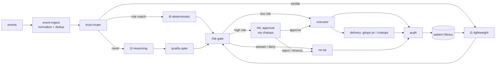

# 프로젝트 구조

이 시스템은 하나의 웹 앱이 아니라 **headless 컨트롤 플레인 + 얇은 콘솔 + ChatOps** 입니다
([app-shape.instructions.md](../../.github/instructions/app-shape.instructions.md) 참조).
저장소 레이아웃은 그 형상을 미러링하며 코어 엔진을 UI-agnostic하고 이식 가능하게 유지합니다.
모듈 이름과 컨트롤 루프는
[architecture.instructions.md](../../.github/instructions/architecture.instructions.md) 를
따릅니다.

## 모노레포 레이아웃

```text
aiopspilot/
├── src/aiopspilot/            # Python (3.12+, src-layout); 모노레포 전체가 하나의 언어
│   ├── core/                  # headless 컨트롤 플레인 (UI 없음, 클라우드 SDK 직접 import 없음)
│   │   ├── event_ingest/      # 버스 컨슈머; 이벤트 스키마로 정규화; idempotency key로 dedup; 관련 이벤트를 인시던트로 상관 연결
│   │   ├── trust_router/      # 계산된 신뢰도로 각 이벤트를 T0 | T1 | T2 로 라우팅
│   │   ├── tiers/
│   │   │   ├── t0_deterministic/  # deterministic-engine: policy, checklist, what-if, drift eval
│   │   │   ├── t1_lightweight/    # 임베딩 유사도, 학습된 액션 재사용, 소형 모델 분류
│   │   │   └── t2_reasoning/      # 신규/모호 케이스에만 사용하는 프론티어 모델 추론
│   │   ├── quality_gate/      # mixed-model 교차 검사, verifier, grounding (T2 방어)
│   │   ├── risk_gate/         # 리스크 스코어링; auto vs HIL; 4개 안전 불변식 강제
│   │   ├── executor/          # 리소스별 락, 딜리버리 어댑터로 멱등 적용
│   │   ├── audit/             # append-only 감사 로그, 추적 상태, KPI/메트릭 발행
│   │   └── assurance_twin/    # 읽기 전용 온톨로지 트윈: text-to-query 리뷰 / Q&A / assessment (제안만, 실행 안 함)
│   ├── shared/                # 크로스컷팅; core/ 로부터 import 금지
│   │   ├── contracts/         # models.py + registry.py + validation.py + JSON 스키마들
│   │   │   ├── event/         # event/schema.json
│   │   │   ├── action/        # action/schema.json
│   │   │   ├── rule/          # rule/schema.json
│   │   │   └── ontology/      # object-type / link-type / action-type JSON 스키마
│   │   ├── providers/         # CSP-중립 클라우드 프로바이더 인터페이스 (어댑터가 구현)
│   │   │                      #   event_bus.py, secret_provider.py, state_store.py,
│   │   │                      #   workload_identity.py, inventory.py
│   │   ├── streaming/         # SSE broadcaster (Kafka → 외부 text/event-stream 릴레이)
│   │   ├── telemetry/         # 구조화 로깅, 트레이싱, 메트릭 헬퍼
│   │   └── config/            # config 스키마 + 시작 시 검증 (fail-fast)
│   ├── delivery/              # 액션 딜리버리 어댑터 (공유 인터페이스 뒤)
│   │   ├── gitops_pr/         # remediation-pr 어댑터: GitHub App / Azure DevOps, Checks API
│   │   └── chatops/           # 채널 어댑터 (Teams / Slack / email / webhook / pager / SMS)
│   └── rule_catalog/          # rule-catalog 파이프라인 코드
│       ├── schema/            # 규칙 스키마 (semver) + 검증
│       ├── sources/           # 소스별 컴렉터 (WAF, CIS, OPA, IaC scanners, ...)
│       └── pipeline/          # watch → collect → shadow eval → regression → promote/rollback
├── src/aiopspilot/composition.py  # composition root: default_container() 가 모든 seam 을 바인딩
├── src/aiopspilot/core/control_loop.py  # P1 파이프라인 오케스트레이터: event_ingest → trust_router → T0 → executor → audit
├── rule-catalog/              # catalog-as-code 데이터 (YAML) - Python 아님; 파이프라인은 src/aiopspilot/rule_catalog/ 에
│   ├── schema/                # JSON Schema 정의 (데이터)
│   ├── vocabulary/            # canonical CSP-중립 어휘 (resource-types.yaml, ...)
│   ├── action-types/          # 온톨로지 ActionType 인스턴스 (shadow-default, promotion_gate 필수)
│   ├── exemptions/            # 시간-바운드 감사된 예외 아티팩트
│   └── sources/               # 소스별 규칙 스냅샷 + provenance
├── policies/                  # T0와 verifier가 소비하는 OPA/Rego policy-as-code
├── infra/                     # IaC: Terraform (HCL); 엔트리 커맨드 `terraform apply`
│   ├── modules/
│   │   ├── resource-group/          # rg-aiopspilot; deploy-and-onboard-ko.md 에 따라 CAF 명명
│   │   ├── identity/                # executor 를 위한 user-assigned Managed Identity
│   │   ├── compute/                 # runtime seam - 대안은 형제 폴더에
│   │   │   └── container-apps/      # 기본 (Consumption + KEDA)
│   │   ├── state-store/             # audit + KPI + pgvector
│   │   │   └── postgres-flex/       # 기본
│   │   ├── event-bus/               # Kafka 와이어
│   │   │   └── event-hubs-kafka/    # 기본 (Event Hubs, :9093)
│   │   ├── secret-store/            # env + Key Vault reference 브릿지
│   │   │   └── key-vault/           # 기본
│   │   └── observability/           # Log Analytics + 여기 바인딩된 App Insights
│   │       └── log-analytics/       # 기본
│   └── envs/                        # 환경별 tfvars (git-ignored; 커밋 금지)
│       ├── dev/
│       ├── staging/
│       └── prod/
├── console/                   # 읽기 전용 얇은 SPA (Vite + Preact) - KPI/감사/HIL 큐
│   ├── src/                    # main.tsx, app.tsx, api.ts, auth.ts (MSAL.js), routes/
│   ├── index.html              # Vite 진입점
│   ├── package.json            # 의존: preact, @azure/msal-browser
│   └── vite.config.ts          # 빌드 → console/dist/ (git-ignored)
├── ui/                        # (미래) 정적 UI 킷 (Calm Slate 테마) - placeholder
├── tests/                     # 크로스-서브시스템 회귀 스위트 + 공유 픽스처
├── docs/roadmap/              # 이 로드맵과 설계 문서
├── pyproject.toml             # Python 모노레포의 단일 매니페스트
└── .github/                   # instructions/ 와 workflows/ (CI: lint, secret-scan, coverage)
```

> 디렉토리 이름은 정본 어휘(canonical vocabulary)입니다. 모듈 이름은
> [language.instructions.md](../../.github/instructions/language.instructions.md) 의 도메인
> 용어 (`trust-router`, `deterministic-engine`, `rule-catalog`, `risk-gate`,
> `remediation-pr`, `shadow-mode`, `HIL`) 와 정렬해서 유지하세요. 단위 테스트는 각 서브시스템과
> 같은 위치에 두고, `tests/` 에는 크로스-서브시스템 회귀와 property 스위트만 둡니다.

## 모듈 경계(Module Boundaries)

의존 방향은 엄격하게 단방향이며, 위반은 리뷰 블로커입니다.

- **core는 이식 가능**: 어떤 클라우드 SDK도 직접 import 하지 **않습니다**. 클라우드 특이성은
  `shared/providers/` 의 CSP-중립 인터페이스로만 진입하며, 구현은 `delivery/` 와 `infra/`
  에 있고 조립 시점에 주입됩니다. 이렇게 두 번째 클라우드는 어댑터 추가일 뿐이며 `core/` 편집이
  아닙니다.
- **허용된 import**: `core/` 는 `shared/` (contracts, providers, telemetry, config)만 import
  가능; `delivery/`, `infra/`, `console/` 은 `shared/` contracts에 의존 가능하지만 `core/`
  내부에는 의존 불가; `shared/` 는 `core/` 로부터 아무것도 import 하지 않음(순환 없음).
- **정책과 규칙은 코드 경로가 아닌 데이터**: T0가 런타임에 `rule-catalog/` 엔트리와 `policies/`
  를 로드하므로 규칙/정책 추가에 엔진 변경이 필요 없습니다. 규칙은 의도와 remediation을
  기술하고, 정책은 verifier가 재검사하는 실행 가능한 OPA/Rego입니다. 소스가 이 YAML로 수집·
  정규화되는 방법은
  [rule-catalog-collection-ko.md](rule-catalog-collection-ko.md) 에 있습니다.
- **delivery는 교체 가능**: `gitops-pr` 와 `chatops` 는 하나의 인터페이스 뒤의 어댑터라,
  executor는 추상 액션을 발행하고 어댑터가 그것을 렌더링합니다(remediation-pr, Adaptive Card).
  executor가 유일한 privileged identity를 보유하며 어댑터는 이를 공유하지 않습니다.
- **console은 읽기 전용**: 상태, 감사, shadow 결과, HIL 큐를 시각화하지만 privileged 호출을
  발행하지 않고 액션을 실행하지 않습니다. HIL 승인은 ChatOps 또는 remediation-pr로 흐르며,
  콘솔 버튼으로 절대 흐르지 않습니다
  ([security-and-identity-ko.md](security-and-identity-ko.md) 참조).

## 의존성 주입을 통한 커스터마이제이션

이 저장소는 **메인 프로젝트** 입니다. 고객별 커스터마이제이션은 **의존성 주입(DI)** 으로
공급되며, `core/` 편집이나 분기 사본 유지가 아닙니다. 상류 저장소는 인터페이스를 정의하고
범용 기본 구현을 제공하며, 포크는 조립 루트(composition root)에서 **자신의 구현을 등록**
합니다. 커스터마이제이션은 추가적(additive)이며 상류 동기화는 깨끗하게 유지됩니다
([generic-scope.instructions.md](../../.github/instructions/generic-scope.instructions.md) 의
포크 모델 참조).

- **Composition root**: `core/` 는 `shared/` 의 CSP-중립 인터페이스에만 의존합니다.
  얇은 조립 루트(`core/` 밖)가 시작 시 구체 구현을 바인딩합니다. `core/` 는 절대 구체
  어댑터를 new-up 하지 않고 의존성을 주입받습니다. 상류 기본 바인더는
  [`aiopspilot.composition.default_container`](../../src/aiopspilot/composition.py) 이며,
  포크의 엔트리 포인트는 해당 바인딩을 감싸거나 교체하는 자체 팩토리를 호출합니다.
  구체 어댑터 클래스(예: `PackageResourceSchemaRegistry`, `JsonSchemaContractValidator`)
  는 public 서브-패키지에서 re-export **되지 않습니다**; 해당 서브모듈에서 직접, 그리고
  조립 루트에서만 import 되어야 하므로 `core/` 가 실수로 구체에 의존할 수 없습니다. 상류 기본 바인더는
  [`aiopspilot.composition.default_container`](../../src/aiopspilot/composition.py) 이며,
  포크의 엔트리 포인트는 해당 바인딩을 감싸거나 교체하는 자체 팩토리를 호출합니다.
  구체 어댑터 클래스(예: `PackageResourceSchemaRegistry`, `JsonSchemaContractValidator`)
  는 public 서브-패키지에서 re-export **되지 않습니다**; 해당 서브모듈에서 직접, 그리고
  조립 루트에서만 import 되어야 하므로 `core/` 가 실수로 구체에 의존할 수 없습니다.
- **Config-기반 바인딩**: 어떤 구현이 어떤 인터페이스에 바인딩되는지는 설정으로 선택됩니다.
  포크는 core를 패치하지 않고 자신의 패키지 + 설정을 공급함으로써 바인딩을 오버라이드합니다.
  잘못되거나 누락된 바인딩은 시작 시 **fail fast** 합니다(Configuration Model).
- **상류의 기본 구현**: 메인 저장소는 모든 seam에 대해 동작하는 범용 기본 구현을 제공하여
  독립 실행 가능합니다. 포크는 필요한 seam만 교체합니다.

### 주입 가능한 Seams

아래 **CSP-중립성 계약** 으로 표시된 네 개의 seam 은 [csp-neutrality-ko.md](csp-neutrality-ko.md)
의 와이어 수준 계약을 구현합니다. `core/` 는 인터페이스만 봅니다; fork 또는 미래의 비-Azure
phase 는 `core/` 를 편집하지 않고 composition root 에서 새 구현을 등록합니다.

| Seam | 인터페이스 (`shared/`) | 계약 | 기본 (상류) | 포크 오버라이드 예시 |
|------|-----------------------|-----|-------------|---------------------|
| Event bus | `EventBus` (Kafka 프로듀서/컨슈머) | **CSP-중립성 계약** - [이벤트버스](csp-neutrality-ko.md#1-이벤트버스-계약--kafka-와이어-프로토콜) | SASL/OAUTHBEARER (Entra 토큰 소스) 를 사용하는 librdkafka 기반 클라이언트 | AWS IAM SigV4 인증, GCP IAM 인증, Confluent SASL/PLAIN, self-hosted Kafka mTLS |
| Runtime | `RuntimeAdapter` (OCI + Knative 호환 매니페스트 렌더링) | **CSP-중립성 계약** - [런타임](csp-neutrality-ko.md#2-런타임-계약--oci-이미지--knative-호환-매니페스트) | Container Apps IaC 렌더러 (Bicep/Terraform) | Cloud Run YAML, App Runner service, 어떤 K8s 위의 Knative Service |
| Secret & config | `SecretProvider` / `ConfigProvider` | **CSP-중립성 계약** - [시크릿](csp-neutrality-ko.md#3-시크릿-계약--환경변수--k8s-secret) | env + Container Apps KV-reference 브릿지 | ESO + Key Vault / AWS Secrets Manager / GCP Secret Manager / HashiCorp Vault |
| Workload identity | `WorkloadIdentity` (audience-scoped OIDC 토큰) | **CSP-중립성 계약** - [워크로드 아이덴티티](csp-neutrality-ko.md#4-워크로드-아이덴티티-계약--oidc-토큰) | user-assigned Managed Identity (IMDS → Entra 토큰) | IRSA, GCP Workload Identity Federation, SPIFFE/SPIRE SVID |
| Cloud provider | provider client | (위 네 개를 사용) | reference/generic Azure 어댑터 | 특정 CSP 어댑터 |
| **Schema source** | `SchemaRegistry` (원시 JSON Schema 로더) | - | `PackageResourceSchemaRegistry` (패키지 내장 스키마) | 원격 schema-registry 어댑터; content hash 로 핀된 스냅샷 |
| **Boundary validation** | `ContractValidator` / `EventValidator` (fail-closed 입력 검사) | - | `JsonSchemaContractValidator` + `JsonSchemaEventValidator` (draft-2020-12) | 포크가 `core/` 편집 없이 도메인 특이 체크(예: 소스 allowlist) 추가 가능 |
| Rule / policy source | rule-catalog + `policies/` 로더 | - | 번들된 범용 규칙 | 고객 규칙 세트 / 임계값 |
| Delivery adapter | delivery 인터페이스 | - | `gitops-pr` / `chatops` | 다른 PR 호스트 / 채팅 채널 |
| Risk scoring & thresholds | risk-gate config | - | 범용 임계값 | 고객 리스크 정책 |
| Model provider | model client (capability별) | - | 설정된 기본 엔드포인트 | 고객 승인 모델 |
| **실시간 아웃바운드 스트림** | `SseSink` (async publish + async-iterator subscribe, SSE 페이로드) | - | `InMemorySseSink` (테스트/데브); HTTP `text/event-stream` 어댑터는 콘솔 read-only 표면과 함께 랜딩 | 양방향 표면이 필요하면 WebSocket 어댑터로 교체; 헤드리스 observer는 webhook 전용. `shared/streaming/SseBroadcaster` 가 `EventBus` 토픽을 채널로 릴레이. |
| **콘솔 read 패널** | `ReadPanel` (`delivery/read_api/panels.py`) | - | 코어 라우트만 (`/audit`, `/kpi`, `/hil-queue`); `ExampleFinOpsPanel` 은 참조용으로 제공되지만 UI 최소화를 위해 **미등록** | 포크가 `ReadApiConfig.extra_panels` (각각 GET 전용 라우트로 래핑, 빌드 시 path 검증) + 콘솔 `panels.tsx` 레지스트리 항목으로 버티컬 대시보드(FinOps 비용, 드리프트 보드, DR 드릴 이력) 추가 |
| **Infra module** | `infra/modules/<seam>/` (Terraform 서브-모듈, `var.<seam>_kind` 로 선택) | - | Container Apps + PostgreSQL Flex + Event Hubs Kafka + Key Vault + Log Analytics | [csp-neutrality-ko.md § 승인된 대안 Azure 구현](csp-neutrality-ko.md#승인된-대안-azure-구현approved-alternative-azure-implementations) 에 따라 다른 서브-모듈 선택; 모듈의 output 계약은 고정 유지 |

모든 seam이 주입되는 인터페이스이므로 고객 추가나 두 번째 클라우드는 구현 등록 문제입니다 -
위의 엄격한 단방향 의존 방향이 보존됩니다.

**동시성 자세**: 다섯 개의 **I/O provider Protocol** - `EventBus`, `StateStore`,
`SecretProvider`, `WorkloadIdentity`, `Inventory` - 은 **기본 async** 입니다. 구체 구현 (Kafka
클라이언트, asyncpg, Key Vault HTTP, OIDC 토큰 교환, ARG/HTTP 인벤토리 쿼리) 을 sync 로
강제하면 event loop 를 블록합니다.
**CPU / startup seam** - `SchemaRegistry`, `ContractValidator` / `EventValidator`,
`ConfigProvider` - 은 **sync 유지**: 시작 시 한 번 실행되거나, I/O 없는 순수 CPU 경계
검증이므로 async 래퍼는 노이즈만 추가합니다. 테스트는 `pytest-asyncio` + `asyncio_mode =
"auto"` 로 실행되어 평범한 `async def test_...` 가 per-test 마커 없이 동작합니다.

## 컨트롤 루프 배선

모든 종단 경로(reject, HIL timeout, abstain, deny 포함)는 감사 엔트리를 기록합니다. T2
출력은 quality-gate를 통과한 후에만 risk-gate에 도달합니다.



## Configuration Model

- 환경 특이 정보는 모두 **설정** 이며 런타임에 주입됩니다(환경 변수, secret store 참조,
  설정 파일). 소스에는 어떤 고객·테넌트·환경 값도 없습니다.
- 설정은 시작 시 `shared/config/` 스키마로 검증되며, 잘못되거나 누락된 필수 설정에 대해 **fail
  fast** - degraded 상태로 시작하지 않습니다.
- 시크릿은 주입된 provider를 통해 읽으며, import 시점 전역 읽기 절대 금지, 로그·감사·에러
  메시지에 절대 쓰지 않습니다.
- 포크는 `core/` 편집 없이 자체 설정과 secret-store 레이어를 공급합니다.
- 기능 플래그는 신규 능력이 **shadow-mode** (judge-and-log only)로 출시되도록 게이팅하고,
  액션별 enforce 승격은 별도의 리뷰된 변경으로 진행합니다.

## 저장소 관례(Repository Conventions)

- **Python (3.12+)이 모노레포 전체의 단일 코어 런타임 언어입니다**; 모든 실행 코드는
  `src/aiopspilot/` 아래에 있습니다 (Python "src layout"). 근거와 선택 필기는
  [tech-stack-ko.md § OD-1](tech-stack-ko.md#od-1-core-런타임-언어) 에 있습니다. Python이
  아닌 트리: [rule-catalog/](../../rule-catalog/) (YAML 데이터), [policies/](../../policies/)
  (Rego), [infra/](../../infra/) (Terraform HCL).
- 리포 루트에 **하나의 lockfile** (`uv.lock` 또는 동등물); CI는 lockfile에서만 설치합니다.
  서브시스템별 lockfile 지침은 다언어 레이아웃 초안에 해당했던 것으로 Python 모노레포 에서는
  폐지되었습니다. 서브시스템 간 경계는 별도 패키지 설치가 아닌 CI 의 import-lint 게이트로
  강제됩니다.
- 계약(event, action, rule 스키마와 온톨로지 `ObjectType` / `LinkType` / `ActionType`
  정의)은 `src/aiopspilot/shared/contracts/` (타입)와 `rule-catalog/schema/` (kind별
  JSON Schema)에 있으며 **semver** 버전을 갖고, 메이저 안에서는 backward-compatible
  하게만 변경됩니다; breaking change는 메이저를 올리고 마이그레이션 노트를 제공합니다. 이들
  타입의 런타임 인스턴스 저장은
  [llm-strategy-ko.md § Ontology Storage Layout](llm-strategy-ko.md#ontology-storage-layout)
  에서 다룹니다.
- `src/aiopspilot/core/tiers/t0_deterministic` (deterministic-engine)과
  `src/aiopspilot/core/risk_gate` 의 테스트는 안전 코어입니다: ≥ 90% 커버리지 게이트를
  유지하고 "high-risk는 절대 auto-execute 하지 않는다", "shadow-mode는 절대 변형하지 않는다",
  "액션 재적용은 no-op이다"를 단언하는 property-based 테스트를 포함합니다. 모든 액션
  경로는 shadow-mode 테스트와 rollback 테스트를 갖습니다.
- 규칙과 정책 변경은 회귀 테스트와 함께 나갑니다. `src/aiopspilot/rule_catalog/pipeline/`
  승격 게이트는 실패한 회귀 스위트나 정책 위반 escape가 있으면 블록됩니다.
- CI는 위에서 참조된 게이트(포매터/린터, secret scan, dependency audit, coverage, regression)
  를 리뷰 전에 강제합니다;
  [coding-conventions.instructions.md](../../.github/instructions/coding-conventions.instructions.md)
  참조.
