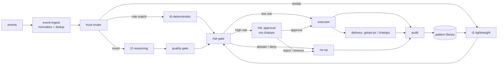

# 프로젝트 구조

이 시스템은 하나의 웹 앱이 아니라 **headless 컨트롤 플레인 + 얇은 콘솔 + ChatOps** 입니다
([app-shape.instructions.md](../../.github/instructions/app-shape.instructions.md) 참조).
저장소 레이아웃은 그 형상을 미러링하며 코어 엔진을 UI-agnostic하고 이식 가능하게 유지합니다.
모듈 이름과 컨트롤 루프는
[architecture.instructions.md](../../.github/instructions/architecture.instructions.md) 를
따릅니다.

## 모노레포 레이아웃

```text
fdai/
├── src/fdai/            # Python (3.12+, src-layout); 모노레포 전체가 하나의 언어
│   ├── core/                  # headless 컨트롤 플레인 (UI 없음, 클라우드 SDK 직접 import 없음)
│   │   ├── event_ingest/       # 버스 컨슈머; 이벤트 스키마로 정규화; idempotency key로 dedup; 관련 이벤트를 인시던트로 상관 연결
│   │   ├── trust_router/       # 계산된 신뢰도로 각 이벤트를 T0 | T1 | T2 로 라우팅
│   │   ├── tiers/
│   │   │   ├── t0_deterministic/    # deterministic-engine: policy, checklist, what-if, drift eval
│   │   │   ├── t1_lightweight/      # 임베딩 유사도, 학습된 액션 재사용, 소형 모델 분류
│   │   │   └── t2_reasoning/        # 신규/모호 케이스에만 사용하는 프론티어 모델 추론
│   │   ├── prompts/            # catalog-as-code 프롬프트 컴포저 (`rule-catalog/prompts/` 로드, T2에 공급)
│   │   ├── tools/              # T2 툴 카탈로그 레지스트리 + `ToolExecutor` (shadow-mode 게이팅)
│   │   ├── web_search/         # 최후 수단 웹 검색 seam (`NoOpWebSearchProvider` 기본; 도메인 allowlist + sanitizer)
│   │   ├── operator_memory/    # HIL 승인된 오퍼레이터 메모리를 untrusted `<operator_note>` 데이터로 주입
│   │   ├── quality_gate/       # mixed-model 교차 검사, verifier, grounding (T2 방어)
│   │   ├── rca/                # 루트 원인 분석 (T0 deterministic + seam 뒤의 T2 reasoner; grounding-gated)
│   │   ├── risk_gate/          # 통합 authority: 리스크 스코어 + auto vs HIL vs deny; 4개 안전 불변식 강제
│   │   ├── rbac/               # 리드 API 를 위한 사람 RBAC (5개 롤 매트릭스, resolver, enforcer)
│   │   ├── hil_resume/         # HIL 승인 라운드트립: park, 채널로 push, 결정 시 resume
│   │   ├── executor/           # 리소스별 락, 딜리버리 어댑터로 멱등 적용
│   │   ├── audit/              # append-only 해시 체인 감사 로그 + KPI/메트릭 발행
│   │   ├── notifications/      # notifications matrix 위에 얹은 채널 라우팅 레이어
│   │   ├── detection/          # 아웃-오브-밴드 anomaly / forecast 파인딩 프로듀서 (event-ingest 로 재진입)
│   │   ├── incident/           # 인시던트 라이프사이클 레지스트리 + 상태 머신 (open → triaging → mitigated → resolved → closed)
│   │   ├── slo/                # 워크로드 SLO / burn-rate 평가기 (컨트롤 플레인 SLO 와는 구분)
│   │   ├── runbook/            # 런북 오케스트레이터 (선형 시퀀스 + on-failure 브랜치)
│   │   ├── workflow/           # 프로세스 자동화: 카탈로그 Workflow 를 Runbook 으로 컴파일 (+ saga 보상 맵); 승인 플래너 + shadow 오케스트레이터 + 트리거 인덱스 + 이벤트 코디네이터
│   │   ├── postmortem/         # LLM 옵션 postmortem / PIR 드래프트 생성기
│   │   ├── rule_catalog_profiles/  # 프로파일 / 팩 레이어 - 이름 붙은 룰 번들 (`extends` 체인 + overrides)
│   │   ├── measurement/        # Phase-4 지속 측정 (regression, pattern growth, model tracking, latency budget, prompt probe, runners)
│   │   ├── deploy_preflight/   # 배포 전 feasibility 프로브 → grounded readiness 리포트
│   │   ├── assurance_twin/     # 읽기 전용 온톨로지 트윈: text-to-query 리뷰 / Q&A / assessment (제안만, 실행 안 함)
│   │   ├── conversation/       # 오퍼레이터 콘솔 코디네이터 (Layer 2): 자연어 턴 → 하나의 read-only 툴 콜
│   │   ├── verticals/          # Resilience / Change Safety / Cost Governance (P3 통합 지점); 각 vertical 은 sub-package (G-6) 로 자체 orchestrator + 서브모듈 을 갖고, 공유 `Vertical` Protocol 은 `base.py`, `VerticalRegistry` seam 도 함께
│   │   ├── control_loop.py     # P1 파이프라인 오케스트레이터: event_ingest → trust_router → T0 → executor → audit
│   │   └── ontology_explorer.py    # 로드된 ObjectType / LinkType 카탈로그를 결정론적 Mermaid 로 렌더
│   ├── shared/                # 크로스컷팅; core/ 로부터 import 금지
│   │   ├── contracts/          # models.py + registry.py + validation.py + JSON 스키마들
│   │   │   ├── event/          # event/schema.json
│   │   │   ├── action/         # action/schema.json
│   │   │   ├── rule/           # rule/schema.json
│   │   │   ├── ontology/       # object-type / link-type / action-type JSON 스키마
│   │   │   └── workflow/       # workflow/schema.json (프로세스 자동화 카탈로그)
│   │   ├── ontology/           # 런타임 온톨로지 헬퍼 (ACL, 감사 purposes, purpose taxonomy)
│   │   ├── providers/          # CSP-중립 클라우드 프로바이더 인터페이스 (어댑터가 구현)
│   │   │                       #   event_bus.py, secret_provider.py, state_store.py,
│   │   │                       #   workload_identity.py, inventory.py + LLM / 채널 / RBAC / feasibility-probe seam
│   │   │                       # `providers/local/` = dev-mode 페이크 (`EnvSecretProvider`, `LocalWorkloadIdentity`, `FileFixtureInventory`);
│   │   │                       # `providers/testing/` = 테스트 스위트 전반에서 쓰이는 인-메모리 페이크 (prod 에서는 바인딩 안 됨)
│   │   ├── streaming/          # `SseBroadcaster` + `StagePublisher`: EventBus 토픽을 SSE 채널로 릴레이
│   │   ├── telemetry/          # 구조화 로깅, 트레이싱, 메트릭 헬퍼
│   │   └── config/             # config 스키마 + 시작 시 검증 (fail-fast)
│   ├── delivery/              # 액션 딜리버리 어댑터 (공유 인터페이스 뒤)
│   │   ├── gitops_pr/          # remediation-pr 어댑터: GitHub App / Azure DevOps, Checks API
│   │   ├── chatops/            # 채널 어댑터 (Teams / Slack / email / webhook / pager / SMS)
│   │   ├── notifications/      # 채널별 sender (email HTTP, HIL sink) - `shared/providers` seam 이 배선
│   │   ├── persistence/        # `shared/providers` 상태 seam 의 Postgres / pgvector 구체 구현
│   │   ├── azure/              # Azure 전용 SDK 어댑터 (`azure-*` import 이 허용된 유일한 트리)
│   │   ├── read_api/           # 얇은 GET-only ASGI - `main.py` 는 routes/ + streaming/ 서브패키지를 조립 (G-5, 트래커 #14). `routes/` 는 HTTP surface 당 한 모듈 (audit, kpi, hil, rule-catalog, ontology-graph, panels, promotion-gates, reporting, workflow-authoring, console-action, what-if, blast-radius, bitemporal, llm-cost, measurement-summary, pantheon, demo-findings, rule-fire-trace); `streaming/` 은 세 개의 SSE fan-out (live_stream, live_control_loop, provision_stream); `dev/` 는 `local.py` (구 `_local.py`) 로 dev 전용이며 프로덕션 컨테이너 이미지에서 제외; `auth.py` / `entra_verifier.py` / `read_model.py` 는 공유 인프라로 최상위 유지
│   │   └── provisioning/       # surface-A Genesis 부트스트랩: 순수 `terraform_bridge.py` (terraform `-json` → `provision.*`) + `serve.py` harness (`aiter_json_lines` + `pump_provision_events`, I/O 주입, subprocess 없음)
│   ├── rule_catalog/          # rule-catalog 파이프라인 코드
│   │   ├── schema/             # 룰 + 온톨로지 (ObjectType / LinkType / ActionType) 스키마 + 검증
│   │   ├── sources/            # 소스별 컬렉터 (WAF, CIS, OPA, IaC scanners, ...)
│   │   ├── pipeline/           # watch → collect → shadow eval → regression → promote/rollback
│   │   └── codegen/            # 저작 헬퍼 (`new_action_type`, `new_object_type`) - 스캐폴드 생성만, 라이브 카탈로그 변경 안 함
│   ├── agents/                # 판테온 런타임 - 15개 이름있는 에이전트 모듈 (odin / thor / forseti / huginn / heimdall / ...), 타입드 토픽 + 버스, 어댑터 + 레지스트리; [agent-pantheon-ko.md](agent-pantheon-ko.md) 참조
│   ├── composition.py         # composition root: `default_container()` 가 모든 seam 을 바인딩
│   └── __main__.py            # 진입점 (P1 컨트롤 루프 기동)
├── rule-catalog/              # catalog-as-code 데이터 (YAML) - Python 아님; 파이프라인은 src/fdai/rule_catalog/ 에
│   ├── schema/                 # JSON Schema 정의 (데이터)
│   ├── vocabulary/             # canonical CSP-중립 어휘: resource-types.yaml, object-types/, link-types/
│   ├── action-types/           # 업스트림 온톨로지 ActionType 인스턴스 (shadow-default, promotion_gate 필수)
│   ├── action-types-custom/    # 포크 전용 ActionType 추가 (업스트림 CI 에서 deny-list)
│   ├── action-types-overrides/ # 업스트림 ActionType 의 스코프 오버라이드 (≤ resource-group 스코프)
│   ├── profiles/               # 이름 붙은 룰 팩 (업스트림)
│   ├── profiles-overrides/     # profiles 의 포크 오버레이
│   ├── prompts/                # catalog-as-code 프롬프트 조각 (태스크 팩, 툴, 페르소나)
│   ├── remediation/            # remediation-plan 아티팩트
│   ├── operator-console/       # `SystemConsoleTool` descriptor 번들
│   ├── probes/                 # deploy-preflight feasibility 프로브 descriptor
│   ├── catalog/                # 정규화된 룰 (promotion 후, catalog-of-record)
│   ├── collected/              # 정규화 전 원본 업스트림 소스 스냅샷
│   ├── exemptions/             # 시간-바운드 감사된 예외 아티팩트
│   ├── sources/                # 소스별 룰 스냅샷 + provenance
│   ├── llm-registry.yaml       # capability 별 LLM 바인딩 레지스트리 (데이터, composition 시점에 해석)
│   └── risk-classification.yaml # authoritative first-match 리스크 분류 테이블 (risk-classification-ko.md 참조)
├── policies/                  # T0와 verifier가 소비하는 OPA/Rego policy-as-code
├── infra/                     # IaC: Terraform (HCL); 엔트리 커맨드 `terraform apply`
│   ├── modules/
│   │   ├── resource-group/          # rg-fdai; deploy-and-onboard-ko.md 에 따라 CAF 명명
│   │   ├── identity/                # executor 를 위한 user-assigned Managed Identity
│   │   ├── compute/                 # runtime seam - 대안은 형제 폴더에
│   │   │   └── container-apps/      # 기본 (Consumption + KEDA)
│   │   ├── container-registry/      # compute 이미지용 ACR
│   │   ├── state-store/             # audit + KPI + pgvector
│   │   │   └── postgres-flex/       # 기본
│   │   ├── event-bus/               # Kafka 와이어
│   │   │   └── event-hubs-kafka/    # 기본 (Event Hubs, :9093)
│   │   ├── secret-store/            # env + Key Vault reference 브릿지
│   │   │   └── key-vault/           # 기본
│   │   ├── observability/           # Log Analytics + 여기 바인딩된 App Insights
│   │   │   └── log-analytics/       # 기본
│   │   ├── llm/                     # 배포자 스코프 LLM 프로비저닝 (dev-and-deploy parity 계약)
│   │   │   └── azure-openai/        # 기본 Azure OpenAI 디플로이먼트 세트
│   │   ├── measurement-runners/     # 자동 regression + pattern-growth 러너용 Container Apps Jobs
│   │   ├── preflight-toggles/       # preflight blocker 를 Terraform 토글로 매핑하는 피처 플래그 표면
│   │   └── console/                 # 읽기 전용 SPA 를 호스팅하는 Static Web App
│   │       └── static-web-app/      # 기본
│   ├── local/                       # 로컬 개발용 IaC (docker-compose, testcontainers 배선; Azure 에 apply 안 함)
│   └── envs/                        # 환경별 tfvars (git-ignored; 커밋 금지)
│       ├── dev/
│       ├── staging/
│       └── prod/
├── console/                   # 읽기 전용 얇은 SPA (Vite + Preact) - KPI/감사/HIL 큐
│   ├── src/                    # main.tsx, app.tsx, api.ts, auth.ts (MSAL.js), routes/
│   ├── index.html              # Vite 진입점
│   ├── package.json            # 의존: preact, @azure/msal-browser
│   └── vite.config.ts          # 빌드 → console/dist/ (git-ignored)
├── cli/                       # operator-console CLI (Ink) - 뷰모델 하나, 렌더러 여럿
│   ├── src/view-model/         # 표현 중립 브리핑 계약 + 블록 IR + 빌더
│   ├── src/renderers/          # ink (터미널) / text / slack (Block Kit) / teams (Adaptive Card)
│   ├── src/cli.tsx             # 진입점: 브리핑을 한 번 빌드하고 --surface 별로 렌더
│   └── package.json            # 의존: ink, react (tsx로 실행, 빌드 단계 없음)
├── site/                      # Astro / Starlight 문서 사이트 (docs/**/*.md 를 i18n + 검색으로 렌더)
├── ui/                        # (미래) 정적 UI 킷 (Calm Slate 테마) - placeholder
├── tests/                     # 크로스-서브시스템 회귀 스위트 + 공유 픽스처 (단위 테스트는 서브시스템 옆에 배치)
├── docs/roadmap/              # 이 로드맵과 설계 문서
├── pyproject.toml             # Python 모노레포의 단일 매니페스트
└── .github/                   # instructions/ 와 workflows/ (CI: lint, secret-scan, coverage)
```

> 디렉토리 이름은 정본 어휘(canonical vocabulary)입니다. 모듈 이름은
> [language.instructions.md](../../.github/instructions/language.instructions.md) 의 도메인
> 용어 (`trust-router`, `deterministic-engine`, `rule-catalog`, `risk-gate`,
> `remediation-pr`, `shadow-mode`, `HIL`) 와 정렬해서 유지하세요. 단위 테스트는 각 서브시스템과
> 같은 위치에 두고, `tests/` 에는 크로스-서브시스템 회귀와 property 스위트만 둡니다.

## 모듈 경계(Module Boundaries)

의존 방향은 엄격하게 단방향이며, 위반은 리뷰 블로커입니다.

- **core는 이식 가능**: 어떤 클라우드 SDK도 직접 import 하지 **않습니다**. 클라우드 특이성은
  `shared/providers/` 의 CSP-중립 인터페이스로만 진입하며, 구현은 `delivery/` 와 `infra/`
  에 있고 조립 시점에 주입됩니다. 이렇게 두 번째 클라우드는 어댑터 추가일 뿐이며 `core/` 편집이
  아닙니다.
- **허용된 import**: `core/` 는 `shared/` (contracts, providers, telemetry, config)만 import
  가능; `delivery/`, `infra/`, `console/` 은 `shared/` contracts에 의존 가능하지만 `core/`
  내부에는 의존 불가; `shared/` 는 `core/` 로부터 아무것도 import 하지 않음(순환 없음).
- **정책과 규칙은 코드 경로가 아닌 데이터**: T0가 런타임에 `rule-catalog/` 엔트리와 `policies/`
  를 로드하므로 규칙/정책 추가에 엔진 변경이 필요 없습니다. 규칙은 의도와 remediation을
  기술하고, 정책은 verifier가 재검사하는 실행 가능한 OPA/Rego입니다. 소스가 이 YAML로 수집·
  정규화되는 방법은
  [rule-catalog-collection-ko.md](rule-catalog-collection-ko.md) 에 있습니다.
- **delivery는 교체 가능**: `gitops-pr` 와 `chatops` 는 하나의 인터페이스 뒤의 어댑터라,
  executor는 추상 액션을 발행하고 어댑터가 그것을 렌더링합니다(remediation-pr, Adaptive Card).
  executor가 유일한 privileged identity를 보유하며 어댑터는 이를 공유하지 않습니다.
- **console은 읽기 전용**: 상태, 감사, shadow 결과, HIL 큐를 시각화하지만 privileged 호출을
  발행하지 않고 액션을 실행하지 않습니다. HIL 승인은 ChatOps 또는 remediation-pr로 흐르며,
  콘솔 버튼으로 절대 흐르지 않습니다
  ([security-and-identity-ko.md](security-and-identity-ko.md) 참조).

## 구조 CI 게이트

위 경계 규칙을 CI에서 강제하는 네 개의 스크립트가 있으며, 리팩터가 랜딩된 뒤에 드리프트가
슬금슬금 돌아오는 것을 막습니다. 전부 `scripts/` 아래에 있고 CI 파이프라인과 로컬 pre-push
훅에서 모두 실행됩니다. 상응 문서는
[coding-conventions.instructions.md](../../.github/instructions/coding-conventions.instructions.md)
에 있습니다.

| 게이트 | 규칙 | 현재 모드 |
|--------|------|-----------|
| [check-core-imports.sh](../../scripts/check-core-imports.sh) | `core/` 는 클라우드 SDK, HTTP 클라이언트, `fdai.delivery.*` 를 import 금지 | enforce |
| [check-agents-imports.sh](../../scripts/check-agents-imports.sh) | `agents/` 도 같은 집합 금지 | enforce |
| [check-file-loc.sh](../../scripts/check-file-loc.sh) | 400 LOC 초과 시 warn, enforce 모드에서 800 초과 시 fail | warn-only |
| [check-subsystem-fanout.sh](../../scripts/check-subsystem-fanout.sh) | 한 파일이 `core.*` sibling subsystem 을 8개 이상 import 하면 warn, 15개 이상이면 enforce 모드에서 fail | warn-only |

### 새 게이트 추가

1. 기존 스크립트 패턴을 따라 `scripts/check-<name>.sh` 를 작성합니다 (환경변수로 warn/fail
   threshold, 앞선 `#` 정당성 코멘트를 요구하는 allowlist, stale 엔트리 거부,
   GitHub Actions 어노테이션, `CHECK_QUIET=1` 요약 모드).
2. 현재 트리를 깨지 않도록 **warn-only** 로 배포합니다.
3. `.github/workflows/ci.yml` 에 잡을 추가하고 `.githooks/pre-push` 에 호출을 추가합니다.
4. `tests/test_check_structural_gates.py` 에 warn / enforce / threshold override /
   allowlist / stale entry / boundary condition 을 커버하는 회귀 테스트를 추가합니다.
5. `tests/test_structural_gates_drift.py` 에 CI 잡과 pre-push wiring 이 드리프트로 사라지지
   않도록 가드를 추가합니다.

### 게이트 warn -> enforce 승격

1. 현재 warn 베이스라인을 정리하는 리팩터를 랜딩합니다 (트래커 #14).
2. CI 잡에서 게이트의 mode 환경변수를 뒤집습니다 (`FILE_LOC_MODE=enforce` 등).
3. 정당한 예외가 있으면 게이트 allowlist 파일에 H3 규칙 (앞선 `#` 코멘트) 을 지켜 넣습니다.
4. 트리를 통과시키기 위해 threshold를 약화하지 **않습니다**. 파일을 쪼개거나 allowlist에
   기록하세요. 붉은 파이프라인을 풀려고 threshold를 낮추는 것은 거버넌스 회귀입니다.

## 의존성 주입을 통한 커스터마이제이션

이 저장소는 **메인 프로젝트** 입니다. 고객별 커스터마이제이션은 **의존성 주입(DI)** 으로
공급되며, `core/` 편집이나 분기 사본 유지가 아닙니다. 상류 저장소는 인터페이스를 정의하고
범용 기본 구현을 제공하며, 포크는 조립 루트(composition root)에서 **자신의 구현을 등록**
합니다. 커스터마이제이션은 추가적(additive)이며 상류 동기화는 깨끗하게 유지됩니다
([generic-scope.instructions.md](../../.github/instructions/generic-scope.instructions.md) 의
포크 모델 참조).

> **Fork 유지관리자**: 절차적 walkthrough는
> [downstream-fork-guide-ko.md](downstream-fork-guide-ko.md)에서 시작. 이 섹션은
> 그 가이드가 operational 화하는 seam 카탈로그입니다.

- **Composition root**: `core/` 는 `shared/` 의 CSP-중립 인터페이스에만 의존합니다.
  얇은 조립 루트(`core/` 밖)가 시작 시 구체 구현을 바인딩합니다. `core/` 는 절대 구체
  어댑터를 new-up 하지 않고 의존성을 주입받습니다. 상류 기본 바인더는
  [`fdai.composition.default_container`](../../src/fdai/composition.py) 이며,
  포크의 엔트리 포인트는 해당 바인딩을 감싸거나 교체하는 자체 팩토리를 호출합니다.
  구체 어댑터 클래스(예: `PackageResourceSchemaRegistry`, `JsonSchemaContractValidator`)
  는 public 서브-패키지에서 re-export **되지 않습니다**; 해당 서브모듈에서 직접, 그리고
  조립 루트에서만 import 되어야 하므로 `core/` 가 실수로 구체에 의존할 수 없습니다. 상류 기본 바인더는
  [`fdai.composition.default_container`](../../src/fdai/composition.py) 이며,
  포크의 엔트리 포인트는 해당 바인딩을 감싸거나 교체하는 자체 팩토리를 호출합니다.
  구체 어댑터 클래스(예: `PackageResourceSchemaRegistry`, `JsonSchemaContractValidator`)
  는 public 서브-패키지에서 re-export **되지 않습니다**; 해당 서브모듈에서 직접, 그리고
  조립 루트에서만 import 되어야 하므로 `core/` 가 실수로 구체에 의존할 수 없습니다.
- **Config-기반 바인딩**: 어떤 구현이 어떤 인터페이스에 바인딩되는지는 설정으로 선택됩니다.
  포크는 core를 패치하지 않고 자신의 패키지 + 설정을 공급함으로써 바인딩을 오버라이드합니다.
  잘못되거나 누락된 바인딩은 시작 시 **fail fast** 합니다(Configuration Model).
- **상류의 기본 구현**: 메인 저장소는 모든 seam에 대해 동작하는 범용 기본 구현을 제공하여
  독립 실행 가능합니다. 포크는 필요한 seam만 교체합니다.

### 주입 가능한 Seams

아래 **CSP-중립성 계약** 으로 표시된 네 개의 seam 은 [csp-neutrality-ko.md](csp-neutrality-ko.md)
의 와이어 수준 계약을 구현합니다. `core/` 는 인터페이스만 봅니다; fork 또는 미래의 비-Azure
phase 는 `core/` 를 편집하지 않고 composition root 에서 새 구현을 등록합니다.

| Seam | 인터페이스 (`shared/`) | 계약 | 기본 (상류) | 포크 오버라이드 예시 |
|------|-----------------------|-----|-------------|---------------------|
| Event bus | `EventBus` (Kafka 프로듀서/컨슈머) | **CSP-중립성 계약** - [이벤트버스](csp-neutrality-ko.md#1-이벤트버스-계약--kafka-와이어-프로토콜) | SASL/OAUTHBEARER (Entra 토큰 소스) 를 사용하는 librdkafka 기반 클라이언트 | AWS IAM SigV4 인증, GCP IAM 인증, Confluent SASL/PLAIN, self-hosted Kafka mTLS |
| Runtime | `RuntimeAdapter` (OCI + Knative 호환 매니페스트 렌더링) | **CSP-중립성 계약** - [런타임](csp-neutrality-ko.md#2-런타임-계약--oci-이미지--knative-호환-매니페스트) | Container Apps IaC 렌더러 (Bicep/Terraform) | Cloud Run YAML, App Runner service, 어떤 K8s 위의 Knative Service |
| Secret & config | `SecretProvider` / `ConfigProvider` | **CSP-중립성 계약** - [시크릿](csp-neutrality-ko.md#3-시크릿-계약--환경변수--k8s-secret) | env + Container Apps KV-reference 브릿지 | ESO + Key Vault / AWS Secrets Manager / GCP Secret Manager / HashiCorp Vault |
| Workload identity | `WorkloadIdentity` (audience-scoped OIDC 토큰) | **CSP-중립성 계약** - [워크로드 아이덴티티](csp-neutrality-ko.md#4-워크로드-아이덴티티-계약--oidc-토큰) | user-assigned Managed Identity (IMDS → Entra 토큰) | IRSA, GCP Workload Identity Federation, SPIFFE/SPIRE SVID |
| Cloud provider | provider client | (위 네 개를 사용) | reference/generic Azure 어댑터 | 특정 CSP 어댑터 |
| **Schema source** | `SchemaRegistry` (원시 JSON Schema 로더) | - | `PackageResourceSchemaRegistry` (패키지 내장 스키마) | 원격 schema-registry 어댑터; content hash 로 핀된 스냅샷 |
| **Boundary validation** | `ContractValidator` / `EventValidator` (fail-closed 입력 검사) | - | `JsonSchemaContractValidator` + `JsonSchemaEventValidator` (draft-2020-12) | 포크가 `core/` 편집 없이 도메인 특이 체크(예: 소스 allowlist) 추가 가능 |
| Rule / policy source | rule-catalog + `policies/` 로더 | - | 번들된 범용 규칙 | 고객 규칙 세트 / 임계값 |
| **Ontology ObjectType / LinkType** | `src/fdai/rule_catalog/schema/`의 `load_object_type_catalog(root, *, schema_registry)` 및 `load_link_type_catalog(root, *, schema_registry, object_types=...)` | - | upstream ObjectType 4개(`Resource`, `Rule`, `Signal`, `Finding`)와 `rule-catalog/vocabulary/{object-types,link-types}/` 아래의 LinkType들. 엔트리포인트가 `Container.ontology_object_types` / `Container.ontology_link_types`로 주입 | fork는 자체 YAML 디렉토리(예: `fork/vocabulary/object-types/ArchitectureProposal.yaml`)를 추가로 로드해 두 루트를 concatenate 후 `dataclasses.replace(container, ontology_object_types=..., ontology_link_types=...)`로 주입. 두 루트 간 `name` 중복은 fail-close. 자세한 절차는 [downstream-fork-seam-recipes-ko.md § 5.8a](downstream-fork-seam-recipes-ko.md#58a-ontology-object-type--link-type-additions). |
| **Workflow 카탈로그 (프로세스 자동화)** | `src/fdai/rule_catalog/schema/workflow.py`의 `load_workflow_catalog(root, *, schema_registry, action_type_names, rule_ids=...)`; `src/fdai/core/workflow/`의 `compile_workflow(...)` | - | `rule-catalog/workflows/` 아래 shadow-first Workflow들. 엔트리포인트가 ActionType + rule 카탈로그 뒤에 `Container.workflows`로 주입; 모든 스텝이 `ActionType`과 (설정 시) Rule id를 cross-reference, 시작 시 fail-close | fork는 자체 `fork/workflows/` 디렉토리에 Workflow YAML을 추가로 로드해 concatenate한 ActionType / rule 집합과 함께 `dataclasses.replace(container, workflows=...)`로 주입. 두 루트 간 `name` 중복은 fail-close. 자세한 내용은 [process-automation-ko.md](process-automation-ko.md). |
| Delivery adapter | delivery 인터페이스 | - | `gitops-pr` / `chatops` | 다른 PR 호스트 / 채팅 채널 |
| Risk scoring & thresholds | risk-gate config | - | 범용 임계값 | 고객 리스크 정책 |
| Model provider | model client (capability별) | - | 설정된 기본 엔드포인트 | 고객 승인 모델 |
| **실시간 아웃바운드 스트림** | `SseSink` (async publish + async-iterator subscribe, SSE 페이로드) | - | `InMemorySseSink` (테스트/데브); HTTP `text/event-stream` 어댑터는 콘솔 read-only 표면과 함께 랜딩 | 양방향 표면이 필요하면 WebSocket 어댑터로 교체; 헤드리스 observer는 webhook 전용. `shared/streaming/SseBroadcaster` 가 `EventBus` 토픽을 채널로 릴레이. |
| **파이프라인 스테이지 발행자** | `StagePublisher` (`shared/providers/stage_publisher.py`) 의 `emit(StageEvent)` | - | `NullStagePublisher` (기본 - 스테이지 코드가 관찰 사이드이펙트 없이 실행되도록 유지) | 인프로세스 데브 / 단일 레플리카: `SseSinkStagePublisher` 가 `SseSink` 로 바로 fan-out. 멀티 레플리카 프로덕션: `EventBusStagePublisher` 가 Kafka 토픽(기본 `aw.pipeline.stages`) 에 발행하고 기존 `SseBroadcaster` 가 모든 레플리카가 소비하는 SSE 채널로 릴레이. 파이프라인 스테이지 (`event_ingest`, `trust_router`, T0/T1/T2, `risk_gate`, `executor`, `audit`) 가 프로토콜을 받도록 backward-compat - 업스트림 기본은 아무 것도 emit 하지 않음. |
| **콘솔 read 패널** | `ReadPanel` (`delivery/read_api/panels.py`) | - | 코어 라우트만 (`/audit`, `/kpi`, `/hil-queue`); `ExampleFinOpsPanel` 은 참조용으로 제공되지만 UI 최소화를 위해 **미등록** | 포크가 `ReadApiConfig.extra_panels` (각각 GET 전용 라우트로 래핑, 빌드 시 path 검증) + 콘솔 `panels.tsx` 레지스트리 항목으로 버티컬 대시보드(FinOps 비용, 드리프트 보드, DR 드릴 이력) 추가 |
| **LLM 계량(metering)** | `MeteringSink` / `MeteringReader` (`core/metering/sink.py`); `MeteringEmitter` 가 측정된 provider `usage` 기록; 가격은 `rule-catalog/llm-pricing.yaml` 에서 `PricingTable` 로 로드 | - | `InMemoryMeteringSink` (프로세스 수명; 단일-프로세스 데브 하네스 구동). T2 어댑터(`cross_check`, `rca_model`)가 측정된 토큰 + 비용을 emit; `LlmCostPanel` 이 `GET /kpi/llm-cost` 를 대화 / 일 / 월별로 롤업 제공 | 헤드리스 코어와 콘솔은 별도 프로세스이므로, 포크가 **durable** sink 를 `AzureWireOverrides.metering_sink` (코어 프로세스) 에, 대응하는 `MeteringReader` 를 `LlmCostPanel` (read-api 프로세스) 에 주입 - 예: Postgres `agent_transcript` 행 |
| **Infra module** | `infra/modules/<seam>/` (Terraform 서브-모듈, `var.<seam>_kind` 로 선택) | - | Container Apps + PostgreSQL Flex + Event Hubs Kafka + Key Vault + Log Analytics | [csp-neutrality-ko.md § 승인된 대안 Azure 구현](csp-neutrality-ko.md#승인된-대안-azure-구현approved-alternative-azure-implementations) 에 따라 다른 서브-모듈 선택; 모듈의 output 계약은 고정 유지 |

모든 seam이 주입되는 인터페이스이므로 고객 추가나 두 번째 클라우드는 구현 등록 문제입니다 -
위의 엄격한 단방향 의존 방향이 보존됩니다.

**동시성 자세**: 다섯 개의 **I/O provider Protocol** - `EventBus`, `StateStore`,
`SecretProvider`, `WorkloadIdentity`, `Inventory` - 은 **기본 async** 입니다. 구체 구현 (Kafka
클라이언트, asyncpg, Key Vault HTTP, OIDC 토큰 교환, ARG/HTTP 인벤토리 쿼리) 을 sync 로
강제하면 event loop 를 블록합니다.
**CPU / startup seam** - `SchemaRegistry`, `ContractValidator` / `EventValidator`,
`ConfigProvider` - 은 **sync 유지**: 시작 시 한 번 실행되거나, I/O 없는 순수 CPU 경계
검증이므로 async 래퍼는 노이즈만 추가합니다. 테스트는 `pytest-asyncio` + `asyncio_mode =
"auto"` 로 실행되어 평범한 `async def test_...` 가 per-test 마커 없이 동작합니다.

## 컨트롤 루프 배선

모든 종단 경로(reject, HIL timeout, abstain, deny 포함)는 감사 엔트리를 기록합니다. T2
출력은 quality-gate를 통과한 후에만 risk-gate에 도달합니다.



## Configuration Model

- 환경 특이 정보는 모두 **설정** 이며 런타임에 주입됩니다(환경 변수, secret store 참조,
  설정 파일). 소스에는 어떤 고객·테넌트·환경 값도 없습니다.
- 설정은 시작 시 `shared/config/` 스키마로 검증되며, 잘못되거나 누락된 필수 설정에 대해 **fail
  fast** - degraded 상태로 시작하지 않습니다.
- 시크릿은 주입된 provider를 통해 읽으며, import 시점 전역 읽기 절대 금지, 로그·감사·에러
  메시지에 절대 쓰지 않습니다.
- 포크는 `core/` 편집 없이 자체 설정과 secret-store 레이어를 공급합니다.
- 기능 플래그는 신규 능력이 **shadow-mode** (judge-and-log only)로 출시되도록 게이팅하고,
  액션별 enforce 승격은 별도의 리뷰된 변경으로 진행합니다.

## 저장소 관례(Repository Conventions)

- **Python (3.12+)이 모노레포 전체의 단일 코어 런타임 언어입니다**; 모든 실행 코드는
  `src/fdai/` 아래에 있습니다 (Python "src layout"). 근거와 선택 필기는
  [tech-stack-ko.md § OD-1](tech-stack-ko.md#od-1-core-런타임-언어) 에 있습니다. Python이
  아닌 트리: [rule-catalog/](../../rule-catalog/) (YAML 데이터), [policies/](../../policies/)
  (Rego), [infra/](../../infra/) (Terraform HCL).
- 리포 루트에 **하나의 lockfile** (`uv.lock` 또는 동등물); CI는 lockfile에서만 설치합니다.
  서브시스템별 lockfile 지침은 다언어 레이아웃 초안에 해당했던 것으로 Python 모노레포 에서는
  폐지되었습니다. 서브시스템 간 경계는 별도 패키지 설치가 아닌 CI 의 import-lint 게이트로
  강제됩니다.
- 계약(event, action, rule 스키마와 온톨로지 `ObjectType` / `LinkType` / `ActionType`
  정의)은 `src/fdai/shared/contracts/` (타입)와 `rule-catalog/schema/` (kind별
  JSON Schema)에 있으며 **semver** 버전을 갖고, 메이저 안에서는 backward-compatible
  하게만 변경됩니다; breaking change는 메이저를 올리고 마이그레이션 노트를 제공합니다. 이들
  타입의 런타임 인스턴스 저장은
  [llm-strategy-ko.md § Ontology Storage Layout](llm-strategy-ko.md#ontology-storage-layout)
  에서 다룹니다.
- `src/fdai/core/tiers/t0_deterministic` (deterministic-engine)과
  `src/fdai/core/risk_gate` 의 테스트는 안전 코어입니다: ≥ 90% 커버리지 게이트를
  유지하고 "high-risk는 절대 auto-execute 하지 않는다", "shadow-mode는 절대 변형하지 않는다",
  "액션 재적용은 no-op이다"를 단언하는 property-based 테스트를 포함합니다. 모든 액션
  경로는 shadow-mode 테스트와 rollback 테스트를 갖습니다.
- 규칙과 정책 변경은 회귀 테스트와 함께 나갑니다. `src/fdai/rule_catalog/pipeline/`
  승격 게이트는 실패한 회귀 스위트나 정책 위반 escape가 있으면 블록됩니다.
- CI는 위에서 참조된 게이트(포매터/린터, secret scan, dependency audit, coverage, regression)
  를 리뷰 전에 강제합니다;
  [coding-conventions.instructions.md](../../.github/instructions/coding-conventions.instructions.md)
  참조.
