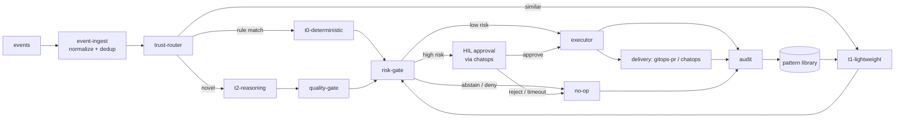

# Project Structure

The system is a **headless control plane + thin console + ChatOps**, not one web app
(see [app-shape.instructions.md](../../.github/instructions/app-shape.instructions.md)).
The repository layout mirrors that shape and keeps the core engine UI-agnostic and portable.
Module names and the control loop follow
[architecture.instructions.md](../../.github/instructions/architecture.instructions.md).

## Monorepo Layout

```text
aiopspilot/
├── src/aiopspilot/            # Python (3.12+, src-layout); one language across the monorepo
│   ├── core/                  # headless control plane (no UI, no direct cloud SDK imports)
│   │   ├── event_ingest/      # bus consumers; normalize to event schema; dedup by idempotency key; correlate related events into incidents
│   │   ├── trust_router/      # routes each event to T0 | T1 | T2 by computed confidence
│   │   ├── tiers/
│   │   │   ├── t0_deterministic/  # deterministic-engine: policy, checklist, what-if, drift eval
│   │   │   ├── t1_lightweight/    # embedding similarity, learned-action reuse, small-model classify
│   │   │   └── t2_reasoning/      # frontier-model reasoning for novel/ambiguous cases only
│   │   ├── quality_gate/      # mixed-model cross-check, verifier, grounding (guards T2)
│   │   ├── risk_gate/         # risk scoring; auto vs HIL; enforces the four safety invariants
│   │   ├── executor/          # per-resource lock, idempotent apply via delivery adapters
│   │   └── audit/             # append-only audit log, tracked state, KPI/metric emission
│   ├── shared/                # cross-cutting; MUST NOT import from core/
│   │   ├── contracts/         # models.py + registry.py + validation.py + JSON Schemas
│   │   │   ├── event/         # event/schema.json
│   │   │   ├── action/        # action/schema.json
│   │   │   ├── rule/          # rule/schema.json
│   │   │   └── ontology/      # object-type / link-type / action-type JSON Schemas
│   │   ├── providers/         # CSP-neutral cloud provider interfaces (adapters implement them)
│   │   ├── telemetry/         # structured logging, tracing, metric helpers
│   │   └── config/            # config schema + startup validation (fail-fast)
│   ├── delivery/              # action delivery adapters (behind one shared interface)
│   │   ├── gitops_pr/         # remediation-pr adapter: GitHub App / Azure DevOps, Checks API
│   │   └── chatops/           # channel adapters (Teams / Slack / email / webhook / pager / SMS)
│   └── rule_catalog/          # rule-catalog PIPELINE code
│       ├── schema/            # rule schema (semver) + validation
│       ├── sources/           # per-source collectors (WAF, CIS, OPA, IaC scanners, ...)
│       └── pipeline/          # watch → collect → shadow eval → regression → promote/rollback
├── src/aiopspilot/composition.py  # composition root: default_container() binds every seam
├── rule-catalog/              # catalog-as-code DATA (YAML) — no Python; pipeline lives in src/aiopspilot/rule_catalog/
│   ├── schema/                # JSON Schema definitions (data)
│   └── sources/               # per-source rule snapshots + provenance
├── policies/                  # OPA/Rego policy-as-code consumed by T0 and the verifier
├── infra/                     # IaC: Terraform (HCL); entry command `terraform apply`
├── console/                   # (future) thin read-only SPA — placeholder
├── ui/                        # (future) static UI kit (Calm Slate theme) — placeholder
├── tests/                     # cross-subsystem regression suites + shared fixtures
├── docs/roadmap/              # this roadmap and design docs
├── pyproject.toml             # single manifest for the Python monorepo
└── .github/                   # instructions/ and workflows/ (CI: lint, secret-scan, coverage)
```

> Directory names are the canonical vocabulary. Keep module names aligned with the domain
> terms in [language.instructions.md](../../.github/instructions/language.instructions.md)
> (`trust-router`, `deterministic-engine`, `rule-catalog`, `risk-gate`, `remediation-pr`,
> `shadow-mode`, `HIL`). Python identifier rules require `snake_case` on disk
> (`event_ingest`, `trust_router`, `rule_catalog`); the kebab-case names above are the
> **logical vocabulary** used in docs, rule ids, config keys, and audit records. Unit
> tests colocate with each subsystem; `tests/` holds only cross-subsystem regression and
> property suites.

## Module Boundaries

Dependency direction is strict and one-way; a violation is a review blocker.

- **core is portable**: it MUST NOT import any cloud SDK directly. Cloud specifics enter
  only through the CSP-neutral interfaces in `shared/providers/`, whose implementations live
  in `delivery/` and `infra/` and are injected at composition time. This keeps a second cloud
  a matter of adding an adapter, never editing `core/`.
- **allowed imports**: `core/` may import `shared/` (contracts, providers, telemetry, config)
  only; `delivery/`, `infra/`, and `console/` may depend on `shared/` contracts but not on
  `core/` internals; `shared/` imports nothing from `core/` (no cycles).
- **policies and rules are data, not code paths**: T0 loads `rule-catalog/` entries and
  `policies/` at runtime; adding a rule or policy never requires an engine change. Rules
  describe intent and remediation; policies are the executable OPA/Rego the verifier re-checks.
  How sources are collected and normalized into that YAML is in
  [rule-catalog-collection.md](rule-catalog-collection.md).
- **delivery is swappable**: `gitops-pr` and `chatops` are adapters behind one interface, so
  the executor emits an abstract action and the adapter renders it (remediation-pr, Adaptive
  Card). The executor holds the only privileged identity; adapters never share it.
- **console is read-only**: it visualizes state, audit, shadow results, and the HIL queue but
  issues no privileged calls and executes no actions. HIL approvals flow through ChatOps or
  the remediation-pr, never through console buttons
  (see [security-and-identity.md](security-and-identity.md)).

## Customization via Dependency Injection

This repository is the **main project**. Per-customer customization is supplied by **dependency
injection**, never by editing `core/` or maintaining a divergent copy of it. The upstream repo
defines the interfaces and ships generic default implementations; a fork **registers its own
implementations** at a composition root, so customization is additive and upstream sync stays
clean (see the fork model in
[generic-scope.instructions.md](../../.github/instructions/generic-scope.instructions.md)).

- **Composition root**: `core/` depends only on the CSP-neutral interfaces in `shared/`. A thin
  composition root (outside `core/`) binds concrete implementations at startup. `core/` never
  news-up a concrete adapter; it receives its dependencies. The upstream default binder is
  [`aiopspilot.composition.default_container`](../../src/aiopspilot/composition.py); a fork's
  entry point calls its own factory that wraps or replaces those bindings. Concrete adapter
  classes (e.g. `PackageResourceSchemaRegistry`, `JsonSchemaContractValidator`) are
  **not** re-exported from public sub-packages; they must be imported directly from their
  submodule, and only by a composition root, so `core/` cannot depend on a concrete by
  accident.
- **Config-driven binding**: which implementation binds to which interface is selected by
  configuration, so a fork overrides a binding by supplying its own package + config, not by
  patching core. Invalid or missing bindings **fail fast** at startup (Configuration Model).
- **Default implementations upstream**: the main repo provides working generic defaults for
  every seam so it runs standalone; a fork replaces only the seams it needs.

### Injectable Seams

The four seams marked **CSP-neutrality contract** below realize the wire-level contracts in
[csp-neutrality.md](csp-neutrality.md). `core/` sees only the interface; a fork or a future
non-Azure phase registers a new implementation at the composition root without editing `core/`.

| Seam | Interface (in `shared/`) | Contract | Default (upstream) | Fork override example |
|------|--------------------------|----------|--------------------|-----------------------|
| Event bus | `EventBus` (Kafka producer/consumer) | **CSP-neutrality contract** — [event bus](csp-neutrality.md#1-event-bus-contract--kafka-wire-protocol) | librdkafka-based client with SASL/OAUTHBEARER (Entra token source) | AWS IAM SigV4 auth, GCP IAM auth, Confluent SASL/PLAIN, self-hosted Kafka mTLS |
| Runtime | `RuntimeAdapter` (renders OCI + Knative-compatible manifest) | **CSP-neutrality contract** — [runtime](csp-neutrality.md#2-runtime-contract--oci-image--knative-compatible-manifest) | Container Apps IaC renderer (Bicep/Terraform) | Cloud Run YAML, App Runner service, Knative Service on any K8s |
| Secret & config | `SecretProvider` / `ConfigProvider` | **CSP-neutrality contract** — [secret](csp-neutrality.md#3-secret-contract--environment--k8s-secret) | env + Container Apps KV-reference bridge | ESO + Key Vault / AWS Secrets Manager / GCP Secret Manager / HashiCorp Vault |
| Workload identity | `WorkloadIdentity` (audience-scoped OIDC token) | **CSP-neutrality contract** — [workload identity](csp-neutrality.md#4-workload-identity-contract--oidc-token) | user-assigned Managed Identity (IMDS → Entra token) | IRSA, GCP Workload Identity Federation, SPIFFE/SPIRE SVID |
| Cloud provider | provider client | (uses the four above) | reference/generic Azure adapter | a specific CSP adapter |
| **Schema source** | `SchemaRegistry` (raw JSON Schema loader) | — | `PackageResourceSchemaRegistry` (schemas ship inside the package) | remote schema-registry adapter; snapshot pinned by content hash |
| **Boundary validation** | `ContractValidator` / `EventValidator` (fail-closed input check) | — | `JsonSchemaContractValidator` + `JsonSchemaEventValidator` (draft-2020-12) | fork MAY layer domain-specific checks (e.g. source allowlist) without editing `core/` |
| Rule / policy source | rule-catalog + `policies/` loader | — | bundled generic rules | customer rule set / thresholds |
| Delivery adapter | delivery interface | — | `gitops-pr` / `chatops` | a different PR host / chat channel |
| Risk scoring & thresholds | risk-gate config | — | generic thresholds | customer risk policy |
| Model provider | model client (per capability) | — | configured default endpoints | customer-approved models |

Because every seam is an injected interface, adding a customer or a second cloud is a matter of
registering an implementation — the strict one-way dependency direction above is preserved.

## Control-Loop Wiring

Every terminal path—including reject, HIL timeout, abstain, and deny—writes an audit entry.
T2 output reaches the risk-gate only after clearing the quality-gate.



## Configuration Model

- Everything environment-specific is **configuration**, injected at runtime (env vars,
  secret store references, config files). No customer, tenant, or environment values in source.
- Config is validated against the `shared/config/` schema at startup; the process **fails fast**
  on invalid or missing required config rather than starting in a degraded state.
- Secrets are read through an injected provider, never a global import-time read, and never
  written to logs, audit entries, or error messages.
- A fork supplies its own config and secret-store layer without editing `core/`.
- Feature flags gate new capabilities so they ship in **shadow-mode** (judge-and-log only)
  and are promoted to enforce per-action, in a separate reviewed change.

## Repository Conventions

- **Python (3.12+) is the single core runtime language** for the whole monorepo; all
  executable code lives under `src/aiopspilot/` (Python "src layout"). Rationale and the
  historical choice matrix are in [tech-stack.md § OD-1](tech-stack.md#od-1-core-runtime-language).
  Non-Python trees are: [rule-catalog/](../../rule-catalog/) (YAML data), [policies/](../../policies/)
  (Rego), and [infra/](../../infra/) (Terraform HCL).
- **One lockfile** at the repo root (`uv.lock` or equivalent); CI installs from the lockfile
  only. The subsystem-per-lockfile guidance in earlier drafts assumed a multi-language
  layout and is retired for the Python monorepo. Boundaries between subsystems are enforced
  by an import-lint gate in CI, not by separate package installs.
- Contracts (event, action, rule schemas, and ontology `ObjectType` / `LinkType` /
  `ActionType` definitions) live in `src/aiopspilot/shared/contracts/` (types) and
  `rule-catalog/schema/` (per-kind JSON Schema), carry a **semver** version, and change
  only in a backward-compatible way within a major version; breaking changes bump the
  major and ship a migration note. Runtime instance storage for those types is covered in
  [llm-strategy.md § Ontology Storage Layout](llm-strategy.md#ontology-storage-layout).
- Tests for `src/aiopspilot/core/tiers/t0_deterministic` (the deterministic-engine) and
  `src/aiopspilot/core/risk_gate` are the safety core: they hold a ≥ 90% coverage gate
  and include property-based tests asserting "high-risk never auto-executes", "shadow-mode
  never mutates", and "re-applying an action is a no-op". Every action path also has a
  shadow-mode test and a rollback test.
- Rule and policy changes ship with a regression test; the
  `src/aiopspilot/rule_catalog/pipeline/` promotion gate blocks on a failing regression
  suite or any policy-violation escape.
- CI enforces the gates referenced above—formatter/linter, secret scanning, dependency audit,
  coverage, and regression—before review; see
  [coding-conventions.instructions.md](../../.github/instructions/coding-conventions.instructions.md).
