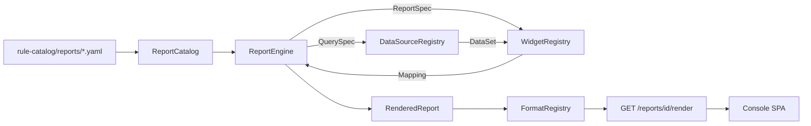

# 리포팅 서브시스템

포크가 FE 계약을 바꾸지 않고도 "어떤 형태의 리포트든" - 시계열
개요, 상위 N개 테이블, 비용 요약, SLO 소진 보드, 시그널 피드
롤업, 보안 사후 분석, 나중에 나올 FE 실험까지 - 만들 수 있게
해주는 선언적·확장 가능한 시각화 파이프라인입니다. 모든 것은 세
개의 레지스트리(datasource / widget / format) + YAML 카탈로그
뒤에 있으며, 새 리포트 추가는 YAML 파일 하나, 새 데이터 소스
추가는 Protocol 구현 하나, 새 시각화 형태 추가는 짧은 순수 함수
하나면 끝입니다.

계약상 read-only입니다. 모든 라우트는 `GET`이며, 어떤 위젯도
아무것도 실행하지 않습니다. 이 서브시스템은 실행자 신원을 절대로
보유하지 않는 콘솔의 pull 절반입니다
([app-shape.instructions.md § Layer Boundaries](../../.github/instructions/app-shape.instructions.md#layer-boundaries-security)).

업계 참고 자료 조사는
[docs/internals/datadog-visualization-surface.md](../internals/datadog-visualization-surface.md)를
보완하며, 여기서 실제로 shipping되는 카탈로그는 제품 관련성을
가진 유한 부분집합입니다.

## 왜 존재하는가

콘솔 pull 표면은 항상 일회성 `ReadPanel` 핸들러들(KPI 대시보드,
감사 로그, HIL 큐, [operator-console.md](operator-console.md))만
제공해왔습니다. 포크가 원하는 새 "보드"(비용, drift, DR-drill
이력)가 생길 때마다 새 Python 핸들러, 손으로 짠 새 JSON, 새 FE
렌더러가 필요했습니다. 이는 확장되지 않습니다.

리포팅 서브시스템은 "새 리포트"를 선언적 YAML + (필요할 때만)
새 데이터소스로 바꿉니다. FE는 위젯 `type`을 키로 하는 범용
렌더러입니다 - 새 데이터소스를 wire하고 YAML을 드롭한 포크는
곧바로 라이브 보드를 얻고, **FE는 바뀌지 않습니다**.

## 아키텍처



네 개의 레지스트리, 하나의 엔진:

- `ReportCatalog` - `id -> ReportSpec`, YAML에서 로드.
- `DataSourceRegistry` - `name -> ReportDataSource` (async, read-only,
  I/O-bound).
- `WidgetRegistry` - `type -> WidgetBuilder` (sync, CPU-only, pure).
- `FormatRegistry` - `name -> FormatEncoder` (JSON / Markdown / CSV /
  ...).

엔진은 `ReportSpec`을 선언 순서대로 순회하고, 각 위젯의
`QuerySpec`을 명명된 datasource에 넘기고, 반환된 `DataSet`을
매칭되는 빌더에 통과시킵니다. **위젯별 오류 격리**: 하나의 broken
source나 문제 있는 빌더는 그 위젯을 `error` 설정 + 빈 `data`로
렌더하며, 다른 모든 위젯은 정상 렌더됩니다.

코드 지도 ([project-structure.md](project-structure.md) 참조):

- `src/fdai/core/reporting/` - 엔진 전체 (framework-neutral).
- `src/fdai/core/reporting/composition.py` - 포크 composition
  root용 `default_reporting_engine` factory.
- `src/fdai/delivery/read_api/reporting.py` - 네 개의 `GET` 라우트.
- `rule-catalog/reports/` - YAML 카탈로그 + JSON Schema.

## 위젯 카탈로그

기본으로 제공되는 35개 빌더, 7개 계열로 분류. 각 빌더는 FE가
`type`을 키로 렌더하는 Datadog-inspired `data` 페이로드를
방출합니다.

| Family | `type` | Payload highlights |
|--------|--------|--------------------|
| graphs | `timeseries` | `series: [{label, labels, points: [[epoch_seconds, value]]}]` |
|        | `bar_chart` | `bars: [{label, value}]` |
|        | `pie_chart` | `slices: [{label, value, percent}], total` |
|        | `query_value` | `value, unit?, precision?` |
|        | `change` | `current, previous, delta_absolute, delta_ratio` |
|        | `distribution` | `buckets: [{le, count}]` |
|        | `heatmap` | `timeseries`와 동일 shape (FE가 밴드로 그림) |
|        | `scatter_plot` | `points: [{x, y, group?}]` |
|        | `sparkline` | `series: [{label, values, min, max, last}]` |
|        | `gauge` | `value, min, max, ratio, unit?` |
|        | `progress_bar` | `current, target, ratio, unit?` |
| lists  | `table` | `columns, rows, total_rows` |
|        | `top_list` | `columns, rows, ranked_by, order, total_rows` |
|        | `list_stream` | `items, total_rows` newest-first |
|        | `event_stream` | severity 태그 포함 `items + counts_by_severity` |
| flows  | `funnel` | `stages: [{label, value, conversion_ratio}]` |
|        | `sankey` | `nodes, links: [{source, target, value}]` |
|        | `treemap` | `tiles: [{label, value, group?}]` sorted desc |
|        | `retention` | 코호트 grid `{periods, rows: [{cohort, values}]}` |
| reliability | `slo_summary` | `objective, attainment, target, error_budget, ...` |
|             | `alert_status` | `active, counts_by_severity, total` |
|             | `check_status` | `checks, summary: {ok, warn, fail, unknown}` |
|             | `service_summary` | `service, red: {rps, err, p50, p99}, health` |
|             | `flame_graph` | `roots: [{name, value, children}]` |
| architecture | `hostmap` | `tiles: [{host, value, group?}]` |
|              | `topology_map` | `nodes, edges: [{source, target, value?}]` |
|              | `geomap` | `points, areas` (mixed projections) |
| cost   | `cost_summary` | `currency, total, rows: [{group, amount}]` |
|        | `budget_summary` | `budget, actual, variance, utilization` |
| annotations | `free_text` | `body` (markdown) |
|             | `note` | `body, severity (info|warning|critical|ok)` |
|             | `image` | `src, alt, caption?`; non-https / non-raster 거부 |
|             | `iframe` | `src, height?, sandbox?`; https-only |
| composite | `group` | 재귀 children; 엔진 특별 처리 |
|           | `tabs` | 재귀 children; 엔진 특별 처리 |
|           | `split_graph` | `panels` (DataSet.series에서 fan-out) |

포크는 `WidgetBuilder`를 구현하고 composition 시점에
`WidgetRegistry.register`를 호출해 새 type을 추가합니다. FE는
`GET /reports/registry`를 hit해 새 type을 학습합니다 - 재시작
없음, 스키마 push 없음.

## 데이터소스 카탈로그

기본 제공 7개 어댑터. 각각 기존 seam을 감싸므로 리포팅
서브시스템은 새 I/O primitive를 도입하지 않습니다:

| Name | Wraps | Sample projections |
|------|-------|--------------------|
| `audit` | duck-typed `AuditReader` (`ConsoleReadModel` 매치) | `rows`, `count_by_action_kind`, `count_by_mode`, `count_by_actor`, `count_by_correlation`, `series_hourly`, `series_daily`, `count_total` |
| `report_feed` | `core.report_feed.ReportFeed` | `rows`, `count_by_severity`, `count_by_category`, `count_by_kind`, `count_by_resource`, `latest_per_resource`, `count_total` |
| `metric` | `shared.providers.metric.MetricProvider` | `series` (with `group_by`), `scalar_sum`, `percentiles` |
| `log_query` | `shared.providers.log_query.LogQueryProvider` | `rows`, `count_by_severity`, `pattern_group`, `series_hourly`, `count_total` |
| `static` / `noop` | 인메모리 | 고정 / 빈 결과; 테스트 시드 |
| `callable` | 임의의 sync/async `(spec, since, until, variables) -> DataSet` 함수 | 콜러블이 선언 |
| `filesystem_manifest` | 파일시스템 `Path` | `rows`, `count_total`; `..` traversal 거부 |

모든 datasource는 **read-only, async**입니다. `core/`는
`delivery/`를 import하지 않으며, `audit` 어댑터는 좁은 duck-typed
Protocol을 받아 wire-up을 한 방향으로 유지합니다.

포크는 `ReportDataSource`를 구현하고
`DataSourceRegistry.register`를 호출해 새 source(Cost Management,
클러스터 인벤토리, 커스텀 Postgres view 등)를 추가합니다.

## Format 카탈로그

| Name | Content-Type | Notes |
|------|--------------|-------|
| `json` | `application/json` | 정본 FE 계약; UTF-8, compact |
| `markdown` | `text/markdown; charset=utf-8` | Notebook 스타일; row cell HTML escape |
| `csv` | `text/csv; charset=utf-8` | Formula-injection 안전; 테이블 flatten |
| `html` | `text/html; charset=utf-8` | 독립 `<article>` fragment |
| `text` | `text/plain; charset=utf-8` | stdout 친화 요약 |
| `ndjson` | `application/x-ndjson` | 헤더 라인 + 위젯별 한 라인 |
| `prometheus` **(opt-in)** | `text/plain; version=0.0.4` | scalar / timeseries만; 기본 등록 X |

포크는 `FormatEncoder`를 구현하고 `FormatRegistry.register`를
호출해 `pdf` / `xlsx` / 무엇이든 추가합니다.

## FE JSON 계약

`GET /reports/{id}/render`는 반환합니다:

```json
{
  "id": "shadow-mode-daily",
  "version": "1.0.0",
  "name": "Shadow-Mode Daily Rollup",
  "description": "...",
  "generated_at": "2026-07-10T12:00:00+00:00",
  "time_range": {
    "since": "2026-07-09T12:00:00+00:00",
    "until": "2026-07-10T12:00:00+00:00"
  },
  "variables": {"env": "prod"},
  "widgets": [
    {
      "id": "total-shadow",
      "type": "query_value",
      "title": "Shadow-mode entries (24h)",
      "data": {"value": 1200, "unit": "entries"},
      "options": {"unit": "entries"}
    },
    {
      "id": "broken",
      "type": "table",
      "title": "Broken",
      "data": {},
      "options": {},
      "error": "datasource error: RuntimeError: boom"
    }
  ],
  "tags": ["control-loop", "shadow-mode"]
}
```

FE는 `type`과 [위젯 카탈로그](#위젯-카탈로그)의 per-type `data`
스키마만 알면 됩니다. 새 리포트나 새 datasource는 이 envelope을
바꾸지 않습니다.

## YAML 리포트 정의

전체 스키마: [`rule-catalog/reports/schema/report.schema.json`](../../rule-catalog/reports/schema/report.schema.json).

```yaml
id: shadow-mode-daily
version: 1.0.0
name: Shadow-Mode Daily Rollup
description: |
  Yesterday's shadow-mode activity.
tags:
  - control-loop
  - shadow-mode
time_range:
  last: 1d          # relative_duration의 별칭; since/until 쌍도 가능
variables:
  - name: env
    default: prod
    values: [prod, staging]
widgets:
  - id: total-shadow
    type: query_value
    title: Shadow-mode entries (24h)
    query:
      datasource: audit
      parameters:
        projection: count_total
    options:
      unit: entries
  - id: by-mode
    type: bar_chart
    title: Enforce vs shadow
    query:
      datasource: audit
      parameters:
        projection: count_by_mode
```

로더 ([`core.reporting.catalog.load_report_catalog`](../../src/fdai/core/reporting/catalog.py)):

- 모든 파일을 JSON Schema에 대해 validate
  (모든 레벨에서 `additionalProperties: false` - 오타는 첫 렌더가
  아닌 로드 시점에 실패);
- `allowed_widget_types` / `allowed_datasources`가 넘겨지면
  (composition helper가 항상 넘김), wire되지 않은 이름을 참조하는
  YAML은 로드-시점 오류;
- 파일 간 중복 리포트 id 거부;
- 다중 문서 YAML 거부.

기본 제공되는 샘플 리포트 세 개:

- [`shadow-mode-daily.yaml`](../../rule-catalog/reports/shadow-mode-daily.yaml) - audit KPI + top lists.
- [`signal-feed-overview.yaml`](../../rule-catalog/reports/signal-feed-overview.yaml) - `category` 변수가 있는 report-feed 롤업.
- [`metric-explorer.yaml`](../../rule-catalog/reports/metric-explorer.yaml) - 일반 파라미터화 metric explorer.

## Read-API 라우트

네 개의 GET, 설정 가능한 prefix(기본 `/reports`) 아래에서
[`build_reporting_routes`](../../src/fdai/delivery/read_api/routes/reporting.py)가
마운트:

| Route | Purpose |
|-------|---------|
| `GET /reports` | 모든 리포트 목록 (id, name, description, version, tags, widget count, declared variables) |
| `GET /reports/registry` | Wire된 datasource / widget-type / format 이름 |
| `GET /reports/formats` | encoder 카탈로그 (`name` + `content_type`) |
| `GET /reports/widget-types` | 등록된 위젯 type 이름 |
| `GET /reports/datasources` | 등록된 datasource 이름 |
| `GET /reports/health` | 엔진 진단 스냅샷 (counts + config) |
| `GET /reports/{id}` | 리포트 정의 전체 (로드된 `ReportSpec`의 projection) |
| `GET /reports/{id}/render?format=json\|markdown\|csv\|html\|text\|ndjson&<vars>` | 렌더된 페이로드 |

라우트는 `ReadApiConfig.reporting`을 통해 기존 read-API에
연결됩니다:

```python
from fdai.core.reporting.composition import default_reporting_engine
from fdai.delivery.read_api.reporting import ReportingConfig
from fdai.delivery.read_api.main import ReadApiConfig, build_app

engine, formats = default_reporting_engine(
    reports_root=Path("rule-catalog/reports"),
    audit_reader=console_read_model,
    report_feed=my_feed,
    metric_provider=container.metric_provider,
    log_query_provider=container.log_query_provider,
)
config = ReadApiConfig(
    dev_mode=False,
    reporting=ReportingConfig(engine=engine, formats=formats),
)
app = build_app(authenticator=..., read_model=console_read_model, config=config)
```

모든 라우트는:

- 공통 reader-role 게이트를 통과;
- datasource 쿼리가 실행되기 전에 format 이름과 (엔진을 통해)
  변수 override를 validate;
- 알 수 없는 리포트에 404, 알 수 없는 format / 변수에 400, GET이
  아닌 메소드에 405 (Starlette 기본).

## 포크 확장 레시피

### 1. 리포트 추가

`rule-catalog/reports/` 아래 (또는 composition root가 함께
로드하는 fork-local 디렉토리에) YAML을 드롭. Python 변경 없음.

### 2. Datasource 추가

```python
class CostManagementDataSource:
    name = "cost_management"

    async def query(self, spec, *, since, until, variables):
        ...
        return DataSet(rows=(...), columns=(...))

engine.datasource_registry().register(CostManagementDataSource(...))
```

`query.datasource: cost_management`를 사용하는 어떤 리포트 YAML도
이제 렌더됩니다.

### 3. Widget type 추가

```python
class KpiTileBuilder:
    type_name = "kpi_tile"

    def build(self, *, spec, data):
        return {"value": data.scalar, "delta": spec.options.get("delta")}

engine.widget_registry().register(KpiTileBuilder())
```

`type: kpi_tile`을 사용하는 어떤 YAML도 이제 렌더되며;
`GET /reports/registry`가 새 type을 광고합니다.

### 4. Format encoder 추가

```python
class PdfFormatEncoder:
    name = "pdf"
    content_type = "application/pdf"

    def encode(self, report):
        return _render_pdf(report.to_dict())

formats.register(PdfFormatEncoder())
```

`GET /reports/{id}/render?format=pdf`가 이제 동작합니다.

### 5. Route prefix 변경

Composition 시점에 `ReportingConfig(prefix="/dashboards")` 설정.
Factory가 prefix가 core 또는 panel 라우트와 충돌하지 않는지
validate합니다.

## 안전과 불변

- **Read-only**. 이 표면에는 POST / PUT / DELETE / PATCH 라우트가
  존재하지 않으며; 상태를 변경하는 위젯 타입도 존재하지 않습니다
  ([app-shape.instructions.md § Anti-Patterns](../../.github/instructions/app-shape.instructions.md#anti-patterns-avoid)).
- **경계에서 fail-closed**. 선언되지 않았거나 allowlist 밖의 변수
  override는 datasource가 건드려지기 전에 거부됩니다. 알 수 없는
  widget type 또는 wire되지 않은 datasource가 있는 YAML은
  catalog-load 시점에 거부됩니다.
- **위젯별 오류 격리**. 하나의 broken source가 전체 리포트를 실패
  시키지 않으며; 해당 위젯이 `error`가 설정된 상태로 렌더됩니다.
  `ReportFeed` 패턴을 미러링.
- **새 I/O primitive 없음**. 모든 datasource는 기존 seam
  (`AuditReader`, `MetricProvider`, `LogQueryProvider`,
  `ReportFeed`)을 감쌉니다 - 리포팅 서브시스템은 새 async 경계를
  도입하지 않습니다.
- **`core/`는 절대로 `delivery/`를 import하지 않음**. Audit
  어댑터는 좁은 duck-typed Protocol을 받아 composition wire-up을
  한 방향으로 유지합니다
  ([`scripts/check-core-imports.sh`](../../scripts/check-core-imports.sh)가 강제).
- **ASCII-only markdown / audit 표면**. Markdown encoder는 smart
  quotes / em-dash / NBSP를 방출하지 않으며;
  [`scripts/check-punctuation.sh`](../../scripts/check-punctuation.sh)가 강제.

### Hardening (batch-5 비평 기반 pass)

shipped된 서브시스템을 OWASP + `app-shape` 관점에서 체계적으로
비평해 10개의 안전장치를 추가했습니다. 각 항목은
[`tests/core/reporting/test_hardening.py`](../../tests/core/reporting/test_hardening.py)의
전용 테스트로 커버됩니다:

1. **CSV formula injection** - `=` / `+` / `-` / `@` / TAB / CR로
   시작하는 셀 앞에 `'` 접두사 (OWASP CSV injection).
2. **Markdown HTML escape** - row 셀은 `&` / `<` / `>` / `|` 이스케이프
   → 관대한 markdown viewer에서 인라인 HTML이 렌더되지 않음.
3. **Image 확장자 allowlist** - `png` / `jpg` / `jpeg` / `gif` /
   `webp` / `avif`만; `svg`는 script 실행 가능성으로 거부.
4. **Per-widget timeout** - `ReportEngineConfig.per_widget_timeout_seconds`
   가 각 datasource 호출을 `asyncio.wait_for`로 감쌈; hang은 hang이
   아니라 error 위젯이 됨.
5. **`$var` / `${var}` 치환** in `QuerySpec.parameters` (순수 함수
   `substitute`). 미선언 변수는 datasource가 건드려지기 전
   `VariableRejectedError`.
6. **Catalog loader 크기 가드** - `max_file_size_bytes` / `max_files`
   / `max_widgets_per_report`가 악성 YAML의 memory 소비를 상한;
   로드 시점에 fail.
7. **Report id / format 정규식 검증** at the read-API edge → path
   traversal 시도가 catalog 조회에 도달하지 않음.
8. **Rendered error 길이 cap** - `ReportEngineConfig.max_error_message_chars`
   (default 512) 긴 traceback을 `...truncated` 마커와 함께 자름.
9. **Audit datasource tz-aware datetime** - `since` / `until`을
   UTC 강제 변환 (tz-naive 입력은 UTC로 취급) → naive 필터가
   정상 row를 조용히 제외하지 못함.
10. **Rendered widget-count cap** - `ReportEngineConfig.max_widgets_per_report`
    (default 200) 초과 렌더를 sentinel 위젯 하나로 대체 → 응답 폭발
    방지.

### Hardening (batch-6 위젯 빌더 pass)

두 번째 비평은 확장된 위젯 빌더 카탈로그를 겨냥했다: 빌더는 신뢰할 수
없는 데이터소스 값을 변환하므로, 악의적/버그성 값이 직렬화를 깨거나 차트
순서를 뒤엎어서는 안 된다. 각 항목은
[`tests/core/reporting/test_widgets_hardening.py`](../../tests/core/reporting/test_widgets_hardening.py)
가 커버한다:

1. **JSON 비유한 안전성** - `JsonFormatEncoder`가 `NaN` / `+-Inf`를
   재귀적으로 `null`로 바꾸고 `allow_nan=False` 설정 → 데이터소스 값이
   엄격한 JSON 파서가 거부하는 body(RFC 8259엔 `NaN` / `Infinity` 토큰
   없음)를 절대 못 만든다.
2. **Flame-graph 순환 방지** - 순환/self-parent row를 버려 항상 forest를
   방출; 순환은 `json.dumps` 시점에 `ValueError: Circular reference`를
   내며 이는 위젯별 격리 *밖*이라 리포트 전체를 실패시킨다.
3. **Graph 수치 강제** - `graphs._as_number`가 비유한 float를 거부 →
   gauge / progress / pie / scatter / change가 `NaN`을 방출하지 않는다.
4. **Cost 수치 강제** - `cost._numeric`가 비유한(`"nan"` / `"inf"` 문자열
   포함)을 거부 → 비용 total은 항상 유한.
5. **Flow 수치 강제** - `flows._numeric_or_none`가 비유한을 거부 → funnel
   ratio / treemap 정렬이 well-defined.
6. **List 정렬키 안전성** - `lists._numeric`가 비유한을 `-inf`로 매핑 →
   `NaN` 랭크가 `top_list` 순서를 스크램블하지 못한다.
7. **Sparkline 유한 안전 요약** - `min` / `max` / `last`를 유한 point만으로
   계산; `None`/비수치 point가 더는 `TypeError`를 내지 않는다.
8. **Stream 타임스탬프 정렬** - `list_stream` / `event_stream`이 수치 인식
   정렬키 사용 → epoch 정수 타임스탬프가 올바르게 정렬(`str()` 정렬은
   `9`를 `100` 뒤에 놓았다).
9. **Pie 크기 기반 percent** - 슬라이스 percent를 크기(magnitude) 합에서
   도출 → 음수/혼합 부호 데이터가 percent `> 1`이나 부호합 나눗셈
   artifact를 못 만든다.
10. **`__all__` 배치** - 늦게 정의된 `EventStreamBuilder` /
    `RetentionBuilder`를 클래스 정의 뒤에서 export → `import *`와 정적
    분석이 일관.

## 관련 문서

- [operator-console.md](operator-console-ko.md) - 이 리포트들이
  렌더되는 pull 표면.
- [project-structure.md](project-structure-ko.md#customization-via-dependency-injection) -
  모든 포크가 wire하는 DI seam 카탈로그.
- [docs/internals/datadog-visualization-surface.md](../internals/datadog-visualization-surface.md) -
  이 서브시스템이 참조하는 산업 참고 viz 카탈로그.
