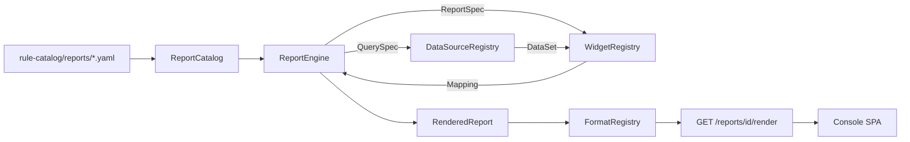

# Reporting Subsystem

Declarative, extensible visualization pipeline that lets a fork build
"any report shape" - time-series overviews, top-N tables, cost
summaries, SLO burn boards, signal-feed rollups, security postmortems,
future FE experiments - **without changing the FE contract**. Everything
lives behind three registries (datasource / widget / format) plus a
YAML catalog; adding a new report is a YAML file, adding a new data
source is one Protocol implementation, adding a new visualization shape
is one small pure function.

Read-only by contract. Every route is a `GET`; no widget executes
anything. The subsystem is the read half of the same console that never
holds the executor identity
([app-shape.instructions.md § Layer Boundaries](../../.github/instructions/app-shape.instructions.md#layer-boundaries-security)).

Complements the survey of the industry reference in
[docs/internals/datadog-visualization-surface.md](../internals/datadog-visualization-surface.md);
the shipping catalog here is a bounded, product-relevant subset.

## Why it exists

The console pull-surface has always shipped one-off `ReadPanel`
handlers (KPI dashboard, audit log, HIL queue,
[operator-console.md](operator-console.md)). Every new "board" that a
fork wanted (cost, drift, DR-drill history) meant a new Python handler,
a new hand-shaped JSON, and a new FE renderer. That does not scale.

The reporting subsystem turns "new report" into a declarative YAML plus,
at most, a new datasource. The FE is a generic renderer keyed on
widget `type` - so a fork that wires a new datasource and drops in a
YAML gets a live board immediately, and the FE **does not change**.

## Architecture



Four registries, one engine:

- `ReportCatalog` - `id -> ReportSpec`, loaded from YAML.
- `DataSourceRegistry` - `name -> ReportDataSource` (async, read-only,
  I/O-bound).
- `WidgetRegistry` - `type -> WidgetBuilder` (sync, CPU-only, pure).
- `FormatRegistry` - `name -> FormatEncoder` (JSON / Markdown / CSV /
  ...).

The engine walks a `ReportSpec` in declaration order, hands each
widget's `QuerySpec` to the named datasource, and passes the returned
`DataSet` through the matching builder. **Per-widget errors are
isolated**: one broken source or bogus builder renders that widget with
`error` set and empty `data`; every other widget still renders.

Code map (see [project-structure.md](project-structure.md)):

- `src/fdai/core/reporting/` - the whole engine (framework-neutral).
- `src/fdai/core/reporting/composition.py` - `default_reporting_engine`
  factory for fork composition roots.
- `src/fdai/delivery/read_api/reporting.py` - the four `GET` routes.
- `rule-catalog/reports/` - the YAML catalog + JSON Schema.

## Widget catalog

Sixteen upstream builders, split into five families. Every builder
emits a Datadog-inspired `data` payload the FE renders keyed on
`type`.

| Family | `type` | Payload highlights |
|--------|--------|--------------------|
| graphs | `timeseries` | `series: [{label, labels, points: [[epoch_seconds, value]]}]` |
|        | `bar_chart` | `bars: [{label, value}]` |
|        | `query_value` | `value, unit?, precision?` |
|        | `change` | `current, previous, delta_absolute, delta_ratio` |
|        | `distribution` | `buckets: [{le, count}]` |
|        | `heatmap` | same shape as `timeseries` (FE draws bands) |
| lists  | `table` | `columns, rows, total_rows` |
|        | `top_list` | `columns, rows, ranked_by, order, total_rows` |
|        | `list_stream` | `items, total_rows` newest-first |
| flows  | `funnel` | `stages: [{label, value, conversion_ratio}]` |
|        | `sankey` | `nodes, links: [{source, target, value}]` |
|        | `treemap` | `tiles: [{label, value, group?}]` sorted desc |
| reliability | `slo_summary` | `objective, attainment, target, error_budget, ...` |
| annotations | `free_text` | `body` (markdown) |
|             | `note` | `body, severity (info|warning|critical|ok)` |
|             | `image` | `src, alt, caption?`; rejects non-https / non-same-origin |
| composite | `group` | recursive children; engine-special-cased |

A fork adds a new type by implementing
`WidgetBuilder` and calling `WidgetRegistry.register` at composition
time. The FE learns the new type by hitting `GET /reports/registry` -
no restart, no schema push.

## Datasource catalog

Five upstream adapters, each wraps an existing seam so the reporting
subsystem introduces no new I/O primitive:

| Name | Wraps | Sample projections |
|------|-------|--------------------|
| `audit` | duck-typed `AuditReader` (matches `ConsoleReadModel`) | `rows`, `count_by_action_kind`, `count_by_mode`, `count_by_actor`, `count_total` |
| `report_feed` | `core.report_feed.ReportFeed` | `rows`, `count_by_severity`, `count_by_category`, `count_by_kind`, `count_total` |
| `metric` | `shared.providers.metric.MetricProvider` | `series` (with `group_by`), `scalar_sum` |
| `log_query` | `shared.providers.log_query.LogQueryProvider` | `rows`, `count_by_severity`, `count_total` |
| `static` / `noop` | in-memory | fixed / empty result; test seed |

Every datasource is **read-only, async**. `core/` never imports
`delivery/`; the `audit` adapter takes a narrow duck-typed Protocol so
the wire-up stays one-way.

A fork adds a new source (Cost Management, cluster inventory, custom
Postgres view) by implementing `ReportDataSource` and calling
`DataSourceRegistry.register`.

## Format catalog

| Name | Content-Type | Notes |
|------|--------------|-------|
| `json` | `application/json` | Canonical FE contract; UTF-8, compact |
| `markdown` | `text/markdown; charset=utf-8` | Notebook-style; ASCII-punctuation only |
| `csv` | `text/csv; charset=utf-8` | Flattens table widgets; scalar widgets emit one row |

A fork adds `pdf` / `xlsx` / whatever by implementing `FormatEncoder`
and calling `FormatRegistry.register`.

## FE JSON contract

`GET /reports/{id}/render` returns:

```json
{
  "id": "shadow-mode-daily",
  "version": "1.0.0",
  "name": "Shadow-Mode Daily Rollup",
  "description": "...",
  "generated_at": "2026-07-10T12:00:00+00:00",
  "time_range": {
    "since": "2026-07-09T12:00:00+00:00",
    "until": "2026-07-10T12:00:00+00:00"
  },
  "variables": {"env": "prod"},
  "widgets": [
    {
      "id": "total-shadow",
      "type": "query_value",
      "title": "Shadow-mode entries (24h)",
      "data": {"value": 1200, "unit": "entries"},
      "options": {"unit": "entries"}
    },
    {
      "id": "broken",
      "type": "table",
      "title": "Broken",
      "data": {},
      "options": {},
      "error": "datasource error: RuntimeError: boom"
    }
  ],
  "tags": ["control-loop", "shadow-mode"]
}
```

The FE only needs to know `type` and the per-type `data` schema in
[Widget catalog](#widget-catalog). New reports and new datasources do
not change this envelope.

## YAML report definition

Full schema: [`rule-catalog/reports/schema/report.schema.json`](../../rule-catalog/reports/schema/report.schema.json).

```yaml
id: shadow-mode-daily
version: 1.0.0
name: Shadow-Mode Daily Rollup
description: |
  Yesterday's shadow-mode activity.
tags:
  - control-loop
  - shadow-mode
time_range:
  last: 1d          # alias for relative_duration; also since/until pair
variables:
  - name: env
    default: prod
    values: [prod, staging]
widgets:
  - id: total-shadow
    type: query_value
    title: Shadow-mode entries (24h)
    query:
      datasource: audit
      parameters:
        projection: count_total
    options:
      unit: entries
  - id: by-mode
    type: bar_chart
    title: Enforce vs shadow
    query:
      datasource: audit
      parameters:
        projection: count_by_mode
```

Loader ([`core.reporting.catalog.load_report_catalog`](../../src/fdai/core/reporting/catalog.py)):

- validates every file against the JSON Schema
  (`additionalProperties: false` at every level - a typo fails at
  load time, not at first render);
- with `allowed_widget_types` / `allowed_datasources` (the composition
  helper passes them), a YAML that references an unwired name is a
  load-time error;
- rejects duplicate report ids across files;
- rejects multi-document YAML.

Three sample reports ship upstream:

- [`shadow-mode-daily.yaml`](../../rule-catalog/reports/shadow-mode-daily.yaml) - audit KPI + top lists.
- [`signal-feed-overview.yaml`](../../rule-catalog/reports/signal-feed-overview.yaml) - report-feed rollup with a `category` variable.
- [`metric-explorer.yaml`](../../rule-catalog/reports/metric-explorer.yaml) - generic parameterized metric explorer.

## Read-API routes

Four GETs, mounted under a configurable prefix (default `/reports`) by
[`build_reporting_routes`](../../src/fdai/delivery/read_api/reporting.py):

| Route | Purpose |
|-------|---------|
| `GET /reports` | List every report (id, name, description, version, tags, widget count, declared variables) |
| `GET /reports/registry` | Wired datasource / widget-type / format names |
| `GET /reports/{id}` | Full report definition (projection of the loaded `ReportSpec`) |
| `GET /reports/{id}/render?format=json\|markdown\|csv&<vars>` | The rendered payload |

The routes plug into the existing read-API through `ReadApiConfig.reporting`:

```python
from fdai.core.reporting.composition import default_reporting_engine
from fdai.delivery.read_api.reporting import ReportingConfig
from fdai.delivery.read_api.main import ReadApiConfig, build_app

engine, formats = default_reporting_engine(
    reports_root=Path("rule-catalog/reports"),
    audit_reader=console_read_model,
    report_feed=my_feed,
    metric_provider=container.metric_provider,
    log_query_provider=container.log_query_provider,
)
config = ReadApiConfig(
    dev_mode=False,
    reporting=ReportingConfig(engine=engine, formats=formats),
)
app = build_app(authenticator=..., read_model=console_read_model, config=config)
```

Every route:

- hits the shared reader-role gate;
- validates the format name and (via the engine) the variable overrides
  before any datasource query;
- returns 404 on unknown report, 400 on unknown format / variable, 405
  on any non-GET method (Starlette default).

## Fork extension recipes

### 1. Add a report

Drop a YAML under `rule-catalog/reports/` (or a fork-local directory
your composition root also loads). No Python change.

### 2. Add a datasource

```python
class CostManagementDataSource:
    name = "cost_management"

    async def query(self, spec, *, since, until, variables):
        ...
        return DataSet(rows=(...), columns=(...))

engine.datasource_registry().register(CostManagementDataSource(...))
```

Any report YAML with `query.datasource: cost_management` now renders.

### 3. Add a widget type

```python
class KpiTileBuilder:
    type_name = "kpi_tile"

    def build(self, *, spec, data):
        return {"value": data.scalar, "delta": spec.options.get("delta")}

engine.widget_registry().register(KpiTileBuilder())
```

Any YAML using `type: kpi_tile` now renders; `GET /reports/registry`
advertises the new type.

### 4. Add a format encoder

```python
class PdfFormatEncoder:
    name = "pdf"
    content_type = "application/pdf"

    def encode(self, report):
        return _render_pdf(report.to_dict())

formats.register(PdfFormatEncoder())
```

`GET /reports/{id}/render?format=pdf` now works.

### 5. Change the route prefix

Set `ReportingConfig(prefix="/dashboards")` at composition time. The
factory validates the prefix does not collide with a core or panel
route.

## Safety and invariants

- **Read-only**. No POST / PUT / DELETE / PATCH route exists on this
  surface; there is no widget type that mutates state
  ([app-shape.instructions.md § Anti-Patterns](../../.github/instructions/app-shape.instructions.md#anti-patterns-avoid)).
- **Fail-closed at boundaries**. Variable overrides not declared or
  outside the allowlist are rejected before any datasource is
  touched. YAML with an unknown widget type or an unwired datasource
  is rejected at catalog-load time.
- **Per-widget error isolation**. A broken source never fails the whole
  report; the offending widget is rendered with `error` set. Mirrors
  the `ReportFeed` pattern.
- **No new I/O primitive**. Every datasource wraps an existing seam
  (`AuditReader`, `MetricProvider`, `LogQueryProvider`, `ReportFeed`) -
  the reporting subsystem does not introduce a new async boundary.
- **`core/` never imports `delivery/`**. The audit adapter takes a
  narrow duck-typed Protocol so the composition wire-up stays one-way
  (guarded by [`scripts/check-core-imports.sh`](../../scripts/check-core-imports.sh)).
- **ASCII-only markdown / audit surfaces**. The markdown encoder ships
  no smart quotes / em-dash / NBSP; enforced by
  [`scripts/check-punctuation.sh`](../../scripts/check-punctuation.sh).

## Related

- [operator-console.md](operator-console.md) - the pull surface these
  reports render inside.
- [project-structure.md](project-structure.md#customization-via-dependency-injection) -
  the DI seam catalog every fork wires against.
- [docs/internals/datadog-visualization-surface.md](../internals/datadog-visualization-surface.md) -
  the industry-reference viz catalog this subsystem draws from.
