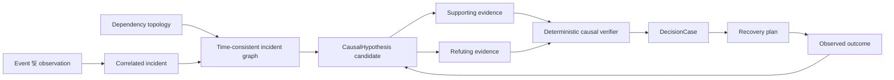

# 인과 incident graph

이 문서는 FDAI가 운영 incident의 인과 주장을 표현하고 평가하고 종결하는 방법을 정의합니다.
Event correlation과 root-cause analysis(RCA)를 ontology 기반의 time-consistent graph로 확장하면서
실행 권한은 기존 control loop에 유지합니다.

> **권한 경계:** Causal graph는 결정을 위한 evidence이며 실행 허가가 아닙니다. Rule verifier,
> safety check, approval policy, executor, audit ledger가 계속 authority를 가집니다.
>
> **구현 상태:** 이 문서는 target design입니다. 기존 T1 causal-chain reconstruction은 temporal,
> dependency-aware hypothesis를 제공하지만, typed hypothesis lifecycle, support/refutation link,
> graph 기반 closure는 아직 구현되지 않았습니다.

## 설계 개요

FDAI는 하나의 evidence cutoff를 기준으로 incident subgraph를 구성하고, bounded root-cause
hypothesis를 생성하며, 각 hypothesis를 지지하고 반박하는 evidence를 모두 탐색합니다. 이후 네
가지 causal evidence grade 중 하나를 기록합니다. 시간 순서만으로는 association만 나타낼 수
있습니다. 통제된 intervention 또는 동등한 recovery reversal만 interventional evidence를
입증할 수 있습니다.

## 역량 질문

Graph는 다음 질문에 결정론적으로 답하거나 명시적인 unknown을 반환하는 것이 좋습니다.

1. 어떤 change, failure 또는 외부 condition이 관측된 symptom을 설명할 수 있습니까?
2. 어떤 dependency path가 해당 원인을 영향받은 service objective까지 전파할 수 있습니까?
3. 각 candidate cause와 모순되는 evidence는 무엇입니까?
4. 어떤 observation이 남은 candidate를 구분할 수 있습니까?
5. 승인된 recovery action이 선언된 window 안에서 예측된 effect를 반전시켰습니까?
6. 승인된 chaos intervention이 scope를 넘지 않고 예측된 effect를 재현했습니까?

이 질문이 필요한 graph와 query test를 정의합니다. 새로운 ontology type이나 link는 visualization만
개선하기 위해 추가하지 않는 것이 좋습니다.

## Ontology contract

이 설계는 operating ontology의 `Incident`, `Finding`, `Observation`, `Change`, `Experiment`,
`Resource`, `Workload`, `BusinessService`, `ServiceObjective`, `DecisionCase`, `ActionRun`,
`ObservedOutcome`을 재사용합니다. Durable semantic object 하나를 추가합니다.

### `CausalHypothesis` ObjectType

`CausalHypothesis`는 기계가 평가할 수 있는 하나의 causal claim에 대한 immutable revision입니다.
나중에 들어온 observation은 이전 decision에 사용한 claim을 덮어쓰지 않고 새 revision을 만듭니다.

| Property | Type | 의미 |
|----------|------|------|
| `id` | string | Incident, claimed cause, claimed effect, method version, evidence cutoff에서 파생한 stable id입니다. |
| `incident_id` | string | Hypothesis가 symptom을 설명하는 incident입니다. |
| `status` | string | `candidate`, `supported`, `refuted`, `inconclusive`, `closed` 중 하나입니다. |
| `cause_ref` | string | Cause로 주장하는 typed object 또는 event입니다. |
| `effect_ref` | string | 설명 대상 Finding, objective breach 또는 incident effect입니다. |
| `mechanism` | string | Reviewed catalog의 bounded mechanism code이며 free-form authority가 아닙니다. |
| `evidence_grade` | string | `association`, `predictive_precedence`, `quasi_experimental`, `interventional` 중 하나입니다. |
| `confidence` | number | Ambiguity와 evidence-completeness penalty를 반영한 `[0, 1]` score입니다. |
| `ambiguity` | integer | Cutoff 시점에 실질적으로 경쟁하는 root candidate 수입니다. |
| `graph_revision` | string | Traversal에 사용한 inventory와 operating-model revision입니다. |
| `evidence_cutoff` | datetime | Claim에 사용할 수 있는 가장 늦은 event time입니다. |
| `method_version` | string | Deterministic scorer 또는 reviewed reasoner version입니다. |
| `created_at` | datetime | FDAI가 이 revision을 수락한 시간입니다. |

Object는 identifier와 score만 저장합니다. Evidence body는 authoritative store에 남고 opaque
reference로 인용합니다.

### Causal LinkType

현재 LinkType schema는 typed endpoint와 `is_causal` 또는 `temporal_order` flag로 다음 관계를
표현할 수 있습니다.

| LinkType | Endpoint | Flag | 의미 |
|----------|----------|------|------|
| `hypothesis_explains_finding` | CausalHypothesis -> Finding | `is_causal` | Hypothesis가 설명하려는 effect입니다. |
| `hypothesis_claims_change` | CausalHypothesis -> Change | `is_causal` | Root 또는 contributing cause로 주장하는 change입니다. |
| `hypothesis_claims_experiment` | CausalHypothesis -> Experiment | `is_causal` | Mechanism 검증에 사용한 intervention입니다. |
| `evidence_supports_hypothesis` | EvidenceArtifact -> CausalHypothesis | - | 예측 mechanism과 일치하는 evidence입니다. |
| `evidence_refutes_hypothesis` | EvidenceArtifact -> CausalHypothesis | - | 필수 prediction과 모순되는 evidence입니다. |
| `hypothesis_precedes_hypothesis` | CausalHypothesis -> CausalHypothesis | `temporal_order` | Revision 또는 narrowing order이며 자체로 causal proof가 아닙니다. |
| `outcome_tests_hypothesis` | ObservedOutcome -> CausalHypothesis | `is_causal` | Closure에 사용한 독립적인 post-action 또는 experiment observation입니다. |

Physical LinkType declaration은 하나의 concrete source와 target ObjectType을 유지합니다.
Deployment는 임의 object 사이에 untyped `caused_by` edge를 사용하지 않습니다.

## Time-consistent incident subgraph

Muninn은 incident의 evidence cutoff를 기준으로 graph를 materialize합니다. Bounded traversal은
다음을 포함합니다.

- 영향받은 service, workload, resource
- Incoming 및 outgoing `depends_on`, `runs_on`, `implemented_by`, `contains` link
- Correlated finding, observation, change, deployment, experiment, action run
- Active service objective 및 recovery objective
- Topology freshness, source provenance, unresolved conflict

Default traversal은 failing workload 또는 resource에서 depth 2입니다. Configuration은 depth나
node cap을 낮출 수 있지만 조용히 높일 수는 없습니다. Node, edge, time 또는 byte cap에
도달하면 graph를 `truncated`로 표시합니다. Truncated graph는 autonomous recovery를 지원할 수
없습니다.

Late event는 새 graph revision을 만듭니다. Replay는 항상 원래 catalog version, topology
revision, evidence cutoff를 resolve합니다.

## Candidate 생성

Candidate 생성은 deterministic-first이며 bounded입니다.

1. **T0 direct cause:** Matched rule이 declared mechanism과 remediation을 제공합니다.
2. **T1 temporal path:** 같은 resource 또는 dependency path의 preceding change가 configured
   mechanism window 안에 있으면 candidate가 됩니다.
3. **T1 resolved-case reuse:** 이전 incident는 resource type, signal fingerprint, topology role,
   mechanism이 여전히 일치할 때만 candidate를 제공합니다.
4. **T2 grounded proposal:** T0와 T1이 계속 ambiguous하면 reasoner는 bounded graph 안에 있는
   candidate와 citation만 rank할 수 있습니다. Object, link 또는 action을 새로 만들 수 없습니다.

모든 path는 `no_known_cause` option을 유지합니다. Candidate 생성은 configured count에서
중지합니다. Overflow에서는 deterministic score가 높은 항목만 유지하고 truncation을 기록합니다.

## Causal scoring 및 refutation

각 candidate는 네 가지 독립 factor로 평가합니다.

- **Temporal precedence:** Cause가 mechanism window 안에서 effect보다 먼저 발생했습니다.
- **Topological reachability:** Typed dependency path가 cause와 effect를 연결합니다.
- **Mechanism fit:** 관측된 direction과 symptom pattern이 reviewed mechanism과 일치합니다.
- **Intervention consistency:** 이전 또는 현재 action이 prediction과 같은 방향으로 effect를
  바꿨습니다.

Chain score는 가장 약한 hop score에 evidence completeness와 ambiguity penalty를 곱합니다. 높은
평균으로 unsupported hop 하나를 숨길 수 없습니다. Threshold와 weight는 versioned configuration이며
hypothesis와 함께 replay합니다.

Verifier는 supporting query마다 최소 하나의 refutation query를 실행합니다. 예시는 다음과 같습니다.

| Candidate | Supporting check | Refuting check |
|-----------|------------------|----------------|
| Bad deployment가 error를 유발함 | 영향받은 instance에서 error rise가 deployment 이후 발생했습니다. | 변경되지 않은 instance에도 deployment 전부터 같은 rise가 있습니다. |
| Database saturation이 latency를 유발함 | Dependency path에서 query latency와 CPU가 service latency보다 먼저 상승했습니다. | Service latency가 상승했지만 database latency와 connection은 정상입니다. |
| Network delay가 gateway latency를 유발함 | Internal/external path 차이가 영향받은 edge와 일치합니다. | 두 path가 동일하게 변했거나 dependency edge가 healthy입니다. |
| Quota pressure가 429를 유발함 | Request가 관측된 quota window를 초과했습니다. | Quota 이하에서 429가 발생했거나 provider-wide failure가 더 잘 설명합니다. |

누락된 refutation data는 `unknown`이며 candidate를 지지하는 evidence가 아닙니다.

## Evidence grade

FDAI는 기존 `CausalEvidenceGrade` 값을 재사용합니다.

| Grade | 최소 evidence | 최대 사용 범위 |
|-------|---------------|----------------|
| `association` | Correlation 또는 temporal co-occurrence만 있습니다. | Explanation 및 investigation planning입니다. |
| `predictive_precedence` | Candidate가 effect에 반복적으로 선행하고 direction을 예측합니다. | Shadow 또는 사람 승인을 받는 recovery proposal입니다. |
| `quasi_experimental` | Comparable untreated cohort, natural experiment 또는 difference-in-differences evidence가 있습니다. | 다른 safety check가 모두 통과한 bounded recovery eligibility입니다. |
| `interventional` | 승인된 chaos intervention 또는 recovery reversal이 predicted effect를 재현하거나 제거합니다. | Promotion evidence input이며 단독 permission이 아닙니다. |

Refuting evidence가 도착하면 evidence grade가 낮아질 수 있습니다. 낮은 grade는 새 hypothesis
revision을 만들고 관련 action 또는 chaos scenario를 shadow mode로 demote할 수 있습니다.

## Recovery 및 chaos를 통한 closure

Recovery 또는 experiment는 실행 전에 expected observation을 선언합니다. Heimdall은 Thor가
실행하거나 Loki의 승인된 experiment가 실행된 뒤 effect를 독립적으로 측정합니다. Closure는
observed direction, magnitude, affected set, time window를 prediction과 비교합니다.

- **Confirmed:** Required effect가 일치하고 prohibited effect가 발생하지 않았습니다.
- **Refuted:** Complete telemetry에서 required effect가 반대 방향으로 움직이거나 나타나지
  않았습니다.
- **Inconclusive:** Evidence가 stale, incomplete, censored이거나 declared window 밖에 있습니다.
- **Unsafe:** Observed affected set 또는 objective degradation이 approved envelope를 넘었습니다.

Unsafe result는 experiment stop condition과 Vidar recovery path를 trigger합니다. Original causal
hypothesis가 맞더라도 promotion을 차단합니다.

## Agent ownership

고정 pantheon은 single-writer ownership을 유지합니다.

| Agent | Responsibility |
|-------|----------------|
| Huginn | Event, observation, change, experiment receipt를 normalize합니다. |
| Heimdall | Finding과 독립적인 support/refutation observation을 emit합니다. |
| Forseti | `CausalHypothesis` revision과 이를 사용하는 decision을 소유합니다. |
| Loki | Bounded experiment를 propose하며 자체 experiment outcome을 평가하지 않습니다. |
| Thor | 승인된 action 또는 experiment plan만 execute합니다. |
| Vidar | Rollback 및 forward-recovery control을 소유하고 Thor execution을 요청하며 recovery outcome을 기록합니다. |
| Saga | Hypothesis, evidence, decision, action, closure reference를 append합니다. |
| Muninn | Time-consistent graph revision을 materialize합니다. |
| Mimir | Mechanism, rule, action catalog version을 govern합니다. |

Synchronous agent call은 도입하지 않습니다. 각 write는 typed pub/sub를 통하고 safe to retry하게
유지됩니다.

## Failure 동작

Causal path는 불확실할 때 더 안전한 결과를 선택합니다.

- Stale topology, missing objective, truncated traversal, conflicting ownership 또는 incomplete
  telemetry는 evidence grade를 낮추고 automatic recovery를 차단합니다.
- 충분한 support를 가진 candidate가 없으면 `inconclusive`를 반환하고 investigation을 요청합니다.
- Graph 밖의 reasoner citation은 fabricated citation으로 차단합니다.
- Projection failure는 authoritative event 또는 audit record를 지울 수 없습니다.
- Graph query timeout은 bounded failure를 기록하며 unbounded search로 전환하지 않습니다.

## Delivery slice

구현은 독립적으로 테스트할 수 있는 slice로 진행할 수 있습니다.

1. `CausalHypothesis`와 7개 LinkType을 loader 및 competency-query test와 함께 추가합니다.
2. 기존 structured T1 causal chain을 immutable hypothesis revision으로 project합니다.
3. Support/refutation query contract와 evidence-completeness scoring을 추가합니다.
4. Production composition에 `IncidentMemberSource`와 dependency graph를 bind합니다.
5. `ObservedOutcome`의 independent closure와 refutation 또는 unsafe impact에 따른 demotion을
   추가합니다.
6. Autonomy를 높이지 않으면서 eligible causal evidence를 recovery와 chaos promotion에
   제공합니다.

## 관련 문서

| 알아볼 내용 | 문서 |
|-------------|------|
| 공유 operational object와 ownership | [FDAI 운영 온톨로지](../architecture/operating-ontology-ko.md) |
| Detection, correlation 및 현재 RCA | [관측성 및 감지](observability-and-detection-ko.md) |
| Action safety와 execution contract | [Action 온톨로지](../decisioning/action-ontology-ko.md) |
| Multi-step governed execution | [프로세스 자동화](../decisioning/process-automation-ko.md) |
