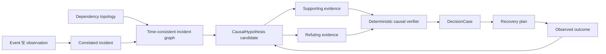

# 인과 인시던트 그래프

이 문서는 FDAI가 운영 인시던트의 인과 주장을 표현하고 평가하고 종결하는 방법을 정의합니다.
Event 상관관계와 root-cause analysis(RCA)를 온톨로지 기반의 time-consistent 그래프로 확장하면서
실행 권한은 기존 컨트롤 루프에 유지합니다.

> **권한 경계:** Causal 그래프는 결정을 위한 근거이며 실행 허가가 아닙니다. Rule 검증기,
> 안전성 검사, 승인 정책, 실행기, 감사 원장이 계속 권한을 가집니다.
>
> **구현 상태(2026-08-01):** 타입이 지정된 가설 수명 주기, weakest-link 채점, 범위가 제한된
> time-consistent 그래프 materializer, support/refutation 및 종결 링크, 변경할 수 없는 온톨로지
> projector, lagged temporal analyzer, 런타임 조정기, shadow control-loop 호출자,
> 독립적인 종결 classifier 및 회귀 테스트를 구현했습니다. 컨트롤 루프는 shadow에서
> 분석하고 감사하지만 Forseti 대신 온톨로지를 쓰지 않습니다. 배포는 범위가 제한된 temporal
> series, Forseti-owned 변환 결과 발행기, 독립적인 결과 프로바이더, causal 증적 해석기를
> 연결합니다. Pre-routing temporal analysis에는 범위가 제한된 시간 초과가 있으며 범위와 시간이 일치하는
> 검증된 intervention 증적만 종결을 confirm할 수 있습니다. Causal 결과는 실행을 허가하지 않습니다.

## 설계 개요

FDAI는 하나의 근거 기준 시점을 기준으로 인시던트 subgraph를 구성하고, 범위가 제한된 root-cause
가설을 생성하며, 각 가설을 지지하고 반박하는 근거를 모두 탐색합니다. 이후 네
가지 causal 근거 grade 중 하나를 기록합니다. 시간 순서만으로는 association만 나타낼 수
있습니다. 통제된 intervention 또는 동등한 복구 reversal만 interventional 근거를
입증할 수 있습니다.

## 역량 질문

Graph는 다음 질문에 결정론적으로 답하거나 명시적인 알 수 없음을 반환하는 것이 좋습니다.

1. 어떤 변경, 실패 또는 외부 조건이 관측된 symptom을 설명할 수 있습니까?
2. 어떤 의존성 경로가 해당 원인을 영향받은 서비스 목표까지 전파할 수 있습니까?
3. 각 후보 원인과 모순되는 근거는 무엇입니까?
4. 어떤 관측이 남은 후보를 구분할 수 있습니까?
5. 승인된 복구 액션이 선언된 구간 안에서 예측된 효과를 반전시켰습니까?
6. 승인된 chaos intervention이 범위를 넘지 않고 예측된 효과를 재현했습니까?

이 질문이 필요한 그래프와 조회 테스트를 정의합니다. 새로운 온톨로지 타입이나 링크는 visualization만
개선하기 위해 추가하지 않는 것이 좋습니다.

## 온톨로지 계약

이 설계는 operating 온톨로지의 `Incident`, `Finding`, `Observation`, `Change`, `Experiment`,
`Resource`, `Workload`, `BusinessService`, `ServiceObjective`, `DecisionCase`, `ActionRun`,
`ObservedOutcome`을 재사용합니다. 영속 의미 객체 하나를 추가합니다.

### `CausalHypothesis` ObjectType

`CausalHypothesis`는 기계가 평가할 수 있는 하나의 causal 점유에 대한 변경할 수 없는 개정 번호입니다.
나중에 들어온 관측은 이전 결정에 사용한 점유를 덮어쓰지 않고 새 개정 번호를 만듭니다.

| Property | 타입 | 의미 |
|----------|------|------|
| `id` | 문자열 | 인시던트, claimed 원인, claimed 효과, 메서드 버전, 근거 기준 시점에서 파생한 고정된 id입니다. |
| `incident_id` | 문자열 | 가설이 symptom을 설명하는 인시던트입니다. |
| `status` | 문자열 | `candidate`, `supported`, `refuted`, `inconclusive`, `closed` 중 하나입니다. |
| `cause_ref` | 문자열 | 원인으로 주장하는 타입이 지정된 객체 또는 이벤트입니다. |
| `effect_ref` | 문자열 | 설명 대상 발견 사항, 목표 breach 또는 인시던트 효과입니다. |
| `mechanism` | 문자열 | 검토된 카탈로그의 범위가 제한된 방식 코드이며 free-form 권한이 아닙니다. |
| `evidence_grade` | 문자열 | `association`, `predictive_precedence`, `quasi_experimental`, `interventional` 중 하나입니다. |
| `confidence` | number | 모호함과 evidence-completeness penalty를 반영한 `[0, 1]` 점수입니다. |
| `ambiguity` | 정수 | 기준 시점 시점에 실질적으로 경쟁하는 루트 후보 수입니다. |
| `graph_revision` | 문자열 | 탐색에 사용한 인벤토리와 operating-model 개정 번호입니다. |
| `evidence_cutoff` | datetime | 점유에 사용할 수 있는 가장 늦은 이벤트 시간입니다. |
| `method_version` | 문자열 | 결정론적 scorer 또는 검토된 reasoner 버전입니다. |
| `created_at` | datetime | FDAI가 이 개정 번호를 수락한 시간입니다. |
| `closure` | 문자열 | 선택적 최종 결과인 `confirmed`, `refuted`, `inconclusive`, `unsafe` 중 하나입니다. |

객체는 식별자와 점수만 저장합니다. 근거 본문은 권위 있는 저장소에 남고 opaque
참조로 인용합니다.

### Causal LinkType

현재 LinkType 스키마는 타입이 지정된 엔드포인트와 `is_causal` 또는 `temporal_order` 플래그로 다음 관계를
표현할 수 있습니다.

| LinkType | 엔드포인트 | 플래그 | 의미 |
|----------|----------|------|------|
| `hypothesis_explains_finding` | CausalHypothesis -> 발견 사항 | `is_causal` | 가설이 설명하려는 효과입니다. |
| `hypothesis_claims_change` | CausalHypothesis -> 변경 | `is_causal` | 루트 또는 contributing 원인으로 주장하는 변경입니다. |
| `hypothesis_claims_experiment` | CausalHypothesis -> 실험 | `is_causal` | 방식 검증에 사용한 intervention입니다. |
| `evidence_supports_hypothesis` | EvidenceArtifact -> CausalHypothesis | - | 예측 방식과 일치하는 근거입니다. |
| `evidence_refutes_hypothesis` | EvidenceArtifact -> CausalHypothesis | - | 필수 prediction과 모순되는 근거입니다. |
| `hypothesis_precedes_hypothesis` | CausalHypothesis -> CausalHypothesis | `temporal_order` | 개정 번호 또는 좁히기 순서이며 자체로 causal 증명이 아닙니다. |
| `outcome_tests_hypothesis` | ObservedOutcome -> CausalHypothesis | `is_causal` | 종결에 사용한 독립적인 post-action 또는 실험 관측입니다. |

Physical LinkType 선언은 하나의 구체적인 출처와 대상 ObjectType을 유지합니다.
배포는 임의 객체 사이에 untyped `caused_by` 간선을 사용하지 않습니다.

## Time-consistent 인시던트 subgraph

Muninn은 인시던트의 근거 기준 시점을 기준으로 그래프를 materialize합니다. 범위가 제한된 탐색은
다음을 포함합니다.

- 영향받은 서비스, 워크로드, 리소스
- 들어오는 및 나가는 `depends_on`, `runs_on`, `implemented_by`, `contains` 링크
- Correlated 발견 사항, 관측, 변경, 배포, 실험, 액션 실행
- 활성 서비스 목표 및 복구 목표
- 토폴로지 최신성, 출처 출처 이력, 해결되지 않은 충돌

기본값 탐색은 failing 워크로드 또는 리소스에서 깊이 2입니다. 구성은 깊이나
노드 상한을 낮출 수 있지만 조용히 높일 수는 없습니다. 노드, 간선, 시간 또는 바이트 상한에
도달하면 그래프를 `truncated`로 표시합니다. 잘린 그래프는 자율 복구를 지원할 수
없습니다.

Late 이벤트는 새 그래프 개정 번호를 만듭니다. 재생은 항상 원래 카탈로그 버전, 토폴로지
개정 번호, 근거 기준 시점을 해석합니다.

## 후보 생성

후보 생성은 deterministic-first이며 범위가 제한된입니다.

1. **T0 direct 원인:** Matched 룰이 declared 방식과 교정을 제공합니다.
2. **T1 temporal 경로:** 같은 리소스 또는 의존성 경로의 preceding 변경이 구성된
   방식 구간 안에 있으면 후보가 됩니다.
3. **T1 resolved-case reuse:** 이전 인시던트는 리소스 타입, 신호 지문, 토폴로지 역할,
   방식이 여전히 일치할 때만 후보를 제공합니다.
4. **T2 근거에 기반한 제안:** T0와 T1이 계속 모호한하면 reasoner는 범위가 제한된 그래프 안에 있는
   후보와 인용만 순위할 수 있습니다. 객체, 링크 또는 액션을 새로 만들 수 없습니다.

모든 경로는 `no_known_cause` 옵션을 유지합니다. 후보 생성은 구성된 개수에서
중지합니다. 초과분에서는 결정론적 점수가 높은 항목만 유지하고 잘림을 기록합니다.

## Causal 채점 및 refutation

각 후보는 네 가지 독립 factor로 평가합니다.

- **Temporal precedence:** 원인이 방식 구간 안에서 효과보다 먼저 발생했습니다.
- **Topological 도달 가능성:** 타입이 지정된 의존성 경로가 원인과 효과를 연결합니다.
- **방식 fit:** 관측된 direction과 symptom pattern이 검토된 방식과 일치합니다.
- **Intervention 일관성:** 이전 또는 현재 액션이 prediction과 같은 방향으로 효과를
  바꿨습니다.

체인 점수는 가장 약한 홉 점수에 근거 완전성과 모호함 penalty를 곱합니다. 높은
평균으로 지원하지 않는 홉 하나를 숨길 수 없습니다. 임계값과 가중치는 versioned 구성이며
가설과 함께 재생합니다.

검증기는 supporting 조회마다 최소 하나의 refutation 조회를 실행합니다. 예시는 다음과 같습니다.

| 후보 | Supporting 검사 | Refuting 검사 |
|-----------|------------------|----------------|
| Bad 배포가 오류를 유발함 | 영향받은 인스턴스에서 오류 rise가 배포 이후 발생했습니다. | 변경되지 않은 인스턴스에도 배포 전부터 같은 rise가 있습니다. |
| 데이터베이스 포화가 지연 시간을 유발함 | 의존성 경로에서 조회 지연 시간과 CPU가 서비스 지연 시간보다 먼저 상승했습니다. | 서비스 지연 시간이 상승했지만 데이터베이스 지연 시간과 연결은 정상입니다. |
| 네트워크 delay가 게이트웨이 지연 시간을 유발함 | 내부/외부 경로 차이가 영향받은 간선과 일치합니다. | 두 경로가 동일하게 변했거나 의존성 간선이 healthy입니다. |
| 할당량 pressure가 429를 유발함 | 요청이 관측된 할당량 구간을 초과했습니다. | 할당량 이하에서 429가 발생했거나 provider-wide 실패가 더 잘 설명합니다. |

누락된 refutation 데이터는 `unknown`이며 후보를 지지하는 근거가 아닙니다.

## 근거 grade

FDAI는 기존 `CausalEvidenceGrade` 값을 재사용합니다.

| Grade | 최소 근거 | 최대 사용 범위 |
|-------|---------------|----------------|
| `association` | 상관관계 또는 temporal co-occurrence만 있습니다. | Explanation 및 조사 계획 수립입니다. |
| `predictive_precedence` | 후보가 효과에 반복적으로 선행하고 direction을 예측합니다. | Shadow 또는 사람 승인을 받는 복구 제안입니다. |
| `quasi_experimental` | Comparable untreated 집단, natural 실험 또는 difference-in-differences 근거가 있습니다. | 다른 안전성 검사가 모두 통과한 범위가 제한된 복구 충족 여부입니다. |
| `interventional` | 승인된 chaos intervention 또는 복구 reversal이 predicted 효과를 재현하거나 제거합니다. | 승격 근거 입력이며 단독 권한이 아닙니다. |

Refuting 근거가 도착하면 근거 grade가 낮아질 수 있습니다. 낮은 grade는 새 가설
개정 번호를 만들고 관련 액션 또는 chaos 시나리오를 shadow 모드로 demote할 수 있습니다.

## 복구 및 chaos를 통한 종결

복구 또는 실험은 실행 전에 예상 관측을 선언합니다. Heimdall은 Thor가
실행하거나 Loki의 승인된 실험이 실행된 뒤 효과를 독립적으로 측정합니다. 종결은
관찰된 direction, magnitude, affected 집합, 시간 구간을 prediction과 비교합니다.
검증된 intervention 실행 시간은 가설 근거 기준 시점보다 엄격히 이후여야 합니다.
같은 시각이면 pre-intervention 근거 구간이 분리되지 않았으므로 inconclusive입니다.

- **Confirmed:** 필수 효과가 일치하고 prohibited 효과가 발생하지 않았습니다.
- **Refuted:** 완전한 텔레메트리에서 필수 효과가 반대 방향으로 움직이거나 나타나지
  않았습니다.
- **Inconclusive:** 근거가 stale, 불완전한, censored이거나 declared 구간 밖에 있습니다.
- **Unsafe:** 관찰된 affected 집합 또는 목표 성능 저하가 approved 묶음을 넘었습니다.

Unsafe 결과는 실험 stop 조건과 Vidar 복구 경로를 트리거합니다. Original causal
가설이 맞더라도 승격을 차단합니다.

## 에이전트 소유권

고정 pantheon은 single-writer 소유권을 유지합니다.

| 에이전트 | Responsibility |
|-------|----------------|
| Huginn | Event, 관측, 변경, 실험 증적을 normalize합니다. |
| Heimdall | 발견 사항과 독립적인 support/refutation 관측을 발행합니다. |
| Forseti | `CausalHypothesis` 개정 번호와 이를 사용하는 결정을 소유합니다. |
| Loki | 범위가 제한된 실험을 propose하며 자체 실험 결과를 평가하지 않습니다. |
| Thor | 승인된 액션 또는 실험 계획만 execute합니다. |
| Vidar | Rollback 및 forward-recovery 컨트롤을 소유하고 Thor 실행을 요청하며 복구 결과를 기록합니다. |
| Saga | 가설, 근거, 결정, 액션, 종결 참조를 덧붙이기합니다. |
| Muninn | Time-consistent 그래프 개정 번호를 materialize합니다. |
| Mimir | 방식, 룰, 액션 카탈로그 버전을 govern합니다. |

Synchronous 에이전트 호출은 도입하지 않습니다. 각 쓰기는 타입이 지정된 pub/sub를 통하고 safe to 재시도하게
유지됩니다.

## 실패 동작

Causal 경로는 불확실할 때 더 안전한 결과를 선택합니다.

- Stale 토폴로지, 누락된 목표, 잘린 탐색, conflicting 소유권 또는 불완전한
  텔레메트리는 근거 grade를 낮추고 automatic 복구를 차단합니다.
- 충분한 support를 가진 후보가 없으면 `inconclusive`를 반환하고 조사를 요청합니다.
- Graph 밖의 reasoner 인용은 fabricated 인용으로 차단합니다.
- 변환 결과 실패는 권위 있는 이벤트 또는 감사 기록을 지울 수 없습니다.
- Graph 조회 시간 초과는 범위가 제한된 실패를 기록하며 unbounded 검색으로 전환하지 않습니다.

## 전달 구획

구현은 독립적으로 테스트할 수 있는 구획으로 진행할 수 있습니다.

1. `CausalHypothesis`와 7개 LinkType을 로더 및 competency-query 테스트와 함께 추가합니다.
2. 기존 구조화된 T1 causal 체인을 변경할 수 없는 가설 개정 번호로 project합니다.
3. Support/refutation 조회 계약과 evidence-completeness 채점을 추가합니다.
4. 운영 조립에 `IncidentMemberSource`와 의존성 그래프를 연결합니다.
5. `ObservedOutcome`의 독립적인 종결과 refutation 또는 unsafe 영향에 따른 demotion을
   추가합니다.
6. 자율성을 높이지 않으면서 조건을 충족한 causal 근거를 복구와 chaos 승격에
   제공합니다.

## 관련 문서

| 알아볼 내용 | 문서 |
|-------------|------|
| 공유 operational 객체와 소유권 | [FDAI 운영 온톨로지](../architecture/operating-ontology-ko.md) |
| Detection, 상관관계 및 현재 RCA | [관측성 및 감지](observability-and-detection-ko.md) |
| 액션 안전성과 실행 계약 | [액션 온톨로지](../decisioning/action-ontology-ko.md) |
| Multi-step 통제된 실행 | [프로세스 자동화](../decisioning/process-automation-ko.md) |
