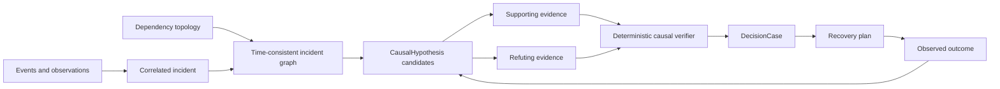

# Causal Incident Graph

This document defines how FDAI represents, evaluates, and closes causal claims for operational
incidents. It extends event correlation and root-cause analysis (RCA) with an ontology-grounded,
time-consistent graph while keeping execution authority in the existing control loop.

> **Authority boundary:** A causal graph is evidence for a decision, not permission to act. The
> rule verifier, safety check, approval policy, executor, and audit ledger remain authoritative.
>
> **Implementation status (2026-08-01):** The typed hypothesis lifecycle, weakest-link scoring,
> bounded time-consistent graph materializer, support/refutation and closure links, immutable
> ontology projector, lagged temporal analyzer, runtime coordinator, shadow control-loop caller,
> independent closure classifier, and regression tests are implemented. The control loop analyzes
> and audits in shadow but does not write the ontology as Forseti. Deployments bind bounded temporal
> series, a Forseti-owned projection publisher, independent outcome provider, and causal receipt
> resolver. Pre-routing temporal analysis has a bounded timeout, and only a scope- and time-matched
> verified intervention receipt can confirm closure. No causal result grants execution.

## Design at a glance

FDAI builds an incident subgraph as of one evidence cutoff, generates bounded root-cause
hypotheses, actively searches for evidence that both supports and refutes each hypothesis, and
records one of four causal evidence grades. Timing alone can show association; only controlled
intervention or an equivalent recovery reversal can establish interventional evidence.

## Competency questions

The graph should answer these questions deterministically or return an explicit unknown:

1. Which change, failure, or external condition can explain the observed symptoms?
2. Which dependency path could propagate that cause to the affected service objective?
3. Which evidence contradicts each candidate cause?
4. What observation would discriminate between the remaining candidates?
5. Did an approved recovery action reverse the predicted effects within the declared window?
6. Did an approved chaos intervention reproduce the predicted effects without exceeding scope?

These questions define the required graph and query tests. New ontology types or links should not
be added only to improve visualization.

## Ontology contract

The design reuses `Incident`, `Finding`, `Observation`, `Change`, `Experiment`, `Resource`,
`Workload`, `BusinessService`, `ServiceObjective`, `DecisionCase`, `ActionRun`, and
`ObservedOutcome` from the operating ontology. It adds one durable semantic object.

### `CausalHypothesis` ObjectType

`CausalHypothesis` is an immutable revision of one machine-evaluable causal claim. A later
observation creates a new revision instead of rewriting the claim used by an earlier decision.

| Property | Type | Meaning |
|----------|------|---------|
| `id` | string | Stable id derived from incident, claimed cause, claimed effect, method version, and evidence cutoff. |
| `incident_id` | string | Incident whose symptoms the hypothesis explains. |
| `status` | string | `candidate`, `supported`, `refuted`, `inconclusive`, or `closed`. |
| `cause_ref` | string | Typed object or event claimed as the cause. |
| `effect_ref` | string | Finding, objective breach, or incident effect being explained. |
| `mechanism` | string | Bounded mechanism code from a reviewed catalog, not free-form authority. |
| `evidence_grade` | string | `association`, `predictive_precedence`, `quasi_experimental`, or `interventional`. |
| `confidence` | number | Score in `[0, 1]` after ambiguity and evidence-completeness penalties. |
| `ambiguity` | integer | Number of materially competitive root candidates at the cutoff. |
| `graph_revision` | string | Inventory and operating-model revision used for traversal. |
| `evidence_cutoff` | datetime | Latest event time eligible for the claim. |
| `method_version` | string | Deterministic scorer or reviewed reasoner version. |
| `created_at` | datetime | Time FDAI accepted this revision. |
| `closure` | string | Optional terminal result: `confirmed`, `refuted`, `inconclusive`, or `unsafe`. |

The object stores identifiers and scores only. Evidence bodies remain in their authoritative
stores and are cited through opaque references.

### Causal LinkTypes

The current LinkType schema can represent these relationships with typed endpoints and
`is_causal` or `temporal_order` flags.

| LinkType | Endpoints | Flags | Meaning |
|----------|-----------|-------|---------|
| `hypothesis_explains_finding` | CausalHypothesis -> Finding | `is_causal` | The effect the hypothesis attempts to explain. |
| `hypothesis_claims_change` | CausalHypothesis -> Change | `is_causal` | A change claimed as the root or contributing cause. |
| `hypothesis_claims_experiment` | CausalHypothesis -> Experiment | `is_causal` | An intervention used to test the mechanism. |
| `evidence_supports_hypothesis` | EvidenceArtifact -> CausalHypothesis | - | Evidence consistent with the predicted mechanism. |
| `evidence_refutes_hypothesis` | EvidenceArtifact -> CausalHypothesis | - | Evidence that contradicts a required prediction. |
| `hypothesis_precedes_hypothesis` | CausalHypothesis -> CausalHypothesis | `temporal_order` | Revision or narrowing order, never causal proof by itself. |
| `outcome_tests_hypothesis` | ObservedOutcome -> CausalHypothesis | `is_causal` | Independent post-action or experiment observation used for closure. |

Physical LinkType declarations keep one concrete source and target ObjectType. A deployment does
not use an untyped `caused_by` edge between arbitrary objects.

## Time-consistent incident subgraph

Muninn materializes the graph at the incident's evidence cutoff. The bounded traversal includes:

- the affected service, workload, and resource;
- incoming and outgoing `depends_on`, `runs_on`, `implemented_by`, and `contains` links;
- correlated findings, observations, changes, deployments, experiments, and action runs;
- active service and recovery objectives;
- topology freshness, source provenance, and unresolved conflicts.

The default traversal is depth 2 from the failing workload or resource. A configuration can lower
the depth or node cap but cannot silently raise it. Hitting a node, edge, time, or byte cap marks
the graph `truncated`; a truncated graph cannot support autonomous recovery.

Late events create a new graph revision. Replay always resolves the original catalog versions,
topology revision, and evidence cutoff.

## Candidate generation

Candidate generation is deterministic-first and bounded:

1. **T0 direct cause:** A matched rule contributes its declared mechanism and remediation.
2. **T1 temporal path:** A preceding change on the same resource or a dependency path becomes a
   candidate when it falls inside the configured mechanism window.
3. **T1 resolved-case reuse:** A prior incident contributes a candidate only when resource type,
   signal fingerprint, topology role, and mechanism still match.
4. **T2 grounded proposal:** When T0 and T1 remain ambiguous, the reasoner can rank only candidates
   and citations present in the bounded graph. It cannot invent an object, link, or action.

Every path retains a `no_known_cause` option. Candidate generation stops at the configured count;
overflow keeps the highest deterministic scores and records truncation.

## Causal scoring and refutation

Each candidate is scored over four independent factors:

- **Temporal precedence:** The cause occurred before the effect within the mechanism window.
- **Topological reachability:** A typed dependency path connects cause and effect.
- **Mechanism fit:** The observed direction and symptom pattern match a reviewed mechanism.
- **Intervention consistency:** A prior or current action changed the effect as predicted.

The chain score is the weakest hop score multiplied by evidence completeness and an ambiguity
penalty. A high average cannot hide one unsupported hop. Thresholds and weights are versioned
configuration and are replayed with the hypothesis.

For every supporting query, the verifier runs at least one refutation query. Examples include:

| Candidate | Supporting check | Refuting check |
|-----------|------------------|----------------|
| Bad deployment caused errors | Error rise followed deployment on affected instances. | Unchanged instances show the same rise before deployment. |
| Database saturation caused latency | Query latency and CPU rose before service latency along a dependency path. | Service latency rose while database latency and connections remained normal. |
| Network delay caused gateway latency | Internal and external path difference matches the affected edge. | Both paths changed equally or the dependency edge was healthy. |
| Quota pressure caused 429s | Requests exceeded the observed quota window. | 429s occurred below quota or another provider-wide failure explains them. |

Missing refutation data is `unknown`, not evidence in favor of the candidate.

## Evidence grades

FDAI reuses the existing `CausalEvidenceGrade` values:

| Grade | Minimum evidence | Maximum use |
|-------|------------------|-------------|
| `association` | Correlation or temporal co-occurrence only. | Explanation and investigation planning. |
| `predictive_precedence` | The candidate repeatedly precedes the effect and predicts its direction. | Recovery proposal in shadow or with human approval. |
| `quasi_experimental` | Comparable untreated cohort, natural experiment, or difference-in-differences evidence. | Bounded recovery eligibility when all other safety checks pass. |
| `interventional` | Approved chaos intervention or recovery reversal reproduces or removes the predicted effect. | Input to promotion evidence; never a standalone permission grant. |

An evidence grade can decrease when refuting evidence arrives. A lower grade creates a new
hypothesis revision and can demote the related action or chaos scenario to shadow mode.

## Closure through recovery and chaos

A recovery or experiment declares expected observations before execution. Heimdall independently
measures the effect after Thor executes or Loki's approved experiment runs. Closure compares the
observed direction, magnitude, affected set, and time window with those predictions.
The verified intervention execution time must be strictly later than the hypothesis evidence
cutoff. Equality remains inconclusive because the pre-intervention evidence window is not separated.

- **Confirmed:** Required effects match and prohibited effects do not occur.
- **Refuted:** A required effect moves in the opposite direction or does not appear with complete
  telemetry.
- **Inconclusive:** Evidence is stale, incomplete, censored, or outside the declared window.
- **Unsafe:** The observed affected set or objective degradation exceeds the approved envelope.

An unsafe result triggers the experiment stop condition and Vidar's recovery path. It also blocks
promotion regardless of whether the original causal hypothesis was correct.

## Agent ownership

The fixed pantheon keeps single-writer ownership:

| Agent | Responsibility |
|-------|----------------|
| Huginn | Normalize event, observation, change, and experiment receipts. |
| Heimdall | Emit findings and independent support/refutation observations. |
| Forseti | Own `CausalHypothesis` revisions and the decision that consumes them. |
| Loki | Propose bounded experiments; never grade its own experiment outcome. |
| Thor | Execute only an approved action or experiment plan. |
| Vidar | Own rollback and forward-recovery control, request Thor execution, and record recovery outcome. |
| Saga | Append hypothesis, evidence, decision, action, and closure references. |
| Muninn | Materialize the time-consistent graph revision. |
| Mimir | Govern mechanism, rule, and action catalog versions. |

No synchronous agent call is introduced. Each write travels through typed pub/sub and remains safe
to retry.

## Failure behavior

The causal path chooses the safer result under uncertainty:

- stale topology, missing objectives, truncated traversal, conflicting ownership, or incomplete
  telemetry lowers the evidence grade and blocks automatic recovery;
- no candidate with sufficient support returns `inconclusive` and requests investigation;
- a reasoner citation outside the graph is rejected as fabricated;
- projection failure cannot erase the authoritative event or audit record;
- a graph query timeout records a bounded failure and does not fall back to an unbounded search.

## Delivery slices

Implementation can proceed in independently testable slices:

1. Add `CausalHypothesis` and the seven LinkTypes with loader and competency-query tests.
2. Project existing structured T1 causal chains into immutable hypothesis revisions.
3. Add support/refutation query contracts and evidence-completeness scoring.
4. Bind `IncidentMemberSource` and the dependency graph in production composition.
5. Add independent closure from `ObservedOutcome` and demotion on refutation or unsafe impact.
6. Feed eligible causal evidence into recovery and chaos promotion without raising autonomy.

## Related docs

| To learn about | Read |
|----------------|------|
| Shared operational objects and ownership | [FDAI Operating Ontology](../architecture/operating-ontology.md) |
| Detection, correlation, and current RCA | [Observability and Detection](observability-and-detection.md) |
| Action safety and execution contracts | [Action Ontology](../decisioning/action-ontology.md) |
| Multi-step governed execution | [Process Automation](../decisioning/process-automation.md) |
