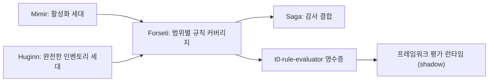

# T0 기반 프레임워크 규칙 근거

이 설계는 활성화된 카탈로그 규칙이 프레임워크 컨트롤 평가에 근거를 제공하도록 합니다. T0(결정적
규칙)는 이미 활성화된 각 규칙을 인벤토리 리소스에 대해 평가합니다. 이 설계는 그 결과를 범위에
결합되고 재현 가능한 근거로 바꾸는 방법을 정의합니다. 먼저 Azure Well-Architected Framework(WAF)
컨트롤에 적용하고, 이후 Microsoft Cloud Security Benchmark(MCSB), Cloud Adoption Framework(CAF),
Well-Architected Reliability Assessment(WARA) 권고로 확장합니다.

> **범위:** 이 설계는 `t0-rule-evaluator` 근거 생성자, 이 생성자가 사용하는 범위별 규칙 커버리지
> 계약, 프레임워크별 도입 순서를 담당합니다. 평가 런타임은
> [프레임워크 평가](framework-assessment-ko.md)와 [WARA 평가](wara-assessment-ko.md)에 그대로
> 둡니다.
>
> **초기 모드:** 모든 결과는 관찰 전용 shadow 평가입니다. 근거는 규칙 활성화, 승인, 위험, 승격,
> 수정, 실행 권한을 바꿀 수 없습니다.

## 설계 요약

규칙은 기존의 관리되는 활성화 경로로 활성화합니다. T0는 완전한 인벤토리 세대에 대해 그 규칙을
평가하고, Forseti는 Resource와 Rule 쌍마다 최종 결과를 하나씩 기록합니다. 그다음
`t0-rule-evaluator` 생성자가 그 결과가 정확한 워크로드 범위와 정확히 활성화된 규칙 개정을
포함한다는 사실을 증명합니다. 증명한 뒤에만 컨트롤 요구 사항에 대한 프레임워크 근거 영수증을
만듭니다. 증명할 수 없는 항목은 `unknown`으로 유지합니다.

## 현재 공백

2026-10-07에 저장소 카탈로그에서 측정한 공백은 다음과 같습니다.

| 영역 | 측정된 상태 | 결과 |
|------|-------------|------|
| WAF 규칙 요구 사항 | 59개 컨트롤 중 8개의 요구 사항 36개가 서로 다른 규칙 참조 31개를 인용합니다. 활성화 여부는 저장소가 아니라 배포에 고정된 활성화 세대에서 결정됩니다. 카탈로그는 `t0-rule-evaluator`를 권위 있는 생성자로 지정합니다. | 이 영수증을 만드는 코드가 없으므로 모든 규칙 요구 사항이 `unknown`으로 남습니다. |
| baseline 완전성 | `BaselineEvaluationCompletion.expected_denominator`는 Forseti가 기록한 결과 수로 계산됩니다. | 누락된 Resource와 Rule 쌍을 감지할 수 없으므로 개수로 커버리지를 증명할 수 없습니다. |
| 세대 결합 | baseline 세대는 Rule 활성화 세대가 아니라 인벤토리 관측을 식별합니다. | 다른 활성화 규칙 개정을 기준으로 결과를 읽을 수 있습니다. |
| 영수증 출처 | `FrameworkEvidenceReceipt`에는 활성화, 규칙 개정, baseline 필드가 없습니다. | 평가가 다른 활성화나 카탈로그 개정의 근거를 거부할 수 없습니다. |
| MCSB | v1 컨트롤 86개 중 13개가 규칙 25개를 인용하며 모두 `partial` 매핑입니다. v2-preview에는 매핑이 없습니다. | 부분 매핑으로는 컨트롤 충족을 결정할 수 없습니다. |
| WARA | 자동화 가능한 권고 143개가 차단되어 있고, 검토된 쿼리 평가기는 3개입니다. | WARA에는 규칙 기반 평가 경로가 없습니다. |
| 수집된 Azure Policy 규칙 | 규칙 3,628개가 `azure-policy://` 표현식 참조만 가집니다. | T0가 실행할 수 없으며 먼저 검토된 Rego가 필요합니다. |

## 소유권과 이벤트 경계

**초기 설계.** Forseti의 baseline 기록을 읽어 영수증을 쓰는 프레임워크 작업을 추가합니다.

**비판.** 독립 작업에는 책임 에이전트가 없습니다. 또한 다른 서비스의 변경 가능한 상태에서 규칙
결과를 직접 읽으면 [에이전트 판테온](../agents/agent-pantheon-ko.md)이 권한 있는 협업에 요구하는
이벤트 버스 경계를 우회합니다.

**개정.** Forseti가 생성자를 소유합니다. `t0-rule-evaluator`는 새 에이전트가 아니라 Forseti
baseline 작업자가 구현하는 영수증 생성자 식별자입니다. 다른 역할은 바뀌지 않습니다.

- Mimir는 변경 불가능한 `RuleActivationGeneration`을 제공하며 규칙 멤버십의 유일한 소유자로
  남습니다.
- Huginn은 완전한 인벤토리 세대를 제공합니다.
- Saga는 모든 커버리지 기록과 영수증에 추가 전용 감사 참조를 결합합니다.
- Norns는 매핑되지 않은 요구 사항에 대해 비활성 규칙 후보를 제안할 수 있지만 멤버십을 바꾸지
  않습니다.

커버리지 기록과 영수증은 Saga 감사 참조와 함께 저장되는 권한 없는 읽기 모델입니다. 작성자는
Forseti뿐입니다. 평가 런타임은 읽기 모델 원본 어댑터로 커밋된 기록을 읽고, 그 결과로 만든 평가는
기존의 감사되는 프레임워크 평가 게시 경로를 그대로 거칩니다. 이 변경은 토픽, 구독, `AgentSpec`
소유권을 추가하지 않습니다. 나중에 푸시 전달이 필요한 소비자가 생기면 별도로 검토된 변경에서
작성자가 하나인 스키마 등록 토픽을 추가합니다.

## 범위별 규칙 커버리지 계약

**초기 설계.** 기존 완료 기록을 재사용하고 위반이 0개이면 충족으로 처리합니다.

**비판.** 완료 기록은 기록된 결과만 세므로 건너뛴 쌍도 완전해 보입니다. 또한 완료 기록은 전체
인벤토리를 다루지만 프레임워크 컨트롤은 워크로드 범위 하나에 대해 평가합니다.

**개정.** 개수 기반 분모를 교체한 뒤 그로부터 범위별 커버리지를 도출합니다.

- 버전 2 baseline 완료 기록은 Forseti가 기록한 결과와 독립적으로 전체 인벤토리의 기대 쌍 집합을
  도출합니다. 버전 1 완료 기록은 이전 근거로 계속 읽을 수 있지만 더 이상 완전성을 증명하지
  않습니다. 기존 규칙 점검 결과 요약은 이 설계를 배포하기 전에 버전 2로 전환하므로 Console이
  개수 기반 분모로 완전한 커버리지를 보고할 수 없습니다.
- 버전이 지정된 범위별 커버리지 기록은 버전 2 baseline을 워크로드 하나에 투영합니다.

Forseti는 T0와 같은 디스패치로 기대 쌍을 도출합니다.

1. 고정된 활성화 세대와 멤버 규칙 아티팩트 및 다이제스트를 읽습니다.
2. 고정된 인벤토리 세대에서 워크로드 리소스 집합을 읽고 평가 프로필이 사용하는 범위 다이제스트를
   다시 계산합니다. 각 공급자 리소스 ID를 중립 인벤토리 리소스 참조와 형식에 매핑합니다.
   불일치하면 `scope_mismatch`로 기록을 중단합니다.
3. 각 워크로드 리소스에 대해 중립 리소스 형식과 인벤토리 관측 신호로
   `RuleIndex.rules_for_signal`을 호출해 기대 규칙을 선택합니다. 이때 T0와 같은 신호 형식 레지스트리
   세대와 활성화 멤버 아티팩트를 사용하고, 디스패처와 레지스트리 다이제스트를 기록합니다.
   `submission_criteria`는 카탈로그 수락 검사이며 기대 쌍을 필터링하지 않습니다.
4. 각 쌍의 키는 인벤토리 세대, 중립 리소스 참조, 활성화 세대, 멤버 규칙 다이제스트, 디스패치
   신호로 구성합니다. 먼저 전체 인벤토리 결과를 워크로드 리소스 집합으로 투영합니다. 모든 기대
   키에 최종 결과가 정확히 하나 있고, 기대 키가 없는 범위 내 결과가 하나도 없을 때만 기록이
   완전합니다.

기록에는 다음 필드가 있습니다.

| 필드 그룹 | 내용 |
|-----------|------|
| 범위 | 워크로드 ID, 범위 다이제스트, 리소스 집합 다이제스트, 공급자 리소스 ID와 인벤토리 리소스 참조의 매핑 |
| 활성화 | 활성화 세대 ID와 다이제스트, 규칙 카탈로그 다이제스트, 멤버 규칙 ID, 버전, 다이제스트, 디스패처와 신호 형식 레지스트리 다이제스트 |
| 인벤토리 | 인벤토리 세대, 관측 다이제스트, 관측 시각 |
| 커버리지 | 규칙별 대상 집합 다이제스트, 기대 쌍 수, 포함된 쌍 수, compliant, violated, 판단 보류 개수 |
| 출처 | 버전 2 baseline 완료 다이제스트, Saga 감사 참조와 다이제스트, 커버리지 다이제스트 |
| 제한 사항 | `pair_missing`, `duplicate_pair`, `conflicting_pair`, `unexpected_pair`, `scope_mismatch`, `rule_not_activated`, `rule_revision_drift`, `activation_catalog_drift`, `no_eligible_resource`, `stale_inventory` 같은 제한된 기계 코드 |

이후 카탈로그나 활성화 개정이 생기면 새 기록을 만듭니다. 이전 기록을 다시 해석하지 않습니다.

### 식별자 이름

이 흐름에는 서로 다른 카탈로그 식별자 세 개가 나타납니다. 기록은 다음과 같이 명시적인 이름을
사용하며, 다이제스트는 비교하기 전에 정규 `sha256:` 형식으로 맞춥니다.

| 이름 | 의미 |
|------|------|
| `framework_assessment_catalog_digest` | 고정된 WAF, CAF 또는 WARA 평가 카탈로그 |
| `rule_catalog_digest` | 활성화 세대를 설치할 때 사용한 규칙 카탈로그 |
| `evaluated_rule_catalog_digest` | T0가 baseline 결과에 사용한 규칙 카탈로그 개정 |

### 평가 측 활성화 고정

영수증은 자기 자신의 활성화 세대를 보증할 수 없습니다. WAF 평가 프로필이나 요청은 Forseti와
독립적으로 읽은 Mimir의 현재 세대에서 `rule_activation_generation_id`,
`rule_activation_generation_digest`, `rule_catalog_digest`를 고정합니다. 수락 단계에서는 모든 규칙
영수증이 이 값과 정확히 일치해야 합니다.

## 요구 사항 결과

생성자는 규칙 요구 사항 하나를 영수증 하나로 변환합니다. 모든 영수증은 범위 다이제스트, 활성화
세대, 멤버 규칙 다이제스트, 커버리지 다이제스트, 인벤토리 세대를 결합합니다. 생성자는 다음 검사를
순서대로 적용하고 처음 일치하는 행에서 멈춥니다.

| 순서 | 조건 | 영수증 결과 | 제한 사항 |
|------|------|-------------|-----------|
| 1 | 범위 다이제스트가 프로필과 다름 | `unknown` | `scope_mismatch` |
| 2 | 규칙이 고정된 활성화 세대에 없음 | `unknown` | `rule_not_activated` |
| 3 | 규칙 카탈로그가 고정된 `rule_catalog_digest`와 다름 | `unknown` | `activation_catalog_drift` |
| 4 | 평가된 규칙 다이제스트가 활성화 멤버 다이제스트와 다름 | `unknown` | `rule_revision_drift` |
| 5 | 인벤토리 세대가 최신성 상한보다 오래됨 | `unknown` | `stale_inventory` |
| 6 | 기대 쌍에 결과가 없거나, 두 개이거나, 서로 충돌하거나, 범위 내 결과에 기대 쌍이 없음 | `unknown` | `pair_missing`, `duplicate_pair`, `conflicting_pair` 또는 `unexpected_pair` |
| 7 | 워크로드에 해당 규칙의 대상 리소스가 없음 | `unknown` | `no_eligible_resource` |
| 8 | 대상 쌍 중 하나라도 `violated` | `failed` | 없음 |
| 9 | 대상 쌍 중 하나라도 판단 보류(`abstained`) | `unknown` | `held_for_review` |
| 10 | 모든 대상 쌍이 `compliant` | `satisfied` | 없음 |

`not_applicable`은 평가 프로필에서 승인된 적용 가능성 결정으로만 만들어집니다. 리소스 형식이 없다고
해서 통과로 처리하지 않습니다. 기존 프레임워크 런타임은 계속 요구 사항을 결합하며 문서, 메트릭,
훈련, 승인 근거는 각 생성자에서 받습니다.

## 프레임워크 도입 순서

프레임워크마다 평가 모델이 다르므로 규칙 근거를 하나씩 도입합니다.

| 프레임워크 | 규칙 근거가 결정적 근거가 되기 위한 선행 조건 | 첫 범위 |
|------------|-----------------------------------------------|---------|
| WAF | 버전 2 baseline 완료 기록, 범위별 커버리지 계약, 평가 측 활성화 고정, 영수증 출처 필드 | 규칙 요구 사항이 있는 컨트롤 8개 |
| MCSB | 명시적인 요구 사항 분해를 포함한 검토된 MCSB 평가 카탈로그, 프로필, 런타임. 현재 `partial` 매핑은 보조 근거로만 사용합니다. | 검토된 완전 규칙 결합이 있는 v1 컨트롤 |
| CAF | 계층 세대와 인벤토리 세대를 모두 고정하는 클라우드 자산 프로필 | 검토된 완전 규칙 결합이 있는 랜딩 존 기술 영역. 방법론 영역은 수동으로 유지합니다. |
| WARA | 수락 규칙이 각각 다른 `arg_query` 또는 `t0_rule` 구분형 평가기 결합. 규칙 결합은 규칙 참조, 활성화 및 멤버 다이제스트, 범위 다이제스트, 여러 규칙의 결합 방식을 고정합니다. | 아래 기능 매트릭스를 통과한 권고 |

WARA 권고는 기능 매트릭스가 정확한 리소스 형식, 하위 리소스 동작, 검사가 읽는 모든 필드의
인벤토리 원본과 최신성, 매개 변수, 대상 집합 구성, 동일한 실패 의미를 증명할 때만 규칙 기반이
됩니다. 조인이 없는 쿼리라는 조건은 첫 번째 필터일 뿐입니다. 검사 중 하나라도 통과하지 못한 권고는
기존 쿼리 또는 수동 근거 경로를 유지합니다.

## Azure Policy 변환

수집된 Azure Policy 규칙은 검토된 Rego가 생기기 전까지 T0에서 실행할 수 없습니다. 변환 시범은 실행
가능성 마일스톤에서 다음 입력을 증명한 뒤에만 시작합니다.

- 변경 불가능한 다이제스트로 고정된 정책 및 이니셔티브 스냅숏과 변환 전에 확정된 매개 변수
- Azure 별칭과 정규화된 인벤토리 속성 사이의 검토된 매핑
- 누락 값, 대소문자, 배열, 태그, 정책 모드에 대해 정의된 의미
- 전체 조건과 효과가 지원되는 문법 안에 있을 때만 변환하고 그 외에는 변환하지 않음
- 원본 정책과 변환기 다이제스트를 포함하고 Mimir 품질 게이트를 거쳐서만 카탈로그에 들어가는 비활성
  규칙 후보
- 버전, 매개 변수, 범위, 시간을 맞춘 Azure Policy 준수 상태와의 차등 비교. 불일치가 하나라도
  있으면 해당 후보의 활성화를 차단합니다.

## 활성화 제안

프레임워크 보기는 규칙 멤버십을 바꾸지 않습니다. 컨트롤은 필요한 규칙과 그 규칙의 활성화 여부를
표시할 수 있습니다. 그다음 기존 요청 흐름으로 활성화 제안 하나를 제출할 수 있으며, 이 제안은 사람
승인이 필요하고 Mimir가 설치합니다. 제안은 검토된 정확한 결합에서만 만들어집니다. 형식이 지정된
WAF `rule` 요구 사항은 컨트롤 수준 교차워크 관계가 `partial`이어도 요구 사항 수준에서 그 자체로
검토된 정확한 결합입니다. MCSB, CAF, WARA는 제안을 만들기 전에 명시적인 검토된 결합 필드가
필요합니다. 활성화는 규칙을 T0 관찰 대상으로 만들 뿐 적용 모드를 켜지 않습니다.
[규칙 거버넌스](rule-governance-ko.md)를 참조하세요.

## 출시 단계

| 단계 | 종료 근거 |
|------|-----------|
| 1. 소유권과 이벤트 경계 | Forseti 작업자, 읽기 모델, Saga 결합을 검토하고 새 토픽이나 에이전트 소유권 변경이 없음을 확인합니다. |
| 2. 버전이 지정된 계약 | 버전 2 baseline 완료 기록, 범위별 커버리지, 프로필 활성화 고정, 확장된 영수증 모델이 검증을 통과하고 섞인 범위, 활성화, 카탈로그 식별자를 거부합니다. 규칙 점검 결과 요약이 버전 2를 읽습니다. |
| 3. 안전하게 실패하는 테스트 | 집중 테스트로 결과 표의 각 행을 순서대로, T0와의 디스패치 일치, 결정적 재현을 증명합니다. |
| 4. WAF 생성자 | 완전한 로컬 인벤토리 세대에서 WAF 컨트롤 8개의 규칙 요구 사항이 `satisfied` 또는 `failed` 영수증이 됩니다. |
| 5. Console 커버리지 | 컨트롤 보기가 브라우저에서 상태를 계산하지 않고 서버가 소유한 규칙 커버리지와 활성화 상태를 표시합니다. |
| 6. MCSB, CAF, WARA | 각 프레임워크가 도입 표의 선행 조건을 충족합니다. |
| 7. Azure Policy 시범 | 변환된 후보가 Mimir에 도달하기 전에 실행 가능성 마일스톤을 통과합니다. |

## 결정 사항

- **공급자 ID 매핑:** 매핑은 확정된 워크로드 범위에 고정된 온톨로지 릴리스만 사용합니다. 해당
  릴리스에서 공급자 ID 하나가 인벤토리 리소스 참조 두 개 이상에 매핑되면 하나를 고르지 않고
  `scope_mismatch`로 커버리지 기록을 중단합니다.
- **대상 리소스 없음:** 대상 워크로드 리소스가 없는 규칙 요구 사항은 `no_eligible_resource`와 함께
  `unknown`으로 유지합니다. FDAI는 적용 가능성 검토를 자동으로 요청하지 않으며, 책임 담당자가 승인된
  `not_applicable` 결정을 기록할지 판단합니다.

## 관련 문서

| 알아볼 내용 | 문서 |
|-------------|------|
| WAF 및 CAF 평가 런타임 | [프레임워크 평가](framework-assessment-ko.md) |
| WARA 평가 런타임 | [WARA 평가](wara-assessment-ko.md) |
| 규칙 활성화 세대 | [규칙 거버넌스](rule-governance-ko.md) |
| baseline 평가 기록 | [관찰 가능성 및 탐지](observability-and-detection-ko.md) |
| 제공 상태 및 남은 작업 | [구현 원장](../../roadmap-implementation/rules-and-detection/framework-rule-evidence.md) |
