# T0 기반 프레임워크 규칙 근거

이 설계는 활성화된 카탈로그 규칙이 프레임워크 컨트롤 평가에 근거를 제공하도록 합니다. T0(결정적
규칙)는 이미 활성화된 각 규칙을 인벤토리 리소스에 대해 평가합니다. 이 설계는 그 결과를 범위에
결합되고 재현 가능한 근거로 바꾸는 방법을 정의합니다. 먼저 Azure Well-Architected Framework(WAF)
컨트롤에 적용하고, 이후 Microsoft Cloud Security Benchmark(MCSB), Cloud Adoption Framework(CAF),
Well-Architected Reliability Assessment(WARA) 권고로 확장합니다.

> **범위:** 이 설계는 `t0-rule-evaluator` 근거 생성자, 이 생성자가 사용하는 범위별 규칙 커버리지
> 계약, 프레임워크별 도입 순서를 담당합니다. 평가 런타임은
> [프레임워크 평가](framework-assessment-ko.md)와 [WARA 평가](wara-assessment-ko.md)에 그대로
> 둡니다.
>
> **초기 모드:** 모든 결과는 관찰 전용 shadow 평가입니다. 근거는 규칙 활성화, 승인, 위험, 승격,
> 수정, 실행 권한을 바꿀 수 없습니다.

## 설계 요약

규칙은 기존의 관리되는 활성화 경로로 활성화합니다. T0는 완전한 인벤토리 세대에 대해 그 규칙을
평가하고, Forseti는 Resource와 Rule 쌍마다 최종 결과를 하나씩 기록합니다. 그다음
`t0-rule-evaluator` 생성자가 그 결과가 정확한 워크로드 범위와 정확히 활성화된 규칙 개정을
포함한다는 사실을 증명합니다. 증명한 뒤에만 컨트롤 요구 사항에 대한 프레임워크 근거 영수증을
만듭니다. 증명할 수 없는 항목은 `unknown`으로 유지합니다.

## 현재 공백

2026-10-07에 저장소 카탈로그에서 측정한 공백은 다음과 같습니다.

| 영역 | 측정된 상태 | 결과 |
|------|-------------|------|
| WAF 규칙 요구 사항 | 59개 컨트롤 중 8개의 요구 사항 36개가 서로 다른 규칙 참조 31개를 인용합니다. 활성화 여부는 저장소가 아니라 배포에 고정된 활성화 세대에서 결정됩니다. 카탈로그는 `t0-rule-evaluator`를 권위 있는 생성자로 지정합니다. | 이 영수증을 만드는 코드가 없으므로 모든 규칙 요구 사항이 `unknown`으로 남습니다. |
| baseline 완전성 | `BaselineEvaluationCompletion.expected_denominator`는 Forseti가 기록한 결과 수로 계산됩니다. | 누락된 Resource와 Rule 쌍을 감지할 수 없으므로 개수로 커버리지를 증명할 수 없습니다. |
| 세대 결합 | baseline 세대는 Rule 활성화 세대가 아니라 인벤토리 관측을 식별합니다. | 다른 활성화 규칙 개정을 기준으로 결과를 읽을 수 있습니다. |
| 영수증 출처 | `FrameworkEvidenceReceipt`에는 활성화, 규칙 개정, baseline 필드가 없습니다. | 평가가 다른 활성화나 카탈로그 개정의 근거를 거부할 수 없습니다. |
| MCSB | v1 컨트롤 86개 중 13개가 규칙 25개를 인용하며 모두 `partial` 매핑입니다. v2-preview에는 매핑이 없습니다. | 부분 매핑으로는 컨트롤 충족을 결정할 수 없습니다. |
| WARA | 자동화 가능한 권고 143개가 차단되어 있고, 검토된 쿼리 평가기는 3개입니다. | WARA에는 규칙 기반 평가 경로가 없습니다. |
| 수집된 Azure Policy 규칙 | 규칙 3,628개가 `azure-policy://` 표현식 참조만 가집니다. | T0가 실행할 수 없으며 먼저 검토된 Rego가 필요합니다. |
| 인벤토리 속성 | 2026-10-08 기준 로컬 개발 인벤토리의 object-storage, network.nsg, secret-store, postgresql-server, kubernetes-cluster 리소스는 Azure Resource Manager 원본 `properties`만 가졌습니다. 인용된 규칙이 평가하는 `diagnostic_settings`, `private_endpoints`, `security_rules` 같은 정규화 속성은 하나도 없었습니다. | 정책은 없는 속성을 거부할 수 없으므로 이 쌍들이 준수로 보였습니다. 이제 `property_unobserved`로 판단 보류되며, 인벤토리 수집이 정규화 속성을 제공하기 전까지 WAF 규칙 요구 사항은 `unknown`으로 남습니다. |

## 소유권과 이벤트 경계

**초기 설계.** Forseti의 baseline 기록을 읽어 영수증을 쓰는 프레임워크 작업을 추가합니다.

**비판.** 독립 작업에는 책임 에이전트가 없습니다. 또한 다른 서비스의 변경 가능한 상태에서 규칙
결과를 직접 읽으면 [에이전트 판테온](../agents/agent-pantheon-ko.md)이 권한 있는 협업에 요구하는
이벤트 버스 경계를 우회합니다.

**개정.** Forseti가 생성자를 소유합니다. `t0-rule-evaluator`는 새 에이전트가 아니라 Forseti
baseline 작업자가 구현하는 영수증 생성자 식별자입니다. 다른 역할은 바뀌지 않습니다.

- Mimir는 변경 불가능한 `RuleActivationGeneration`을 제공하며 규칙 멤버십의 유일한 소유자로
  남습니다.
- Huginn은 완전한 인벤토리 세대를 제공합니다.
- Saga는 계속 감사 체인을 소유합니다. Forseti는 공유 추가 전용 감사 저장소 공급자로 Forseti 귀속
  항목을 쓰며 Saga 에이전트를 직접 호출하지 않습니다.
- Norns는 매핑되지 않은 요구 사항에 대해 비활성 규칙 후보를 제안할 수 있지만 멤버십을 바꾸지
  않습니다.

커버리지 기록과 영수증은 감사 참조와 함께 저장되는 권한 없는 읽기 모델입니다. 버전 2 baseline
커버리지 기록의 작성자는 Forseti뿐입니다. 프레임워크 평가 작업은 읽기 모델 원본 어댑터로 커밋된 그
기록을 읽고, `t0-rule-evaluator` 생성자 ID로 범위별 커버리지 기록과 영수증을 만듭니다. Forseti의
기록은 쓰지 않으며, 그 결과로 만든 평가는 기존의 감사되는 프레임워크 평가 게시 경로를 그대로
거칩니다. 이 변경은 토픽, 구독, `AgentSpec`
소유권을 추가하지 않습니다. 나중에 푸시 전달이 필요한 소비자가 생기면 별도로 검토된 변경에서
작성자가 하나인 스키마 등록 토픽을 추가합니다.

## baseline 트리거

Forseti는 이미 완전한 인벤토리 세대 하나를 평가할 수 있지만, 이를 호출하는 런타임 경로가 없습니다.
인벤토리 작업은 별도 프로세스에서 실행되며 Resource마다 구성 이벤트를 하나씩 게시하므로, Core는
세대 전체가 전달되었다는 사실을 알 수 없습니다.

**초기 설계.** 최신 인벤토리 세대를 주기적으로 조회해 평가하는 Core 작업을 실행합니다.

**비판.** 에이전트가 소유하지 않는 주기 작업에는 책임 소유자가 없습니다. 인벤토리 작업의 대기 중인
전달 기록을 읽으면 Core가 다른 서비스의 변경 가능한 작업 흐름 상태에 결합됩니다. 이벤트만 쓰는
설계는 표시 이벤트 하나가 유실되면 baseline도 유실됩니다. 또한 표시 이벤트가 일반 이벤트로 T0 제어
루프에 도달하면 세대마다 규칙 불일치에 따른 사람 승인 판정이 생깁니다.

**개정.** 두 번째 비판에서 표시 이벤트는 Resource 이벤트가 Resource별 키로 게시되므로 순서를
보장하지 않고, Huginn 정규화 과정에서 필드가 사라진다는 점이 확인되었습니다. 또한 Forseti가 Saga의
감사 결합기를 호출하는 것은 Saga 상태를 바꾸는 직접 에이전트 호출이라는 점도 확인되었습니다. 개정된
트리거에는 표시 이벤트가 없습니다.

1. Forseti는 기존 시작 시 복원과 유지 관리 주기에서 작업을 찾습니다. 주입된 읽기 전용
   `PromotedInventoryGenerationReader`에 전달이 끝난 가장 최신의 완전한 세대를 요청합니다. 이 판독기는
   공유 공급자 프로토콜이며 PostgreSQL 구현은 delivery에 있고 런타임 조립에서 결합됩니다. 전달 기록이
   아니라 커밋된 인벤토리 스냅숏을 읽습니다.
2. 감사 기록을 쓰기 전에 Forseti는 인벤토리 관측 다이제스트와 현재 활성화 세대 다이제스트를 키로
   원자적 점유를 획득합니다. 이미 점유되었거나 완료된 세대는 건너뛰므로, 재시도나 동시 탐색으로 감사가
   중복 추가되지 않습니다. 이후 활성화 세대가 바뀌면 같은 인벤토리 세대에 대해 새 점유를 만듭니다.
3. 범위가 제한된 Forseti 작업자는 런타임의 현재 활성화 세대로 점유한 세대를 평가합니다. 작업자에는
   마감 시간과 Resource 한도가 있습니다. 한도를 넘는 세대, 읽기 실패, 마감 시간 초과는 해당 세대를 사용할
   수 없음으로 기록하고 완료 기록을 쓰지 않습니다.
4. Forseti는 제어 루프가 판단 보류 감사에 사용하는 것과 같은 공유 추가 전용 감사 저장소 공급자로
   Forseti 귀속 감사 항목을 씁니다. 버전 2 완료 기록은 결과마다 Saga를 호출하는 대신 결과 집합 전체에
   감사 항목 하나를 결합합니다. Forseti는 Saga 에이전트를 호출하지 않습니다.
5. 제어 루프와 Forseti 판단 경로에는 새 이벤트 형식이 전달되지 않으므로 판정이나 사람 승인 요청이
   생기지 않습니다.

이 변경은 토픽, 구독, `AgentSpec` 소유권을 추가하지 않습니다. 나중에 푸시 전달이 필요한 소비자가
생기면 별도로 검토된 변경에서 작성자가 하나인 스키마 등록 토픽을 추가합니다.

## 범위별 규칙 커버리지 계약

**초기 설계.** 기존 완료 기록을 재사용하고 위반이 0개이면 충족으로 처리합니다.

**비판.** 완료 기록은 기록된 결과만 세므로 건너뛴 쌍도 완전해 보입니다. 또한 완료 기록은 전체
인벤토리를 다루지만 프레임워크 컨트롤은 워크로드 범위 하나에 대해 평가합니다.

**개정.** 개수 기반 분모를 교체한 뒤 그로부터 범위별 커버리지를 도출합니다.

- 버전 2 baseline 완료 기록은 Forseti가 기록한 결과와 독립적으로 전체 인벤토리의 기대 쌍 집합을
  도출합니다. 버전 1 완료 기록은 이전 근거로 계속 읽을 수 있지만 더 이상 완전성을 증명하지
  않습니다. 기존 규칙 점검 결과 요약은 이 설계를 배포하기 전에 버전 2로 전환하므로 Console이
  개수 기반 분모로 완전한 커버리지를 보고할 수 없습니다.
- 버전이 지정된 범위별 커버리지 기록은 버전 2 baseline을 워크로드 하나에 투영합니다.

Forseti는 T0와 같은 디스패치로 기대 쌍을 도출합니다.

1. 고정된 활성화 세대와 멤버 규칙 아티팩트 및 다이제스트를 읽습니다.
2. 고정된 인벤토리 세대에서 워크로드 리소스 집합을 읽고 평가 프로필이 사용하는 범위 다이제스트를
   다시 계산합니다. 각 공급자 리소스 ID를 중립 인벤토리 리소스 참조와 형식에 매핑합니다.
   불일치하면 `scope_mismatch`로 기록을 중단합니다.
3. 각 워크로드 리소스에 대해 중립 리소스 형식과 인벤토리 관측 신호로
   `RuleIndex.rules_for_signal`을 호출해 기대 규칙을 선택합니다. 이때 T0와 같은 신호 형식 레지스트리
   세대와 활성화 멤버 아티팩트를 사용하고, 디스패처와 레지스트리 다이제스트를 기록합니다.
   `submission_criteria`는 카탈로그 수락 검사이며 기대 쌍을 필터링하지 않습니다.
4. 각 쌍의 키는 인벤토리 세대, 중립 리소스 참조, 활성화 세대, 멤버 규칙 다이제스트, 디스패치
   신호로 구성합니다. 먼저 전체 인벤토리 결과를 워크로드 리소스 집합으로 투영합니다. 모든 기대
   키에 최종 결과가 정확히 하나 있고, 기대 키가 없는 범위 내 결과가 하나도 없을 때만 기록이
   완전합니다.

기록에는 다음 필드가 있습니다.

| 필드 그룹 | 내용 |
|-----------|------|
| 범위 | 프레임워크 ID, 워크로드 ID, 범위 다이제스트, 리소스 집합 다이제스트, 공급자 리소스 ID와 인벤토리 리소스 참조의 매핑 |
| 활성화 | 활성화 세대 ID와 다이제스트, 규칙 카탈로그 다이제스트, 평가된 규칙 카탈로그 다이제스트, 디스패치 신호, T0 디스패치를 식별하는 버전 2 기대 쌍 집합 다이제스트 |
| 인벤토리 | 인벤토리 세대, baseline 세대 참조, 관측 다이제스트, 관측 시각 |
| 커버리지 | 규칙별 멤버 규칙과 평가된 규칙 다이제스트, 대상 집합 다이제스트, 대상 개수, compliant, violated, 판단 보류, 누락, 중복, 충돌, 예상 밖, 개정 불일치 개수 |
| 출처 | 버전 2 baseline 커버리지 다이제스트와 감사 참조, 모든 영수증이 담는 범위별 커버리지 다이제스트, 기록의 감사 참조, 기록 다이제스트 |
| 제한 사항 | `pair_missing`, `duplicate_pair`, `conflicting_pair`, `unexpected_pair`, `scope_mismatch`, `rule_not_activated`, `rule_revision_drift`, `activation_catalog_drift`, `no_eligible_resource`, `stale_inventory` 같은 제한된 기계 코드 |

이후 카탈로그나 활성화 개정이 생기면 새 기록을 만듭니다. 이전 기록을 다시 해석하지 않습니다.

평가 작업은 평가가 커버리지 다이제스트를 인용하기 전에 각 기록을 기록 다이제스트 아래에 한 번만
저장하고, 감사 항목도 같은 원자적 쓰기로 함께 남깁니다. `framework-rule-coverage:latest` 포인터는
가장 최근 평가의 기록을 가리킵니다. 검증 시 범위별 커버리지 다이제스트, 리소스 집합 다이제스트, 기록
다이제스트를 다시 계산하므로 범위, 활성화, 카탈로그, 인벤토리 ID가 섞인 기록은 거부됩니다. 모든
읽기 측도 수치를 사용하기 전에 현재 버전 2 baseline과 기록을 대조합니다.

### 식별자 이름

이 흐름에는 서로 다른 카탈로그 식별자 세 개가 나타납니다. 기록은 다음과 같이 명시적인 이름을
사용하며, 다이제스트는 비교하기 전에 정규 `sha256:` 형식으로 맞춥니다.

| 이름 | 의미 |
|------|------|
| `framework_assessment_catalog_digest` | 고정된 WAF, CAF 또는 WARA 평가 카탈로그 |
| `rule_catalog_digest` | 활성화 세대를 설치할 때 사용한 규칙 카탈로그 |
| `evaluated_rule_catalog_digest` | T0가 baseline 결과에 사용한 규칙 카탈로그 개정 |

### 평가 측 활성화 고정

영수증은 자기 자신의 활성화 세대를 보증할 수 없습니다. WAF 평가 프로필이나 요청은 Forseti와
독립적으로 읽은 Mimir의 현재 세대에서 `rule_activation_generation_id`,
`rule_activation_generation_digest`, `rule_catalog_digest`를 고정합니다. 수락 단계에서는 모든 규칙
영수증이 이 값과 정확히 일치해야 합니다.

## 요구 사항 결과

생성자는 규칙 요구 사항 하나를 영수증 하나로 변환합니다. 모든 영수증은 범위 다이제스트, 활성화
세대, 멤버 규칙 다이제스트, 커버리지 다이제스트, 인벤토리 세대를 결합합니다. 생성자는 다음 검사를
순서대로 적용하고 처음 일치하는 행에서 멈춥니다.

| 순서 | 조건 | 영수증 결과 | 제한 사항 |
|------|------|-------------|-----------|
| 1 | 범위 다이제스트가 프로필과 다름 | `unknown` | `scope_mismatch` |
| 2 | 규칙이 고정된 활성화 세대에 없음 | `unknown` | `rule_not_activated` |
| 3 | 규칙 카탈로그가 고정된 `rule_catalog_digest`와 다름 | `unknown` | `activation_catalog_drift` |
| 4 | 평가된 규칙 다이제스트가 활성화 멤버 다이제스트와 다름 | `unknown` | `rule_revision_drift` |
| 5 | 인벤토리 세대가 최신성 상한보다 오래됨 | `unknown` | `stale_inventory` |
| 6 | 기대 쌍에 결과가 없거나, 두 개이거나, 서로 충돌하거나, 범위 내 결과에 기대 쌍이 없음 | `unknown` | `pair_missing`, `duplicate_pair`, `conflicting_pair` 또는 `unexpected_pair` |
| 7 | 워크로드에 해당 규칙의 대상 리소스가 없음 | `unknown` | `no_eligible_resource` |
| 8 | 대상 쌍 중 하나라도 `violated` | `failed` | 없음 |
| 9 | 대상 쌍 중 하나라도 판단 보류(`abstained`) | `unknown` | `held_for_review` |
| 10 | 모든 대상 쌍이 `compliant` | `satisfied` | 없음 |

Forseti는 규칙이 `evaluates`에 선언한 모든 속성을 리소스가 가지고 있을 때만 `compliant`를
기록합니다. 그렇지 않으면 해당 쌍은 `property_unobserved`와 함께 `abstained`가 되고 9행이
적용됩니다. 거부 결과는 검토된 규칙 자체의 판단이므로 `violated`로 유지합니다.

`not_applicable`은 평가 프로필에서 승인된 적용 가능성 결정으로만 만들어집니다. 리소스 형식이 없다고
해서 통과로 처리하지 않습니다. 기존 프레임워크 런타임은 계속 요구 사항을 결합하며 문서, 메트릭,
훈련, 승인 근거는 각 생성자에서 받습니다.

## 프레임워크 도입 순서

프레임워크마다 평가 모델이 다르므로 규칙 근거를 하나씩 도입합니다.

| 프레임워크 | 규칙 근거가 결정적 근거가 되기 위한 선행 조건 | 첫 범위 |
|------------|-----------------------------------------------|---------|
| WAF | 버전 2 baseline 완료 기록, 범위별 커버리지 계약, 평가 측 활성화 고정, 영수증 출처 필드 | 규칙 요구 사항이 있는 컨트롤 8개 |
| MCSB | 명시적인 요구 사항 분해를 포함한 검토된 MCSB 평가 카탈로그, 프로필, 런타임. 현재 `partial` 매핑은 보조 근거로만 사용합니다. `azure-mcsb` 워크로드 카탈로그로 구현되었습니다. [MCSB 평가](#mcsb-평가)를 참조하세요. | 검토된 완전 규칙 결합이 있는 v1 컨트롤 |
| CAF | 계층 세대와 인벤토리 세대를 모두 고정하는 클라우드 자산 프로필. 검토된 결정에 따라 CAF에는 직접 규칙 요구 사항을 두지 않습니다. [CAF 결정](#caf-결정)을 참조하세요. | 검토된 완전 규칙 결합이 있는 랜딩 존 기술 영역. 방법론 영역은 수동으로 유지합니다. |
| WARA | 수락 규칙이 각각 다른 `arg_query` 또는 `t0_rule` 구분형 평가기 결합. 규칙 결합은 규칙 참조, 활성화 및 멤버 다이제스트, 범위 다이제스트, 여러 규칙의 결합 방식을 고정합니다. 별도의 `t0_rule` overlay로 구현되었습니다. [WARA 평가](wara-assessment-ko.md#규칙-기반-평가)를 참조하세요. | 아래 기능 매트릭스를 통과한 권고 |

### MCSB 평가

생성기는 가져온 v1 컨트롤 86개, 교차워크, 검토된 원본
`rule-catalog/framework-assessments/azure-mcsb.source.yaml`에서
`rule-catalog/framework-assessments/generated/azure-mcsb.json`을 만듭니다. 원본은 교차워크의 규칙
매핑 25개를 각각 정확히 한 번 검토하고 그 근거를 기록합니다. 생성기는 누락, 중복, 근거 없음,
미검토 결합을 거부합니다.

- 모든 컨트롤에는 컨트롤 근거를 위한 결정적 수동 `artifact` 요구 사항이 하나 있고, 모든 요구 사항이
  충족되어야 합니다. 따라서 규칙 영수증은 컨트롤을 실패시킬 수는 있지만 단독으로 충족시킬 수는
  없습니다.
- 규칙 하나의 위반만으로 워크로드가 해당 컨트롤의 지침을 충족하지 못한다는 사실이 드러날 때만 결합이
  `decisive`입니다. 결정적 결합은 17개입니다.
- 나머지 결합 8개는 `supporting_only`입니다. 컨트롤을 결정하지 않고 맥락만 더합니다. 예를 들어
  NS-8은 안전하지 않은 프로토콜을 대상으로 하므로 인터넷에 노출된 RDP는 보조 근거입니다. NS-5의
  DDoS 계획 규칙도 내부 전용 가상 네트워크까지 거부하므로 보조 근거입니다. 런타임은 결정적 요구
  사항만 결합하므로 보조 요구 사항은 컨트롤을 실패시키거나 막을 수 없습니다.
- 규칙 요구 사항은 WAF와 같은 생산자, 인벤토리 세대, 1일 최신성, 활성화 고정을 사용합니다. 평가
  작업은 범위별 규칙 커버리지를 한 번만 읽어 WAF와 MCSB 영수증을 모두 만들므로 두 프레임워크가 같은
  baseline을 인용합니다. MCSB는 권한 없는 감사 영수증으로 기록합니다.

MCSB 결과의 Operator 프로젝션과 Console 보기는 구현되지 않았습니다. Operator 프로젝션은 WAF와 CAF
평가 이벤트만 받습니다.

### CAF 결정

CAF에는 직접 규칙 요구 사항을 두지 않습니다. CAF 영역은 클라우드 자산 전체의 설계 및 프로세스
결과이며, 워크로드 리소스 하나가 규칙을 위반했다고 해서 자산 설계 영역이 결정적으로 실패하지는
않습니다. CAF는 WAF 및 MCSB 컨트롤에 대한 기존 교차워크 참조를 유지하므로 규칙 근거는 해당
프레임워크를 거쳐 맥락으로만 CAF에 전달됩니다. CAF는 규칙 영수증을 소비하지 않으므로 프로필에 계층
및 인벤토리 세대 외에 규칙 활성화 고정이 필요하지 않습니다.

WARA 권고는 기능 매트릭스가 정확한 리소스 형식, 하위 리소스 동작, 검사가 읽는 모든 필드의
인벤토리 원본과 최신성, 매개 변수, 대상 집합 구성, 동일한 실패 의미를 증명할 때만 규칙 기반이
됩니다. 조인이 없는 쿼리라는 조건은 첫 번째 필터일 뿐입니다. 검사 중 하나라도 통과하지 못한 권고는
기존 쿼리 또는 수동 근거 경로를 유지합니다.

## Azure Policy 변환

수집된 Azure Policy 규칙은 검토된 Rego가 생기기 전까지 T0에서 실행할 수 없습니다. 변환 시범은 실행
가능성 마일스톤에서 다음 입력을 증명한 뒤에만 시작합니다.

- 변경 불가능한 다이제스트로 고정된 정책 및 이니셔티브 스냅숏과 변환 전에 확정된 매개 변수
- Azure 별칭과 정규화된 인벤토리 속성 사이의 검토된 매핑
- 누락 값, 대소문자, 배열, 태그, 정책 모드에 대해 정의된 의미
- 전체 조건과 효과가 지원되는 문법 안에 있을 때만 변환하고 그 외에는 변환하지 않음
- 원본 정책과 변환기 다이제스트를 포함하고 Mimir 품질 게이트를 거쳐서만 카탈로그에 들어가는 비활성
  규칙 후보
- 버전, 매개 변수, 범위, 시간을 맞춘 Azure Policy 준수 상태와의 차등 비교. 불일치가 하나라도
  있으면 해당 후보의 활성화를 차단합니다.

## 활성화 제안

프레임워크 보기는 규칙 멤버십을 바꾸지 않습니다. 컨트롤은 필요한 규칙과 그 규칙의 활성화 여부를
표시할 수 있습니다. 그다음 기존 요청 흐름으로 활성화 제안 하나를 제출할 수 있으며, 이 제안은 사람
승인이 필요하고 Mimir가 설치합니다. 제안은 검토된 정확한 결합에서만 만들어집니다. 형식이 지정된
WAF `rule` 요구 사항은 컨트롤 수준 교차워크 관계가 `partial`이어도 요구 사항 수준에서 그 자체로
검토된 정확한 결합입니다. MCSB와 WARA에는 이제 검토된 결합 필드가 있지만 이를 바탕으로 제안을
만드는 기능은 구현되지 않았습니다. CAF에는 규칙 결합이 없습니다. 활성화는 규칙을 T0 관찰 대상으로 만들 뿐 적용 모드를 켜지 않습니다.
[규칙 거버넌스](rule-governance-ko.md)를 참조하세요.

## 출시 단계

| 단계 | 종료 근거 |
|------|-----------|
| 1. 소유권과 이벤트 경계 | Forseti baseline 작업자, 읽기 전용 인벤토리 판독기, 점유, 감사 저장소 항목을 검토하고 새 토픽, 직접 에이전트 호출, 에이전트 소유권 변경이 없음을 확인합니다. |
| 2. 버전이 지정된 계약 | 버전 2 baseline 완료 기록, 범위별 커버리지, 프로필 활성화 고정, 확장된 영수증 모델이 검증을 통과하고 섞인 범위, 활성화, 카탈로그 식별자를 거부합니다. 규칙 점검 결과 요약이 버전 2를 읽습니다. |
| 3. 안전하게 실패하는 테스트 | 집중 테스트로 결과 표의 각 행을 순서대로, T0와의 디스패치 일치, 결정적 재현을 증명합니다. |
| 4. WAF 생성자 | 완전한 로컬 인벤토리 세대에서 WAF 컨트롤 8개의 규칙 요구 사항이 `satisfied` 또는 `failed` 영수증이 됩니다. |
| 5. Console 커버리지 | 컨트롤 보기가 브라우저에서 상태를 계산하지 않고 서버가 소유한 규칙 커버리지와 활성화 상태를 표시합니다. |
| 6. MCSB, CAF, WARA | 각 프레임워크가 도입 표의 선행 조건을 충족합니다. |
| 7. Azure Policy 시범 | 변환된 후보가 Mimir에 도달하기 전에 실행 가능성 마일스톤을 통과합니다. |

4단계는 인용된 규칙이 평가하는 정규화 속성을 인벤토리 수집이 제공해야 완료할 수 있습니다. 속성이
수집되지 않은 요구 사항은 올바르게 `unknown`으로 남습니다. 프레임워크는 규칙 근거를 하나씩
도입하고, `satisfied`나 `failed`에 도달하지 못하는 생성자로는 확장을 검증할 수 없으므로 6단계와
7단계는 4단계가 결정적 영수증을 기록한 뒤에 시작합니다.

## 결정 사항

- **공급자 ID 매핑:** 매핑은 확정된 워크로드 범위에 고정된 온톨로지 릴리스만 사용합니다. 해당
  릴리스에서 공급자 ID 하나가 인벤토리 리소스 참조 두 개 이상에 매핑되면 하나를 고르지 않고
  `scope_mismatch`로 커버리지 기록을 중단합니다.
- **대상 리소스 없음:** 대상 워크로드 리소스가 없는 규칙 요구 사항은 `no_eligible_resource`와 함께
  `unknown`으로 유지합니다. FDAI는 적용 가능성 검토를 자동으로 요청하지 않으며, 책임 담당자가 승인된
  `not_applicable` 결정을 기록할지 판단합니다.
- **최신 커버리지 포인터:** 실행이 끝날 때마다 Forseti는 버전 2 커버리지 기록을 고유 키에 쓰고
  `baseline-evaluation:latest:coverage`에도 씁니다. 이전 활성화로 롤백한 경우처럼 클레임이 이미
  완료된 실행은 저장된 기록을 다시 게시하므로, 포인터는 현재 활성화를 따릅니다. Operator 규칙 탐지
  결과 요약과 평가 작업은 이 포인터만 읽으며, 버전 1 완료 기록만으로는 평가된 요약을 만들지 않습니다.
- **재개해도 같은 결과:** 결과는 결정적인 `started` 감사 참조와 클레임에 고정된 평가 시각에
  결합되므로, 재개한 실행은 같은 결과 기록을 다시 씁니다. 별도의 `resumed` 항목은 인계 사실만
  기록합니다. 규칙 내용이 같은 활성화는 카탈로그 다이제스트도 같으므로, 읽는 쪽은 카탈로그
  다이제스트, 평가 시각, 인벤토리 관측으로 결과를 고릅니다.
- **가벼운 탐색:** 유지 관리 실행은 먼저 활성 인벤토리 세대 ID만 읽습니다. 마지막으로 정착된
  실행 이후 그 ID나 활성화 세대가 바뀐 경우에만 전체 세대를 읽습니다. `generation_too_large`와
  `activation_drift`를 포함한 모든 최종 결과는 `baseline-evaluation:status:latest` 상태 기록에
  남깁니다.
- **정규화된 결과 집합:** Forseti는 결과 집합을 `(resource_ref, rule_ref)` 순서로 다이제스트하므로,
  저장 순서대로 결과를 페이지 단위로 읽는 쪽도 정확한 집합을 검증할 수 있습니다.
- **워크로드 투영:** 평가 작업은 별도 프로세스에서 실행되므로 T0 인덱스를 다시 만들지 않습니다.
  완전한 버전 2 baseline은 기록된 결과가 디스패치 쌍 집합과 같음을 증명하므로, 작업은 그 결과 중
  워크로드에 속한 부분을 워크로드 쌍 집합으로 사용합니다. 먼저 전체 결과 집합 다이제스트를
  검증합니다. 활성화가 없거나, baseline이 없거나 불완전하거나 검증되지 않거나, 다른 활성화 또는
  인벤토리 세대의 baseline이면 명시적 상태만 남기고 규칙 근거는 만들지 않으므로 규칙 요구 사항은
  `unknown`으로 남습니다.
- **인벤토리 최신성:** 워크로드 범위 소스가 작업 실행 전에 인벤토리 최신성 예산을 강제합니다. 규칙
  근거는 결과가 설명하는 인벤토리 스냅샷의 완료 시각을 관측 시각으로 사용하므로, 나중에 baseline을
  다시 실행해도 근거가 더 최신이 되지 않습니다. 범위 소스가 스냅샷 시각을 제공하지 못하면 WAF는 baseline
  평가 시각을 사용하고, WARA는 규칙 증적을 만들지 않습니다.
- **관측되지 않은 속성:** 없는 속성에 대한 정책의 깨끗한 결과는 준수를 관측한 것이 아닙니다.
  Forseti는 선언된 각 경로의 최상위 속성을 확인합니다. 정책이 매개 변수로 고르는 태그처럼 관측된
  속성 안의 중첩 데이터는 정책이 판단합니다. `evaluates` 목록을 선언하지 않은 규칙은 이전 동작을
  유지합니다. 선언한 속성이 모두 다른 리소스
  형식만 가리키는 규칙은 확인할 수 있는 속성이 없으므로 판단을 보류합니다.
- **Console 커버리지:** Operator는 최신 범위별 커버리지 기록이 현재 버전 2 baseline에 속할 때만
  WAF 컨트롤 세부 정보에 규칙별 수치를 붙입니다. 그렇지 않으면 기록이 오래되었거나 사용할 수 없다는
  사유만 보고하고 수치는 보여 주지 않습니다. 수치는 요구 사항을 설명할 뿐 서버가 정한 상태를 바꾸지
  않으며, 다른 워크로드 범위의 기록에는 그 사실을 표시합니다.
- **정규화된 인벤토리 속성:** Azure 인벤토리 어댑터는 전체 수집과 실시간 수집에서 평가 대상 속성을
  문서화된 ARM 필드 하나에서 투영합니다(`fdai/delivery/azure/arm_rule_properties.py`). 필드가 없으면
  속성도 비워 둡니다. 문서화된 기본값은 기본 상태일 때 ARM이 생략하는 필드뿐입니다. Key Vault 제거 보호,
  AKS 노드 풀 영역, 스토리지 인프라 암호화, Blob 버전 관리가 해당합니다. 각 기본값은 비준수 값이므로
  규칙을 거부로만 이끌 수 있고 통과시키지는 않습니다.
  전체 수집은 확장 리소스도 제한된 GET으로 읽습니다. 진단 설정(스토리지는 Blob 서비스), Blob 일시 삭제와
  버전 관리, SQL 투명 데이터 암호화, PostgreSQL 유연한 서버의 `require_secure_transport` 매개 변수가
  대상입니다. 읽기에 실패하면 속성은 관측되지 않은 상태로 남습니다. NSG 규칙은 정확한 리터럴만 비교하므로,
  모든 인바운드 허용 규칙이 프로토콜 하나, 숫자 포트 하나, 모든 원본 별칭이 아닌 원본 하나를 쓸 때만
  `security_rules`를 투영합니다. 배포된 규칙은 제자리에서 바꿀 수 없으므로
  ([규칙 거버넌스](rule-governance-ko.md#라이프사이클과-버전-관리)), 더 넓은 검사는 새 규칙
  `network.nsg.no-internet-inbound-rdp`와 `-ssh`로 배포합니다. 이 규칙은 별도의 `inbound_security_rules`
  속성을 읽습니다. 이 속성은 모든 프로토콜, 포트 범위나 목록, 원본 접두사나 목록, 우선순위를 담은 전체
  인바운드 집합이며, 모든 원본, 원본 포트, 대상에 대해 해당 포트를 막는 더 높은 우선순위의 거부 규칙이 있을 때만 노출이
  차단된 것으로 봅니다. WAF SE:06은 이 규칙을 결정적 요구 사항으로, MCSB NS-8은 보조 결합으로
  인용합니다. 각 규칙은 비활성 상태로 시작하므로, 승인된 활성화 변경이 추가하기 전까지 해당 요구 사항은
  `rule_not_activated`와 함께 `unknown`으로 남습니다. 구독의 `role_assignments`는 전체 `atScope()` 목록, 역할 정의, 그룹을 통해 연결된
  게스트를 포함한 Microsoft Graph 사용자 형식, Privileged Identity Management 일정 인스턴스에서 만듭니다.
  PIM 라이선스가 없는 테넌트는 Just-In-Time 할당을 가질 수 없으므로 그곳의 모든 활성 할당은 상시
  할당입니다. Graph 권한이 없는 경우를 포함해 다른 읽기가 실패하면 목록 전체가 관측되지 않은 상태로
  남습니다. 배포된 수집 ID에는 이 읽기를 위한 Microsoft Graph `User.Read.All`과 `GroupMember.Read.All`
  애플리케이션 권한이 필요합니다. 관리 ID의 역할 할당은 수집기가 읽기 범위 밖 구독의 권한까지 본다는 것을
  증명할 수 없으므로 관측되지 않은 상태로 남습니다.
- **로컬 측정:** `scripts/deployment/local/run-framework-rule-evidence.py`는 이 경로를 루프백 개발
  데이터베이스에 대해 읽기 전용으로 실행합니다. 로컬 온톨로지에는 배포 소유 `Workload`가 없으므로
  활성 인벤토리 세대 전체를 하나의 estate 범위로 묶습니다. `--re-evaluate`는 현재 활성화가 고정한
  저장소 규칙으로 Forseti baseline을 메모리에서 다시 실행하고, 저장된 원본 속성에 행 투영을 다시
  적용합니다. 확장 리소스 읽기는 새 수집이 필요합니다. `--candidate-activation`은 저장소 규칙 개정으로
  메모리에 만든 활성화로 보류 중인 카탈로그 변경을 측정하며, 이 활성화는 설치되지 않습니다.

## 관련 문서

| 알아볼 내용 | 문서 |
|-------------|------|
| WAF 및 CAF 평가 런타임 | [프레임워크 평가](framework-assessment-ko.md) |
| WARA 평가 런타임 | [WARA 평가](wara-assessment-ko.md) |
| 규칙 활성화 세대 | [규칙 거버넌스](rule-governance-ko.md) |
| baseline 평가 기록 | [관찰 가능성 및 탐지](observability-and-detection-ko.md) |
| 제공 상태 및 남은 작업 | [구현 원장](../../roadmap-implementation/rules-and-detection/framework-rule-evidence.md) |
