# Framework Rule Evidence from T0

This design lets activated catalog Rules supply evidence to framework control assessments. T0
(deterministic rules) already evaluates each activated Rule against inventory resources. This
design defines how those results become scope-bound, replayable evidence for Azure Well-Architected
Framework (WAF) controls first, and later for Microsoft Cloud Security Benchmark (MCSB), Cloud
Adoption Framework (CAF), and Well-Architected Reliability Assessment (WARA) recommendations.

> **Scope:** This design owns the `t0-rule-evaluator` evidence producer, the scoped Rule coverage
> contract it depends on, and the order in which frameworks adopt it. The assessment runtimes stay
> in [framework assessment](framework-assessment.md) and [WARA assessment](wara-assessment.md).
>
> **Initial mode:** Every result is an observation-only shadow assessment. Evidence can't change
> Rule activation, approval, risk, promotion, remediation, or execution authority.

## Design at a glance

You activate Rules through the existing governed activation paths. T0 evaluates those Rules against
a complete inventory generation, and Forseti records one terminal outcome per Resource and Rule
pair. The `t0-rule-evaluator` producer then proves that the outcomes cover the exact workload scope
and the exact activated Rule revision. Only after that proof does it emit a framework evidence
receipt for a control requirement. Anything it can't prove stays `unknown`.

## Current gaps

The following gaps were measured in the repository catalog on 2026-10-07:

| Area | Measured state | Consequence |
|------|----------------|-------------|
| WAF Rule requirements | 36 requirements in 8 of 59 controls cite 31 distinct Rule references. Activation comes from the deployment's pinned activation generation, not the repository. The catalog names `t0-rule-evaluator` as their authoritative producer. | No code produces those receipts, so every Rule requirement stays `unknown`. |
| Baseline completeness | `BaselineEvaluationCompletion.expected_denominator` is computed from the number of outcomes Forseti wrote. | An omitted Resource and Rule pair can't be detected, so the count can't prove coverage. |
| Generation binding | The baseline generation identifies an inventory observation, not a Rule activation generation. | A result could be read against a different activated Rule revision. |
| Receipt provenance | `FrameworkEvidenceReceipt` has no activation, Rule revision, or baseline fields. | The assessment can't reject evidence from a different activation or catalog revision. |
| MCSB | 13 of 86 v1 controls cite 25 Rules, all as `partial` mappings. v2-preview has no mappings. | Partial mappings can't decide control satisfaction. |
| WARA | 143 automatable recommendations are blocked; 3 have reviewed query evaluators. | WARA has no Rule-backed evaluation path. |
| Collected Azure Policy Rules | 3,628 Rules keep only an `azure-policy://` expression reference. | T0 can't execute them; they need reviewed Rego first. |
| Inventory properties | On 2026-10-08, the local development inventory's object-storage, network.nsg, secret-store, postgresql-server, and kubernetes-cluster resources kept only raw Azure Resource Manager `properties`. None carried the normalized properties the cited Rules evaluate, such as `diagnostic_settings`, `private_endpoints`, or `security_rules`. | A policy can't deny an absent property, so these pairs looked compliant. They now abstain with `property_unobserved`, and the WAF Rule requirements stay `unknown` until inventory collection supplies the normalized properties. |

## Ownership and event boundary

**Initial design.** Add a framework job that reads Forseti's baseline records and writes receipts.

**Critique.** A free-standing job has no accountable agent. Reading Rule outcomes directly from
another service's mutable state also bypasses the event-bus boundary that the
[agent pantheon](../agents/agent-pantheon.md) requires for authority-bearing collaboration.

**Revision.** Forseti owns the producer. `t0-rule-evaluator` is a receipt producer identity
implemented by a Forseti baseline worker, not a new agent. The other roles stay unchanged:

- Mimir supplies the immutable `RuleActivationGeneration` and remains the only owner of Rule
  membership.
- Huginn supplies the complete inventory generation.
- Saga keeps owning the audit chain. Forseti writes Forseti-attributed entries through the shared
  append-only audit store provider and never calls the Saga agent directly.
- Norns may propose inert Rule candidates for unmapped requirements; it never changes membership.

Coverage records and receipts are authority-free read models persisted with their audit
references. Forseti is the only writer of the version 2 baseline coverage record. The framework
assessment job reads that committed record through a read-model source adapter and derives the
scoped coverage record and its receipts under the `t0-rule-evaluator` producer identity. It never
writes Forseti's record, and the resulting assessment still goes through the existing audited
framework assessment publication. This change adds no topic, subscription, or `AgentSpec`
ownership. If a later consumer needs push delivery, a separate reviewed change adds a
schema-registered topic with a single writer.

## Baseline trigger

Forseti can already evaluate one complete inventory generation, but no runtime path calls it. The
inventory job runs in its own process and publishes one configuration event per Resource, so Core
never learns that a whole generation has been delivered.

**Initial design.** Run a Core job that polls for the newest inventory generation and evaluates it.

**Critique.** A polling job has no accountable owner unless an agent owns it. Reading the inventory
job's pending delivery records couples Core to another service's mutable workflow state. A pure
event design loses a baseline when one marker event is lost. A marker that reaches the T0 control
loop as an ordinary event would also produce a no-rule human-approval verdict for every
generation.

**Revision.** A second critique found that a marker event adds no ordering guarantee, because
Resource events are keyed per Resource. Huginn would also drop its fields during normalization. It
also found that calling Saga's audit binder from Forseti is a direct agent call that changes Saga
state. The revised trigger has no marker:

1. Forseti discovers work during its existing startup rehydration and maintenance cycle. It asks an
   injected, read-only `PromotedInventoryGenerationReader` for the newest delivered complete
   generation. The reader is a shared provider protocol with a PostgreSQL implementation in
   delivery, bound at runtime composition. It reads the committed inventory snapshot, not delivery
   bookkeeping.
2. Before any audit write, Forseti takes an atomic claim keyed by the inventory observation digest
   and the current activation generation digest. A held or completed claim skips the generation,
   so retries and concurrent discovery can't append duplicate audits. A later activation
   generation creates a new claim for the same inventory generation.
3. A bounded Forseti worker evaluates the claimed generation with the runtime's current activation
   generation. It has a deadline and a Resource limit. A generation over the limit, a read failure,
   or an expired deadline records the generation as unavailable and writes no completion.
4. Forseti writes Forseti-attributed audit entries through the shared append-only audit store
   provider, the same path the control loop uses for its abstain audits. The version 2 completion
   binds one audit entry to the whole outcome set instead of one Saga call per outcome. Forseti
   never calls the Saga agent.
5. The control loop and Forseti's judgment path see no new event type, so no verdict or
   human-approval request can result.

This change adds no topic, subscription, or `AgentSpec` ownership. If a later consumer needs push
delivery, a separate reviewed change adds a schema-registered topic with a single writer.

## Scoped Rule coverage contract

**Initial design.** Reuse the existing completion record and treat zero violations as
satisfaction.

**Critique.** The completion record counts what was written, so a skipped pair looks complete. It
also covers the whole inventory, while a framework control is assessed for one workload scope.

**Revision.** Replace the counting denominator, then derive scoped coverage from it:

- A version 2 baseline completion derives the full-inventory expected pair set independently of the
  outcomes Forseti wrote. The version 1 completion stays readable as prior evidence but no longer
  proves completeness. The existing Rule findings summary moves to version 2 before this design
  rolls out, so the Console can't report complete coverage from a counted denominator.
- A versioned scoped coverage record projects the version 2 baseline onto one workload.

Forseti derives the expected pairs with the same dispatch T0 uses:

1. Read the pinned activation generation and its member Rule artifacts and digests.
2. Read the workload resource set at the pinned inventory generation and recompute the scope digest
   the assessment profile uses. Map each provider resource id to its neutral inventory resource
   reference and type. A mismatch stops the record with `scope_mismatch`.
3. For each workload resource, select expected Rules with `RuleIndex.rules_for_signal` for the
   neutral resource type and the inventory observation signal, using the same signal type registry
   generation and activation member artifacts as T0. Record the dispatcher and registry digests.
   `submission_criteria` are catalog admission checks; they don't filter expected pairs.
4. Key each pair by inventory generation, neutral resource reference, activation generation, member
   Rule digest, and dispatch signal. Project whole-inventory outcomes onto the workload resource set
   first. The record is complete only when every expected key has exactly one terminal outcome and
   no scoped outcome lacks an expected key.

The record carries these fields:

| Field group | Contents |
|-------------|----------|
| Scope | Framework id, workload id, scope digest, resource-set digest, mapping from provider resource id to inventory resource reference. |
| Activation | Activation generation id and digest, Rule catalog digest, evaluated Rule catalog digest, dispatch signal, and the version 2 expected pair set digest that identifies the T0 dispatch. |
| Inventory | Inventory generation, baseline generation reference, observation digest, observed time. |
| Coverage | Per Rule: member and evaluated Rule digests, eligible-set digest, eligible count, compliant, violated, held-for-review, missing, duplicate, conflicting, unexpected, and revision-mismatch counts. |
| Provenance | Version 2 baseline coverage digest and audit reference, the scoped coverage digest every receipt carries, the record's audit reference, and the record digest. |
| Limitations | Bounded machine codes such as `pair_missing`, `duplicate_pair`, `conflicting_pair`, `unexpected_pair`, `scope_mismatch`, `rule_not_activated`, `rule_revision_drift`, `activation_catalog_drift`, `no_eligible_resource`, and `stale_inventory`. |

A later catalog or activation revision produces a new record. It never reinterprets an older one.

The assessment job stores each record once under its record digest, together with its audit entry
in one atomic write, before the assessment cites its coverage digest. The
`framework-rule-coverage:latest` pointer names the most recent assessment's record. Validation
recomputes the scoped coverage digest, the resource-set digest, and the record digest, so a record
that mixes scope, activation, catalog, or inventory identity is rejected. Every reader also checks
the record against the current version 2 baseline before it uses the counts.

### Identity names

Three different catalog identities appear in this flow. Records use these explicit names, and
digests use the canonical `sha256:` form before comparison:

| Name | Meaning |
|------|---------|
| `framework_assessment_catalog_digest` | The pinned WAF, CAF, or WARA assessment catalog. |
| `rule_catalog_digest` | The Rule catalog that the activation generation was installed from. |
| `evaluated_rule_catalog_digest` | The Rule catalog revision T0 used for the baseline outcomes. |

### Assessment-side activation pin

A receipt can't vouch for its own activation generation. The WAF assessment profile or request
pins `rule_activation_generation_id`, `rule_activation_generation_digest`, and
`rule_catalog_digest` from Mimir's current generation, read independently of Forseti. Admission
requires every Rule receipt to match those values exactly.

## Requirement outcomes

The producer maps one Rule requirement to one receipt. Every receipt binds the scope digest,
activation generation, member Rule digest, coverage digest, and inventory generation. The producer
applies these checks in order and stops at the first match:

| Order | Condition | Receipt outcome | Limitation |
|-------|-----------|-----------------|------------|
| 1 | The scope digest differs from the profile | `unknown` | `scope_mismatch` |
| 2 | The Rule isn't in the pinned activation generation | `unknown` | `rule_not_activated` |
| 3 | The Rule catalog differs from the pinned `rule_catalog_digest` | `unknown` | `activation_catalog_drift` |
| 4 | The evaluated Rule digest differs from the activation member digest | `unknown` | `rule_revision_drift` |
| 5 | The inventory generation is older than the freshness ceiling | `unknown` | `stale_inventory` |
| 6 | An expected pair has no outcome, two outcomes, or conflicting outcomes, or a scoped outcome has no expected pair | `unknown` | `pair_missing`, `duplicate_pair`, `conflicting_pair`, or `unexpected_pair` |
| 7 | The workload has no eligible resource for the Rule | `unknown` | `no_eligible_resource` |
| 8 | Any eligible pair is `violated` | `failed` | none |
| 9 | Any eligible pair is held for review (`abstained`) | `unknown` | `held_for_review` |
| 10 | Every eligible pair is `compliant` | `satisfied` | none |

Forseti records `compliant` only when the resource carries every property the Rule declares in
`evaluates`. Otherwise the pair is `abstained` with `property_unobserved`, and row 9 applies. A
deny stays `violated`, because it's the reviewed Rule's own judgment.

`not_applicable` comes only from an approved applicability decision in the assessment profile. A
missing resource type is never a pass. The existing framework runtime still combines requirements
and keeps documents, metrics, drills, and approvals from their own producers.

## Framework adoption order

Frameworks adopt Rule evidence one at a time, because each one has a different assessment model:

| Framework | Prerequisite before Rule evidence is decisive | First scope |
|-----------|-----------------------------------------------|-------------|
| WAF | Version 2 baseline completion, scoped coverage contract, assessment-side activation pin, and receipt provenance fields. | The 8 controls with Rule requirements. |
| MCSB | A reviewed MCSB assessment catalog, profile, and runtime with explicit requirement decomposition. Current `partial` mappings stay supporting evidence only. Implemented as the `azure-mcsb` workload catalog; see [MCSB assessment](#mcsb-assessment). | v1 controls with reviewed full Rule bindings. |
| CAF | A cloud-estate profile that pins both the hierarchy and the inventory generation. Reviewed decision: CAF gets no direct Rule requirements; see [CAF decision](#caf-decision). | Landing-zone technical areas with reviewed full Rule bindings. Methodology areas stay manual. |
| WARA | A discriminated evaluator binding, `arg_query` or `t0_rule`, each with its own admission rules. A Rule binding pins Rule references, activation and member digests, scope digest, and how several Rules combine. Implemented as a separate `t0_rule` overlay; see [WARA assessment](wara-assessment.md#rule-backed-evaluation). | Recommendations that pass the capability matrix below. |

### MCSB assessment

The generator builds `rule-catalog/framework-assessments/generated/azure-mcsb.json` from the 86
imported v1 controls, the crosswalk, and the reviewed source
`rule-catalog/framework-assessments/azure-mcsb.source.yaml`. The source reviews each of the 25
crosswalk Rule mappings exactly once and records its rationale; the generator rejects a missing,
duplicate, unexplained, or unreviewed binding.

- Every control has one decisive manual `artifact` requirement for control evidence, and all its
  requirements must hold. A Rule receipt can therefore fail a control but never satisfy it alone.
- A binding is `decisive` only when a violation of that Rule by itself shows the control's guidance
  isn't met for the workload. 17 bindings are decisive.
- The other 8 bindings are `supporting_only`. They add context to a control without deciding it,
  for example internet-exposed RDP under NS-8, which targets insecure protocols, or the DDoS plan
  Rule under NS-5, which also denies internal-only virtual networks. The runtime combines only
  decisive requirements, so a supporting requirement can neither fail nor block a control.
- Rule requirements use the same producer, inventory generation, one-day freshness, and activation
  pin as WAF. The assessment job loads the scoped Rule coverage once and builds both the WAF and
  MCSB receipts from it, so both cite the same baseline. It records MCSB as a no-authority audit
  receipt.

Operator projection and Console views of MCSB results aren't implemented; the Operator projection
accepts only WAF and CAF assessment events.

### CAF decision

CAF gets no direct Rule requirements. Its areas are cloud-estate design and process outcomes, and
one workload resource that violates a Rule doesn't decisively fail an estate design area. CAF keeps
its existing crosswalk references to WAF and MCSB controls, so Rule evidence reaches CAF only as
context through those frameworks. Because CAF never consumes Rule receipts, its profile doesn't
need a Rule activation pin next to the hierarchy and inventory generations.

A WARA recommendation becomes Rule-backed only when a capability matrix proves the exact resource
type, child-resource behavior, the inventory source and freshness of every field the check reads,
parameters, eligible-set construction, and equivalent failure semantics. A query without joins is
only a first filter. A recommendation that fails any check keeps its query or manual evidence path.

## Azure Policy translation

Collected Azure Policy Rules can't run in T0 until reviewed Rego exists. A translation pilot starts
only after a feasibility milestone proves these inputs:

- Policy and initiative snapshots pinned by immutable digest, with parameters resolved before
  translation.
- A reviewed map from Azure aliases to normalized inventory properties.
- Defined semantics for missing values, case, arrays, tags, and policy mode.
- Translation only when the complete condition and effect fit the supported grammar. Anything else
  isn't translated.
- Inert Rule candidates that carry the source policy and translator digests, entering the catalog
  only through the Mimir quality gate.
- A differential comparison with Azure Policy compliance state matched by version, parameters,
  scope, and time. Any mismatch blocks activation of that candidate.

## Activation proposals

Framework views never change Rule membership. A control can show which Rules it needs and whether
they're activated. You can then submit one activation proposal through the existing request flow,
which needs human approval and is installed by Mimir. Proposals come only from reviewed exact
bindings. A typed WAF `rule` requirement is itself a reviewed exact binding at the requirement
level, even though its control-level crosswalk relationship stays `partial`. MCSB and WARA now
have reviewed binding fields, but proposal generation from them isn't implemented. CAF has no Rule
bindings. Activation makes a
Rule eligible for T0 observation; it doesn't enable enforcement. See
[Rule governance](rule-governance.md).

## Rollout

| Step | Exit evidence |
|------|---------------|
| 1. Ownership and event boundary | The Forseti baseline worker, its read-only inventory reader, claim, and audit store entries are reviewed with no new topic, direct agent call, or agent ownership change. |
| 2. Versioned contracts | Version 2 baseline completion, scoped coverage, the profile activation pin, and extended receipt models validate and reject mixed scope, activation, and catalog identities. The Rule findings summary reads version 2. |
| 3. Fail-closed tests | Focused tests prove each row of the outcome table in order, dispatch parity with T0, and deterministic replay. |
| 4. WAF producer | A complete local inventory generation turns the 8 WAF controls' Rule requirements into `satisfied` or `failed` receipts. |
| 5. Console coverage | The Controls view shows server-owned Rule coverage and activation state without computing status in the browser. |
| 6. MCSB, CAF, and WARA | Each framework meets its prerequisite in the adoption table. |
| 7. Azure Policy pilot | The feasibility milestone passes before any translated candidate reaches Mimir. |

Step 4 depends on inventory collection that supplies the normalized properties the cited Rules
evaluate; a requirement whose properties aren't collected correctly stays `unknown`. Steps 6 and 7 start only
after step 4 records decisive receipts, because frameworks adopt Rule evidence one at a time and
an extension can't be validated against a producer that never reaches `satisfied` or `failed`.

## Decisions

- **Provider id mapping:** The mapping uses only the ontology release pinned in the resolved
  workload scope. If one provider id maps to more than one inventory resource reference in that
  release, the coverage record stops with `scope_mismatch` instead of choosing one.
- **No eligible resource:** A Rule requirement with no eligible workload resource stays `unknown`
  with `no_eligible_resource`. FDAI doesn't request an applicability review automatically; the
  accountable owner decides whether to record an approved `not_applicable` decision.
- **Latest coverage pointer:** After each run, Forseti writes the version 2 coverage record under
  its own key and also under `baseline-evaluation:latest:coverage`. A run that finds its claim
  already completed, such as after a rollback to an earlier activation, republishes that stored
  record, so the pointer follows the current activation. The Operator Rule findings summary and the
  assessment job read only this pointer, and a version 1 completion alone never yields an evaluated
  summary.
- **Resume-invariant outcomes:** Outcomes bind the deterministic `started` audit reference and the
  claim's pinned evaluation time, so a resumed run rewrites the same outcome records. A separate
  `resumed` entry only attributes the takeover. Readers select outcomes by catalog digest,
  evaluation time, and inventory observation, because an activation with identical Rule contents
  shares the catalog digest.
- **Cheap discovery:** Each maintenance run reads only the active inventory generation id first.
  The full generation is read only when that id or the activation generation changes since the
  last settled run. Every terminal result, including `generation_too_large` and
  `activation_drift`, is recorded in the `baseline-evaluation:status:latest` status record.
- **Canonical outcome set:** Forseti digests the outcome set in `(resource_ref, rule_ref)` order, so
  any reader that pages outcomes in storage order can verify the exact set.
- **Workload projection:** The assessment job runs in its own process, so it doesn't rebuild the T0
  index. A complete version 2 baseline proves that the recorded outcomes equal the dispatch pair
  set, so the job takes the workload subset of those outcomes as the workload pair set. It first
  verifies the full outcome-set digest. A missing activation, a missing, incomplete, or
  unverifiable baseline, or a baseline for another activation or inventory generation yields an
  explicit status and no Rule receipts, so Rule requirements stay `unknown`.
- **Inventory freshness:** The workload scope source enforces the inventory freshness budget
  before the job runs. Rule receipts use the inventory snapshot's completion time as their
  observation time, because the outcomes describe that snapshot; a later baseline run doesn't make
  them fresher. A scope source that can't supply the snapshot time falls back to the baseline
  evaluation time for WAF, and WARA emits no Rule receipt.
- **Unobserved properties:** A clean policy result on an absent property isn't an observation of
  compliance. Forseti checks the top-level property of each declared path; nested data inside an
  observed property, such as a tag the policy selects by parameter, stays the policy's judgment.
  A Rule without a declared `evaluates` list keeps the previous behavior. A Rule whose
  declared properties name only other resource types abstains, because none of them can be
  checked.
- **Console coverage:** The Operator attaches per-Rule counts to a WAF control detail only while
  the latest scoped coverage record still belongs to the current version 2 baseline. Otherwise
  it reports the record as outdated or unavailable with a reason and shows no counts. The counts
  explain a requirement; they never change its server-owned status, and a record for another
  workload scope is labeled as such.
- **Normalized inventory properties:** The Azure inventory adapter projects each evaluated
  property from one documented ARM field (`fdai/delivery/azure/arm_rule_properties.py`) during
  full and real-time collection. A missing field stays absent. The only documented defaults are
  ARM fields omitted in their default state: Key Vault purge protection, AKS node pool zones,
  storage infrastructure encryption, and blob versioning. Each default is the non-compliant value,
  so it can only make a Rule deny, never pass. Full collection also hydrates
  extension resources with bounded GETs: diagnostic settings (on the blob service for storage),
  blob soft delete and versioning, SQL transparent data encryption, and the PostgreSQL flexible
  server `require_secure_transport` parameter. A failed read leaves the property unobserved. NSG
  `security_rules` are projected only when every inbound allow rule uses one protocol, one numeric
  port, and one source that isn't an any-source alias, because the locked
  `network.nsg.no-inbound-any-*` Rules match exact literals. Because a shipped Rule can't change
  in place ([Rule governance](rule-governance.md#lifecycle-and-versioning)), the broader check
  ships as new Rules, `network.nsg.no-internet-inbound-rdp` and `-ssh`. They read the separate
  `inbound_security_rules` property, the complete inbound set with every protocol, port range or
  list, source prefix or list, and priority, and treat an exposure as blocked only by a
  higher-priority deny that covers the port for every source, source port, and destination. WAF SE:06 cites them as decisive
  requirements and MCSB NS-8 as supporting bindings; each starts unactivated, so its requirement
  stays `unknown` with `rule_not_activated` until an approved activation change adds it.
  A subscription's `role_assignments` come from the complete `atScope()` listing, role
  definitions, Microsoft Graph user types including guests reached through groups, and Privileged
  Identity Management schedule instances. A tenant without the PIM license can't hold
  just-in-time assignments, so every active assignment there is standing. Any other failed read,
  including a missing Graph permission, leaves the whole list unobserved. A deployed collector
  identity needs Microsoft Graph `User.Read.All` and `GroupMember.Read.All` application
  permissions for these reads. Managed-identity role assignments stay unobserved, because the
  collector can't prove it sees grants in subscriptions outside its read scope.
- **Local measurement:** `scripts/deployment/local/run-framework-rule-evidence.py` runs this path
  read-only against the loopback development database. Because the local ontology has no
  deployment-owned `Workload`, it binds one estate scope to the whole active inventory generation.
  `--re-evaluate` reruns Forseti's baseline in memory with the repository Rules the current
  activation pins and replays the row projection over the stored raw properties. Extension reads
  need a fresh collection. `--candidate-activation` measures a pending catalog change with an
  in-memory activation built from the repository Rule revisions; it's never installed.

## Related docs

| To learn about | Read |
|----------------|------|
| WAF and CAF assessment runtime | [Framework assessment](framework-assessment.md) |
| WARA assessment runtime | [WARA assessment](wara-assessment.md) |
| Rule activation generations | [Rule governance](rule-governance.md) |
| Baseline evaluation records | [Observability and detection](observability-and-detection.md) |
| Delivery status and remaining work | [Implementation ledger](../../roadmap-implementation/rules-and-detection/framework-rule-evidence.md) |
