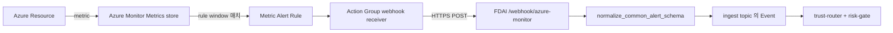
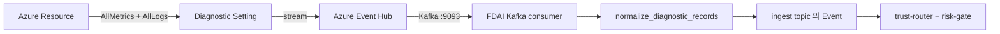

# 근실시간 감지 경로

이벤트로 도착하는 신호(KubeEvents, Activity Log 등)는 이미 서브초에
처리되지만, **샘플 메트릭 경로에서 지연이 살아있음**. 이 문서는 이 리포가
지원하는 모든 push / pull 경로를 열거해서 fork가 자기 비용·지연 예산에
맞는 조합을 고를 수 있게 한다. upstream은 가장 안전한 pull baseline만
켠 채로 shipping하고, fork가 Terraform + env-var seam을 통해 더 빠른
경로를 opt-in한다.

## 지연 요약

| 경로 | End-to-end 지연 | 배선 | 형태 |
|------|-----------------|------|------|
| Event-driven Kafka (KubeEvents, Activity Log, forwarded diagnostics) | **서브초** | `FDAI_START_CONSUMER=1` 이면 항상 on | push |
| AKS Managed Prometheus (`RoutedMetricProvider` route #1) | **~15~60s** | `FDAI_PROMETHEUS_ENDPOINT` | pull (tick) |
| Diagnostic Setting -> Event Hub -> Kafka | **~15~60s** | [`modules/observability/diagnostic-eventhub-route`](../../../infra/modules/observability/diagnostic-eventhub-route/main.tf) | **push (stream)** |
| Metric Alert Rule -> Action Group -> Webhook | **~30~90s** | [`modules/observability/metric-alert-rules`](../../../infra/modules/observability/metric-alert-rules/main.tf) | **push (webhook)** |
| Azure Monitor Metrics REST API (`RoutedMetricProvider` route #2) | **~1~3분** | `FDAI_MONITOR_WORKSPACE_ID` 세트되면 자동 | pull (tick) |
| Azure Monitor Logs KQL (`RoutedMetricProvider` route #3) | **~2~5분** | `FDAI_MONITOR_WORKSPACE_ID` 세트되면 자동 | pull (tick) |

세 개의 `RoutedMetricProvider` route는 해당 env-var가 공급되면
[`wire_azure_container`](../../../src/fdai/composition/wire_azure.py)가
자동으로 조립함 -
[`infra/README.md § Opt-in variables`](../../../infra/README.md#opt-in-variables-metric-analyzer-tick--prometheus)
참조. 두 push 경로는 fork가 리소스별로 인스턴스화하는 Terraform 모듈;
명시적으로 배선하지 않으면 upstream에선 아무것도 안 돌아감.

## Push 경로 #1 - Metric Alert Rule -> Webhook (~30~90s)



**언제 고를까**: fork가 소수의 잘 알려진 알람을 자율 액션에 1:1로
매핑하고 싶을 때 ("MySQL CPU 5분간 90% 초과 -> change-safety 인시던트
발화"). rule + threshold는 Azure에 살고, 새 알람마다 Terraform edit이
필요하지만 FDAI 쪽은 정적.

**Seams**

- [Normalizer](../../../src/fdai/delivery/azure/monitor_alert.py) -
  Common Alert Schema v2 -> `Event`. Pure function, fired /
  resolved / malformed 페이로드에 대한 unit test.
- [Webhook route](../../../src/fdai/delivery/read_api/routes/azure_monitor_webhook.py) -
  Starlette POST `/webhook/azure-monitor`. Bearer-token 인증 (constant-time
  비교), 256 KiB body cap, 소문자화된 ARM id를 key로 ingest topic에 publish.
- [Terraform 모듈](../../../infra/modules/observability/metric-alert-rules/main.tf) -
  재사용 가능한 metric alert rule; fork가 (resource, metric) 페어마다 하나씩 인스턴스화.

**배포 패턴**

```hcl
module "aks_cpu_alert" {
  source               = "../../modules/observability/metric-alert-rules"
  name                 = "alert-aks-cpu-over-80"
  resource_group_name  = var.resource_group_name
  scopes               = [module.aks.id]
  description          = "AKS node CPU sustained above 80 percent"
  severity             = 2
  metric_namespace     = "Microsoft.ContainerService/managedClusters"
  metric_name          = "node_cpu_usage_percentage"
  aggregation          = "Average"
  operator             = "GreaterThan"
  threshold            = 80
  action_group_ids     = [module.alert_action_group.id]
  tags                 = local.tags
}
```

Action Group의 webhook receiver가
`https://<fdai-endpoint>/webhook/azure-monitor`에
`Authorization: Bearer <FDAI_AZURE_MONITOR_WEBHOOK_TOKEN>` 와 함께 POST.
토큰은 composition root 재배포로 rotate하는 shared secret; safety
스토리는 route factory contract 참고.

## Push 경로 #2 - Diagnostic Setting -> Event Hub -> Kafka (~15~60s)



**언제 고를까**: fork가 FDAI 안에서 중앙 집중식으로 임계값 권한을
가지고 싶고, 리소스당 여러 메트릭에 대해 낮은 지연을 원하며, path #1의
per-alert-rule Terraform 반복 작업을 피하고 싶을 때. 리소스당 Diagnostic
Setting 하나가 해당 리소스가 emit하는 모든 네이티브 메트릭을 커버;
fork의 `DiagnosticNormalizerOptions.metric_whitelist`가 어떤 것을 실제
event로 승격할지 고름.

**Seams**

- [Normalizer](../../../src/fdai/delivery/azure/monitor_diagnostic.py) -
  Diagnostic AllMetrics batch -> tuple of `Event`. Pure function,
  shape mismatch에 fail-closed, whitelist miss는 조용히 skip해서
  firehose가 tick을 저하시키지 않음.
- [Terraform 모듈](../../../infra/modules/observability/diagnostic-eventhub-route/main.tf) -
  대상 리소스에 Diagnostic Setting을 attach하고 fork의 Event Hub로
  route. Metric / log category는 opt-in.
- **Kafka consumer 배선**이 Event Hub의 Kafka endpoint를 읽고
  `normalize_diagnostic_records`를 호출하는 것은 fork 작업 -
  [`delivery/azure/event_bus.py`](../../../src/fdai/delivery/azure/event_bus.py)의
  표준 `AIOKafkaConsumer`가 이미 topic을 읽으니, fork의 composition
  root가 두 번째 consumer instance를 diagnostic hub에 붙이고 각 batch를
  normalizer로 흘려주면 됨.

## Push 경로 #3 - Pull with `analyzer_tick_cli` + `RoutedMetricProvider`

새로운 건 아니지만, 모든 fork가 default로 받는 baseline
([observability-and-detection-ko.md](observability-and-detection-ko.md)
참조).
[analyzer tick job](../../../infra/modules/compute/container-apps/analyzer_tick_job.tf)이
cron으로 `python -m fdai.delivery.analyzer_tick_cli`를 실행;
CLI가 조립된 `MetricProvider`
([Prom > Metrics API > Logs](../architecture/csp-neutrality-ko.md))에
대해 reference threshold analyzer들을 호출.

## 조합 규칙

- **모든 push normalizer는 별개의 `event_type`을 emit**해서 trust
  router (와 downstream 대시보드)가 분명하게 filter 가능:
  `azure.metric_alert.fired`, `azure.metric_alert.resolved`,
  `azure.metric_sample`.
- **모든 emit event는 default가 `Mode.SHADOW`**. 첫 배선에서 live push
  signal에 자동 실행되지 않고, `Mode.ENFORCE`로의 promotion은 분리된
  검토를 거친 명시적 변경.
- **Idempotency key는 소스 이벤트마다 결정적**. alert normalizer는
  `alertId + monitorCondition + firedDateTime`으로 fold; diagnostic
  normalizer는 `resourceId + metricName + timeStamp`로 fold. Action
  Group 재전송이나 Event Hubs at-least-once semantics로 인한 재-delivery도
  중복 처리 안 함.
- **Correlation id는 series당 / rule당 fold**. 한 alert rule의 모든
  fire / resolved 쌍은 하나의 correlation id (`azure_alert:<alertId>`)를
  공유; `(resource, metric)` series의 모든 sample도 하나의 correlation
  id (`azure_metric_stream:<resource>:<metric>`)를 공유. trust router는
  correlation id로 인시던트를 닫음.

## Fork 픽 가이드

| Fork 프로파일 | 추천 조합 |
|---------------|-----------|
| 첫 배포, 일반 AKS | Pull baseline만 (Prom + Metrics API + Logs). Push 배선 없음. |
| 큐레이션된 alert 카탈로그를 가진 prod | Pull baseline + fork가 신경 쓰는 alert들에 대해 push path #1. |
| FDAI 안에 메트릭 권한이 무거운 prod | Pull baseline + 가장 중요한 리소스들에 push path #2; push #1는 피함. |
| Event Hubs 비용 엄격 cap | Push path #1만 (bounded volume) + pull baseline. |

어느 조합도 코드 변경을 요구 안 함 - fork의 composition root가 고르고,
seam은 이미 다 여기 있음.

## 아직 배송 안 됨

- **Path #2의 Kafka-consumer glue** (위 "fork 작업" 노트 참조). Consumer
  라이브러리와 normalizer 둘 다 존재; diagnostic hub를 읽고 record를
  normalizer로 흘리는 composition-root wiring만 upstream에 안 씀.
- **관리형 alert-rule authoring 파이프라인**. Path #1의 Terraform
  모듈은 primitive; shipped rule catalog에서 rule을 materialize하는
  rule-catalog-driven generator는 별개 스코프.

둘 다 fork가 형태를 정하면 바로 추가 가능한 준비 상태.
