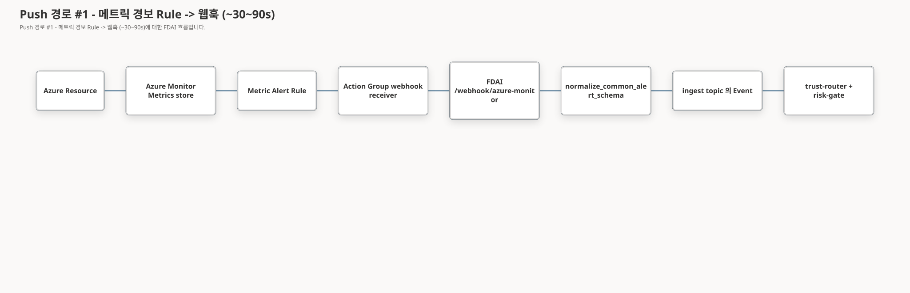
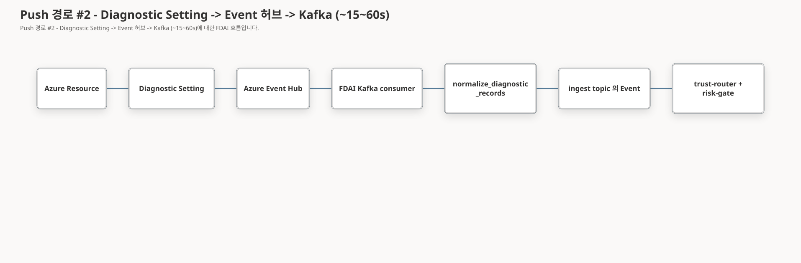

# 근실시간 감지 경로

이벤트로 도착하는 신호(KubeEvents, Activity Log 등)는 이미 서브초에
처리되지만, **샘플 메트릭 경로에서 지연이 살아있음**. 이 문서는 이 리포가
지원하는 모든 push / pull 경로를 열거해서 포크가 자기 비용·지연 예산에
맞는 조합을 고를 수 있게 합니다. 업스트림은 1분 간격 분석 작업과 라우팅된 메트릭
프로바이더를 선언하며, 작업이 호출하는 `fdai.delivery.analyzer_tick_cli`
모듈도 함께 제공합니다. 더 빠른 push 경로는 Terraform 및 조립 경계를 통해 계속 명시적으로 선택합니다.

> **현재 제공 범위**: 라우팅된 메트릭 프로바이더, 분석 작업 진입점, 두 Terraform 기본 요소가
> 구현되어 있으며, 집중 테스트 하나가 `RoutedMetricProvider`를 거쳐 Event 발행까지 한 번의 틱을
> 구동합니다. Operator Service는 Common Alert Schema 기록을 검증하고 정규화한 뒤 영속 큐에
> 저장하고 게시합니다. Core는 별도로 구성한 진단 Event Hub를 소비하고 허용 목록의 `AllMetrics`
> 기록을 정규화해 일반 유입 토픽에 게시합니다. 두 경로는 관리되는 실제 지연 및 전달 근거를
> 보존하기 전까지 `validated`가 아닌 `implemented`로 유지됩니다.

## 지연 요약

| 경로 | 종단 간 지연 | 배선 | 형태 |
|------|-----------------|------|------|
| Event-driven Kafka (KubeEvents, Activity Log, forwarded 진단) | **Kafka 수신 후 보통 서브초**; 출처 emission/forwarding 지연은 별도 | `FDAI_START_CONSUMER=1` 이면 소비자 on | push |
| AKS Managed Prometheus (`RoutedMetricProvider` 경로 #1) | **~15~60s** | `FDAI_PROMETHEUS_ENDPOINT` | pull (틱) |
| Diagnostic Setting -> Event 허브 -> Kafka | **~15~60s** | [`modules/observability/diagnostic-eventhub-route`](../../../infra/modules/observability/diagnostic-eventhub-route/main.tf) | **push (스트림)** |
| 메트릭 경보 Rule -> 액션 그룹 -> 웹훅 | **~30~90s** | [`modules/observability/metric-alert-rules`](../../../infra/modules/observability/metric-alert-rules/main.tf) | **push (웹훅)** |
| Azure Monitor Metrics REST API (`RoutedMetricProvider` 경로 #2) | **~1~3분** | `FDAI_MONITOR_WORKSPACE_ID` 세트되면 자동 | pull (틱) |
| Azure Monitor Logs KQL (`RoutedMetricProvider` 경로 #3) | **~2~5분** | `FDAI_MONITOR_WORKSPACE_ID` 세트되면 자동 | pull (틱) |

세 개의 `RoutedMetricProvider` 경로는 해당 env-var가 공급되면
[`wire_azure_container`](../../../services/core-control-plane/src/fdai/composition/wire_azure.py)가
자동으로 조립함 -
[`infra/README.md § Opt-in variables`](../../../infra/README.md#opt-in-variables-metric-analyzer-tick--prometheus)
참조. 두 push 경로는 포크가 리소스별로 인스턴스화하는 Terraform 모듈;
명시적으로 배선하지 않으면 업스트림에선 아무것도 안 돌아감.

## Push 경로 #1 - 메트릭 경보 Rule -> 웹훅 (~30~90s)



**언제 고를까**: 포크가 소수의 잘 알려진 알람을 자율 액션에 1:1로
매핑하고 싶을 때 ("MySQL CPU 5분간 90% 초과 -> change-safety 인시던트
발화"). 룰 + 임계값은 Azure에 살고, 새 알람마다 Terraform 편집이
필요하지만 FDAI 쪽은 정적.

**Seams**

- [정규화기](../../../packages/service-contracts/src/fdai_service_contracts/azure_monitor.py) -
  Common Alert Schema -> `Event`. 서비스 간 공유 계약이며 fired /
  resolved / malformed 페이로드에 대한 단위 테스트.
- [웹훅 경로](../../../services/operator-service/src/fdai_operator_service/) -
  Starlette `POST /webhook/azure-monitor`. HMAC-SHA256 검증, 256 KiB 본문 상한,
  영속 제안 outbox 및 정규화된 Resource id를 키로 사용하는 유입 토픽 직접 게시를 제공합니다.
- [Terraform 모듈](../../../infra/modules/observability/metric-alert-rules/main.tf) -
  재사용 가능한 메트릭 경보 룰; 포크가 (리소스, 메트릭) 페어마다 하나씩 인스턴스화.

**배포 패턴**

```hcl
module "aks_cpu_alert" {
  source               = "../../modules/observability/metric-alert-rules"
  name                 = "alert-aks-cpu-over-80"
  resource_group_name  = var.resource_group_name
  scopes               = [module.aks.id]
  description          = "AKS node CPU sustained above 80 percent"
  severity             = 2
  metric_namespace     = "Microsoft.ContainerService/managedClusters"
  metric_name          = "node_cpu_usage_percentage"
  aggregation          = "Average"
  operator             = "GreaterThan"
  threshold            = 80
  action_group_ids     = [module.alert_action_group.id]
  tags                 = local.tags
}
```

FDAI 경로는 `Authorization: Bearer <FDAI_AZURE_MONITOR_WEBHOOK_TOKEN>`을 요구합니다.
Shipped 액션 그룹 웹훅 receiver는 이 헤더를 추가하지 않으므로 포크는 토큰을 주입하는
trusted proxy 또는 Entra-authenticated secure-webhook 어댑터를 액션 그룹과
`https://<fdai-endpoint>/webhook/azure-monitor` 사이에 둬야 합니다.

## Push 경로 #2 - Diagnostic Setting -> Event 허브 -> Kafka (~15~60s)



**언제 고를까**: 포크가 FDAI 안에서 중앙 집중식으로 임계값 권한을
가지고 싶고, 리소스당 여러 메트릭에 대해 낮은 지연을 원하며, 경로 #1의
per-alert-rule Terraform 반복 작업을 피하고 싶을 때. 리소스당 진단
설정 하나가 해당 리소스가 발행하는 모든 네이티브 메트릭을 커버;
포크의 `DiagnosticNormalizerOptions.metric_whitelist`가 어떤 것을 실제
이벤트로 승격할지 고름.

**Seams**

- [정규화기](../../../services/core-control-plane/src/fdai/delivery/azure/) -
  진단 AllMetrics 배치 -> 튜플 of `Event`. Pure 함수,
  형태 mismatch에 실패 시 차단, whitelist miss는 조용히 건너뜀해서
  firehose가 틱을 저하시키지 않음.
- [Terraform 모듈](../../../infra/modules/observability/diagnostic-eventhub-route/main.tf) -
  대상 리소스에 Diagnostic Setting을 첨부하고 포크의 Event 허브로
  경로. 메트릭 / 로그 category는 명시적 선택.
- [런타임 브리지](../../../services/core-control-plane/src/fdai/delivery/azure/diagnostic_event_ingest.py)는
  `FDAI_DIAGNOSTIC_KAFKA_BOOTSTRAP_SERVERS`, `FDAI_DIAGNOSTIC_TOPIC`,
  `FDAI_DIAGNOSTIC_METRIC_WHITELIST_JSON`을 함께 제공하면 earliest offset 전용 Kafka 전송을
  만듭니다. 형식이 잘못된 일치 기록은 원본 DLQ로 보내고, 허용 목록 밖의 메트릭은 무시하며,
  유효한 기록은 작업 권한 없이 일반 유입 토픽에 게시합니다.

## Pull 기준선 - 분석 작업 + `RoutedMetricProvider`

모든 포크가 사용할 수 있는 프로바이더 라우팅
([observability-and-detection-ko.md](observability-and-detection-ko.md)
참조).
[analyzer 틱 작업](../../../infra/modules/compute/container-apps/analyzer_tick_job.tf)이
cron으로 `python -m fdai.delivery.analyzer_tick_cli`를 실행합니다. 이 모듈은 현재 트리에 있고
집중 테스트가 라우팅 표에서 Event 발행까지 한 번의 틱을 구동하므로 선언된 작업은 실행 가능한
기준선입니다. 관리되는 실제 지연 근거는 아직 남아 있습니다. `MetricProvider` 조립은
([Prom > Metrics API > Logs](../architecture/csp-neutrality-ko.md)) 사이를 계속 라우팅합니다.

`analyzer_tick_cron_expression`은 기본 1분입니다. 배포가 변환 결과 데이터베이스를 연결한
경우 대상 목록이 비어 있으면 영속 인벤토리 변환 결과로 대체하므로 새로 발견된 지원
리소스가 배포 변경 없이 다음 틱에 포함됩니다.
Cron을 명시적으로 빈 값으로 설정하면 작업이 비활성화됩니다. 명시적 대상과 영속 인벤토리
모두에 지원 리소스가 없으면 CLI가 조용히 종료됩니다. 읽을 수 없는 변환 결과는 빈 결과가
아닙니다. 이 경우 틱이 실패해 작업이 재시도하며, 관측 범위를 조용히 좁히지 않습니다.

각 점검 결과는 추적 상태에 범위가 제한된 증적도 기록합니다. 증적은 리소스, 관찰된 이벤트
시간, 현재 상태, 근거 완전성, 게시 결과, 복구 상태 및 불투명한 근거 참조를 서로 분리합니다.
`cause_claim_supported`와 `execution_authority`는 모두 `false`로 고정합니다. 인증된 Operator
API는 Console에 전달하기 전에 멱등성 키와 리소스별로 증적을 그룹화합니다. 따라서 브라우저는
수명 주기 간선을 추론하지 않고 서버가 작성한 현재 평가와 보존 이력을 표시합니다. 중복 전달은
억제된 게시 시도로 표시하며 불완전, 충돌 및 누락 근거를 서로 다른 상태로 유지합니다.

### 에이전트 소유 AKS 감지 준비도

같은 틱은 각 AKS 대상에 대해 발견, 수집기 구성, 최근 텔레메트리, detector 연결,
이전 파이프라인 연속성, 액션 거버넌스의 정제된 6개 관측을 Huginn raw 유입에 발행합니다.
Heimdall은 관측을 `object.drift`로 축약하고, Muninn은 최신 `object.state-snapshot`을 저장하며,
Saga는 전환을 감사하고, Forseti는 스냅샷을 권한 상한으로 사용합니다. 첫 통과에는 이전 Muninn
스냅샷이 없으므로 부분이며, 이후 통과에서 파이프라인 연속성을 증명할 수 있습니다.

한 대상 틱의 6개 관측은 결정론적 `pass_id`와 대상 리소스 파티션 키를 공유합니다.
따라서 런타임 복제본이 여러 개여도 Event Hubs 정렬과 Heimdall 소비자 그룹이 각 대상을
한 소비자에 전달합니다. Heimdall은 차원을 어떤 순서로든 받고 겹친 통과 ID를 독립적으로
추적하며, 한 통과의 6개가 모두 도착하기 전에는 표류를 발행하지 않습니다. 불완전한 통과는
수집 중인 다른 통과를 지우거나 마지막 완전한 스냅샷을 교체하지 않습니다.

축약은 실패 시 차단입니다. 누락, stale, 사용 불가, 승인되지 않은 근거는 준비된이 되지 않습니다.
6개 차원이 모두 통과해도 새 준비 상태 기능은 `shadow`로 유지되므로 ActionType을 승격하거나
변경을 실행할 수 없습니다. Operator API와 콘솔은 Muninn 판정을 변환 결과하며 다시 계산하지 않습니다.
Muninn은 `generated_at`이 엄격히 더 새로운 경우에만 대상의 최신 스냅샷을 교체하므로 순서가 바뀌거나
재전달된 표류가 영속 준비도를 과거로 되돌릴 수 없습니다.
Inventory 기반 대상은 그래프 최신성과 범위 근거를 발견 dimension에 전달합니다. Stale
snapshot 또는 degraded 범위는 passed가 아니라 사용 불가가 됩니다. Heimdall은 drift를
publish하지만 복구를 실행하지 않습니다. 수집은
[지속형 운영 인스턴스 그래프](../architecture/continuous-operational-instance-graph-ko.md)의 적응형
원본 정책을 따릅니다. lag, 변경량, 최대 노후 시간, 공급자 예산, throttling, circuit 상태가 다음
delta 또는 완전한 reconciliation 시도를 결정합니다. 현재 고정 정기 간격은 controller가 구현되고
측정될 때까지 이전 구성으로 유지됩니다.

## 조합 규칙

- **모든 push 정규화기는 별개의 `event_type`을 발행**해서 trust
  라우터 (와 다운스트림 대시보드)가 분명하게 필터 가능:
  `azure.metric_alert.fired`, `azure.metric_alert.resolved`,
  `azure.metric_sample`.
- **모든 발행 이벤트는 기본값이 `Mode.SHADOW`**. 첫 배선에서 실제 운영 push
  신호에 자동 실행되지 않고, `Mode.ENFORCE`로의 승격은 분리된
  검토를 거친 명시적 변경.
- **멱등성 키는 소스 이벤트마다 결정적**. 경보 정규화기는
  `alertId + monitorCondition + firedDateTime`으로 접기; 진단
  정규화기는 `resourceId + metricName + timeStamp`로 접기. 액션
  그룹 재전송이나 Event Hubs at-least-once 의미 규칙으로 인한 재-delivery도
  중복 처리 안 함.
- **상관관계 id는 series당 / 룰당 접기**. 한 경보 룰의 모든
  fire / resolved 쌍은 하나의 상관관계 id (`azure_alert:<alertId>`)를
  공유; `(resource, metric)` series의 모든 샘플도 하나의 상관관계
  id (`azure_metric_stream:<resource>:<metric>`)를 공유. trust 라우터는
  그룹화 키로 전달하고 인시던트 수명 주기 소비자가 상태 전이를 별도로 결정합니다.

## 포크 픽 가이드

| 포크 프로파일 | 추천 조합 |
|---------------|-----------|
| 첫 배포, 일반 AKS | Pull 기준선만 (Prom + Metrics API + Logs). Push 배선 없음. |
| 큐레이션된 경보 카탈로그를 가진 prod | Pull 기준선 + 포크가 신경 쓰는 경보들에 대해 push 경로 #1. |
| FDAI 안에 메트릭 권한이 무거운 prod | Pull 기준선 + 가장 중요한 리소스들에 push 경로 #2; push #1는 피함. |
| Event Hubs 비용 엄격 상한 | Push 경로 #1만 (범위가 제한된 양) + pull 기준선. |

어느 조합도 업스트림 코어 변경을 요구하지 않지만 포크의 Terraform/조립 연결이
필요하고 경로 #1은 인증 브리지도 필요합니다.

## 구현 상태

### 구현 범위

| 영역 | 상태 | 근거 | 참고 |
|------|------|------|------|
| 라우팅된 pull 프로바이더 | implemented | `services/core-control-plane/src/fdai/composition/wire_metric_provider.py`; `services/core-control-plane/tests/providers/test_routed_metric.py` | Prometheus, Metrics API, Logs 프로바이더를 결정론적 경로 순서로 선택합니다. |
| 예약된 분석 작업 | implemented | `infra/modules/compute/container-apps/analyzer_tick_job.tf`; `services/core-control-plane/src/fdai/delivery/analyzer_tick_cli.py`; `services/core-control-plane/tests/delivery/test_analyzer_tick_routed.py` | Terraform이 1분 간격 작업을 선언하고 `fdai.delivery.analyzer_tick_cli` 진입점도 제공됩니다. 집중 테스트 하나가 라우팅된 각 백엔드에 도달해 임계 위반을 shadow 모드 Event로 발행합니다. 관리되는 실제 지연 근거는 남아 있습니다. |
| 분석기 수명 주기 증적 변환 결과 | implemented | `fdai/delivery/analyzer_receipt_store.py`; `fdai_operator_service/analyzer_lifecycle_projection.py`; `console/src/routes/detection-readiness.tsx`; 집중 분석기, Operator API, Console 및 세 화면 크기 Playwright 검사 | 범위 제한 추적 상태 증적이 현재 상태를 보존된 재시작, 교체, 게시 및 복구 이력과 분리합니다. 인증된 읽기 변환 결과는 원인 주장, 프로바이더 읽기, 브라우저 유도 간선 또는 실행 권한 없이 불완전, 충돌, 누락, 실패 및 중복 근거를 노출합니다. |
| AKS 감지 준비도 축약 | implemented | `services/core-control-plane/tests/agents/test_huginn_detection_readiness.py`; `tests/integration/infra/test_detection_readiness.py` | 집중 테스트가 에이전트 소유 준비도 관측과 인프라 계약을 검증합니다. 이는 구현 근거이며 실제 지연 근거는 아닙니다. |
| 메트릭 경보 웹훅 경로 | implemented | `fdai_service_contracts/azure_monitor.py`; Operator operations 경로, 영속 웹훅 outbox 브리지, semantic Kafka Event 경로; 집중 계약, 경로, 브리지 및 Kafka 테스트 | 검증된 Common Alert payload를 정리된 shadow Event로 바꾸고 lease fence가 있는 영속 제안에서 게시합니다. 관리되는 실제 액션 그룹 전달 및 지연 근거는 아직 남아 있습니다. |
| Diagnostic Event Hub 경로 | implemented | `delivery/azure/monitor_events.py`; `diagnostic_event_ingest.py`; 런타임 부트스트랩 및 Core 서비스 Terraform 연결; 집중 정규화기, 브리지, 부트스트랩, 종료 및 인프라 테스트 | 전용 Kafka 소비자가 구성된 메트릭만 정규화하고 형식이 잘못된 일치 기록을 DLQ로 보내며 일반 유입 토픽에 전달합니다. 관리되는 실제 전달 및 지연 근거는 아직 남아 있습니다. |
| 관리형 경보 규칙 작성 | not-started | [아직 제공되지 않은 항목](#아직-배송-안-됨) | 관리되는 Rule 항목에서 경보 규칙을 구체화하는 카탈로그 기반 생성기가 없습니다. |

### 구현 이력

| 날짜 | 상태 | 변경 | 근거 | 남은 작업 |
|------|------|------|------|-----------|
| 2026-08-31 | implemented | 분석기의 범위 제한 점검 결과 증적을 보존 수가 제한된 추적 상태에 저장하고, 인증된 감지 준비도 경로를 통해 서버가 작성한 현재 상태와 보존 수명 주기 이력으로 변환했습니다. 중복 게시, 복구 및 완전, 불완전, 충돌 또는 누락 근거를 명시적으로 유지하며 원인 주장과 실행 권한은 false로 유지합니다. | `current change`; 집중 Python 및 Operator API 검사 90개, 집중 Console 검사 5개, Console 타입 검사 및 운영 빌드, 가로 넘침이 측정되지 않은 synthetic 데스크톱, 제한된 데스크톱 및 모바일 Playwright 검사 3개가 통과했습니다. | 관리되는 실제 전달 및 지연 근거는 여전히 남아 있으며 이 변경에서는 생성하지 않았습니다. |
| 2026-08-29 | implemented | 강화 라운드 4에서 진단 유입 관점 26개를 검토하고 Event 신원을 만들기 전에 진단 기록 시각을 UTC로 정규화했습니다. 오프셋 표현만 다른 재생은 이제 하나의 멱등성 키를 유지합니다. | `current change`; 집중 Azure 진단 정규화기 테스트. | 관리되는 실제 전달 및 지연 근거를 보존합니다. |
| 2026-08-29 | implemented | 강화 라운드 2에서 경보 계약 관점 25개를 검토하고 Event 및 멱등성 신원을 만들기 전에 프로바이더 시각을 UTC로 정규화했습니다. 하나의 경보를 서로 다른 오프셋으로 표현해도 중복 인시던트 신호를 만들지 않습니다. | `current change`; 집중 Azure Monitor 계약 테스트. | 관리되는 실제 전달 및 지연 근거를 보존합니다. |
| 2026-08-28 | implemented | 두 push 경로의 구현을 완료했습니다. HMAC으로 검증된 Operator 웹훅은 영속 수락 전에 Common Alert Schema 본문을 공유되고 정리된 Event로 바꾸며, lease fence가 있는 outbox가 Core Event 토픽에 직접 게시합니다. Core는 별도로 구성된 진단 Kafka 전송을 소유하고, 범위가 제한된 허용 목록 `AllMetrics` 기록을 정규화하며, 형식이 잘못된 일치 입력을 DLQ로 보내고, 시작 준비도 및 순서가 있는 종료 절차로 브리지를 감독합니다. 두 기능은 shadow를 유지하고 작업 권한을 부여하지 않습니다. | `current change`; 공유 경보 계약; Operator 경로, outbox, Kafka, 조립 및 집중 테스트; Core 정규화기, 브리지, 부트스트랩, 종료, Terraform 계약 및 집중 테스트. | 관리되는 실제 액션 그룹 및 진단 Event Hub 전달과 지연 근거를 보존합니다. |
| 2026-08-14 | in-progress | 이전 출처를 재구성하지 않고 구현 원장을 도입했으며, 현재 소스 트리에 맞게 종단 간 제공 주장을 바로잡았습니다. | `current change`; 구현 범위 표의 경로와 집중 검증. | 실행 가능한 pull 진입점을 복원하고 인증된 두 push 경로를 완성합니다. |
| 2026-08-16 | implemented | `fdai.delivery.analyzer_tick_cli`가 없다는 낡은 주장을 바로잡았습니다. 이 모듈은 제공됩니다. `RoutedMetricProvider`를 거쳐 한 번의 틱을 구동하는 집중 통합 테스트를 추가해, 각 메트릭이 라우팅 표가 선택한 백엔드에 도달하고, 임계 위반이 shadow 모드 Event 하나를 발행하며, 정상 통과는 아무것도 발행하지 않고, 라우팅되지 않은 메트릭은 정상 판정 대신 부분 통과로 남는다는 것을 증명했습니다. | `current change`; `services/core-control-plane/tests/delivery/test_analyzer_tick_routed.py`; `pytest services/core-control-plane/tests/delivery/test_analyzer_tick_routed.py` (4 passed). | 인증된 두 push 경로를 완성하고 경로별 관리되는 실제 지연 근거를 기록합니다. |

### 남은 작업

- [x] `fdai.delivery.analyzer_tick_cli`가 예약 작업이 호출하는 진입점으로 제공되며, 집중 통합 테스트 하나가 `RoutedMetricProvider`를 거쳐 shadow 모드 Event 발행까지 한 번의 틱을 구동합니다. 근거는 `services/core-control-plane/tests/delivery/test_analyzer_tick_routed.py`입니다.
- [x] 경로 #1에 테스트된 Azure Monitor 요청 처리기, 공유 payload 정규화기, HMAC 검증기,
  영속 outbox 및 Event 토픽 게시기를 추가합니다.
- [x] 경로 #2의 기록을 유입 토픽으로 전달하고 형식이 잘못된 일치 기록을 DLQ로 보내는 테스트된
  진단 기록 정규화기와 런타임 연결을 추가합니다.
- [x] 범위 제한 분석기 점검 결과 증적을 저장하고 서버가 작성한 현재 상태, 보존 수명 주기
  이력, 게시, 복구, 중복 전달 및 명시적 근거 공백 상태를 인증된 Operator API와 반응형
  Console에 노출합니다.
- [ ] 경로 상태를 `implemented`에서 `validated`로 변경하기 전에 각 경로의 관리되는 지연 근거를 기록합니다.

## 아직 배송 안 됨

- **경로 #1 외부 액션 그룹 수신기.** FDAI 쪽 HMAC 브리지는 구현되어 있지만 shipped
  액션 그룹 웹훅은 Bearer 헤더를 추가하지 않습니다. 포크는 토큰을 주입하는 trusted
  proxy 또는 Entra-authenticated secure 웹훅 연결을 제공해야 합니다.

- **관리형 alert-rule authoring 파이프라인**. 경로 #1의 Terraform
  모듈은 기본 요소; shipped 룰 카탈로그에서 룰을 materialize하는
  rule-catalog-driven generator는 별개 스코프.

관리형 작성 파이프라인은 구현된 push 전송과 별도 범위로 남아 있습니다.
