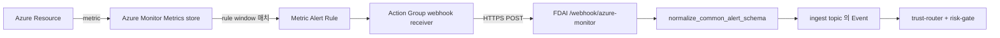
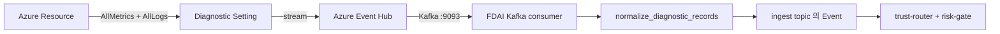

# 근실시간 감지 경로

이벤트로 도착하는 신호(KubeEvents, Activity Log 등)는 이미 서브초에
처리되지만, **샘플 메트릭 경로에서 지연이 살아있음**. 이 문서는 이 리포가
지원하는 모든 push / pull 경로를 열거해서 포크가 자기 비용·지연 예산에
맞는 조합을 고를 수 있게 합니다. 업스트림은 1분 간격 분석 작업과 라우팅된 메트릭
프로바이더를 선언하지만, 현재 트리에는 작업이 호출하는 `fdai.delivery.analyzer_tick_cli`
모듈이 없습니다. 더 빠른 push 경로는 Terraform 및 조립 경계를 통해 계속 명시적으로 선택합니다.

> **현재 제공 범위**: 라우팅된 메트릭 프로바이더와 두 Terraform 기본 요소는 구현되어
> 있습니다. 분석 작업은 현재 존재하지 않는 CLI 모듈을 대상으로 합니다. Operator Service는
> 호환성 매니페스트에 Azure Monitor 경로를 유지하지만, 현재 소스 트리에는 요청 처리기나 push
> 정규화기가 없습니다. 따라서 push 경로는 실행 가능한 종단 간 경로가 아니라 설계 및 인프라
> 기본 요소로 남아 있습니다.

## 지연 요약

| 경로 | 종단 간 지연 | 배선 | 형태 |
|------|-----------------|------|------|
| Event-driven Kafka (KubeEvents, Activity Log, forwarded 진단) | **Kafka 수신 후 보통 서브초**; 출처 emission/forwarding 지연은 별도 | `FDAI_START_CONSUMER=1` 이면 소비자 on | push |
| AKS Managed Prometheus (`RoutedMetricProvider` 경로 #1) | **~15~60s** | `FDAI_PROMETHEUS_ENDPOINT` | pull (틱) |
| Diagnostic Setting -> Event 허브 -> Kafka | **~15~60s** | [`modules/observability/diagnostic-eventhub-route`](../../../infra/modules/observability/diagnostic-eventhub-route/main.tf) | **push (스트림)** |
| 메트릭 경보 Rule -> 액션 그룹 -> 웹훅 | **~30~90s** | [`modules/observability/metric-alert-rules`](../../../infra/modules/observability/metric-alert-rules/main.tf) | **push (웹훅)** |
| Azure Monitor Metrics REST API (`RoutedMetricProvider` 경로 #2) | **~1~3분** | `FDAI_MONITOR_WORKSPACE_ID` 세트되면 자동 | pull (틱) |
| Azure Monitor Logs KQL (`RoutedMetricProvider` 경로 #3) | **~2~5분** | `FDAI_MONITOR_WORKSPACE_ID` 세트되면 자동 | pull (틱) |

세 개의 `RoutedMetricProvider` 경로는 해당 env-var가 공급되면
[`wire_azure_container`](../../../services/core-control-plane/src/fdai/composition/wire_azure.py)가
자동으로 조립함 -
[`infra/README.md § Opt-in variables`](../../../infra/README.md#opt-in-variables-metric-analyzer-tick--prometheus)
참조. 두 push 경로는 포크가 리소스별로 인스턴스화하는 Terraform 모듈;
명시적으로 배선하지 않으면 업스트림에선 아무것도 안 돌아감.

## Push 경로 #1 - 메트릭 경보 Rule -> 웹훅 (~30~90s)


```mermaid
flowchart LR
    R[Azure Resource] -->|metric| M[Azure Monitor Metrics store]
    M -->|rule window 매치| A[Metric Alert Rule]
    A --> G[Action Group webhook receiver]
    G -->|HTTPS POST| W[FDAI /webhook/azure-monitor]
    W --> N[normalize_common_alert_schema]
    N --> E[ingest topic 의 Event]
    E --> T[trust-router + risk-gate]
```

**언제 고를까**: 포크가 소수의 잘 알려진 알람을 자율 액션에 1:1로
매핑하고 싶을 때 ("MySQL CPU 5분간 90% 초과 -> change-safety 인시던트
발화"). 룰 + 임계값은 Azure에 살고, 새 알람마다 Terraform 편집이
필요하지만 FDAI 쪽은 정적.

**Seams**

- [정규화기](../../../services/core-control-plane/src/fdai/delivery/azure/) -
  Common 경보 스키마 v2 -> `Event`. Pure 함수, fired /
  resolved / malformed 페이로드에 대한 단위 테스트.
- [웹훅 경로](../../../services/operator-service/src/fdai_operator_service/) -
  Starlette 게시 `/webhook/azure-monitor`. Bearer-token 인증 (constant-time
  비교), 256 KiB 본문 상한, 소문자화된 ARM id를 키로 ingest 토픽에 publish.
- [Terraform 모듈](../../../infra/modules/observability/metric-alert-rules/main.tf) -
  재사용 가능한 메트릭 경보 룰; 포크가 (리소스, 메트릭) 페어마다 하나씩 인스턴스화.

**배포 패턴**

```hcl
module "aks_cpu_alert" {
  source               = "../../modules/observability/metric-alert-rules"
  name                 = "alert-aks-cpu-over-80"
  resource_group_name  = var.resource_group_name
  scopes               = [module.aks.id]
  description          = "AKS node CPU sustained above 80 percent"
  severity             = 2
  metric_namespace     = "Microsoft.ContainerService/managedClusters"
  metric_name          = "node_cpu_usage_percentage"
  aggregation          = "Average"
  operator             = "GreaterThan"
  threshold            = 80
  action_group_ids     = [module.alert_action_group.id]
  tags                 = local.tags
}
```

FDAI 경로는 `Authorization: Bearer <FDAI_AZURE_MONITOR_WEBHOOK_TOKEN>`을 요구합니다.
Shipped 액션 그룹 웹훅 receiver는 이 헤더를 추가하지 않으므로 포크는 토큰을 주입하는
trusted proxy 또는 Entra-authenticated secure-webhook 어댑터를 액션 그룹과
`https://<fdai-endpoint>/webhook/azure-monitor` 사이에 둬야 합니다.

## Push 경로 #2 - Diagnostic Setting -> Event 허브 -> Kafka (~15~60s)


```mermaid
flowchart LR
    R[Azure Resource] -->|AllMetrics + AllLogs| D[Diagnostic Setting]
    D -->|stream| H[Azure Event Hub]
    H -->|Kafka :9093| C[FDAI Kafka consumer]
    C --> N[normalize_diagnostic_records]
    N --> E[ingest topic 의 Event]
    E --> T[trust-router + risk-gate]
```

**언제 고를까**: 포크가 FDAI 안에서 중앙 집중식으로 임계값 권한을
가지고 싶고, 리소스당 여러 메트릭에 대해 낮은 지연을 원하며, 경로 #1의
per-alert-rule Terraform 반복 작업을 피하고 싶을 때. 리소스당 진단
설정 하나가 해당 리소스가 발행하는 모든 네이티브 메트릭을 커버;
포크의 `DiagnosticNormalizerOptions.metric_whitelist`가 어떤 것을 실제
이벤트로 승격할지 고름.

**Seams**

- [정규화기](../../../services/core-control-plane/src/fdai/delivery/azure/) -
  진단 AllMetrics 배치 -> 튜플 of `Event`. Pure 함수,
  형태 mismatch에 실패 시 차단, whitelist miss는 조용히 건너뜀해서
  firehose가 틱을 저하시키지 않음.
- [Terraform 모듈](../../../infra/modules/observability/diagnostic-eventhub-route/main.tf) -
  대상 리소스에 Diagnostic Setting을 첨부하고 포크의 Event 허브로
  경로. 메트릭 / 로그 category는 명시적 선택.
- **Kafka 소비자 배선**이 Event 허브의 Kafka 엔드포인트를 읽고
  `normalize_diagnostic_records`를 호출하는 것은 포크 작업 -
  [`delivery/azure/event_bus.py`](../../../services/core-control-plane/src/fdai/delivery/azure/event_bus.py)의
  표준 `AIOKafkaConsumer`가 이미 토픽을 읽으니, 포크의 조립
  루트가 두 번째 소비자 인스턴스를 진단 허브에 붙이고 각 배치를
  정규화기로 흘려주면 됨.

## Pull 기준선 - 분석 작업 + `RoutedMetricProvider`

모든 포크가 사용할 수 있는 프로바이더 라우팅
([observability-and-detection-ko.md](observability-and-detection-ko.md)
참조).
[analyzer 틱 작업](../../../infra/modules/compute/container-apps/analyzer_tick_job.tf)이
cron으로 `python -m fdai.delivery.analyzer_tick_cli`를 실행합니다. 현재 트리에는 이 모듈이
없으므로 선언된 작업은 아직 실행 가능한 기준선이 아닙니다. 기존 `MetricProvider` 조립은
([Prom > Metrics API > Logs](../architecture/csp-neutrality-ko.md)) 사이를 계속 라우팅합니다.

`analyzer_tick_cron_expression`은 기본 1분입니다. 대상 목록이 비어 있으면 영속 인벤토리
변환 결과를 사용하므로 새로 발견된 지원 리소스가 배포 변경 없이 다음 틱에 포함됩니다.
Cron을 명시적으로 빈 값으로 설정하면 작업이 비활성화됩니다. 명시적 대상과 영속 인벤토리
모두에 지원 리소스가 없으면 CLI가 조용히 종료됩니다.

### 에이전트 소유 AKS 감지 준비도

같은 틱은 각 AKS 대상에 대해 발견, 수집기 구성, 최근 텔레메트리, detector 연결,
이전 파이프라인 연속성, 액션 거버넌스의 정제된 6개 관측을 Huginn raw 유입에 발행합니다.
Heimdall은 관측을 `object.drift`로 축약하고, Muninn은 최신 `object.state-snapshot`을 저장하며,
Saga는 전환을 감사하고, Forseti는 스냅샷을 권한 상한으로 사용합니다. 첫 통과에는 이전 Muninn
스냅샷이 없으므로 부분이며, 이후 통과에서 파이프라인 연속성을 증명할 수 있습니다.

한 대상 틱의 6개 관측은 결정론적 `pass_id`와 대상 리소스 파티션 키를 공유합니다.
따라서 런타임 복제본이 여러 개여도 Event Hubs 정렬과 Heimdall 소비자 그룹이 각 대상을
한 소비자에 전달합니다. Heimdall은 차원을 어떤 순서로든 받고 겹친 통과 ID를 독립적으로
추적하며, 한 통과의 6개가 모두 도착하기 전에는 표류를 발행하지 않습니다. 불완전한 통과는
수집 중인 다른 통과를 지우거나 마지막 완전한 스냅샷을 교체하지 않습니다.

축약은 실패 시 차단입니다. 누락, stale, 사용 불가, 승인되지 않은 근거는 준비된이 되지 않습니다.
6개 차원이 모두 통과해도 새 준비 상태 기능은 `shadow`로 유지되므로 ActionType을 승격하거나
변경을 실행할 수 없습니다. Operator API와 콘솔은 Muninn 판정을 변환 결과하며 다시 계산하지 않습니다.
Muninn은 `generated_at`이 엄격히 더 새로운 경우에만 대상의 최신 스냅샷을 교체하므로 순서가 바뀌거나
재전달된 표류가 영속 준비도를 과거로 되돌릴 수 없습니다.
인벤토리 기반 대상은 그래프 최신성과 커버리지 근거를 발견 dimension에 전달합니다.
Stale 스냅샷 또는 degraded 커버리지는 passed가 아니라 사용 불가가 됩니다. Heimdall은
표류를 publish하지만 복구를 실행하지 않습니다. 인벤토리 작업은 10분마다 wake하고 다른
후보가 collecting 중이거나 마지막 성공이 6시간 이내이면 건너뜀하며, newer 시도가
실패 또는 포기되면 다음 틱에 재시도합니다. 정상 상태의 full ARG/ARM 검사 cadence는 6시간입니다.

## 조합 규칙

- **모든 push 정규화기는 별개의 `event_type`을 발행**해서 trust
  라우터 (와 다운스트림 대시보드)가 분명하게 필터 가능:
  `azure.metric_alert.fired`, `azure.metric_alert.resolved`,
  `azure.metric_sample`.
- **모든 발행 이벤트는 기본값이 `Mode.SHADOW`**. 첫 배선에서 실제 운영 push
  신호에 자동 실행되지 않고, `Mode.ENFORCE`로의 승격은 분리된
  검토를 거친 명시적 변경.
- **멱등성 키는 소스 이벤트마다 결정적**. 경보 정규화기는
  `alertId + monitorCondition + firedDateTime`으로 접기; 진단
  정규화기는 `resourceId + metricName + timeStamp`로 접기. 액션
  그룹 재전송이나 Event Hubs at-least-once 의미 규칙으로 인한 재-delivery도
  중복 처리 안 함.
- **상관관계 id는 series당 / 룰당 접기**. 한 경보 룰의 모든
  fire / resolved 쌍은 하나의 상관관계 id (`azure_alert:<alertId>`)를
  공유; `(resource, metric)` series의 모든 샘플도 하나의 상관관계
  id (`azure_metric_stream:<resource>:<metric>`)를 공유. trust 라우터는
  그룹화 키로 전달하고 인시던트 수명 주기 소비자가 상태 전이를 별도로 결정합니다.

## 포크 픽 가이드

| 포크 프로파일 | 추천 조합 |
|---------------|-----------|
| 첫 배포, 일반 AKS | Pull 기준선만 (Prom + Metrics API + Logs). Push 배선 없음. |
| 큐레이션된 경보 카탈로그를 가진 prod | Pull 기준선 + 포크가 신경 쓰는 경보들에 대해 push 경로 #1. |
| FDAI 안에 메트릭 권한이 무거운 prod | Pull 기준선 + 가장 중요한 리소스들에 push 경로 #2; push #1는 피함. |
| Event Hubs 비용 엄격 상한 | Push 경로 #1만 (범위가 제한된 양) + pull 기준선. |

어느 조합도 업스트림 코어 변경을 요구하지 않지만 포크의 Terraform/조립 연결이
필요하고 경로 #1은 인증 브리지도 필요합니다.

## 구현 상태

### 구현 범위

| 영역 | 상태 | 근거 | 참고 |
|------|------|------|------|
| 라우팅된 pull 프로바이더 | implemented | `services/core-control-plane/src/fdai/composition/wire_metric_provider.py`; `services/core-control-plane/tests/providers/test_routed_metric.py` | Prometheus, Metrics API, Logs 프로바이더를 결정론적 경로 순서로 선택합니다. |
| 예약된 분석 작업 | in-progress | `infra/modules/compute/container-apps/analyzer_tick_job.tf`; 현재 변경의 소스 감사 | Terraform은 1분 간격 작업을 선언하지만 `fdai.delivery.analyzer_tick_cli` 진입점이 현재 트리에 없습니다. |
| AKS 감지 준비도 축약 | implemented | `services/core-control-plane/tests/agents/test_huginn_detection_readiness.py`; `tests/integration/infra/test_detection_readiness.py` | 집중 테스트가 에이전트 소유 준비도 관측과 인프라 계약을 검증합니다. 이는 구현 근거이며 실제 지연 근거는 아닙니다. |
| 메트릭 경보 웹훅 경로 | in-progress | `infra/modules/observability/metric-alert-rules/main.tf`; `services/operator-service/src/fdai_operator_service/families/operations/manifest.py`; `services/operator-service/tests/test_operator_operations_family.py` | Terraform 기본 요소와 호환성 경로 선언이 있습니다. 처리기, 정규화기, 인증된 액션 그룹 브리지는 없습니다. |
| Diagnostic Event Hub 경로 | in-progress | `infra/modules/observability/diagnostic-eventhub-route/main.tf`; `services/core-control-plane/src/fdai/delivery/azure/event_bus.py` | 라우팅 모듈과 Kafka 어댑터가 있습니다. 진단 기록 정규화와 조립 연결은 없습니다. |
| 관리형 경보 규칙 작성 | not-started | [아직 제공되지 않은 항목](#아직-배송-안-됨) | 관리되는 Rule 항목에서 경보 규칙을 구체화하는 카탈로그 기반 생성기가 없습니다. |

### 구현 이력

| 날짜 | 상태 | 변경 | 근거 | 남은 작업 |
|------|------|------|------|-----------|
| 2026-08-14 | in-progress | 이전 출처를 재구성하지 않고 구현 원장을 도입했으며, 현재 소스 트리에 맞게 종단 간 제공 주장을 바로잡았습니다. | `current change`; 구현 범위 표의 경로와 집중 검증. | 실행 가능한 pull 진입점을 복원하고 인증된 두 push 경로를 완성합니다. |

### 남은 작업

- [ ] `fdai.delivery.analyzer_tick_cli`를 추가하거나 예약 작업을 테스트된 대체 진입점으로 변경하고, 한 번의 틱이 라우팅된 프로바이더에 도달함을 집중 통합 테스트로 증명합니다.
- [ ] 경로 #1에 테스트된 Azure Monitor 요청 처리기, 페이로드 정규화기, 인증된 액션 그룹 브리지를 추가합니다.
- [ ] 경로 #2의 기록을 유입 토픽으로 전달하는 테스트된 진단 기록 정규화기와 조립 연결을 추가합니다.
- [ ] 경로 상태를 `implemented`에서 `validated`로 변경하기 전에 각 경로의 관리되는 지연 근거를 기록합니다.

## 아직 배송 안 됨

- **경로 #1 인증된 액션 그룹 브리지.** 경로와 alert-rule 모듈은 존재하지만 shipped
  액션 그룹 웹훅은 Bearer 헤더를 추가하지 않습니다. 포크는 토큰을 주입하는 trusted
  proxy 또는 Entra-authenticated secure 웹훅 연결을 제공해야 합니다.

- **경로 #2의 Kafka-consumer glue** (위 "포크 작업" 노트 참조). 소비자
  라이브러리와 정규화기 둘 다 존재; 진단 허브를 읽고 기록을
  정규화기로 흘리는 composition-root 배선만 업스트림에 안 씀.
- **관리형 alert-rule authoring 파이프라인**. 경로 #1의 Terraform
  모듈은 기본 요소; shipped 룰 카탈로그에서 룰을 materialize하는
  rule-catalog-driven generator는 별개 스코프.

세 항목 모두 포크가 형태를 정한 뒤 추가할 수 있는 준비 상태입니다.
