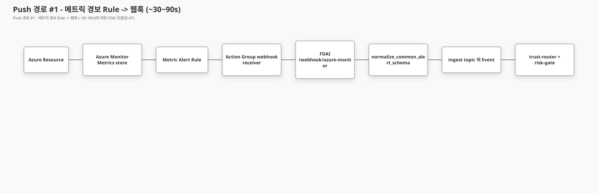
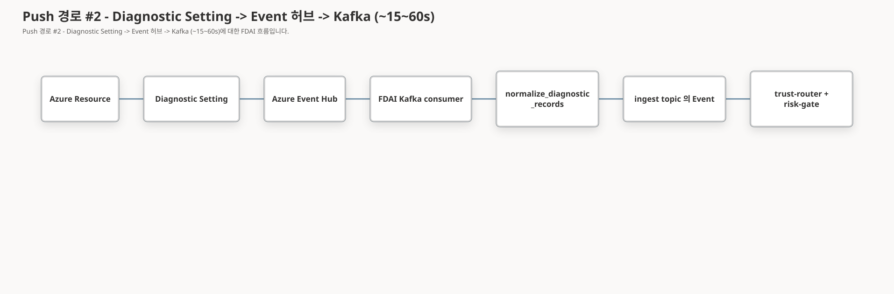

# 근실시간 감지 경로

이벤트로 도착하는 신호(KubeEvents, Activity Log 등)는 이미 서브초에
처리되지만, **샘플 메트릭 경로에서 지연이 살아있음**. 이 문서는 이 리포가
지원하는 모든 push / pull 경로를 열거해서 포크가 자기 비용·지연 예산에
맞는 조합을 고를 수 있게 합니다. 업스트림은 1분 간격 분석 작업과 라우팅된 메트릭
프로바이더를 선언하며, 작업이 호출하는 `fdai.delivery.analyzer_tick_cli`
모듈도 함께 제공합니다. 더 빠른 push 경로는 Terraform 및 조립 경계를 통해 계속 명시적으로 선택합니다.

> **현재 제공 범위**: 라우팅된 메트릭 프로바이더, 분석 작업 진입점, 두 Terraform 기본 요소가
> 구현되어 있으며, 집중 테스트 하나가 `RoutedMetricProvider`를 거쳐 Event 발행까지 한 번의 틱을
> 구동합니다. Operator Service는 Common Alert Schema 기록을 검증하고 정규화한 뒤 영속 큐에
> 저장하고 게시합니다. Core는 별도로 구성한 진단 Event Hub를 소비하고 허용 목록의 `AllMetrics`
> 기록을 정규화해 일반 유입 토픽에 게시합니다. 두 경로는 관리되는 실제 지연 및 전달 근거를
> 보존하기 전까지 `validated`가 아닌 `implemented`로 유지됩니다.

## 지연 요약

| 경로 | 종단 간 지연 | 배선 | 형태 |
|------|-----------------|------|------|
| Event-driven Kafka (KubeEvents, Activity Log, forwarded 진단) | **Kafka 수신 후 보통 서브초**; 출처 emission/forwarding 지연은 별도 | `FDAI_START_CONSUMER=1` 이면 소비자 on | push |
| AKS Managed Prometheus (`RoutedMetricProvider` 경로 #1) | **~15~60s** | `FDAI_PROMETHEUS_ENDPOINT` | pull (틱) |
| Diagnostic Setting -> Event 허브 -> Kafka | **~15~60s** | [`modules/observability/diagnostic-eventhub-route`](../../../infra/modules/observability/diagnostic-eventhub-route/main.tf) | **push (스트림)** |
| 메트릭 경보 Rule -> 액션 그룹 -> 웹훅 | **~30~90s** | [`modules/observability/metric-alert-rules`](../../../infra/modules/observability/metric-alert-rules/main.tf) | **push (웹훅)** |
| Azure Monitor Metrics REST API (`RoutedMetricProvider` 경로 #2) | **~1~3분** | `FDAI_MONITOR_WORKSPACE_ID` 세트되면 자동 | pull (틱) |
| Azure Monitor Logs KQL (`RoutedMetricProvider` 경로 #3) | **~2~5분** | `FDAI_MONITOR_WORKSPACE_ID` 세트되면 자동 | pull (틱) |

세 개의 `RoutedMetricProvider` 경로는 해당 env-var가 공급되면
[`wire_azure_container`](../../../services/core-control-plane/src/fdai/composition/wire_azure.py)가
자동으로 조립함 -
[`infra/README.md § Opt-in variables`](../../../infra/README.md#opt-in-variables-metric-analyzer-tick--prometheus)
참조. 두 push 경로는 포크가 리소스별로 인스턴스화하는 Terraform 모듈;
명시적으로 배선하지 않으면 업스트림에선 아무것도 안 돌아감.

## Push 경로 #1 - 메트릭 경보 Rule -> 웹훅 (~30~90s)



**언제 고를까**: 포크가 소수의 잘 알려진 알람을 자율 액션에 1:1로
매핑하고 싶을 때 ("MySQL CPU 5분간 90% 초과 -> change-safety 인시던트
발화"). 룰 + 임계값은 Azure에 살고, 새 알람마다 Terraform 편집이
필요하지만 FDAI 쪽은 정적.

**Seams**

- [정규화기](../../../packages/service-contracts/src/fdai_service_contracts/azure_monitor.py) -
  Common Alert Schema -> `Event`. 서비스 간 공유 계약이며 fired /
  resolved / malformed 페이로드에 대한 단위 테스트.
- [웹훅 경로](../../../services/operator-service/src/fdai_operator_service/) -
  Starlette `POST /webhook/azure-monitor`. HMAC-SHA256 검증, 256 KiB 본문 상한,
  영속 제안 outbox 및 정규화된 Resource id를 키로 사용하는 유입 토픽 직접 게시를 제공합니다.
- [Terraform 모듈](../../../infra/modules/observability/metric-alert-rules/main.tf) -
  재사용 가능한 메트릭 경보 룰; 포크가 (리소스, 메트릭) 페어마다 하나씩 인스턴스화.

**배포 패턴**

```hcl
module "aks_cpu_alert" {
  source               = "../../modules/observability/metric-alert-rules"
  name                 = "alert-aks-cpu-over-80"
  resource_group_name  = var.resource_group_name
  scopes               = [module.aks.id]
  description          = "AKS node CPU sustained above 80 percent"
  severity             = 2
  metric_namespace     = "Microsoft.ContainerService/managedClusters"
  metric_name          = "node_cpu_usage_percentage"
  aggregation          = "Average"
  operator             = "GreaterThan"
  threshold            = 80
  action_group_ids     = [module.alert_action_group.id]
  tags                 = local.tags
}
```

FDAI 경로는 `Authorization: Bearer <FDAI_AZURE_MONITOR_WEBHOOK_TOKEN>`을 요구합니다.
Shipped 액션 그룹 웹훅 receiver는 이 헤더를 추가하지 않으므로 포크는 토큰을 주입하는
trusted proxy 또는 Entra-authenticated secure-webhook 어댑터를 액션 그룹과
`https://<fdai-endpoint>/webhook/azure-monitor` 사이에 둬야 합니다.

## Push 경로 #2 - Diagnostic Setting -> Event 허브 -> Kafka (~15~60s)



**언제 고를까**: 포크가 FDAI 안에서 중앙 집중식으로 임계값 권한을
가지고 싶고, 리소스당 여러 메트릭에 대해 낮은 지연을 원하며, 경로 #1의
per-alert-rule Terraform 반복 작업을 피하고 싶을 때. 리소스당 진단
설정 하나가 해당 리소스가 발행하는 모든 네이티브 메트릭을 커버;
포크의 `DiagnosticNormalizerOptions.metric_whitelist`가 어떤 것을 실제
이벤트로 승격할지 고름.

**Seams**

- [정규화기](../../../services/core-control-plane/src/fdai/delivery/azure/) -
  진단 AllMetrics 배치 -> 튜플 of `Event`. Pure 함수,
  형태 mismatch에 실패 시 차단, whitelist miss는 조용히 건너뜀해서
  firehose가 틱을 저하시키지 않음.
- [Terraform 모듈](../../../infra/modules/observability/diagnostic-eventhub-route/main.tf) -
  대상 리소스에 Diagnostic Setting을 첨부하고 포크의 Event 허브로
  경로. 메트릭 / 로그 category는 명시적 선택.
- [런타임 브리지](../../../services/core-control-plane/src/fdai/delivery/azure/diagnostic_event_ingest.py)는
  `FDAI_DIAGNOSTIC_KAFKA_BOOTSTRAP_SERVERS`, `FDAI_DIAGNOSTIC_TOPIC`,
  `FDAI_DIAGNOSTIC_METRIC_WHITELIST_JSON`을 함께 제공하면 earliest offset 전용 Kafka 전송을
  만듭니다. 형식이 잘못된 일치 기록은 원본 DLQ로 보내고, 허용 목록 밖의 메트릭은 무시하며,
  유효한 기록은 작업 권한 없이 일반 유입 토픽에 게시합니다.

## Pull 기준선 - 분석 작업 + `RoutedMetricProvider`

모든 포크가 사용할 수 있는 프로바이더 라우팅
([observability-and-detection-ko.md](observability-and-detection-ko.md)
참조).
[analyzer 틱 작업](../../../infra/modules/compute/container-apps/analyzer_tick_job.tf)이
cron으로 `python -m fdai.delivery.analyzer_tick_cli`를 실행합니다. 이 모듈은 현재 트리에 있고
집중 테스트가 라우팅 표에서 Event 발행까지 한 번의 틱을 구동하므로 선언된 작업은 실행 가능한
기준선입니다. 관리되는 실제 지연 근거는 아직 남아 있습니다. `MetricProvider` 조립은
([Prom > Metrics API > Logs](../architecture/csp-neutrality-ko.md)) 사이를 계속 라우팅합니다.

`analyzer_tick_cron_expression`은 기본 1분입니다. 배포가 변환 결과 데이터베이스를 연결한
경우 대상 목록이 비어 있으면 영속 인벤토리 변환 결과로 대체하므로 새로 발견된 지원
리소스가 배포 변경 없이 다음 틱에 포함됩니다.
Cron을 명시적으로 빈 값으로 설정하면 작업이 비활성화됩니다. 명시적 대상과 영속 인벤토리
모두에 지원 리소스가 없으면 CLI가 조용히 종료됩니다. 읽을 수 없는 변환 결과는 빈 결과가
아닙니다. 이 경우 틱이 실패해 작업이 재시도하며, 관측 범위를 조용히 좁히지 않습니다.

각 점검 결과는 추적 상태에 범위가 제한된 증적도 기록합니다. 증적은 리소스, 관찰된 이벤트
시간, 현재 상태, 근거 완전성, 게시 결과, 복구 상태 및 불투명한 근거 참조를 서로 분리합니다.
`cause_claim_supported`와 `execution_authority`는 모두 `false`로 고정합니다. 인증된 Operator
API는 Console에 전달하기 전에 멱등성 키와 리소스별로 증적을 그룹화합니다. 따라서 브라우저는
수명 주기 간선을 추론하지 않고 서버가 작성한 현재 평가와 보존 이력을 표시합니다. 중복 전달은
억제된 게시 시도로 표시하며 불완전, 충돌 및 누락 근거를 서로 다른 상태로 유지합니다. 증적
신원은 변경할 수 없습니다. 다른 수명 주기 근거로 재생하면 이력을 덮어쓰지 않고 실패합니다.
한 틱보다 오래 지속되는 점검 결과는 같은 윈도 버킷 신원을 유지합니다. 따라서 같은 결과를 다시
기록하는 이후 틱은 멱등한 no-op이며 첫 관측을 보존합니다. 그 결과 감지 지연은 점검 결과의
경과 시간이 아니라 감지 측정값으로 남습니다.

### 리소스 감지 커버리지

모든 분석기 실행은 현재 제공되는 다섯 가지 리소스 유형의 범위가 제한된 읽기 전용 커버리지를
기록합니다. 대상은 API gateway, Kubernetes cluster, LLM endpoint, MySQL server 및
Application Gateway입니다. 대상 선택 단계부터 정규 온톨로지 `resource_type`을 분석기 종류와
함께 전달하므로 구현 이름에서 리소스 유형을 역추정하지 않습니다. 실행 증적은 다음을 구분합니다.

- 인벤토리 후보, 선택된 대상, 실제 평가를 마친 대상 및 보류된 후보
- 발견 사항 없이 평가를 마친 대상과 발견 사항이 있는 대상
- 분석기 오류와 지원되지 않는 대상, 발견 사항별 정확한 게시 결과
- 리소스 유형별 수치와 범위가 제한된 선택 대상별 행

후보는 선택과 보류의 합, 선택 수는 보존된 리소스 행 수와 같아야 하며 전체 수치는 리소스 유형별
및 리소스별 수치와 일치해야 합니다. 발견 사항 게시 상태는 게시됨, 중복 억제, 불확실, 조정 대기,
실패를 포함한 기존 상태를 그대로 유지합니다. 발견 사항이 없는 성공한 분석은
`evaluated_no_finding`만 의미합니다. 리소스 정상, 탐지기 준비, 복구 또는 실행 권한을 뜻하지
않습니다. 커버리지 섹션은 원인 주장과 실행 권한을 모두 `false`로 고정합니다.

보류된 각 리소스 유형은 오래되거나 사용할 수 없거나 검증되지 않은 상태 근거, 선택 한도, 중복
후보와 같이 선택하지 않은 이유도 기록합니다. 선택된 리소스 행은 프로바이더 예외 원문 대신 범위가
제한된 오류 코드를 사용합니다. 선택된 리소스와 연결할 수 없는 게시 및 증적 저장 실패는 귀속되지
않은 오류로 명시합니다. 인벤토리에 같은 ID가 여러 번 있어도 한 번만 선택합니다.

분석기 실행 증적 `1.3.0`은 커버리지 스키마 `1.1.0`을 포함합니다. Operator 경계는 커버리지
스키마 `1.0.0`도 허용하며 누락된 보류 및 오류 세부 정보를 `legacy_unspecified`로 표시합니다.
커버리지를 도입하기 전의 분석기 실행 증적은 불완전한 데이터에서 재구성하지 않고 해당 섹션만
사용 불가로 표시합니다. 최신 시도와 최근 성공한 분석기 실행은 시각과 수치를 별도로 유지합니다.
보존된 발견 사항 증적은 자체 불변 ID가 달리 증명하지 않는 한 여러 실행에 걸친 이력이므로 Console은
과거 발견 사항을 최신 실행에 귀속하지 않습니다.

### Kubernetes 준비도 확장

6차원 `DetectionReadinessSnapshot`은 Kubernetes 전용 권한 상한 확장으로 유지합니다. 차원은 발견,
수집기 구성, 최근 텔레메트리, 탐지기 연결, 이전 파이프라인 연속성 및 작업 거버넌스입니다.
Heimdall은 완전한 통과만 축약하고, Muninn은 가장 최신 스냅샷을 보존하며, Saga는 전환을 감사하고,
Forseti는 이후 권한을 낮출 수 있습니다. 누락되거나 오래되었거나 사용할 수 없거나 권한이 없는
근거는 준비 완료가 되지 않으며, 완전한 스냅샷도 처음에는 `shadow` 상한을 유지합니다.

현재 운영 분석기 작업은 6개의 `detection.readiness.observed` 레코드를 게시하지 않습니다. 검토된
기계식 생산자가 연결되기 전까지 이 확장은 분석기 성공에서 추론하지 않고 실제 커버리지에서 사용
불가로 표시합니다. 기존 테스트는 축약기와 에이전트 흐름만 증명합니다. Kubernetes Pod 재시작,
교체 및 복구 이력은 또 다른 선택형 Kubernetes 세부 정보이며 범용 커버리지 및 준비도와 분리합니다.

## 조합 규칙

- **모든 push 정규화기는 별개의 `event_type`을 발행**해서 trust
  라우터 (와 다운스트림 대시보드)가 분명하게 필터 가능:
  `azure.metric_alert.fired`, `azure.metric_alert.resolved`,
  `azure.metric_sample`.
- **모든 발행 이벤트는 기본값이 `Mode.SHADOW`**. 첫 배선에서 실제 운영 push
  신호에 자동 실행되지 않고, `Mode.ENFORCE`로의 승격은 분리된
  검토를 거친 명시적 변경.
- **멱등성 키는 소스 이벤트마다 결정적**. 경보 정규화기는
  `alertId + monitorCondition + firedDateTime`으로 접기; 진단
  정규화기는 `resourceId + metricName + timeStamp`로 접기. 액션
  그룹 재전송이나 Event Hubs at-least-once 의미 규칙으로 인한 재-delivery도
  중복 처리 안 함.
- **상관관계 id는 series당 / 룰당 접기**. 한 경보 룰의 모든
  fire / resolved 쌍은 하나의 상관관계 id (`azure_alert:<alertId>`)를
  공유; `(resource, metric)` series의 모든 샘플도 하나의 상관관계
  id (`azure_metric_stream:<resource>:<metric>`)를 공유. trust 라우터는
  그룹화 키로 전달하고 인시던트 수명 주기 소비자가 상태 전이를 별도로 결정합니다.

## 포크 픽 가이드

| 포크 프로파일 | 추천 조합 |
|---------------|-----------|
| 첫 배포, 일반 AKS | Pull 기준선만 (Prom + Metrics API + Logs). Push 배선 없음. |
| 큐레이션된 경보 카탈로그를 가진 prod | Pull 기준선 + 포크가 신경 쓰는 경보들에 대해 push 경로 #1. |
| FDAI 안에 메트릭 권한이 무거운 prod | Pull 기준선 + 가장 중요한 리소스들에 push 경로 #2; push #1는 피함. |
| Event Hubs 비용 엄격 상한 | Push 경로 #1만 (범위가 제한된 양) + pull 기준선. |

어느 조합도 업스트림 코어 변경을 요구하지 않지만 포크의 Terraform/조립 연결이
필요하고 경로 #1은 인증 브리지도 필요합니다.
## 아직 배송 안 됨

- **경로 #1 외부 액션 그룹 수신기.** FDAI 쪽 HMAC 브리지는 구현되어 있지만 shipped
  액션 그룹 웹훅은 Bearer 헤더를 추가하지 않습니다. 포크는 토큰을 주입하는 trusted
  proxy 또는 Entra-authenticated secure 웹훅 연결을 제공해야 합니다.

- **관리형 alert-rule authoring 파이프라인**. 경로 #1의 Terraform
  모듈은 기본 요소; shipped 룰 카탈로그에서 룰을 materialize하는
  rule-catalog-driven generator는 별개 스코프.

관리형 작성 파이프라인은 구현된 push 전송과 별도 범위로 남아 있습니다.

## 관련 문서

| 알아볼 내용 | 읽을 문서 |
|-------------|-----------|
| 구현 상태 및 남은 작업 | [구현 원장](../../roadmap-implementation/rules-and-detection/near-real-time-detection-paths.md) |
