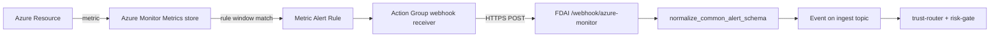
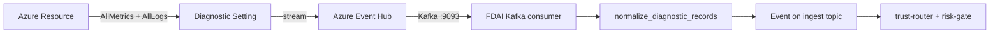

# Near-real-time detection paths

The control loop already reacts to Kafka-delivered events in sub-second
time; **sampled metrics** are where detection latency lives. This page
catalogs every push and pull path this repo ships so a fork picks the
combination that fits its cost and freshness envelope. Nothing here is
mandatory. Upstream provides the safest pull baseline, but the analyzer-tick
cron defaults to an empty string and is opt-in. A fork explicitly enables a
pull path or a faster push path through the Terraform and environment-variable seams.

> **Implementation status**: The pull provider and CLI, two push normalizers and routes, and
> Terraform primitives are implemented. Kafka-consumer glue for path #2 remains a fork task.
> Path #1 also needs an authentication bridge: the current Action Group Terraform webhook
> receiver cannot set the Bearer header required by the FDAI route, so it cannot call the route
> directly without an authenticated proxy or Entra secure-webhook adapter.

## Latency envelope at a glance

| Path | End-to-end latency | Wired by | Shape |
|------|-------------------|----------|-------|
| Event-driven Kafka (KubeEvents, Activity Log, forwarded diagnostics) | **Typically sub-second after Kafka receipt**; source emission and forwarding latency are separate | Consumer on when `FDAI_START_CONSUMER=1` | push |
| AKS Managed Prometheus (`RoutedMetricProvider` route #1) | **~15-60 s** | `FDAI_PROMETHEUS_ENDPOINT` | pull (tick) |
| Diagnostic Setting -> Event Hub -> Kafka | **~15-60 s** | [`modules/observability/diagnostic-eventhub-route`](../../../infra/modules/observability/diagnostic-eventhub-route/main.tf) | **push (stream)** |
| Metric Alert Rule -> Action Group -> Webhook | **~30-90 s** | [`modules/observability/metric-alert-rules`](../../../infra/modules/observability/metric-alert-rules/main.tf) | **push (webhook)** |
| Azure Monitor Metrics REST API (`RoutedMetricProvider` route #2) | **~1-3 min** | Auto-bound with `FDAI_MONITOR_WORKSPACE_ID` | pull (tick) |
| Azure Monitor Logs KQL (`RoutedMetricProvider` route #3) | **~2-5 min** | Auto-bound with `FDAI_MONITOR_WORKSPACE_ID` | pull (tick) |

The three `RoutedMetricProvider` routes are set up automatically by
[`wire_azure_container`](../../../src/fdai/composition/wire_azure.py)
when their respective env vars are supplied - see
[`infra/README.md § Opt-in variables`](../../../infra/README.md#opt-in-variables-metric-analyzer-tick--prometheus).
The two push paths are Terraform modules the fork instantiates per
resource; nothing runs upstream unless explicitly wired.

## Push path #1 - Metric Alert Rule -> Webhook (~30-90 s)



**When to pick this.** The fork has a small, well-known set of
alerts that map 1:1 to autonomy actions ("MySQL CPU over 90% for 5
min -> raise a change-safety incident"). Rule + threshold live in
Azure; every new alert is a Terraform edit but the FDAI side stays
static.

**Seams**

- [Normalizer](../../../src/fdai/delivery/azure/monitor_alert.py) -
  Common Alert Schema v2 -> `Event`. Pure function, unit tested
  against fired / resolved / malformed payloads.
- [Webhook route](../../../src/fdai/delivery/read_api/routes/azure_monitor_webhook.py) -
  Starlette POST /webhook/azure-monitor. Bearer-token auth
  (constant-time compare), 256 KiB body cap, publishes to the
  ingest topic keyed by lowercased ARM id.
- [Terraform module](../../../infra/modules/observability/metric-alert-rules/main.tf) -
  reusable metric alert rule; a fork instantiates one per
  (resource, metric) pair.

**Deploy pattern**

```hcl
module "aks_cpu_alert" {
  source               = "../../modules/observability/metric-alert-rules"
  name                 = "alert-aks-cpu-over-80"
  resource_group_name  = var.resource_group_name
  scopes               = [module.aks.id]
  description          = "AKS node CPU sustained above 80 percent"
  severity             = 2
  metric_namespace     = "Microsoft.ContainerService/managedClusters"
  metric_name          = "node_cpu_usage_percentage"
  aggregation          = "Average"
  operator             = "GreaterThan"
  threshold            = 80
  action_group_ids     = [module.alert_action_group.id]
  tags                 = local.tags
}
```

The FDAI route requires `Authorization: Bearer <FDAI_AZURE_MONITOR_WEBHOOK_TOKEN>`.
The shipped Action Group webhook receiver does not add this header. A fork must place a trusted
proxy that injects the token, or an Entra-authenticated secure-webhook adapter, between the Action
Group and `https://<fdai-endpoint>/webhook/azure-monitor`.

## Push path #2 - Diagnostic Setting -> Event Hub -> Kafka (~15-60 s)



**When to pick this.** The fork wants centralized threshold authority
inside FDAI, low latency for many metrics per resource, and does not
want the per-alert-rule Terraform churn of path #1. One Diagnostic
Setting per resource covers every native metric the resource emits;
the fork's whitelist in `DiagnosticNormalizerOptions.metric_whitelist`
picks which ones actually turn into events.

**Seams**

- [Normalizer](../../../src/fdai/delivery/azure/monitor_diagnostic.py) -
  Diagnostic AllMetrics batch -> tuple of `Event`. Pure function,
  fail-closed on shape mismatch, silently skips whitelist misses so
  a firehose does not degrade the tick.
- [Terraform module](../../../infra/modules/observability/diagnostic-eventhub-route/main.tf) -
  attaches a Diagnostic Setting to a target resource and routes to
  the fork's Event Hub. Metric / log categories are opt-in.
- The **Kafka consumer wiring** that reads the Event Hub Kafka
  endpoint and calls `normalize_diagnostic_records` is a fork task -
  the standard `AIOKafkaConsumer` in
  [`delivery/azure/event_bus.py`](../../../src/fdai/delivery/azure/event_bus.py)
  already reads from a topic; the fork's composition root points
  a second consumer instance at the diagnostic hub and pipes each
  batch through the normalizer.

## Pull baseline - `analyzer_tick_cli` + `RoutedMetricProvider`

Not new, but an opt-in baseline available to every fork (see
[observability-and-detection.md](observability-and-detection.md)).
The
[analyzer tick job](../../../infra/modules/compute/container-apps/analyzer_tick_job.tf)
runs `python -m fdai.delivery.analyzer_tick_cli` on a cron; the CLI
invokes the reference threshold analyzers against whichever
`MetricProvider` composition wired
([Prom > Metrics API > Logs](../architecture/csp-neutrality.md)).

Both `analyzer_tick_cron_expression` and `analyzer_targets_json` default to empty, so the job does
not run in a generic deployment. A fork must configure the targets and cadence together.

## Composition rules

- **Every push normalizer emits a distinct `event_type`** so the
  trust router (and downstream dashboards) can filter unambiguously:
  `azure.metric_alert.fired`, `azure.metric_alert.resolved`,
  `azure.metric_sample`.
- **Every emitted event ships in `Mode.SHADOW` by default.** A first
  wire-up never auto-executes off a live push signal; promotion to
  `Mode.ENFORCE` is an explicit, separately reviewed change.
- **Idempotency keys are deterministic per source event.** The alert
  normalizer folds by `alertId + monitorCondition + firedDateTime`;
  the diagnostic normalizer folds by
  `resourceId + metricName + timeStamp`. Re-delivery from the
  Action Group or from Event Hubs at-least-once semantics never
  double-processes.
- **Correlation ids fold per series / per rule.** Every fire /
  resolved pair on one alert rule shares one correlation id
  (`azure_alert:<alertId>`); every sample of a
  `(resource, metric)` series shares one correlation id
  (`azure_metric_stream:<resource>:<metric>`). The trust router
  carries the grouping key; an incident-lifecycle consumer decides state transitions separately.

## Fork picking guide

| Fork profile | Recommended combination |
|--------------|-------------------------|
| First deploy, generic AKS | Pull baseline only (Prom + Metrics API + Logs). No push wiring. |
| Prod with a curated alert catalog | Pull baseline + push path #1 for the alerts the fork cares about. |
| Prod with heavy metric authority in FDAI | Pull baseline + push path #2 for the resources that matter most; keep push #1 out of the way. |
| Prod with strict cost cap on Event Hubs | Push path #1 only (bounded volume) + pull baseline. |

None of the combinations require an upstream core change, but they do require fork Terraform and
composition binding, and path #1 also requires an authentication bridge.

## What is NOT yet shipped

- **Authenticated Action Group bridge for path #1.** The route and alert-rule module exist, but
  the shipped Action Group webhook does not add the Bearer header. A fork must supply a trusted
  token-injecting proxy or an Entra-authenticated secure-webhook binding.
- **Kafka-consumer glue** for path #2 (see the "fork task" note
  above). The consumer library and the normalizer both exist; only
  the composition-root wiring that reads the diagnostic hub and
  pipes records through the normalizer is not written upstream.
- **Managed alert-rule authoring pipeline.** Path #1's Terraform
  module is the primitive; a rule-catalog-driven generator that
  materializes rules from the shipped rule catalog is a separate
  scope.

All three are ready to be added once a fork picks the shape.
