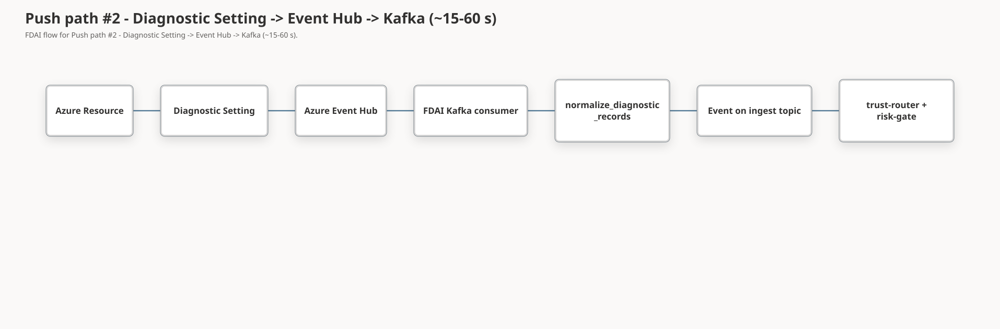

# Near-real-time detection paths

The control loop already reacts to Kafka-delivered events in sub-second
time; **sampled metrics** are where detection latency lives. This page
catalogs every push and pull path this repo ships so a fork picks the
combination that fits its cost and freshness envelope. Nothing here is
mandatory. Upstream declares a one-minute analyzer job, ships routed metric providers, and ships the
`fdai.delivery.analyzer_tick_cli` module that the job invokes.
Faster push paths remain opt-in through Terraform and composition seams.

> **Current delivery boundary**: Routed metric providers, the analyzer job entry point, and both
> Terraform primitives are implemented, and one focused test drives a tick through a
> `RoutedMetricProvider` to a published Event. The Operator Service verifies, normalizes, durably
> queues, and publishes Common Alert Schema records. Core independently consumes a configured
> diagnostic Event Hub, normalizes whitelisted `AllMetrics` records, and publishes them to the
> ordinary ingest topic. Both paths remain `implemented`, not `validated`, until governed live
> latency and delivery evidence is retained.

## Latency envelope at a glance

| Path | End-to-end latency | Wired by | Shape |
|------|-------------------|----------|-------|
| Event-driven Kafka (KubeEvents, Activity Log, forwarded diagnostics) | **Typically sub-second after Kafka receipt**; source emission and forwarding latency are separate | Consumer on when `FDAI_START_CONSUMER=1` | push |
| AKS Managed Prometheus (`RoutedMetricProvider` route #1) | **~15-60 s** | `FDAI_PROMETHEUS_ENDPOINT` | pull (tick) |
| Diagnostic Setting -> Event Hub -> Kafka | **~15-60 s** | [`modules/observability/diagnostic-eventhub-route`](../../../infra/modules/observability/diagnostic-eventhub-route/main.tf) | **push (stream)** |
| Metric Alert Rule -> Action Group -> Webhook | **~30-90 s** | [`modules/observability/metric-alert-rules`](../../../infra/modules/observability/metric-alert-rules/main.tf) | **push (webhook)** |
| Azure Monitor Metrics REST API (`RoutedMetricProvider` route #2) | **~1-3 min** | Auto-bound with `FDAI_MONITOR_WORKSPACE_ID` | pull (tick) |
| Azure Monitor Logs KQL (`RoutedMetricProvider` route #3) | **~2-5 min** | Auto-bound with `FDAI_MONITOR_WORKSPACE_ID` | pull (tick) |

The three `RoutedMetricProvider` routes are set up automatically by
[`wire_azure_container`](../../../services/core-control-plane/src/fdai/composition/wire_azure.py)
when their respective env vars are supplied - see
[`infra/README.md § Opt-in variables`](../../../infra/README.md#opt-in-variables-metric-analyzer-tick--prometheus).
The two push paths are Terraform modules the fork instantiates per
resource; nothing runs upstream unless explicitly wired.

## Push path #1 - Metric Alert Rule -> Webhook (~30-90 s)


**When to pick this.** The fork has a small, well-known set of
alerts that map 1:1 to autonomy actions ("MySQL CPU over 90% for 5
min -> raise a change-safety incident"). Rule + threshold live in
Azure; every new alert is a Terraform edit but the FDAI side stays
static.

**Seams**

- [Normalizer](../../../packages/service-contracts/src/fdai_service_contracts/azure_monitor.py) -
  Common Alert Schema -> `Event`. Shared cross-service contract, unit tested
  against fired / resolved / malformed payloads.
- [Webhook route](../../../services/operator-service/src/fdai_operator_service/) -
  Starlette `POST /webhook/azure-monitor`. HMAC-SHA256 verification
  (constant-time compare), 256 KiB body cap, durable proposal outbox, and
  direct ingest-topic publication keyed by the normalized Resource id.
- [Terraform module](../../../infra/modules/observability/metric-alert-rules/main.tf) -
  reusable metric alert rule; a fork instantiates one per
  (resource, metric) pair.

**Deploy pattern**

```hcl
module "aks_cpu_alert" {
  source               = "../../modules/observability/metric-alert-rules"
  name                 = "alert-aks-cpu-over-80"
  resource_group_name  = var.resource_group_name
  scopes               = [module.aks.id]
  description          = "AKS node CPU sustained above 80 percent"
  severity             = 2
  metric_namespace     = "Microsoft.ContainerService/managedClusters"
  metric_name          = "node_cpu_usage_percentage"
  aggregation          = "Average"
  operator             = "GreaterThan"
  threshold            = 80
  action_group_ids     = [module.alert_action_group.id]
  tags                 = local.tags
}
```

The FDAI route requires `Authorization: Bearer <FDAI_AZURE_MONITOR_WEBHOOK_TOKEN>`.
The shipped Action Group webhook receiver does not add this header. A fork must place a trusted
proxy that injects the token, or an Entra-authenticated secure-webhook adapter, between the Action
Group and `https://<fdai-endpoint>/webhook/azure-monitor`.

## Push path #2 - Diagnostic Setting -> Event Hub -> Kafka (~15-60 s)



**When to pick this.** The fork wants centralized threshold authority
inside FDAI, low latency for many metrics per resource, and does not
want the per-alert-rule Terraform churn of path #1. One Diagnostic
Setting per resource covers every native metric the resource emits;
the fork's whitelist in `DiagnosticNormalizerOptions.metric_whitelist`
picks which ones actually turn into events.

**Seams**

- [Normalizer](../../../services/core-control-plane/src/fdai/delivery/azure/) -
  Diagnostic AllMetrics batch -> tuple of `Event`. Pure function,
  fail-closed on shape mismatch, silently skips whitelist misses so
  a firehose does not degrade the tick.
- [Terraform module](../../../infra/modules/observability/diagnostic-eventhub-route/main.tf) -
  attaches a Diagnostic Setting to a target resource and routes to
  the fork's Event Hub. Metric / log categories are opt-in.
- [Runtime bridge](../../../services/core-control-plane/src/fdai/delivery/azure/diagnostic_event_ingest.py)
  creates a dedicated earliest-offset Kafka transport when
  `FDAI_DIAGNOSTIC_KAFKA_BOOTSTRAP_SERVERS`, `FDAI_DIAGNOSTIC_TOPIC`, and
  `FDAI_DIAGNOSTIC_METRIC_WHITELIST_JSON` are supplied together. Malformed matching records go to
  the source DLQ; non-whitelisted metrics are ignored; valid records publish to the ordinary ingest
  topic with no action authority.

## Pull baseline - analyzer job + `RoutedMetricProvider`

The provider routing is available to every fork (see
[observability-and-detection.md](observability-and-detection.md)).
The
[analyzer tick job](../../../infra/modules/compute/container-apps/analyzer_tick_job.tf)
runs `python -m fdai.delivery.analyzer_tick_cli` on a cron. That module ships in the current tree
and a focused test drives one tick from the routing table to a published Event, so the declared job
is a runnable baseline; governed live latency evidence remains open. The `MetricProvider`
composition routes among
([Prom > Metrics API > Logs](../architecture/csp-neutrality.md)).

`analyzer_tick_cron_expression` defaults to one minute. When the deployment binds the projection
database, an empty target list falls back to the durable inventory projection, so a newly
discovered supported resource joins the next tick without a deployment edit. An explicit empty cron disables the job; the CLI exits quietly when neither
explicit targets nor durable inventory contains a supported resource. An unreadable projection is
not an empty one: the tick fails so the Job retries instead of narrowing its coverage silently.

Each finding also writes a bounded receipt to tracked state. The receipt keeps the resource,
observed event time, current state, evidence completeness, publication outcome, recovery state, and
opaque evidence references separate. It fixes both `cause_claim_supported` and
`execution_authority` to `false`. The authenticated Operator API groups receipts by idempotency key
and resource before the Console receives them, so the browser renders a server-authored current
assessment and retained history instead of inferring a lifecycle edge. Duplicate deliveries remain
visible as suppressed publication attempts, and incomplete, conflicting, and missed evidence remain
distinct states. A receipt identity is immutable; replay with different lifecycle evidence fails
instead of rewriting history.

### Agent-owned AKS detection readiness

For every AKS target, the same tick publishes six sanitized observations to Huginn's raw ingress:
discovery, collector configuration, recent telemetry, detector binding, previous pipeline
continuity, and action governance. Heimdall reduces those observations into `object.drift`; Muninn
stores the latest `object.state-snapshot`; Saga audits the transition; and Forseti uses the
snapshot as an authority ceiling. The first pass is partial because no previous Muninn snapshot
exists. A later pass can prove pipeline continuity.

All six observations in one target tick share a deterministic `pass_id` and the target resource
partition key. Event Hubs ordering and the Heimdall consumer group therefore deliver each target to
one consumer even when the runtime has multiple replicas. Heimdall accepts dimensions in any order,
tracks overlapping pass IDs independently, and publishes no drift until all six from one pass
arrive. An incomplete pass neither erases another collecting pass nor replaces the last complete
snapshot.

The reduction is fail-closed. Missing, stale, unavailable, or unauthorized evidence never becomes
ready. New readiness capability remains `shadow` even when all six dimensions pass, so it cannot
promote an ActionType or execute a change. The Operator API and console project Muninn's decision and
do not recompute it. Muninn replaces the latest target snapshot only when `generated_at` is
strictly newer, so reordered or replayed Drift delivery cannot roll durable readiness backward.
An inventory-backed target carries graph freshness and coverage evidence into the discovery
dimension. A stale snapshot or degraded coverage becomes unavailable, never passed. Heimdall
publishes the Drift but does not execute repair. Collection follows the adaptive source policy in
[Continuous Operational Instance Graph](../architecture/continuous-operational-instance-graph.md):
lag, churn, maximum staleness, provider budget, throttling, and circuit state determine the next
delta or complete reconciliation attempt. The current fixed routine interval remains a legacy
configuration until that controller is implemented and measured.

## Composition rules

- **Every push normalizer emits a distinct `event_type`** so the
  trust router (and downstream dashboards) can filter unambiguously:
  `azure.metric_alert.fired`, `azure.metric_alert.resolved`,
  `azure.metric_sample`.
- **Every emitted event ships in `Mode.SHADOW` by default.** A first
  wire-up never auto-executes off a live push signal; promotion to
  `Mode.ENFORCE` is an explicit, separately reviewed change.
- **Idempotency keys are deterministic per source event.** The alert
  normalizer folds by `alertId + monitorCondition + firedDateTime`;
  the diagnostic normalizer folds by
  `resourceId + metricName + timeStamp`. Re-delivery from the
  Action Group or from Event Hubs at-least-once semantics never
  double-processes.
- **Correlation ids fold per series / per rule.** Every fire /
  resolved pair on one alert rule shares one correlation id
  (`azure_alert:<alertId>`); every sample of a
  `(resource, metric)` series shares one correlation id
  (`azure_metric_stream:<resource>:<metric>`). The trust router
  carries the grouping key; an incident-lifecycle consumer decides state transitions separately.

## Fork picking guide

| Fork profile | Recommended combination |
|--------------|-------------------------|
| First deploy, generic AKS | Pull baseline only (Prom + Metrics API + Logs). No push wiring. |
| Prod with a curated alert catalog | Pull baseline + push path #1 for the alerts the fork cares about. |
| Prod with heavy metric authority in FDAI | Pull baseline + push path #2 for the resources that matter most; keep push #1 out of the way. |
| Prod with strict cost cap on Event Hubs | Push path #1 only (bounded volume) + pull baseline. |

None of the combinations require an upstream core change, but they do require fork Terraform and
composition binding, and path #1 also requires an authentication bridge.

## Implementation status

### Implementation scope

| Area | State | Evidence | Notes |
|------|-------|----------|-------|
| Routed pull providers | implemented | `services/core-control-plane/src/fdai/composition/wire_metric_provider.py`; `services/core-control-plane/tests/providers/test_routed_metric.py` | Prometheus, Metrics API, and Logs providers resolve through a deterministic route order. |
| Scheduled analyzer job | implemented | `infra/modules/compute/container-apps/analyzer_tick_job.tf`; `services/core-control-plane/src/fdai/delivery/analyzer_tick_cli.py`; `services/core-control-plane/tests/delivery/test_analyzer_tick_routed.py` | Terraform declares the one-minute job and its `fdai.delivery.analyzer_tick_cli` entry point ships. One focused tick reaches each routed backend and publishes its breach as a shadow-mode Event; governed live latency evidence remains open. |
| Analyzer lifecycle receipt projection | implemented | `fdai/delivery/analyzer_receipt_store.py`; `fdai_operator_service/analyzer_lifecycle_projection.py`; `console/src/routes/detection-readiness.tsx`; focused analyzer, Operator API, Console, and three-viewport Playwright checks | The bounded tracked-state receipt separates current state from retained restart, replacement, publication, and recovery history. The authenticated read projection exposes incomplete, conflicting, missed, failed, and duplicate evidence without a cause claim, provider read, browser-derived edge, or execution authority. |
| AKS detection-readiness reduction | implemented | `services/core-control-plane/tests/agents/test_huginn_detection_readiness.py`; `tests/integration/infra/test_detection_readiness.py` | Focused tests cover the agent-owned readiness observations and the infrastructure contract. This is implementation evidence, not live latency evidence. |
| Metric Alert webhook path | implemented | `fdai_service_contracts/azure_monitor.py`; Operator operations route, durable webhook outbox bridge, semantic Kafka event route; focused contract, route, bridge, and Kafka tests | Verified Common Alert payloads become sanitized shadow Events and publish from a lease-fenced durable proposal. Governed live Action Group delivery and latency evidence remain open. |
| Diagnostic Event Hub path | implemented | `delivery/azure/monitor_events.py`; `diagnostic_event_ingest.py`; runtime bootstrap and Core service Terraform binding; focused normalizer, bridge, bootstrap, shutdown, and infrastructure tests | A dedicated Kafka consumer normalizes only configured metrics, dead-letters malformed matching records, and feeds the ordinary ingest topic. Governed live delivery and latency evidence remain open. |
| Managed alert-rule authoring | not-started | [What is NOT yet shipped](#what-is-not-yet-shipped) | No catalog-driven generator materializes alert rules from governed Rule entries. |

### Implementation history

| Date | State | Change | Evidence | Remaining |
|------|-------|--------|----------|-----------|
| 2026-08-31 | implemented | Persisted the analyzer's bounded finding receipt in retention-limited tracked state and projected it through the authenticated detection-readiness route as server-authored current state plus retained lifecycle history. Duplicate publication, recovery, and complete, incomplete, conflicting, or missed evidence remain explicit while cause and execution authority stay false. | `current change`; focused Python and Operator API checks passed 90 cases; focused Console checks passed 5 cases; Console typecheck and production build passed; synthetic desktop, constrained-desktop, and mobile Playwright checks passed 3 cases with no measured horizontal overflow. | Governed live delivery and latency evidence remains open and was not produced by this change. |
| 2026-08-29 | implemented | Hardening round 4 reviewed 26 diagnostic-ingest lenses and normalized diagnostic record time to UTC before Event identity derivation. Offset-only replays now retain one idempotency key. | `current change`; focused Azure diagnostic normalizer tests. | Retain governed live delivery and latency evidence. |
| 2026-08-29 | implemented | Hardening round 2 reviewed 25 alert-contract lenses and normalized provider timestamps to UTC before deriving Event and idempotency identity. Equivalent offset representations of one alert can no longer create duplicate incident signals. | `current change`; focused Azure Monitor contract tests. | Retain governed live delivery and latency evidence. |
| 2026-08-28 | implemented | Completed both push-path implementations. The HMAC-verified Operator webhook now converts Common Alert Schema bodies into shared sanitized Events before durable acceptance, and a lease-fenced outbox publishes them directly to the Core event topic. Core now owns a separately configured diagnostic Kafka transport, normalizes bounded whitelisted `AllMetrics` records, dead-letters malformed matching input, and supervises the bridge with startup readiness and ordered shutdown. Both capabilities remain shadow and grant no action authority. | `current change`; shared alert contract; Operator route, outbox, Kafka, composition, and focused tests; Core normalizer, bridge, bootstrap, shutdown, Terraform contract, and focused tests. | Retain governed live Action Group and diagnostic Event Hub delivery and latency evidence. |
| 2026-08-14 | in-progress | Adopted the implementation ledger without reconstructing earlier provenance and corrected end-to-end delivery claims to match the current source tree. | `current change`; paths and focused checks listed in the scope table. | Restore a runnable pull entry point and complete both authenticated push paths. |
| 2026-08-16 | implemented | Corrected the stale claim that `fdai.delivery.analyzer_tick_cli` is absent; the module ships. Added a focused integration test that drives one tick through a `RoutedMetricProvider`, proving each metric reaches the backend its routing table selects, that a breach publishes one shadow-mode Event, that a healthy pass publishes nothing, and that an unrouted metric marks the pass partial instead of healthy. | `current change`; `services/core-control-plane/tests/delivery/test_analyzer_tick_routed.py`; `pytest services/core-control-plane/tests/delivery/test_analyzer_tick_routed.py` (4 passed). | Complete both authenticated push paths and record governed live latency evidence per path. |

### Remaining work

- [x] `fdai.delivery.analyzer_tick_cli` ships as the entry point the scheduled job invokes, and one focused integration test drives a tick through the `RoutedMetricProvider` to a published shadow-mode Event, proven by `services/core-control-plane/tests/delivery/test_analyzer_tick_routed.py`.
- [x] Add a tested Azure Monitor request handler, shared payload normalizer, HMAC verifier, durable
  outbox, and event-topic publisher for path #1.
- [x] Add a tested diagnostic-record normalizer and runtime binding that feeds path #2 records into
  the ingest topic and dead-letters malformed matching records.
- [x] Persist bounded analyzer finding receipts and expose server-authored current state, retained
  lifecycle history, publication, recovery, duplicate delivery, and explicit evidence-gap states
  through the authenticated Operator API and responsive Console.
- [ ] Record governed latency evidence for each path before changing any path from `implemented` to `validated`.

## What is NOT yet shipped

- **External Action Group receiver for path #1.** The FDAI-side HMAC bridge is implemented, but
  the shipped Action Group webhook does not add the Bearer header. A fork must supply a trusted
  token-injecting proxy or an Entra-authenticated secure-webhook binding.
- **Managed alert-rule authoring pipeline.** Path #1's Terraform
  module is the primitive; a rule-catalog-driven generator that
  materializes rules from the shipped rule catalog is a separate
  scope.

The managed authoring pipeline remains separate from the implemented push transports.
