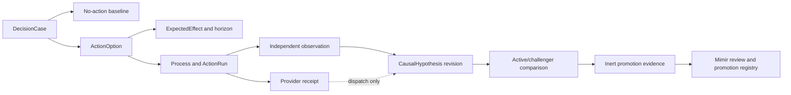

# 운영 가설 루프

운영 가설 루프는 FDAI가 운영 개입 전에 예상한 내용, 이후 독립적으로 발생한 결과, 그리고 그
비교에서 학습할 수 있는 통제된 logic을 기록합니다. 이 문서는 두 번째 계획, 인과, simulation 또는
승격 시스템을 추가하지 않고 통합된 graph evidence, reconciliation, lineage 및 model-promotion
runtime을 기록합니다.

> **권한 경계:** Ontology 선언, simulation, logic asset, model 및 가설 근거는 권한을 유지하거나
> 낮출 수 있습니다. 액션을 승인, 실행 또는 승격할 수 없습니다.
>
> **Object 경계:** 첫 구현은 `DecisionCase`, `ActionOption`, `ExpectedEffect`, `Process`,
> `CausalHypothesis`, `ActionRun` 및 `ObservedOutcome`을 재사용합니다. 동결된 competency test가
> 이러한 object와 link로 필수 query에 답할 수 없어서 실패한 뒤에만 `HypothesisCampaign`
> ObjectType을 추가할 수 있습니다.
>
> **J1 상태:** Lane A-D 산출물은 `main`에 통합되어 있습니다. J1은 composition, runtime
> lifecycle, 기존 delivery routing 및 bilingual code-map 업데이트만 소유합니다. 새 service,
> agent 또는 권한을 보유한 coordinator를 추가하지 않습니다.
>
> **Hardening 상태(2026-08-12):** 독립 비평 14라운드에서 권한, 범위, dry-run identity,
> idempotency, lease, ARM update 의미, 비동기 polling, input canonicalization, 오류 노출, 계약
> 일치 및 독립 outcome 경계를 검토했습니다. 수용된 finding에 따라 실행 시점 VM Scale Set 재관측,
> ETag 기반 `If-Match`, 명시적 412 conflict 처리, 정확한 reason 검증, 누적 polling deadline 및 VMSS
> 장기 실행 작업 replay test를 추가했습니다. 최종 검토에서 재현 가능한 Medium 이상 defect는
> 없었습니다. 남은 Low 작업은 더 풍부한 observer identity record와 timeout 분류이며, 보호된 live
> drill과 recurrence window는 코드 defect나 완료 claim이 아니라 명시적 release evidence로 남습니다.

## 설계 요약

FDAI는 no-action baseline과 범위가 제한된 `ActionOption` 값을 포함하는 변경할 수 없는
`DecisionCase`로 사전 가설을 표현합니다. 각 option은 `ExpectedEffect`를 인용하고, 통제된
`Process`가 여러 단계의 작업을 기록합니다. 관측 구간이 닫힌 후 독립 근거가 기존
`CausalHypothesis`를 개정할 수 있으며, provider acceptance는 dispatch 근거로만 남습니다.

## 재사용 계약

이 루프는 기존 object의 join이며 새로운 권한 보유 aggregate가 아닙니다.

| 단계 | 기존 계약 | 필수 내용 |
|------|-----------|-----------|
| 사전 액션 case | `DecisionCase` | 근거 cutoff, 보호 objective, constraint, 범위가 제한된 option 및 필수 no-action baseline입니다. |
| 처리 option | `ActionOption` | 기존 `ActionType` 또는 명시적 hold/no-op, assumption, logic 및 simulation receipt, 제외 이유입니다. |
| 예상 효과 | `ExpectedEffect` | metric과 unit, 예측 interval과 direction, 관측 구간, uncertainty, predictor version 및 금지 효과입니다. |
| 여러 단계 journal | `Process` | 고정된 Workflow와 ActionType version, target revision, 현재 단계 및 correlation identity입니다. |
| Dispatch | `ActionRun` 및 provider receipt | Provider에 요청하고 수락 또는 거절된 내용입니다. 효과 종결이 아닙니다. |
| 독립 효과 | `ObservedOutcome` | 관측 구간 이후 authoritative observation, completeness, censoring, recurrence, rollback 및 objective 변화입니다. |
| 사후 액션 주장 | `CausalHypothesis` | Support 및 refutation reference, evidence grade, ambiguity, revision cutoff 및 closure 결과입니다. |

모든 case에는 처리 option과 동일한 구간에서 평가한 no-action option이 포함됩니다. 이것이 없으면
FDAI는 개선을 자연 회복이나 배경 변화와 구분할 수 없습니다. 모든 인과 revision에는 하나 이상의
refutation query 또는 명시적 unavailable 결과도 포함됩니다. 누락된 refutation 근거는 support가
아니라 `unknown`입니다.

## 관측 및 종결

관측 구간은 실행 전에 고정합니다. 예상 시작, 종료, telemetry grace, 적용 가능한 recurrence window
및 정확한 completeness policy를 포함합니다. 이후 액션, topology revision, policy 변경 또는 중요한
외부 이벤트는 episode를 intervened 또는 censored로 표시하며, 예측 결과를 조용히 승계하지 않습니다.

Provider receipt와 독립 outcome은 분리합니다.

- **Provider receipt:** 실행 channel을 통한 제출, 수락, 거절 또는 command 완료를 증명합니다.
  Dispatch는 닫을 수 있지만 관리 objective의 변화를 증명할 수 없습니다.
- **독립 outcome:** Heimdall의 authoritative observation 경로에서 나오고, 고정된 target과 관측
  구간을 사용하며, completeness와 conflict를 보고하고, 예상 효과를 닫습니다.
- **인과 종결:** Forseti는 support 및 refutation 근거를 비교한 후에만 `CausalHypothesis`를
  개정합니다. `confirmed`, `refuted`, `inconclusive` 및 `unsafe`는 서로 구분합니다.

독립 outcome이 없거나 충돌하면 성공한 provider receipt도 `inconclusive`로 남습니다. Provider가
성공을 보고했더라도 예상 방향과 반대인 완전한 독립 observation은 refutation 근거입니다.

## Logic 및 승격 분리

Active logic은 현재 `DecisionCase`를 만들거나 채점하는 데 사용된 정확한 검토 완료 release입니다.
Challenger logic은 동일한 동결 input을 대상으로 shadow에서만 실행되며 실행 가능한 branch의 순위를
지정할 수 없습니다. 두 record 모두 logic artifact, ontology release, input 및 output schema, evidence
cutoff, model 또는 algorithm version 및 deterministic seed policy를 고정합니다.

비교 component는 divergence, error measure, support 및 refutation count, exclusion 및 rollback
reference를 포함하는 범위가 제한된 inert 근거를 만들 수 있습니다. Active key를 대체하거나 promotion
registry에 쓸 수 없습니다. Mimir는 계속 promotion 및 demotion governor이며, 일반적인 reviewed
registry만 activation을 수행할 수 있습니다. Challenger regression은 challenger를 철회할 근거이며
active release를 다시 쓰지 않습니다.

## Agent ownership

고정 pantheon은 현재 single-writer 권한을 유지합니다.

| Agent | 이 루프에서의 책임 |
|-------|--------------------|
| Forseti | 변경할 수 없는 decision과 사후 액션 causal claim을 소유합니다. 실행하거나 승격하지 않습니다. |
| Heimdall | 독립 observation, completeness, support 및 refutation 근거를 제공합니다. |
| Thor | 이미 eligible한 선택된 ActionType만 실행하고 execution receipt를 만듭니다. |
| Saga | Case, receipt, observation, causal revision 및 review reference를 append합니다. |
| Muninn | 판단 없이 범위가 제한된 case 및 graph projection을 materialize합니다. |
| Norns | 균형 잡힌 근거에서 inert challenger candidate를 제안할 수 있습니다. |
| Mimir | Active/challenger 근거를 검토하고 catalog 또는 logic promotion 및 demotion만 통제합니다. |
| Var | 결정된 액션 ceiling에서 필요할 때 독립적인 사람 승인을 기록합니다. |
| Vidar | Rollback 및 recovery 근거를 소유합니다. 성공한 rollback은 처리 성공이 아닙니다. |

협업에는 schema-validated typed event를 사용합니다. 어떤 worker도 direct agent call, shared mutable
workflow state, 새 executor 경로 또는 권한을 보유한 ontology function을 추가할 수 없습니다.

## 통합 runtime

통합 runtime은 기존 composition 및 lifecycle surface를 재사용합니다.

| Lane | 통합 책임 | Runtime 결과 |
|------|-----------|--------------|
| A - graph evidence | 고정된 operational context, 검증된 topology, inventory, 검토된 metric semantics, objective, constraint 및 ActionType 영향 제한에서 graph Dynamic 요청을 만듭니다. | 완전한 prerequisite 집합만 production provider를 연결합니다. 모두 없으면 명시적 unavailable이며 일부만 있으면 startup이 중단됩니다. |
| B - reconciliation | 독립 observation을 인증하고 exact local artifact를 복원하며 예상 효과와 관측 효과를 reconcile하고 proposal-only terminal outbox를 commit합니다. | Request subscriber와 outbox drainer는 supervised cancellation을 공유합니다. 한 drain은 최대 100개를 publish한 뒤 yield하고 stop signal을 기다립니다. |
| C - lineage | 기존 `DecisionCase -> ActionOption -> ExpectedEffect -> ActionRun -> ObservedOutcome` record와 link를 immutable object rewrite 없이 append합니다. | Projection은 evidence-only로 유지되며 agent 또는 authority를 추가하지 않습니다. |
| D - promotion | 검토된 graph-model evidence를 seal하고 immutable rollback target을 보존하며 active pointer만 atomic하게 변경합니다. | `governance.promote-effect-model`은 기존 risk, Owner 사람 승인, Thor direct-API, rollback 및 Saga audit 경로로 진입합니다. |

Graph Dynamic은 기본 build budget 5초와 hard ceiling 10초를 유지합니다. 독립 topology,
inventory 및 metric read는 동시에 실행합니다. Timeout, cancellation, partial evidence 또는
unscorable invariant는 authority를 높일 수 없습니다. Graph simulation은 T1 reuse가 safety
check에 들어가기 전 lower-only guard로 유지됩니다.

Effect reconciliation은 `ontology.effect-reconciliation.requests` 및
`ontology.effect-reconciliation.outcomes`를 compact typed mechanical transport topic으로
사용합니다. 새 Pantheon-owned object topic이 아닙니다. Outbox payload는 항상
`proposal_only: true`와 `grants_authority: false`를 유지하며, recovery 또는 promotion 요청은
기존 typed pipeline에 다시 진입합니다. Event handling은 lane의 기본 5초를 유지하고 broker
publication은 2초 deadline을 유지하며, shutdown은 무기한 기다리지 않고 child cancellation을
5초로 제한합니다.

Learner, closure, projection 및 outbox 실패는 이미 반환된 execution result를 rewrite하지
않습니다. Unavailable, held, pending 또는 failed evidence로 계속 표시됩니다. Durable store,
exact receipt, artifact, active pointer, ontology release, property semantics, invariant evidence
또는 rollback target이 없거나 일치하지 않으면 promotion은 fail closed합니다.

## Agent 및 authority join

통합 lane은 고정 Pantheon 역할을 보존합니다.

- **Heimdall:** 독립적으로 인증된 observation evidence와 completeness를 제공합니다.
- **Forseti:** Effect judgment와 causal closure를 소유하며 실행하거나 승격하지 않습니다.
- **Saga:** Reconciliation attempt, terminal outcome, pointer transition 및 failure를 기록합니다.
- **Norns:** Inert challenger artifact를 저장하며 활성화할 수 없습니다.
- **Mimir:** 검토된 promotion receipt를 seal하며 registry mutation을 직접 호출하지 않습니다.
- **Thor, Var 및 Vidar:** 기존 ActionType 경로에서 execution, 사람 승인 및 rollback ownership을
  유지합니다.

Agent 구현이나 `PANTHEON_SPECS` subscription 변경은 필요하지 않습니다. Runtime은 mechanical
binder에 필요한 reconciliation transport channel 두 개만 등록합니다.

## Competency 및 수락

집중 test가 다음 질문을 입증하는 경우에만 구현이 충분합니다.

1. 하나의 query로 decision의 no-action baseline, 선택된 option, `ExpectedEffect`, 관측 구간 및
   Process lineage를 복구할 수 있나요?
2. 하나의 query로 provider receipt와 독립적으로 관측된 outcome을 구분할 수 있나요?
3. Support 및 refutation 근거가 병렬 causal object를 만들지 않고 기존 `CausalHypothesis`를 개정할
   수 있나요?
4. Intervened, censored, incomplete 또는 conflicting horizon이 unscorable 상태를 유지할 수 있나요?
5. Active/challenger divergence가 decision을 hold하면서 challenger의 active logic 대체 또는
   promotion state 쓰기를 방지할 수 있나요?
6. 모든 결과에서 ontology, simulation, model 및 logic output이 evidence-only 상태를 유지하나요?

첫 반증 check는 worker A의 competency test입니다. 기존 graph로 여섯 질문을 모두 표현할 수 있다면
`HypothesisCampaign` 추가는 설계 실패입니다. 표현할 수 없는 질문이 있다면, 가장 작은 ontology
확장을 검토하기 전에 실패한 query가 누락된 identity, property 또는 relationship을 식별해야 합니다.

## Non-goal 및 완료된 foundation

이 campaign은 다음 완료 capability를 다시 구현하거나 fork하지 않습니다.

- `SecuredQueryReceiptAuthority`
- `query.network_path_segments` 및 `query.pod_telemetry_path`
- semantic Function runtime
- bitemporal topology 및 metric semantics
- reconciliation event, ledger 및 binder
- Dynamic engine 및 graph closure job
- `ops.scale-out` core planning vertical

Worker는 public contract를 통해 이러한 capability를 evidence source 또는 fixture로 인용할 수 있습니다.
구현을 수정, wrap, rename 또는 duplicate하지 않습니다.

## 관련 문서

| 알아볼 내용 | 문서 |
|-------------|------|
| DecisionCase, ActionOption, ExpectedEffect 및 Process semantic | [FDAI Operating Ontology](../architecture/operating-ontology-ko.md) |
| Versioned logic 및 candidate planning | [Operational Planning](../decisioning/operational-planning-ko.md) |
| 사후 액션 causal claim 및 refutation | [Causal Incident Graph](causal-incident-graph-ko.md) |
| Active/challenger simulation 경계 | [Assurance Twin](../operations/assurance-twin-ko.md) |
| Process journal 및 독립 outcome check | [Process Automation](../decisioning/process-automation-ko.md) |
