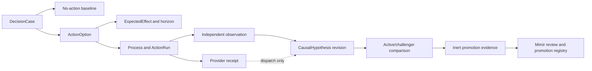

# 운영 가설 루프

운영 가설 루프는 FDAI가 운영 개입 전에 예상한 내용, 이후 독립적으로 발생한 결과, 그리고 그
비교에서 학습할 수 있는 통제된 logic을 기록합니다. 이 문서는 두 번째 계획, 인과, simulation 또는
승격 시스템을 추가하지 않고 S0 integration 경계와 네 병렬 worker의 독점 경로를 동결합니다.

> **권한 경계:** Ontology 선언, simulation, logic asset, model 및 가설 근거는 권한을 유지하거나
> 낮출 수 있습니다. 액션을 승인, 실행 또는 승격할 수 없습니다.
>
> **Object 경계:** 첫 구현은 `DecisionCase`, `ActionOption`, `ExpectedEffect`, `Process`,
> `CausalHypothesis`, `ActionRun` 및 `ObservedOutcome`을 재사용합니다. 동결된 competency test가
> 이러한 object와 link로 필수 query에 답할 수 없어서 실패한 뒤에만 `HypothesisCampaign`
> ObjectType을 추가할 수 있습니다.
>
> **S0 상태:** 집중된 S0 커밋이 worker A-D의 공통 `BASE_COMMIT`입니다. 각 worker는 정확히 그
> 커밋에서 시작하고, 예약된 경로만 수정하며, 집중 커밋과 check 근거를 integration owner에게
> 반환합니다.

## 설계 요약

FDAI는 no-action baseline과 범위가 제한된 `ActionOption` 값을 포함하는 변경할 수 없는
`DecisionCase`로 사전 가설을 표현합니다. 각 option은 `ExpectedEffect`를 인용하고, 통제된
`Process`가 여러 단계의 작업을 기록합니다. 관측 구간이 닫힌 후 독립 근거가 기존
`CausalHypothesis`를 개정할 수 있으며, provider acceptance는 dispatch 근거로만 남습니다.

## 재사용 계약

이 루프는 기존 object의 join이며 새로운 권한 보유 aggregate가 아닙니다.

| 단계 | 기존 계약 | 필수 내용 |
|------|-----------|-----------|
| 사전 액션 case | `DecisionCase` | 근거 cutoff, 보호 objective, constraint, 범위가 제한된 option 및 필수 no-action baseline입니다. |
| 처리 option | `ActionOption` | 기존 `ActionType` 또는 명시적 hold/no-op, assumption, logic 및 simulation receipt, 제외 이유입니다. |
| 예상 효과 | `ExpectedEffect` | metric과 unit, 예측 interval과 direction, 관측 구간, uncertainty, predictor version 및 금지 효과입니다. |
| 여러 단계 journal | `Process` | 고정된 Workflow와 ActionType version, target revision, 현재 단계 및 correlation identity입니다. |
| Dispatch | `ActionRun` 및 provider receipt | Provider에 요청하고 수락 또는 거절된 내용입니다. 효과 종결이 아닙니다. |
| 독립 효과 | `ObservedOutcome` | 관측 구간 이후 authoritative observation, completeness, censoring, recurrence, rollback 및 objective 변화입니다. |
| 사후 액션 주장 | `CausalHypothesis` | Support 및 refutation reference, evidence grade, ambiguity, revision cutoff 및 closure 결과입니다. |

모든 case에는 처리 option과 동일한 구간에서 평가한 no-action option이 포함됩니다. 이것이 없으면
FDAI는 개선을 자연 회복이나 배경 변화와 구분할 수 없습니다. 모든 인과 revision에는 하나 이상의
refutation query 또는 명시적 unavailable 결과도 포함됩니다. 누락된 refutation 근거는 support가
아니라 `unknown`입니다.

## 관측 및 종결

관측 구간은 실행 전에 고정합니다. 예상 시작, 종료, telemetry grace, 적용 가능한 recurrence window
및 정확한 completeness policy를 포함합니다. 이후 액션, topology revision, policy 변경 또는 중요한
외부 이벤트는 episode를 intervened 또는 censored로 표시하며, 예측 결과를 조용히 승계하지 않습니다.

Provider receipt와 독립 outcome은 분리합니다.

- **Provider receipt:** 실행 channel을 통한 제출, 수락, 거절 또는 command 완료를 증명합니다.
  Dispatch는 닫을 수 있지만 관리 objective의 변화를 증명할 수 없습니다.
- **독립 outcome:** Heimdall의 authoritative observation 경로에서 나오고, 고정된 target과 관측
  구간을 사용하며, completeness와 conflict를 보고하고, 예상 효과를 닫습니다.
- **인과 종결:** Forseti는 support 및 refutation 근거를 비교한 후에만 `CausalHypothesis`를
  개정합니다. `confirmed`, `refuted`, `inconclusive` 및 `unsafe`는 서로 구분합니다.

독립 outcome이 없거나 충돌하면 성공한 provider receipt도 `inconclusive`로 남습니다. Provider가
성공을 보고했더라도 예상 방향과 반대인 완전한 독립 observation은 refutation 근거입니다.

## Logic 및 승격 분리

Active logic은 현재 `DecisionCase`를 만들거나 채점하는 데 사용된 정확한 검토 완료 release입니다.
Challenger logic은 동일한 동결 input을 대상으로 shadow에서만 실행되며 실행 가능한 branch의 순위를
지정할 수 없습니다. 두 record 모두 logic artifact, ontology release, input 및 output schema, evidence
cutoff, model 또는 algorithm version 및 deterministic seed policy를 고정합니다.

비교 component는 divergence, error measure, support 및 refutation count, exclusion 및 rollback
reference를 포함하는 범위가 제한된 inert 근거를 만들 수 있습니다. Active key를 대체하거나 promotion
registry에 쓸 수 없습니다. Mimir는 계속 promotion 및 demotion governor이며, 일반적인 reviewed
registry만 activation을 수행할 수 있습니다. Challenger regression은 challenger를 철회할 근거이며
active release를 다시 쓰지 않습니다.

## Agent ownership

고정 pantheon은 현재 single-writer 권한을 유지합니다.

| Agent | 이 루프에서의 책임 |
|-------|--------------------|
| Forseti | 변경할 수 없는 decision과 사후 액션 causal claim을 소유합니다. 실행하거나 승격하지 않습니다. |
| Heimdall | 독립 observation, completeness, support 및 refutation 근거를 제공합니다. |
| Thor | 이미 eligible한 선택된 ActionType만 실행하고 execution receipt를 만듭니다. |
| Saga | Case, receipt, observation, causal revision 및 review reference를 append합니다. |
| Muninn | 판단 없이 범위가 제한된 case 및 graph projection을 materialize합니다. |
| Norns | 균형 잡힌 근거에서 inert challenger candidate를 제안할 수 있습니다. |
| Mimir | Active/challenger 근거를 검토하고 catalog 또는 logic promotion 및 demotion만 통제합니다. |
| Var | 결정된 액션 ceiling에서 필요할 때 독립적인 사람 승인을 기록합니다. |
| Vidar | Rollback 및 recovery 근거를 소유합니다. 성공한 rollback은 처리 성공이 아닙니다. |

협업에는 schema-validated typed event를 사용합니다. 어떤 worker도 direct agent call, shared mutable
workflow state, 새 executor 경로 또는 권한을 보유한 ontology function을 추가할 수 없습니다.

## S0 worker reservation

아래 reservation은 독점적입니다. Worker는 모든 경로를 읽을 수 있지만 예약 경로만 쓸 수 있습니다.
공유 facade, export, composition, catalog index 및 설계 업데이트는 네 handoff 이후 integration
owner에게 돌아갑니다.

| Worker | 산출물 | 독점 쓰기 경로 | 집중 check |
|--------|--------|----------------|------------|
| A - competency | 기존 object와 link로 루프의 필수 graph query를 증명합니다. 동결 test가 표현할 수 없는 query 때문에 실패한 경우에만 `HypothesisCampaign`을 추가합니다. | `services/core-control-plane/tests/rule_catalog/test_operational_hypothesis_loop_competency.py`; 조건부 `rule-catalog/vocabulary/object-types/HypothesisCampaign.yaml` | `uv run pytest -q --no-cov services/core-control-plane/tests/rule_catalog/test_operational_hypothesis_loop_competency.py` |
| B - pre-action | 누락된 no-action baseline, horizon, expected effect 또는 고정된 Process lineage를 거부하는 순수 pre-action projection을 만듭니다. | `services/core-control-plane/src/fdai/core/decision_case/operational_hypothesis.py`; `services/core-control-plane/tests/core/decision_case/test_operational_hypothesis.py` | `uv run pytest -q --no-cov services/core-control-plane/tests/core/decision_case/test_operational_hypothesis.py` |
| C - closure | Provider dispatch와 independent observation을 혼합하지 않고 join한 후 기존 `CausalHypothesis` revision을 위한 support/refutation input을 만듭니다. | `services/core-control-plane/src/fdai/core/rca/operational_hypothesis_closure.py`; `services/core-control-plane/tests/core/rca/test_operational_hypothesis_closure.py` | `uv run pytest -q --no-cov services/core-control-plane/tests/core/rca/test_operational_hypothesis_closure.py` |
| D - challenger | 동결 episode에서 active 및 challenger logic을 비교하고 registry write가 없는 inert promotion evidence를 만듭니다. | `services/core-control-plane/src/fdai/core/assurance_twin/hypothesis_challenger.py`; `services/core-control-plane/tests/assurance_twin/test_hypothesis_challenger.py` | `uv run pytest -q --no-cov services/core-control-plane/tests/assurance_twin/test_hypothesis_challenger.py` |

### 공통 금지 경로

Worker A-D는 병렬 단계에서 다음 경로를 수정하지 않습니다.

- `services/core-control-plane/src/fdai/agents/**` 아래의 기존 파일
- 기존 `__init__.py`, facade, composition, bootstrap, runtime 및 event-bus 파일
- 기존 ontology 선언, schema, catalog index 및 generated artifact
- `docs/**`, `.github/**`, `scripts/lib/design-routes.json` 및 공유 test 파일
- 완료된 secured-query, semantic Function runtime, bitemporal topology, metric semantics,
  reconciliation, Dynamic engine, graph-closure 및 `ops.scale-out` planning surface

Worker A의 조건부 `HypothesisCampaign.yaml` reservation은 competency test가 먼저 누락된 query를
입증하지 않으면 비활성 상태입니다. 시각적 grouping 선호, 편리한 campaign id 또는 cross-episode
dashboard는 이 조건을 충족하지 않습니다. Integration owner는 optional 선언을 수락하기 전에 실패한
test를 검토합니다.

## Integration join

Worker는 소유 파일에서 서로 독립적입니다. 모든 집중 check가 통과한 후 다음 순서로 handoff를
join합니다.

1. **A가 semantic sufficiency를 확립합니다.** 기본 예상 결과는 새 ObjectType이 없는 것입니다.
2. **B가 사전 액션 record를 동결합니다.** 출력은 순수하게 유지되고 기존 contract만 import합니다.
3. **C가 근거를 닫습니다.** B의 구현 module이 아닌 기존 identifier를 사용하므로 숨겨진 call chain을
   만들지 않습니다.
4. **D가 challenger 근거를 평가합니다.** 변경할 수 없는 episode 값을 사용하고 promotion mutation을
   만들지 않습니다.
5. **실패한 integration test가 필요성을 입증한 경우에만 integration owner가 export와 runtime을
   연결합니다.** 모든 wiring은 event-driven 상태를 유지하고 별도의 집중 review를 받습니다.

어떤 worker도 repository-wide validation을 실행하지 않습니다. 각 worker는 commit, 정확한
`BASE_COMMIT`, 변경 경로, 집중 check output 및 residual gap을 반환합니다. Integration owner는
reservation 외부에 쓰거나 다른 lane 변경을 포함한 handoff를 거부합니다.

## Competency 및 수락

집중 test가 다음 질문을 입증하는 경우에만 구현이 충분합니다.

1. 하나의 query로 decision의 no-action baseline, 선택된 option, `ExpectedEffect`, 관측 구간 및
   Process lineage를 복구할 수 있나요?
2. 하나의 query로 provider receipt와 독립적으로 관측된 outcome을 구분할 수 있나요?
3. Support 및 refutation 근거가 병렬 causal object를 만들지 않고 기존 `CausalHypothesis`를 개정할
   수 있나요?
4. Intervened, censored, incomplete 또는 conflicting horizon이 unscorable 상태를 유지할 수 있나요?
5. Active/challenger divergence가 decision을 hold하면서 challenger의 active logic 대체 또는
   promotion state 쓰기를 방지할 수 있나요?
6. 모든 결과에서 ontology, simulation, model 및 logic output이 evidence-only 상태를 유지하나요?

첫 반증 check는 worker A의 competency test입니다. 기존 graph로 여섯 질문을 모두 표현할 수 있다면
`HypothesisCampaign` 추가는 설계 실패입니다. 표현할 수 없는 질문이 있다면, 가장 작은 ontology
확장을 검토하기 전에 실패한 query가 누락된 identity, property 또는 relationship을 식별해야 합니다.

## Non-goal 및 완료된 foundation

이 campaign은 다음 완료 capability를 다시 구현하거나 fork하지 않습니다.

- `SecuredQueryReceiptAuthority`
- `query.network_path_segments` 및 `query.pod_telemetry_path`
- semantic Function runtime
- bitemporal topology 및 metric semantics
- reconciliation event, ledger 및 binder
- Dynamic engine 및 graph closure job
- `ops.scale-out` core planning vertical

Worker는 public contract를 통해 이러한 capability를 evidence source 또는 fixture로 인용할 수 있습니다.
구현을 수정, wrap, rename 또는 duplicate하지 않습니다.

## 관련 문서

| 알아볼 내용 | 문서 |
|-------------|------|
| DecisionCase, ActionOption, ExpectedEffect 및 Process semantic | [FDAI Operating Ontology](../architecture/operating-ontology-ko.md) |
| Versioned logic 및 candidate planning | [Operational Planning](../decisioning/operational-planning-ko.md) |
| 사후 액션 causal claim 및 refutation | [Causal Incident Graph](causal-incident-graph-ko.md) |
| Active/challenger simulation 경계 | [Assurance Twin](../operations/assurance-twin-ko.md) |
| Process journal 및 독립 outcome check | [Process Automation](../decisioning/process-automation-ko.md) |
