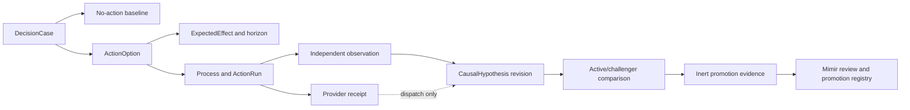

# Operational Hypothesis Loop

The Operational Hypothesis Loop records what FDAI expects before an operational intervention,
what independently happened afterward, and which governed logic may learn from the comparison.
This document records the integrated graph evidence, reconciliation, lineage, and model-promotion
runtime without adding a second planning, causal, simulation, or promotion system.

> **Authority boundary:** Ontology declarations, simulations, logic assets, models, and hypothesis
> evidence can preserve or lower authority. They cannot approve, execute, or promote an action.
>
> **Object boundary:** The first implementation reuses `DecisionCase`, `ActionOption`,
> `ExpectedEffect`, `Process`, `CausalHypothesis`, `ActionRun`, and `ObservedOutcome`. A
> `HypothesisCampaign` ObjectType is eligible only after a frozen competency test fails because
> these objects and links cannot answer a required query.
>
> **J1 state:** Lane A-D outputs are integrated on `main`. J1 owns only composition, runtime
> lifecycle, existing delivery routing, and bilingual code-map updates. No new service, agent, or
> authority-bearing coordinator is introduced.

## Design at a glance

FDAI expresses a pre-action hypothesis as an immutable `DecisionCase` containing the no-action
baseline and bounded `ActionOption` values. Each option cites an `ExpectedEffect`, and a governed
`Process` journals multi-step work. After the observation horizon closes, independent evidence can
revise the existing `CausalHypothesis`; provider acceptance remains dispatch evidence only.

## Reused contract

The loop is a join over existing objects, not a new authority-bearing aggregate.

| Phase | Existing contract | Required content |
|-------|-------------------|------------------|
| Pre-action case | `DecisionCase` | Evidence cutoff, protected objectives, constraints, bounded options, and a mandatory no-action baseline. |
| Treatment option | `ActionOption` | Existing `ActionType` or explicit hold/no-op, assumptions, logic and simulation receipts, and rejected reasons. |
| Predicted effect | `ExpectedEffect` | Metric and unit, predicted interval and direction, observation horizon, uncertainty, predictor version, and prohibited effects. |
| Multi-step journal | `Process` | Pinned Workflow and ActionType versions, target revision, current step, and correlation identity. |
| Dispatch | `ActionRun` and provider receipt | What was requested and accepted or rejected by the provider. This is not effect closure. |
| Independent effect | `ObservedOutcome` | Authoritative observation after the horizon, completeness, censoring, recurrence, rollback, and objective movement. |
| Post-action claim | `CausalHypothesis` | Support and refutation references, evidence grade, ambiguity, revision cutoff, and closure result. |

Every case includes a no-action option evaluated over the same horizon as the treatment options.
Without it, FDAI cannot distinguish improvement from normal recovery or background movement. Every
causal revision also includes at least one refutation query or an explicit unavailable result.
Missing refutation evidence is `unknown`, never support.

## Observation and closure

The observation horizon is fixed before execution. It includes the expected start, end, telemetry
grace, recurrence window when applicable, and the exact completeness policy. A later action,
topology revision, policy change, or material external event marks the episode intervened or
censored; it doesn't silently inherit the predicted result.

Provider receipts and independent outcomes stay separate:

- **Provider receipt:** proves submission, acceptance, rejection, or command completion through the
  execution channel. It can close dispatch but cannot prove the managed objective changed.
- **Independent outcome:** comes from Heimdall's authoritative observation path, uses the pinned
  target and horizon, reports completeness and conflicts, and closes the expected effect.
- **Causal closure:** Forseti revises the `CausalHypothesis` only after support and refutation
  evidence are compared. `confirmed`, `refuted`, `inconclusive`, and `unsafe` remain distinct.

A successful provider receipt with a missing or conflicting independent outcome remains
`inconclusive`. A complete independent observation that contradicts the expected direction is
refutation evidence even when the provider reported success.

## Logic and promotion separation

Active logic is the exact reviewed release used to build or score the current `DecisionCase`.
Challenger logic runs only in shadow against the same frozen inputs and cannot rank an executable
branch. Both records pin the logic artifact, ontology release, input and output schemas, evidence
cutoff, model or algorithm version, and deterministic seed policy.

The comparison component may emit bounded inert evidence containing divergence, error measures,
support and refutation counts, exclusions, and rollback references. It cannot replace the active
key or write a promotion registry. Mimir remains the promotion and demotion governor, and the
ordinary reviewed registry remains the only activation path. A challenger regression is evidence
to withdraw the challenger; it doesn't rewrite the active release.

## Agent ownership

The fixed pantheon keeps its current single-writer authority.

| Agent | Responsibility in this loop |
|-------|-----------------------------|
| Forseti | Owns the immutable decision and post-action causal claim. It never executes or promotes. |
| Heimdall | Supplies independent observations, completeness, support, and refutation evidence. |
| Thor | Executes only an already eligible selected ActionType and emits execution receipts. |
| Saga | Appends case, receipt, observation, causal revision, and review references. |
| Muninn | Materializes bounded case and graph projections without deciding the claim. |
| Norns | May propose an inert challenger candidate from balanced evidence. |
| Mimir | Reviews active/challenger evidence and alone governs catalog or logic promotion and demotion. |
| Var | Records independent human approval when the resolved action ceiling requires it. |
| Vidar | Owns rollback and recovery evidence; a successful rollback is not treatment success. |

Collaboration uses schema-validated typed events. No worker may add direct agent calls, shared
mutable workflow state, a new executor path, or an authority-bearing ontology function.

## Integrated runtime

The integrated runtime reuses existing composition and lifecycle surfaces.

| Lane | Integrated responsibility | Runtime result |
|------|---------------------------|----------------|
| A - graph evidence | Build graph Dynamic requests from pinned operational context, verified topology, inventory, reviewed metric semantics, objectives, constraints, and ActionType impact limits. | A complete prerequisite set binds the production provider. No prerequisites leave it explicitly unavailable; a partial set stops startup. |
| B - reconciliation | Authenticate independent observations, restore exact local artifacts, reconcile expected and observed effects, and commit a proposal-only terminal outbox. | The request subscriber and outbox drainer share supervised cancellation. One drain publishes at most 100 entries, yields, and waits on the stop signal. |
| C - lineage | Append existing `DecisionCase -> ActionOption -> ExpectedEffect -> ActionRun -> ObservedOutcome` records and links without rewriting immutable objects. | The projection remains evidence-only and adds no agent or authority. |
| D - promotion | Seal reviewed graph-model evidence, preserve an immutable rollback target, and atomically change only the active pointer. | `governance.promote-effect-model` enters the existing risk, Owner human approval, Thor direct-API, rollback, and Saga audit path. |

Graph Dynamic retains its 5-second default build budget and 10-second hard ceiling. Independent
topology, inventory, and metric reads run concurrently. Timeout, cancellation, partial evidence,
or an unscorable invariant cannot raise authority. The graph simulation remains a lower-only guard
before T1 reuse enters the safety check.

Effect reconciliation uses `ontology.effect-reconciliation.requests` and
`ontology.effect-reconciliation.outcomes` as compact typed mechanical transport topics. They are
not new Pantheon-owned object topics. The outbox payload always carries `proposal_only: true` and
`grants_authority: false`; a recovery or promotion request re-enters its existing typed pipeline.
Event handling keeps the lane's 5-second default, broker publication keeps its 2-second deadline,
and shutdown bounds child cancellation to 5 seconds instead of awaiting indefinitely.

Learner, closure, projection, and outbox failures do not rewrite an already returned execution
result. They remain visible as unavailable, held, pending, or failed evidence. Promotion fails
closed when its durable store, exact receipt, artifact, active pointer, ontology release, property
semantics, invariant evidence, or rollback target is absent or mismatched.

## Agent and authority join

The integrated lanes preserve the fixed Pantheon roles:

- **Heimdall:** supplies independently authenticated observation evidence and completeness.
- **Forseti:** owns effect judgment and causal closure; it does not execute or promote.
- **Saga:** records reconciliation attempts, terminal outcomes, pointer transitions, and failures.
- **Norns:** stores inert challenger artifacts and cannot activate them.
- **Mimir:** seals reviewed promotion receipts; it does not call the registry mutation directly.
- **Thor, Var, and Vidar:** retain execution, human approval, and rollback ownership through the
  existing ActionType path.

No agent implementation or `PANTHEON_SPECS` subscription changes are required. The runtime
registers only the two reconciliation transport channels needed by the mechanical binder.

## Competency and acceptance

The implementation is sufficient only when focused tests prove these questions:

1. Can one query recover the no-action baseline, selected option, `ExpectedEffect`, observation
   horizon, and Process lineage for a decision?
2. Can one query distinguish a provider receipt from an independently observed outcome?
3. Can support and refutation evidence revise the existing `CausalHypothesis` without creating a
   parallel causal object?
4. Can an intervened, censored, incomplete, or conflicting horizon remain unscorable?
5. Can active/challenger divergence hold a decision while preventing the challenger from replacing
   active logic or writing promotion state?
6. Do ontology, simulation, model, and logic outputs remain evidence-only under every result?

The first disconfirming check is worker A's competency test. If all six questions are expressible
with the existing graph, adding `HypothesisCampaign` is a design failure. If one isn't expressible,
the failing query must identify the missing identity, property, or relationship before the smallest
ontology extension is reviewed.

## Non-goals and completed foundations

This campaign does not reimplement or fork these completed capabilities:

- `SecuredQueryReceiptAuthority`;
- `query.network_path_segments` and `query.pod_telemetry_path`;
- semantic Function runtime;
- bitemporal topology and metric semantics;
- reconciliation events, ledger, and binder;
- Dynamic engines and the graph closure job;
- the `ops.scale-out` core planning vertical.

The workers may cite those capabilities as evidence sources or fixtures through their public
contracts. They don't modify, wrap, rename, or duplicate their implementations.

## Related docs

| To learn about | Read |
|----------------|------|
| DecisionCase, ActionOption, ExpectedEffect, and Process semantics | [FDAI Operating Ontology](../architecture/operating-ontology.md) |
| Versioned logic and candidate planning | [Operational Planning](../decisioning/operational-planning.md) |
| Post-action causal claims and refutation | [Causal Incident Graph](causal-incident-graph.md) |
| Active/challenger simulation boundaries | [Assurance Twin](../operations/assurance-twin.md) |
| Process journals and independent outcome checks | [Process Automation](../decisioning/process-automation.md) |
