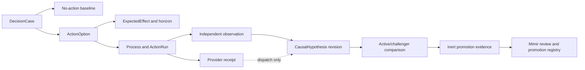

# Operational Hypothesis Loop

The Operational Hypothesis Loop records what FDAI expects before an operational intervention,
what independently happened afterward, and which governed logic may learn from the comparison.
This document freezes the S0 integration boundary and the exclusive paths for four parallel
workers without adding a second planning, causal, simulation, or promotion system.

> **Authority boundary:** Ontology declarations, simulations, logic assets, models, and hypothesis
> evidence can preserve or lower authority. They cannot approve, execute, or promote an action.
>
> **Object boundary:** The first implementation reuses `DecisionCase`, `ActionOption`,
> `ExpectedEffect`, `Process`, `CausalHypothesis`, `ActionRun`, and `ObservedOutcome`. A
> `HypothesisCampaign` ObjectType is eligible only after a frozen competency test fails because
> these objects and links cannot answer a required query.
>
> **S0 state:** The focused S0 commit is the common `BASE_COMMIT` for workers A-D. Each worker
> starts from that exact commit, edits only its reserved paths, and returns a focused commit plus
> check evidence to the integration owner.

## Design at a glance

FDAI expresses a pre-action hypothesis as an immutable `DecisionCase` containing the no-action
baseline and bounded `ActionOption` values. Each option cites an `ExpectedEffect`, and a governed
`Process` journals multi-step work. After the observation horizon closes, independent evidence can
revise the existing `CausalHypothesis`; provider acceptance remains dispatch evidence only.

## Reused contract

The loop is a join over existing objects, not a new authority-bearing aggregate.

| Phase | Existing contract | Required content |
|-------|-------------------|------------------|
| Pre-action case | `DecisionCase` | Evidence cutoff, protected objectives, constraints, bounded options, and a mandatory no-action baseline. |
| Treatment option | `ActionOption` | Existing `ActionType` or explicit hold/no-op, assumptions, logic and simulation receipts, and rejected reasons. |
| Predicted effect | `ExpectedEffect` | Metric and unit, predicted interval and direction, observation horizon, uncertainty, predictor version, and prohibited effects. |
| Multi-step journal | `Process` | Pinned Workflow and ActionType versions, target revision, current step, and correlation identity. |
| Dispatch | `ActionRun` and provider receipt | What was requested and accepted or rejected by the provider. This is not effect closure. |
| Independent effect | `ObservedOutcome` | Authoritative observation after the horizon, completeness, censoring, recurrence, rollback, and objective movement. |
| Post-action claim | `CausalHypothesis` | Support and refutation references, evidence grade, ambiguity, revision cutoff, and closure result. |

Every case includes a no-action option evaluated over the same horizon as the treatment options.
Without it, FDAI cannot distinguish improvement from normal recovery or background movement. Every
causal revision also includes at least one refutation query or an explicit unavailable result.
Missing refutation evidence is `unknown`, never support.

## Observation and closure

The observation horizon is fixed before execution. It includes the expected start, end, telemetry
grace, recurrence window when applicable, and the exact completeness policy. A later action,
topology revision, policy change, or material external event marks the episode intervened or
censored; it doesn't silently inherit the predicted result.

Provider receipts and independent outcomes stay separate:

- **Provider receipt:** proves submission, acceptance, rejection, or command completion through the
  execution channel. It can close dispatch but cannot prove the managed objective changed.
- **Independent outcome:** comes from Heimdall's authoritative observation path, uses the pinned
  target and horizon, reports completeness and conflicts, and closes the expected effect.
- **Causal closure:** Forseti revises the `CausalHypothesis` only after support and refutation
  evidence are compared. `confirmed`, `refuted`, `inconclusive`, and `unsafe` remain distinct.

A successful provider receipt with a missing or conflicting independent outcome remains
`inconclusive`. A complete independent observation that contradicts the expected direction is
refutation evidence even when the provider reported success.

## Logic and promotion separation

Active logic is the exact reviewed release used to build or score the current `DecisionCase`.
Challenger logic runs only in shadow against the same frozen inputs and cannot rank an executable
branch. Both records pin the logic artifact, ontology release, input and output schemas, evidence
cutoff, model or algorithm version, and deterministic seed policy.

The comparison component may emit bounded inert evidence containing divergence, error measures,
support and refutation counts, exclusions, and rollback references. It cannot replace the active
key or write a promotion registry. Mimir remains the promotion and demotion governor, and the
ordinary reviewed registry remains the only activation path. A challenger regression is evidence
to withdraw the challenger; it doesn't rewrite the active release.

## Agent ownership

The fixed pantheon keeps its current single-writer authority.

| Agent | Responsibility in this loop |
|-------|-----------------------------|
| Forseti | Owns the immutable decision and post-action causal claim. It never executes or promotes. |
| Heimdall | Supplies independent observations, completeness, support, and refutation evidence. |
| Thor | Executes only an already eligible selected ActionType and emits execution receipts. |
| Saga | Appends case, receipt, observation, causal revision, and review references. |
| Muninn | Materializes bounded case and graph projections without deciding the claim. |
| Norns | May propose an inert challenger candidate from balanced evidence. |
| Mimir | Reviews active/challenger evidence and alone governs catalog or logic promotion and demotion. |
| Var | Records independent human approval when the resolved action ceiling requires it. |
| Vidar | Owns rollback and recovery evidence; a successful rollback is not treatment success. |

Collaboration uses schema-validated typed events. No worker may add direct agent calls, shared
mutable workflow state, a new executor path, or an authority-bearing ontology function.

## S0 worker reservations

The reservations below are exclusive. A worker can read any path but can write only its reserved
paths. Shared facade, export, composition, catalog index, and design updates return to the
integration owner after all four handoffs.

| Worker | Deliverable | Exclusive write paths | Focused check |
|--------|-------------|-----------------------|---------------|
| A - competency | Prove the loop's required graph queries with existing objects and links. Add `HypothesisCampaign` only when the frozen test fails for an unrepresentable query. | `services/core-control-plane/tests/rule_catalog/test_operational_hypothesis_loop_competency.py`; conditionally `rule-catalog/vocabulary/object-types/HypothesisCampaign.yaml` | `uv run pytest -q --no-cov services/core-control-plane/tests/rule_catalog/test_operational_hypothesis_loop_competency.py` |
| B - pre-action | Build a pure pre-action projection that rejects a missing no-action baseline, horizon, expected effect, or pinned Process lineage. | `services/core-control-plane/src/fdai/core/decision_case/operational_hypothesis.py`; `services/core-control-plane/tests/core/decision_case/test_operational_hypothesis.py` | `uv run pytest -q --no-cov services/core-control-plane/tests/core/decision_case/test_operational_hypothesis.py` |
| C - closure | Join provider dispatch and independent observation without conflating them, then produce support/refutation input for an existing `CausalHypothesis` revision. | `services/core-control-plane/src/fdai/core/rca/operational_hypothesis_closure.py`; `services/core-control-plane/tests/core/rca/test_operational_hypothesis_closure.py` | `uv run pytest -q --no-cov services/core-control-plane/tests/core/rca/test_operational_hypothesis_closure.py` |
| D - challenger | Compare active and challenger logic over frozen episodes and emit inert promotion evidence with no registry write. | `services/core-control-plane/src/fdai/core/assurance_twin/hypothesis_challenger.py`; `services/core-control-plane/tests/assurance_twin/test_hypothesis_challenger.py` | `uv run pytest -q --no-cov services/core-control-plane/tests/assurance_twin/test_hypothesis_challenger.py` |

### Common forbidden paths

Workers A-D do not edit these paths during the parallel phase:

- existing files under `services/core-control-plane/src/fdai/agents/**`;
- existing `__init__.py`, facade, composition, bootstrap, runtime, and event-bus files;
- existing ontology declarations, schemas, catalog indexes, and generated artifacts;
- `docs/**`, `.github/**`, `scripts/lib/design-routes.json`, and shared test files;
- completed secured-query, semantic Function runtime, bitemporal topology, metric semantics,
  reconciliation, Dynamic engine, graph-closure, and `ops.scale-out` planning surfaces.

Worker A's conditional `HypothesisCampaign.yaml` reservation is dormant unless its competency test
first demonstrates a missing query. A visual grouping preference, convenient campaign id, or
cross-episode dashboard does not satisfy that condition. The integration owner reviews the failing
test before accepting the optional declaration.

## Integration joins

Workers are independent at their owned files. Their handoffs join in this order after every focused
check passes:

1. **A establishes semantic sufficiency.** The default expected result is no new ObjectType.
2. **B freezes the pre-action record.** Its output stays pure and imports existing contracts only.
3. **C closes evidence.** It consumes existing identifiers, not B's implementation module, so the
   workers do not create a hidden call chain.
4. **D evaluates challenger evidence.** It consumes immutable episode values and emits no
   promotion mutation.
5. **Integration owner wires exports and runtime only if a failing integration test requires it.**
   Any wiring remains event-driven and receives its own focused review.

No worker runs repository-wide validation. Each returns its commit, exact `BASE_COMMIT`, changed
paths, focused check output, and residual gaps. The integration owner rejects a handoff that writes
outside its reservation or includes another lane's changes.

## Competency and acceptance

The implementation is sufficient only when focused tests prove these questions:

1. Can one query recover the no-action baseline, selected option, `ExpectedEffect`, observation
   horizon, and Process lineage for a decision?
2. Can one query distinguish a provider receipt from an independently observed outcome?
3. Can support and refutation evidence revise the existing `CausalHypothesis` without creating a
   parallel causal object?
4. Can an intervened, censored, incomplete, or conflicting horizon remain unscorable?
5. Can active/challenger divergence hold a decision while preventing the challenger from replacing
   active logic or writing promotion state?
6. Do ontology, simulation, model, and logic outputs remain evidence-only under every result?

The first disconfirming check is worker A's competency test. If all six questions are expressible
with the existing graph, adding `HypothesisCampaign` is a design failure. If one isn't expressible,
the failing query must identify the missing identity, property, or relationship before the smallest
ontology extension is reviewed.

## Non-goals and completed foundations

This campaign does not reimplement or fork these completed capabilities:

- `SecuredQueryReceiptAuthority`;
- `query.network_path_segments` and `query.pod_telemetry_path`;
- semantic Function runtime;
- bitemporal topology and metric semantics;
- reconciliation events, ledger, and binder;
- Dynamic engines and the graph closure job;
- the `ops.scale-out` core planning vertical.

The workers may cite those capabilities as evidence sources or fixtures through their public
contracts. They don't modify, wrap, rename, or duplicate their implementations.

## Related docs

| To learn about | Read |
|----------------|------|
| DecisionCase, ActionOption, ExpectedEffect, and Process semantics | [FDAI Operating Ontology](../architecture/operating-ontology.md) |
| Versioned logic and candidate planning | [Operational Planning](../decisioning/operational-planning.md) |
| Post-action causal claims and refutation | [Causal Incident Graph](causal-incident-graph.md) |
| Active/challenger simulation boundaries | [Assurance Twin](../operations/assurance-twin.md) |
| Process journals and independent outcome checks | [Process Automation](../decisioning/process-automation.md) |
