# 운영 학습 온톨로지

이 설계는 벤치마크 처리와 실제 인시던트 결과를 FDAI가 재사용할 수 있는 운영 지식으로
전환합니다. 벤치마크 전용 지식 경로를 만들지 않고, 불변 증거에는 case history를,
의미 구조에는 온톨로지를, 통제된 재사용에는 기존 rule 및 action catalog를 사용합니다.

> **권한 경계:** 벤치마크 통과는 증거이지 권한이 아닙니다. 활성 rule 생성,
> `ActionType` 승격, 자율성 상향을 직접 수행할 수 없습니다.
>
> **의미 권위:** [FDAI 운영 온톨로지](../architecture/operating-ontology-ko.md)가 공유 service,
> objective, decision, effect model을 소유합니다. 이 문서는 evidence-to-pattern learning을 소유합니다.
>
> **범위:** 벤치마크 이름, 고객 리소스 이름, 원시 로그, 모델 설명은 재사용 식별자가
> 되지 않습니다. 재사용 단위는 redaction되고 content-addressed된 증거가 뒷받침하는
> generic failure mechanism입니다.
>
> **구현 상태(2026-08-01):** O0부터 O7까지 core contract와 runtime injection seam을 구현했습니다.
> 변경 불가능한 operational-case
> input은 allowlist된 audit, action, response-outcome, evaluation receipt fact를 canonical source로
> compile하고, 기존 case-history writer가 `ACTION` 및 `INCIDENT` revision을 seal합니다. Muninn은
> sealed projection을 failure fingerprint별로 묶고, Norns는 기존 consensus 및 rate limit 경로로
> balanced inert candidate를 emit합니다. Operational T1 reuse는 current evidence를 요구하고 causal 및
> Dynamic grade는 authoritative receipt를 요구하며 promotion은 verified immutable O7 receipt를 요구합니다.
> Deployment는 O3 validator와 PR publisher, Forseti-owned causal projection, frozen/live evidence source,
> receipt verifier를 bind해야 합니다. Mimir는 owned rule topic으로 review outcome을 emit하고 Saga는
> owned audit topic에 이를 seal합니다.

## 한눈에 보는 설계

FDAI는 두 계층으로 학습합니다. **Operational case**는 관측, 결정, 시도, 검증, 롤백을
기록한 불변 레코드입니다. **승격된 운영 패턴**은 기존 catalog 관계인
`Rule -> remediates -> ActionType`이며, cohort 분석, replay, shadow 비교, 일반 승격
게이트를 통과한 후에만 수락됩니다.

```mermaid
flowchart LR
    B[Benchmark or live incident] --> S[Saga audit evidence]
    S --> C[Muninn operational case revision]
    C --> F[Deterministic failure fingerprint]
    F --> N[Norns cohort analysis]
    N --> RC[Inert RuleCandidate]
    RC --> M[Mimir replay and shadow gate]
    M --> R[Rule catalog]
    R --> A[ActionType catalog]
    A --> T[T1 similarity reuse with current checks]
    T --> G[Risk, approval, execution, and audit]
```



Evaluation adapter는 증거 소스일 뿐입니다. Production incident와 동일한 canonical case
입력을 방출한 뒤, 해당 case가 candidate에 기여할지는 일반 agent-owned learning path가
결정합니다.

O1 compiler는 각 receipt schema가 선언한 canonical identifier, SHA-256 digest, boolean,
bounded count만 받습니다. Unknown field, 불일치하는 action 또는 outcome fact, raw resource
identity, benchmark name, prompt, secret, free-form payload authority는 거부합니다.

## 지식 단위

### Operational case

Operational case는 `kind: incident` 또는 `kind: action`인 `CaseHistoryRevision`입니다.
첫 구현 wave에서는 새 ontology object가 필요하지 않습니다. Source record에는 다음의
범위 제한 구조화 사실이 들어갑니다.

- **관측:** 정규화된 signal code, resource type, topology role, evidence digest,
  event-time cutoff.
- **진단:** deterministic finding reference, grounded RCA citation, failure mechanism,
  ambiguity 또는 abstention reason.
- **결정:** 선택된 `ActionType`, 거부된 대안, verifier result, risk decision,
  approval reference.
- **실행:** target digest, precondition, dry-run receipt, idempotency key,
  affected resource, terminal receipt.
- **효과:** expected/observed postcondition, SLO recovery, recurrence window, rollback result,
  가능한 경우 external validation.

성공한 처리와 실패한 처리를 모두 보존합니다. 안전한 거부, postcondition 실패, 성공한
rollback은 FDAI가 안전하지 않은 action을 반복하지 않도록 하는 negative evidence입니다.

### Failure fingerprint

Fingerprint는 벤치마크 및 제안된 remedy와 독립적으로 failure class를 식별합니다.
다음 항목만 포함하는 canonical JSON의 SHA-256입니다.

```json
{
  "schema_version": "1.0.0",
  "resource_type": "kubernetes.service",
  "failure_mechanism": "selector_target_mismatch",
  "symptom_codes": ["endpoint_owner_mismatch", "request_route_failure"],
  "topology_roles": ["client", "service", "selected_workload"],
  "ownership_shape": ["service_selects_workload"]
}
```

Hashing 전에 배열을 정렬하고 중복을 제거합니다. Resource id, namespace name, benchmark id,
timestamp, free-form explanation, action name은 제외합니다. 따라서 동일한 mechanism과 graph
shape를 가진 두 환경은 어느 환경도 노출하지 않고 하나의 cohort에 합류할 수 있습니다.

### Rule candidate

Norns는 cohort를 기존 `RuleCandidate` object로 컴파일합니다. Candidate evidence에는 다음이
포함됩니다.

- case id, revision, manifest digest;
- failure fingerprint와 지원 resource type;
- success, no-op, refusal, rollback, recurrence count;
- 제안된 signal predicate와 causal graph requirement;
- 제안된 기존 또는 신규 `ActionType` reference;
- confidence bound, 알려진 exclusion, 해결되지 않은 conflict.

성공한 벤치마크 case 하나만으로는 승격 가능한 candidate를 만들 수 없습니다. 초기 게이트는
최소 하나의 성공 처리, 하나의 negative 또는 control case, deterministic replay, policy escape
0건을 요구합니다. Action 승격에는 여전히 `ActionType`이 선언한 더 엄격한 sample 및 observation
요건이 적용됩니다.

### 승격된 운영 패턴

승격된 패턴은 기존 catalog object와 link를 사용합니다.

- `Rule -> triggered_by -> SignalType`은 관련 관측을 선택합니다.
- `Rule -> applies_to -> ResourceType`은 호환 target을 제한합니다.
- `Rule -> remediates -> ActionType`은 통제된 response를 지정합니다.
- `ActionType`은 precondition, stop condition, blast radius, rollback, tier ceiling,
  shadow promotion gate를 제공합니다.

별도 benchmark rule 형식이나 learned-action executor를 도입하지 않습니다. 구현이 이 link로
필요한 query를 표현할 수 없다면 먼저 실패하는 ontology query test를 추가해야 합니다.
그때에만 범위가 명확한 `ObjectType` 또는 `LinkType` 확장을 제안할 수 있습니다.

## Agent 소유권

| Agent | 책임 |
|-------|------|
| Huginn | Benchmark와 production observation을 동일한 event vocabulary로 정규화합니다. |
| Heimdall | 범위 제한 evidence를 수집하고 expected-versus-observed effect를 닫습니다. |
| Saga | Decision, attempt, postcondition, rollback evidence를 append합니다. |
| Muninn | Access-scoped operational case revision을 seal하고 metadata를 index합니다. |
| Norns | Balanced cohort를 구성하고 inert `RuleCandidate` object를 방출합니다. |
| Mimir | Candidate를 replay하고 active/challenger behavior를 shadow에서 비교하며 promotion 또는 demotion을 통제합니다. |
| Forseti | 일반 quality/policy gate를 통해 현재 case와 candidate response를 판정합니다. |
| Var | Resolved ceiling이 요구할 때 독립적인 사람 승인을 기록합니다. |
| Thor | 현재 실행 자격이 있는 promoted action만 실행합니다. |
| Vidar | 선언된 rollback을 적용하고 관측된 결과를 발행합니다. |

모든 협업은 typed event-bus topic을 사용합니다. Case materialization과 learning은 hot path
밖에 있습니다. Learner 지연이 detection, mitigation, rollback, 무관한 incident를 차단할 수
없습니다.

## 벤치마크 입력

Evaluation result는 다음을 모두 제공할 때만 case-history 입력 자격을 얻습니다.

1. 안정적인 scenario 및 attempt identity digest;
2. 결정 전에 수집된 범위 제한 agent-visible evidence;
3. Grounded diagnosis와 인용한 rule 또는 evidence reference;
4. Proposed action과 verifier/risk/approval decision;
5. Dry-run 또는 명시적인 no-mutation receipt;
6. Observed postcondition과 external validation;
7. Mutation 또는 convergence가 실패한 경우 rollback evidence.

Adapter는 이 필드를 일반 case source record로 매핑합니다. Hidden oracle text, judge expected
answer, benchmark implementation detail, raw credential은 거부됩니다. Benchmark score는 external
validation으로 저장되며 root-cause label이나 promotion decision이 되지 않습니다.

## 운영 대상 흡수

Benchmark pass와 FDAI capability는 별도 상태입니다. FDAI는 다음 상태를 명시적으로 기록합니다.

- **`benchmark_passed`:** External diagnosis 및 mitigation check가 하나의 attempt를 수락했습니다.
- **`operationalized`:** 일반 FDAI agent가 benchmark package import나 evaluation session 없이
   evidence를 수집하고 통제된 action을 제안하거나 실행할 수 있습니다.
- **`azure_validated`:** 동일한 운영 경로가 적용 Azure resource를 대상으로 non-production
   drill을 통과했으며 provider identity, postcondition, rollback, audit receipt를 포함합니다.

통과한 treatment는 evidence로 case history에 들어갈 수 있지만 operationalize되기 전에는
재사용 treatment, candidate success, FDAI capability로 계산되지 않습니다. Azure가 구현
provider이므로 완료에는 `azure_validated`도 필요합니다. 각 operational case는 target profile,
canonical resource type, evidence capability id, action type id, 담당 agent, operational provider
reference, proof reference, 지원되지 않는 surface를 기록합니다.

| 대상 profile | 필요한 운영 증명 |
|--------------|------------------|
| Kubernetes | 일반 Heimdall 및 ControlLoop 경로가 동일한 범위 제한 Kubernetes API evidence와 통제된 action adapter를 사용합니다. Non-production AKS drill에서 전체 diagnosis, approval, dry-run, mutation, postcondition, rollback, audit, restart-replay 경로를 증명합니다. |
| AKS-integrated Kubernetes | 위 Kubernetes 증명에 node pool, scale set, networking, identity, load balancing, storage, control-plane health와 관련된 Azure management-plane evidence를 결합합니다. 적용 가능한 경우 Azure Resource Graph는 topology, Activity Log는 change evidence, Azure Monitor 또는 managed Prometheus는 telemetry를 제공합니다. |
| Azure resource | Failure fingerprint가 canonical `ResourceType`을 사용하고, 주입된 `Inventory` provider가 topology를 제공하며, Azure Monitor, Activity Log, policy, cost 또는 service-health adapter가 현재 evidence를 제공합니다. 통제된 Azure action provider가 dry-run, execution, postcondition, rollback receipt를 제공합니다. |

사용할 수 없는 Azure adapter는 지원되지 않는 surface로 기록합니다. 암묵적인 성공이나 live
evidence로 표시되는 synthetic fixture가 될 수 없고 benchmark-only logic을 추가할 이유도 될 수
없습니다. Portable Kubernetes behavior는 core에서 cloud-provider-neutral로 유지하고 AKS 및
기타 Azure binding은 delivery와 composition에 둡니다.

## Runtime 재사용

T1은 similarity ranking 전에 deterministic filter로 이전 case를 검색합니다.

1. Resource type, failure mechanism, required topology role을 일치시킵니다.
2. Stale evidence, censored outcome, unresolved rollback, policy escape를 제외합니다.
3. 남은 case card를 symptom 및 graph similarity로 정렬합니다.
4. 과거 raw parameter가 아니라 candidate `ActionType` reference를 복원합니다.
5. 현재 evidence를 다시 수집하고 모든 precondition, target identity, blast radius,
   policy decision을 재평가합니다.
6. 현재 graph가 다르거나 evidence가 부족하면 사람 검토로 보류합니다.

과거 성공은 검색 relevance만 높입니다. Verifier, risk gate, 사람 승인, dry-run, resource lock,
idempotency, postcondition, rollback, audit를 우회하지 않습니다.

## 제공 계획

| Wave | 변경 | 종료 기준 |
|------|------|-----------|
| O0 - Contract fixture | 구현됨: canonical operational-case 및 failure-fingerprint model과 fixture입니다. | 이름이 다른 두 환경이 같은 fingerprint를 만들고 mechanism 또는 topology 변경은 다른 fingerprint를 만듭니다. |
| O1 - Case projection | 구현됨: immutable input, allowlist receipt compilation, projection, artifact-first writer intake, generic metadata persistence, revision backfill입니다. | Canonical digest, redaction, byte ceiling, duplicate delivery, negative-outcome, StateStore, PostgreSQL, legacy forecast compatibility test가 통과합니다. Adapter는 rule/action catalog를 쓰지 않습니다. |
| O2 - Cohort compiler | 구현됨: Huginn이 strict operational-case event를 전달하고 Muninn이 bounded fingerprint cohort를 seal 및 저장하며 Norns가 consensus와 rate limit을 거쳐 기존 inert `RuleCandidate` mapping을 emit합니다. | 이름이 다른 같은 fingerprint case는 합류하고 다른 mechanism은 합류하지 않습니다. Success-only 및 raw `ResponseOutcome` evidence는 보류되며 balanced evidence는 immutable revision 인용과 함께 한 번만 emit됩니다. |
| O3 - Catalog compilation | Core 구현됨: Mimir는 승인된 candidate를 draft Rule, 선택적인 explicit shadow-first `ActionType`, schema, policy, replay, shadow receipt가 포함된 immutable review package로 컴파일할 수 있습니다. Production validator와 PR publisher는 deployment 작업으로 남고 Norns는 stable wire identity를 제공합니다. | 실패하거나 충돌하는 receipt는 candidate를 quarantine합니다. Concurrent retry는 한 번만 publish하고 unresolved capacity는 eviction 없이 backpressure하며 successful publication은 Saga-owned audit 후 in-memory package state를 compact합니다. Operational candidate는 direct runtime promotion을 사용할 수 없습니다. |
| O4 - T1 reuse | Core 및 persistence 구현됨: T1은 immutable operational-case context를 저장하고 injected current-evidence verifier를 받아 failure fingerprint, resource type, topology role, graph, owner, precondition, identity, blast radius, policy, dry-run, idempotency, rollback state를 다시 확인합니다. Signature는 canonical parameter와 full case context를 bind합니다. Concrete Kubernetes 및 Azure collector는 O5/O6 binding입니다. | Verifier 또는 evidence 누락, stale 또는 변경된 context, safety check 실패는 mutation 없이 항상 검토 보류됩니다. Azure는 evaluation clock 기준 bounded cache age를 평가하면서 event ingestion 직전 recent cache를 허용합니다. Legacy incident pattern은 기존 동작을 유지합니다. |
| O5 - AKS delivery | 구현 및 non-production live 검증 완료: 기존 Kubernetes 및 Azure read seam이 current reuse, temporal causality, Dynamic request에 evidence를 제공합니다. One-pod invalid-image fault는 server dry-run, isolated namespace, 45초 observation window를 사용했습니다. | Kubernetes는 `ErrImagePull` 및 `ImagePullBackOff`를 보고했고 Azure Monitor는 pod `Pending`, Log Analytics는 pull failure와 terminating evidence, Activity Log는 cluster lifecycle을 보존했습니다. Namespace 삭제로 rollback을 완료하고 one-node cluster는 `Stopped` / `Succeeded`로 돌아갔습니다. Production은 unavailable로 유지했습니다. |
| O6 - Azure resource absorption | 구현됨: strict promoted-inventory snapshot과 configured Azure metric이 Kubernetes 및 non-Kubernetes resource type에 generic current-reuse, causal, Dynamic evidence binding을 제공합니다. | Read-only non-production Container App drill에서 healthy active revision 1개, replica 1개, restart 0회, administrative write 없이 동일한 pre/post state를 관측했습니다. Unit evidence는 benchmark import 없이 policy/precondition/dry-run fail-closed, ontology projection, bounded query, deterministic restart replay를 증명합니다. |
| O7 - Promotion measurement | Core 구현됨: immutable FDAI revision, ActionType digest, scenario case, authoritative measurement unit 및 latest correction이 frozen benchmark와 live-shadow cohort를 결합합니다. Correction은 cohort, case, observation time, causal lineage를 바꿀 수 없습니다. Audited idempotent runner는 separate Wilson 95% cohort bound, distinct live day, executed-action rollback과 complete recurrence window, zero escape, verified causal receipt, Dynamic review rate를 측정합니다. Deployment는 evidence source와 receipt/unit verifier를 bind합니다. | Raw scalar metric은 promote할 수 없습니다. Failed evaluation audit은 이후 successful receipt를 막지 않고 repeated receipt는 original promotion time을 보존하며 persisted enforcement는 restart 후 다시 verify됩니다. 모든 action별 gate가 통과해야 별도 review가 가능하며 현재 drill은 필요한 action-specific day와 confidence sample size가 없어 hold 상태입니다. |

O0부터 O4까지는 cloud-provider-neutral입니다. O5와 O6는 learned pattern이나 control-loop
authority model을 바꾸지 않고 Azure evidence binding을 제공합니다.

## 초기 구현 범위

O0부터 O2 code batch는 다음 foundation을 구현했습니다.

1. `OperationalCaseProjection`과 `FailureFingerprint`는
   `src/fdai/core/case_history/` 아래의 pure immutable model입니다.
2. Canonical identifier, 정렬 및 중복 제거된 graph descriptor, schema version만 fingerprint
   input을 구성합니다.
3. Sealed case revision identity와 evidence reference가 immutable learning projection을
   구성합니다.
4. Test는 environment-name 및 input-order independence와 mechanism/topology sensitivity를
   검증합니다.
5. Strict receipt schema는 bounded standard fact를 immutable `CaseSourceRecord`로 compile합니다.
6. `CaseHistoryMaterializer`는 duplicate-delivery idempotency, append-only source continuity,
   retention, legal hold, negative outcome 보존과 함께 action 및 incident case를 seal합니다.
7. Huginn은 bounded strict input을 `case_history.operational_case.v1`으로 전달할 수 있고 Muninn은
   unknown field 또는 invalid producer를 fail-closed로 보류합니다.
8. Huginn과 Muninn은 failure fingerprint를 event 및 context correlation partition으로 사용합니다.
   Muninn은 fingerprint별 immutable case를 최대 100개 저장하고 case identity, revision, manifest
   digest, classification, digest evidence를 `object.context-index`로 publish합니다.
9. Norns는 하나의 fingerprint와 ActionType, verified success, negative/control evidence를 요구하고
   pattern digest로 deduplicate하며 consensus와 proposal rate limit을 거친 inert mapping만 emit합니다.
   Raw `ResponseOutcome` telemetry는 candidate를 만들 수 없습니다.

## 검증 매트릭스

| 항목 | 필요한 증명 |
|------|-------------|
| 일반화 | Synthetic 환경 간 동일 mechanism 및 graph shape가 하나의 fingerprint를 만듭니다. |
| 비노출 | Customer id, benchmark id, raw log, prompt, expected answer가 fingerprint 또는 case metadata에 들어갈 수 없습니다. |
| 완전성 | 모든 mutation attempt가 precondition, dry-run, terminal receipt, postcondition, rollback state를 기록합니다. |
| Negative learning | Failed, refused, rolled-back, recurrence case가 candidate eligibility를 낮추거나 차단합니다. |
| Agent 소유권 | Muninn만 case를 seal하고 Norns가 candidate를 제안하며 Mimir가 catalog growth를 통제하고 Thor가 실행합니다. |
| 결정성 | Input order는 canonical byte 또는 fingerprint를 바꾸지 않고 evidence mutation은 변경합니다. |
| 안전성 | Historical reuse는 현재 verifier, policy, risk, approval, lock, idempotency, rollback check를 우회할 수 없습니다. |
| Benchmark parity | Evaluation adapter는 standard case input을 방출하며 candidate compiler나 learned executor를 포함하지 않습니다. |
| Deployment parity | Local drill과 AKS가 동일한 projection, fingerprint, candidate, action contract를 사용합니다. |
| AKS parity | 모든 Kubernetes treatment가 non-production AKS에서 같은 end-to-end 경로를 통과하며 integrated fault는 Kubernetes API와 Azure management-plane evidence를 모두 포함합니다. |
| Azure absorption | 모든 non-Kubernetes treatment가 canonical resource type, Azure evidence provider, 담당 agent, 통제된 action provider 또는 명시적인 no-mutation outcome, non-production proof를 지정합니다. |
| Coverage honesty | 누락 provider coverage는 명시적인 unsupported surface로 남고 `operationalized` 또는 `azure_validated`를 충족할 수 없습니다. |

## 관련 문서

| 알아볼 내용 | 읽을 문서 |
|-------------|-----------|
| 공유 service, objective, decision, effect 의미 | [FDAI 운영 온톨로지](../architecture/operating-ontology-ko.md) |
| Immutable case revision과 governed analysis | [Prediction learning and case history](prediction-learning-and-case-history-ko.md) |
| Action safety 및 promotion field | [Action ontology](../decisioning/action-ontology-ko.md) |
| External harness authority boundary | [Benchmark adapters](../interfaces/benchmark-adapters-ko.md) |
| Rule candidate 및 promotion governance | [Rule governance](rule-governance-ko.md) |
| Reviewed trajectory intake | [Governed trajectory datasets](../interfaces/governed-trajectory-datasets-ko.md) |
