# 운영 학습 온톨로지

이 설계는 벤치마크 처리와 실제 인시던트 결과를 FDAI가 재사용할 수 있는 운영 지식으로
전환합니다. 벤치마크 전용 지식 경로를 만들지 않고, 불변 증거에는 사례 이력을,
의미 구조에는 온톨로지를, 통제된 재사용에는 기존 룰 및 액션 카탈로그를 사용합니다.

> **권한 경계:** 벤치마크 통과는 증거이지 권한이 아닙니다. 활성 룰 생성,
> `ActionType` 승격, 자율성 상향을 직접 수행할 수 없습니다.
>
> **의미 권위:** [FDAI 운영 온톨로지](../architecture/operating-ontology-ko.md)가 공유 서비스,
> 목표, 결정, 효과 모델을 소유합니다. 이 문서는 evidence-to-pattern learning을 소유합니다.
>
> **범위:** 벤치마크 이름, 고객 리소스 이름, 원시 로그, 모델 설명은 재사용 식별자가
> 되지 않습니다. 재사용 단위는 민감정보 제거되고 내용 기반 주소를 가진된 증거가 뒷받침하는
> 범용 실패 방식입니다.
>
> **구현 상태(2026-08-01):** O0부터 O7까지 코어 계약과 런타임 주입 경계를 구현했습니다.
> 변경 불가능한 operational-case
> 입력은 허용 목록된 감사, 액션, response-outcome, evaluation 증적 사실을 정본 출처로
> compile하고, 기존 case-history 쓰기 담당이 `ACTION` 및 `INCIDENT` 개정 번호를 봉인합니다. Muninn은
> sealed 변환 결과를 실패 지문별로 묶고, Norns는 기존 합의 및 비율 한도 경로로
> balanced inert 후보를 발행합니다. Operational T1 reuse는 현재 근거를 요구하고 causal 및
> Dynamic grade는 권위 있는 증적을 요구하며 승격은 검증된 변경할 수 없는 O7 증적을 요구합니다.
> 배포는 O3 검증기와 PR 발행기, Forseti-owned causal 변환 결과, 고정된/실제 운영 근거 출처,
> 증적 검증기를 연결해야 합니다. Mimir는 owned 룰 토픽으로 검토 결과를 발행하고 Saga는
> owned 감사 토픽에 이를 봉인합니다.
> 재현된 의미 수집 실패는 Huginn을 통해 들어와 Heimdall-owned 독립적인 검증
> 근거가 되고 Saga가 감사하며 Muninn이 context-index 토픽으로 materialize합니다. Norns는 shadow
> 감사가 포함된 challenger-only StateStore 기록으로 저장한 뒤 일반 합의 및 Mimir 후보
> 가드를 재사용합니다. Raw 조회 텍스트와 online 순위 변경은 계속 제외됩니다.

## 한눈에 보는 설계

FDAI는 두 계층으로 학습합니다. **Operational 사례**는 관측, 결정, 시도, 검증, 롤백을
기록한 불변 레코드입니다. **승격된 운영 패턴**은 기존 카탈로그 관계인
`Rule -> remediates -> ActionType`이며, 집단 분석, 재생, shadow 비교, 일반 승격
게이트를 통과한 후에만 수락됩니다.

```mermaid
flowchart LR
    B[Benchmark or live incident] --> S[Saga audit evidence]
    S --> C[Muninn operational case revision]
    C --> F[Deterministic failure fingerprint]
    F --> N[Norns cohort analysis]
    N --> RC[Inert RuleCandidate]
    RC --> M[Mimir replay and shadow gate]
    M --> R[Rule catalog]
    R --> A[ActionType catalog]
    A --> T[T1 similarity reuse with current checks]
    T --> G[Risk, approval, execution, and audit]
```



Evaluation 어댑터는 증거 소스일 뿐입니다. 운영 인시던트와 동일한 정본 사례
입력을 방출한 뒤, 해당 사례가 후보에 기여할지는 일반 agent-owned learning 경로가
결정합니다.

O1 컴파일러는 각 증적 스키마가 선언한 정본 식별자, SHA-256 다이제스트, boolean,
범위가 제한된 개수만 받습니다. 알 수 없음 필드, 불일치하는 액션 또는 결과 사실, raw 리소스
신원, 벤치마크 이름, 프롬프트, 시크릿, free-form 페이로드 권한은 거부합니다.

## 지식 단위

### Operational 사례

Operational 사례는 `kind: incident` 또는 `kind: action`인 `CaseHistoryRevision`입니다.
첫 구현 wave에서는 새 온톨로지 객체가 필요하지 않습니다. 출처 기록에는 다음의
범위 제한 구조화 사실이 들어갑니다.

- **관측:** 정규화된 신호 코드, 리소스 타입, 토폴로지 역할, 근거 다이제스트,
  event-time 기준 시점.
- **진단:** 결정론적 발견 사항 참조, 근거에 기반한 RCA 인용, 실패 방식,
  모호함 또는 abstention 사유.
- **결정:** 선택된 `ActionType`, 거부된 대안, 검증기 결과, risk 결정,
  승인 참조.
- **실행:** 대상 다이제스트, precondition, 예행 실행 증적, 멱등성 키,
  affected 리소스, 최종 증적.
- **효과:** 예상/관찰된 postcondition, SLO 복구, recurrence 구간, 롤백 결과,
  가능한 경우 외부 검증.

성공한 처리와 실패한 처리를 모두 보존합니다. 안전한 거부, postcondition 실패, 성공한
롤백은 FDAI가 안전하지 않은 액션을 반복하지 않도록 하는 부정 근거입니다.
성공은 응답 증적이 검증된 적용과 `rollback_succeeded: false`를 명시적으로
기록할 때만 reusable로 계산합니다. Rollback 상태 누락은 insufficient 근거로 유지합니다.

### 실패 지문

지문은 벤치마크 및 제안된 remedy와 독립적으로 실패 등급을 식별합니다.
다음 항목만 포함하는 정본 JSON의 SHA-256입니다.

```json
{
  "schema_version": "1.0.0",
  "resource_type": "kubernetes.service",
  "failure_mechanism": "selector_target_mismatch",
  "symptom_codes": ["endpoint_owner_mismatch", "request_route_failure"],
  "topology_roles": ["client", "service", "selected_workload"],
  "ownership_shape": ["service_selects_workload"]
}
```

Hashing 전에 배열을 정렬하고 중복을 제거합니다. Resource id, 이름 공간 이름, 벤치마크 id,
시각, free-form explanation, 액션 이름은 제외합니다. 따라서 동일한 방식과 그래프
형태를 가진 두 환경은 어느 환경도 노출하지 않고 하나의 집단에 합류할 수 있습니다.

### Rule 후보

Norns는 집단을 기존 `RuleCandidate` 객체로 컴파일합니다. 후보 근거에는 다음이
포함됩니다.

- 사례 id, 개정 번호, 매니페스트 다이제스트;
- 실패 지문과 지원 리소스 타입;
- 성공, no-op, 거절, 롤백, recurrence 개수;
- 제안된 신호 조건식과 causal 그래프 요구사항;
- 제안된 기존 또는 신규 `ActionType` 참조;
- 최대 100개 변경할 수 없는 사례, 사례당 64개 다이제스트 참조, 집계 256개 다이제스트 참조;
- 확신도 한계, 알려진 exclusion, 해결되지 않은 충돌.

타입이 지정된 learning 핸들러는 Norns 인스턴스별로 serialize됩니다. Pending 제안 큐는 5,000개로
범위가 제한된되며 포화 시 먼저 배출을 재시도하고, 여전히 가득 차면 새 신호의 learner 상태를
바꾸지 않은 채 전송 계층을 backpressure합니다. 런타임 조립은 생성자 경계를 통해
결정론적 `OperatingPatternCompiler`를 교체할 수 있습니다.

성공한 벤치마크 사례 하나만으로는 승격 가능한 후보를 만들 수 없습니다. 초기 게이트는
최소 하나의 성공 처리, 하나의 부정 또는 컨트롤 사례, 결정론적 재생, 정책 escape
0건을 요구합니다. 액션 승격에는 여전히 `ActionType`이 선언한 더 엄격한 샘플 및 관측
요건이 적용됩니다.

### 승격된 운영 패턴

승격된 패턴은 기존 카탈로그 객체와 링크를 사용합니다.

- `Rule -> triggered_by -> SignalType`은 관련 관측을 선택합니다.
- `Rule -> applies_to -> ResourceType`은 호환 대상을 제한합니다.
- `Rule -> remediates -> ActionType`은 통제된 응답을 지정합니다.
- `ActionType`은 precondition, stop 조건, 영향 범위, 롤백, 계층 상한,
  shadow 승격 게이트를 제공합니다.

별도 벤치마크 룰 형식이나 learned-action 실행기를 도입하지 않습니다. 구현이 이 링크로
필요한 조회를 표현할 수 없다면 먼저 실패하는 온톨로지 조회 테스트를 추가해야 합니다.
그때에만 범위가 명확한 `ObjectType` 또는 `LinkType` 확장을 제안할 수 있습니다.

## 에이전트 소유권

| 에이전트 | 책임 |
|-------|------|
| Huginn | 벤치마크와 운영 관측을 동일한 이벤트 vocabulary로 정규화합니다. |
| Heimdall | 범위 제한 근거를 수집하고 expected-versus-observed 효과를 닫습니다. |
| Saga | 결정, 시도, postcondition, 롤백 근거를 덧붙이기합니다. |
| Muninn | Access-scoped operational 사례 개정 번호를 봉인하고 메타데이터를 인덱싱합니다. |
| Norns | Balanced 집단을 구성하고 inert `RuleCandidate` 객체를 방출합니다. |
| Mimir | 후보를 재생하고 활성/challenger 행동을 shadow에서 비교하며 승격 또는 demotion을 통제합니다. |
| Forseti | 일반 quality/정책 게이트를 통해 현재 사례와 후보 응답을 판정합니다. |
| Var | Resolved 상한이 요구할 때 독립적인 사람 승인을 기록합니다. |
| Thor | 현재 실행 자격이 있는 promoted 액션만 실행합니다. |
| Vidar | 선언된 롤백을 적용하고 관측된 결과를 발행합니다. |

모든 협업은 타입이 지정된 event-bus 토픽을 사용합니다. 사례 구체화와 learning은 hot 경로
밖에 있습니다. Learner 지연이 detection, 완화, 롤백, 무관한 인시던트를 차단할 수
없습니다.

## 벤치마크 입력

Evaluation 결과는 다음을 모두 제공할 때만 case-history 입력 자격을 얻습니다.

1. 안정적인 시나리오 및 시도 신원 다이제스트;
2. 결정 전에 수집된 범위 제한 agent-visible 근거;
3. 근거에 기반한 diagnosis와 인용한 룰 또는 근거 참조;
4. Proposed 액션과 검증기/risk/승인 결정;
5. 예행 실행 또는 명시적인 no-mutation 증적;
6. 관찰된 postcondition과 외부 검증;
7. 변경 또는 convergence가 실패한 경우 롤백 근거.

어댑터는 이 필드를 일반 사례 출처 기록으로 매핑합니다. Hidden oracle 텍스트, 판정자 예상
답변, 벤치마크 구현 상세, raw 자격 증명은 거부됩니다. 벤치마크 점수는 외부
검증으로 저장되며 root-cause 라벨이나 승격 결정이 되지 않습니다.

## 운영 대상 흡수

벤치마크 통과와 FDAI 기능은 별도 상태입니다. FDAI는 다음 상태를 명시적으로 기록합니다.

- **`benchmark_passed`:** 외부 diagnosis 및 완화 검사가 하나의 시도를 수락했습니다.
- **`operationalized`:** 일반 FDAI 에이전트가 벤치마크 패키지 가져오기나 evaluation 세션 없이
   근거를 수집하고 통제된 액션을 제안하거나 실행할 수 있습니다.
- **`azure_validated`:** 동일한 운영 경로가 적용 Azure 리소스를 대상으로 non-production
   훈련을 통과했으며 프로바이더 신원, postcondition, 롤백, 감사 증적을 포함합니다.

통과한 처리는 근거로 사례 이력에 들어갈 수 있지만 operationalize되기 전에는
재사용 처리, 후보 성공, FDAI 기능으로 계산되지 않습니다. Azure가 구현
프로바이더이므로 완료에는 `azure_validated`도 필요합니다. 각 operational 사례는 대상 프로파일,
정본 리소스 타입, 근거 기능 id, 액션 타입 id, 담당 에이전트, operational 프로바이더
참조, 증명 참조, 지원되지 않는 표면을 기록합니다.

| 대상 프로파일 | 필요한 운영 증명 |
|--------------|------------------|
| Kubernetes | 일반 Heimdall 및 ControlLoop 경로가 동일한 범위 제한 Kubernetes API 근거와 통제된 액션 어댑터를 사용합니다. Non-production AKS 훈련에서 전체 diagnosis, 승인, 예행 실행, 변경, postcondition, 롤백, 감사, restart-replay 경로를 증명합니다. |
| AKS-integrated Kubernetes | 위 Kubernetes 증명에 노드 풀, 규모 집합, networking, 신원, 부하 balancing, 저장소, control-plane 상태와 관련된 Azure management-plane 근거를 결합합니다. 적용 가능한 경우 Azure Resource Graph는 토폴로지, Activity Log는 변경 근거, Azure Monitor 또는 managed Prometheus는 텔레메트리를 제공합니다. |
| Azure 리소스 | 실패 지문이 정본 `ResourceType`을 사용하고, 주입된 `Inventory` 프로바이더가 토폴로지를 제공하며, Azure Monitor, Activity Log, 정책, 비용 또는 service-health 어댑터가 현재 근거를 제공합니다. 통제된 Azure 액션 프로바이더가 예행 실행, 실행, postcondition, 롤백 증적을 제공합니다. |

사용할 수 없는 Azure 어댑터는 지원되지 않는 표면으로 기록합니다. 암묵적인 성공이나 실제 운영
근거로 표시되는 synthetic 고정본이 될 수 없고 benchmark-only logic을 추가할 이유도 될 수
없습니다. Portable Kubernetes 행동은 코어에서 cloud-provider-neutral로 유지하고 AKS 및
기타 Azure 연결은 전달과 조립에 둡니다.

## 런타임 재사용

T1은 유사도 순위 전에 결정론적 필터로 이전 사례를 검색합니다.

1. Resource 타입, 실패 방식, 필수 토폴로지 역할을 일치시킵니다.
2. Stale 근거, censored 결과, 해결되지 않은 롤백, 정책 escape를 제외합니다.
3. 남은 사례 카드를 symptom 및 그래프 유사도로 정렬합니다.
4. 과거 raw 매개변수가 아니라 후보 `ActionType` 참조를 복원합니다.
5. 현재 근거를 다시 수집하고 모든 precondition, 대상 신원, 영향 범위,
   정책 결정을 재평가합니다.
6. 현재 그래프가 다르거나 근거가 부족하면 사람 검토로 보류합니다.

과거 성공은 검색 관련성만 높입니다. 검증기, risk 게이트, 사람 승인, 예행 실행, 리소스 잠금,
멱등성, postcondition, 롤백, 감사를 우회하지 않습니다.

## 제공 계획

| Wave | 변경 | 종료 기준 |
|------|------|-----------|
| O0 - 계약 고정본 | 구현됨: 정본 operational-case 및 failure-fingerprint 모델과 고정본입니다. | 이름이 다른 두 환경이 같은 지문을 만들고 방식 또는 토폴로지 변경은 다른 지문을 만듭니다. |
| O1 - 사례 변환 결과 | 구현됨: 변경할 수 없는 입력, 허용 목록 증적 compilation, 변환 결과, artifact-first 쓰기 담당 intake, 범용 메타데이터 영속성, 개정 번호 backfill입니다. | 정본 다이제스트, 민감정보 제거, 바이트 상한, 중복 전달, negative-outcome, StateStore, PostgreSQL, 이전 방식 예측 호환성 테스트가 통과합니다. 어댑터는 룰/액션 카탈로그를 쓰지 않습니다. |
| O2 - 집단 컴파일러 | 구현됨: Huginn이 strict operational-case 이벤트를 전달하고 Muninn이 범위가 제한된 지문 집단을 봉인 및 저장하며 Norns가 합의와 비율 한도를 거쳐 기존 inert `RuleCandidate` 대응을 발행합니다. | 이름이 다른 같은 지문 사례는 합류하고 다른 방식은 합류하지 않습니다. Success-only 및 raw `ResponseOutcome` 근거는 보류되며 balanced 근거는 변경할 수 없는 개정 번호 인용과 함께 한 번만 발행됩니다. |
| O3 - 카탈로그 compilation | Core 구현됨: Mimir는 승인된 후보를 초안 Rule, 선택적인 명시적 shadow-first `ActionType`, 스키마, 정책, 재생, shadow 증적이 포함된 변경할 수 없는 검토 패키지로 컴파일할 수 있습니다. 운영 검증기와 PR 발행기는 배포 작업으로 남고 Norns는 고정된 wire 신원을 제공합니다. | 실패하거나 충돌하는 증적은 후보를 격리 구역합니다. 동시 재시도는 한 번만 publish하고 해결되지 않은 용량은 제거 없이 backpressure하며 successful 게시는 Saga-owned 감사 후 in-memory 패키지 상태를 간결한합니다. Operational 후보는 direct 런타임 승격을 사용할 수 없습니다. |
| O4 - T1 reuse | Core 및 영속성 구현됨: T1은 변경할 수 없는 operational-case 맥락을 저장하고 injected current-evidence 검증기를 받아 실패 지문, 리소스 타입, 토폴로지 역할, 그래프, 소유자, precondition, 신원, 영향 범위, 정책, 예행 실행, 멱등성, 롤백 상태를 다시 확인합니다. 서명은 정본 매개변수와 full 사례 맥락을 연결합니다. 구체적인 Kubernetes 및 Azure 수집기는 O5/O6 연결입니다. | 검증기 또는 근거 누락, stale 또는 변경된 맥락, 안전성 검사 실패는 변경 없이 항상 검토 보류됩니다. Azure는 evaluation 시계 기준 범위가 제한된 캐시 age를 평가하면서 이벤트 인제스트 직전 recent 캐시를 허용합니다. 이전 방식 인시던트 pattern은 기존 동작을 유지합니다. |
| O5 - AKS 전달 | 구현 및 non-production 실제 운영 검증 완료: 기존 Kubernetes 및 Azure 읽기 경계가 현재 reuse, temporal causality, Dynamic 요청에 근거를 제공합니다. One-pod invalid-image fault는 서버 예행 실행, isolated 이름 공간, 45초 관측 구간을 사용했습니다. | Kubernetes는 `ErrImagePull` 및 `ImagePullBackOff`를 보고했고 Azure Monitor는 pod `Pending`, Log Analytics는 pull 실패와 terminating 근거, Activity Log는 클러스터 수명 주기를 보존했습니다. 이름 공간 삭제로 롤백을 완료하고 one-node 클러스터는 `Stopped` / `Succeeded`로 돌아갔습니다. 운영은 사용 불가로 유지했습니다. |
| O6 - Azure 리소스 absorption | 구현됨: strict promoted-inventory 스냅샷과 구성된 Azure 메트릭이 Kubernetes 및 non-Kubernetes 리소스 타입에 범용 current-reuse, causal, Dynamic 근거 연결을 제공합니다. | 읽기 전용 non-production Container App 훈련에서 healthy 활성 개정 번호 1개, 복제본 1개, 재시작 0회, administrative 쓰기 없이 동일한 pre/게시 상태를 관측했습니다. 단위 근거는 벤치마크 가져오기 없이 정책/precondition/예행 실행 실패 시 차단, 온톨로지 변환 결과, 범위가 제한된 조회, 결정론적 재시작 재생을 증명합니다. |
| O7 - 승격 측정 | Core 구현됨: 변경할 수 없는 FDAI 개정 번호, ActionType 다이제스트, 시나리오 사례, 권위 있는 측정 단위 및 최신 correction이 고정된 벤치마크와 live-shadow 집단을 결합합니다. Correction은 집단, 사례, 관측 시간, causal 계보를 바꿀 수 없습니다. Audited 멱등적 실행기는 separate Wilson 95% 집단 한계, 서로 다른 실제 운영 일, executed-action 롤백과 완전한 recurrence 구간, zero escape, 검증된 causal 증적, Dynamic 검토 비율을 측정합니다. Closed causal 증적은 confirmed 종결일 때만 조건을 충족한합니다. 배포는 근거 출처와 증적/단위 검증기를 연결합니다. | Raw scalar 메트릭은 promote할 수 없습니다. 실패한 evaluation 감사는 이후 successful 증적을 막지 않고 repeated 증적은 original 승격 시간을 보존하며 저장된 적용은 재시작 후 다시 verify됩니다. 모든 액션별 게이트가 통과해야 별도 검토가 가능하며 현재 훈련은 필요한 action-specific 일과 확신도 샘플 크기가 없어 보류 상태입니다. |

O0부터 O4까지는 cloud-provider-neutral입니다. O5와 O6는 learned pattern이나 control-loop
권한 모델을 바꾸지 않고 Azure 근거 연결을 제공합니다.

## 초기 구현 범위

O0부터 O2 코드 배치는 다음 기반을 구현했습니다.

1. `OperationalCaseProjection`과 `FailureFingerprint`는
   `services/core-control-plane/src/fdai/core/case_history/` 아래의 pure 변경할 수 없는 모델입니다.
2. 정본 식별자, 정렬 및 중복 제거된 그래프 서술자, 스키마 버전만 지문
   입력을 구성합니다.
3. Sealed 사례 개정 번호 신원과 근거 참조가 변경할 수 없는 learning 변환 결과를
   구성합니다.
4. 테스트는 environment-name 및 input-order independence와 방식/토폴로지 민감도를
   검증합니다.
5. Strict 증적 스키마는 범위가 제한된 standard 사실을 변경할 수 없는 `CaseSourceRecord`로 compile합니다.
6. `CaseHistoryMaterializer`는 duplicate-delivery 멱등성, 추가 전용 출처 continuity,
   보존, legal 보류, 부정 결과 보존과 함께 액션 및 인시던트 사례를 봉인합니다.
7. Huginn은 범위가 제한된 strict 입력을 `case_history.operational_case.v1`으로 전달할 수 있고 Muninn은
   알 수 없음 필드 또는 잘못된 생산자를 실패 시 차단으로 보류합니다.
8. Huginn과 Muninn은 실패 지문을 이벤트 및 맥락 상관관계 파티션으로 사용합니다.
   Muninn은 지문별 변경할 수 없는 사례를 최대 100개 저장하고 사례 신원, 개정 번호, 매니페스트
   다이제스트, 분류, 다이제스트 근거를 `object.context-index`로 publish합니다.
9. Norns는 하나의 지문과 ActionType, 검증된 성공, 부정/컨트롤 근거를 요구하고
   pattern 다이제스트로 deduplicate하며 합의와 제안 비율 한도를 거친 inert 대응만 발행합니다.
   Raw `ResponseOutcome` 텔레메트리는 후보를 만들 수 없습니다.

## Norns 합의 및 카탈로그 경계

Norns는 카탈로그 또는 임계값을 변경하지 않고 Saga-to-learning 루프를 닫습니다. 모든 출력은 publish
전에 세 가지 결정론적 내부 perspective를 요구하는 inert `RuleCandidate`입니다.

| Perspective | 범위가 제한된 검사 |
|-------------|---------------|
| Urd | Historical 근거가 근거에 기반한 상태입니다. |
| Verdandi | 현재 후보 계약과 Norns 소유권이 valid합니다. |
| Skuld | 제안이 자율성을 높이거나 적용에 진입하지 않습니다. |

이 perspective는 에이전트나 버스 principal이 아닙니다. Norns가 sole 쓰기 담당으로 유지됩니다. `3/3` agreement는
범위가 제한된 `norns_consensus` 하나를 발행하고 disagreement는 free-form reasoning 없이 집계 보류를
유지합니다. 결정론적 후보 출처에는 repeated 지문, rollback-rate adjustment, 재정의 또는
승인 거절, retirement 및 선택적 시나리오 공백이 포함됩니다.
독립적으로 재현되고 exact versioned 대상 Rule을 가진 의미 수집 공백도 포함됩니다. 해당
후보는 게시 전에 저장되며 승격 권한을 갖지 않습니다.

Trajectory intake는 검토된 집계만 받습니다. Muninn은 strict operational 사례를 봉인하고 범위가 제한된
failure-fingerprint 집단을 publish합니다. Norns는 구체화 전에 100개 초과 집단을 차단하고 하나의
지문, 하나의 ActionType, balanced 성공/부정 근거, 변경할 수 없는 개정 번호, 고정된 상관관계 및
멱등성 키를 요구합니다. 범위가 제한된 5,000-entry pending 큐에만 발행합니다. Mimir는 검토를
serialize하고 실패한 증적을 격리 구역하며 backpressure를 적용하고 멱등적 PR 게시 후
간결한합니다. 검토된 카탈로그 PR과 reload만 activation 경로이며 Saga는 Mimir-owned `object.rule` 이벤트의
검토 결과를 봉인합니다.

## 검증 매트릭스

| 항목 | 필요한 증명 |
|------|-------------|
| 일반화 | Synthetic 환경 간 동일 방식 및 그래프 형태가 하나의 지문을 만듭니다. |
| 비노출 | Customer id, 벤치마크 id, raw 로그, 프롬프트, 예상 답변이 지문 또는 사례 메타데이터에 들어갈 수 없습니다. |
| 완전성 | 모든 변경 시도가 precondition, 예행 실행, 최종 증적, postcondition, 롤백 상태를 기록합니다. |
| 부정 learning | 실패한, refused, rolled-back, recurrence 사례가 후보 충족 여부를 낮추거나 차단합니다. |
| 에이전트 소유권 | Muninn만 사례를 봉인하고 Norns가 후보를 제안하며 Mimir가 카탈로그 growth를 통제하고 Thor가 실행합니다. |
| 결정성 | 입력 순서는 정본 바이트 또는 지문을 바꾸지 않고 근거 변경은 변경합니다. |
| 안전성 | Historical reuse는 현재 검증기, 정책, risk, 승인, 잠금, 멱등성, 롤백 검사를 우회할 수 없습니다. |
| 벤치마크 동등성 | Evaluation 어댑터는 standard 사례 입력을 방출하며 후보 컴파일러나 learned 실행기를 포함하지 않습니다. |
| 배포 동등성 | 로컬 훈련과 AKS가 동일한 변환 결과, 지문, 후보, 액션 계약을 사용합니다. |
| AKS 동등성 | 모든 Kubernetes 처리가 non-production AKS에서 같은 종단 간 경로를 통과하며 integrated fault는 Kubernetes API와 Azure management-plane 근거를 모두 포함합니다. |
| Azure absorption | 모든 non-Kubernetes 처리가 정본 리소스 타입, Azure 근거 프로바이더, 담당 에이전트, 통제된 액션 프로바이더 또는 명시적인 no-mutation 결과, non-production 증명을 지정합니다. |
| 커버리지 honesty | 누락 프로바이더 커버리지는 명시적인 지원하지 않는 표면으로 남고 `operationalized` 또는 `azure_validated`를 충족할 수 없습니다. |

## 관련 문서

| 알아볼 내용 | 읽을 문서 |
|-------------|-----------|
| 공유 서비스, 목표, 결정, 효과 의미 | [FDAI 운영 온톨로지](../architecture/operating-ontology-ko.md) |
| 변경할 수 없는 사례 개정 번호와 통제된 analysis | [Prediction learning and 사례 이력](prediction-learning-and-case-history-ko.md) |
| 액션 안전성 및 승격 필드 | [액션 온톨로지](../decisioning/action-ontology-ko.md) |
| 외부 실행 장치 권한 경계 | [벤치마크 어댑터](../interfaces/benchmark-adapters-ko.md) |
| Rule 후보 및 승격 거버넌스 | [Rule 거버넌스](rule-governance-ko.md) |
| 검토된 trajectory intake | [통제된 trajectory datasets](../interfaces/governed-trajectory-datasets-ko.md) |
