# Operational Learning Ontology

This design turns benchmark treatments and real incident outcomes into reusable FDAI operating
knowledge. It uses case history for immutable evidence, the ontology for meaning, and the existing
rule and action catalogs for governed reuse instead of creating a benchmark-only knowledge path.

> **Authority boundary:** A benchmark pass is evidence, not permission. It cannot create an active
> rule, promote an `ActionType`, or raise autonomy.
>
> **Semantic authority:** [FDAI Operating Ontology](../architecture/operating-ontology.md) owns the
> shared service, objective, decision, and effect model. This document owns evidence-to-pattern learning.
>
> **Scope:** Benchmark names, customer resource names, raw logs, and model prose never become
> reusable identifiers. The reusable unit is a generic failure mechanism supported by redacted,
> content-addressed evidence.

## Design at a glance

FDAI learns in two layers. An **operational case** is an immutable record of what was observed,
decided, attempted, verified, and rolled back. A **promoted operating pattern** is the existing
catalog relationship `Rule -> remediates -> ActionType`, accepted only after cohort analysis,
replay, shadow comparison, and the ordinary promotion gate.

```mermaid
flowchart LR
    B[Benchmark or live incident] --> S[Saga audit evidence]
    S --> C[Muninn operational case revision]
    C --> F[Deterministic failure fingerprint]
    F --> N[Norns cohort analysis]
    N --> RC[Inert RuleCandidate]
    RC --> M[Mimir replay and shadow gate]
    M --> R[Rule catalog]
    R --> A[ActionType catalog]
    A --> T[T1 similarity reuse with current checks]
    T --> G[Risk, approval, execution, and audit]
```



The evaluation adapter is only an evidence source. It emits the same canonical case inputs as a
production incident, then leaves the normal agent-owned learning path to decide whether the case
contributes to a candidate.

## Knowledge units

### Operational case

An operational case is a `CaseHistoryRevision` with `kind: incident` or `kind: action`. It does
not require a new ontology object in the first implementation wave. Its source records contain
bounded structured facts:

- **Observation**: normalized signal codes, resource type, topology roles, evidence digests, and
  event-time cutoff.
- **Diagnosis**: deterministic finding references, grounded RCA citations, failure mechanism, and
  ambiguity or abstention reason.
- **Decision**: selected `ActionType`, rejected alternatives, verifier result, risk decision, and
  approval reference.
- **Execution**: exact target identity, preconditions, dry-run receipt, idempotency key, affected
  resources, and terminal receipt.
- **Effect**: expected and observed postconditions, SLO recovery, recurrence window, rollback
  result, and external validation when available.

Successful and failed treatments are both retained. A safe refusal, failed postcondition, or
successful rollback is negative evidence that prevents FDAI from repeating an unsafe action.

### Failure fingerprint

The fingerprint identifies a failure class independently of the benchmark and proposed remedy. It
is SHA-256 over canonical JSON containing only:

```json
{
  "schema_version": "1.0.0",
  "resource_type": "kubernetes.service",
  "failure_mechanism": "selector_target_mismatch",
  "symptom_codes": ["endpoint_owner_mismatch", "request_route_failure"],
  "topology_roles": ["client", "service", "selected_workload"],
  "ownership_shape": ["service_selects_workload"]
}
```

Arrays are sorted and deduplicated before hashing. Resource ids, namespace names, benchmark ids,
timestamps, free-form explanations, and action names are excluded. Two environments with the same
mechanism and graph shape can therefore join one cohort without leaking either environment.

### Rule candidate

Norns compiles a cohort into the existing `RuleCandidate` object. Candidate evidence includes:

- case ids, revisions, and manifest digests;
- failure fingerprint and supported resource types;
- success, no-op, refusal, rollback, and recurrence counts;
- the proposed signal predicates and causal graph requirements;
- the proposed existing or new `ActionType` reference;
- confidence bounds, known exclusions, and unresolved conflicts.

One successful benchmark case cannot produce a promotable candidate. The initial gate requires at
least one successful treatment, one negative or control case, deterministic replay, and no policy
escape. Action promotion still uses the stricter sample and observation requirements declared by
the `ActionType`.

### Promoted operating pattern

A promoted pattern uses existing catalog objects and links:

- `Rule -> triggered_by -> SignalType` selects relevant observations.
- `Rule -> applies_to -> ResourceType` narrows compatible targets.
- `Rule -> remediates -> ActionType` names the governed response.
- `ActionType` supplies preconditions, stop conditions, blast radius, rollback, tier ceilings, and
  the shadow promotion gate.

No separate benchmark rule format or learned-action executor is introduced. If an implementation
cannot express a required query with these links, it must first add a failing ontology query test.
Only then may a focused `ObjectType` or `LinkType` extension be proposed.

## Agent ownership

| Agent | Responsibility |
|-------|----------------|
| Huginn | Normalize benchmark and production observations into the same event vocabulary. |
| Heimdall | Gather bounded evidence and close expected-versus-observed effects. |
| Saga | Append decisions, attempts, postconditions, and rollback evidence. |
| Muninn | Seal access-scoped operational case revisions and index their metadata. |
| Norns | Build balanced cohorts and emit inert `RuleCandidate` objects. |
| Mimir | Replay candidates, compare active and challenger behavior in shadow, and govern promotion or demotion. |
| Forseti | Judge the current case and any candidate response through the normal quality and policy gates. |
| Var | Record independent human approval when the resolved ceiling requires it. |
| Thor | Execute only a currently eligible promoted action. |
| Vidar | Apply the declared rollback and publish its observed outcome. |

All collaboration uses typed event-bus topics. Case materialization and learning stay off the hot
path: a delayed learner cannot block detection, mitigation, rollback, or unrelated incidents.

## Intake from benchmarks

An evaluation result is eligible for case-history intake only when it carries:

1. a stable scenario and attempt identity;
2. bounded agent-visible evidence captured before the decision;
3. grounded diagnosis and cited rule or evidence references;
4. the proposed action and verifier/risk/approval decisions;
5. a dry-run or explicit no-mutation receipt;
6. observed postconditions and external validation;
7. rollback evidence when mutation or convergence failed.

The adapter maps these fields to ordinary case source records. Hidden oracle text, judge expected
answers, benchmark implementation details, and raw credentials are rejected. A benchmark score is
stored as external validation, never as the root-cause label or promotion decision.

## Runtime reuse

T1 retrieves prior cases by deterministic filters before similarity ranking:

1. match resource type, failure mechanism, and required topology roles;
2. reject stale evidence, censored outcomes, unresolved rollbacks, and policy escapes;
3. rank the remaining case cards by symptom and graph similarity;
4. reconstruct the candidate `ActionType` reference, not historical raw parameters;
5. gather current evidence and re-evaluate every precondition, target identity, blast radius, and
   policy decision;
6. hold for review when the current graph differs or evidence is insufficient.

Historical success raises retrieval relevance only. It never bypasses the verifier, risk gate,
human approval, dry-run, resource lock, idempotency, postcondition, rollback, or audit path.

## Delivery plan

| Wave | Change | Exit criteria |
|------|--------|---------------|
| O0 - Contract fixtures | Define canonical operational-case source record shapes and failure-fingerprint fixtures in docs and tests. | Two differently named environments produce the same fingerprint; mechanism or topology changes produce a different fingerprint. |
| O1 - Case projection | Add pure projection and fingerprint modules under `core/case_history`; seal benchmark and production inputs through the existing case-history writer. | Canonical digest, redaction, byte ceiling, duplicate delivery, and negative-outcome tests pass. No adapter writes a rule or action catalog. |
| O2 - Cohort compiler | Let Norns group reviewed cases and emit existing `RuleCandidate` records with balanced success, failure, rollback, and control evidence. | A single success and a success-only cohort are rejected; every candidate cites immutable case revisions. |
| O3 - Catalog compilation | Let Mimir compile an accepted candidate into a draft Rule plus an existing or draft `ActionType`, then run schema, policy, replay, and shadow checks. | Candidate output is inert; catalog changes require a reviewed PR; zero direct runtime promotion paths exist. |
| O4 - T1 reuse | Add filtered case retrieval and learned-action proposal to T1, with current evidence and precondition revalidation. | Stale graph, changed owner, missing evidence, idempotency conflict, or failed dry-run always holds for review without mutation. |
| O5 - AKS delivery | Bind an AKS evidence and execution adapter through deployment configuration, workload identity or approved kubeconfig, Kubernetes RBAC, and private API connectivity. | A non-production AKS drill proves diagnosis, HIL, server dry-run, mutation, postcondition, rollback, audit, and restart replay. Production remains unavailable. |
| O6 - Promotion measurement | Run the frozen benchmark suite and live shadow cohorts against one immutable FDAI revision. | Per-action sample, accuracy, observation-day, rollback, recurrence, and zero-policy-escape gates pass before a separate promotion review. |

O0 through O4 are cloud-provider-neutral. O5 supplies the Azure Kubernetes Service delivery binding
without changing the learned pattern or control-loop authority model.

## First implementation slice

The first code batch should remain deliberately small:

1. add `OperationalCaseProjection` and `FailureFingerprint` as pure immutable models under
   `src/fdai/core/case_history/`;
2. compile canonical source records from existing audit, action, response-outcome, and evaluation
   receipts;
3. write them through the existing case-history provider;
4. add tests proving benchmark-name independence, secret rejection, negative-outcome retention,
   and idempotent replay;
5. stop before candidate generation or any ontology schema extension.

This slice proves that FDAI can remember the remedy correctly before it attempts to generalize it.

## Verification matrix

| Concern | Required proof |
|---------|----------------|
| Generalization | Same mechanism and graph shape across synthetic environments produce one fingerprint. |
| Non-leakage | Customer ids, benchmark ids, raw logs, prompts, and expected answers cannot enter fingerprint or case metadata. |
| Completeness | Every mutable attempt records preconditions, dry-run, terminal receipt, postconditions, and rollback state. |
| Negative learning | Failed, refused, rolled-back, and recurrence cases reduce or block candidate eligibility. |
| Agent ownership | Only Muninn seals cases, Norns proposes candidates, Mimir governs catalog growth, and Thor executes. |
| Determinism | Input order does not change canonical bytes or fingerprint; evidence mutation does. |
| Safety | Historical reuse cannot bypass current verifier, policy, risk, approval, lock, idempotency, or rollback checks. |
| Benchmark parity | Evaluation adapters emit standard case inputs and contain no candidate compiler or learned executor. |
| Deployment parity | Local drills and AKS use the same projection, fingerprint, candidate, and action contracts. |

## Related docs

| To learn about | Read |
|----------------|------|
| Shared service, objective, decision, and effect semantics | [FDAI Operating Ontology](../architecture/operating-ontology.md) |
| Immutable case revisions and governed analysis | [Prediction learning and case history](prediction-learning-and-case-history.md) |
| Action safety and promotion fields | [Action ontology](../decisioning/action-ontology.md) |
| External harness authority boundaries | [Benchmark adapters](../interfaces/benchmark-adapters.md) |
| Rule candidate and promotion governance | [Rule governance](rule-governance.md) |
| Reviewed trajectory intake | [Governed trajectory datasets](../interfaces/governed-trajectory-datasets.md) |
