# Operational Learning Ontology

This design turns benchmark treatments and real incident outcomes into reusable FDAI operating
knowledge. It uses case history for immutable evidence, the ontology for meaning, and the existing
rule and action catalogs for governed reuse instead of creating a benchmark-only knowledge path.

> **Authority boundary:** A benchmark pass is evidence, not permission. It cannot create an active
> rule, promote an `ActionType`, or raise autonomy.
>
> **Semantic authority:** [FDAI Operating Ontology](../architecture/operating-ontology.md) owns the
> shared service, objective, decision, and effect model. This document owns evidence-to-pattern learning.
>
> **Scope:** Benchmark names, customer resource names, raw logs, and model prose never become
> reusable identifiers. The reusable unit is a generic failure mechanism supported by redacted,
> content-addressed evidence.
>
> **Implementation status (2026-08-01):** O0, O1, and O2 are implemented. Immutable operational-case
> inputs compile allowlisted audit, action, response-outcome, and evaluation receipt facts into
> canonical sources, then the existing case-history writer seals `ACTION` and `INCIDENT` revisions.
> Muninn groups the sealed projections by failure fingerprint, and Norns emits balanced inert
> candidates through its existing consensus and rate limits. O3 catalog compilation and O4 T1 reuse
> are not implemented.

## Design at a glance

FDAI learns in two layers. An **operational case** is an immutable record of what was observed,
decided, attempted, verified, and rolled back. A **promoted operating pattern** is the existing
catalog relationship `Rule -> remediates -> ActionType`, accepted only after cohort analysis,
replay, shadow comparison, and the ordinary promotion gate.

```mermaid
flowchart LR
    B[Benchmark or live incident] --> S[Saga audit evidence]
    S --> C[Muninn operational case revision]
    C --> F[Deterministic failure fingerprint]
    F --> N[Norns cohort analysis]
    N --> RC[Inert RuleCandidate]
    RC --> M[Mimir replay and shadow gate]
    M --> R[Rule catalog]
    R --> A[ActionType catalog]
    A --> T[T1 similarity reuse with current checks]
    T --> G[Risk, approval, execution, and audit]
```



The evaluation adapter is only an evidence source. It emits the same canonical case inputs as a
production incident, then leaves the normal agent-owned learning path to decide whether the case
contributes to a candidate.

The O1 compiler accepts only canonical identifiers, SHA-256 digests, booleans, and bounded counts
declared by each receipt schema. It rejects unknown fields, inconsistent action or outcome facts,
raw resource identities, benchmark names, prompts, secrets, and free-form payload authority.

## Knowledge units

### Operational case

An operational case is a `CaseHistoryRevision` with `kind: incident` or `kind: action`. It does
not require a new ontology object in the first implementation wave. Its source records contain
bounded structured facts:

- **Observation**: normalized signal codes, resource type, topology roles, evidence digests, and
  event-time cutoff.
- **Diagnosis**: deterministic finding references, grounded RCA citations, failure mechanism, and
  ambiguity or abstention reason.
- **Decision**: selected `ActionType`, rejected alternatives, verifier result, risk decision, and
  approval reference.
- **Execution**: target digest, preconditions, dry-run receipt, idempotency key, affected
  resources, and terminal receipt.
- **Effect**: expected and observed postconditions, SLO recovery, recurrence window, rollback
  result, and external validation when available.

Successful and failed treatments are both retained. A safe refusal, failed postcondition, or
successful rollback is negative evidence that prevents FDAI from repeating an unsafe action.

### Failure fingerprint

The fingerprint identifies a failure class independently of the benchmark and proposed remedy. It
is SHA-256 over canonical JSON containing only:

```json
{
  "schema_version": "1.0.0",
  "resource_type": "kubernetes.service",
  "failure_mechanism": "selector_target_mismatch",
  "symptom_codes": ["endpoint_owner_mismatch", "request_route_failure"],
  "topology_roles": ["client", "service", "selected_workload"],
  "ownership_shape": ["service_selects_workload"]
}
```

Arrays are sorted and deduplicated before hashing. Resource ids, namespace names, benchmark ids,
timestamps, free-form explanations, and action names are excluded. Two environments with the same
mechanism and graph shape can therefore join one cohort without leaking either environment.

### Rule candidate

Norns compiles a cohort into the existing `RuleCandidate` object. Candidate evidence includes:

- case ids, revisions, and manifest digests;
- failure fingerprint and supported resource types;
- success, no-op, refusal, rollback, and recurrence counts;
- the proposed signal predicates and causal graph requirements;
- the proposed existing or new `ActionType` reference;
- confidence bounds, known exclusions, and unresolved conflicts.

One successful benchmark case cannot produce a promotable candidate. The initial gate requires at
least one successful treatment, one negative or control case, deterministic replay, and no policy
escape. Action promotion still uses the stricter sample and observation requirements declared by
the `ActionType`.

### Promoted operating pattern

A promoted pattern uses existing catalog objects and links:

- `Rule -> triggered_by -> SignalType` selects relevant observations.
- `Rule -> applies_to -> ResourceType` narrows compatible targets.
- `Rule -> remediates -> ActionType` names the governed response.
- `ActionType` supplies preconditions, stop conditions, blast radius, rollback, tier ceilings, and
  the shadow promotion gate.

No separate benchmark rule format or learned-action executor is introduced. If an implementation
cannot express a required query with these links, it must first add a failing ontology query test.
Only then may a focused `ObjectType` or `LinkType` extension be proposed.

## Agent ownership

| Agent | Responsibility |
|-------|----------------|
| Huginn | Normalize benchmark and production observations into the same event vocabulary. |
| Heimdall | Gather bounded evidence and close expected-versus-observed effects. |
| Saga | Append decisions, attempts, postconditions, and rollback evidence. |
| Muninn | Seal access-scoped operational case revisions and index their metadata. |
| Norns | Build balanced cohorts and emit inert `RuleCandidate` objects. |
| Mimir | Replay candidates, compare active and challenger behavior in shadow, and govern promotion or demotion. |
| Forseti | Judge the current case and any candidate response through the normal quality and policy gates. |
| Var | Record independent human approval when the resolved ceiling requires it. |
| Thor | Execute only a currently eligible promoted action. |
| Vidar | Apply the declared rollback and publish its observed outcome. |

All collaboration uses typed event-bus topics. Case materialization and learning stay off the hot
path: a delayed learner cannot block detection, mitigation, rollback, or unrelated incidents.

## Intake from benchmarks

An evaluation result is eligible for case-history intake only when it carries:

1. stable scenario and attempt identity digests;
2. bounded agent-visible evidence captured before the decision;
3. grounded diagnosis and cited rule or evidence references;
4. the proposed action and verifier/risk/approval decisions;
5. a dry-run or explicit no-mutation receipt;
6. observed postconditions and external validation;
7. rollback evidence when mutation or convergence failed.

The adapter maps these fields to ordinary case source records. Hidden oracle text, judge expected
answers, benchmark implementation details, and raw credentials are rejected. A benchmark score is
stored as external validation, never as the root-cause label or promotion decision.

## Operational target absorption

A benchmark pass and an FDAI capability are separate states. FDAI records these states explicitly:

- **`benchmark_passed`** means the external diagnosis and mitigation checks accepted one attempt.
- **`operationalized`** means normal FDAI agents can collect the evidence and propose or execute the
  governed action without importing the benchmark package or starting an evaluation session.
- **`azure_validated`** means the same operational path passed a non-production drill against the
  applicable Azure resource, including its provider identity, postcondition, rollback, and audit
  receipts.

A passed treatment may enter case history as evidence, but it cannot count as a reusable treatment,
candidate success, or FDAI capability until it is operationalized. Because Azure is the implemented
provider, completion also requires `azure_validated`. Each operational case records the target
profile, canonical resource types, evidence capability ids, action type ids, owning agents,
operational provider references, proof references, and any unsupported surface.

| Target profile | Required operational proof |
|----------------|----------------------------|
| Kubernetes | The normal Heimdall and ControlLoop path uses the same bounded Kubernetes API evidence and governed action adapters. A non-production AKS drill proves the complete diagnosis, approval, dry-run, mutation, postcondition, rollback, audit, and restart-replay path. |
| AKS-integrated Kubernetes | The Kubernetes proof above is combined with relevant Azure management-plane evidence for node pools, scale sets, networking, identity, load balancing, storage, or control-plane health. Azure Resource Graph supplies topology, Activity Log supplies change evidence, and Azure Monitor or managed Prometheus supplies telemetry as applicable. |
| Azure resource | The failure fingerprint uses a canonical `ResourceType`; the injected `Inventory` provider supplies topology; Azure Monitor, Activity Log, policy, cost, or service-health adapters supply current evidence; and a governed Azure action provider supplies dry-run, execution, postcondition, and rollback receipts. |

An unavailable Azure adapter is recorded as an unsupported surface. It never becomes an implicit
success, a synthetic fixture presented as live evidence, or a reason to add benchmark-only logic.
Portable Kubernetes behavior remains cloud-provider-neutral in the core, while AKS and other Azure
bindings stay in delivery and composition.

## Runtime reuse

T1 retrieves prior cases by deterministic filters before similarity ranking:

1. match resource type, failure mechanism, and required topology roles;
2. reject stale evidence, censored outcomes, unresolved rollbacks, and policy escapes;
3. rank the remaining case cards by symptom and graph similarity;
4. reconstruct the candidate `ActionType` reference, not historical raw parameters;
5. gather current evidence and re-evaluate every precondition, target identity, blast radius, and
   policy decision;
6. hold for review when the current graph differs or evidence is insufficient.

Historical success raises retrieval relevance only. It never bypasses the verifier, risk gate,
human approval, dry-run, resource lock, idempotency, postcondition, rollback, or audit path.

## Delivery plan

| Wave | Change | Exit criteria |
|------|--------|---------------|
| O0 - Contract fixtures | Implemented: canonical operational-case and failure-fingerprint models plus fixtures. | Two differently named environments produce the same fingerprint; mechanism or topology changes produce a different fingerprint. |
| O1 - Case projection | Implemented: immutable input, allowlisted receipt compilation, projection, artifact-first writer intake, generic metadata persistence, and revision backfill. | Canonical digest, redaction, byte ceiling, duplicate delivery, negative-outcome, StateStore, PostgreSQL, and legacy forecast compatibility tests pass. No adapter writes a rule or action catalog. |
| O2 - Cohort compiler | Implemented: Huginn carries strict operational-case events; Muninn seals and stores bounded fingerprint cohorts; Norns emits existing inert `RuleCandidate` mappings through consensus and rate limits. | Differently named cases with one fingerprint join; another mechanism does not; success-only and raw `ResponseOutcome` evidence are held; balanced evidence emits once with immutable revision citations. |
| O3 - Catalog compilation | Core implemented: Mimir can compile an accepted candidate into an immutable review package containing a draft Rule, optional explicit shadow-first `ActionType`, and schema, policy, replay, and shadow receipts. Production validator and PR publisher bindings remain deployment work. | Failed or conflicting receipts quarantine the candidate. Operational candidates cannot use Mimir's direct runtime promotion method; catalog changes require a reviewed PR. |
| O4 - T1 reuse | Core and persistence implemented: T1 stores immutable operational-case context, accepts an injected current-evidence verifier, and rechecks failure fingerprint, resource type, topology role, graph, owner, preconditions, identity, blast radius, policy, dry-run, idempotency, and rollback state. Concrete Kubernetes and Azure collectors are O5/O6 bindings. | Missing verifier or evidence, stale or changed context, and any failed safety check always holds for review without mutation. Legacy incident patterns retain their existing behavior. |
| O5 - AKS delivery | Implemented and live-validated in non-production: existing Kubernetes and Azure read seams feed current reuse, temporal causality, and Dynamic requests. A one-pod invalid-image fault used server dry-run, an isolated namespace, and a 45-second observation window. | Kubernetes reported `ErrImagePull` and `ImagePullBackOff`; Azure Monitor reported the pod `Pending`; Log Analytics retained pull-failure and terminating evidence; Activity Log retained cluster lifecycle. Namespace deletion completed rollback and the one-node cluster returned to `Stopped` / `Succeeded`. Production remained unavailable. |
| O6 - Azure resource absorption | Implemented: strict promoted-inventory snapshots plus configured Azure metrics provide generic current-reuse, causal, and Dynamic evidence bindings for Kubernetes and non-Kubernetes resource types. | A read-only non-production Container App drill observed one healthy active revision, one replica, zero restarts, and unchanged pre/post state with no administrative write. Unit evidence proves policy/precondition/dry-run fail-closed behavior, ontology projection, bounded queries, and deterministic restart replay without benchmark imports. |
| O7 - Promotion measurement | Run the frozen benchmark suite and live shadow cohorts against one immutable FDAI revision. | Per-action sample, accuracy, observation-day, rollback, recurrence, and zero-policy-escape gates pass before a separate promotion review. |

O0 through O4 are cloud-provider-neutral. O5 and O6 supply Azure evidence bindings without
changing the learned pattern or control-loop authority model.

## Initial implementation slice

The O0 through O2 code batches implemented these foundations:

1. `OperationalCaseProjection` and `FailureFingerprint` are pure immutable models under
   `src/fdai/core/case_history/`;
2. canonical identifiers, sorted and deduplicated graph descriptors, and schema version form the
  only fingerprint input;
3. sealed case revision identity and evidence references form the immutable learning projection;
4. tests prove environment-name and input-order independence plus mechanism and topology
   sensitivity;
5. strict receipt schemas compile bounded standard facts into immutable `CaseSourceRecord` values;
6. `CaseHistoryMaterializer` seals action and incident cases with duplicate-delivery idempotency,
   append-only source continuity, retention, legal hold, and negative outcomes preserved.
7. Huginn can carry the bounded strict input as `case_history.operational_case.v1`; unknown fields
  or invalid producers are held closed by Muninn.
8. Huginn and Muninn use the failure fingerprint as the event and context correlation partition;
  Muninn stores at most 100 immutable cases per fingerprint and publishes case identity, revision,
  manifest digest, classification, and digest evidence on `object.context-index`.
9. Norns requires one fingerprint and ActionType plus verified success and negative/control
  evidence, deduplicates by pattern digest, and emits only an inert mapping through consensus and
  proposal rate limits. Raw `ResponseOutcome` telemetry cannot create a candidate.

## Verification matrix

| Concern | Required proof |
|---------|----------------|
| Generalization | Same mechanism and graph shape across synthetic environments produce one fingerprint. |
| Non-leakage | Customer ids, benchmark ids, raw logs, prompts, and expected answers cannot enter fingerprint or case metadata. |
| Completeness | Every mutable attempt records preconditions, dry-run, terminal receipt, postconditions, and rollback state. |
| Negative learning | Failed, refused, rolled-back, and recurrence cases reduce or block candidate eligibility. |
| Agent ownership | Only Muninn seals cases, Norns proposes candidates, Mimir governs catalog growth, and Thor executes. |
| Determinism | Input order does not change canonical bytes or fingerprint; evidence mutation does. |
| Safety | Historical reuse cannot bypass current verifier, policy, risk, approval, lock, idempotency, or rollback checks. |
| Benchmark parity | Evaluation adapters emit standard case inputs and contain no candidate compiler or learned executor. |
| Deployment parity | Local drills and AKS use the same projection, fingerprint, candidate, and action contracts. |
| AKS parity | Every Kubernetes treatment passes the same end-to-end path on non-production AKS; integrated faults include both Kubernetes API and Azure management-plane evidence. |
| Azure absorption | Every non-Kubernetes treatment names a canonical resource type, Azure evidence provider, agent owner, governed action provider or explicit no-mutation outcome, and non-production proof. |
| Coverage honesty | Missing provider coverage remains an explicit unsupported surface and cannot satisfy `operationalized` or `azure_validated`. |

## Related docs

| To learn about | Read |
|----------------|------|
| Shared service, objective, decision, and effect semantics | [FDAI Operating Ontology](../architecture/operating-ontology.md) |
| Immutable case revisions and governed analysis | [Prediction learning and case history](prediction-learning-and-case-history.md) |
| Action safety and promotion fields | [Action ontology](../decisioning/action-ontology.md) |
| External harness authority boundaries | [Benchmark adapters](../interfaces/benchmark-adapters.md) |
| Rule candidate and promotion governance | [Rule governance](rule-governance.md) |
| Reviewed trajectory intake | [Governed trajectory datasets](../interfaces/governed-trajectory-datasets.md) |
