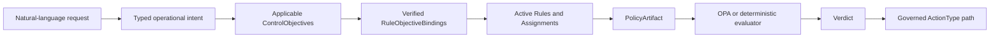

# 정책 추상화와 통제 목표

이 문서는 FDAI의 운영 온톨로지와 구체적인 Rule 및 OPA/Rego 정책 사이의 의미 계층을
정의합니다. 공급자 중립적인 `ControlObjective`와 `RuleObjectiveBinding` 레코드를 도입하여,
온톨로지, 검색 또는 생성된 그룹에 평가 권한을 부여하지 않으면서 운영자가 재사용 가능한
통제 의도를 찾고 설명할 수 있게 합니다.

> **권한 경계:** `Rule`, `Assignment`, `PolicyArtifact`, OPA 평가, `Verdict`, `ActionType`은
> 기존 책임을 유지합니다. 통제 목표나 바인딩은 후보 집합을 좁힐 수 있지만 근거를 평가하거나,
> 효과나 적용 모드를 설정하거나, 승인하거나, 실행할 수 없습니다.
>
> **규모 경계:** 의미 인덱스는 전체 활성 및 발견 코퍼스를 포함할 수 있습니다. 운영 그래프는
> 범위가 제한된 읽기 모델로 유지되며 수집된 모든 Rule을 가져오지 않습니다.

## 한눈에 보는 설계

이 추상화는 또 다른 실행 가능 정책이 아니라 안정적인 운영 불변식을 나타냅니다. 하나의 목표는
공급자, 리소스 형태, 근거, 매개 변수 또는 구현이 서로 다른 여러 버전 고정 Rule로 실현될 수
있습니다.



이 흐름은 다음 세 경계를 유지합니다.

- **의미:** 온톨로지와 `ControlObjective`는 불변식과 적용 가능한 의미 맥락을 설명합니다.
- **거버넌스:** `RuleObjectiveBinding`, `Rule`, `Assignment`는 정확한 활성 통제, 범위,
  매개 변수, 효과 및 적용 모드를 선택합니다.
- **결정:** 기존 결정론적 평가기가 결정을 만듭니다. 검색과 의미 그룹은 후보 전용으로
  유지됩니다.

## 저장소 기준선

2026-08-13의 결정론적 인벤토리에서 고유 Rule 레코드 8,549개를 확인했습니다. 이 수치는 작성된
실행 가능 정책과 수집된 발견 자료를 구분합니다. 이를 재현하려면 `rule-catalog/catalog`과
`rule-catalog/collected` 아래의 YAML을 읽고, `id`와 `check_logic`이 있는 매핑을 선택한 다음
`check_logic.kind`와 `source`로 그룹화합니다. 구현 이력에는 이 설계가 사용한 정확한 결과가
기록되어 있습니다.

| 코퍼스 정보 | 개수 | 해석 |
|-------------|-----:|------|
| 전체 Rule | 8,549 | 선별 및 수집 카탈로그 루트 아래의 고유 레코드 |
| 작성된 Rego Rule | 62 | 현재 `.rego` 구현이 있는 Rule |
| 표현식 Rule | 8,487 | 수집되고 정규화된 표현식이며 8,487개의 Rego 모듈이 아님 |
| Azure Policy 레코드 | 3,628 | Azure 기본 제공 정책에서 가져온 발견 레코드 |
| kube-bench 레코드 | 4,859 | 벤치마크 통제에서 가져온 발견 레코드 |

기존 모델은 이미 중요한 경계를 제공합니다.

| 기존 아티팩트 | 책임 | 필요한 처리 |
|---------------|------|-------------|
| `Rule` | 하나의 구체적이고 테스트 가능한 운영 통제 | 평가와 발견된 문제의 식별자로 유지 |
| `PolicyArtifact` | 결정론적 구현 메타데이터 | 유지하며 의미 개념으로 대체하지 않음 |
| `implemented_by_policy` | Rule과 정책 구현의 관계 | 정확한 정책 확인에 재사용 |
| `Assignment`와 `RuleSet` | 범위, 매개 변수, 효과 및 적용 모드 | 거버넌스를 목표 밖에 유지 |
| 의미 매니페스트와 표면 | 후보 전용 검색 의미 | 승격 후 타입이 지정된 목표 참조로 확장 |
| 활성 및 발견 코퍼스 | 운영 자료와 비활성 카탈로그 자료 | 검색, 변환 결과 및 평가 전반에서 격리 유지 |

누락된 계약은 안정적인 계열 식별자와 그 계열에서 정확한 Rule 버전으로 이어지는 근거 포함
관계입니다. 또 다른 범용 `Policy` 객체를 만들면 기존 Rule, 거버넌스 및 구현 아티팩트와
중복됩니다.

## 의미 모델

### ControlObjective

`ControlObjective`는 "하나의 가용 영역에 장애가 발생해도 노드 풀이 계속 사용 가능해야 한다"와
같은 버전 관리되고 공급자 중립적인 불변식입니다. 다음 항목을 포함하는 것이 좋습니다.

- 안정적인 ID, 버전, 제목 및 범위가 제한된 설명
- 운영 도메인과 보호되는 결과 참조
- 적용 가능한 온톨로지 타입 및 속성 참조
- 활성 임계값 없이 의도를 설명하는 정규화된 조건 계열
- 출처 이력, 수명 주기 상태, 대체 관계 및 콘텐츠 다이제스트
- 검색과 설명에 사용하는 현지화 및 의미 표면 참조

OPA 패키지, 공급자 필드 경로, 할당 범위, 활성 매개 변수 값, 효과, 적용 모드, 위험 결정 또는
작업 권한은 포함하지 않습니다. 이러한 값은 독립적으로 변경되며 기존 계약에 유지됩니다.

### RuleObjectiveBinding

`RuleObjectiveBinding`은 하나의 목표 버전을 하나의 정확한 Rule 버전에 연결하는 변경 불가능한
카탈로그 레코드입니다. 다음 항목을 포함하는 것이 좋습니다.

- 목표 및 Rule 버전 참조와 콘텐츠 다이제스트
- 초기에 `realizes` 또는 `partially_realizes`인 관계 종류
- 공급자, 리소스 하위 타입, 근거 형태 및 환경 제약에 대한 적용 가능성 차이
- 임계값, 단위, 집계 구간 또는 예외 모델과 같은 선언된 변형 차원
- 정규화된 구현 및 근거 서명
- 선택적 동등성 증적과 명시적인 비동등성 이유
- 출처 이력, 검토자, 수명 주기 상태 및 콘텐츠 다이제스트

현재 LinkType 형태는 버전 고정, 적용 가능성 차이 및 근거 증적을 안전하게 포함할 수 없으므로
바인딩을 일급 레코드로 둡니다. 온톨로지는 범위가 제한된 질의를 위해 레코드와 링크를 변환할 수
있지만 Git catalog-as-code가 기준 원본으로 유지됩니다.

### 관계 규칙

- 하나의 목표는 여러 바인딩과 여러 Rule을 가질 수 있습니다.
- 하나의 Rule은 각 바인딩에 독립적인 적용 가능성과 근거가 있을 때만 여러 목표를 실현할 수
  있습니다.
- 목표를 공유한다고 해서 두 Rule이 구현상 동등한 것은 아닙니다.
- 발견 Rule에 대한 바인딩은 발견 전용으로 유지되며 OPA 평가에 들어갈 수 없습니다.
- Rule을 폐기하면 과거 재생 기록을 삭제하지 않고 새 확인에 대한 바인딩을 닫습니다.
- 목표를 대체할 때 새 버전과 명시적 대체 관계를 만들며 이전 결정을 다시 쓰지 않습니다.

바인딩은 참조한 Rule의 코퍼스를 상속합니다. 발견 바인딩은 발견 범위를 명시적으로 요청한
경우에만 인덱싱되고 반환됩니다. 바인딩에는 독립적인 코퍼스 승격 스위치가 없습니다. 기존
거버넌스를 통해 참조 Rule을 승격하거나 폐기하면 바인딩이 나타날 수 있는 위치가 바뀝니다.

## 적용 가능성과 확인

목표 인식 확인은 기존 권한을 다음 순서로 사용합니다.

1. 운영자 요청을 타입이 지정된 의도와 정확한 온톨로지 식별자로 확인합니다.
2. 요청한 코퍼스에서 검토된 타입, 속성 및 결과 제약이 일치하는 목표를 검색한 다음,
   다이제스트가 유효한 바인딩으로 Rule 후보만 만듭니다.
3. 기존 Rule 수명 주기와 Assignment 거버넌스를 독립적으로 적용하여 요청 범위에서 활성 상태이고
   평가할 수 있는 정확한 Rule을 결정합니다.
4. 목표나 바인딩의 값을 받지 않고 Assignment 매개 변수, 효과 및 적용 모드를 확인합니다.
5. 거버넌스상 평가 가능한 각 Rule에 대해 `implemented_by_policy`를 통해 `PolicyArtifact`를
   확인합니다.
6. OPA 또는 등록된 결정론적 평가기를 통해 현재 상태이며 스키마에 맞는 근거를 평가합니다.
7. 결정을 반환하거나 명확화를 위해 보류합니다. 일반 통제 작업 경로만 실행할 수 있습니다.

목표가 없어도 정확한 Rule ID 평가는 차단되지 않습니다. 바인딩이 없거나 오래된 경우 목표 인식
단축 경로를 비활성화하고 명시적인 성능 저하 상태와 함께 정확한 ID 또는 어휘 기반 Rule 검색으로
대체합니다. 발견 결과는 활성 평가로 이어지지 않습니다.

## 동등성과 정제

임베딩과 모델이 생성한 요약은 계열을 제안할 수 있지만 동등성을 증명하지는 않습니다. 정제
파이프라인은 다음과 같습니다.

```text
deterministic source parsing
  -> normalized candidate signatures
  -> candidate family proposal
  -> applicability and counterexample analysis
  -> independent equivalence validation
  -> reviewed objective and binding promotion
```

`EquivalenceValidationReceipt`는 비교한 Rule 버전, 정규화된 조건 또는 OPA AST 다이제스트,
필수 근거, 매개 변수 도메인, 반례 집합, 검증기 버전, 결과, 실패 및 검토자를 고정하는 것이
좋습니다. 다음을 구분합니다.

- **같은 목표:** 두 Rule이 같은 불변식을 보호합니다.
- **같은 적용 가능성:** 두 Rule이 같은 대상과 근거 도메인을 받습니다.
- **같은 동작:** 두 Rule이 고정된 반례 집합에서 같은 결과를 반환합니다.
- **같은 구현:** 정규화된 결정론적 논리가 동등합니다.

`ControlObjective`를 공유하는 데는 첫 번째 관계만 필요합니다. 벡터 거리, 이름, 범주, 가져온
프로파일 멤버십 또는 공유 Rego import만으로 자동 승격하는 방식은 지원되지 않습니다.

### 승격 게이트

Mimir는 목표 및 바인딩 수명 주기 전환을 담당하는 단일 에이전트입니다. Heimdall은 독립적인
검증 증적을 만들지만 이 증적으로 아티팩트를 승격할 수 없습니다. Mimir 승격 레코드는 다음
항목을 요구하는 것이 좋습니다.

- 스키마, 상호 참조, 콘텐츠 다이제스트, 출처 이력 및 코퍼스 검증
- 동등성을 주장할 때 독립적인 동등성 증적
- 영향받는 모든 작성 Rule에 대한 고정된 반례 및 OPA 회귀 결과
- 활성 및 발견 격리와 권한 불변식 검사
- 검토된 카탈로그 풀 리퀘스트와 롤백 대상

승격 레코드는 모든 근거를 고정하고 Saga 감사를 위한 타입이 지정된 전환을 내보냅니다. 실패하면
후보는 비활성 상태로 유지됩니다. 승격은 검색과 설명 가능성만 바꾸며 Assignment 효과, 적용 모드,
위험, 승인 또는 실행 권한을 변경하지 않습니다.

## 저장소와 규모

8,549개 레코드 코퍼스를 하나의 운영 그래프 릴리스로 만들지 않는 것이 좋습니다.

- **의미 인덱스:** 모든 발견 레코드와 활성 Rule을 별도의 완전한 세대에 저장합니다. 각 결과는
  코퍼스와 세대 식별자를 유지합니다.
- **운영 그래프:** 검토된 목표와 할당된 Rule, 현재 질문 또는 선언된 역량 묶음에 필요한 활성
  바인딩을 변환합니다. 기존 1,000개 객체 한계를 유지합니다.
- **세대 식별자:** 코퍼스 규모 세대에는 행 개수, 정규 콘텐츠 다이제스트 루트 및 범위가 제한된
  청크 매니페스트를 사용합니다. 작은 호환성 세대에만 인라인 정렬 다이제스트를 유지합니다.
  현재 256개 다이제스트 한계로는 전체 코퍼스를 나타낼 수 없습니다.
- **재생:** 모든 목표 인식 확인 증적에 목표, 바인딩, Rule, Assignment, 정책, 온톨로지 릴리스 및
  세대 다이제스트를 고정합니다.

활성 및 발견 세대는 독립적인 활성화 및 롤백 포인터를 사용합니다. 한 코퍼스의 활성화가 다른
코퍼스를 변경하지 않습니다.

## 예제: 다중 가용 영역 노드 풀

기존
[`kubernetes-node-pool.multi-zone` Rule](../../../rule-catalog/catalog/kubernetes-node-pool.multi-zone.yaml)과
해당
[`node_pool_multi_zone.rego` 정책](../../../policies/kubernetes/node_pool_multi_zone.rego)은 구체적인
이행 예제를 제공합니다.

1. `ControlObjective reliability.node-pool.zone-failure-tolerance@1`은 하나의 가용 영역에 장애가
   발생해도 노드 풀이 계속 사용 가능해야 한다고 선언합니다.
2. 바인딩은 해당 목표를 정확한 Rule 버전에 고정하고 Kubernetes 노드 풀, 가용 영역 근거 및
   최소 영역 개수를 변형 차원으로 선언합니다.
3. Assignment는 활성 범위, 임계값, 효과 및 적용 모드를 제공합니다.
4. `implemented_by_policy`는 정확한 Rego 아티팩트를 확인합니다.
5. OPA는 현재 영역 목록을 평가합니다. 영역이 2개보다 적으면 기존
   `single_zone_node_pool` 거부를 반환합니다.

목표는 검색과 설명을 개선하지만 Rule, Assignment 및 Rego 패키지가 여전히 결과를 결정합니다.
이 목표와 바인딩은 기존 카탈로그 레코드가 아니라 P1 채우기 대상입니다.

## 에이전트 소유권

고정된 15개 에이전트로 충분합니다. 인덱서 또는 정책 추상화 에이전트를 추가하지 않습니다.

| 단계 | 담당 에이전트 | 경계 |
|------|---------------|------|
| 목표, 바인딩, Rule 및 정책 수명 주기 | Mimir | 카탈로그 아티팩트를 검토하고 승격하며 런타임 근거는 평가하지 않음 |
| 후보 계열 발견 | Norns | 비활성 후보만 생성 |
| 동등성과 검색 검증 | Heimdall | 독립 증적을 만들며 승격할 수 없음 |
| 범위가 제한된 의미 맥락 | Muninn | 고정된 읽기 변환 결과를 구체화 |
| 전환과 확인 감사 | Saga | 수명 주기와 결정 근거를 추가 전용으로 기록 |
| 자연어 표현 | Bragi | 번역하고 설명하며 판단하지 않음 |
| 결정론적 런타임 결정 | Forseti | 확인된 정확한 Rule과 근거를 사용하며 실행하지 않음 |

권한이 있는 전환은 타입이 지정된 이벤트 버스 메시지로 유지됩니다. 기계적인 빌더와 인덱스
발행기는 숨겨진 의사 결정자가 아니라 Mimir 소유 기능으로 실행됩니다.

## 운영 요구사항

| 관심사 | 필요한 동작 |
|--------|-------------|
| 실패와 성능 저하 | 목표, 바인딩, 증적 또는 의미 세대가 없거나 오래되었거나 유효하지 않으면 정확한 ID 및 어휘 기반 Rule 검색으로 대체합니다. 후보 집합을 넓히거나 평가를 시작하지 않습니다. |
| 코퍼스 불일치 | 활성 질의는 발견 바인딩을 거부합니다. 발견 질의는 읽기 전용으로 유지되며 평가 대상을 확인할 수 없습니다. |
| 빌드와 롤백 | 전체 세대 빌드에 실패하면 이전 포인터를 활성 상태로 유지합니다. 롤백은 보존되고 코퍼스가 호환되며 독립적으로 검증된 세대만 받습니다. |
| 그래프 한계 | 설정된 객체 한계 전에 변환을 중단하고 잘림을 보고합니다. 불완전한 그래프는 목표나 Rule이 없음을 증명할 수 없습니다. |
| 정책 가용성 | 정확한 평가기나 정책 다이제스트를 사용할 수 없으면 결정이나 작업 제안 없이 요청을 보류합니다. |
| 보안 | 원본 텍스트는 신뢰되지 않은 데이터입니다. 파서, 보강 및 검색에는 실행기 신원을 제공하지 않으며 로그와 증적에서 원시 운영자 텍스트, 비밀 및 공급자 오류를 제외합니다. |
| 관측 가능성 | 메트릭은 질의 내용을 기록하지 않고 코퍼스, 세대, 목표 후보, 바인딩 후보, 모호성, 오래된 항목 거부, 대체 경로, 검증 보류, 빌드 지연 시간, 질의 지연 시간 및 롤백을 보고합니다. |
| 성능 | 목표 확장, 바인딩 분기 수, 결과 개수, 그래프 객체, 청크 및 요청 시간에 설정된 고정 한계를 사용합니다. 승격 전에 같은 8,549개 레코드 리비전에서 기준선과 변경안의 지연 시간, CPU 및 저장소를 측정합니다. 이 설계는 측정되지 않은 SLA를 주장하지 않습니다. |

## 구현 상태

### 구현 범위

| 영역 | 상태 | 근거 | 참고 |
|------|------|------|------|
| Rule과 정책의 경계 | in-progress | [`PolicyArtifact.yaml`](../../../rule-catalog/vocabulary/object-types/PolicyArtifact.yaml), [`implemented_by_policy.yaml`](../../../rule-catalog/vocabulary/link-types/implemented_by_policy.yaml) | 기존 아티팩트를 재사용할 수 있지만 이 변경에서 런타임 경로를 다시 검증하지 않았습니다. |
| 의미 매니페스트와 코퍼스 격리 | in-progress | [`rule_semantic_retrieval.py`](../../../services/core-control-plane/src/fdai/rule_catalog/schema/rule_semantic_retrieval.py), [Rule 의미 검색](rule-semantic-retrieval-ko.md) | 기존 검색 계약에는 새 타입 목표 및 바인딩 계약이 없습니다. |
| `ControlObjective` 계약과 카탈로그 | in-progress | [`control_objective.py`](../../../services/core-control-plane/src/fdai/rule_catalog/schema/control_objective.py), [`test_control_objective.py`](../../../services/core-control-plane/tests/rule_catalog/test_control_objective.py) | 엄격한 모델, 로더, 다이제스트, 수명 주기 및 부정 테스트가 있습니다. 어휘 선언과 제공되는 카탈로그 레코드는 아직 필요합니다. |
| `RuleObjectiveBinding`과 동등성 증적 | not-started | 이 설계 | 버전 고정 바인딩 또는 동등성 검증기가 없습니다. |
| 목표 인식 변환 결과와 확인 | not-started | 이 설계 | 기존 정확한 Rule 및 검색 경로는 변경되지 않습니다. |
| 전체 코퍼스 세대 식별자 | not-started | [`rule_semantic_generation.py`](../../../services/core-control-plane/src/fdai/rule_catalog/schema/rule_semantic_generation.py) | 인라인 다이제스트 계약은 256개 항목으로 제한됩니다. |
| shadow 평가와 통제된 롤아웃 | not-started | 이 설계 | 목표 확인 벤치마크 또는 승격 증적이 없습니다. |

### 구현 이력

| 날짜 | 상태 | 변경 | 근거 | 남은 작업 |
|------|------|------|------|-----------|
| 2026-08-13 | in-progress | 정책 추상화 설계와 구현 ledger를 채택했으며 이전 기반 구현의 출처 이력은 재구성하지 않았습니다. | `current change`; 결정론적 카탈로그 인벤토리에서 Rego 62개와 표현식 8,487개를 포함한 Rule 8,549개를 확인했습니다. | 아래 P0-P4를 제공하고 검증합니다. |
| 2026-08-13 | in-progress | 카탈로그 상호 참조 검사, 정규 콘텐츠 다이제스트, 수명 주기 검증 및 권한 필드 거부를 포함하는 엄격하고 불변인 `ControlObjective` 계약을 추가했습니다. | `current change`; `PYTHONPATH="$PWD/services/core-control-plane/src:$PWD/packages/service-contracts/src" .venv/bin/pytest -q --no-cov services/core-control-plane/tests/rule_catalog/test_control_objective.py`에서 테스트 7개가 통과했고 Ruff 및 diff 검사도 통과했습니다. | 목표 어휘 및 제공되는 레코드를 추가한 다음 P0의 바인딩과 동등성 증적 계약을 완료합니다. |

### 남은 작업

- [ ] P0는 `ControlObjective`, `RuleObjectiveBinding` 및 동등성 증적에 대한 엄격한 스키마,
  로더, 콘텐츠 다이제스트, 수명 주기 검증 및 부정 테스트가 존재하면 완료됩니다.
- [ ] P1은 작성된 Rego Rule 62개 모두에 검토된 바인딩이 있고, 이행 보고서가 Rule ID나 판정
  동작을 변경하지 않으면서 모든 활성 Rule을 집계하면 완료됩니다.
- [ ] P2는 활성 및 발견 세대가 현재 레코드 8,549개를 모두 독립적으로 로드하고, 개수, 루트,
  청크 식별자를 발행하며, 원자적 활성화와 롤백을 증명하면 완료됩니다.
- [ ] P3는 목표 인식 `catalog.search_rules` 확인이 기존 읽기 전용 함수 경로를 통해 구성되고,
  정확한 T0 평가에 여전히 활성 Rule과 평가 증적이 필요하면 완료됩니다.
- [ ] P4는 보류된 영문 및 한국어 검색 집단, 반례, 오래된 근거, 코퍼스 격리, 롤백 및 shadow
  동등성이 권한 이탈 0건으로 설정된 게이트를 충족하면 완료됩니다.

## 제공 계획

| 단계 | 구현 범위 | 집중 종료 근거 |
|------|-----------|----------------|
| P0 - 계약 | `fdai/rule_catalog/schema/` 아래에 스키마 모델, 어휘 선언, 엄격한 로더, 불변식 및 고정 테스트 자료를 추가합니다. | 스키마와 카탈로그 테스트가 알 수 없는 참조, 다이제스트 차이, 잘못된 수명 주기 및 권한 필드를 거부합니다. |
| P1 - 채우기와 증명 | 먼저 작성된 Rego Rule에 대한 정규화된 서명, 동등성 증적, 검토 작업 흐름 및 바인딩을 만듭니다. | 이행 보고서의 개수가 일치하고 OPA 고정 테스트 자료와 Rule 식별자가 변경되지 않습니다. |
| P2 - 확장 가능한 세대 | 세대 식별자를 개수, 루트, 청크 매니페스트로 확장하고 코퍼스를 합치지 않으면서 목표 및 바인딩 검색 문서를 추가합니다. | 전체 8,549개 레코드 로드, 원자적 활성화, 오래된 항목 거부 및 롤백 테스트가 통과합니다. |
| P3 - 런타임 구성 | 카탈로그 변환 결과, 목표 인식 검색 필터, 확인 증적, 함수 등록, 구성 및 질의 계획을 확장합니다. | 읽기 전용 검색이 성능 저하를 명시적으로 보고하고, 정확한 활성 Rule과 현재 근거 없이는 평가를 시작할 수 없습니다. |
| P4 - 롤아웃 | 보류된 검색 및 동등성 모음, shadow 비교, 회귀 게이트, 통제된 승격 및 롤백 훈련을 실행합니다. | 설정된 집단 임계값을 통과하고 권한 이탈이 0건이며 이전 세대 롤백을 재생할 수 있습니다. |

P0와 P1은 병렬 저장소를 만들지 않고 기존 카탈로그와 온톨로지 계약을 사용하는 것이 좋습니다.
P2와 P3은 두 번째 검색 서비스를 추가하지 않고 기존 의미 세대 및 타입이 지정된 함수 경로를
확장하는 것이 좋습니다. P4는 검토된 아티팩트만 승격하며 임베딩에서 직접 승격하지 않습니다.
집중 테스트는 기존 Core 테스트 소유권 아래에 두는 것이 좋습니다. 스키마 및 이행 테스트는
`services/core-control-plane/tests/rule_catalog/`, 변환 결과 테스트는
`services/core-control-plane/tests/core/ontology_platform/`, 세대 어댑터 테스트는
`services/core-control-plane/tests/delivery/catalog_search/`에 둡니다. 각 단계의 상태가 바뀔 때
정확한 집중 명령과 결과를 이 ledger에 기록합니다.

## 이행과 호환성

- 기존 Rule ID, 버전, PolicyArtifact 식별자, Assignment 및 OPA 결정 경로는 변경하지 않습니다.
- 목표 및 바인딩 필드는 추가형입니다. 새 아티팩트가 없어도 정확한 ID 및 어휘 기반 검색은 계속
  작동합니다.
- 채우기는 작성된 Rego Rule 62개부터 시작합니다. 수집된 표현식 레코드는 출처 이력, 정규화된
  의미 및 검토가 충분할 때까지 발견 자료로 유지됩니다.
- 이행 보고서는 바인딩됨, 의도적으로 바인딩하지 않음, 모호함, 수락되지 않음으로 Rule을
  분류합니다. 합계는 입력 코퍼스 개수와 같아야 합니다.
- 목표 참조가 없는 이전 증적은 유효하며 명시적으로 이전 형식으로 유지됩니다. 나중에 재구성한
  목표를 할당하지 않습니다.
- 롤백은 활성 Rule 또는 정책 카탈로그를 변경하지 않고 이전 목표, 바인딩 및 의미 인덱스 세대
  포인터를 복원합니다.

## 검증과 수락

구현에는 다음 항목을 포함하는 것이 좋습니다.

- 스키마, 로더, 다이제스트, 수명 주기 및 상호 참조 단위 테스트
- 목표 맥락과 검색 점수가 권한을 높이지 않음을 증명하는 속성 테스트
- 동등성 증적을 위한 정규화된 AST 및 표현식 반례 테스트
- 식별자 충돌과 1,000개 객체 한계를 확인하는 카탈로그 변환 결과 테스트
- 8,549개 레코드, 활성 및 발견 격리, 청크 완전성, 활성화, 오래된 세대 거부 및 롤백을
  확인하는 전체 코퍼스 테스트
- 일치 항목 없음 및 모호한 질문을 포함한 보류된 영문 및 한국어 검색 집단
- 목표 확인이 허용 또는 거부 동작을 변경하지 않음을 증명하는 OPA 회귀 고정 테스트 자료
- 모든 목표, 바인딩, Rule, Assignment, 정책 및 근거 다이제스트를 고정하는 재생 테스트

모든 미완료 ledger 항목에 검토 가능한 근거가 있고, 새 추상화가 평가 또는 실행 권한을 만들지
않으며, 모든 활성 목표 경로가 정확한 기존 Rule로 끝나고, 목표 계층을 제거해도 정확한 Rule 평가
동작이 변경되지 않으면 이 설계의 구현을 수락합니다.

## 범위 밖

- `Rule`, `PolicyArtifact`, Assignment, RuleSet, 예외 또는 승격 계약 대체
- 전체 발견 코퍼스를 범위가 제한된 운영 그래프에 변환
- 온톨로지, 검색 순위, 임베딩 또는 모델 출력을 정책 결정으로 취급
- 의미 유사성만으로 동등성을 자동 선언하거나 목표를 승격
- 16번째 에이전트, 두 번째 정책 엔진 또는 두 번째 의미 인덱스 서비스 추가
- 출처 이력, 검토 및 회귀 근거 없이 수집된 표현식을 Rego로 컴파일

## 관련 문서

| 알아볼 내용 | 문서 |
|-------------|------|
| Rule 검색, 의미 표면 및 세대 | [Rule 의미 검색](rule-semantic-retrieval-ko.md) |
| Assignment, 효과, 적용 모드 및 예외 | [Rule 거버넌스](rule-governance-ko.md) |
| 카탈로그 출처와 정규화된 Rule 형태 | [Rule 카탈로그 수집](rule-catalog-collection-ko.md) |
| 공유 운영 의미와 목표 의미 체계 | [FDAI 운영 온톨로지](../architecture/operating-ontology-ko.md) |
| 범위가 제한된 그래프와 타입이 지정된 함수 인프라 | [FDAI 온톨로지 안전 인프라](../architecture/operating-ontology-platform-ko.md) |
| 고정된 에이전트 책임 | [에이전트 판테온](../agents/agent-pantheon-ko.md) |
