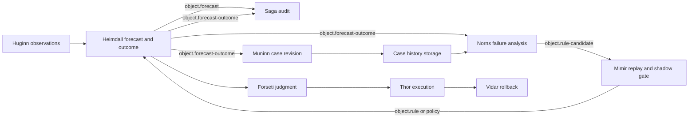

# 예측 학습 및 케이스 히스토리

이 설계는 각 예측을 관측된 실제 결과와 대조해 종료하고, 전체 증거를 revision 기반 case
history로 보존하며, 모델이 live 동작을 직접 바꾸지 못하게 하면서 FDAI가 더 안전한 detector
개선을 제안하도록 합니다.

> **구현 범위:** Azure가 구현 대상입니다. Core contract는 cloud-provider-neutral하게
> 유지합니다. 새 동작은 shadow mode에서 시작합니다.
>
> **Agent 경계:** Pantheon은 정확히 15개 agent로 유지합니다. Machine workflow 협업은
> schema-validated pub/sub만 사용합니다. 새 agent나 직접 agent call을 추가하지 않습니다.

## 설계 요약

예측은 horizon 종료 후 실제 결과와 대조되어야 학습 증거가 됩니다. Heimdall은 forecast
결과를 소유하고, Saga는 변경 불가능한 audit evidence를 기록하고, Muninn은 case revision을
구성하고 색인하며, Norns는 검토된 실패 cohort를 off-path에서 분석하고, Mimir는 candidate
replay, shadow 비교, promotion 및 rollback을 관리합니다.

## Agent 소유 액션

| Agent | Trigger | 소유 액션 | Published object |
|-------|---------|-----------|------------------|
| Huginn | Metric, incident 또는 breach 입력 | 실제 observation을 normalize하고 deduplicate | `Event` |
| Heimdall | Observation 또는 horizon expiry | Forecast를 만들고 forecast outcome을 결정론적으로 종료 | `Forecast`, `ForecastOutcome`, `Drift` |
| Forseti | Proactive finding | 제안된 대응을 판단하고 필요하면 arbitration 요청 | `Verdict`, `ArbitrationRequest` |
| Odin | 충돌하는 objective | 제한된 대응을 선택하거나 hold | `ArbitrationDecision` |
| Thor | 적격 verdict | 승격된 action만 실행 | `ActionRun`, `ActionAttempt` |
| Var | 사람 승인 필요 | 독립적인 승인 결과 기록 | `Approval` |
| Vidar | 실패한 action | 선언된 rollback 실행 | `Rollback` |
| Saga | 모든 terminal transition | Tamper-evident evidence 추가 | `AuditEntry` |
| Muninn | Forecast outcome audit | Case-history revision 봉인 및 색인 | `StateSnapshot`, `ContextIndex` |
| Norns | 종료된 case cohort | 실패를 off-path 분석하고 inert improvement 제안 | `PatternObservation`, `RuleCandidate` |
| Mimir | Rule candidate | Governed replay 및 shadow promotion 실행 | `Rule`, `Policy` |

Subscriber는 독립적으로 실행됩니다. 느리거나 실패한 case materialization은 outcome audit,
learning intake 또는 관련 없는 forecast를 차단하지 않습니다. Runtime은 transient subscriber
failure를 dead-letter 처리하기 전에 두 번 재시도합니다. 안정적인 correlation 및 idempotency
key로 replay를 안전하게 유지합니다.

## Forecast outcome contract

`ForecastOutcome`은 Heimdall만 소유하고 `object.forecast-outcome`으로 publish하는 versioned
object입니다. 다음을 기록합니다.

- 안정적인 outcome 및 prediction id
- detector 및 configuration version
- target digest, metric, feature cutoff, breach predicate 및 horizon
- predicted value 및 uncertainty interval
- 가능한 경우 observed value 및 actual breach time
- terminal label: `true_positive`, `false_positive`, `false_negative`, `late_breach`,
  `magnitude_error`, `intervention_censored` 또는 `unscorable`
- intervention 및 evidence reference, telemetry completeness 및 close time

적격한 선행 prediction이 없는 실제 breach는 prediction id 없는 false-negative outcome을
만듭니다. At-least-once delivery는 안정 outcome id로 deduplicate합니다. 누락 telemetry,
maintenance overlap 및 resource deletion은 성공한 prediction으로 바꾸지 않습니다.
Boundary validation은 JSON Schema와 typed model 모두에서 label별 breach, intervention,
observation 및 interval evidence를 요구합니다. Typed model은 breach가 선언된 forecast horizon
밖에 있는 magnitude error도 거부합니다.

## Case history model

Case는 access scope에 결합된 안정 identity와 append-only revision을 가집니다. Incident가
reopen되거나 늦은 trusted evidence가 도착하면 history를 덮어쓰지 않고 revision을 추가합니다.
Revision은 이전 source identity와 digest를 모두 보존해야 합니다. 새 evidence는 추가할 수 있지만
이미 봉인된 evidence를 바꾸거나 누락할 수 없습니다.

### Target PostgreSQL hot index

PostgreSQL은 제한 없는 evidence body가 아니라 조회 가능한 metadata를 저장합니다.

- `case_history`: identity, kind, correlation 및 incident reference, lifecycle state, latest
  revision, label, detector version, resource type, metric, retention, legal hold 및 latest
  manifest reference
- `case_history_revision`: revision number, parent digest, manifest digest, storage reference,
  audit sequence 범위, event-time cutoff, schema 및 redaction version, label, censoring reason,
  owning agent 및 seal time
- `case_history_chunk`: 제한되고 redaction된 text, chunk kind, embedding, embedding model
  version, source manifest digest, access-scope digest 및 deletion lineage

Append-only audit log가 계속 권위입니다. Hot index는 다시 만들 수 있는 projection입니다.

### Immutable artifact

Artifact store는 canonical JSON byte와 manifest를 content-addressed reference 아래에
기록합니다. 각 revision은 prediction-time fact, version, observation, intervention, decision,
approval, action, rollback, RCA citation, SLO recovery, recurrence 및 source-record digest를
포함합니다. Raw cloud payload, credential, 제한 없는 tool output, prompt 및 hidden reasoning은
저장하지 않습니다. Seal boundary는 중립적인 field name 아래에 있는 일반적인 plain-text 및
percent-encoded credential 형태, credential을 포함한 URI user information, 대소문자나 구분자
형식이 다른 일반 secret key도 거부합니다.

Artifact 생성은 metadata append보다 먼저 실행됩니다. Metadata가 명확히 거부되면 해당 시도에서
새로 생성한 artifact만 제거합니다. Append 결과를 확인할 수 없으면 안전한 retry를 위해 artifact를
보존하고 append 오류와 verification 오류를 모두 유지합니다.

기본 Azure adapter는 workload identity, public access 및 key authentication 비활성화,
versioning, private networking, deployment-approved retention 또는 legal hold가 적용된 private
Blob container를 사용합니다. Customer-scoped artifact는 Git에 저장하지 않습니다.

### 분석을 위한 retrieval

Retrieval은 검색 전에 purpose 및 access scope를 authorize하고 artifact의 case, revision,
correlation, purpose, scope 및 parent identity를 metadata와 대조합니다. Resource type, metric,
detector version, outcome label 및 time에 대한 deterministic filter를 적용한 뒤 pgvector
ranking을 수행합니다. Retriever는 제한된 case card와 source digest를 반환하며 모델은
embedding을 source evidence로 취급할 수 없습니다.

Norns는 failure case와 함께 matched correct 및 censored control을 받습니다. 이는 survivorship
bias와 과도하게 보수적인 threshold 변경을 방지합니다. 모든 분석 주장은 case id, revision 및
manifest digest를 인용합니다. Evidence가 없거나 충돌하면 candidate를 만들지 않습니다.

## Learning 및 promotion

Norns는 먼저 telemetry quality, baseline 또는 seasonality drift, topology 또는 concept drift,
horizon selection, threshold 또는 calibration error, intervention censoring 및 detector-version
regression을 결정론적으로 분류합니다. Off-path model은 모호한 잔여만 분석하며 inert
candidate만 만들 수 있습니다.

Mimir는 grounded provenance가 있는 candidate만 수락합니다. Candidate는 동일 case에서
incumbent와 rolling-origin replay 및 live shadow comparison을 수행합니다. Promotion에는 최소
closed sample 및 observation day, confidence-bounded improvement, guard-metric 무회귀 및 policy
escape 0건이 필요합니다. Regression은 detector 또는 policy를 자동으로 shadow로 되돌립니다.

## Retention 및 deletion

각 case는 purpose, access scope, retention, deletion due date 및 legal-hold metadata를
가지며 active hold에는 비어 있지 않은 authority reference가 필요합니다. Deletion은 먼저 모든
revision artifact reference를 포함한 durable intent를 기록합니다.
Deletion pending 상태에서는 새 revision과 분석을 차단합니다. 그다음 Muninn이 전체 artifact
chain, chunk 및 embedding을 제거한 뒤 hot index를 tombstone합니다. Audit에는 non-sensitive
deletion record와 digest를 유지합니다. Artifact 또는 최종 metadata 단계가 실패하면 intent는
retryable 상태로 남고 완료로 표시되지 않습니다. 기계 scheduler는 primary event bus에 제한된 raw
retention tick을 publish합니다. Huginn이 이를 정규화하고 Muninn만 typed `object.event` retention
signal을 소비해 due deletion을 적용합니다. `FDAI_CASE_HISTORY_RETENTION_TICK_SECONDS`는 cadence를
제어하며 기본값은 1일입니다. 중복되거나 replay된 tick은 idempotent합니다. Raw event가 전달하는
timestamp는 진단용일 뿐입니다. Muninn은 trusted UTC clock으로 due date를 평가하므로 ingress
publisher가 deletion을 앞당길 수 없습니다. Retention publisher task가 실패하면 이후 tick을
조용히 비활성화하지 않고 runtime이 unsuccessful exit로 종료됩니다.

## 구현 상태

| Capability | Status |
|------------|--------|
| Forecast detector 및 shadow finding | 구현됨 |
| Agent pub/sub runtime 및 single-writer enforcement | 구현됨 |
| Governed trajectory serialization, scanning, checksum 및 retention primitive | 구현됨, 재사용 |
| `ForecastOutcome` schema, closer 및 topic wiring | 이 slice에서 구현 |
| Canonical case revision 및 in-memory store | 이 slice에서 구현 |
| StateStore CAS latest-case projection | 이 slice에서 구현, production에서는 PostgreSQL-backed |
| 전용 PostgreSQL revision/chunk table | 후속 작업, target model은 위에서 정의 |
| Azure private artifact adapter | 이 slice에서 구현, deployment는 opt-in |
| Muninn case materialization, scheduled retention 및 Norns candidate choreography | 이 slice에서 구현 |
| 전체 live forecast metric scheduler 및 console view | 후속 작업, storage correctness에는 불필요 |

## Verification

구현은 다음을 증명해야 합니다.

- 모든 forecast 또는 actual breach가 하나의 terminal outcome 또는 명시적 `unscorable` 상태에 도달
- 입력 reorder에도 canonical digest가 안정적이며 evidence mutation에는 digest가 변경
- Append-only revision conflict 탐지 및 idempotent replay
- Cross-scope retrieval 차단 및 secret/hidden-reasoning 거부
- Subscriber concurrency, failure isolation, ownership 및 duplicate delivery safety
- Model output이 active rule, detector, promotion 또는 action을 직접 기록할 수 없음

## 관련 문서

| 학습할 내용 | 문서 |
|-------------|------|
| Detection 및 forecast scoring | [관측성과 감지](observability-and-detection-ko.md) |
| Agent ownership 및 topic | [Agent pantheon](../agents/agent-pantheon-ko.md) |
| Governed offline record | [Governed trajectory dataset](../interfaces/governed-trajectory-datasets-ko.md) |
| Data retention 및 privacy | [Data governance](../architecture/data-governance-ko.md) |
