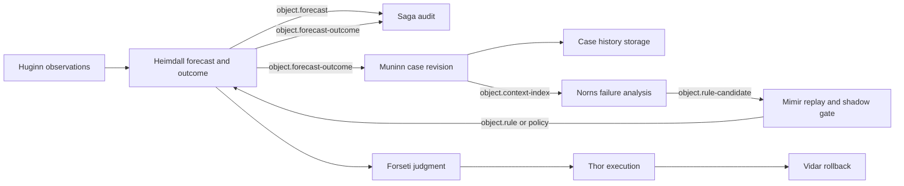

# 예측 학습 및 케이스 히스토리

이 설계는 각 예측을 관측된 실제 결과와 대조해 종료하고, 전체 증거를 개정 번호 기반 사례
이력으로 보존하며, 모델이 실제 운영 동작을 직접 바꾸지 못하게 하면서 FDAI가 더 안전한 detector
개선을 제안하도록 합니다.

> **구현 범위:** Azure가 구현 대상입니다. Core 계약은 cloud-provider-neutral하게
> 유지합니다. 새 동작은 그림자 모드에서 시작합니다.
>
> **에이전트 경계:** Pantheon은 정확히 15개 에이전트로 유지합니다. 머신 작업 흐름 협업은
> 스키마로 검증한 pub/sub만 사용합니다. 새 에이전트나 직접 에이전트 호출을 추가하지 않습니다.

## 설계 요약

예측은 horizon 종료 후 실제 결과와 대조되어야 학습 증거가 됩니다. Heimdall은 예측
결과를 소유하고, Saga는 변경 불가능한 감사 근거를 기록하고, Muninn은 사례 개정 번호를
구성하고 색인하며, Norns는 검토된 실패 집단을 off-path에서 분석하고, Mimir는 후보
재생, 그림자 비교, 승격 및 롤백을 관리합니다.

```mermaid
flowchart LR
 H[Huginn observations] --> HD[Heimdall forecast and outcome]
 HD -->|object.forecast| S[Saga audit]
 HD -->|object.forecast-outcome| S
 HD -->|object.forecast-outcome| MU[Muninn case revision]
 MU --> CH[Case history storage]
 MU -->|object.context-index| N[Norns failure analysis]
 N -->|object.rule-candidate| M[Mimir replay and shadow gate]
 M -->|object.rule or policy| HD
 HD --> F[Forseti judgment]
 F --> T[Thor execution]
 T --> V[Vidar rollback]
```

## 에이전트 소유 액션

| 에이전트 | 트리거 | 소유 액션 | Published 객체 |
|-------|---------|-----------|------------------|
| Huginn | 메트릭, 인시던트 또는 breach 입력 | 실제 관측을 normalize하고 deduplicate | `Event` |
| Heimdall | 관측 또는 horizon 만료 | 예측을 만들고 예측 결과를 결정론적으로 종료 | `Forecast`, `ForecastOutcome`, `Drift` |
| Forseti | Proactive 발견 사항 | 제안된 대응을 판단하고 필요하면 중재 요청 | `Verdict`, `ArbitrationRequest` |
| Odin | 충돌하는 목표 | 제한된 대응을 선택하거나 보류 | `ArbitrationDecision` |
| Thor | 적격 판정 | 승격된 액션만 실행 | `ActionRun`, `ActionAttempt` |
| Var | 사람 승인 필요 | 독립적인 승인 결과 기록 | `Approval` |
| Vidar | 실패한 액션 | 선언된 롤백 실행 | `Rollback` |
| Saga | 모든 최종 전이 | Tamper-evident 근거 추가 | `AuditEntry` |
| Muninn | 예측 결과 감사 | Case-history 개정 번호 봉인 및 색인 | `StateSnapshot`, `ContextIndex` |
| Norns | 종료된 사례 집단 | 실패를 off-path 분석하고 inert improvement 제안 | `PatternObservation`, `RuleCandidate` |
| Mimir | Rule 후보 | 통제된 재생 및 그림자 승격 실행 | `Rule`, `Policy` |

구독자는 독립적으로 실행됩니다. 느리거나 실패한 사례 구체화는 결과 감사,
learning intake 또는 관련 없는 예측을 차단하지 않습니다. 런타임은 transient 구독자
실패를 dead-letter 처리하기 전에 두 번 재시도합니다. 안정적인 상관관계 및 멱등성
키로 재생을 안전하게 유지합니다.

배포된 루프는 기계적인 틱 발행기가 구동합니다. Huginn은 raw 틱을 `object.event`로
정규화하고, Heimdall은 설정된 대상과 메트릭 조합을 평가해 긍정, 부정 또는 판단 보류
평가를 변경 불가능한 에피소드로 기록합니다. 또한 텔레메트리 grace 기간 이후 due 에피소드를
종료하고 transactional 게시 발신함을 비웁니다. Poison 게시는 다른 에피소드를
막지 않도록 격리하고 dead-letter 처리합니다.

## 예측 결과 계약

`ForecastOutcome`은 Heimdall만 소유하고 `object.forecast-outcome`으로 publish하는 versioned
객체입니다. 다음을 기록합니다.

- 안정적인 결과 및 prediction id
- detector 및 구성 버전
- 대상 다이제스트, 메트릭, feature 기준 시점, breach 조건식 및 horizon
- predicted 값 및 uncertainty 간격
- 가능한 경우 관찰된 값 및 actual breach 시간
- 최종 라벨: `true_positive`, `false_positive`, `false_negative`, `late_breach`,
 `magnitude_error`, `intervention_censored` 또는 `unscorable`
- intervention 및 근거 참조, 텔레메트리 완전성 및 close 시간

에피소드 원장은 `predicted_breach`, `predicted_no_breach`, `abstained` 평가도 기록합니다. 세
상태를 모두 저장해 재현율 denominator를 보존하고 모델 miss와 파이프라인 miss를 구분합니다.
Horizon 채점은 이벤트 시간을 사용합니다. Horizon 이후 breach는 해당 horizon의 false 부정이
아니며 magnitude는 첫 breach 샘플이 아니라 horizon 시점 관찰된 값을 간격과 비교합니다.

적격한 선행 prediction이 없는 실제 breach는 prediction id 없는 false-negative 결과를
만듭니다. At-least-once 전달은 안정 결과 id로 deduplicate합니다. 누락 텔레메트리,
maintenance overlap 및 리소스 deletion은 성공한 prediction으로 바꾸지 않습니다.
경계 검증은 JSON 스키마와 타입이 지정된 모델 모두에서 라벨별 breach, intervention,
관측 및 간격 근거를 요구합니다. 타입이 지정된 모델은 breach가 선언된 예측 horizon
밖에 있는 magnitude 오류도 거부합니다.

## 사례 이력 모델

사례는 접근 범위에 결합된 안정 신원과 추가 전용 개정 번호를 가집니다. 인시던트가
reopen되거나 늦은 trusted 근거가 도착하면 이력을 덮어쓰지 않고 개정 번호를 추가합니다.
개정 번호는 이전 출처 신원과 다이제스트를 모두 보존해야 합니다. 새 근거는 추가할 수 있지만
이미 봉인된 근거를 바꾸거나 누락할 수 없습니다.

### 대상 PostgreSQL hot 인덱스

PostgreSQL은 제한 없는 근거 본문이 아니라 조회 가능한 메타데이터를 저장합니다.

- `case_history`: 신원, 종류, 상관관계 및 인시던트 참조, 수명 주기 상태, 최신
 개정 번호, 라벨, 범위가 제한된 범용 메타데이터, 선택적 예측 detector 및 메트릭 필드,
 보존, legal 보류 및 최신 매니페스트 참조
- `case_history_revision`: 개정 번호 number, 상위 다이제스트, 매니페스트 다이제스트, 저장소 참조,
 감사 순서 범위, event-time 기준 시점, 스키마 및 민감정보 제거 버전, 라벨, censoring 사유,
 owning 에이전트 및 seal 시간
- `case_history_chunk`: 제한되고 민감정보 제거된 텍스트, 조각 종류, 임베딩, 임베딩 모델
 버전, 출처 매니페스트 다이제스트, access-scope 다이제스트 및 deletion 계보

추가 전용 감사 로그가 근거 권위를 유지합니다. 이행 중에는 이전 방식 StateStore
변환 결과가 읽기 권한을 유지하고 PostgreSQL은 그림자 쓰기를 받습니다. Keyset backfill은
전체 산출물 체인을 재구성하고 삭제된 신원을 zero-size tombstone으로 보존합니다.
저장된 zero-mismatch 표시를 런타임에서 확인한 뒤에만 relational 읽기를 시작할 수 있습니다.
Operational 액션 및 인시던트 개정 번호는 예측 값을 만들지 않고 detector와 메트릭 필드를
null로 유지합니다. 허용 목록 메타데이터는 StateStore와 PostgreSQL 양쪽에 저장되며 backfill 때 각
변경할 수 없는 산출물에서 복원됩니다. 기존 예측 메타데이터는 계속 유효합니다.

### 변경할 수 없는 산출물

산출물 저장소는 정본 JSON 바이트와 매니페스트를 내용 기반 주소를 가진 참조 아래에
기록합니다. 각 개정 번호는 prediction-time 사실, 버전, 관측, intervention, 결정,
승인, 액션, 롤백, RCA 인용, SLO 복구, recurrence 및 source-record 다이제스트를
포함합니다. Raw cloud 페이로드, 자격 증명, 제한 없는 도구 출력, 프롬프트 및 hidden reasoning은
저장하지 않습니다. Seal 경계는 중립적인 필드 이름 아래에 있는 일반적인 plain-text 및
percent-encoded 자격 증명 형태, 자격 증명을 포함한 URI user information, 대소문자나 구분자
형식이 다른 일반 시크릿 키도 거부합니다.

산출물 생성은 메타데이터 덧붙이기보다 먼저 실행됩니다. 메타데이터가 명확히 거부되면 해당 시도에서
새로 생성한 산출물만 제거합니다. 덧붙이기 결과를 확인할 수 없으면 안전한 재시도를 위해 산출물을
보존하고 덧붙이기 오류와 검증 오류를 모두 유지합니다.

기본 Azure 어댑터는 워크로드 신원, 공개 접근 및 키 authentication 비활성화,
versioning, 비공개 networking, deployment-approved 보존 또는 legal 보류가 적용된 비공개
Blob 컨테이너를 사용합니다. Customer-scoped 산출물은 Git에 저장하지 않습니다.

### 분석을 위한 수집

수집은 검색 전에 용도 및 접근 범위를 authorize하고 산출물의 사례, 개정 번호,
상관관계, 용도, 범위 및 상위 신원을 메타데이터와 대조합니다. Resource 타입, 메트릭,
detector 버전, 결과 라벨 및 시간에 대한 결정론적 필터를 적용한 뒤 pgvector
순위를 수행합니다. Detector 및 메트릭 필터도 실패 및 컨트롤 집단 한도보다 먼저
적용되므로 더 최신인 관련 없는 detector 기록이 적격 사례를 가릴 수 없습니다. Retriever는
제한된 사례 카드와 출처 다이제스트를 반환하며 모델은 임베딩을 출처 근거로 취급할 수
없습니다.

Norns는 실패 사례와 함께 matched correct 및 censored 컨트롤을 받습니다. 이는 survivorship
bias와 과도하게 보수적인 임계값 변경을 방지합니다. 모든 분석 주장은 사례 id, 개정 번호 및
매니페스트 다이제스트를 인용합니다. 근거가 없거나 충돌하면 후보를 만들지 않습니다.

## Learning 및 승격

Norns는 먼저 텔레메트리 quality, 기준선 또는 seasonality 표류, 토폴로지 또는 개념 표류,
horizon 선택, 임계값 또는 calibration 오류, intervention censoring 및 detector-version
회귀를 결정론적으로 분류합니다. Off-path 모델은 모호한 잔여만 분석하며 inert
후보만 만들 수 있습니다.

Mimir는 근거에 기반한 출처 이력이 있는 후보만 수락합니다. 후보는 동일 사례에서
incumbent와 rolling-origin 재생 및 실제 운영 그림자 비교를 수행합니다. 승격에는 최소
closed 샘플 및 관측 일, confidence-bounded improvement, guard-metric 무회귀 및 정책
escape 0건이 필요합니다. 회귀는 detector 또는 정책을 자동으로 그림자로 되돌립니다.

## 보존 및 deletion

각 사례는 용도, 접근 범위, 보존, deletion due date 및 legal-hold 메타데이터를
가지며 활성 보류에는 비어 있지 않은 권한 참조가 필요합니다. Deletion은 먼저 모든
개정 번호 산출물 참조를 포함한 영속 의도를 기록합니다.
Deletion pending 상태에서는 새 개정 번호와 분석을 차단합니다. 그다음 Muninn이 전체 산출물
체인, 조각 및 임베딩을 제거한 뒤 hot 인덱스를 tombstone합니다. 감사에는 non-sensitive
deletion 기록과 다이제스트를 유지합니다. 산출물 또는 최종 메타데이터 단계가 실패하면 의도는
retryable 상태로 남고 완료로 표시되지 않습니다. 기계 스케줄러는 기본 이벤트 버스에 제한된 raw
보존 틱을 publish합니다. Huginn이 이를 정규화하고 Muninn만 타입이 지정된 `object.event` 보존
신호를 소비해 due deletion을 적용합니다. `FDAI_CASE_HISTORY_RETENTION_TICK_SECONDS`는 cadence를
제어하며 기본값은 1일입니다. 중복되거나 재생된 틱은 멱등적합니다. Raw 이벤트가 전달하는
시각은 진단용일 뿐입니다. Muninn은 trusted UTC 시계로 due date를 평가하므로 유입
발행기가 deletion을 앞당길 수 없습니다. 보존 발행기 작업이 실패하면 이후 틱을
조용히 비활성화하지 않고 런타임이 unsuccessful exit로 종료됩니다.

## 구현 상태

| 기능 | 상태 |
|------------|--------|
| 예측 detector 및 그림자 발견 사항 | 구현됨 |
| 에이전트 pub/sub 런타임 및 single-writer 적용 | 구현됨 |
| 통제된 trajectory 직렬화, 검사, 체크섬 및 보존 기본 요소 | 구현됨, 재사용 |
| `ForecastOutcome` 스키마, 에피소드 closer 및 transactional 게시 발신함 | 구현됨 |
| 긍정, 부정 및 판단 보류 에피소드 원장 | 구현됨 |
| StateStore 권한과 PostgreSQL 그림자 dual-write | 구현됨 |
| PostgreSQL 에피소드, 개정 번호, 조각, migration-marker 및 tombstone 표 | 구현됨 |
| Operational 증적 컴파일러 및 액션/인시던트 사례 intake | 구현됨 |
| 전체 체인 keyset backfill 및 zero-mismatch 전환 게이트 | 구현됨 |
| Azure 비공개 산출물 어댑터 | 구현됨, 배포는 명시적 선택 |
| Muninn 사례 구체화, scheduled 보존, fingerprint-keyed operational 집단 및 inert Norns 후보 choreography | O2까지 구현됨, raw 응답 결과는 방식 근거 부족으로 유지 |
| 기계적 예측 틱 작업 및 읽기 전용 콘솔 상태 화면 | 구현됨, 배포는 명시적 선택 |

## 검증

구현은 다음을 증명해야 합니다.

- 모든 예측 또는 actual breach가 하나의 최종 결과 또는 명시적 `unscorable` 상태에 도달
- 입력 reorder에도 정본 다이제스트가 안정적이며 근거 변경에는 다이제스트가 변경
- 추가 전용 개정 번호 충돌 탐지 및 멱등적 재생
- Synthetic detector 또는 메트릭 값 없는 액션/인시던트 영속성과 이전 방식 예측 행 호환성
- Cross-scope 수집 차단 및 시크릿/hidden-reasoning 거부
- 구독자 동시성, 실패 격리, 소유권 및 중복 전달 안전성
- 모델 출력이 활성 룰, detector, 승격 또는 액션을 직접 기록할 수 없음

## 관련 문서

| 학습할 내용 | 문서 |
|-------------|------|
| Detection 및 예측 채점 | [관측성과 감지](observability-and-detection-ko.md) |
| 에이전트 소유권 및 토픽 | [에이전트 pantheon](../agents/agent-pantheon-ko.md) |
| 통제된 offline 기록 | [통제된 trajectory 데이터셋](../interfaces/governed-trajectory-datasets-ko.md) |
| 데이터 보존 및 privacy | [데이터 거버넌스](../architecture/data-governance-ko.md) |
