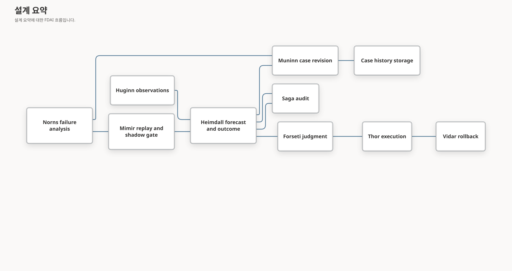

# 예측 학습 및 케이스 히스토리

이 설계는 각 예측을 관측된 실제 결과와 대조해 종료하고, 전체 증거를 개정 번호 기반 사례
이력으로 보존하며, 모델이 실제 운영 동작을 직접 바꾸지 못하게 하면서 FDAI가 더 안전한 detector
개선을 제안하도록 합니다.

> **구현 범위:** Azure가 구현 대상입니다. Core 계약은 cloud-provider-neutral하게
> 유지합니다. 새 동작은 shadow 모드에서 시작합니다.
>
> **에이전트 경계:** Pantheon은 정확히 15개 에이전트로 유지합니다. 머신 작업 흐름 협업은
> 스키마로 검증한 pub/sub만 사용합니다. 새 에이전트나 직접 에이전트 호출을 추가하지 않습니다.

## 설계 요약

예측은 horizon 종료 후 실제 결과와 대조되어야 학습 증거가 됩니다. Heimdall은 예측
결과를 소유하고, Saga는 변경 불가능한 감사 근거를 기록하고, Muninn은 사례 개정 번호를
구성하고 색인하며, Norns는 검토된 실패 집단을 off-path에서 분석하고, Mimir는 후보
재생, shadow 비교, 승격 및 롤백을 관리합니다.



## 에이전트 소유 액션

| 에이전트 | 트리거 | 소유 액션 | Published 객체 |
|-------|---------|-----------|------------------|
| Huginn | 메트릭, 인시던트 또는 breach 입력 | 실제 관측을 normalize하고 deduplicate | `Event` |
| Heimdall | 관측 또는 horizon 만료 | 예측을 만들고 예측 결과를 결정론적으로 종료 | `Forecast`, `ForecastOutcome`, `Drift` |
| Forseti | Proactive 발견 사항 | 제안된 대응을 판단하고 필요하면 중재 요청 | `Verdict`, `ArbitrationRequest` |
| Odin | 충돌하는 목표 | 제한된 대응을 선택하거나 보류 | `ArbitrationDecision` |
| Thor | 적격 판정 | 승격된 액션만 실행 | `ActionRun`, `ActionAttempt` |
| Var | 사람 승인 필요 | 독립적인 승인 결과 기록 | `Approval` |
| Vidar | 실패한 액션 | 선언된 롤백 실행 | `Rollback` |
| Saga | 모든 최종 전이 | Tamper-evident 근거 추가 | `AuditEntry` |
| Muninn | 예측 결과 감사 | Case-history 개정 번호 봉인 및 색인 | `StateSnapshot`, `ContextIndex` |
| Norns | 종료된 사례 집단 | 실패를 off-path 분석하고 inert improvement 제안 | `Pattern`, `RuleCandidate` |
| Mimir | Rule 후보 | 통제된 재생 및 shadow 승격 실행 | `Rule`, `Policy` |

구독자는 독립적으로 실행됩니다. 느리거나 실패한 사례 구체화는 결과 감사,
learning intake 또는 관련 없는 예측을 차단하지 않습니다. 런타임은 transient 구독자
실패를 dead-letter 처리하기 전에 두 번 재시도합니다. 안정적인 상관관계 및 멱등성
키로 재생을 안전하게 유지합니다.

배포된 루프는 기계적인 틱 발행기가 구동합니다. Huginn은 raw 틱을 `object.event`로
정규화하고, Heimdall은 설정된 대상과 메트릭 조합을 평가해 긍정, 부정 또는 판단 보류
평가를 변경 불가능한 에피소드로 기록합니다. 또한 텔레메트리 grace 기간 이후 due 에피소드를
종료하고 transactional 게시 발신함을 비웁니다. Poison 게시는 다른 에피소드를
막지 않도록 격리하고 dead-letter 처리합니다.

위반 예측의 게시 기록에는 평가기가 계산한 위반 예상 시각과 통제된 예측 구간의 신뢰 수준을
버전이 있는 `approval_timing` 메타데이터로 보존합니다. 승인 감독자는 기존 에피소드와 게시
기록을 정확히 읽고 계보, 시간, 대상, 구간을 확인해 제한된 응답 시간만 도출합니다.
이 메타데이터가 없는 이전 게시 기록은 학습 자료로 유효하지만 승인 응답 시간을 줄이지
못합니다. 새 결과, 새로운 측정값, 권한을 추가하지 않습니다.

## 예측 결과 계약

`ForecastOutcome`은 Heimdall만 소유하고 `object.forecast-outcome`으로 publish하는 versioned
객체입니다. 다음을 기록합니다.

- 안정적인 결과 및 prediction id
- detector 및 구성 버전
- 대상 다이제스트, 메트릭, feature 기준 시점, breach 조건식 및 horizon
- predicted 값 및 uncertainty 간격
- 가능한 경우 관찰된 값 및 actual breach 시간
- 최종 라벨: `true_positive`, `false_positive`, `false_negative`, `late_breach`,
  `magnitude_error`, `intervention_censored` 또는 `unscorable`
- intervention 및 근거 참조, 텔레메트리 완전성 및 close 시간

에피소드 원장은 `predicted_breach`, `predicted_no_breach`, `abstained` 평가도 기록합니다. 세
상태를 모두 저장해 재현율 denominator를 보존하고 모델 miss와 파이프라인 miss를 구분합니다.
Horizon 채점은 이벤트 시간을 사용합니다. Horizon 이후 breach는 해당 horizon의 false 부정이
아니며 magnitude는 첫 breach 샘플이 아니라 horizon 시점 관찰된 값을 간격과 비교합니다.

적격한 선행 prediction이 없는 실제 breach는 prediction id 없는 false-negative 결과를
만듭니다. At-least-once 전달은 안정 결과 id로 deduplicate합니다. 누락 텔레메트리,
maintenance overlap 및 리소스 deletion은 성공한 prediction으로 바꾸지 않습니다.
경계 검증은 JSON 스키마와 타입이 지정된 모델 모두에서 라벨별 breach, intervention,
관측 및 간격 근거를 요구합니다. 타입이 지정된 모델은 breach가 선언된 예측 horizon
밖에 있는 magnitude 오류도 거부합니다.

버전 `1.1.0`은 텔레메트리 완전성과 별개로 범위가 제한된 `scoring_exclusions`를 추가합니다.
개입 이력 미확인, 맥락 불일치, 제외 구간, 리소스 삭제, 관측된 장애에 영향을 준 개입은
에피소드를 `unscorable`로 만듭니다. 이때 완전한 지표를 누락된 것으로 바꾸지 않습니다.
평가 제외 사유가 있으면 점수가 있는 결과를 만들 수 없습니다. 버전 `1.0.0`은 계속 읽을 수
있으며 직렬화 형식도 유지합니다. 맥락 근거가 연결되지 않은 배포에서는 새 예측 평가를
보류합니다. 개입 목록이 비어 있다는 사실만으로 개입이 없었다고 확정하지 않습니다.

## 맥락 기반 판정 계약

관측 사실, 예상 상태, 서비스 영향, 대응 방식, 학습 적격성, 실행 적격성을 독립적으로
판정합니다. 테스트 환경이라는 설명은 예상 장애 선언이나 정책 예외가 아닙니다. 실제 부하
테스트에서 얻은 관측은 신뢰할 수 있는 테스트 근거이며, 합성 데이터나 개입 없는 운영 장애
사례로 취급하지 않습니다.

사용자 진술과 공유 문서는 기존 의미 판단 경계를 거칩니다. 정확한 대상, 출처 참조, 책임
담당자, 적용 기간, 기록 시각, 예상 신호와 한도, 요청한 처리 방식으로 맥락을 구조화합니다.
대상이나 기간이 없거나 진술이 충돌하면 명확화 또는 검토가 필요합니다. 개인 기억 저장 동의는
공유 운영 예외를 승인하지 않습니다. 온톨로지를 확장하기 전에 검토된 `Environment`,
`Experiment`, `ChangeWindow`의 의미를 재사용합니다. 타입 선언만으로 런타임 발행 경로가
생기지는 않습니다. 정책 변경은 기존 검토된 거버넌스 경로를 사용하며 대화에서 활성 카탈로그에
직접 기록하지 않습니다.

Forseti는 각 판정을 정확한 근거, 맥락, 정책 개정 번호에 연결합니다. 예상 신호는 현재 승인된
정확한 범위와 기간 안에서만 처리 방식을 바꿀 수 있습니다. 보안, 데이터 무결성, 예상 밖
증상, 영향을 받은 운영 의존성에 대한 보호는 유지됩니다. 만료, 철회, 출처 소실, 충돌은 예외
적용 자격을 없애지만 관측을 지우지 않습니다. Thor는 실행 직전 현재 권한과 모든 액션 안전
조건을 다시 검증합니다. 실행 도중 맥락이 바뀌면 해당 액션의 중단 및 복구 계약을 따르며
실행 시도 기록을 지우지 않습니다.

진술 승인과 관측 근거 수용은 별개입니다. 예상 테스트 신호의 대응을 억제하려면 정확히 검토된
진술과 현재 측정값, 서비스 영향, 보호 대상 신호 분류를 결합한 독립 근거가 모두 필요합니다.
호출자가 전달한 플래그만으로 운영 환경에 영향이 없다고 확정하지 않습니다. 맥락을 결합해도
기존 판정의 자율성 상한은 낮출 수만 있습니다.

`GovernedTestContextStore`는 대상별 원자적 비교 후 갱신과 감사를 통해 제안, 검토 완료,
최종 철회 개정을 보존합니다. 검토 시 제안된 범위, 요청자, 출처, 정책은 바꿀 수 없습니다.
각 전이에는 독립적인 `test-context-transition` 검증 증적이 필요합니다. 구간 중첩, 자체 검토,
개정 충돌, 검증 중 만료는 활성화를 차단합니다. 런타임은 신호별 조회기를 Forseti에 연결하며
Forseti는 진술과 관측을 각각 다시 검증합니다. 저장 서비스 자체가 대화 문장을 인증하거나
사람 검토 채널을 제공하지는 않습니다.

수용된 `create.test_context` 의미 판단은 일반 채팅 응답을 통해 `TestContextDraft` 초안을
전달합니다. 대상, 신호, 상하한, 시간대가 명시된 시각은 정확한 원문 구간에 결합하며 누락된
필드는 확인 질문으로 처리합니다. 초안 자체에는 접근 범위나 검토 권한이 없습니다.
공유 SDK는 기존 초안, 명령, 적용 결과 모델과 버전 `1.0.0` 스키마를 제공합니다. JSON Schema는 구조를 검사하고 `JsonSchemaContractValidator`는 타입 모델의 범위, 시간 구간, 역할, 제안 및 검토 조건도 검사합니다. 어느 검사도 principal을 인증하거나 근거 허용 권한을 부여하지 않습니다. 개별 스키마는 `scripts/quality/contracts/generate_test_context_schemas.py`로 생성합니다. 브로커 호환성, 소비자 배포 순서, 운영 근거는 별도 검증 요건으로 남습니다.
Console은 유효한 초안을 해석하고 재생하지만, 범위 및 정책 선택과 제출 화면은 아직 구현되지 않았습니다.
인증된 `POST /test-context/proposals`, `/test-context/reviews`, `/test-context/revocations`는
Operator 발신함에 명령을 보존합니다. Huginn이 입력을 정규화하고 Var가 독립 검토를 발행하며
Mimir가 정책 개정을 기록하고 Saga가 감사합니다. Thor는 이 검토를 실행 승인으로 처리하지 않습니다.
`GET /test-context/commands/{proposal_id}`는 요청자 본인의 전달 및 적용 메타데이터만 노출합니다.
Saga는 Mimir의 정확한 개정을 감사한 뒤 `core.test-context.projections`로 결과를 발행합니다.
Operator는 원래 요청자, 명령 다이제스트, 대상, 정책, 개정에 결과를 원자적으로 결합합니다.
`published`는 브로커 수락이며, `policy_application=recorded`에는 이 감사된 결과가 필요합니다.
결과가 없으면 `unknown`이며 `current_authorization=not_evaluated`는 현재 활성화를 뜻하지 않습니다.
철회 이후 과거 검토가 그대로 재전달되면 원래 적용 사실만 확인하고 기록을 갱신하지 않습니다.
결과 출처 준비 확인과 스트림 종료는 각각 5초로 제한합니다. 실패한 작업은 준비 불가로 전환하며
명시적 재시작까지 실패 위치를 유지합니다. 잘못된 JSON은 정제된 DLQ 기록 후 처리 위치를 확정합니다.
Forseti는 판단 중 출처 변경을 다시 확인합니다. ActionRun은 정확한 맥락 참조를 보존하고 Thor는
실행기 호출 직전에 현재 출처와 검증 증적을 확인합니다. 진행 중인 실행의 중지는 기존 액션의
중지 및 복구 계약을 따르며 맥락이 실행 권한을 부여하지 않습니다.

### 예측 근거 수용

지표의 완전성을 판단하려면 범위가 제한된 관측 정책이 필요합니다. 서로 다른 표본 시각,
유한한 값, 전체 예측 구간의 관측 범위, 허용 가능한 최대 누락 간격을 확인합니다. 종료 시점
표본 하나, 서로 충돌하는 중복 표본, 불완전한 구간 관측은 충분하지 않습니다. 수집 유예 기간은
늦게 도착하는 데이터를 허용하지만 평가 구간을 늘리거나 종료 시점 관측을 만들어 내지 않습니다.

지표 어댑터에 주입하는 `ForecastObservationPolicy`의 기본값은 서로 다른 표본 세 개,
예측 구간의 90%에 해당하는 표본 분포 범위, 경계 간격을 포함한 최대 누락 간격 300초,
원시 표본 10,000개, 조회 마감 5초입니다. 차원 집합은 하나여야 합니다. 적용한 정책과
접근 범위, 대상, 관측 구간에 결합된 표본 다이제스트를 관측에 함께 남깁니다. 이는 지표
수용 검사이며 개입이 없었다는 증명은 아닙니다. 아래 맥락 결합은 별도로 필요합니다.

관측 어댑터는 독립적인 출처에서 얻은 개입, 삭제, 제외 구간 근거를 정확한 대상과 이벤트
시각으로 결합합니다. 결합 결과를 얻을 수 없으면 개입이 없었다는 증명이 아니라 미확인
상태입니다. 관련 개입이 있으면 개입 없는 예측 평가에서 분리합니다. 관측된 복구만으로 예방
성공이나 인과적 효과를 확정하지 않습니다. 부정 예측과 판단 보류에도 완전성과 개입 영향으로
인한 평가 제외 사유를 보존해 분모의 누락을 확인할 수 있게 합니다.

`FDAI_FORECAST_HISTORY_SOURCES_JSON`이 설정되면 Heimdall은 누락되거나 만료되거나 불완전한
보존 이력을 정규화된 상태 전이 저장소에서 수집합니다. 정확한 접근 범위와 대상마다 검토된
네 가지 출처 매핑이 모두 필요합니다. JSON 필드와 상태는 중복될 수 없으며 대상은 최대 64개입니다.
조회는 도착 상태를 필터링하지 않고 출처별 전이를 최대 64개 읽으며 전체 수집을 5초로 제한합니다.
미등록 상태, 충돌하는 전이 순서, 합성 기록, 잘린 결과, 불완전한 수집 범위가 있으면 평가를 보류합니다.
상태 유지형 매핑은 활성 및 비활성 상태와 예측 시작 전 최대 하루의 조회 기간을 지정합니다.
예측 시작 시각의 상태를 기준으로 적격성을 판단하며 초기 상태를 알 수 없으면 미확인으로 유지합니다.
`StateStoreForecastContextProvider`는 각 출처와 정확한 집계 결과를 독립 검증한 뒤 보존합니다.
출처 신원, 개정, 접근 범위, 대상, 기간, 수집 지점의 완전성, 최신성이 모두 일치해야 합니다.
지표, 맥락, 검증 결합에도 별도의 총 마감 5초를 적용합니다. 이력이나 검증기 실패 시에도 이미 얻은
측정값과 명시적인 평가 제외 사유를 보존합니다. 이 수집기는 공급자 원본 이력이나 독립 증적을
발급하지 않으며, 설정이나 완전한 빈 조회 결과만으로 근거 수용 자격을 부여하지 않습니다.

이력 수집은 액션, 변경, 리소스 수명 주기, 제외 구간의 수집 범위와 그 집계 결과에 대한 독립
검증 증적을 요구합니다. 정정은 정확한 이전 맥락 digest를 지정하고 접근 범위와 관측 구간의
CAS로 제한된 개정 이력에 추가합니다. 이전 근거는 덮어쓰지 않습니다. 과거 기록이 그대로
재전달되면 수신만 확인하고 현재 개정으로 되돌리지 않습니다. 늦게 도착한 수집 근거와 갱신된
증적을 반영하되, 종료된 예측 결과를 수정하거나 출처의 완전성을 임의로 인정하지 않습니다.

읽기 전용 외부 변경 근거 수집기는 검토된 ARG 및 Activity Log 변경 출처에서 추가 전용
자원 목록 기록을 정확한 접근 범위와 대상으로 나누어 읽습니다. 최신 자원 기록만 남기거나
이전 상태를 만들어 내는 대신 수용된 모든 관측 참조, 출처 신원과 개정, 이벤트 시각과 기록
시각, 정정 관계를 보존합니다. 알려진 시점의 기준값, 기록의 워터마크, 이어 읽기 커서로
각 페이지를 제한하며 요청당 최대 256행과 31일을 읽습니다. 대기 중이거나 충돌하는 이벤트는
수용하지 않고 중복 전달과 결과 제한을 명시합니다. 이어 읽기 커서는 출처의 수집 범위가
완전하다는 증명이 아닙니다. 진행 중인 트랜잭션이나 앞서 누락된 수집으로 공백이 남을 수
있습니다. 기록 구간을 끝까지 읽어 결과가 비어 있어도 시작 시점의 독립적인 수집 확인
지점이 없으면 범위는 불완전합니다. 이 행은 근거일 뿐이며 평가 입력이나 실행 권한이
아닙니다. 상태 전이 수집기는 불완전한 수집 범위를 계속 거부합니다.

에피소드 종료 기록은 `ForecastOutcome`을 발행하지 않는 경우에도 관측을 전달합니다. Core의
`core_forecast_closure_observation_20260914` 이행은 비어 있을 수 있는 `closure_observation`
메타데이터를 추가합니다. 새 기록은 관측, 종료 상태, 발행 발신함을 원자적으로 저장하며 내용이
다른 재시도는 충돌로 처리합니다. 과거의 null 값은 근거 누락으로 유지합니다. 읽기 전용 상태
집계는 완전, 부분, 사용 불가, 누락 관측을 구분합니다. 변경된 읽기 및 쓰기 코드를 배포하기
전에 Core 이행을 적용해야 하며, 롤백에는 쓰기 중지와 근거 내보내기가 필요합니다.

### 정정과 재사용

Saga는 각 판정 기준 시점에 알려져 있던 내용을 보존합니다. Muninn은 늦은 정정을 새 사례
개정 번호로 추가하며 이전 예측이나 판정을 덮어쓰지 않습니다. 분석은 사례마다 적격한 개정
번호 하나를 선택하고 과거 평가를 재현할 수 있도록 고정된 개정 번호 집합을 보존합니다.
철회와 삭제는 종속된 검색 및 후보 적격성을 무효화합니다. 다이제스트는 데이터 공유 권한을
부여하거나 비공개 근거를 익명화하지 않습니다.

Norns는 접근 범위가 허용된 균형 잡힌 사례 집단에서 비활성 패턴과 후보만 발행합니다.
Mimir는 같은 인시던트를 하나로 묶은 시간순 평가, 테스트와 운영 집단의 분리, 기존 탐지기와
후보에 동일하게 고정된 입력을 사용합니다. 두 사례로 후보를 구성했다고 승격 근거가 되지는
않습니다. 설정된 최소 관측 일수와 사례 수는 하한이며 불확실성, 보호 지표 악화, 정책 위반이
있으면 승격을 차단합니다. 대조군을 만들기 위해 검증된 복구를 보류하지 않습니다.

현재 T1 검증 증적은 불변 사례뿐 아니라 전체 이벤트, 액션 매개변수, 서명, 규칙을 결합합니다.
만료는 관측 자체의 과거 시각이 아니라 제공자 조회를 마친 뒤의 판단 시각으로 검사하며 만료
시각부터 재사용을 보류합니다. 대상이나 매개변수가 바뀌면 새 검증 증적이 필요합니다. 이전
범위 다이제스트로 발행된 증적은 새 재사용을 승인할 수 없습니다.

### 구현 및 검토 게이트

| 패키지 | 완료 근거 |
|---------|---------------------|
| P0 - 계약 | 독립적인 여섯 판정, 소유권, 개정 번호, 실패 처리가 검토되었습니다. |
| P1 - 결과 정합성 | 종료 표본만 있는 경우, 누락, 충돌 표본, 개입, 삭제, 지연 도착 테스트가 정확한 평가를 증명합니다. |
| P2 - 맥락 수용 | 정확한 대상의 의미 입력, 독립 검토, 만료, 철회, 충돌 테스트가 무권한 예외를 차단합니다. |
| P3 - 판정 통합 | 버전이 고정된 같은 입력으로 대응, 학습, 권한 판정을 재현하고 Saga 감사가 남습니다. |
| P4 - 영속 재사용 | Muninn 사례, Norns 패턴, 현재 근거 기반 T1 재사용이 중복 전달, 재시작, 정정 후에도 유지됩니다. |
| P5 - 후보 측정 | 고정된 재현 및 shadow 근거로 보호 지표 악화 없는 개선을 증명하고 강등을 반복 실행할 수 있습니다. |
| P6 - 운영 검증 | 읽기 전용 설명, 마감, 구독자 격리, 복구, 별도 승인된 비운영 환경 실증 근거가 있습니다. |

각 하드닝 라운드는 서로 다른 검토 항목을 열 개 이상 점검하고 실제 발견 사항과 심각도를
기록하며 수정 후 집중 회귀 검사를 실행합니다. 제공한 범위 안에서 Low보다 높은 미해결
발견 사항이 없어야 완료됩니다. 외부 검증이 없으면 로컬 테스트 통과로 대신하지 않고 열린
작업으로 남깁니다.

## 사례 이력 모델

사례는 접근 범위에 결합된 안정 신원과 추가 전용 개정 번호를 가집니다. 인시던트가
reopen되거나 늦은 trusted 근거가 도착하면 이력을 덮어쓰지 않고 개정 번호를 추가합니다.
개정 번호는 이전 출처 신원과 다이제스트를 모두 보존해야 합니다. 새 근거는 추가할 수 있지만
이미 봉인된 근거를 바꾸거나 누락할 수 없습니다.

### 대상 PostgreSQL hot 인덱스

PostgreSQL은 제한 없는 근거 본문이 아니라 조회 가능한 메타데이터를 저장합니다.

- `case_history`: 신원, 종류, 상관관계 및 인시던트 참조, 수명 주기 상태, 최신
  개정 번호, 라벨, 범위가 제한된 범용 메타데이터, 선택적 예측 detector 및 메트릭 필드,
  보존, legal 보류 및 최신 매니페스트 참조
- `case_history_revision`: 개정 번호 number, 상위 다이제스트, 매니페스트 다이제스트, 저장소 참조,
  감사 순서 범위, event-time 기준 시점, 스키마 및 민감정보 제거 버전, 라벨, censoring 사유,
  owning 에이전트 및 봉인 시간
- `case_history_chunk`: 제한되고 민감정보 제거된 텍스트, 조각 종류, 임베딩, 임베딩 모델
  버전, 출처 매니페스트 다이제스트, access-scope 다이제스트 및 deletion 계보

추가 전용 감사 로그가 근거 권위를 유지합니다. 이행 중에는 이전 방식 StateStore
변환 결과가 읽기 권한을 유지하고 PostgreSQL은 shadow 쓰기를 받습니다. Keyset backfill은
전체 산출물 체인을 재구성하고 삭제된 신원을 zero-size tombstone으로 보존합니다.
저장된 zero-mismatch 표시를 런타임에서 확인한 뒤에만 relational 읽기를 시작할 수 있습니다.
Operational 액션 및 인시던트 개정 번호는 예측 값을 만들지 않고 detector와 메트릭 필드를
null로 유지합니다. 허용 목록 메타데이터는 StateStore와 PostgreSQL 양쪽에 저장되며 backfill 때 각
변경할 수 없는 산출물에서 복원됩니다. 기존 예측 메타데이터는 계속 유효합니다.

### 변경할 수 없는 산출물

산출물 저장소는 정본 JSON 바이트와 매니페스트를 내용 기반 주소를 가진 참조 아래에
기록합니다. 각 개정 번호는 prediction-time 사실, 버전, 관측, intervention, 결정,
승인, 액션, 롤백, RCA 인용, SLO 복구, recurrence 및 source-record 다이제스트를
포함합니다. Raw cloud 페이로드, 자격 증명, 제한 없는 도구 출력, 프롬프트 및 hidden reasoning은
저장하지 않습니다. 봉인 경계는 중립적인 필드 이름 아래에 있는 일반적인 plain-text 및
percent-encoded 자격 증명 형태, 자격 증명을 포함한 URI user information, 대소문자나 구분자
형식이 다른 일반 시크릿 키도 거부합니다.

산출물 생성은 메타데이터 덧붙이기보다 먼저 실행됩니다. 메타데이터가 명확히 거부되면 해당 시도에서
새로 생성한 산출물만 제거합니다. 덧붙이기 결과를 확인할 수 없으면 안전한 재시도를 위해 산출물을
보존하고 덧붙이기 오류와 검증 오류를 모두 유지합니다.

기본 Azure 어댑터는 워크로드 신원, 공개 접근 및 키 authentication 비활성화,
versioning, 비공개 networking, deployment-approved 보존 또는 legal 보류가 적용된 비공개
Blob 컨테이너를 사용합니다. Customer-scoped 산출물은 Git에 저장하지 않습니다.

### 분석을 위한 수집

수집은 검색 전에 용도 및 접근 범위를 authorize하고 산출물의 사례, 개정 번호,
상관관계, 용도, 범위 및 상위 신원을 메타데이터와 대조합니다. Resource 타입, 메트릭,
detector 버전, 결과 라벨 및 시간에 대한 결정론적 필터를 적용한 뒤 pgvector
순위를 수행합니다. Detector 및 메트릭 필터도 실패 및 컨트롤 집단 한도보다 먼저
적용되므로 더 최신인 관련 없는 detector 기록이 적격 사례를 가릴 수 없습니다. Retriever는
제한된 사례 카드와 출처 다이제스트를 반환하며 모델은 임베딩을 출처 근거로 취급할 수
없습니다.

Norns는 실패 사례와 함께 일치하는 정확한 결과 및 검열된 컨트롤을 받습니다. 이는 생존자
편향과 과도하게 보수적인 임계값 변경을 방지합니다. 검토기를 실행하려면 실패 사례와 일치하는
컨트롤이 각각 하나 이상 필요합니다. 모든 분석 주장은 사례 id, 개정 번호 및 매니페스트
다이제스트를 인용합니다. 근거가 없거나 충돌하면 후보를 만들지 않습니다.

## Learning 및 승격

Norns는 먼저 텔레메트리 quality, 기준선 또는 seasonality 표류, 토폴로지 또는 개념 표류,
horizon 선택, 임계값 또는 calibration 오류, intervention censoring 및 detector-version
회귀를 결정론적으로 분류합니다. Off-path 모델은 모호한 잔여만 분석하며 inert
후보만 만들 수 있습니다.

Mimir는 근거에 기반한 출처 이력이 있는 후보만 수락합니다. 후보는 동일 사례에서
incumbent와 rolling-origin 재생 및 실제 운영 shadow 비교를 수행합니다. 승격에는 최소
closed 샘플 및 관측 일, confidence-bounded improvement, guard-metric 무회귀 및 정책
escape 0건이 필요합니다. 회귀는 detector 또는 정책을 자동으로 shadow로 되돌립니다.

## 보존 및 deletion

### 완료를 위한 상세 설계

`query.operating_patterns`는 인증된 principal, 사례 접근 범위, 목적, 인자, 활성 release에
결합된 독립 `case-history-read` 검증 증적을 요구합니다. 현재 출처를 다시 확인하고 재계산한
제한된 요약만 반환하며 과거 액션 매개변수는 노출하지 않습니다. T1은 검증 전후에 현재 사례
개정을 별도로 확인하며 접근 범위가 없는 과거 운영 사례는 보류합니다. 비활성 Pattern 발행이
T1 라이브러리 등록이나 승격을 의미하지는 않습니다.

남은 구현은 선택적인 보조 함수가 아니라 하나의 근거 흐름으로 연결합니다.

| 경계 | 소유자와 입력 | 영속 결과 | 실패 처리 |
|----------|-----------------|----------------|------------------|
| 과거 수집 범위 | Heimdall이 정규화된 액션, 변경, 리소스 수명 주기, 실험 이력과 출처별 수집 체크포인트를 읽음 | 정확한 접근 범위, 대상, 기간, 출처 개정, 이벤트 참조와 완전성 근거 | 출처 누락, 잘린 페이지, 늦은 수집 기준점, 검증되지 않은 체크포인트는 이벤트가 없어도 미확인으로 처리함 |
| 맥락 제안 | Bragi가 인증된 사용자 발화를 대상, 예상 신호 범위, 적용 기간, 출처 참조로 구조화함 | 인증된 요청자와 연결된 비활성 제안 개정 | 의미 근거나 신원이 없으면 명확화하며 키워드 해석이나 직접 예외 기록은 하지 않음 |
| 검토와 활성화 | Var가 독립적으로 인증된 검토를 제공하고 Mimir가 검토된 정책 변환 결과를 소유함 | 불변 검토 개정과 만료·철회를 반영한 현재 포인터 | 자체 검토, 개정 불일치, 동시 검토, 겹치는 진술의 충돌, 검증 증적 부재는 활성화를 차단함 |
| 판정과 실행 | Forseti가 현재 진술과 독립 검증된 관측을 결합하고 Thor가 일반 실행 게이트를 사용함 | 여섯 축의 판정, 정확한 진술·관측·정책 다이제스트와 Saga 감사 | 만료나 철회는 적격성을 없애며 대기 중이던 과거 판정이 이를 복원할 수 없음 |
| 패턴 재사용 | Muninn이 정확한 현재 사례 개정을 확인하고 Norns와 Mimir가 기존 후보·검토 역할을 유지함 | 범위별 비활성 Pattern과 고정된 사례 식별자 | 정정, 삭제 시작, 출처 사용 불가, 집단 불일치는 현재 재사용과 적격성 평가를 차단함 |
| 파생 데이터 삭제 | Muninn의 기존 보존 작업자가 원본 삭제 선점을 따름 | 최종 사례 삭제 표시 전에 사례 집단·스냅샷·Pattern의 복사 데이터 제거 | 제거 실패 시 삭제 대기로 남겨 재시도하며 모든 삭제 단계보다 법적 보존을 먼저 확인함 |
| 적격성 평가와 설명 | 기존 읽기 권한과 O3-O7 측정 경계가 동일한 고정 식별자를 소비함 | 누락 사항을 포함한 읽기 전용 근거와 독립 검토된 후보 측정 | 단위 테스트를 실환경 관측 일수, 배포, 승격, 운영 효과 성공으로 계산하지 않음 |

설계 검토에서는 빈 감사 조회를 완전성 증명으로 삼는 방식, 검토된 개인 기억을 공유 테스트
예외로 삼는 방식, 조회 차단을 삭제로 간주하는 방식을 배제했습니다. 별도 승격 레지스트리와
에이전트 직접 호출도 추가하지 않습니다. 기존 브로커 재시도, 원자적 비교 후 갱신, 검토 신원,
사례 삭제 선점, 독립 검증 증적이 계속 기준이 됩니다.

경계별로 구현하고 검증하되 완료는 연결된 전체 흐름으로 판정합니다. 수집 범위 누락, 오래된
출처 개정, 겹치는 진술, 자체 검토, 동시 갱신, 저장 도중 원본 삭제, 삭제 실패와 재시작,
범위 밖 조회, 후보 정정, 실행 직전 만료, 발행 중단을 검사합니다. 배포 검증에는 명시적으로
선택한 비운영 대상과 독립적으로 보존한 증적이 여전히 필요합니다.

각 사례는 용도, 접근 범위, 보존, deletion due date 및 legal-hold 메타데이터를
가지며 활성 보류에는 비어 있지 않은 권한 참조가 필요합니다. Deletion은 먼저 모든
개정 번호 산출물 참조를 포함한 영속 의도를 기록합니다.
Deletion pending 상태에서는 새 개정 번호와 분석을 차단합니다. 그다음 Muninn이 전체 산출물
체인, 조각 및 임베딩을 제거한 뒤 hot 인덱스를 tombstone합니다. 감사에는 non-sensitive
deletion 기록과 다이제스트를 유지합니다. 산출물 또는 최종 메타데이터 단계가 실패하면 의도는
retryable 상태로 남고 완료로 표시되지 않습니다. 기계 스케줄러는 기본 이벤트 버스에 제한된 raw
보존 틱을 publish합니다. Huginn이 이를 정규화하고 Muninn만 타입이 지정된 `object.event` 보존
신호를 소비해 due deletion을 적용합니다. `FDAI_CASE_HISTORY_RETENTION_TICK_SECONDS`는 cadence를
제어하며 기본값은 1일입니다. 중복되거나 재생된 틱은 멱등적합니다. Raw 이벤트가 전달하는
시각은 진단용일 뿐입니다. Muninn은 trusted UTC 시계로 due date를 평가하므로 유입
발행기가 deletion을 앞당길 수 없습니다. 보존 발행기 작업이 실패하면 이후 틱을
조용히 비활성화하지 않고 런타임이 unsuccessful exit로 종료됩니다.

새 파생 사례 집단, 고정 스냅샷, Pattern 본문, 발행 표시는 접근 범위별
`CaseHistoryProjectionStore` 개정 하나를 공유합니다. 첫 생성과 감사는 원자적으로 수행하고
이후 쓰기는 비교 후 갱신을 사용하며 경쟁이 발생하면 현재 원본 사례를 다시 검증합니다.
삭제는 비어 있는 저장소에서도 같은 개정을 갱신하므로 진행 중인 첫 쓰기도 삭제 선점을
우회할 수 없습니다. 파생 데이터 제거가 끝나야 원본을 최종 삭제하며 실패하면 재시도합니다.
Muninn에는 사례 본문을 복사한 캐시를 두지 않습니다. 범위마다 항목 512개, 4 MiB, CAS 시도
3회로 제한하며 포화 시 근거를 버리지 않고 처리를 지연합니다. 런타임은 기존 Muninn 보존
틱에 이 저장소를 연결합니다. 아직 배포하지 않은 새 저장 형식이며 이전 실험용
`operational-case-fingerprint-cohort:v2:*` 상태 키를 자동 이행하지는 않습니다. 이전 기록 정리,
브로커 보존, 후속 후보·임베딩 삭제는 각각 검증된 절차가 필요합니다.
T1 벡터 정리는 새 보존 정책이 아니라 기존 원본 삭제 의도를 따릅니다. 쓰기와 삭제는 총 15초
제한 안에서 PostgreSQL 트랜잭션 잠금을 공유합니다. 배치마다 본문 없는 사례 및 signature 차단
표식과 최대 1,000개 행 삭제를 원자적으로 커밋합니다. 행이 남으면 원본은 삭제 대기로 유지하며
재시도에서 이어갑니다. 늦은 쓰기는 차단된 사례나 signature를 복원할 수 없습니다. upsert로
기존 사례와 액션을 바꾸지 못하지만, 같은 액션의 통계만 갱신하는 기존 방식은 유지합니다.
런타임은 사례 메타데이터 DSN이 아니라 `FDAI_T1_PATTERN_LIBRARY_DSN`을 사용합니다. 과거의
범위 없는 참조도 전역 고유 사례 식별자로 삭제합니다. 명시된 범위가 충돌하거나 법적 보존 중이면
삭제를 차단합니다. 단독 DELETE는 재생성을 허용하고 조회 거부는 본문을 남기므로 제외합니다.
이 보호는 T1 라이브러리만 대상으로 하며 브로커와 다른 후속 사본의 정리는 별도 작업입니다.

### 보존된 복사본 인벤토리

다음 인벤토리는 콘텐츠를 포함한 복사본과 변경 불가능한 참조를 구분합니다. 비민감 감사 계보에
해당하는 영속 참조는 원본 본문을 삭제한 뒤에도 유지할 수 있습니다. 콘텐츠를 포함한 복사본은
원본을 삭제 표식으로 전환하기 전에 원본 삭제 선점과 법적 보존을 따라야 합니다.

| 표면 | 보존 자료 및 작성자 | 삭제 및 법적 보존 상태 | 제공 상태 |
|------|---------------------|-------------------------|-----------|
| Azure Blob 사례 개정 번호 | Muninn이 `CaseHistoryMaterializer`를 통해 `case-history/<case>/<revision>/<digest>.json`에 기록한 전체 개정 JSON | 원본 레코드가 법적 보존과 전체 개정 번호 체인을 제공합니다. `CaseHistoryRetentionService`는 메타데이터 삭제 표식 전에 기록된 모든 Blob 참조를 삭제합니다. | 완료. |
| 권위 있는 StateStore 메타데이터 | `case-history:latest:<case>`의 최신 사례 메타데이터, 저장소 참조, 삭제 의도, 보존 권한, 삭제 표식 | 감사되는 CAS가 삭제 시작 후 새 개정 번호를 차단합니다. 법적 보존은 삭제 선점을 차단하며 아티팩트 삭제 실패 시 의도를 재시도 가능하게 유지합니다. | 완료. |
| PostgreSQL 메타데이터 shadow | `DualWriteCaseHistoryMetadataStore`가 `case_history`와 `case_history_revision`에 미러링한 메타데이터 및 변경 불가능한 아티팩트 참조 | 권위 저장소의 보존 및 삭제 전이가 shadow 전이와 일치해야 합니다. 불일치는 안전하게 실패하며 삭제 시 최신 아티팩트 참조를 비우고 기존 청크를 삭제됨으로 표시합니다. | 메타데이터 및 참조 완료. |
| PostgreSQL 청크 스키마 | `case_history_chunk`에 범위가 제한된 텍스트와 384차원 임베딩을 보존할 수 있습니다. | 현재 이 테이블을 채우는 런타임 작성 경로나 읽기 경로가 없습니다. 현재 구성에서 실제 보존 복사본이 아닙니다. 향후 연결할 때는 활성화 전에 원본 삭제 선점과 보존을 결합해야 합니다. | 선언됐으나 연결되지 않음. |
| 현재 파생 StateStore 변환 결과 | Muninn이 작성하는 `case-history-derived:v1:<scope>` 내부의 cohort, 고정 스냅샷, Pattern 사례 본문, 발행 표식 | 하나의 범위 CAS가 현재 원본 개정 번호를 다시 검증합니다. 삭제 작업은 원본 삭제 표식 전에 선점된 사례를 인용하는 모든 항목을 제거하며 법적 보존 또는 삭제 의도 누락 시 안전하게 실패합니다. | 완료. |
| 이전 최상위 StateStore 변환 결과 | 과거 `operational-case-fingerprint-cohort:v2:*` cohort, 스냅샷, Pattern, 발행 행 | 현재 코드는 이 접두사를 새 변환 결과 내부의 논리 신원으로만 사용하며 최상위 행을 더 이상 작성하지 않습니다. 기존 행에는 원본에 연결된 법적 보존 또는 삭제 경로가 없습니다. | 마이그레이션 및 삭제 작업 미완료. |
| T1 pgvector 라이브러리 | `t1_pattern_library`가 임베딩, 작업 필드, 범위가 제한된 `OperationalCaseContext`를 보존하며 `PgVectorPatternLibrary`가 작성합니다. | 트랜잭션 범위 잠금이 영속 사례/서명 차단 표식을 기록하고 한 번에 최대 1,000개 행을 삭제합니다. 법적 보존, 범위 충돌, 데이터베이스 실패는 원본 삭제를 대기 상태로 유지합니다. | 완료. |
| Cohort 브로커 레코드 | `object.context-index`가 Muninn에서 Norns로 범위가 제한된 `PatternCase` 배열과 스냅샷 참조를 전달합니다. | Event bus 보존과 `.dlq`는 사례 수명 주기와 별개로 전송 페이로드를 보존합니다. 일반 redrive는 있지만 이전 페이로드 재생을 막는 원본 삭제 또는 법적 보존 차단 표식은 없습니다. | 브로커 보존 및 redrive 작업 미완료. |
| Pattern 및 후보 브로커 레코드 | `object.pattern`과 `object.rule-candidate`가 사례 참조, 다이제스트, 후보 근거, 검토 신원을 전달합니다. | 원본 아티팩트 본문은 없지만 소비자가 삭제 차단 표식을 다시 확인하지 않으면 재생으로 후속 복사본을 다시 만들 수 있습니다. 일반 DLQ 정책은 사례를 인식하지 않습니다. | 재생 검증 미완료. |
| Norns 프로세스 메모리 | `pending_candidates`와 `_pattern_publications`가 제한 중 후보 매핑과 Pattern 묶음을 보존합니다. | 버퍼는 범위가 제한되고 권한이 없지만 영속하지 않습니다. 속도 제한 시 작업을 메모리에 유지하며 프로세스를 재시작하면 손실됩니다. 법적 보존을 인식하는 복구 저장소가 없습니다. | 영속 재시도 작업 미완료. |
| Mimir 프로세스 메모리 | `_pending_candidates`, `_catalog_review_packages`, 멱등성 인덱스가 게시 완료 전까지 컴파일된 패키지와 변경 불가능한 사례 참조를 보존합니다. | 컴파일, 재시도, 게시 전에 현재 사례를 확인합니다. 게시 실패는 실행 중인 프로세스에서만 재시도할 수 있고 재시작 재구성 및 원본 삭제 정리는 없습니다. | 영속 패키지 복구 작업 미완료. |
| GitOps 검토 패키지 | 초안 pull request의 `rule-catalog/review-packages/operational-<digest>.json`이 후보 근거, 검토 결과, 변경 불가능한 사례 참조를 보존하지만 원본 개정 본문은 보존하지 않습니다. | Git 이력은 이 비민감 계보를 의도적으로 보존합니다. 패키지는 Rule을 활성화할 수 없습니다. 원본 삭제는 과거 검토 근거를 다시 쓰지 않고 재사용을 무효화해야 합니다. | 감사 계보로 유지하며 원시 본문이 추가되지 않는지 검증. |

현재 Core 구성에서 추가 사례 본문 캐시 또는 활성 임베딩 작성 경로는 발견되지 않았습니다.
연결되지 않은 청크 스키마, 프로세스 로컬 버퍼, 브로커 페이로드, Git 검토 참조를 명시적으로
기록하여 이후 작업이 읽기 경로가 없다는 사실을 물리 삭제로 오인하지 않도록 합니다.

## 검증

구현은 다음을 증명해야 합니다.

- 모든 예측 또는 actual breach가 하나의 최종 결과 또는 명시적 `unscorable` 상태에 도달
- 입력 reorder에도 정본 다이제스트가 안정적이며 근거 변경에는 다이제스트가 변경
- 추가 전용 개정 번호 충돌 탐지 및 멱등적 재생
- Synthetic detector 또는 메트릭 값 없는 액션/인시던트 영속성과 이전 방식 예측 행 호환성
- Cross-scope 수집 차단 및 시크릿/hidden-reasoning 거부
- 구독자 동시성, 실패 격리, 소유권 및 중복 전달 안전성
- 모델 출력이 활성 룰, detector, 승격 또는 액션을 직접 기록할 수 없음

## 연결 환경 검증 인계

연결 가능한 PC에서 같은 소스 개정을 사용하고 다음 로컬 회귀 검사를 먼저 실행합니다.

```bash
.venv/bin/python -m pytest -q --no-cov services/core-control-plane/tests/core/conversation/test_semantic_test_context.py services/core-control-plane/tests/agents/test_operational_context_verdict.py services/core-control-plane/tests/core/tiers/t1_lightweight/test_contextual_reuse.py services/operator-service/tests/test_test_context_commands.py
```

저장소 검사는 임시 스키마 생성 권한이 있는 루프백 PostgreSQL의 `FDAI_DATABASE_URL`을
프로세스 환경에 설정해야 합니다. 원격 DB를 대상으로 실행하지 않습니다. 자격 증명은 인자,
기록되는 명령 출력, 커밋 파일에 넣지 않습니다. 이 명령은 실제 모델을 호출하지 않습니다.

별도 승인된 비운영 환경 검증에는 배포 SHA, 정책과 출처 개정, 접근 범위 다이제스트, 시각,
변경 불가능한 증적 참조를 기록합니다. 기존 인증과 보호된 배포 절차를 사용하고 최종 상태를
직접 채우거나 테스트용 검증 증적을 재사용하지 않습니다.

| 단계 | 필요한 관측 근거 |
|------|------------------|
| 의미 제안 | 영어와 한국어 직접 요청이 정확한 원문 기반 초안을 생성함. 누락되거나 상대적인 시간은 확인 질문이 되며 인용은 맥락을 활성화하지 않음. |
| 인증된 수명 주기 | Contributor 제안, 별도 Approver 검토, 철회가 세 POST 경로를 통과함. 잘못된 역할, 신원 주입, 자체 검토, 범위 변경은 거부됨. |
| 내구성 있는 전달 | 브로커 중지·재시작과 만료된 lease 복구 후에도 명령 신원이 동일함. 수용된 전이에 Var Approval, Mimir Policy, Saga 감사가 남음. HTTP 202나 버스 발행만으로 완료하지 않음. |
| 관측과 실행 | 예상 신호는 실행하지 않고 보호 신호와 서비스 영향은 일반 게이트를 유지함. shadow 액션을 대기시킨 뒤 맥락을 철회·만료하고 실행 보류와 감사를 확인함. |
| 예측 이력 | 네 출처의 수집 범위 체크포인트와 집계 검증 증적이 평가에 선행함. 누락, 부분, 지연, 개입 근거에도 평가 제외 사유와 분모를 유지함. |
| 사례 수명 주기 | 정정·삭제 후 현재 범위의 설명에서 제외되고 재시작해도 본문이 복원되지 않음. 브로커, 과거 키, 후속 임베딩은 별도로 검증함. |
| 학습 승격 | 고정 O3-O7 재생과 측정된 shadow 근거가 기존 최솟값과 ActionType 게이트를 충족함. 로컬 검사가 경과 일수, 표본 수, 승격 권한을 만들지 않음. |

인증 누락, 불완전한 수집 범위, 429/503, 마감, 근거 충돌이 있으면 중단합니다. 정확히 누락된
단계를 기록하고 차단 상태를 유지합니다. 이 안내 자체가 실제 환경 검증의 성공을 의미하지 않습니다.

## 관련 문서

| 학습할 내용 | 문서 |
|-------------|------|
| 구현 상태 및 남은 작업 | [구현 원장](../../roadmap-implementation/rules-and-detection/prediction-learning-and-case-history.md) |
| Detection 및 예측 채점 | [관측성과 감지](observability-and-detection-ko.md) |
| 에이전트 소유권 및 토픽 | [에이전트 pantheon](../agents/agent-pantheon-ko.md) |
| 통제된 offline 기록 | [통제된 trajectory 데이터셋](../interfaces/governed-trajectory-datasets-ko.md) |
| 데이터 보존 및 privacy | [데이터 거버넌스](../architecture/data-governance-ko.md) |
