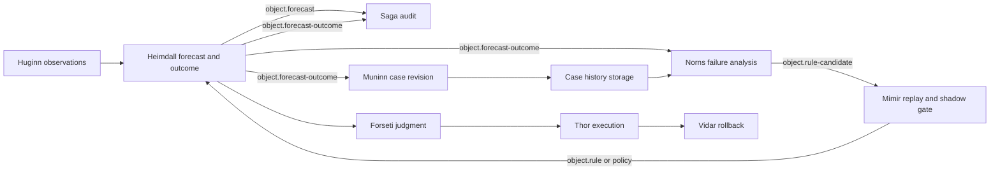

# Prediction Learning and Case History

This design closes each forecast against observed reality, preserves the complete evidence as a
revisioned case history, and lets FDAI propose safer detector improvements without letting a model
change live behavior directly.

> **Implementation focus:** Azure is the implemented target. Core contracts stay
> cloud-provider-neutral. New behavior starts in shadow mode.
>
> **Agent boundary:** The pantheon remains exactly 15 agents. Machine workflow collaboration uses
> schema-validated pub/sub only. No new agent or direct agent call is introduced.

## Design at a glance

A forecast becomes useful learning evidence only after its horizon closes. Heimdall owns the
forecast result, Saga records the immutable audit evidence, Muninn materializes and indexes a case
revision, Norns analyzes reviewed failure cohorts off-path, and Mimir controls candidate replay,
shadow comparison, promotion, and rollback.

## Agent-owned actions

| Agent | Trigger | Owned action | Published object |
|-------|---------|--------------|------------------|
| Huginn | Metric, incident, or breach input | Normalize and deduplicate actual observations | `Event` |
| Heimdall | Observation or horizon expiry | Create forecasts and close forecast outcomes deterministically | `Forecast`, `ForecastOutcome`, `Drift` |
| Forseti | Proactive finding | Judge the proposed response and request arbitration when needed | `Verdict`, `ArbitrationRequest` |
| Odin | Conflicting objectives | Select or hold the bounded response | `ArbitrationDecision` |
| Thor | Eligible verdict | Execute the promoted action only | `ActionRun`, `ActionAttempt` |
| Var | Human approval required | Record the independent approval result | `Approval` |
| Vidar | Failed action | Execute the declared rollback | `Rollback` |
| Saga | Any terminal transition | Append tamper-evident evidence | `AuditEntry` |
| Muninn | Forecast outcome audit | Seal and index a case-history revision | `StateSnapshot`, `ContextIndex` |
| Norns | Closed case cohort | Analyze failures off-path and propose inert improvements | `PatternObservation`, `RuleCandidate` |
| Mimir | Rule candidate | Run governed replay and shadow promotion | `Rule`, `Policy` |

Subscribers run independently. Slow or failed case materialization does not block outcome audit,
learning intake, or unrelated forecasts. The runtime retries transient subscriber failures twice
before dead-lettering; stable correlation and idempotency keys make replay safe.

## Forecast outcome contract

`ForecastOutcome` is a versioned object owned only by Heimdall and published on
`object.forecast-outcome`. It records:

- stable outcome and prediction ids;
- detector and configuration versions;
- target digest, metric, feature cutoff, breach predicate, and horizon;
- predicted value and uncertainty interval;
- observed value and actual breach time when available;
- one terminal label: `true_positive`, `false_positive`, `false_negative`, `late_breach`,
  `magnitude_error`, `intervention_censored`, or `unscorable`;
- intervention and evidence references, telemetry completeness, and close time.

An actual breach without an eligible earlier prediction produces a false-negative outcome with no
prediction id. At-least-once delivery deduplicates by the stable outcome id. Missing telemetry,
maintenance overlap, and resource deletion never become successful predictions.
Boundary validation requires the label-specific breach, intervention, observation, and interval
evidence in both JSON Schema and the typed model. The typed model also rejects a magnitude error
whose breach falls outside the declared forecast horizon.

## Case history model

A case is a stable identity with append-only revisions. Reopening an incident or receiving late
trusted evidence adds a revision instead of rewriting history.

### Target PostgreSQL hot index

PostgreSQL stores queryable metadata, not unrestricted evidence bodies:

- `case_history`: identity, kind, correlation and incident references, lifecycle state, latest
  revision, label, detector version, resource type, metric, retention, legal hold, and latest
  manifest reference;
- `case_history_revision`: revision number, parent digest, manifest digest, storage reference,
  audit sequence bounds, event-time cutoff, schema and redaction versions, label, censoring reason,
  owning agent, and seal time;
- `case_history_chunk`: bounded redacted text, chunk kind, embedding, embedding model version,
  source manifest digest, access-scope digest, and deletion lineage.

The append-only audit log remains the authority. The hot index is a rebuildable projection.

### Immutable artifact

The artifact store writes canonical JSON bytes and a manifest under a content-addressed reference.
Each revision contains prediction-time facts, versions, observations, interventions, decisions,
approvals, actions, rollback, RCA citations, SLO recovery, recurrence, and source-record digests.
Raw cloud payloads, credentials, unrestricted tool output, prompts, and hidden reasoning are not
stored. The seal boundary also rejects common plain-text and percent-encoded credential shapes
under otherwise neutral field names.

The default Azure adapter uses a private Blob container with workload identity, public access and
key authentication disabled, versioning, private networking, and deployment-approved retention or
legal hold. Customer-scoped artifacts never enter Git.

### Retrieval for analysis

Retrieval authorizes purpose and access scope before searching. It applies deterministic filters
for resource type, metric, detector version, outcome label, and time before pgvector ranking. The
retriever returns bounded case cards plus source digests; a model cannot treat an embedding as
source evidence.

Norns receives failure cases together with matched correct and censored controls. This prevents
survivorship bias and overly conservative threshold changes. Every analysis claim cites a case id,
revision, and manifest digest. Missing or conflicting evidence produces no candidate.

## Learning and promotion

Norns first classifies deterministic failure families: telemetry quality, baseline or seasonality
drift, topology or concept drift, horizon selection, threshold or calibration error, intervention
censoring, and detector-version regression. An off-path model may analyze only the ambiguous
residual and can produce only an inert candidate.

Mimir accepts a candidate only with grounded provenance. The candidate runs rolling-origin replay
and live shadow comparison against the incumbent on the same cases. Promotion requires minimum
closed samples and observation days, confidence-bounded improvement, no guard-metric regression,
and zero policy escapes. Regression returns the detector or policy to shadow automatically.

## Retention and deletion

Each case carries purpose, access scope, retention, deletion due date, and legal-hold metadata.
Deletion removes the artifact, chunks, and embeddings before tombstoning the hot index. Audit keeps
a non-sensitive deletion record and digest. A failed artifact deletion remains retryable and does
not claim completion. A mechanical scheduler publishes a bounded raw retention tick on the primary
event bus. Huginn normalizes it, and Muninn alone consumes the typed `object.event` retention signal
and applies due deletion. `FDAI_CASE_HISTORY_RETENTION_TICK_SECONDS` controls the cadence and
defaults to one day; duplicate or replayed ticks are idempotent. A timestamp carried by the raw
event is diagnostic only. Muninn evaluates due dates against its trusted UTC clock so an ingress
publisher cannot accelerate deletion.

## Implementation status

| Capability | Status |
|------------|--------|
| Forecast detector and shadow finding | Implemented |
| Agent pub/sub runtime and single-writer enforcement | Implemented |
| Governed trajectory serialization, scanning, checksum, and retention primitives | Implemented and reused |
| `ForecastOutcome` schema, closer, and topic wiring | Implemented by this slice |
| Canonical case revision and in-memory stores | Implemented by this slice |
| StateStore CAS latest-case projection | Implemented by this slice; PostgreSQL-backed in production |
| Dedicated PostgreSQL revision/chunk tables | Follow-up; target model is defined above |
| Azure private artifact adapter | Implemented by this slice; deployment remains opt-in |
| Muninn case materialization, scheduled retention, and Norns candidate choreography | Implemented by this slice |
| Full live forecast metric scheduler and console views | Follow-up; not required for storage correctness |

## Verification

The implementation must prove:

- every forecast or actual breach reaches one terminal outcome or explicit `unscorable` state;
- canonical digest stability under input reorder and digest change under evidence mutation;
- append-only revision conflict detection and idempotent replay;
- cross-scope retrieval denial and secret/hidden-reasoning rejection;
- subscriber concurrency, failure isolation, ownership, and duplicate delivery safety;
- no model output can write an active rule, detector, promotion, or action directly.

## Related docs

| To learn about | Read |
|----------------|------|
| Detection and forecast scoring | [Observability and detection](observability-and-detection.md) |
| Agent ownership and topics | [Agent pantheon](../agents/agent-pantheon.md) |
| Governed offline records | [Governed trajectory datasets](../interfaces/governed-trajectory-datasets.md) |
| Data retention and privacy | [Data governance](../architecture/data-governance.md) |
