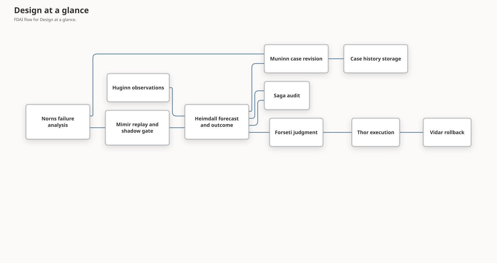

# Prediction Learning and Case History

This design closes each forecast against observed reality, preserves the complete evidence as a
revisioned case history, and lets FDAI propose safer detector improvements without letting a model
change live behavior directly.

> **Implementation focus:** Azure is the implemented target. Core contracts stay
> cloud-provider-neutral. New behavior starts in shadow mode.
>
> **Agent boundary:** The pantheon remains exactly 15 agents. Machine workflow collaboration uses
> schema-validated pub/sub only. No new agent or direct agent call is introduced.

## Design at a glance

A forecast becomes useful learning evidence only after its horizon closes. Heimdall owns the
forecast result, Saga records the immutable audit evidence, Muninn materializes and indexes a case
revision, Norns analyzes reviewed failure cohorts off-path, and Mimir controls candidate replay,
shadow comparison, promotion, and rollback.



## Agent-owned actions

| Agent | Trigger | Owned action | Published object |
|-------|---------|--------------|------------------|
| Huginn | Metric, incident, or breach input | Normalize and deduplicate actual observations | `Event` |
| Heimdall | Observation or horizon expiry | Create forecasts and close forecast outcomes deterministically | `Forecast`, `ForecastOutcome`, `Drift` |
| Forseti | Proactive finding | Judge the proposed response and request arbitration when needed | `Verdict`, `ArbitrationRequest` |
| Odin | Conflicting objectives | Select or hold the bounded response | `ArbitrationDecision` |
| Thor | Eligible verdict | Execute the promoted action only | `ActionRun`, `ActionAttempt` |
| Var | Human approval required | Record the independent approval result | `Approval` |
| Vidar | Failed action | Execute the declared rollback | `Rollback` |
| Saga | Any terminal transition | Append tamper-evident evidence | `AuditEntry` |
| Muninn | Forecast outcome audit | Seal and index a case-history revision | `StateSnapshot`, `ContextIndex` |
| Norns | Closed case cohort | Analyze failures off-path and propose inert improvements | `Pattern`, `RuleCandidate` |
| Mimir | Rule candidate | Run governed replay and shadow promotion | `Rule`, `Policy` |

Subscribers run independently. Slow or failed case materialization does not block outcome audit,
learning intake, or unrelated forecasts. The runtime retries transient subscriber failures twice
before dead-lettering; stable correlation and idempotency keys make replay safe.

The deployed loop is driven by a mechanical tick publisher. Huginn normalizes the raw tick as an
`object.event`; Heimdall evaluates configured target and metric pairs, records every positive,
negative, or held-for-review evaluation as an immutable episode, closes due episodes after the
telemetry grace period, and drains a transactional publication outbox. A poison publication is
isolated and dead-lettered without blocking unrelated episodes.

Positive forecast publications also retain the evaluator's computed breach ETA and governed
prediction-band confidence as versioned `approval_timing` metadata. The approval supervisor reads
the exact existing episode/publication, verifies lineage, time, target, and interval, and derives
only a bounded response window. Legacy publications without that metadata remain valid learning
records but cannot compress approval timing. This adds no outcome, new measurement, or authority.

## Forecast outcome contract

`ForecastOutcome` is a versioned object owned only by Heimdall and published on
`object.forecast-outcome`. It records:

- stable outcome and prediction ids;
- detector and configuration versions;
- target digest, metric, feature cutoff, breach predicate, and horizon;
- predicted value and uncertainty interval;
- observed value and actual breach time when available;
- one terminal label: `true_positive`, `false_positive`, `false_negative`, `late_breach`,
  `magnitude_error`, `intervention_censored`, or `unscorable`;
- intervention and evidence references, telemetry completeness, and close time.

The episode ledger also records `predicted_breach`, `predicted_no_breach`, and `abstained`
evaluations. Persisting all three states preserves the recall denominator and distinguishes a model
miss from a pipeline miss. Horizon scoring uses event time: a breach after the horizon is not a
false negative for that horizon, while magnitude compares the interval with the observed value at
the horizon rather than the first breach sample.

An actual breach without an eligible earlier prediction produces a false-negative outcome with no
prediction id. At-least-once delivery deduplicates by the stable outcome id. Missing telemetry,
maintenance overlap, and resource deletion never become successful predictions.
Boundary validation requires the label-specific breach, intervention, observation, and interval
evidence in both JSON Schema and the typed model. The typed model also rejects a magnitude error
whose breach falls outside the declared forecast horizon.

Version `1.1.0` adds bounded `scoring_exclusions` independently of telemetry completeness. Missing
intervention history, mismatched context, an excluded window, resource deletion, or an intervention
affecting an observed breach makes the episode `unscorable` without relabeling complete metrics as
missing. A non-empty exclusion set cannot accompany a scored outcome. Version `1.0.0` remains a
readable contract and its serialized shape stays unchanged. A deployment without a context evidence
binding holds new forecast scoring; an empty intervention list alone never proves absence.

## Context-aware decision contract

Keep six conclusions independent: observed fact, expected condition, service impact, response
disposition, learning eligibility, and execution eligibility. A test environment is neither an
expected-fault declaration nor an exemption. A real load-test observation is authoritative test
evidence, not a synthetic fixture and not an untreated production incident.

Operator statements and shared documents enter through the existing semantic judgment boundary.
They propose typed context with exact targets, source reference, accountable owner, effective
interval, recorded time, expected signals and limits, and requested handling. Missing targets,
time bounds, or conflicting claims require clarification or review. Personal memory consent does
not authorize a shared operational exception. Reuse reviewed `Environment`, `Experiment`, and
`ChangeWindow` semantics before extending the ontology; a declared type alone is not a runtime
producer. Policy changes use the existing reviewed governance path, never a conversational write
to an active catalog.

Forseti binds each decision to exact evidence, context, and policy revisions. An expected signal
can change handling only within a currently authorized exact scope and interval. Security,
data-integrity, unexpected symptoms, and affected production dependencies retain their protection.
Expiry, revocation, source loss, or conflict removes exception eligibility, not the observation.
Thor still revalidates current authorization and all action safeguards before dispatch. A context
change during execution follows the action's stop and recovery contract; it never erases an attempt.

Claim approval and observation admission are separate. Suppressing an expected test signal requires
both the exact reviewed claim and independent evidence binding the current measurement, service
impact, and protected-signal classification. Caller-supplied flags cannot attest that production is
unaffected. Context composition can only lower an existing decision's autonomy ceiling.

`GovernedTestContextStore` retains proposal, reviewed, and terminal revoked revisions with target
CAS and atomic audit. Review cannot change the proposed envelope, requester, source, or policy.
Each transition requires independent `test-context-transition` admission; overlap, self-review,
revision conflict, and expiry during admission block activation. Runtime composition binds its
signal-scoped reader to Forseti, which separately re-admits the claim and observation. The store
does not authenticate conversational text or supply a human-review channel by itself.

Accepted `create.test_context` semantic judgments produce a typed `TestContextDraft` through the
ordinary chat projection. Exact source spans bind the target, signal, range, and explicit aware
times; unresolved fields require clarification. Drafts grant no scope or review authority.
The shared SDK exposes the existing draft, command, and application models and their version `1.0.0` schemas. JSON Schema checks structure; `JsonSchemaContractValidator` also runs typed range, interval, role, and proposal/review constraints. Neither check authenticates a principal or grants admission. Generate the standalone schemas with `scripts/quality/contracts/generate_test_context_schemas.py`; broker compatibility, consumer rollout, and operational proof remain separate qualification requirements.
Console decoding and replay retain valid drafts; scope/policy selection and submission UI remain open.
Authenticated `POST /test-context/proposals`, `/test-context/reviews`, and `/test-context/revocations`
persist commands in the Operator outbox. Huginn normalizes ingress, Var publishes independent
reviews, Mimir records policy revisions, and Saga audits them. Thor ignores these non-action reviews.
`GET /test-context/commands/{proposal_id}` exposes only the requesting principal's delivery and application metadata.
After auditing Mimir's exact revision, Saga publishes the result through `core.test-context.projections`.
Operator atomically binds it to the original actor, command digest, target, policy, and revision.
`published` means broker acceptance; `policy_application=recorded` requires that audited result.
Absent results remain `unknown`; `current_authorization=not_evaluated` never implies current activation.
Exact historical review replay after revocation acknowledges the original application without a write.
Result-source probing and stream cleanup have five-second limits. Failed workers become unready;
explicit restart preserves failed offsets. Invalid JSON reaches a sanitized DLQ before offset commit.
Forseti rechecks source changes during judgment; ActionRun retains the exact context binding and
Thor rechecks current source and admission before executor I/O. In-flight stopping remains the
action's existing stop/recovery contract, not a context-granted execution permission.

### Forecast evidence admission

Metric completeness requires a bounded observation policy: unique sample times, finite values,
coverage of the entire forecast horizon, and a maximum tolerated gap. A single endpoint sample,
conflicting duplicate samples, or missing horizon coverage is insufficient. Telemetry grace permits
late ingestion but does not extend the scored horizon or manufacture a horizon observation.

The metric adapter's injectable `ForecastObservationPolicy` defaults to three distinct samples,
90% horizon span coverage, a 300-second maximum gap including the boundary gaps, 10,000 raw points,
and a five-second query deadline. A single dimension set is required. The configured policy and
scope/target/window-bound sample digest accompany the observation. These are metric admission
checks, not proof that no intervention occurred; the context join below remains independently required.

The observation adapter joins independently sourced intervention, deletion, and excluded-window
evidence by exact target and event time. An unavailable join is unknown, not proof that no action
ran. A relevant intervention separates the episode from untreated forecast scoring; observed
recovery alone does not establish prevention or causal efficacy. Negative and abstained episodes
retain completeness and censoring reasons so denominator gaps stay visible.

With `FDAI_FORECAST_HISTORY_SOURCES_JSON`, Heimdall collects missing, expired, or incomplete retained
history from the normalized state-transition store. Each exact scope/target needs all four reviewed
source mappings. JSON fields and states must be unique; mappings are bounded to 64 targets.
Queries keep all destination states, at most 64 transitions per source, and one five-second total
deadline. Unknown states, conflicting chains, synthetic rows, truncation, or incomplete coverage hold scoring.
Stateful mappings declare active and inactive states with at most one day of pre-horizon lookback.
The state at the inclusive horizon start controls eligibility; an unknown initial state remains unknown.
`StateStoreForecastContextProvider` independently admits each slice and the exact aggregate before retention.
Source identity, revision, scope, target, interval, checkpoint completeness, and freshness must all match.
The metric/context/verification join has its own five-second total deadline; history or verifier failures
retain measured telemetry with an explicit scoring exclusion. This collector does not produce raw provider
history or independent proofs, and neither configuration nor a complete empty query grants admission.

History ingress requires independently admitted action, change, resource-lifecycle, and excluded-window
coverage plus admission of their aggregate. Corrections append a bounded revision under scope-window
CAS and must name the exact previous context digest; prior evidence is retained, not overwritten.
An exact old delivery is acknowledged without restoring it as current. This permits late coverage
and renewed evidence without revising a closed forecast outcome or manufacturing source completeness.

The episode closure carries its observation even when no `ForecastOutcome` is published. The Core
`core_forecast_closure_observation_20260914` migration adds nullable `closure_observation` metadata.
New writes retain the observation atomically with closure and the publication outbox; conflicting
retry content is rejected. Legacy null values remain missing evidence. The read-only health
aggregate distinguishes complete, partial, unavailable, and missing observations. Deploy the Core
migration before the changed reader/writer; rollback requires stopped writers and exported evidence.

### Correction and reuse

Saga retains what was known at each decision cutoff. Muninn appends late corrections as new case
revisions without rewriting a prior forecast or decision. Analysis selects one eligible revision
per case and preserves the frozen revision set for reproducible historical evaluation. Revocation
and deletion invalidate dependent retrieval and candidate eligibility. Digests do not grant data
sharing permission or make private evidence anonymous.

Norns publishes only inert patterns and candidates from balanced, scope-authorized cohorts. Mimir
uses incident-grouped rolling-origin evaluation, separate test/live cohorts, and the same frozen
inputs for incumbent and challenger. Candidate construction from two cases is not promotion proof.
The configured minimum days and episodes are floors; uncertainty, guard-metric regressions, or
policy escapes still block promotion. Proven recovery is never withheld to create a control group.

Current T1 admission binds the complete event, action parameters, signature, and rule as well as the
immutable case. Validate expiry against the decision clock after provider I/O, with an exclusive
expiry boundary, rather than against the observation's own timestamp. A changed target or parameter
requires fresh admission. Existing receipts with the older scope digest cannot authorize new reuse.

### Delivery and review gates

| Package | Completion evidence |
|---------|---------------------|
| P0 - Contracts | Six independent conclusions, ownership, revisions, and failure handling are reviewed. |
| P1 - Outcome integrity | Endpoint-only, gaps, conflicting samples, intervention, deletion, and late-arrival tests preserve honest scoring. |
| P2 - Context admission | Exact-target semantic intake, independent review, expiry, revocation, and conflict tests deny unauthorized exceptions. |
| P3 - Decision integration | The same versioned input replays to the same response, learning, and authority decisions with Saga audit. |
| P4 - Durable reuse | Muninn cases, Norns patterns, and current-evidence T1 reuse survive duplicate delivery, restart, and corrections. |
| P5 - Candidate measurement | Frozen replay and shadow evidence prove improvement without guard regression; demotion is repeatable. |
| P6 - Operational qualification | Read-only explanations, deadlines, subscriber isolation, recovery, and separately authorized non-production drills are evidenced. |

Each hardening round reviews at least ten distinct concerns, records genuine findings and their
severity, and reruns focused regression checks after fixes. Completion requires no known unresolved
finding above Low within the delivered scope. Missing external qualification stays open rather than
being counted as a passing local test.

## Case history model

A case is a stable, access-scope-bound identity with append-only revisions. Reopening an incident
or receiving late trusted evidence adds a revision instead of rewriting history. A revision must
preserve every prior source identity and digest; it can add evidence but cannot replace or omit
evidence already sealed.

### Target PostgreSQL hot index

PostgreSQL stores queryable metadata, not unrestricted evidence bodies:

- `case_history`: identity, kind, correlation and incident references, lifecycle state, latest
  revision, label, generic bounded metadata, optional forecast detector and metric fields,
  retention, legal hold, and latest manifest reference;
- `case_history_revision`: revision number, parent digest, manifest digest, storage reference,
  audit sequence bounds, event-time cutoff, schema and redaction versions, label, censoring reason,
  owning agent, and seal time;
- `case_history_chunk`: bounded redacted text, chunk kind, embedding, embedding model version,
  source manifest digest, access-scope digest, and deletion lineage.

The append-only audit log remains the evidence authority. During migration, the legacy StateStore
projection remains the read authority while PostgreSQL receives shadow writes. A keyset backfill
reconstructs complete artifact chains and preserves deleted identities as zero-size tombstones.
Relational reads can start only after a persisted zero-mismatch marker is verified at runtime.
Operational action and incident revisions keep detector and metric fields null instead of inventing
forecast values. Their allowlisted metadata is stored in both StateStore and PostgreSQL and is
reconstructed from each immutable artifact during backfill. Legacy forecast metadata remains valid.

### Immutable artifact

The artifact store writes canonical JSON bytes and a manifest under a content-addressed reference.
Each revision contains prediction-time facts, versions, observations, interventions, decisions,
approvals, actions, rollback, RCA citations, SLO recovery, recurrence, and source-record digests.
Raw cloud payloads, credentials, unrestricted tool output, prompts, and hidden reasoning are not
stored. The seal boundary also rejects common plain-text and percent-encoded credential shapes
under otherwise neutral field names, credential-bearing URI user information, and common secret
keys regardless of casing or separator style.

Artifact creation precedes the metadata append. A definite metadata rejection removes only an
artifact created by that attempt. If the append result cannot be verified, the artifact remains
available for a safe retry and both the append and verification errors are preserved.

The default Azure adapter uses a private Blob container with workload identity, public access and
key authentication disabled, versioning, private networking, and deployment-approved retention or
legal hold. Customer-scoped artifacts never enter Git.

### Retrieval for analysis

Retrieval authorizes purpose and access scope before searching and verifies the artifact's case,
revision, correlation, purpose, scope, and parent identity against metadata. It applies
deterministic filters for resource type, metric, detector version, outcome label, and time before
pgvector ranking. Detector and metric filters also run before failure and control cohort limits, so
newer unrelated detector records cannot hide eligible cases. The retriever returns bounded case
cards plus source digests; a model cannot treat an embedding as source evidence.

Norns receives failure cases together with matched correct and censored controls. This prevents
survivorship bias and overly conservative threshold changes. Every analysis claim cites a case id,
revision, and manifest digest. At least one failure and one matched control are required before the
reviewer runs. Missing or conflicting evidence produces no candidate.

## Learning and promotion

Norns first classifies deterministic failure families: telemetry quality, baseline or seasonality
drift, topology or concept drift, horizon selection, threshold or calibration error, intervention
censoring, and detector-version regression. An off-path model may analyze only the ambiguous
residual and can produce only an inert candidate.

Mimir accepts a candidate only with grounded provenance. The candidate runs rolling-origin replay
and live shadow comparison against the incumbent on the same cases. Promotion requires minimum
closed samples and observation days, confidence-bounded improvement, no guard-metric regression,
and zero policy escapes. Regression returns the detector or policy to shadow automatically.

## Retention and deletion

### Completion design

`query.operating_patterns` requires an exact independent `case-history-read` admission binding the
authenticated principal, case scope, purpose, arguments, and active release. It returns bounded
recompiled summaries only, with current-source checks and no historical action parameters. T1
separately checks current case revisions before and after verification; legacy unscoped operational
cases remain held. Publishing an inert Pattern does not enroll or promote it in the T1 library.

The remaining implementation follows one evidence chain, not independent optional helpers:

| Boundary | Owner and input | Durable result | Failure behavior |
|----------|-----------------|----------------|------------------|
| Historical coverage | Heimdall reads normalized action, change, resource-lifecycle, and experiment histories plus source coverage checkpoints | Exact scope, target, interval, source revisions, event references, and completeness evidence | A missing source, truncated page, late watermark, or unverified checkpoint is unknown, even when no events were returned. |
| Context proposal | Bragi translates an authenticated operator turn into typed target, signal envelope, interval, and source references | An inert proposal revision with authenticated requester attribution | Missing semantic grounding or identity requires clarification; no lexical interpretation or direct exception write. |
| Review and activation | Var supplies independent authenticated review; Mimir owns the reviewed policy projection | Immutable reviewed revisions and a current pointer with expiry and revocation | Self-review, revision mismatch, concurrent review, conflicting overlapping claims, or absent admission blocks activation. |
| Decision and dispatch | Forseti joins the current claim and independently admitted observation; Thor uses ordinary dispatch gates | Six-axis decision, exact claim/observation/policy digests, and Saga audit | Expired or revoked evidence removes eligibility. A queued earlier decision cannot restore it. |
| Pattern reuse | Muninn resolves exact current case revisions; Norns and Mimir retain their existing candidate/review split | Scoped inert Pattern and frozen case identities | Correction, deletion intent, unavailable source, or incompatible cohort blocks current reuse and qualification. |
| Derived-data deletion | Muninn's existing retention worker follows the source deletion claim | Scrubbed cohort/snapshot/Pattern projections before the final case tombstone | A failed scrub leaves deletion pending and retryable; legal holds precede every destructive step. |
| Qualification and explanation | Existing read authorization and O3-O7 measurement boundaries consume the same frozen identities | Read-only evidence with gaps and independently reviewed candidate measurements | Unit evidence cannot count as live days, deployment, promotion, or successful operational effects. |

The design review rejected three shortcuts: empty audit queries as completeness proof, reviewed
personal memory as a shared test exception, and retrieval denial as deletion. It also rejected a
second promotion registry and direct agent calls. Existing broker retry, CAS, review identity,
case-history deletion claims, and independent admission remain authoritative.

Implement and validate one boundary at a time, but report completion only for the connected chain.
Tests should inject missing coverage, stale source revisions, overlapping claims, self-review,
concurrent update, source deletion during materialization, failed deletion and restart, cross-scope
reads, candidate correction, expired dispatch, and interrupted publication. Deployed qualification
still requires an explicitly selected non-production target and independently retained receipts.

Each case carries purpose, access scope, retention, deletion due date, and legal-hold metadata with
a non-empty authority reference when a hold is active.
Deletion first commits a durable intent containing every revision artifact reference. Pending
deletion blocks new revisions and analysis. Muninn then removes the complete artifact chain,
chunks, and embeddings before tombstoning the hot index. Audit keeps a non-sensitive deletion
record and digest. An artifact or final metadata failure leaves the intent retryable and does not
claim completion. A mechanical scheduler publishes a bounded raw retention tick on the primary
event bus. Huginn normalizes it, and Muninn alone consumes the typed `object.event` retention signal
and applies due deletion. `FDAI_CASE_HISTORY_RETENTION_TICK_SECONDS` controls the cadence and
defaults to one day; duplicate or replayed ticks are idempotent. A timestamp carried by the raw
event is diagnostic only. Muninn evaluates due dates against its trusted UTC clock so an ingress
publisher cannot accelerate deletion. A failed retention publisher task terminates the runtime
with an unsuccessful exit instead of silently disabling future ticks.

New derived cohorts, frozen snapshots, Pattern bodies, and emission markers share one scope-bound
`CaseHistoryProjectionStore` revision. Creation uses atomic create-and-audit; later writes use CAS
and revalidate current source cases after contention. Deletion updates that same revision even when
empty, so an in-flight first write cannot race the deletion claim. Source tombstoning waits for
derived purge; failures remain retryable. No duplicate case-body cache is retained in Muninn.
Each scope is bounded to 512 entries and 4 MiB, with three CAS attempts; saturation backpressures
rather than dropping evidence. Runtime binds this store to the existing Muninn retention tick.
This is a new, not-yet-deployed projection layout, not an automatic migration of the earlier
experimental `operational-case-fingerprint-cohort:v2:*` state keys. Legacy projection cleanup,
broker retention, and other downstream candidate deletion require their own verified steps.

T1 vector cleanup follows the existing source deletion claim, not a new retention policy. Its writer
and purge share a PostgreSQL transaction lock under a 15-second total deadline. Each batch atomically
records content-free case and signature fences and deletes at most 1,000 matching rows. Remaining
rows keep source deletion pending; retries continue safely. Late writes cannot restore a fenced case
or signature. Original case/action identity cannot change through an upsert; unchanged context-free
statistics maintenance remains compatible. Runtime uses `FDAI_T1_PATTERN_LIBRARY_DSN`, never the
case-metadata DSN. Legacy unscoped references are removed by the globally unique case identity;
conflicting explicit scope or a legal hold blocks deletion. The review rejects standalone DELETE
because it permits resurrection, and read denial because it leaves copied bodies. This fence covers
the T1 library only; broker and other downstream copies remain separate work.

### Retained-copy inventory

The inventory below distinguishes content-bearing copies from immutable references. A durable
reference can remain as non-sensitive audit lineage after its source body is deleted. A
content-bearing copy must follow the source deletion claim and legal hold before the source can be
tombstoned.

| Surface | Retained material and writer | Deletion and legal-hold state | Delivery status |
|---------|------------------------------|-------------------------------|-----------------|
| Azure Blob case revisions | Complete revision JSON at `case-history/<case>/<revision>/<digest>.json`, written by Muninn through `CaseHistoryMaterializer` | The source record supplies the legal hold and complete revision chain. `CaseHistoryRetentionService` deletes every recorded Blob reference before the metadata tombstone. | Covered. |
| Authoritative StateStore metadata | Latest case metadata, storage references, deletion intent, hold authority, and tombstone at `case-history:latest:<case>` | Audited CAS blocks new revisions after deletion starts. A legal hold blocks the claim, and failed artifact deletion leaves the intent retryable. | Covered. |
| PostgreSQL metadata shadow | `case_history` and `case_history_revision` mirror metadata and immutable artifact references through `DualWriteCaseHistoryMetadataStore` | The authority-side hold and deletion transition must match the shadow transition. Divergence fails closed; deletion clears the latest artifact reference and marks any existing chunks deleted. | Covered for metadata and references. |
| PostgreSQL chunk schema | `case_history_chunk` can hold bounded text and a 384-dimensional embedding | No runtime writer or reader currently populates this table. It is not an actual retained copy in the current composition. Any future binding must join the source claim and hold before activation. | Declared but unbound. |
| Current derived StateStore projection | Cohorts, frozen snapshots, Pattern case bodies, and emission markers inside `case-history-derived:v1:<scope>`; Muninn is the writer | One scope CAS revalidates current source revisions. Purge removes every entry that cites the claimed case before source tombstoning; holds and missing deletion intent fail closed. | Covered. |
| Legacy top-level StateStore projection | Historical `operational-case-fingerprint-cohort:v2:*` cohort, snapshot, Pattern, and emission rows | Current code uses that prefix only as a logical identity inside the new projection and no longer writes top-level rows. Existing rows have no source-linked hold or purge path. | Open migration and purge work. |
| T1 pgvector library | `t1_pattern_library` retains the embedding, action fields, and bounded `OperationalCaseContext`; `PgVectorPatternLibrary` is the writer | A transaction-scoped lock writes durable case/signature fences and deletes at most 1,000 rows per pass. Holds, scope conflicts, and database failures keep source deletion pending. | Covered. |
| Cohort broker record | `object.context-index` carries the bounded `PatternCase` array and snapshot reference from Muninn to Norns | Event-bus retention and `.dlq` preserve transport payloads independently of the case lifecycle. Generic redrive exists, but no source deletion or hold fence currently prevents old payload replay. | Open broker retention and redrive work. |
| Pattern and candidate broker records | `object.pattern` and `object.rule-candidate` carry case references, digests, candidate evidence, and review identity | These records contain no source artifact body, but replay can rematerialize downstream copies unless consumers recheck the deletion fence. Generic DLQ policy is not case-aware. | Open replay qualification. |
| Norns process memory | `pending_candidates` and `_pattern_publications` retain candidate mappings and Pattern envelopes while throttled | The buffers are bounded and authority-free, but they are not durable. Rate limiting keeps work in memory and process restart loses it; no hold-aware recovery store exists. | Open durable retry work. |
| Mimir process memory | `_pending_candidates`, `_catalog_review_packages`, and idempotency indexes retain compiled packages and immutable case references until publication completes | Current-case checks run before compile, retry, and publish. Publication failure remains retryable only in the live process; restart reconstruction and source-deletion scrub are absent. | Open durable package recovery work. |
| GitOps review package | `rule-catalog/review-packages/operational-<digest>.json` in a draft pull request retains candidate evidence, review results, and immutable case references, but not the source revision body | Git history intentionally retains this non-sensitive lineage. The package cannot activate a Rule. Source deletion must invalidate reuse without rewriting historical review evidence. | Retain as audit lineage; verify no raw body is added. |

No additional case-body cache or active embedding writer was found in the current Core composition.
The unbound chunk schema, process-local buffers, broker payloads, and Git review references are
listed explicitly so later work does not mistake absence of a read route for physical deletion.

## Verification

The implementation must prove:

- every forecast or actual breach reaches one terminal outcome or explicit `unscorable` state;
- canonical digest stability under input reorder and digest change under evidence mutation;
- append-only revision conflict detection and idempotent replay;
- action and incident persistence without synthetic detector or metric values, while legacy
  forecast rows remain readable;
- cross-scope retrieval denial and secret/hidden-reasoning rejection;
- subscriber concurrency, failure isolation, ownership, and duplicate delivery safety;
- no model output can write an active rule, detector, promotion, or action directly.

## Connected validation handoff

Use the same source revision on the connected machine. First run the focused local regressions:

```bash
.venv/bin/python -m pytest -q --no-cov services/core-control-plane/tests/core/conversation/test_semantic_test_context.py services/core-control-plane/tests/agents/test_operational_context_verdict.py services/core-control-plane/tests/core/tiers/t1_lightweight/test_contextual_reuse.py services/operator-service/tests/test_test_context_commands.py
```

The storage test requires process-local `FDAI_DATABASE_URL` for a loopback PostgreSQL database with
temporary-schema permission. It never targets a remote database. Keep credentials out of arguments,
recorded command output, and committed files. The command invokes no live model.

For separately authorized non-production runtime validation, record the deployed SHA, policy and
source revisions, scope digest, timestamps, and immutable receipt references. Use existing identity
bindings and the governed deployment workflow; do not seed final state or reuse test admissions.

| Stage | Observable evidence required |
|-------|------------------------------|
| Semantic proposal | English and Korean direct turns produce exact source-grounded drafts; missing or relative time clarifies; quotation never activates context. |
| Authenticated lifecycle | Contributor proposal, distinct Approver review, and revocation pass the three POST routes; wrong roles, identity injection, self-review, and changed envelopes fail. |
| Durable delivery | Broker stop/restart and expired leases preserve the same command identity; Var Approval, Mimir Policy, and Saga audit appear exactly for the accepted transition. HTTP 202 or bus publication alone is insufficient. |
| Observation and dispatch | Expected signals stay non-executing; protected or affected-service signals retain ordinary gates. Queue a shadow action, then revoke or expire its context and verify the dispatch hold and audit. |
| Forecast history | All four source coverage checkpoints and independent aggregate admission precede scoring; missing, partial, late, or intervened evidence retains exclusions and the denominator. |
| Case lifecycle | Current scoped explanations disappear after correction/deletion; restart cannot resurrect retained bodies. Qualify broker, legacy keys, and downstream embeddings separately. |
| Learning promotion | Frozen O3-O7 replay and measured shadow evidence satisfy existing floors and ActionType gates. Local tests never manufacture elapsed days, sample counts, or promotion authority. |

Stop on missing identity, incomplete source coverage, 429/503, deadline, or conflicting evidence.
Keep the result blocked with the exact missing stage; no live qualification is implied by this guide.

## Related docs

| To learn about | Read |
|----------------|------|
| Delivery status and remaining work | [Implementation ledger](../../roadmap-implementation/rules-and-detection/prediction-learning-and-case-history.md) |
| Detection and forecast scoring | [Observability and detection](observability-and-detection.md) |
| Agent ownership and topics | [Agent pantheon](../agents/agent-pantheon.md) |
| Governed offline records | [Governed trajectory datasets](../interfaces/governed-trajectory-datasets.md) |
| Data retention and privacy | [Data governance](../architecture/data-governance.md) |
