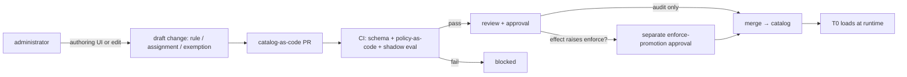

# 규칙 거버넌스(Rule Governance)

관리자가 규칙을 어떻게 **컨트롤** 하는가 - 작성, 파라미터화, 범위 지정, 활성화, 예외 처리 -
Azure Policy가 운영자에게 정의, 할당, 예외를 관리하게 하는 방식으로. 이는 규칙 카탈로그
위의 사람 대상 컨트롤 표면입니다.

[rule-catalog-collection-ko.md](rule-catalog-collection-ko.md) 의 수집·정규화 규칙과
[phase-1-rule-catalog-t0-ko.md](../phases/phase-1-rule-catalog-t0-ko.md) 의 결정론적 평가 위에
구축. **콘솔은 읽기 전용이며 액션은 PR로 흐른다** 는 app-shape 규칙
([app-shape.instructions.md](../../../.github/instructions/app-shape.instructions.md)) 과
[architecture.instructions.md](../../../.github/instructions/architecture.instructions.md) 의
shadow-before-enforce 및 안전 불변식을 준수.

> 고객-비종속: 아래 모든 식별자, 스코프, 값은
> [generic-scope.instructions.md](../../../.github/instructions/generic-scope.instructions.md) 에
> 따라 합성 placeholder.

## 모델 (Azure Policy처럼 세 레이어)

Azure Policy는 *정의* 를 *할당* 과 *예외* 에서 분리. FDAI가 이를 미러링해 관리자가
익숙한 정신 모델을 가짐:

| Azure Policy 개념 | FDAI 아티팩트 | 무엇인가 |
|------------------|----------------------|---------|
| policy definition | **rule** | 하나의 테스트 가능한 컨트롤 ([rule-catalog-collection-ko.md](rule-catalog-collection-ko.md)) |
| initiative (policy set) | **rule set** | 이름 있고 버전된 규칙 그룹 (예: 보안 베이스라인) |
| assignment | **assignment** | 스코프에 적용된 rule/rule-set, 파라미터와 effect 포함 |
| assignment `enforcementMode` | **enforcement 플래그** | `enforce` vs `do-not-enforce` (shadow); effect와 직교 |
| exemption (waiver / mitigated) | **exemption** | 스코프의 할당에 대한 time-boxed, justified, 카테고리화된 waiver |
| effect (audit/deny/...) | **effect / mode** | 위반 시 무엇이 일어나는가 (Effects 참조) |

규칙은 **할당** 이 그것을 **스코프** 에 **effect** 와 함께 바인딩하기까지 inert. 이것이 관리자
컨트롤의 핵심: 저자는 한 번 규칙을 작성; 운영자는 *어디*, *얼마나 엄격하게*, *어떤 파라미터로*
적용할지 결정.

## Effects (Mode)

Effect는 안전 다이얼. 단순 라벨이 아니라 shadow→enforce 라이프사이클에 매핑:

| Effect | Azure Policy 유사 | 의미 | 안전 티어 |
|--------|-------------------|------|-----------|
| `disabled` | `disabled` | 규칙/할당 오프 | inert |
| `audit` | `audit` / `auditIfNotExists` | 판단하고 로그만, 변경 없음 (**shadow 모드** 등가) | 안전 기본 |
| `deny` | `deny` / `denyAction` | PR/admission 게이트에서 비준수 변경 블록 | enforce (게이팅) |
| `remediate` | `modify` / `deployIfNotExists` | auto-remediation PR 생성 (auto-merge 절대 아님; 항상 risk gate / HIL 통해) | enforce (게이팅) |

Effect(위반 시 무엇을 할지)는 **enforcement 모드** (액션할지 여부)와 직교, Azure Policy의
`enforcementMode` 미러링. 할당은 둘 다 운반: `effect` + `enforcement: enforce | do-not-enforce`.
`do-not-enforce` 는 검사를 what-if로만 실행하며 `audit`/shadow의 메커니즘; enforce로의 승격이
승격 게이트 하에 이 플래그를 flip. **rule set** 은 규칙별 `default_effect` 를 선언 가능하고
**할당** 은 규칙별로 오버라이드 가능(`effect_overrides`), 마치 initiative가 effects를 설정하고
할당이 튠하는 것처럼; 할당의 top-level `effect` 는 오버라이드 없는 규칙의 기본값.

**허용된 effect/enforcement 전이** (아래 나열되지 않은 전이는 CI에서 거부):

| From | To | Gate |
|------|----|----|
| `disabled` | `audit` | 표준 리뷰 |
| `audit` (shadow) | `deny` / `remediate` (enforce) | **별도 enforce-promotion 승인** |
| `deny` / `remediate` | `audit` | 표준 리뷰 (강등은 항상 허용 - 불확실할 때는 안전한 쪽을 선택) |
| 어떤 활성 상태 | `disabled` | 표준 리뷰 (사유 기록) |

- **새 할당은 `audit` (shadow) + `enforcement: do-not-enforce` 기본.** `deny`/`remediate`
  으로의 승격은 (1) 최소 shadow dwell 시간과 표본 크기, (2) 임계 위 측정 shadow 정확도, (3)
  정책 위반 escape 0 을 게이트로 하는 명시적·별도 리뷰된 변경
  ([architecture.instructions.md](../../../.github/instructions/architecture.instructions.md)).
- 회귀는 할당을 `audit` 로 **자동 강등**; 강등은 승격 게이트를 절대 필요로 하지 않아 안전 저하는
  항상 빠름.
- 할당의 **부재** 는 규칙이 그 스코프에서 미강제 (거버넌스는 default-audit, default-deny 아님);
  이것은 런타임에 fail open이 아님 - 매칭되지 않거나 모호한 이벤트는 여전히
  [architecture.instructions.md](../../../.github/instructions/architecture.instructions.md) 에
  따라 HIL로 라우팅.
- `deny`/`remediate` 액션은
  [coding-conventions.instructions.md](../../../.github/instructions/coding-conventions.instructions.md)
  의 네 안전 불변식(stop-condition, rollback, blast-radius limit, audit entry) 운반. 오발동
  `deny` 는 글로벌 kill-switch 또는 time-boxed exemption으로 복구 가능(그 blast radius는
  *정당한 변경을 블록* ); `remediate` PR은 멱등 - 재평가된 finding은 중복 오픈이 아니라 열린
  PR 업데이트.

> **구현 상태**: effect 기반은
> [`rule_catalog/schema/effect.py`](../../../src/fdai/rule_catalog/schema/effect.py) 에 ship 됨 -
> `Effect` (`disabled` / `audit` / `deny` / `remediate`) 와 `Enforcement`
> (`enforce` / `do-not-enforce`) enum, 충돌하는 assignment 를 해소하는 strictest-effect 우선순위
> (`deny` > `remediate` > `audit` > `disabled`), 그리고 위 전이 표를 강제하는
> `validate_effect_transition` (enforce effect 로의 상향은 별도 promotion 승인 필요). scope 선택
> 계층도 [`rule_catalog/schema/scope.py`](../../../src/fdai/rule_catalog/schema/scope.py) 에 함께
> ship 됨 - `ScopeLevel` 계층, `ScopeSelector` (resource-type / tag / resource-id, 선언된 것들의
> AND), exclusions, `Scope.covers`, 그리고 `most_specific` 우선순위 헬퍼. `Assignment` artifact 와
> `resolve_assignments` 충돌 해소기 (strictest effect 승; 가장 구체적인 scope 가 parameter 제공;
> specificity tie 는 HIL flag; loser 는 audit 기록)는
> [`rule_catalog/schema/assignment.py`](../../../src/fdai/rule_catalog/schema/assignment.py) 에
> ship 됨. `RuleSet` (initiative) 그룹 - version-pin 된 member + per-rule `default_effect` +
> `assignment_from_rule_set` - 는
> [`rule_catalog/schema/rule_set.py`](../../../src/fdai/rule_catalog/schema/rule_set.py) 에 ship 됨.
> governance 모델 계층(effect / scope / assignment / rule-set)은 in-memory 로 완성. assignment
> catalog-as-code 로더도 ship 됨:
> [`assignment.schema.json`](../../../src/fdai/rule_catalog/schema/assignment.schema.json) +
> `load_assignment_from_mapping`
> ([`governance_loader.py`](../../../src/fdai/rule_catalog/schema/governance_loader.py)) - YAML
> assignment 를 검증해 도메인 객체를 빌드하고, 모든 schema 이슈를 경계에서 한 번에 실패시킴.
> rule-set 로더 (`rule_set.schema.json` + `load_rule_set_from_mapping`)도 같은 모듈에 ship 됨.
> 디렉토리 로더
> ([`governance_catalog.py`](../../../src/fdai/rule_catalog/schema/governance_catalog.py),
> `load_governance_catalog`)는 catalog-as-code 트리 전체(`assignments/` + `rule-sets/`)를 읽어
> 모든 파일의 이슈를 집계함. assignment 은 명시적 `target_rule_ids` 목록 또는 `rule_set`(id)를
> 바인딩함: 로더는 rule-set 참조를 로드된 rule-set 에 대해 해석하고 `assignment_from_rule_set` 으로
> 펼쳐(rule-set 의 rule별 `default_effect` 를 override 로 실음), "rule-set 을 scope 에 적용"이 end-to-end
> 로 동작함; 해석되지 않는 참조는 로드 경계에서 실패. CI 전이 게이트 핵심도 ship 됨: `validate_catalog_transition`
> ([`governance_transitions.py`](../../../src/fdai/rule_catalog/schema/governance_transitions.py))
> 은 이전과 현재 `GovernanceCatalog` 를 비교해, 허용 테이블을 벗어난 rule 별 유효 effect 전이를
> 모두 거부함 - 신규 assignment/rule 은 강제 기본값 `audit` 에서 전이한 것으로 검증하고, enforce
> effect(`deny` / `remediate`)로 올리려면 assignment id 가 `promotions_approved` 에 있어야 함.
> 검증기를 감싸는 얇은 `git`-diff CI 스크립트
> ([`check-governance-transitions.py`](../../../scripts/check-governance-transitions.py))도 ship 됨:
> 감쌀: base ref 와 working tree 의 catalog 를 materialize 해 거부된 전이가 있으면 빌드를 실패시킴.
> 게이트는 **effect** 전이만 관장하며 scope / blast-radius **확대**는 플래그하지 않음(낮은
> specificity scope 는 더 타이트한 `selector` 로 상쇄될 수 있어, 건전한 확대 검사는 specificity
> 휴리스틱이 아닌 커버리지 분석이 필요) - 이는 별도 future 검사. 남은 후속은 resolved assignment 를
> 소비하는 T0 런타임.
>
> ship 된 catalog-as-code 스키마는 이제 아래 "YAML Shapes" 섹션과 일치함: 공유 `Provenance` 값 객체
> ([`provenance.py`](../../../src/fdai/rule_catalog/schema/provenance.py)), `kind`
> ([`governance_kind.py`](../../../src/fdai/rule_catalog/schema/governance_kind.py)) discriminator 와
> 아티팩트 `version`, 정규 `scope://`
> [`ScopeRef`](../../../src/fdai/rule_catalog/schema/scope.py) 주소와 include/exclude
> [`ScopeBinding`](../../../src/fdai/rule_catalog/schema/scope.py) 폼(`ScopeMatcher` 프로토콜 뒤로
> 통일), 그리고 rule별 `parameter_overrides` 가 모두 ship 됨. rule-set 은 `rule_set`(또는 명시적
> `target_rule_ids` 리스트)로 바인딩되고 scope 좁히기는 더 풍부한 `selector`(`resource_types` /
> `tags` / `resource_ids`)를 씀.

## 스코프(Scope)

스코프는 할당이 커버하는 리소스를 CSP-중립적으로 선택:

- **계층**: organization → account/subscription → resource-group → resource.
- **셀렉터**: resource-type별, tag/label별, 명시적 resource-id allowlist별.
- **제외**: 스코프는 자식 스코프 제외 가능(예: org-wide 적용하되 sandbox 제외).
- 스코프는 데이터; executor는 여전히 최소권한 아이덴티티와 액션 화이트리스트만 보유
  ([security-and-identity-ko.md](../architecture/security-and-identity-ko.md)) - 광범위 스코프는 실행 권한을
  절대 넓히지 않음.
- **스코프 우선순위**: 중첩된 스코프가 같은 규칙을 바인드할 때, 파라미터는 **가장 구체적인
  스코프가 승리** ; 충돌하는 *effects* 는 **가장 엄격한 effect가 승리**
  (`deny` > `remediate` > `audit` > `disabled`), 진짜 tie는 HIL로 escalate -
  [phase-1-rule-catalog-t0-ko.md](../phases/phase-1-rule-catalog-t0-ko.md#deduplication-conflict-and-precedence)
  의 결정론 순서와 일관.
- **같은 rule+scope의 충돌 할당** 은 같은 strictest-effect-wins 규칙으로 해결; 지는 할당은
  감사 트레일에 기록되어 해결이 리뷰 가능하며, time-boxed exemption이 엄격한 결과를 완화하는
  유일한 승인 방법.

## 관리자 컨트롤 흐름 (GitOps, 버튼 아님)

관리자는 Azure Policy 변경처럼 규칙을 컨트롤 - 작성, 파라미터화, 할당, 예외 - 하지만 변경은
**catalog-as-code로의 리뷰된 PR** 로 전달, audit·rollback·approval을 git에서 무료로:



- 콘솔은 **authoring UI** 를 제공할 수 있지만 **draft PR을 생산** 만 할 뿐 - 라이브 카탈로그를
  절대 직접 실행/변형하지 않음(콘솔 읽기 전용 유지).
- 모든 거버넌스 변경(rule, assignment, exemption 생성/수정, effect 변경)은 저자, 리뷰어, 감사
  트레일 있는 PR. Enforce 방향으로 effect를 올리는 것은 추가 승격 승인 필요.
- Draft PR은 authoring UI의 로컬 뷰가 아니라 **현재 머지된 카탈로그** 에 대해 검증; stale
  draft는 rebase해야 하므로 라이브 카탈로그가 단일 진실 원본 유지, 동시 편집이 조용히 서로를
  덮어쓸 수 없음. 승인은 git(또는 ChatOps)에서 발생, 콘솔 버튼 아님 - 콘솔은 상태 렌더링과
  draft PR emit만.

## 커스텀 규칙과 우선순위

관리자는 수집된(built-in) 규칙 옆에 **커스텀 규칙** 을 추가 가능, Azure Policy가 built-in
옆에 커스텀 정의를 허용하는 것처럼:

- 커스텀 규칙은 같은 스키마 사용, `source: custom` + 전체 `provenance` (author, created-at,
  rationale).
- 커스텀과 built-in 규칙이 겹칠 때의 **우선순위** 는
  [phase-1-rule-catalog-t0-ko.md](../phases/phase-1-rule-catalog-t0-ko.md#deduplication-conflict-and-precedence)
  의 결정론 순서 (severity, source priority, ties → HIL) 따름. 커스텀 소스는 명시적
  `priority_rank` 을 부여받아 오버라이드가 의도적·감사 가능, 우발 아님. 커스텀은 built-in을
  자동으로 능가하지 **않음** : built-in `deny` 를 *약화* 시킬 커스텀 규칙은 CI에서 플래그되고
  명시적 리뷰 필요, 컨트롤이 조용히 완화되지 않도록.
- 커스텀 규칙은 같은 shadow-before-enforce 라이프사이클 따름; 커스텀 `deny` 는 승격 게이트에서
  면제되지 않음.
- **Untrusted authored 입력**: 커스텀 규칙의 `check-logic`, `remediation`, 파라미터 값은 로드
  시 스키마로 검증되고 sandboxed 정책 엔진(OPA) 을 **통해서만** 평가 - 절대 shell이나 provider
  API 호출로 string-interpolate 되지 않음 - 규칙 텍스트나 파라미터로부터의 injection 경로 폐쇄
  ([coding-conventions.instructions.md](../../../.github/instructions/coding-conventions.instructions.md)).

## Exemption

Exemption은 Azure Policy exemption처럼 스코프의 할당을 waive:

- 필수 필드: 대상 assignment, scope, **justification**, **category** (`waiver` = 수용된
  리스크, 또는 `mitigated` = 보상 컨트롤 존재), **requester**, **approver** (requester와 다름
  - no self-exemption), **expiry** (exemption은 time-boxed; 영구적 조용한 waiver 없음).
- Expiry는 설정된 **최대 기간** 으로 bounded; auto-renew 없음 - exemption 연장은 새 승인 있는
  새 PR, 그래서 waiver가 조용히 영구가 될 수 없음.
- 만료 시 할당은 자동 재적용; 만료되는 exemption은 ChatOps로 사전 알림(콘솔 액션 아님).
- 모든 exemption과 만료는 감사; exemption은 기저 finding의 감사 기록을 절대 억제하지 않음 -
  발생 안 함이 아니라 *왜 수용됐는지* 기록.

## Override

**Override** 는 자동화된 quality gate *위* 의 사람 컨트롤 표면: 운영자가 규칙이 특정 환경에서
너무 공격적이라고 선언하고 규칙을 편집하지 않으면서 좁히거나, 강등하거나, 비활성화. Override는
[architecture.instructions.md](../../../.github/instructions/architecture.instructions.md#human-override)
가 말하는 "human override on top" 의 의미. Exemption을 대체가 아니라 보완.

### 언제 어느 것을 사용

| 상황 | 사용 |
|------|-----|
| 특정 리소스에 bounded 시간 동안 accepted-risk 또는 mitigated waiver | **exemption** (time-boxed) |
| 규칙 자체가 resource-group에 대해 체계적으로 너무 공격적, 무기한 | **override** (permanent 가능) |
| 규칙이 어디서든 잘 맞지 않고 존재해선 안 됨 | override가 아니라 카탈로그 파이프라인을 통한 **rule retirement** |

Override는 개별 finding의 waiver가 아님 - 규칙의 shipped 동작이 이 환경과 매칭되지 않는다는
스코프된 정책 자세.

### 규칙 (MUST)

- **Policy-as-code, 별도 아티팩트.** Override는 자체 catalog-as-code 엔트리 (`kind:
  override`); 대상 규칙 텍스트를 절대 편집하지 않음. Override 제거는 규칙을 자동 복원, 상류
  규칙 업데이트는 건드리지 않고 흘러감.
- **스코프는 resource-group-equivalent 이하이어야 함** - 위 스코프 계층의 `resource-group`
  레이어, 또는 특정 `resource`. Organization·account/subscription-wide override는 CI에서
  거부; 어디서든 규칙 비활성화는 override가 아니라 카탈로그 파이프라인을 통한 **rule
  retirement**.
- **허용 모드**: `disabled` (스코프에서 규칙 오프), `severity-downgrade` (예:
  `critical -> medium`), `parameter-relaxation` (규칙 스키마가 선언한 범위 내에서 임계 확대).
  다른 어떤 확대도 거부.
- **강제 만료 없음**: override는 long-lived 가능; `expires_at` 은 선택. Exemption과의 핵심
  차이. Justification은 항상 필수.
- **별개 approver**: requester는 approver가 되어선 안 됨 (no self-override), exemption 규칙과
  [security-and-identity-ko.md](../architecture/security-and-identity-ko.md) 의 approval≠execution 경계 미러링.
- **Shadow는 계속 실행**: override는 스코프의 *실행* 을 비활성화, 감지 아님. 평가기는 규칙이
  플래그했을 것을 계속 기록하고 그 finding을
  [rule-catalog-collection-ko.md](rule-catalog-collection-ko.md#autonomous-rule-discovery) 의
  자율 discovery 루프에 공급.
- **Audit-first**: 모든 override 생성/수정/제거 이벤트는 append-only 감사 엔트리(actor,
  reason, target rule, scope, mode). Override는 기저 finding의 감사 기록을 절대 억제하지 않음
  - 실행이 그 스코프에서 왜 억제됐는지 기록.

### 우선순위

- Override는 자신이 커버하는 스코프에서 할당의 effect보다 승리. 규칙이 승격 승인에서
  `effect: deny` 를 갖지만 resource-group `R` 의 override가 `mode: disabled` 를 설정하면
  규칙은 `R` 에서 inert이고 다른 곳에서 enforce.
- Override 스코프 밖에서는 [Scope](#스코프scope) 의 표준 스코프 우선순위가 변경 없이 적용
  (most-specific scope wins, strictest effect wins, ties → HIL).
- Override는 **stack 되지 않음**: (rule, scope) 쌍마다 최대 하나의 활성 override. 같은 쌍의
  두 번째 override는 첫 번째를 대체, 생성과 대체 이벤트 모두 감사.

### 피드백 루프

- Override는 discovery 루프에 입력
  ([rule-catalog-collection-ko.md](rule-catalog-collection-ko.md#override-feedback)). 규칙이
  스코프에 걸쳐 반복되거나 long-lived override를 누적하면 루프는 **revision** (규칙 좁힘)
  또는 **retirement** (규칙이 체계적 poor fit) 제안; 어느 제안이든 카탈로그에 진입 전 quality
  gate 통과 필요.
- 콘솔은 운영자에게 "over-overridden rules" 뷰를 표면화 가능; 읽기 전용 유지, revision/
  retirement 제안은 여전히 PR.

## RBAC (누가 무엇을 할 수 있는가)

작성, 승인, 할당, 예외 처리는 **별개 권한** - no self-approval,
[security-and-identity-ko.md](../architecture/security-and-identity-ko.md) 의 approval≠execution 규칙
미러링. 이들은 **논리적** 거버넌스 롤; 소수의 Entra 보안 그룹(Reader / Contributor / Approver
/ Owner + Break-Glass) 에 매핑 ([user-rbac-and-identity-ko.md](../interfaces/user-rbac-and-identity-ko.md)).
여러 논리 롤은 같은 Entra 그룹으로 접힘 - no-self-approval은 그룹 분리가 아니라 PR 저작에 대한
CI로 강제, 고위험 승인(`audit → deny / remediate`, exemption, override) 은 `aw-approvers` 로부터
**quorum-2** 필요.

| 논리 롤 | Entra 그룹 | 가능 | 불가 |
|---------|-----------|------|------|
| Rule 저자 | `aw-contributors` | 규칙/룰셋 제안 (draft PR) | 자신의 변경 승인 또는 할당 |
| Approver | `aw-approvers` | 거버넌스 PR 리뷰/승인 | 승인하는 변경 저자 |
| Assignment 운영자 | `aw-contributors` | 규칙을 스코프에 바인딩, 파라미터/effect 설정 (PR 경유) | 단독으로 enforce 승격 승인 |
| Enforce-promotion approver | `aw-approvers` (quorum-2) | `audit`→`deny`/`remediate` 승격 승인 | 승격을 제안한 운영자 |
| Exemption approver | `aw-approvers` (quorum-2) | Time-boxed exemption 승인 | 영구 exemption 부여, 자신의 요청 승인 |
| Override approver | `aw-approvers` (quorum-2) | Resource-group-스코프 override 승인 (permanent 가능) | resource-group-equivalent 밖 override 승인, 자신의 요청 승인 |

이들 거버넌스 롤 중 어느 것도 **executor의** 아이덴티티를 보유하지 않음; 규칙 작성/승인은
액션 실행 능력을 절대 부여하지 않음. Enforce 승격, exemption, override는 가장 높은 특권
거버넌스 행위이며 `aw-approvers` 와 `aw-owners` 에 대한 Conditional Access를 통해 강제되는
MFA / phishing-resistant, 액션-바인딩 승인 필요
([security-and-identity-ko.md](../architecture/security-and-identity-ko.md),
[user-rbac-and-identity-ko.md#conditional-access](../interfaces/user-rbac-and-identity-ko.md#43-conditional-access)).

**Risk-classification 테이블** ([risk-classification-ko.md](../decisioning/risk-classification-ko.md)) 은
각 매칭을 어떻게 라우팅(`auto` / `hil` / `deny`) 할지 결정하는 형제 거버넌스 아티팩트. 규칙과
할당과 같은 PR 흐름으로 편집되며, 완화 변경에는 elevated quorum과 Owner-티어 리뷰어 필요.

## 라이프사이클과 버전 관리

- 규칙, 룰셋, 할당, exemption은 모두 **버전된 catalog-as-code** ; 어떤 변경도 PR 리버트로
  가역.
- 규칙 상태: `draft → audit(shadow) ⇄ enforce(deny/remediate) → deprecated`, `disabled` 은
  어떤 활성 상태에서도 도달 가능, `enforce → audit` 강등은 항상 가능. Deprecation은 규칙을
  tombstone (조용한 삭제 절대 아님) 하여 히스토리 재구성 가능.
- 규칙 로직 변경은 `version` bump; 할당의 파라미터/effect/scope 변경 자체가 감사된 버전 변경.
  Rule set은 각 멤버 규칙의 `version` 을 **고정** 하여 규칙 변경이 승격된 세트를 조용히 바꿀 수
  없음.
- **테스트 가능성**: 모든 할당/exemption PR은 픽스처와 함께 나감 - 예상 매칭 세트(스코프가
  어떤 합성 리소스 선택) 와 enforce 승격의 경우 승격 게이트가 스코어한 shadow-eval 표본 -
  거버넌스 변경이 규칙 변경처럼 회귀 테스트되도록
  ([coding-conventions.instructions.md](../../../.github/instructions/coding-conventions.instructions.md)).

## YAML 형상

### Rule Set (initiative)

```yaml
schema_version: 1.0.0
kind: rule-set
id: ruleset.security-baseline
version: 1.0.0
members:
  - { rule_id: object-storage.public-access.deny, version: 1.2.0, default_effect: deny }
  - { rule_id: sql-database.encryption.tde-required, version: 1.0.0, default_effect: audit }
  - { rule_id: postgresql-server.dr.pitr-and-geo-replica-required, version: 2.1.0, default_effect: audit }
provenance:
  created_at: 2026-07-03T00:00:00Z
  created_by: governance-team
```

### Assignment

```yaml
schema_version: 1.0.0
kind: assignment
id: assignment.security-baseline.prod
version: 1.0.0
rule_set: ruleset.security-baseline
scope:
  include:
    - scope://org/account-000/prod
  exclude:
    - scope://org/account-000/prod/sandbox
  selector:
    resource_types: [sql-database, postgresql-server, object-storage]
effect: audit
enforcement: do-not-enforce
effect_overrides:
  object-storage.public-access.deny: audit
parameter_overrides:
  postgresql-server.dr.pitr-and-geo-replica-required:
    min_backup_retention_days: "14"
provenance:
  created_at: 2026-07-03T00:00:00Z
  created_by: assignment-operator
```

### Exemption

```yaml
id: exemption.legacy-store.public-access
version: 1.0.0
kind: exemption
target_assignment: assignment.security-baseline.prod
scope: scope://org/account-000/prod/resource-000
rule: object-storage.public-access.deny
justification: Documented migration in progress; compensating control in place.
category: mitigated
requested_by: assignment-operator
approver: exemption-approver
expires_at: 2026-09-30T00:00:00Z
provenance:
  created_at: 2026-07-03T00:00:00Z
  created_by: assignment-operator
```

### Override

```yaml
id: override.pitr-relaxation.rg-analytics
version: 1.0.0
kind: override
target_rule: postgresql-server.dr.pitr-required
scope: scope://org/account-000/prod/rg-analytics
mode: parameter-relaxation
parameter_overrides:
  min_backup_retention_days: 3
justification: Non-critical analytics workloads with 3-day retention accepted by the data owner.
requested_by: assignment-operator
approver: override-approver
provenance:
  created_at: 2026-07-03T00:00:00Z
  created_by: assignment-operator
```

> `kind: rule-set | assignment | exemption | override` 은
> [rule-catalog-collection-ko.md](rule-catalog-collection-ko.md) 의 카탈로그 discriminator
> 세트를 확장; 각각은 CI에서 검증되는 자체 엄격 per-kind JSON Schema
> (`additionalProperties: false`, 파싱된 YAML 문서에 적용) 를 가짐. 각 rule-set 멤버는
> 규칙 `version` 을 고정; 각 `parameter_overrides` 값은 대상 규칙이 그 파라미터에 선언한
> 타입에 대해 검증(타입 mismatch는 CI 실패); `requested_by` 는 `approver` 와 달라야 함.
> 위 할당은 의도적으로 **완전히 shadow에 유지** - rule set의
> `object-storage.public-access.deny` 에 대한 `deny` 기본이 `audit` 로 오버라이드되고 별도
> 승격 승인이 flip할 때까지 `enforcement` 는 `do-not-enforce`.

## Open Decisions

- [ ] 스코프 URI 문법 (`scope://...`) 과 Azure resolution (비-Azure resolution은 TBD;
      [Implementation Focus](../../../.github/copilot-instructions.md#implementation-focus-must)
      참조).
- [ ] 저작 UI가 콘솔에 draft-PR only로 P1에 실릴지 P3에 실릴지.
- [ ] 구체적 파라미터 **타입 어휘** (int/string/enum/bool/array + range/pattern constraint)
      - CI가 `parameter_overrides` 를 이에 대해 검증.
- [ ] 설정된 **최대 exemption 기간** 과 만료 사전 알림 lead time.
- [ ] "override scope is resource-group-equivalent or narrower" 를 스코프 URI 문법에 대해
      강제하는 정확한 CI 검사(organization/account/subscription 스코프를 결정론적으로 거부해야
      함).
- [ ] 규칙별 허용 `parameter-relaxation` 범위 - 규칙이 자체 스키마에 완화 범위를 선언 vs
      override가 초과할 수 없는 거버넌스 레벨 상한.
- [ ] Discovery 루프가 "over-overridden" 규칙 플래그에 사용하는 신호 임계값(활성 override 있는
      distinct 스코프 수, dwell time, shadow-hit 비율) - revision/retirement 제안 전.
