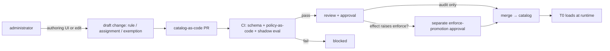

# Rule Governance

How an administrator **controls** rules - authoring, parameterizing, scoping, enabling, and
exempting them - the way Azure Policy lets an operator manage definitions, assignments, and
exemptions. This is the human-facing control surface over the rule catalog.

It builds on the collected/normalized rules in
[rule-catalog-collection.md](rule-catalog-collection.md) and the deterministic evaluation in
[phase-1-rule-catalog-t0.md](../phases/phase-1-rule-catalog-t0.md). It obeys the app-shape rule
that the **console is read-only and actions flow through PRs**, never UI buttons
([app-shape.instructions.md](../../../.github/instructions/app-shape.instructions.md)), and the
shadow-before-enforce and safety invariants in
[architecture.instructions.md](../../../.github/instructions/architecture.instructions.md).

> Customer-agnostic: all identifiers, scopes, and values below are synthetic placeholders per
> [generic-scope.instructions.md](../../../.github/instructions/generic-scope.instructions.md).

> **Implementation status**: Effect/scope/assignment/rule-set domain models, strict YAML loaders,
> the directory catalog loader, and effect/enforcement transition CI are implemented. T0 runtime
> composition doesn't consume resolved assignments yet. Exemptions have a separate Azure-shaped
> schema/loader and CLI, but aren't part of the governance directory loader and have no expiry job
> or notification wiring. Override schema/loader/runtime resolution and governance PR OID/quorum CI
> remain target design.

## Model (three layers, like Azure Policy)

Azure Policy separates *definition* from *assignment* from *exemption*. FDAI mirrors that
so administrators get a familiar mental model:

| Azure Policy concept | FDAI artifact | What it is |
|----------------------|-----------------------|------------|
| policy definition | **rule** | a single testable control ([rule-catalog-collection.md](rule-catalog-collection.md)) |
| initiative (policy set) | **rule set** | a named, versioned group of rules (e.g. a security baseline) |
| assignment | **assignment** | a rule/rule-set applied to a scope, with parameters and an effect |
| assignment `enforcementMode` | **enforcement flag** | `enforce` vs `do-not-enforce` (shadow); orthogonal to effect |
| exemption (waiver / mitigated) | **exemption** | a time-boxed, justified suppression of a rule on a bounded Azure scope; assignment/category metadata is future schema work |
| effect (audit/deny/...) | **effect / mode** | what happens on violation (see Effects) |

A rule is inert until an **assignment** binds it to a **scope** with an **effect**. This is the
key to administrator control: authors write rules once; operators decide *where*, *how strict*,
and *with what parameters* they apply.

## Effects (Mode)

The effect is the safety dial. It maps onto the shadow→enforce lifecycle, not just a label:

| Effect | Azure Policy analog | Meaning | Safety tier |
|--------|---------------------|---------|-------------|
| `disabled` | `disabled` | rule/assignment is off | inert |
| `audit` | `audit` / `auditIfNotExists` | judge and log only, no change (equivalent to **shadow mode**) | safe default |
| `deny` | `deny` / `denyAction` | block the non-compliant change at the PR/admission gate | enforce (gated) |
| `remediate` | `modify` / `deployIfNotExists` | generate an auto-remediation PR (never auto-merged; always via risk gate / HIL) | enforce (gated) |

Effect (what to do on violation) is orthogonal to **enforcement mode** (whether to act at all),
mirroring Azure Policy's `enforcementMode`. An assignment carries both: `effect` plus
`enforcement: enforce | do-not-enforce`. `do-not-enforce` runs the check what-if only and is the
mechanism behind `audit`/shadow; promotion to enforce flips this flag under the promotion gate.
A **rule set** may declare a `default_effect` per rule and an **assignment** may override it per
rule (`effect_overrides`), like an initiative setting effects that an assignment tunes; the
assignment's top-level `effect` is the default for rules without an override.

**Allowed effect/enforcement transitions** (any transition not listed is rejected in CI):

| From | To | Gate |
|------|----|----|
| `disabled` | `audit` | standard review |
| `audit` (shadow) | `deny` / `remediate` (enforce) | **separate enforce-promotion approval** |
| `deny` / `remediate` | `audit` | standard review (demotion always allowed - fail toward safety) |
| any active state | `disabled` | standard review (records why) |

- **New assignments default to `audit` (shadow) with `enforcement: do-not-enforce`.** Promotion to
  `deny`/`remediate` is an explicit, separately reviewed change gated on (1) a minimum shadow dwell
  time and sample size, (2) measured shadow accuracy above threshold, and (3) zero policy-violation
  escapes ([architecture.instructions.md](../../../.github/instructions/architecture.instructions.md)).
- A regression **auto-demotes** the assignment back to `audit`; demotion never needs the promotion
  gate, so safety degradation is always fast.
- The **absence** of an assignment means the rule is unenforced on that scope (governance is
  default-audit, not default-deny); this does not fail open at runtime - an unmatched or ambiguous
  event still routes to HIL per
  [architecture.instructions.md](../../../.github/instructions/architecture.instructions.md).
- `deny`/`remediate` actions carry the four safety invariants (stop-condition, rollback,
  blast-radius limit, audit entry) from
  [coding-conventions.instructions.md](../../../.github/instructions/coding-conventions.instructions.md).
  A misfiring `deny` is recoverable via the global kill-switch or a time-boxed exemption (its blast
  radius is *blocking legitimate change*); a `remediate` PR is idempotent - a re-evaluated finding
  updates the open PR rather than opening duplicates.

> **Implementation status**: the effect foundation ships in
> [`rule_catalog/schema/effect.py`](../../../src/fdai/rule_catalog/schema/effect.py) - the
> `Effect` (`disabled` / `audit` / `deny` / `remediate`) and `Enforcement`
> (`enforce` / `do-not-enforce`) enums, the strictest-effect precedence
> (`deny` > `remediate` > `audit` > `disabled`) used to resolve conflicting assignments, and
> `validate_effect_transition` enforcing the transition table above (a raise to an enforce effect
> requires the separate promotion approval). The scope selection layer ships alongside in
> [`rule_catalog/schema/scope.py`](../../../src/fdai/rule_catalog/schema/scope.py) - the
> `ScopeLevel` hierarchy, `ScopeSelector` (resource-type / tag / resource-id, AND-of-declared),
> exclusions, `Scope.covers`, and the `most_specific` precedence helper. The `Assignment` artifact
> and the `resolve_assignments` conflict resolver (strictest effect wins; the most-specific scope
> supplies parameters; a specificity tie flags HIL; losers recorded for audit) ship in
> [`rule_catalog/schema/assignment.py`](../../../src/fdai/rule_catalog/schema/assignment.py). The
> `RuleSet` (initiative) grouping - version-pinned members with per-rule `default_effect` and
> `assignment_from_rule_set` - ships in
> [`rule_catalog/schema/rule_set.py`](../../../src/fdai/rule_catalog/schema/rule_set.py). The
> governance model layer (effect / scope / assignment / rule-set) is complete in-memory. The
> assignment catalog-as-code loader also ships:
> [`assignment.schema.json`](../../../src/fdai/rule_catalog/schema/assignment.schema.json) +
> `load_assignment_from_mapping`
> ([`governance_loader.py`](../../../src/fdai/rule_catalog/schema/governance_loader.py)), which
> validates a YAML assignment and builds the domain object, failing at the boundary with every
> schema issue. The rule-set loader (`rule_set.schema.json` + `load_rule_set_from_mapping`) ships
> in the same module. A directory loader
> ([`governance_catalog.py`](../../../src/fdai/rule_catalog/schema/governance_catalog.py),
> `load_governance_catalog`) reads the whole catalog-as-code tree (`assignments/` + `rule-sets/`),
> aggregating every file's issues. An assignment binds either an explicit `target_rule_ids` list or
> a `rule_set` (by id): the loader resolves a rule-set reference against the loaded rule-sets and
> expands it via `assignment_from_rule_set` (carrying the set's per-rule `default_effect` as
> overrides), so "rule-set applied to a scope" works end-to-end; an unresolved reference fails at the
> load boundary. The CI transition gate core also ships:
> `validate_catalog_transition`
> ([`governance_transitions.py`](../../../src/fdai/rule_catalog/schema/governance_transitions.py))
> compares a previous and current `GovernanceCatalog` and rejects any per-rule effective-effect
> transition outside the allowed table - a new assignment/rule is validated from the mandated
> `audit` default, and raising to an enforce effect (`deny` / `remediate`) needs the assignment id
> in `promotions_approved`. The **enforcement** `do-not-enforce` -> `enforce` activation - the go-live
> flip that takes an enforce-tier effect out of shadow - needs the same approval, so a two-step
> `deny(shadow)` then `deny(enforce)` cannot reach production unreviewed. A thin `git`-diff CI script
> ([`check-governance-transitions.py`](../../../scripts/governance/check-governance-transitions.py)) wraps the
> validator: it materializes the catalog at the base ref and the working tree and fails the build on
> a rejected transition. The gate governs **effect + enforcement** transitions; it does not flag a
> scope / blast-radius **widening** (a lower-specificity scope can be offset by a tighter `selector`, so a
> sound widening check needs coverage analysis, not a specificity heuristic) - that is a separate
> future check. The remaining follow-up is the T0 runtime that consumes a resolved assignment.
>
> The shipped catalog-as-code schema now matches the "YAML Shapes" section below: a shared
> `Provenance` value object ([`provenance.py`](../../../src/fdai/rule_catalog/schema/provenance.py)),
> the `kind` ([`governance_kind.py`](../../../src/fdai/rule_catalog/schema/governance_kind.py))
> discriminator plus an artifact `version`, the canonical `scope://`
> [`ScopeRef`](../../../src/fdai/rule_catalog/schema/scope.py) address and the include/exclude
> [`ScopeBinding`](../../../src/fdai/rule_catalog/schema/scope.py) form (unified behind the
> `ScopeMatcher` protocol), and per-rule `parameter_overrides` all ship. A rule-set is bound through
> `rule_set` (or an explicit `target_rule_ids` list) and scope narrowing uses the richer `selector`
> (`resource_types` / `tags` / `resource_ids`).

## Scope

Scope selects which resources an assignment covers, CSP-neutrally:

- **Hierarchy**: organization → account/subscription → resource-group → resource.
- **Selectors**: by resource-type, by tag/label, or by an explicit resource-id allowlist.
- **Exclusions**: a scope may exclude child scopes (e.g. apply org-wide but exclude a sandbox).
- Scope is data; the executor still holds only its least-privilege identity and action whitelist
  ([security-and-identity.md](../architecture/security-and-identity.md)) - a broad scope never widens execution
  privilege.
- **Scope precedence**: when nested scopes both bind the same rule, the **most-specific scope
  wins** for parameters; for conflicting *effects* the **strictest effect wins**
  (`deny` > `remediate` > `audit` > `disabled`), and a genuine tie escalates to HIL - consistent
  with the deterministic order in
  [phase-1-rule-catalog-t0.md](../phases/phase-1-rule-catalog-t0.md#deduplication-conflict-and-precedence).
- **Conflicting assignments** on the same rule+scope resolve by that same strictest-effect-wins
  rule; the losing assignment is recorded in the audit trail so the resolution is reviewable, and a
  time-boxed exemption is the only sanctioned way to relax the strict outcome.

## Administrator Control Flow (GitOps, not buttons)

Administrators control rules exactly like changing Azure Policy - author, parameterize, assign,
exempt - but the change is delivered as a **reviewed PR to catalog-as-code**, so audit, rollback,
and approval come from git for free:



- The console MAY offer an **authoring UI**, but it only **produces a draft PR** - it never
  executes or mutates the live catalog directly (keeps the console read-only).
- Every governance change (create/modify rule, assignment, exemption, effect change) is a PR with
  an author, reviewer, and audit trail. Raising an effect toward enforce requires the extra
  promotion approval.
- A draft PR is validated **against the current merged catalog**, not the authoring UI's local
  view; a stale draft must rebase, so the live catalog stays the single source of truth and
  concurrent edits cannot silently clobber each other. Approvals happen in git (or ChatOps), never
  as a console button - the console only renders state and emits draft PRs.

## Custom Rules and Precedence

Administrators can add **custom rules** alongside collected (built-in) rules, just as Azure Policy
allows custom definitions beside built-ins:

- A custom rule uses the same schema, with `source: custom` and full shipped `provenance`
  (`source_url`, immutable ref/hash, license/redistribution, retrieval time, and optional mapper).
- **Precedence** when a custom and a built-in rule overlap follows the deterministic order in
  [phase-1-rule-catalog-t0.md](../phases/phase-1-rule-catalog-t0.md#deduplication-conflict-and-precedence)
  (severity, then source priority, ties → HIL). A custom source is given an explicit
  `priority_rank` so overrides are intentional and auditable, never accidental. Custom does **not**
  automatically outrank built-in: a custom rule that would *weaken* a built-in `deny` is flagged in
  CI and requires explicit review, so a control is never silently relaxed.
- Custom rules follow the same shadow-before-enforce lifecycle; a custom `deny` is not exempt
  from the promotion gate.
- **Untrusted authored input**: a custom rule's `check-logic`, `remediation`, and any parameter
  values are validated against schema at load and evaluated **only** through the sandboxed policy
  engine (OPA) - never string-interpolated into shell or provider API calls - closing the
  injection path from rule text or parameters
  ([coding-conventions.instructions.md](../../../.github/instructions/coding-conventions.instructions.md)).

## Exemptions

An exemption waives an assignment for a scope, like an Azure Policy exemption:

- Current required fields are `rule_id`, an Azure-shaped `scope` bounded to a resource group or
  resource, **justification**, distinct `requested_by` / `approved_by` UUIDs, `state`, `created_at`,
  and `expires_at`. The loader enforces no self-exemption and `expires_at > created_at`.
- The current schema doesn't store an assignment reference or waiver/mitigated category and doesn't
  enforce a configured maximum duration. That metadata and maximum-duration policy are follow-up
  contracts.
- Auto-renew isn't supported. Re-application on expiry and ahead-of-expiry ChatOps alerts are
  unwired operational workflows; the CLI/review process currently updates artifact state.
- Every exemption and its expiry is audited; an exemption never suppresses the audit record of the
  underlying finding - it records *why* it was accepted, not that it did not occur.

## Overrides

> **Current status**: The override contract below isn't implemented. The repository has no
> override-specific schema, catalog loader, or runtime resolver. Current supported relaxation
> paths are time-boxed exemptions and catalog/rule retirement.

An **override** is the human control surface *above* the automated quality gate: an operator
declares that a rule is too aggressive in a specific environment and narrows, downgrades, or
disables it - without editing the rule. Overrides are what
[architecture.instructions.md](../../../.github/instructions/architecture.instructions.md#human-override)
means by "human override on top". They complement, not replace, exemptions.

### When to Use Which

| Situation | Use |
|-----------|-----|
| A specific resource has an accepted-risk or mitigated waiver for a bounded time | **exemption** (time-boxed) |
| The rule itself is systematically too aggressive for a resource-group, indefinitely | **override** (may be permanent) |
| The rule is a poor fit everywhere and should not exist | **rule retirement** via the catalog pipeline, not an override |

An override is not a waiver of an individual finding - it is a scoped policy stance that the
rule's shipped behavior does not match this environment.

### Rules (MUST)

- **Policy-as-code, separate artifact**. An override is its own catalog-as-code entry
  (`kind: override`); it never edits the target rule's text. Removing the override restores
  the rule automatically, and an upstream rule update flows through untouched.
- **Scope MUST be resource-group-equivalent or narrower** - the `resource-group` layer of the
  scope hierarchy above, or a specific `resource`. Organization- and account/subscription-wide
  overrides are rejected in CI; disabling a rule everywhere is a **rule retirement**, which
  goes through the catalog pipeline, not an override.
- **Permitted modes**: `disabled` (rule off in the scope), `severity-downgrade`
  (e.g. `critical -> medium`), and `parameter-relaxation` (widen a threshold within the range
  the rule's schema declares). Any other broadening is rejected.
- **No forced expiry**: an override MAY be long-lived; `expires_at` is optional. This is the
  key difference from an exemption. A justification is always required.
- **Distinct approver**: the requester MUST NOT be the approver (no self-override), mirroring
  the exemption rule and the approval≠execution boundary in
  [security-and-identity.md](../architecture/security-and-identity.md).
- **Shadow keeps running**: an override disables *execution* on the scope, not detection. The
  evaluator continues to record what the rule would have flagged and feeds those findings to
  the autonomous discovery loop in
  [rule-catalog-collection.md](rule-catalog-collection.md#autonomous-rule-discovery).
- **Audit-first**: every override create/modify/remove event is an append-only audit entry
  (actor, reason, target rule, scope, mode). An override never suppresses the audit record of
  the underlying finding - it records *why* execution was suppressed on that scope.

### Precedence

- An override wins over an assignment's effect **on the scope it covers**. If a rule has
  `effect: deny` from a promotion approval but an override on resource-group `R` sets
  `mode: disabled`, the rule is inert in `R` and enforced everywhere else.
- Outside the override's scope, the standard scope-precedence in [Scope](#scope) applies
  unchanged (most-specific scope wins, strictest effect wins, ties → HIL).
- Overrides do **not** stack: at most one active override per (rule, scope) pair. A second
  override on the same pair replaces the first, and both create and replace events are
  audited.

### Feedback Loop

- Overrides are inputs to the discovery loop
  ([rule-catalog-collection.md](rule-catalog-collection.md#override-feedback)). When a rule
  accumulates recurring or long-lived overrides across scopes, the loop proposes a
  **revision** (narrow the rule) or a **retirement** (rule is a systemic poor fit); either
  proposal still passes the quality gate before it can enter the catalog.
- The console MAY surface an "over-overridden rules" view for operators; it remains
  read-only, and proposing a revision/retirement is still a PR.

## RBAC (who can do what)

Authoring, approving, assigning, and exempting are **separate permissions** - no self-approval,
mirroring the approval≠execution rule in
[security-and-identity.md](../architecture/security-and-identity.md). These are **logical** governance roles;
they map to a small set of Entra security groups (Reader / Contributor / Approver / Owner +
Break-Glass) in [user-rbac-and-identity.md](../interfaces/user-rbac-and-identity.md). Several logical roles
collapse to the same Entra group - no-self-approval is enforced by CI on PR authorship, not by
group separation, and high-risk approvals (`audit → deny / remediate`, exemption, override)
require a **quorum of two approvers** from `aw-approvers`.

| Logical role | Entra group | May | May not |
|--------------|-------------|-----|---------|
| Rule author | `aw-contributors` | propose rules/rule-sets (draft PR) | approve or assign their own change |
| Approver | `aw-approvers` | review/approve governance PRs | author the change they approve |
| Assignment operator | `aw-contributors` | bind rules to scopes, set parameters/effect (via PR) | approve the enforce promotion alone |
| Enforce-promotion approver | `aw-approvers` (quorum-2) | approve `audit`→`deny`/`remediate` promotions | be the operator who proposed the promotion |
| Exemption approver | `aw-approvers` (quorum-2) | approve time-boxed exemptions | grant a permanent exemption, or approve their own request |
| Override approver | `aw-approvers` (quorum-2) | approve resource-group-scoped overrides (may be permanent) | approve an override outside the resource-group-equivalent scope, or approve their own request |

None of these governance roles hold the **executor's** identity; authoring/approving a rule never
grants the ability to run an action. Enforce promotions, exemptions, and overrides are the
highest-privilege governance acts and require MFA / phishing-resistant, action-bound approval
([security-and-identity.md](../architecture/security-and-identity.md)) enforced via Conditional Access on
`aw-approvers` and `aw-owners`
([user-rbac-and-identity.md#conditional-access](../interfaces/user-rbac-and-identity.md#43-conditional-access)).

The **risk-classification table** ([risk-classification.md](../decisioning/risk-classification.md)) is a
sibling governance artifact that decides how each match is routed (`auto` / `hil` / `deny`).
It is edited through the same PR flow as rules and assignments, with an elevated quorum
and Owner-tier reviewer for loosening changes.

## Lifecycle and Versioning

- Rules, rule-sets, and assignments are versioned catalog-as-code. Exemptions carry a stable id,
  state, and creation/expiry timestamps but no artifact `version` in the current schema. Tracked
  file changes remain revertible through their PR history.
- Rule states: `draft → audit(shadow) ⇄ enforce(deny/remediate) → deprecated`, with `disabled`
  reachable from any active state and the `enforce → audit` demotion always available. Deprecation
  tombstones the rule (never a silent delete) so history stays reconstructable.
- Changing a rule's logic bumps its `version`; changing an assignment's parameters/effect/scope is
  itself an audited, versioned change. A rule set **pins the `version` of each member rule** so a
  rule change cannot silently alter a promoted set.
- **Testability**: every assignment/exemption PR ships fixtures - the expected match set (which
  synthetic resources the scope selects) and, for enforce promotions, the shadow-eval sample the
  promotion gate scored - so governance changes are regression-tested like rule changes
  ([coding-conventions.instructions.md](../../../.github/instructions/coding-conventions.instructions.md)).

## YAML Shapes

### Rule Set (initiative)

```yaml
schema_version: 1.0.0
kind: rule-set
id: ruleset.security-baseline
version: 1.0.0
members:
  - { rule_id: object-storage.public-access.deny, version: 1.0.0, default_effect: deny }
  - { rule_id: sql-database.tde-required, version: 1.0.0, default_effect: audit }
  - { rule_id: postgresql-server.point-in-time-restore, version: 1.0.0, default_effect: audit }
provenance:
  created_at: 2026-07-03T00:00:00Z
  created_by: governance-team
```

### Assignment

```yaml
schema_version: 1.0.0
kind: assignment
id: assignment.security-baseline.prod
version: 1.0.0
rule_set: ruleset.security-baseline
scope:
  include:
    - scope://org/account-000/prod
  exclude:
    - scope://org/account-000/prod/sandbox
  selector:
    resource_types: [sql-database, postgresql-server, object-storage]
effect: audit
enforcement: do-not-enforce
effect_overrides:
  object-storage.public-access.deny: audit
parameter_overrides:
  postgresql-server.point-in-time-restore:
    min_retention_days: "14"
provenance:
  created_at: 2026-07-03T00:00:00Z
  created_by: assignment-operator
```

### Exemption

```yaml
schema_version: 1.0.0
id: exemption.legacy-store.public-access
rule_id: object-storage.public-access.deny
scope:
  subscription_id: 00000000-0000-0000-0000-000000000000
  resource_group: example-resource-group
justification: Documented migration remains in progress with a compensating control.
requested_by: <requester-entra-oid>
approved_by: <distinct-approver-entra-oid>
state: active
created_at: 2026-07-03T00:00:00Z
expires_at: 2026-09-30T00:00:00Z
```

`requested_by` and `approved_by` must be distinct UUIDs supplied by the deployment. Named
placeholders avoid placing real tenant identifiers in this repository example.

### Override

```yaml
id: override.pitr-relaxation.rg-analytics
version: 1.0.0
kind: override
target_rule: postgresql-server.point-in-time-restore
scope: scope://org/account-000/prod/rg-analytics
mode: parameter-relaxation
parameter_overrides:
  min_retention_days: 3
justification: Non-critical analytics workloads with 3-day retention accepted by the data owner.
requested_by: assignment-operator
approver: override-approver
provenance:
  created_at: 2026-07-03T00:00:00Z
  created_by: assignment-operator
```

> `rule-set` and `assignment` have strict schemas read by the governance catalog loader;
> `exemption` has a separate strict schema/CLI. The `override` shape is a target example with no
> loader yet. Each rule-set member pins a rule `version`. Typed validation of
> `parameter_overrides` remains follow-up work; the current assignment schema accepts string
> values. Exemption `requested_by` must differ from `approved_by`. The assignment above is intentionally held **fully
> in shadow** - the rule set's `deny` default for `object-storage.public-access.deny` is
> overridden to `audit` and `enforcement` is `do-not-enforce` until a separate promotion approval
> flips it.

## Open Decisions

- [ ] Adapter that resolves the implemented `scope://...` syntax against the Azure resource
  hierarchy (non-Azure resolution is TBD; see
  [Always-On Rules](../../../.github/copilot-instructions.md#always-on-rules-must)).
- [ ] Whether the authoring UI ships in the console (draft-PR only) in P1 or P3.
- [ ] The concrete parameter **type vocabulary** (int/string/enum/bool/array + range/pattern
      constraints) that CI validates `parameter_overrides` against.
- [ ] The configured **maximum exemption duration** and the ahead-of-expiry alert lead time.
- [ ] The exact CI check that enforces "override scope is resource-group-equivalent or
      narrower" against the Scope URI grammar (must reject organization/account/subscription
      scopes deterministically).
- [ ] The permitted `parameter-relaxation` bounds per rule - where a rule declares the
      relaxation range in its own schema vs a governance-level cap that overrides cannot
      exceed.
- [ ] The signal thresholds the discovery loop uses to flag "over-overridden" rules (number
      of distinct scopes with an active override, dwell time, and shadow-hit rate) before
      proposing a revision/retirement.
