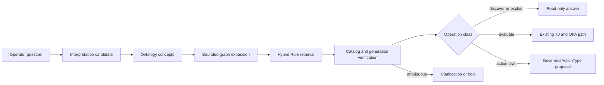

# Rule 의미 검색

이 문서는 FDAI가 검색, 생성 메타데이터 또는 벡터에 권한을 부여하지 않으면서 자연어 정책
질문을 제한된 Rule 후보로 변환하는 방법을 정의합니다. 활성 및 발견 코퍼스, 의미 surface
수명 주기, 인덱스 generation, 검색 receipt, 평가 게이트 및 실패한 질의 피드백 루프를 다룹니다.

> **권한 경계:** Git catalog-as-code는 활성 Rule, Policy 및 승격된 의미 surface의 권한 있는
> 원본입니다. PostgreSQL 검색 행과 embedding은 다시 만들 수 있는 읽기 projection입니다.
> 검색 결과는 정책, 승인 또는 실행 권한을 부여하지 않습니다.
>
> **안전 경계:** Rule 발견과 정책 평가는 별개의 작업입니다. OPA는 기존 T0 경로를 통해
> 스키마에 맞고 현재 상태인 근거를 사용하는 정확한 활성 Rule만 평가합니다.
>
> **구현 기준선:** FDAI는 현재 근거가 확인된 활성 Rule 문서를 lexical 및 pgvector 혼합
> 인덱스로 projection합니다. 이 문서의 관리되는 surface, 원자적 generation 수명 주기,
> 개념 우선 typed query 및 challenger 피드백 계약은 다음 구현 단계입니다.

## 설계 개요

FDAI는 Rule 순위를 정하기 전에 의미를 해석합니다. 정확한 카탈로그 ID와 검토된 온톨로지
링크로 후보 집합을 제한하고, lexical 및 vector 검색으로 다양한 자연어 표현을 수용합니다.



이 흐름은 다음 세 가지 구분을 유지합니다.

- **의미와 순위:** 온톨로지 ID와 링크는 유효한 개념을 정의하고, 검색은 제한된 의미 안에서
  후보의 순위를 정합니다.
- **검색과 평가:** Rule을 찾는 것은 Rule을 평가하는 작업이 아닙니다. 정책 평가에는 정확한
  활성 Rule ID와 권한 있는 리소스 근거가 필요합니다.
- **후보와 권한:** lexical, embedding 및 모델 출력은 후보로 유지됩니다. 검토와 정확한
  카탈로그 근거가 의미 surface의 활성화 가능 여부를 결정합니다.

## 코퍼스 경계

인덱스는 운영 Rule과 수집된 발견 자료를 분리합니다.

| 코퍼스 | 내용 | 허용된 사용 | 허용되지 않는 사용 |
|--------|------|-------------|---------------------|
| `active` | Git의 검토된 Rule과 승격된 의미 surface | Operator 검색, 설명, 정확한 T0 평가 라우팅 | 검색 점수를 정책 판정으로 취급 |
| `discovery` | 아직 승격되지 않은 수집, 정규화 또는 생성 후보 | 카탈로그 큐레이션, 갭 분석, shadow 검색 평가 | OPA 평가, Finding, action proposal 또는 실행 |

질의는 기본적으로 `active`를 사용합니다. 후보 자료를 확인하려면 운영자가 discovery 범위를
명시적으로 선택해야 합니다. 각 결과는 코퍼스를 포함하므로 presentation에서 이 경계를 숨길
수 없습니다.

## 의미 아티팩트

다섯 개의 변경 불가능한 계약이 수명 주기를 전달합니다.

### RuleSemanticManifest

결정론적 manifest는 원본 아티팩트가 증명하는 내용을 기록합니다.

- 정확한 Rule ID와 버전
- 정책 및 콘텐츠 digest
- parser 및 parser 버전
- 원본 종류 및 재배포 등급
- 리소스, signal, property, policy 및 ActionType 참조
- 온톨로지 release digest
- 원본 parser가 증명할 수 있는 경우의 정규화된 predicate

누락된 의미는 unknown으로 유지됩니다. Parser는 predicate, concept 또는 relationship을
추측하지 않습니다.

### RuleSemanticSurface

의미 surface는 운영자가 한 manifest의 의미를 표현할 수 있는 방식을 제안합니다. 검토된
intent ID, ontology concept 참조, 지역화된 alias, 학습 paraphrase 및 hard negative를 포함할
수 있습니다. Severity, risk, applicability, enforcement 또는 action authority는 설정할 수
없습니다.

각 surface는 manifest digest, locale, generator 및 prompt receipt, evidence 참조, 상태,
validation receipt와 content digest를 기록합니다. 상태는 `candidate`, `validated`,
`promoted`, `retired`, `rejected`입니다. 새 surface는 `candidate`로 시작합니다.

### CatalogSearchGeneration

하나의 generation은 완전한 검색 가능 코퍼스를 고정합니다.

- 코퍼스 및 catalog revision
- semantic schema 및 ontology release digest
- embedding space ID, model version 및 dimension
- 정렬된 document digest 및 행 수
- build 및 validation receipt
- lifecycle state 및 activation time

코퍼스마다 하나의 generation만 활성화됩니다. Worker는 비활성 generation을 만들고 검증한
다음 active pointer를 원자적으로 변경합니다. Build가 실패하면 이전 generation은 변경되지
않습니다.

### CatalogRetrievalReceipt

각 검색은 query digest, operation class, corpus, catalog 및 generation digest, 제한된 filter,
결과 Rule 참조, ranking component, truncation 및 degraded state를 기록합니다. Ranking score는
근거 구성 요소이며 확률 또는 신뢰도 값이 아닙니다.

### SurfaceValidationReceipt

Validation receipt는 surface, 고정 dataset, evaluator, metric configuration, cohort 결과,
실패 및 결정을 고정합니다. Validation은 후보를 검토 대상으로 승인하거나 보류할 수 있습니다.
자체적으로 surface를 승격할 수는 없습니다.

## 빌드 및 의미 확장 수명 주기

Build pipeline은 등록된 parser를 통해 각 원본을 처리합니다. 작성된 Rego는 OPA AST parsing을
사용합니다. Azure Policy, kube-bench 및 기타 수집 형식은 하나의 공통 manifest 계약에 들어가기
전에 원본별 parser를 사용합니다.

```text
source revision
  -> verify provenance and redistribution
  -> parse deterministic semantics
  -> build RuleSemanticManifest
  -> propose RuleSemanticSurface
  -> validate held-out retrieval cohorts
  -> reviewed Git promotion
  -> build inactive index generation
  -> independent generation validation
  -> atomic activation
```

모델 의미 확장은 request 및 API startup 경로 밖에서 실행됩니다. 원본 텍스트는 신뢰하지 않는
데이터이며 모델 instruction으로 취급하지 않습니다. 알 수 없는 concept ID는 온톨로지를 자동으로
확장하지 않고 inert ontology proposal을 생성합니다.

### 라이선스 경계

`reference-only` 원본 텍스트, 파생 발췌문, 생성 paraphrase 및 embedding은 재배포 대상이 될 수
없습니다. 해당 원본은 독립적으로 작성된 정규화 logic과 제한된 provenance 참조만 제공할 수
있습니다. 허용된 입력 lineage를 증명할 수 없으면 의미 확장 게이트가 surface를 차단합니다.

## 질의 수명 주기

Rule 검색에는 서로 다른 계약을 사용하는 두 개의 읽기 surface가 있습니다.

### 카탈로그 참조 검색

`/rules` 참조 route는 텍스트와 결정론적 filter를 받습니다. Exact, lexical, neighbor 및 semantic
ranking 근거를 반환할 수 있지만 모든 결과는 읽기 전용 후보로 유지됩니다. Semantic generation이
누락되거나 오래되었거나 사용할 수 없으면 route는 현재 카탈로그의 lexical search를 사용하고
degraded semantic state를 보고합니다.

### 대화형 개념 검색

자연어 operation planning은 Rule declaration 자체가 아니라 `catalog.search_rules`와 같은
읽기 전용 ontology function을 대상으로 합니다. Function은 typed intent, concept, resource,
property, category 및 corpus filter를 받습니다. 검증된 semantic plan도
`execution_authority: false`를 유지합니다.

질의 경로는 다음 순서를 사용합니다.

1. 정확한 Rule ID와 검토된 lexical term을 확인합니다.
2. Intent와 ontology concept 후보를 제안합니다.
3. Node 및 depth 제한 안에서 허용 목록의 typed link만 확장합니다.
4. 결과 후보 집합 안에서 hybrid ranking을 실행합니다.
5. 활성 catalog 및 generation ID를 검증합니다.
6. 후보를 반환하거나, 명확화를 요청하거나, 근거가 부족하면 보류합니다.

평가 요청은 정확한 활성 Rule과 현재 resource evidence를 사용해 기존 T0 경로로 다시 들어갑니다.
Action 요청은 ActionType에 바인딩된 proposal이 되어 일반 judgment, approval, execution,
recovery 및 audit pipeline을 따릅니다.

## 검색 평가

평가 dataset은 surface build에 사용한 자료와 측정에 사용하는 held-out question을 분리합니다.
인덱스에 포함된 training phrase를 평가 집합에 복사하면 의미 일반화가 아니라 저장 기능만
검사하게 됩니다.

필수 cohort는 다음과 같습니다.

- 정확한 Rule ID 및 canonical term
- 독립적으로 작성된 영어 및 한국어 paraphrase
- 가까운 sibling Rule 및 모순된 hard negative
- 명시적인 no-match 및 ambiguous question
- 오래된 catalog 및 오래된 generation 사례
- prompt-injection, control-character, confusable 및 oversized input
- active 및 discovery corpus isolation

Metric에는 제한된 순위의 recall, mean reciprocal rank, normalized discounted cumulative gain,
no-match precision, clarification utility, cohort coverage 및 latency가 포함됩니다. Promotion
threshold는 측정된 baseline 이후 선택하는 configuration입니다. 전체 성공값으로 실패한 resource,
language, severity 또는 source cohort를 숨길 수 없습니다.

정책 동작은 별도의 OPA fixture를 사용합니다. Retrieval benchmark는 Rule predicate의 정확성을
주장하지 않으며, OPA fixture는 자연어 검색의 일반화를 주장하지 않습니다.

## 실패한 질의 피드백

운영 실패는 먼저 결정론적으로 원인을 분류합니다. 지원되는 계층에는 stale generation,
missing concept, mapping gap, ranking error, ambiguity, inactive Rule, provider evidence 및
presentation이 포함됩니다. 재현된 검색 소유 실패만 의미 surface 후보를 만들 수 있습니다.

피드백에는 다음 제어가 적용됩니다.

- 원본 operator text는 deployment local에 유지하고 redaction, access scope 및 retention limit를 적용합니다.
- 생성된 질문과 사용자 질문은 서로 다른 origin metadata를 유지합니다.
- Candidate 생성 전에 duplicate, rate, principal 및 poisoning control을 실행합니다.
- 사용자 수정은 근거이며 oracle이 아닙니다.
- 승격 검토 전에 정확한 target Rule과 독립된 validation이 필요합니다.
- Candidate는 challenger로 실행되며 보이는 ranking을 변경할 수 없습니다.
- Regression은 활성 generation을 변경하지 않고 challenger를 자동으로 철회합니다.

Online request는 활성 surface 또는 vector row를 변경하지 않습니다.

## 에이전트 소유권

고정 pantheon은 indexer agent를 추가하지 않고 capability를 소유합니다.

| 단계 | 책임 에이전트 | 계약 |
|------|---------------|------|
| 외부 catalog revision 수신 | Huginn | 원본 event를 정규화하고 publish하며 catalog는 쓰지 않음 |
| 실패한 질의 candidate discovery | Norns | inert하고 중복 제거된 candidate만 생성 |
| Rule, Policy 및 promoted surface lifecycle | Mimir | catalog ID를 검증하고 governed outcome을 publish |
| Retrieval 및 generation observation | Heimdall | promotion authority 없이 독립된 evaluation evidence 생성 |
| 상관 audit | Saga | candidate, validation, activation, degradation 및 retirement evidence 추가 |
| 자연어 presentation | Bragi | 번역, candidate 표시 및 clarification 요청만 수행하며 판단하거나 실행하지 않음 |

Build worker는 Mimir가 소유하는 기계적 capability입니다. 권한이 있는 transition은 typed event를
통해 이동합니다. Operator API는 active projection을 읽으며 surface를 승격하거나 generation을
활성화하지 않습니다.

## 실패 및 기능 저하

| 실패 | 안전한 동작 |
|------|-------------|
| Semantic index 또는 embedder를 사용할 수 없음 | 현재 Git 기반 catalog를 lexical search하고 semantic unavailability를 보고 |
| Active generation digest가 catalog와 다름 | Semantic result를 제외하고 stale generation을 보고 |
| Inactive generation build 또는 validation 실패 | 이전 active generation을 유지하고 실패를 audit |
| Active generation이 없음 | Exact 및 lexical search를 계속 제공 |
| Candidate ambiguity가 남음 | 평가 없이 clarification을 요청하거나 제한된 candidate list를 반환 |
| Evaluation evidence가 누락되었거나 오래됨 | OPA를 실행하거나 Finding을 만들지 않고 보류 |
| Feedback attribution을 결정할 수 없음 | Evidence만 유지하고 semantic candidate는 생성하지 않음 |

## 제공 순서

| 배치 | 결과물 | 완료 조건 |
|------|--------|-----------|
| S0 | 설계 및 competency question | Corpus, authority, storage, agent 및 failure contract를 영어와 한국어로 검토 가능 |
| S1 | 변경 불가능한 contract 및 corpus isolation | 잘못된 ref, digest, state, origin 및 cross-corpus operation이 안전하게 차단됨 |
| S2 | Deterministic manifest 및 licensing gate | Rego와 expression fixture가 재생 가능한 manifest를 생성하고 reference-only 위반은 차단됨 |
| S3 | Surface candidate 및 held-out evaluator | Training과 evaluation data가 겹칠 수 없고 모든 필수 cohort가 receipt를 생성 |
| S4 | 원자적 persistent generation | Search가 이전 또는 새로운 완전한 generation만 관측하며 혼합 corpus를 관측하지 않음 |
| S5 | Concept-first typed query | Exact, lexical, graph 및 semantic stage가 candidate-only authority와 clarification을 유지 |
| S6 | Challenger feedback | 재현된 retrieval failure가 durable inert candidate만 만들고 online active-index mutation이 없음 |
| S7 | Production projection 및 observability | Operator API startup이 embedding을 만들지 않고 health가 catalog 및 generation ID를 공개 |

## 관련 문서

| 학습 내용 | 문서 |
|-----------|------|
| Rule 원본, parsing 및 licensing | [Rule Catalog Collection](rule-catalog-collection-ko.md) |
| Rule lifecycle 및 human control | [Rule Governance](rule-governance-ko.md) |
| Typed ontology 및 time-consistent context | [FDAI Operating Ontology](../architecture/operating-ontology-ko.md) |
| 근거를 포함하는 semantic plan | [FDAI Ontology Safety Infrastructure](../architecture/operating-ontology-platform-ko.md) |
| Deterministic 및 model tiering | [LLM Strategy](../architecture/llm-strategy-ko.md) |
| Console authority boundary | [FDAI Console Conversations](../interfaces/operator-console-ko.md) |
