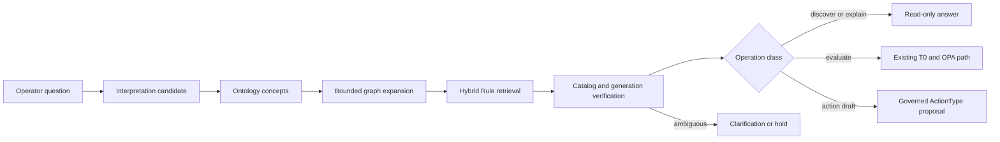

# Rule 의미 검색

이 문서는 FDAI가 검색, 생성 메타데이터 또는 벡터에 권한을 부여하지 않으면서 자연어 정책
질문을 제한된 Rule 후보로 변환하는 방법을 정의합니다. 활성 및 발견 코퍼스, 의미 표면
수명 주기, 인덱스 세대, 검색 증적, 평가 게이트 및 실패한 질의 피드백 루프를 다룹니다.

> **권한 경계:** Git catalog-as-code는 활성 Rule, Policy 및 승격된 의미 표면의 권한 있는
> 원본입니다. PostgreSQL 검색 행과 임베딩은 다시 만들 수 있는 읽기 변환 결과입니다.
> 검색 결과는 정책, 승인 또는 실행 권한을 부여하지 않습니다.
>
> **안전 경계:** Rule 발견과 정책 평가는 별개의 작업입니다. OPA는 기존 T0 경로를 통해
> 스키마에 맞고 현재 상태인 근거를 사용하는 정확한 활성 Rule만 평가합니다.
>
> **구현 상태 (2026-08-13):** FDAI는 결정론적 Rego 및 표현식 매니페스트, strict promoted
> 표면 로딩, held-out 집단 evaluation, privacy-safe challenger feedback, retained-generation
> 롤백 증적을 포함한 atomic in-memory 세대, 읽기 전용
> `catalog.search_rules` 함수, concept-first 범위가 제한된
> 수집, lexical 성능 저하 및 영속 StateStore challenger 저장소를 제공합니다.
> 직접 의미 런타임 구성은 호출자가 provider-neutral 의미 인덱스와 정확한 카탈로그
> 다이제스트를 함께 제공할 때만 함수를 바인딩합니다. 이 쌍이 없으면 principal 매니페스트는
> `catalog.search_rules`를 `runtime_binding_unavailable`로 기록하고 planner에 노출하지
> 않습니다. 저장소에는 아직 영속 운영 `CatalogSemanticIndex` 어댑터나 운영 bootstrap
> 바인딩이 없습니다. Reader-gated `POST /rules/search`는 Operator Service 변환 결과를 읽으며
> Core 함수를 직접 호출하지 않습니다. Core 기능이 연결된 곳에서 검색 및 함수 증적은
> `execution_authority: false`를 유지합니다.
> 재현된 retrieval-owned 실패는 Huginn 유입, Heimdall 검증, Saga 감사 및 Muninn 맥락
> 구체화를 거칩니다. Norns는 일반 합의 및 Mimir intake 전에 shadow 감사와 함께 inert
> challenger를 저장합니다.
> Rego 매니페스트는 이제 소스 다이제스트와 함께 정확한 deny 판정 경로와 위치 정보를 제외한
> 정규화된 OPA AST 다이제스트를 포함합니다. T0 평가기는 같은 식별자를 사용하고 allow 및 deny
> 결과에 입력과 결과가 연결된 평가 증적을 생성합니다. 검색은 해당 평가 증적 없이는 여전히
> 판정을 주장할 수 없습니다.

## 구현 상태

### 구현 범위

| 영역 | 상태 | 근거 | 참고 |
|------|------|------|------|
| 정확한 세대 Rule 질의 | implemented | `core/ontology_platform/catalog_queries.py`; `tests/core/ontology_platform/test_catalog_queries.py` | 실행 권한 없이 후보 전용 결과와 내용 기반 주소를 가진 검색 및 호출 증적을 반환합니다. |
| 선택적 의미 런타임 바인딩 | implemented | `composition/wire_semantic_query.py`; `tests/composition/test_wire_semantic_query.py` | 의미 인덱스와 정확한 카탈로그 다이제스트를 함께 요구합니다. |
| Planner 가용성 계상 | implemented | `core/ontology_platform/query_manifest.py`; `tests/core/ontology_platform/test_query_manifest.py`; current change focused checks | 읽을 수 있지만 바인딩되지 않은 함수는 구조 커버리지에 `runtime_binding_unavailable`로 남고 planning에서는 숨겨집니다. |
| In-memory 세대 및 검증 | implemented | `delivery/catalog_search/in_memory.py`; `delivery/catalog_search/generation.py`; `tests/delivery/catalog_search/test_ontology_generation.py`; `tests/rule_catalog/test_discovery_catalog_search.py` | 결정론적 off-path 세대, 독립적인 활성 및 발견 포인터, 코퍼스별 롤백을 지원합니다. 집중 테스트에서 실제 활성 Rule 62개와 발견 Rule 변환 결과 8,487개를 사용하지만 영속 운영 어댑터는 아닙니다. |
| 코퍼스 규모 세대 식별자 | in-progress | `rule_catalog/schema/rule_semantic_generation.py`; `rule_catalog/schema/discovery_rule.py`; `tests/rule_catalog/test_rule_semantic_retrieval.py`; `tests/rule_catalog/test_discovery_catalog_search.py` | 개수, 계층형 루트 및 범위가 제한된 청크 식별자로 8,549개 행을 나타냅니다. 실제 발견 Rule 8,487개는 순서가 있는 청크 34개를 생성합니다. 제공 메타데이터 통합은 아직 남아 있습니다. |
| 영속 운영 인덱스 및 bootstrap 연결 | not-started | `shared/providers/catalog_search.py`; `runtime/bootstrap.py` | 프로바이더 계약은 있지만 운영에 구성된 영속 `CatalogSemanticIndex` 구현은 없습니다. |
| Operator Rule 검색 변환 결과 | implemented | Operator Service workflow 매니페스트, 경로 및 PostgreSQL workflow 어댑터 | `POST /rules/search`는 개정 번호가 있는 구체화된 변환 결과를 읽으며 정책, 승인, 변경 또는 실행 권한을 부여하지 않습니다. |

### 구현 이력

| 날짜 | 상태 | 변경 | 근거 | 남은 작업 |
|------|------|------|------|-----------|
| 2026-08-13 | in-progress | 구현 ledger를 도입하고 근거 없는 운영 바인딩 주장을 수정했습니다. 선택적 정확한 다이제스트 구성과 바인딩되지 않은 Rule 검색의 타입이 지정된 planner unavailable 처리를 추가했습니다. 이전 이력은 재구성하지 않았습니다. | `current change`; `PYTHONPATH="$PWD/services/core-control-plane/src:$PWD/packages/service-contracts/src" .venv/bin/pytest -q services/core-control-plane/tests/composition/test_wire_semantic_query.py services/core-control-plane/tests/core/ontology_platform/test_query_manifest.py`에서 focused 테스트 19개가 통과했습니다. | 영속 운영 인덱스, 운영 bootstrap 바인딩, Core-to-Operator 변환 결과 발행 및 실제 증적을 추가합니다. |
| 2026-08-13 | in-progress | 최대 256개 행의 세대에는 순서가 있는 인라인 다이제스트를 유지하면서 코퍼스 규모 세대에 범위가 제한된 계층형 문서 식별자를 추가했습니다. | `current change`; 집중 `test_rule_semantic_retrieval.py` 모음에서 8,549개 행과 청크 34개 매니페스트, 256/257개 행 경계 및 실패 시 안전하게 닫히는 변조 사례를 포함한 테스트 17개가 통과했습니다. | 매니페스트를 제공 메타데이터와 통합하고 활성 및 발견 코퍼스의 독립적인 활성화와 롤백을 증명합니다. |
| 2026-08-13 | implemented | In-memory 활성 및 발견 세대가 독립적인 포인터를 통해 준비, 활성화, 검색 및 롤백됨을 보여 주는 집중 근거를 추가했습니다. 준비된 발견 데이터는 보이지 않으며 발견 롤백은 활성 결과를 바꾸지 않습니다. | `current change`; 집중 `test_active_and_discovery_generation_pointers_are_independent` 테스트가 통과했습니다. | 전체 코퍼스에 대한 수명 주기 증명을 영속 운영 어댑터에서 반복합니다. |
| 2026-08-13 | in-progress | 실제 발견 레코드 8,487개를 권한이 없는 후보 전용 검색 문서로 구체화하고 하나의 in-memory 인덱스에서 전체 활성 62개와 발견 8,487개의 수명 주기 격리를 검증했습니다. 발견 세대를 교체하거나 롤백해도 활성 메타데이터와 결과는 바뀌지 않습니다. | 커밋 `fea694a32` 및 `c136a7231`; `test_discovery_catalog_search.py`에서 빈 입력, 잘못된 입력 및 중복을 안전하게 차단하는 사례와 전체 코퍼스 준비, 활성화, 검색, 교체 및 롤백을 포함한 테스트 4개가 통과했습니다. Ruff 및 strict mypy가 통과했습니다. | 개수, 루트 및 청크를 제공 메타데이터에 연결한 다음 영속 PostgreSQL 어댑터에서 수명 주기 증명을 반복합니다. |

### 남은 작업

- [ ] 정확한 문서 개수, 계층형 루트 및 순서가 있는 청크 식별자를 제공 세대 메타데이터에
  연결합니다. 준비, 활성화, 검색 및 롤백에서 식별자 차이를 모두 거부하면 완료합니다.
- [ ] 영속 운영 `CatalogSemanticIndex`를 구현하고 구성합니다. Focused 실제 데이터베이스
  세대, activation, rollback 및 정확한 세대 검색 검사가 [빌드 및 의미 확장 수명
  주기](#빌드-및-의미-확장-수명-주기)에 따라 통과하면 완료합니다.
- [ ] Core 검색 및 함수 호출 증적을 Operator 변환 결과로 발행합니다. `POST /rules/search`가
  직접 Core 호출 없이 정확한 증적 기반 변환 결과를 반환하고 [질의 수명
  주기](#질의-수명-주기)를 보존하면 완료합니다.
- [ ] 이 기능의 상태를 `implemented`에서 `validated`로 변경하기 전에 운영 바인딩 및
  Reader 범위 변환 결과의 통제된 실제 근거를 기록하고
  [CatalogRetrievalReceipt](#catalogretrievalreceipt)에 정의된 신원을 보존합니다.

## 설계 개요

FDAI는 Rule 순위를 정하기 전에 의미를 해석합니다. 정확한 카탈로그 ID와 검토된 온톨로지
링크로 후보 집합을 제한하고, lexical 및 vector 검색으로 다양한 자연어 표현을 수용합니다.



이 흐름은 다음 세 가지 구분을 유지합니다.

- **의미와 순위:** 온톨로지 ID와 링크는 유효한 개념을 정의하고, 검색은 제한된 의미 안에서
  후보의 순위를 정합니다.
- **검색과 평가:** Rule을 찾는 것은 Rule을 평가하는 작업이 아닙니다. 정책 평가에는 정확한
  활성 Rule ID와 권한 있는 리소스 근거가 필요합니다.
- **후보와 권한:** lexical, 임베딩 및 모델 출력은 후보로 유지됩니다. 검토와 정확한
  카탈로그 근거가 의미 표면의 활성화 가능 여부를 결정합니다.

## 코퍼스 경계

인덱스는 운영 Rule과 수집된 발견 자료를 분리합니다.

| 코퍼스 | 내용 | 허용된 사용 | 허용되지 않는 사용 |
|--------|------|-------------|---------------------|
| `active` | Git의 검토된 Rule과 승격된 의미 표면 | Operator 검색, 설명, 정확한 T0 평가 라우팅 | 검색 점수를 정책 판정으로 취급 |
| `discovery` | 아직 승격되지 않은 수집, 정규화 또는 생성 후보 | 카탈로그 큐레이션, 갭 분석, shadow 검색 평가 | OPA 평가, 발견 사항, 액션 제안 또는 실행 |

질의는 기본적으로 `active`를 사용합니다. 후보 자료를 확인하려면 운영자가 발견 범위를
명시적으로 선택해야 합니다. 각 결과는 코퍼스를 포함하므로 표현에서 이 경계를 숨길
수 없습니다.

## 의미 아티팩트

다섯 개의 변경 불가능한 계약이 수명 주기를 전달합니다.

### RuleSemanticManifest

결정론적 매니페스트는 원본 아티팩트가 증명하는 내용을 기록합니다.

- 정확한 Rule ID와 버전
- 정책 및 콘텐츠 다이제스트
- 파서 및 파서 버전
- 원본 종류 및 재배포 등급
- 리소스, 신호, 속성, 정책 및 ActionType 참조
- 온톨로지 release 다이제스트
- 원본 파서가 증명할 수 있는 경우의 정규화된 조건식

누락된 의미는 알 수 없음으로 유지됩니다. 파서는 조건식, 개념 또는 관계를
추측하지 않습니다.

### RuleSemanticSurface

의미 표면은 운영자가 한 매니페스트의 의미를 표현할 수 있는 방식을 제안합니다. 검토된
의도 ID, 온톨로지 개념 참조, 지역화된 별칭, 학습 paraphrase 및 hard 부정을 포함할
수 있습니다. 심각도, risk, applicability, 적용 또는 액션 권한은 설정할 수
없습니다.

각 표면은 매니페스트 다이제스트, 로케일, generator 및 프롬프트 증적, 근거 참조, 상태,
검증 증적과 내용 다이제스트를 기록합니다. 상태는 `candidate`, `validated`,
`promoted`, `retired`, `rejected`입니다. 새 표면은 `candidate`로 시작합니다.

### CatalogSearchGeneration

하나의 세대는 완전한 검색 가능 코퍼스를 고정합니다.

- 코퍼스 및 카탈로그 개정 번호
- 의미 스키마 및 온톨로지 release 다이제스트
- 임베딩 space ID, 모델 버전 및 dimension
- 정확한 행 개수, 계층형 정규 다이제스트 루트 및 최대 256개 행의 순서가 있는 청크
- 최대 256개 행의 호환 세대에만 쓰는 순서가 있는 인라인 문서 다이제스트
- 빌드 및 검증 증적
- 수명 주기 상태 및 activation 시간

코퍼스마다 하나의 세대만 활성화됩니다. 워커는 비활성 세대를 만들고 검증한
다음 활성 포인터를 원자적으로 변경합니다. 빌드가 실패하면 이전 세대는 변경되지
않습니다.
PostgreSQL activation은 말뭉치마다 하나의 transaction-scoped 잠금도 유지하므로 동시
발행기는 포인터를 retire하거나 activate하기 전에 serialize됩니다.

Rollback은 보존된 이전 세대만 다시 활성화합니다. 호출자는 예상 활성 및 대상
세대 개정 번호와 다이제스트, 대상 검증 증적을 고정합니다. 두 세대는 같은
말뭉치에 속해야 합니다. 온톨로지 호환성 증적은 대상을 previous release로, 현재
활성 세대를 후보 release로 고정하며 정본 호환성 게이트를 통과한 exact
신원 또는 가산 N/N-1 전이를 허용합니다. 저장소는 같은 말뭉치 잠금 안에서 이 값을
확인하고 현재 세대 retire와 대상 reactivation을 하나의 atomic 전이로
수행합니다. 같은 롤백 시간을 가진 exact 재시도는 추가 상태 변경 없이 동일한
내용 기반 주소를 가진 증적을 반환합니다. Stale 개정 번호 또는 호환성 mismatch가 있으면
활성 세대는 변경되지 않습니다.

### CatalogRetrievalReceipt

각 검색은 조회 다이제스트, 연산 등급, 말뭉치, 카탈로그 및 세대 다이제스트, 제한된 필터,
결과 Rule 참조, 순위 컴포넌트, 잘림 및 degraded 상태를 기록합니다. 순위 점수는
근거 구성 요소이며 확률 또는 신뢰도 값이 아닙니다.

### SurfaceValidationReceipt

검증 증적은 표면, 고정 데이터셋, 평가기, 메트릭 구성, 집단 결과,
실패 및 결정을 고정합니다. 검증은 후보를 검토 대상으로 승인하거나 보류할 수 있습니다.
자체적으로 표면을 승격할 수는 없습니다.

## 빌드 및 의미 확장 수명 주기

빌드 파이프라인은 등록된 파서를 통해 각 원본을 처리합니다. 작성된 Rego는 OPA AST 파싱을
사용합니다. Azure Policy, kube-bench 및 기타 수집 형식은 하나의 공통 매니페스트 계약에 들어가기
전에 원본별 파서를 사용합니다.

```text
source revision
  -> verify provenance and redistribution
  -> parse deterministic semantics
  -> build RuleSemanticManifest
  -> propose RuleSemanticSurface
  -> validate held-out retrieval cohorts
  -> reviewed Git promotion
  -> build inactive index generation
  -> independent generation validation
  -> atomic activation
```

모델 의미 확장은 요청 및 API 시작 경로 밖에서 실행됩니다. 원본 텍스트는 신뢰하지 않는
데이터이며 모델 instruction으로 취급하지 않습니다. 알 수 없는 개념 ID는 온톨로지를 자동으로
확장하지 않고 inert 온톨로지 제안을 생성합니다.

### 라이선스 경계

`reference-only` 원본 텍스트, 파생 발췌문, 생성 paraphrase 및 임베딩은 재배포 대상이 될 수
없습니다. 해당 원본은 독립적으로 작성된 정규화 logic과 제한된 출처 이력 참조만 제공할 수
있습니다. 허용된 입력 계보를 증명할 수 없으면 의미 확장 게이트가 표면을 차단합니다.

## 질의 수명 주기

Rule 검색에는 서로 다른 계약을 사용하는 두 개의 읽기 표면이 있습니다.

### 카탈로그 참조 검색

`/rules` 참조 경로는 텍스트와 결정론적 필터를 받습니다. Exact, lexical, neighbor 및 의미
순위 근거를 반환할 수 있지만 모든 결과는 읽기 전용 후보로 유지됩니다. 의미 세대가
누락되거나 오래되었거나 사용할 수 없으면 경로는 현재 카탈로그의 lexical 검색을 사용하고
degraded 의미 상태를 보고합니다.

### 대화형 개념 검색

자연어 연산 계획 수립은 Rule 선언 자체가 아니라 `catalog.search_rules`와 같은
읽기 전용 온톨로지 함수를 대상으로 합니다. 함수는 타입이 지정된 의도, 개념, 리소스,
속성, category 및 말뭉치 필터를 받습니다. 검증된 의미 계획도
`execution_authority: false`를 유지합니다.

질의 경로는 다음 순서를 사용합니다.

1. 정확한 Rule ID와 검토된 lexical 용어를 확인합니다.
2. 의도와 온톨로지 개념 후보를 제안합니다.
3. 노드 및 깊이 제한 안에서 허용 목록의 타입이 지정된 링크만 확장합니다.
4. 결과 후보 집합 안에서 hybrid 순위를 실행합니다.
5. 활성 카탈로그, 세대 및 현재 온톨로지 release ID를 검증합니다.
6. 후보를 반환하거나, 명확화를 요청하거나, 근거가 부족하면 보류합니다.

평가 요청은 정확한 활성 Rule과 현재 리소스 근거를 사용해 기존 T0 경로로 다시 들어갑니다.
액션 요청은 ActionType에 바인딩된 제안이 되어 일반 judgment, 승인, 실행,
복구 및 감사 파이프라인을 따릅니다.

## 검색 평가

평가 데이터셋은 표면 빌드에 사용한 자료와 측정에 사용하는 held-out 질문을 분리합니다.
인덱스에 포함된 training 문구를 평가 집합에 복사하면 의미 일반화가 아니라 저장 기능만
검사하게 됩니다.

필수 집단은 다음과 같습니다.

- 정확한 Rule ID 및 정본 용어
- 독립적으로 작성된 영어 및 한국어 paraphrase
- 가까운 형제 Rule 및 모순된 hard 부정
- 명시적인 no-match 및 모호한 질문
- 오래된 카탈로그 및 오래된 세대 사례
- prompt-injection, control-character, confusable 및 oversized 입력
- 활성 및 발견 말뭉치 격리

메트릭에는 제한된 순위의 재현율, mean reciprocal 순위, 정규화된 discounted cumulative gain,
no-match 정밀도, 명확화 유틸리티, 집단 커버리지 및 지연 시간이 포함됩니다. 승격
임계값은 측정된 기준선 이후 선택하는 구성입니다. 전체 성공값으로 실패한 리소스,
언어, 심각도 또는 출처 집단을 숨길 수 없습니다.

정책 동작은 별도의 OPA 고정본을 사용합니다. 수집 벤치마크는 Rule 조건식의 정확성을
주장하지 않으며, OPA 고정본은 자연어 검색의 일반화를 주장하지 않습니다.

## 실패한 질의 피드백

운영 실패는 먼저 결정론적으로 원인을 분류합니다. 지원되는 계층에는 stale 세대,
누락된 개념, 대응 공백, 순위 오류, 모호함, inactive Rule, 프로바이더 근거 및
표현이 포함됩니다. 재현된 검색 소유 실패만 의미 표면 후보를 만들 수 있습니다.

피드백에는 다음 제어가 적용됩니다.

- 원본 운영자 텍스트는 배포 로컬에 유지하고 민감정보 제거, 접근 범위 및 보존 한도를 적용합니다.
- 생성된 질문과 사용자 질문은 서로 다른 출처 메타데이터를 유지합니다.
- 후보 생성 전에 중복, 비율, principal 및 poisoning 컨트롤을 실행합니다.
- 사용자 수정은 근거이며 oracle이 아닙니다.
- 승격 검토 전에 정확한 대상 Rule과 독립된 검증이 필요합니다.
- 후보는 challenger로 실행되며 보이는 순위를 변경할 수 없습니다.
- 회귀는 활성 세대를 변경하지 않고 challenger를 자동으로 철회합니다.

Online 요청은 활성 표면 또는 vector 행을 변경하지 않습니다.

## 에이전트 소유권

고정 pantheon은 indexer 에이전트를 추가하지 않고 기능을 소유합니다.

| 단계 | 책임 에이전트 | 계약 |
|------|---------------|------|
| 외부 카탈로그 개정 번호 수신 | Huginn | 원본 이벤트를 정규화하고 publish하며 카탈로그는 쓰지 않음 |
| 실패한 질의 후보 발견 | Norns | inert하고 중복 제거된 후보만 생성 |
| Rule, Policy 및 promoted 표면 수명 주기 | Mimir | 카탈로그 ID를 검증하고 통제된 결과를 publish |
| 수집 및 세대 관측 | Heimdall | 승격 권한 없이 독립된 evaluation 근거 생성 |
| 상관 감사 | Saga | 후보, 검증, activation, 성능 저하 및 retirement 근거 추가 |
| 자연어 표현 | Bragi | 번역, 후보 표시 및 명확화 요청만 수행하며 판단하거나 실행하지 않음 |

빌드 워커는 Mimir가 소유하는 기계적 기능입니다. 권한이 있는 전이는 타입이 지정된 이벤트를
통해 이동합니다. Operator API는 활성 변환 결과를 읽으며 표면을 승격하거나 세대를
활성화하지 않습니다.

## 실패 및 기능 저하

| 실패 | 안전한 동작 |
|------|-------------|
| 의미 인덱스 또는 embedder를 사용할 수 없음 | 현재 Git 기반 카탈로그를 lexical 검색하고 의미 unavailability를 보고 |
| 활성 세대 다이제스트가 카탈로그와 다름 | 의미 결과를 제외하고 stale 세대를 보고 |
| Inactive 세대 빌드 또는 검증 실패 | 이전 활성 세대를 유지하고 실패를 감사 |
| 활성 세대가 없음 | Exact 및 lexical 검색을 계속 제공 |
| 후보 모호함이 남음 | 평가 없이 명확화를 요청하거나 제한된 후보 목록을 반환 |
| Evaluation 근거가 누락되었거나 오래됨 | OPA를 실행하거나 발견 사항을 만들지 않고 보류 |
| Feedback 귀속을 결정할 수 없음 | 근거만 유지하고 의미 후보는 생성하지 않음 |

Operator-facing 성능 저하는 `generation-unavailable`, `generation-stale` 및
`provider-unavailable` 같은 고정된 머신 사유를 사용합니다. 프로바이더 메시지와 Python exception
이름은 API 경계를 통과하지 않습니다. 실패 전에 활성 세대가 관측되었으면 degraded
응답은 세대, 카탈로그, 의미 스키마, 온톨로지 release 및 말뭉치 신원을 유지합니다.
카탈로그 참조 `GET /rules`는 lexical 결과로 degrade합니다. 타입이 지정된
`POST /rules/search`는 개정 번호가 있는 Operator 변환 결과를 읽고 해당 변환 결과가 없으면
unavailable 응답을 반환합니다. 이 경로는 Core 함수 레지스트리 또는 의미 프로바이더를
직접 호출하지 않습니다.

## 제공 순서

| 배치 | 결과물 | 완료 조건 |
|------|--------|-----------|
| S0 | 설계 및 competency 질문 | 말뭉치, 권한, 저장소, 에이전트 및 실패 계약을 영어와 한국어로 검토 가능 |
| S1 | 변경 불가능한 계약 및 말뭉치 격리 | 잘못된 참조, 다이제스트, 상태, 출처 및 cross-corpus 연산이 안전하게 차단됨 |
| S2 | 결정론적 매니페스트 및 licensing 게이트 | Rego와 표현식 고정본이 재생 가능한 매니페스트를 생성하고 reference-only 위반은 차단됨 |
| S3 | 표면 후보 및 held-out 평가기 | Training과 evaluation 데이터가 겹칠 수 없고 모든 필수 집단이 증적을 생성 |
| S4 | 원자적 persistent 세대 | Search는 이전 또는 새로운 완전한 세대만 관측하고 롤백은 replay-stable 증적을 반환하며 어떤 전이도 혼합 말뭉치를 노출하지 않음 |
| S5 | Concept-first 타입이 지정된 조회 | Exact, lexical, 그래프 및 의미 단계가 후보 전용 권한과 명확화를 유지 |
| S6 | Challenger feedback | 재현된 수집 실패가 영속 inert 후보만 만들고 online active-index 변경이 없음 |
| S7 | 운영 변환 결과 및 observability | Operator API 시작이 임베딩을 만들지 않고 상태가 카탈로그 및 세대 ID를 공개 |

## 관련 문서

| 학습 내용 | 문서 |
|-----------|------|
| Rule 원본, 파싱 및 licensing | [Rule 카탈로그 수집](rule-catalog-collection-ko.md) |
| Rule 수명 주기 및 human 컨트롤 | [Rule 거버넌스](rule-governance-ko.md) |
| 타입이 지정된 온톨로지 및 time-consistent 맥락 | [FDAI Operating 온톨로지](../architecture/operating-ontology-ko.md) |
| 근거를 포함하는 의미 계획 | [FDAI 온톨로지 안전성 Infrastructure](../architecture/operating-ontology-platform-ko.md) |
| 전체 온톨로지 운영자 질문 커버리지 | [계층형 대화 계획](../interfaces/hierarchical-conversation-planning-ko.md) |
| 결정론적 및 모델 tiering | [LLM Strategy](../architecture/llm-strategy-ko.md) |
| Console 권한 경계 | [FDAI Console Conversations](../interfaces/operator-console-ko.md) |
