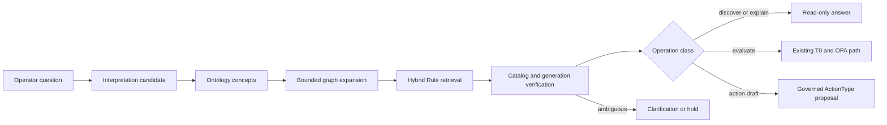

# Rule Semantic Retrieval

This document defines how FDAI turns natural-language policy questions into bounded Rule
candidates without making search, generated metadata, or vectors authoritative. It owns the
active and discovery corpora, semantic-surface lifecycle, index generations, retrieval receipts,
evaluation gates, and failed-query feedback loop.

> **Authority boundary:** Git catalog-as-code remains authoritative for active Rules, Policies,
> and promoted semantic surfaces. PostgreSQL search rows and embeddings are rebuildable read
> projections. A retrieval result never grants policy, approval, or execution authority.
>
> **Safety boundary:** Rule discovery and policy evaluation are separate operations. OPA evaluates
> only an exact active Rule against schema-valid, current evidence through the existing T0 path.
>
> **Implementation status (2026-08-13):** FDAI ships deterministic Rego and expression manifests,
> strict promoted-surface and content-addressed validation-receipt loading, held-out cohort
> evaluation, privacy-safe challenger feedback,
> atomic in-memory generations, the read-only `catalog.search_rules` function,
> concept-first bounded retrieval, lexical degradation, a durable StateStore challenger store,
> and a durable PostgreSQL `CatalogSemanticIndex` with isolated active and discovery generations.
> Direct semantic-runtime composition binds the function only when a caller supplies both a
> provider-neutral semantic index and its exact catalog digest. Without that pair, the principal
> manifest records `catalog.search_rules` as `runtime_binding_unavailable` and does not advertise it
> to the planner. Production bootstrap now composes the durable adapter only when its active
> generation exactly matches the current Rule catalog, semantic schema, ontology release, and
> embedder dimension. Missing, stale, or inaccessible state remains an optional readiness
> degradation and leaves the function unregistered. Reader-gated
> `POST /rules/search` reads an Operator
> Service projection; it does not directly invoke the Core function. Retrieval and function
> receipts retain `execution_authority: false` wherever the Core capability is bound.
> Validated generation-activation commands enter only through Mimir. A durable, lease-fenced
> outbox publisher emits terminal results, and Mimir stores a projection-only receipt that grants
> no index, policy, approval, mutation, or execution authority.
> Reproduced retrieval-owned failures flow through Huginn ingress, Heimdall validation, Saga audit,
> and Muninn context materialization. Norns then persists an inert challenger with shadow audit
> before ordinary consensus and Mimir intake.
> Rego manifests now carry the exact deny decision path and a normalized location-free OPA AST
> digest in addition to the source digest. The T0 evaluator uses the same identities and emits
> input- and result-bound evaluation receipts for allow and deny outcomes. Retrieval still cannot
> claim a verdict without that evaluation receipt.

## Implementation status

### Implementation scope

| Area | State | Evidence | Notes |
|------|-------|----------|-------|
| Exact-generation Rule query | implemented | `core/ontology_platform/catalog_queries.py`; `tests/core/ontology_platform/test_catalog_queries.py` | Returns candidate-only results and content-addressed retrieval and invocation receipts with no execution authority. |
| Optional semantic-runtime binding | implemented | `composition/wire_semantic_query.py`; `tests/composition/test_wire_semantic_query.py` | Requires the semantic index and exact catalog digest together. |
| Planner availability accounting | implemented | `core/ontology_platform/query_manifest.py`; `tests/core/ontology_platform/test_query_manifest.py`; current change focused checks | A readable but unbound function remains in structural coverage as `runtime_binding_unavailable` and is hidden from planning. |
| Bilingual held-out evaluator contract | implemented | `rule_catalog/schema/rule_semantic_evaluation.py`; `tests/rule_catalog/test_rule_semantic_evaluation.py`; current change focused check | English and Korean positive and explicit no-match fixtures produce validation-only cohort evidence. Training-query reuse is rejected in both languages. Retrieval failures produce `HOLD`, count positive cases as misses, and never receive no-match precision credit. Partial retrieval degradation is measured per cohort and remains ineligible for promotion review. Receipt schema `1.1.0` pins the exact evaluated generation and catalog digests. |
| Catalog-backed promotion assurance | implemented | `rule-catalog/surfaces/kubernetes-node-pool.multi-zone.ko.yaml`; `rule-catalog/surface-validation-receipts/`; `tests/rule_catalog/test_discovery_catalog_search.py`; current change focused checks | The real 62-Rule active generation passes all seven governed English, Korean, ambiguity, adversarial no-match, corpus-isolation, and exact-generation cohorts. The promoted Korean surface replays the exact passing validation-only receipt and produces the same generation as its candidate form. Discovery documents do not leak into active results. This is implementation evidence, not governed live runtime evidence. |
| Validation receipt catalog | implemented | `rule_catalog/schema/rule_semantic_validation_receipt_catalog.py`; `rule_semantic_validation_receipt.schema.json`; `tests/rule_catalog/test_rule_semantic_validation_receipt_catalog.py`; current change focused checks | Strictly loads full passing receipt bodies from content-addressed JSON. Promoted surfaces fail closed on missing, malformed, tampered, non-passing, authority-bearing, wrong-subject, or stale-policy evidence. |
| Governed promotion review | implemented | `config/rule-semantic-evaluation.json`; `rule_catalog/schema/rule_semantic_evaluation_policy.py`; `rule_catalog/schema/rule_semantic_promotion_review.py`; current change focused checks | Loads content-addressed thresholds and required cohorts from governed configuration. Review eligibility fails closed on stale policy, generation, or catalog identity; incomplete or renamed metrics; unknown receipt schemas; failed cohorts; authority-bearing evidence; and values below current thresholds. Eligibility grants no promotion or execution authority. |
| In-memory generation and validation | implemented | `delivery/catalog_search/in_memory.py`; `delivery/catalog_search/generation.py`; `tests/delivery/catalog_search/test_ontology_generation.py`; `tests/rule_catalog/test_discovery_catalog_search.py` | Supports deterministic off-path generation, independent active/discovery pointers, corpus-local rollback, and activation compare-and-swap parity with the durable adapter. |
| Corpus-scale generation identity | implemented | `shared/providers/catalog_search.py`; `delivery/catalog_search/generation.py`; `delivery/catalog_search/in_memory.py`; focused generation and Rule-catalog tests | Provider-neutral metadata carries count, hierarchical root, bounded ordered chunks, and small-generation inline digests. Generation construction, validation receipts, staging, activation, active lookup, search, rollback, and rollback receipts reject identity drift. |
| Durable PostgreSQL index | implemented | `delivery/catalog_search/postgres.py`; migrations `0077` and `0080`; `tests/delivery/catalog_search/test_postgres.py`; `test_postgres_integration.py`; `test_postgres_rule_corpora_integration.py` | Persists and revalidates exact generation manifests, atomically stages, activates, searches, and rolls back corpus-local generations, and proves lifecycle isolation for all 62 active and 8,487 discovery documents against PostgreSQL. |
| Production generation build worker | in-progress | `delivery/catalog_search/rule_generation.py`; `rule_catalog/schema/rule_semantic_generation_events.py`; current repository call-site audit | Pure build and event contracts exist, but no production subscriber invokes the Rule generation builder, stages the candidate generation, or publishes its validation result. |
| Governed generation activation | implemented | `core/rule_semantic_generation/activation.py`; `core/rule_semantic_generation/ledger.py`; provider and delivery activation contracts; focused activation and live PostgreSQL checks | Activation binds the exact target digest and validation receipt to the expected prior active identity inside the mutation boundary. Completed-command replay returns the durable terminal result before provider access, and the first result and pending outbox record commit atomically. |
| Durable activation publication and projection | implemented | `core/rule_semantic_generation/publication.py`; `agents/mimir.py`; `agents/_framework/runtime.py`; `runtime/bootstrap.py`; focused publication, Mimir, runtime, and bootstrap checks | A timeout-bounded, lease-fenced publisher drains terminal results independently of semantic-index readiness. Mimir alone consumes activation commands and projects terminal results without gaining index or execution authority. Production composition shares one durable ledger between the binder and publisher. |
| Production bootstrap binding | implemented | `runtime/bootstrap.py`; `runtime/bootstrap_lifecycle.py`; `composition/wire_semantic_query.py`; `tests/runtime/test_catalog_semantic_bootstrap.py`; focused bootstrap and composition checks (`46 passed`) | Startup binds only an exact active generation. Missing, stale, inaccessible, or unavailable state produces a stable optional-readiness reason and leaves Rule search unregistered. Governed live evidence remains open. |
| Operator Rule-search projection | implemented | `packages/service-contracts/src/fdai_service_contracts/semantic_turn.py`; `services/core-control-plane/src/fdai_core_service/semantic_turn_processor.py`; Operator Service workflow adapter and routes; current change focused checks | `POST /rules/search` reads a revisioned materialized projection containing the exact validated function-invocation receipt and its canonical digest. The shared contract rejects content, digest, task, intent, capability, and terminal-status drift. No direct Core call or policy, approval, mutation, or execution authority is introduced. |

### Implementation history

| Date | State | Change | Evidence | Remaining |
|------|-------|--------|----------|-----------|
| 2026-08-13 | in-progress | Adopted the implementation ledger and corrected the unsupported production-binding claim. Added optional exact-digest composition and typed planner unavailability for unbound Rule search. Earlier provenance was not reconstructed. | `current change`; `PYTHONPATH="$PWD/services/core-control-plane/src:$PWD/packages/service-contracts/src" .venv/bin/pytest -q services/core-control-plane/tests/composition/test_wire_semantic_query.py services/core-control-plane/tests/core/ontology_platform/test_query_manifest.py` passes 19 focused tests. | Add a durable production index, production bootstrap binding, Core-to-Operator projection publication, and live receipts. |
| 2026-08-13 | in-progress | Added bounded hierarchical document identity for corpus-scale generations while retaining inline ordered digests for generations of at most 256 rows. | `current change`; the focused `test_rule_semantic_retrieval.py` suite passed 17 tests, including an 8,549-row, 34-chunk manifest, the 256/257-row boundary, and fail-closed tamper cases. | Integrate the manifest with delivery metadata and prove independent active and discovery activation and rollback. |
| 2026-08-13 | implemented | Added focused evidence that in-memory active and discovery generations stage, activate, search, and roll back through independent pointers. Staged discovery data remains invisible, and discovery rollback does not alter active results. | `current change`; the focused `test_active_and_discovery_generation_pointers_are_independent` test passed. | Repeat the lifecycle proof for complete corpora through the durable production adapter. |
| 2026-08-13 | in-progress | Materialized the actual 8,487-record discovery corpus as inert candidate-only search documents and exercised complete 62-active/8,487-discovery lifecycle isolation in one in-memory index. Discovery replacement and rollback leave active metadata and results unchanged. | Commits `fea694a32` and `c136a7231`; `test_discovery_catalog_search.py` passed 4 tests, including empty, malformed, and duplicate fail-closed cases plus full-corpus staging, activation, search, replacement, and rollback. Ruff and strict mypy passed. | Bind count, root, and chunks into delivery metadata, then repeat the lifecycle proof through the durable PostgreSQL adapter. |
| 2026-08-13 | implemented | Bound the canonical document manifest to provider-neutral generation metadata and revalidated exact ordered rows at every in-memory lifecycle boundary. Generation digests now self-verify all metadata and manifest fields, validation and rollback receipts pin chunk identities, and the Rule search document projection formula advanced to v3. Adversarial round 14 closed the accepted noncanonical generation-digest finding; the remaining durable-adapter gap is separate. | `current change`; focused generation, exact-query, retrieval, full-corpus, and composition checks passed 41 tests. Strict mypy passed 5 source files, Ruff passed 9 source and test files, and editor diagnostics were clean. | Persist and revalidate the same manifest in the durable PostgreSQL adapter and record live-database lifecycle evidence. |
| 2026-08-13 | implemented | Added the durable PostgreSQL generation adapter and exact expected-prior activation compare-and-swap. Activation now checks the target digest, prior active id and digest, lifecycle state, replay identity, and chronology under the same corpus lock before changing either pointer. Complete active and discovery corpora remain isolated through replacement and rollback. | `current change`; focused PostgreSQL unit and live-database lifecycle checks, including the complete 62-active/8,487-discovery corpus test, passed. Focused activation parity checks passed 42 tests; Ruff and strict mypy passed the touched lifecycle files. | Compose the adapter in production bootstrap, publish lifecycle and retrieval projections, and record governed runtime evidence. |
| 2026-08-13 | implemented | Added readable Korean positive and explicit no-match fixtures to the held-out evaluator contract, proved Korean training/evaluation disjointness, and asserted that surfaces and receipts retain zero execution authority and validation-only authority. | `current change`; `PYTHONPATH="$PWD/services/core-control-plane/src:$PWD/packages/service-contracts/src" .venv/bin/python -m pytest -q --no-cov services/core-control-plane/tests/rule_catalog/test_rule_semantic_evaluation.py` passed 5 tests. | Run the required cohorts against the shipped catalog and a real semantic index, then connect measured configuration thresholds to governed promotion. |
| 2026-08-13 | implemented | Composed the durable semantic index in production startup behind exact active-generation identity checks and optional readiness degradation. Composition receives an index and catalog digest only after the Rule catalog, semantic schema, ontology release, and embedder dimension match. | `current change`; focused runtime bootstrap and semantic composition checks passed 46 tests. Ruff and strict mypy passed the three touched production files. | Publish receipt-backed Operator projections and record governed live binding evidence before claiming validation. |
| 2026-08-13 | implemented | Ran a bilingual promotion probe against the shipped 62-Rule active generation through the real in-memory semantic index. Exact English recall was 1.0, Korean positive recall was 0.0, Korean no-match precision was 1.0, and the evaluator returned `HOLD` with Korean cohort failure codes. | Commit `d1787f4d8`; `PYTHONPATH="$PWD/services/core-control-plane/src:$PWD/packages/service-contracts/src" .venv/bin/python -m pytest -q --no-cov services/core-control-plane/tests/rule_catalog/test_discovery_catalog_search.py` passed 9 tests. | Add governed Korean surfaces and complete the remaining real-index cohorts before promotion. |
| 2026-08-13 | implemented | Made held-out evaluation fail closed when retrieval is stale or unavailable. Provider failures now produce validation-only `HOLD` evidence, penalize positive recall and rank, and cannot turn a failed negative query into successful no-match evidence. | `current change`; the focused evaluator and real-catalog modules passed 15 tests. Ruff, strict mypy, and editor diagnostics passed for the changed evaluator slice. | Exercise stale state through the real semantic index and connect complete cohort receipts to configuration-backed governed promotion. |
| 2026-08-13 | implemented | Expanded the shipped-catalog promotion probe with English ambiguity, adversarial-input, corpus-isolation, and real-index stale-generation cohorts. English ambiguity recall and rank were 1.0. Adversarial and discovery-only no-match precision were 0.0 because unrelated active Rules remained lexical false positives; no discovery document crossed into active results. A stale catalog digest produced retrieval errors, zero positive recall and rank, no negative no-match credit, and a validation-only `HOLD`. | `current change`; `tests/rule_catalog/test_discovery_catalog_search.py`; the focused module passed 10 tests, Ruff and format checks passed, and editor diagnostics were clean. | Add governed Korean surfaces, remove the measured active-corpus false positives, and connect configuration-backed thresholds to governed promotion before claiming readiness. |
| 2026-08-13 | implemented | Added the exact activation binder for validated Rule generations. It verifies the target validation receipt and expected prior identity inside the provider mutation boundary, suppresses completed-command provider replay, reconciles an observed effect after provider errors, and durably closes one stable terminal result plus outbox record. | `current change`; focused activation, ledger, generation, and live PostgreSQL checks passed; Ruff and strict mypy passed the touched lifecycle files. | Publish the durable outbox through the EventBus, compose accountable agent ownership, and record governed runtime evidence. |
| 2026-08-13 | implemented | Added lease-fenced durable activation-result publication, Mimir-owned command ingress and result projection, shared production ledger composition, and readiness-independent backlog draining. Released broker failures remain retryable without hiding receipt-contract or ledger failures. The integrated runtime proof covers command delivery through activation, outbox publication, and projection-only result persistence. | `current change`; focused bootstrap, runtime, Mimir, activation, and publication selection passed 32 tests, including restart, duplicate, lease-expiry, cancellation, broker-failure retry, fatal receipt-topic mismatch, acknowledged delivery, and integrated command-to-projection cases. | Record governed live runtime evidence before changing this area to `validated`; the separate retrieval and function-invocation projection remains open. |
| 2026-08-13 | implemented | Added content-addressed evaluation policy loading and a deterministic review-only promotion assessment. The assessment revalidates receipt and policy identity, exact current metrics and thresholds, required cohorts, validation-only authority, and the no-execution-authority boundary before returning review eligibility. | `current change`; the focused evaluation policy, receipt, promotion review, retrieval, and shipped-catalog suites passed 42 tests. Ruff and strict mypy passed the touched production modules. | Add governed Korean surfaces and remove measured lexical false positives before a passing receipt can become review-eligible. Record governed live evidence separately before claiming validation. |
| 2026-08-13 | implemented | Preserved the exact validated function-invocation receipt across the Core-to-Operator projection boundary. The strict shared contract binds the canonical receipt digest, query task, function intent, capability, and completed status; Operator persistence remains atomic and scope-isolated. | `current change`; the shared contract, Core projection processor, Operator bridge, and workflow-family suites passed 94 tests. Ruff and strict mypy passed the touched production modules. | Record Reader-scoped live projection evidence before changing this area to `validated`. |
| 2026-08-13 | implemented | Added an explicit partial-degradation regression for held-out retrieval. One failed request in a two-request positive cohort produces a `0.5` retrieval success rate, a validation-only `HOLD`, and a review-only promotion `HOLD` with no promotion or execution authority. | `current change`; `PYTHONPATH="$PWD/services/core-control-plane/src:$PWD/packages/service-contracts/src" .venv/bin/python -m pytest -q --no-cov services/core-control-plane/tests/rule_catalog/test_rule_semantic_evaluation.py` passed 11 tests. Ruff, formatting, and editor diagnostics passed for the task-owned test file. | Add governed Korean surfaces and remove measured active-corpus lexical false positives. Record governed live evidence separately before claiming validation. |
| 2026-08-13 | implemented | Removed active-corpus false positives caused only by non-discriminating English function words, catalog-generic `rule`, and numeric fragments. Exact-id matching, domain terms, semantic scores, and configured thresholds remain unchanged. The adversarial and discovery-only no-match cohorts now each measure `1.0`; the shipped-catalog receipt remains `HOLD` only for Korean positive recall and rank. | `current change`; the complete shipped active/discovery catalog module passed 11 tests, catalog-query and composition consumers passed 21 tests, strict mypy passed the changed production adapter, and editor diagnostics were clean. | Add governed Korean surfaces and record governed live evidence separately before claiming validation. |
| 2026-08-13 | implemented | Removed the semantic-surface receipt identity cycle. Validation receipts now bind the immutable candidate-form semantic subject, while the promoted Git artifact retains a distinct digest that includes its lifecycle state and receipt reference. Existing candidate receipt identities remain unchanged. | `current change`; the focused semantic retrieval and evaluation contract suites passed 30 tests. Ruff, formatting, and strict mypy passed the task-owned production and test files. | Add and replay a governed Korean surface and its real passing held-out receipt before promotion review. Record governed live evidence separately before claiming validation. |
| 2026-08-13 | implemented | Bound each surface validation receipt to the exact search generation and catalog evaluated. Promotion review now holds independently on a stale generation or stale catalog identity, and receipt schema `1.1.0` includes both identities in validation and content-addressed digest projection. | `current change`; the complete semantic receipt, retrieval, and shipped-catalog slice passed 42 tests. Ruff and formatting passed six task-owned files, strict mypy passed three production contracts, and editor diagnostics were clean. | Add and replay a governed Korean surface and its real passing held-out receipt before promotion review. Record governed live evidence separately before claiming validation. |
| 2026-08-13 | implemented | Added a genuine governed Korean surface and persisted its full passing receipt at its recomputed content address. Promoted-surface loading now resolves and revalidates exact candidate subject, current policy, passing decision, empty failures, and validation-only authority. Search projection v5 uses immutable subject identities, so candidate and promoted forms replay the exact same 62-Rule generation. | `current change`; the semantic retrieval, evaluation, policy, promoted-surface, receipt-catalog, and shipped-catalog focused suite passed 61 tests. Ruff and strict mypy passed the task-owned Python slice. | Record governed live runtime evidence separately before changing this capability to `validated`. |
| 2026-08-13 | implemented | Corrected the preceding evidence count. Final receipt-catalog hardening added regular-file checks that reject symlink and FIFO artifacts; the capability state is unchanged. | Commit `8571ea53a`; the focused six-module semantic retrieval suite passed 63 tests, including the two special-file cases. | Governed live runtime evidence remains required before changing this capability to `validated`. |
| 2026-08-13 | in-progress | Re-audited the production live-evidence prerequisites and corrected the ledger to expose the missing generation build worker. Build and event contracts exist, but no production subscriber invokes `build_rule_semantic_generation`. | `current change`; the repository call-site audit found the builder only at its definition and in tests; the focused six-module semantic retrieval suite still passes 63 tests. | Implement the Mimir-owned mechanical build and validation subscriber before collecting governed live runtime evidence. |

### Remaining work

- [x] Provider-neutral delivery metadata now binds exact document count, hierarchical root, and
  ordered chunk identities; focused stage, activation, lookup, search, rollback, and receipt tests
  reject identity drift.
- [x] The durable PostgreSQL `CatalogSemanticIndex` persists and revalidates exact manifests.
  Focused live-database generation, activation, rollback, exact-generation search, and complete
  corpus-isolation checks pass as specified by
  [Build and enrichment lifecycle](#build-and-enrichment-lifecycle).
- [x] Production bootstrap composes the durable adapter and registers optional generation
  readiness. Startup binds only the exact current Rule catalog, semantic schema, ontology release,
  and embedder dimension; stable degradation reasons cover missing, stale, inaccessible, and
  unavailable state. Focused bootstrap and composition checks pass 46 tests.
- [x] A timeout-bounded EventBus worker publishes durable activation results, and Mimir is the only
  accountable command and result subscriber. Focused restart, duplicate delivery, lease expiry,
  cancellation, broker failure, acknowledged delivery, and integrated runtime checks pass without
  granting index or execution authority.
- [x] Core publishes the exact validated function-invocation receipt and canonical digest into the
  Operator projection. `POST /rules/search` reads the strict receipt-backed projection without a
  direct Core call and preserves the [query lifecycle](#query-lifecycle).
- [ ] Bind a Mimir-owned mechanical subscriber to `RuleGenerationBuildRequestEvent`. It must build
  and stage one exact inactive generation, publish independent validation evidence through the
  event bus, and prove duplicate delivery, restart, provider-failure, and stale-identity handling
  without granting promotion or execution authority.
- [ ] Record governed live evidence for the production binding and Reader-scoped projection before
  changing this capability from `implemented` to `validated`; retain the identities defined by
  [CatalogRetrievalReceipt](#catalogretrievalreceipt).
- [x] The shipped-catalog probe covers English and Korean positive, ambiguity, adversarial-input,
  corpus-isolation, and real-index stale-generation cohorts. Adversarial and discovery-only
  no-match precision are `1.0`; discovery documents remain isolated from active results.
- [x] A governed Korean surface and its full content-addressed validation receipt replay against
  the real 62-Rule generation. All seven required cohorts pass without weakening exact-generation,
  no-match, or corpus-isolation checks, and candidate/promotion projection equality is explicit.
- [x] Evaluation thresholds and required cohorts load from content-addressed governed configuration.
  The deterministic review-only gate rejects stale policy identity, failed or incomplete evidence,
  unknown receipt schemas, authority-bearing receipts, and values below current thresholds without
  granting promotion or execution authority.

## Design at a glance

FDAI resolves meaning before it ranks Rules. Exact catalog identity and reviewed ontology links
constrain the candidate set, while lexical and vector retrieval absorb natural-language variation.



The flow preserves three distinctions:

- **Meaning vs. ranking:** ontology identities and links define valid concepts; retrieval ranks
  candidates inside that bounded meaning.
- **Search vs. evaluation:** finding a Rule does not evaluate it. Policy evaluation needs exact
  active Rule identity and authoritative resource evidence.
- **Candidate vs. authority:** lexical, embedding, and model outputs remain candidates. Review and
  exact catalog evidence determine whether a semantic surface can become active.

## Corpus boundaries

The index keeps operational Rules separate from collected discovery material.

| Corpus | Contents | Allowed use | Prohibited use |
|--------|----------|-------------|----------------|
| `active` | Reviewed Rules and promoted semantic surfaces from Git | Operator search, explanation, exact T0 evaluation routing | Treating retrieval score as a policy verdict |
| `discovery` | Collected, normalized, or generated candidates not yet promoted | Catalog curation, gap analysis, shadow retrieval evaluation | OPA evaluation, findings, action proposals, or execution |

Queries default to `active`. An operator must explicitly select discovery scope to inspect
candidate material. A result always carries its corpus so presentation cannot hide the boundary.

## Semantic artifacts

Five immutable contracts carry the lifecycle.

### RuleSemanticManifest

The deterministic manifest records what the source artifacts prove:

- exact Rule id and version;
- policy and content digests;
- parser and parser version;
- source kind and redistribution class;
- resource, signal, property, policy, and ActionType references;
- ontology release digest;
- normalized predicates when the source parser can prove them.

Missing semantics remain unknown. A parser never invents a predicate, concept, or relationship.

### RuleSemanticSurface

A semantic surface is a proposal for how operators may express one manifest's meaning. It may
contain reviewed intent ids, ontology concept refs, localized aliases, training paraphrases, and
hard negatives. It cannot set severity, risk, applicability, enforcement, or action authority.

Every surface records its manifest digest, locale, generator and prompt receipts, evidence refs,
state, validation receipt, and content digest. The states are `candidate`, `validated`,
`promoted`, `retired`, and `rejected`. New surfaces start as `candidate`.

A validation receipt binds the surface's candidate-form semantic subject: lifecycle state and the
receipt reference are normalized to `candidate` and absent. Promotion therefore cannot change the
content that was evaluated or create a digest cycle. The promoted Git artifact has its own digest,
including `state: promoted` and the exact validation receipt reference.

The Git catalog stores the full validation receipt at a path derived from its content digest. The
strict loader recomputes that digest, resolves every promoted surface reference, and verifies a
passing validation-only decision for the same candidate-form subject and current evaluation
policy. Missing, malformed, tampered, held, authority-bearing, subject-mismatched, or stale-policy
receipts block the surface from loading. Current generation and catalog identity remain an exact
promotion-review and generation-publication check so loading historical evidence does not create a
surface-to-generation cycle.

Search document identity uses the ordered set of candidate-form semantic subject digests, not the
surface lifecycle artifact digests. A candidate and its receipt-linked promoted form therefore
produce the same exact search documents and generation. Promotion changes review metadata without
invalidating the generation that the receipt evaluated.

### CatalogSearchGeneration

A generation pins one complete searchable corpus:

- corpus and catalog revision;
- semantic schema and ontology release digests;
- embedding space identity, model version, and dimension;
- exact row count, a hierarchical canonical digest root, and ordered chunks of at most 256 rows;
- inline ordered document digests only for compatibility generations of at most 256 rows;
- build and validation receipts;
- lifecycle state and activation time.

Only one generation per corpus is active. A worker builds and validates an inactive generation,
then atomically changes the active pointer. A failed build leaves the prior generation unchanged.
PostgreSQL activation also holds one transaction-scoped lock per corpus. Each publisher captures
the expected prior active generation id and digest before staging. Activation checks that identity,
the target digest and lifecycle state, replay identity, and timestamp chronology under the same
transaction before retiring or activating a pointer. A stale or partial expected identity leaves
the active generation unchanged.

Rollback reactivates only a retained prior generation. The caller pins the expected active and
target generation revisions and digests plus the target validation receipt. Both generations must
belong to the same corpus. An ontology compatibility receipt binds the target as the previous
release and the current active generation as the candidate release, allowing exact identity or an
additive N/N-1 transition that passed the canonical compatibility gate. The store checks those
values under the same corpus lock, retires the current generation, and reactivates the target in
one atomic transition. An exact retry with the same rollback time returns the same content-addressed
receipt without another state change. A stale revision or compatibility mismatch leaves the active
generation unchanged.

### CatalogRetrievalReceipt

Each search records the query digest, operation class, corpus, catalog and generation digests,
bounded filters, result Rule refs, ranking components, truncation, and degraded state. Ranking
scores are evidence components, not probabilities or confidence values.

### SurfaceValidationReceipt

A validation receipt pins the candidate-form surface subject, exact search generation and catalog,
frozen dataset, evaluator, metric configuration, cohort results, failures, and decision. Review
replay holds when either evaluated search identity differs from the expected generation. Validation
can approve a candidate for review or hold it. It cannot promote the surface by itself.

Passing receipts are persisted as content-addressed JSON artifacts. Their filenames, schema-valid
bodies, canonical content digests, subject identities, policy identities, decisions, failures, and
validation-only authority are independently replayed before a promoted surface enters a search
projection.

## Build and enrichment lifecycle

The build pipeline processes each source through its registered parser. Authored Rego uses OPA AST
parsing. Azure Policy, kube-bench, and other collected formats use source-specific parsers before
they enter one common manifest contract.

```text
source revision
  -> verify provenance and redistribution
  -> parse deterministic semantics
  -> build RuleSemanticManifest
  -> propose RuleSemanticSurface
  -> validate held-out retrieval cohorts
  -> reviewed Git promotion
  -> build inactive index generation
  -> independent generation validation
  -> atomic activation
```

Model enrichment runs off the request and API startup paths. Source text is untrusted data and is
never treated as model instructions. Unknown concept ids produce an inert ontology proposal rather
than extending the ontology automatically.

### Licensing boundary

`reference-only` source text, derived excerpts, generated paraphrases, and embeddings are not
eligible for redistribution. Such a source may contribute only independently authored normalized
logic and bounded provenance references. The enrichment gate rejects a surface when its permitted
input lineage cannot be proved.

## Query lifecycle

Rule search has two read surfaces with different contracts.

### Catalog reference search

The `/rules` reference route accepts text and deterministic filters. It can return exact, lexical,
neighbor, and semantic ranking evidence, but every result remains a read-only candidate. When the
semantic generation is missing, stale, or unavailable, the route uses current-catalog lexical
search and reports the degraded semantic state.

### Conversational concept search

Natural-language operation planning targets a read-only ontology function such as
`catalog.search_rules`, not a Rule declaration directly. The function accepts typed intent,
concept, resource, property, category, and corpus filters. A verified semantic plan still carries
`execution_authority: false`.

The query path uses this order:

1. Resolve exact Rule ids and reviewed lexical terms.
2. Propose intent and ontology concept candidates.
3. Expand only allowlisted typed links under a node and depth bound.
4. Run hybrid ranking inside the resulting candidate set.
5. Verify active catalog, generation, and current ontology release identity.
6. Return candidates, ask for clarification, or hold when evidence is insufficient.

An evaluation request re-enters the existing T0 path with an exact active Rule and current
resource evidence. An action request becomes an ActionType-bound proposal and follows the normal
judgment, approval, execution, recovery, and audit pipeline.

## Retrieval evaluation

The evaluation dataset separates material used to build a surface from held-out questions used to
measure it. Copying an indexed training phrase into the evaluation set tests storage, not semantic
generalization.

Required cohorts include:

- exact Rule ids and canonical terms;
- independently authored English and Korean paraphrases;
- nearby sibling Rules and contradictory hard negatives;
- explicit no-match and ambiguous questions;
- stale catalog and stale generation cases;
- prompt-injection, control-character, confusable, and oversized inputs;
- active and discovery corpus isolation.

Metrics include recall at bounded ranks, mean reciprocal rank, normalized discounted cumulative
gain, no-match precision, clarification utility, cohort coverage, and latency. Promotion thresholds
are configuration selected after a measured baseline. Aggregate success cannot hide a failed
resource, language, severity, or source cohort.

Policy behavior uses separate OPA fixtures. A retrieval benchmark never claims that a Rule's
predicate is correct, and an OPA fixture never claims that natural-language retrieval generalizes.

## Failed-query feedback

Operational failures first receive deterministic attribution. Supported layers include stale
generation, missing concept, mapping gap, ranking error, ambiguity, inactive Rule, provider
evidence, and presentation. Only reproduced retrieval-owned failures can create a semantic-surface
candidate.

Feedback obeys these controls:

- raw operator text remains deployment-local, redacted, access-scoped, and retention-bounded;
- generated and user-originated questions retain distinct origin metadata;
- duplicate, rate, principal, and poisoning controls run before candidate creation;
- a user correction is evidence, not an oracle;
- an exact target Rule and independent validation are required before promotion review;
- candidates run as a challenger and cannot change visible ranking;
- regression automatically withdraws the challenger without changing the active generation.

No online request mutates an active surface or vector row.

## Agent ownership

The fixed pantheon owns the capability without adding an indexer agent.

| Stage | Accountable agent | Contract |
|-------|-------------------|----------|
| External catalog-revision ingress | Huginn | Normalize and publish the source event; no catalog write |
| Failed-query candidate discovery | Norns | Produce inert, deduplicated candidates only |
| Rule, Policy, and promoted surface lifecycle | Mimir | Validate catalog identity and publish governed outcomes |
| Retrieval and generation observation | Heimdall | Produce independent evaluation evidence without promotion authority |
| Correlated audit | Saga | Append candidate, validation, activation, degradation, and retirement evidence |
| Natural-language presentation | Bragi | Translate, show candidates, and ask for clarification; never judge or execute |

The build worker is a mechanical Mimir-owned capability. Authority-bearing transitions travel
through typed events. The Operator API reads the active projection and never promotes a surface or
activates a generation.

## Failure and degradation

| Failure | Safe behavior |
|---------|---------------|
| Semantic index or embedder unavailable | Search the current Git-backed catalog lexically and report semantic unavailability |
| Active generation digest differs from the catalog | Exclude semantic results and report a stale generation |
| Inactive generation build or validation fails | Keep the prior active generation and audit the failure |
| No active generation exists | Keep exact and lexical search available |
| Candidate ambiguity remains | Ask for clarification or return a bounded candidate list without evaluation |
| Evaluation evidence is missing or stale | Hold without running OPA or producing a Finding |
| Feedback attribution is unresolved | Retain evidence only; create no semantic candidate |

Operator-facing degradation uses stable machine reasons such as `generation-unavailable`,
`generation-stale`, and `provider-unavailable`. Provider messages and Python exception names never
cross the API boundary. When an active generation was observed before failure, the degraded
response retains its generation, catalog, semantic schema, ontology release, and corpus identity.
Catalog-reference `GET /rules` degrades to lexical results. Typed `POST /rules/search` reads the
revisioned Operator projection and returns an unavailable response when that projection is absent;
the route does not call the Core function registry or semantic provider directly.

## Delivery sequence

| Batch | Deliverable | Exit criteria |
|-------|-------------|---------------|
| S0 | Design and competency questions | Corpus, authority, storage, agent, and failure contracts are reviewable in English and Korean |
| S1 | Immutable contracts and corpus isolation | Invalid refs, digests, states, origins, and cross-corpus operations fail closed |
| S2 | Deterministic manifests and licensing gate | Rego and expression fixtures produce replay-stable manifests; reference-only violations are rejected |
| S3 | Surface candidates and held-out evaluator | Training and evaluation data cannot overlap; all required cohorts produce receipts |
| S4 | Atomic persistent generations | Searches observe either the prior or new complete generation, rollback returns a replay-stable receipt, and no transition exposes a mixed corpus |
| S5 | Concept-first typed query | Exact, lexical, graph, and semantic stages preserve candidate-only authority and clarification |
| S6 | Challenger feedback | Reproduced retrieval failures create only durable inert candidates; no online active-index mutation exists |
| S7 | Production projection and observability | Operator API startup does not build embeddings; health exposes catalog and generation identity |

## Related docs

| To learn about | Read |
|----------------|------|
| Rule sources, parsing, and licensing | [Rule Catalog Collection](rule-catalog-collection.md) |
| Rule lifecycle and human control | [Rule Governance](rule-governance.md) |
| Typed ontology and time-consistent context | [FDAI Operating Ontology](../architecture/operating-ontology.md) |
| Proof-carrying semantic plans | [FDAI Ontology Safety Infrastructure](../architecture/operating-ontology-platform.md) |
| Full-ontology operator question coverage | [Hierarchical Conversation Planning](../interfaces/hierarchical-conversation-planning.md) |
| Deterministic and model tiering | [LLM Strategy](../architecture/llm-strategy.md) |
| Console authority boundary | [FDAI Console Conversations](../interfaces/operator-console.md) |
