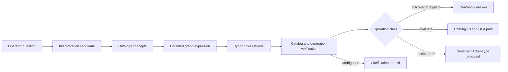

# Rule Semantic Retrieval

This document defines how FDAI turns natural-language policy questions into bounded Rule
candidates without making search, generated metadata, or vectors authoritative. It owns the
active and discovery corpora, semantic-surface lifecycle, index generations, retrieval receipts,
evaluation gates, and failed-query feedback loop.

> **Authority boundary:** Git catalog-as-code remains authoritative for active Rules, Policies,
> and promoted semantic surfaces. PostgreSQL search rows and embeddings are rebuildable read
> projections. A retrieval result never grants policy, approval, or execution authority.
>
> **Safety boundary:** Rule discovery and policy evaluation are separate operations. OPA evaluates
> only an exact active Rule against schema-valid, current evidence through the existing T0 path.
>
> **Implementation status (2026-08-06):** FDAI ships deterministic Rego and expression manifests,
> strict promoted-surface loading, held-out cohort evaluation, privacy-safe challenger feedback,
> atomic in-memory and PostgreSQL generations, the read-only `catalog.search_rules` function,
> concept-first bounded retrieval, lexical degradation, and a durable StateStore challenger store.
> Generation publishing runs off the Operator API startup path. The PostgreSQL generation adapter
> has focused contract coverage; its live-database test requires `FDAI_DATABASE_URL`.
> The one-shot `fdai-catalog-generation` process publishes a validated generation from a scheduled
> job or deployment step and fails closed when its PostgreSQL or embedding binding is unavailable.
> Production binds `catalog.search_rules` to the complete ontology release and exposes it through
> Reader-gated `POST /rules/search`. The response carries both retrieval and function-invocation
> receipts and always retains `execution_authority: false`.
> Reproduced retrieval-owned failures flow through Huginn ingress, Heimdall validation, Saga audit,
> and Muninn context materialization. Norns then persists an inert challenger with shadow audit
> before ordinary consensus and Mimir intake.

## Design at a glance

FDAI resolves meaning before it ranks Rules. Exact catalog identity and reviewed ontology links
constrain the candidate set, while lexical and vector retrieval absorb natural-language variation.



The flow preserves three distinctions:

- **Meaning vs. ranking:** ontology identities and links define valid concepts; retrieval ranks
  candidates inside that bounded meaning.
- **Search vs. evaluation:** finding a Rule does not evaluate it. Policy evaluation needs exact
  active Rule identity and authoritative resource evidence.
- **Candidate vs. authority:** lexical, embedding, and model outputs remain candidates. Review and
  exact catalog evidence determine whether a semantic surface can become active.

## Corpus boundaries

The index keeps operational Rules separate from collected discovery material.

| Corpus | Contents | Allowed use | Prohibited use |
|--------|----------|-------------|----------------|
| `active` | Reviewed Rules and promoted semantic surfaces from Git | Operator search, explanation, exact T0 evaluation routing | Treating retrieval score as a policy verdict |
| `discovery` | Collected, normalized, or generated candidates not yet promoted | Catalog curation, gap analysis, shadow retrieval evaluation | OPA evaluation, findings, action proposals, or execution |

Queries default to `active`. An operator must explicitly select discovery scope to inspect
candidate material. A result always carries its corpus so presentation cannot hide the boundary.

## Semantic artifacts

Five immutable contracts carry the lifecycle.

### RuleSemanticManifest

The deterministic manifest records what the source artifacts prove:

- exact Rule id and version;
- policy and content digests;
- parser and parser version;
- source kind and redistribution class;
- resource, signal, property, policy, and ActionType references;
- ontology release digest;
- normalized predicates when the source parser can prove them.

Missing semantics remain unknown. A parser never invents a predicate, concept, or relationship.

### RuleSemanticSurface

A semantic surface is a proposal for how operators may express one manifest's meaning. It may
contain reviewed intent ids, ontology concept refs, localized aliases, training paraphrases, and
hard negatives. It cannot set severity, risk, applicability, enforcement, or action authority.

Every surface records its manifest digest, locale, generator and prompt receipts, evidence refs,
state, validation receipt, and content digest. The states are `candidate`, `validated`,
`promoted`, `retired`, and `rejected`. New surfaces start as `candidate`.

### CatalogSearchGeneration

A generation pins one complete searchable corpus:

- corpus and catalog revision;
- semantic schema and ontology release digests;
- embedding space identity, model version, and dimension;
- ordered document digests and row count;
- build and validation receipts;
- lifecycle state and activation time.

Only one generation per corpus is active. A worker builds and validates an inactive generation,
then atomically changes the active pointer. A failed build leaves the prior generation unchanged.

### CatalogRetrievalReceipt

Each search records the query digest, operation class, corpus, catalog and generation digests,
bounded filters, result Rule refs, ranking components, truncation, and degraded state. Ranking
scores are evidence components, not probabilities or confidence values.

### SurfaceValidationReceipt

A validation receipt pins the surface, frozen dataset, evaluator, metric configuration, cohort
results, failures, and decision. Validation can approve a candidate for review or hold it. It
cannot promote the surface by itself.

## Build and enrichment lifecycle

The build pipeline processes each source through its registered parser. Authored Rego uses OPA AST
parsing. Azure Policy, kube-bench, and other collected formats use source-specific parsers before
they enter one common manifest contract.

```text
source revision
  -> verify provenance and redistribution
  -> parse deterministic semantics
  -> build RuleSemanticManifest
  -> propose RuleSemanticSurface
  -> validate held-out retrieval cohorts
  -> reviewed Git promotion
  -> build inactive index generation
  -> independent generation validation
  -> atomic activation
```

Model enrichment runs off the request and API startup paths. Source text is untrusted data and is
never treated as model instructions. Unknown concept ids produce an inert ontology proposal rather
than extending the ontology automatically.

### Licensing boundary

`reference-only` source text, derived excerpts, generated paraphrases, and embeddings are not
eligible for redistribution. Such a source may contribute only independently authored normalized
logic and bounded provenance references. The enrichment gate rejects a surface when its permitted
input lineage cannot be proved.

## Query lifecycle

Rule search has two read surfaces with different contracts.

### Catalog reference search

The `/rules` reference route accepts text and deterministic filters. It can return exact, lexical,
neighbor, and semantic ranking evidence, but every result remains a read-only candidate. When the
semantic generation is missing, stale, or unavailable, the route uses current-catalog lexical
search and reports the degraded semantic state.

### Conversational concept search

Natural-language operation planning targets a read-only ontology function such as
`catalog.search_rules`, not a Rule declaration directly. The function accepts typed intent,
concept, resource, property, category, and corpus filters. A verified semantic plan still carries
`execution_authority: false`.

The query path uses this order:

1. Resolve exact Rule ids and reviewed lexical terms.
2. Propose intent and ontology concept candidates.
3. Expand only allowlisted typed links under a node and depth bound.
4. Run hybrid ranking inside the resulting candidate set.
5. Verify active catalog, generation, and current ontology release identity.
6. Return candidates, ask for clarification, or hold when evidence is insufficient.

An evaluation request re-enters the existing T0 path with an exact active Rule and current
resource evidence. An action request becomes an ActionType-bound proposal and follows the normal
judgment, approval, execution, recovery, and audit pipeline.

## Retrieval evaluation

The evaluation dataset separates material used to build a surface from held-out questions used to
measure it. Copying an indexed training phrase into the evaluation set tests storage, not semantic
generalization.

Required cohorts include:

- exact Rule ids and canonical terms;
- independently authored English and Korean paraphrases;
- nearby sibling Rules and contradictory hard negatives;
- explicit no-match and ambiguous questions;
- stale catalog and stale generation cases;
- prompt-injection, control-character, confusable, and oversized inputs;
- active and discovery corpus isolation.

Metrics include recall at bounded ranks, mean reciprocal rank, normalized discounted cumulative
gain, no-match precision, clarification utility, cohort coverage, and latency. Promotion thresholds
are configuration selected after a measured baseline. Aggregate success cannot hide a failed
resource, language, severity, or source cohort.

Policy behavior uses separate OPA fixtures. A retrieval benchmark never claims that a Rule's
predicate is correct, and an OPA fixture never claims that natural-language retrieval generalizes.

## Failed-query feedback

Operational failures first receive deterministic attribution. Supported layers include stale
generation, missing concept, mapping gap, ranking error, ambiguity, inactive Rule, provider
evidence, and presentation. Only reproduced retrieval-owned failures can create a semantic-surface
candidate.

Feedback obeys these controls:

- raw operator text remains deployment-local, redacted, access-scoped, and retention-bounded;
- generated and user-originated questions retain distinct origin metadata;
- duplicate, rate, principal, and poisoning controls run before candidate creation;
- a user correction is evidence, not an oracle;
- an exact target Rule and independent validation are required before promotion review;
- candidates run as a challenger and cannot change visible ranking;
- regression automatically withdraws the challenger without changing the active generation.

No online request mutates an active surface or vector row.

## Agent ownership

The fixed pantheon owns the capability without adding an indexer agent.

| Stage | Accountable agent | Contract |
|-------|-------------------|----------|
| External catalog-revision ingress | Huginn | Normalize and publish the source event; no catalog write |
| Failed-query candidate discovery | Norns | Produce inert, deduplicated candidates only |
| Rule, Policy, and promoted surface lifecycle | Mimir | Validate catalog identity and publish governed outcomes |
| Retrieval and generation observation | Heimdall | Produce independent evaluation evidence without promotion authority |
| Correlated audit | Saga | Append candidate, validation, activation, degradation, and retirement evidence |
| Natural-language presentation | Bragi | Translate, show candidates, and ask for clarification; never judge or execute |

The build worker is a mechanical Mimir-owned capability. Authority-bearing transitions travel
through typed events. The Operator API reads the active projection and never promotes a surface or
activates a generation.

## Failure and degradation

| Failure | Safe behavior |
|---------|---------------|
| Semantic index or embedder unavailable | Search the current Git-backed catalog lexically and report semantic unavailability |
| Active generation digest differs from the catalog | Exclude semantic results and report a stale generation |
| Inactive generation build or validation fails | Keep the prior active generation and audit the failure |
| No active generation exists | Keep exact and lexical search available |
| Candidate ambiguity remains | Ask for clarification or return a bounded candidate list without evaluation |
| Evaluation evidence is missing or stale | Hold without running OPA or producing a Finding |
| Feedback attribution is unresolved | Retain evidence only; create no semantic candidate |

Operator-facing degradation uses stable machine reasons such as `generation-unavailable`,
`generation-stale`, and `provider-unavailable`. Provider messages and Python exception names never
cross the API boundary.

## Delivery sequence

| Batch | Deliverable | Exit criteria |
|-------|-------------|---------------|
| S0 | Design and competency questions | Corpus, authority, storage, agent, and failure contracts are reviewable in English and Korean |
| S1 | Immutable contracts and corpus isolation | Invalid refs, digests, states, origins, and cross-corpus operations fail closed |
| S2 | Deterministic manifests and licensing gate | Rego and expression fixtures produce replay-stable manifests; reference-only violations are rejected |
| S3 | Surface candidates and held-out evaluator | Training and evaluation data cannot overlap; all required cohorts produce receipts |
| S4 | Atomic persistent generations | Searches observe either the prior or new complete generation, never a mixed corpus |
| S5 | Concept-first typed query | Exact, lexical, graph, and semantic stages preserve candidate-only authority and clarification |
| S6 | Challenger feedback | Reproduced retrieval failures create only durable inert candidates; no online active-index mutation exists |
| S7 | Production projection and observability | Operator API startup does not build embeddings; health exposes catalog and generation identity |

## Related docs

| To learn about | Read |
|----------------|------|
| Rule sources, parsing, and licensing | [Rule Catalog Collection](rule-catalog-collection.md) |
| Rule lifecycle and human control | [Rule Governance](rule-governance.md) |
| Typed ontology and time-consistent context | [FDAI Operating Ontology](../architecture/operating-ontology.md) |
| Proof-carrying semantic plans | [FDAI Ontology Safety Infrastructure](../architecture/operating-ontology-platform.md) |
| Deterministic and model tiering | [LLM Strategy](../architecture/llm-strategy.md) |
| Console authority boundary | [FDAI Console Conversations](../interfaces/operator-console.md) |
