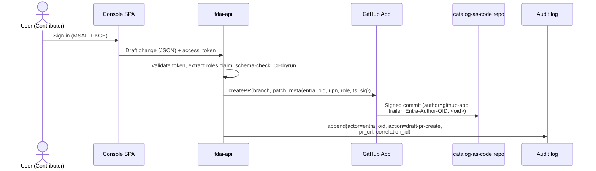
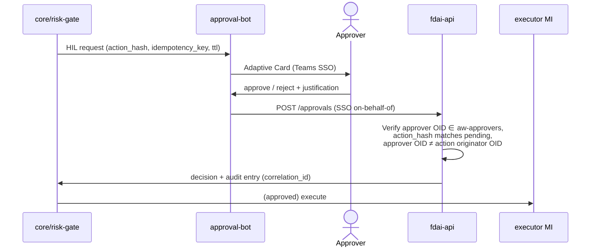

# User RBAC and Entra Identity

How **human users** authenticate, are authorized, and are audited across the console,
ChatOps, and the catalog-as-code repository. This file is authoritative for the human
identity model; non-human identities (executor Managed Identity, GitHub App, Teams bot)
remain governed by [security-and-identity.md](security-and-identity.md) and
[deploy-and-onboard.md](deploy-and-onboard.md).

It resolves the P0 blocker "final identity mapping (external IdP ↔ Entra ↔ Managed
Identity)" from [security-and-identity.md#open-decisions](security-and-identity.md#open-decisions)
for the *human* side; the executor-side mapping stays as declared there.

> Customer-agnostic: all group names, app registration names, and GUIDs below are
> **placeholders**; a fork supplies the real values via config
> ([generic-scope.instructions.md](../../.github/instructions/generic-scope.instructions.md)).

## 1. Design Principles Recalled

Three safety principles govern this design; every choice below preserves them:

1. **No self-approval** - the requester of a governance change (PR author, HIL trigger)
   MUST NOT be the approver. Enforced by CI + GitHub CODEOWNERS, not by role separation.
2. **Approval ≠ execution** - no human role holds the executor Managed Identity. Humans
   author, review, and approve; the MI executes.
3. **Console is read-only** - the console never mutates the live catalog or executes
   actions ([app-shape.instructions.md](../../.github/instructions/app-shape.instructions.md)).
   Editing flows are draft PRs authored by a GitHub App on behalf of the console user.

## 2. Role Model (4 tiers + Break-Glass)

Modeled on Azure RBAC (Reader / Contributor / Owner). Four everyday roles plus one
segregated break-glass group. Roles are **coarse-grained on purpose** - differentiation
comes from CI checks, CODEOWNERS paths, and app-level justification, not from adding
more roles.

| # | Role | Entra Security Group | Analog | May do |
|---|------|----------------------|--------|--------|
| 1 | **Reader** | `aw-readers` | Azure Reader | View console: KPI dashboard, audit log, shadow results, HIL queue |
| 2 | **Contributor** | `aw-contributors` | Azure Contributor | All of Reader + author draft PRs for rules, rule-sets, assignments, exemptions, overrides |
| 3 | **Approver** | `aw-approvers` | (Reviewer) | All of Reader + review/approve governance PRs + approve runtime HIL requests + approve enforce promotions / exemptions / overrides (quorum applies to high-risk - see §5) |
| 4 | **Owner** | `aw-owners` | Azure Owner | All of Approver + trigger kill-switch + manage Entra group membership + apply infra IaC |
| - | **Break-Glass** | `aw-break-glass` | (separate emergency account) | Emergency scope grants, kill-switch override, and **time-boxed emergency HIL approval eligibility** when a regular Approver/Owner is unavailable (paired-approver, no self-approval); membership is a small dedicated set, credentials sealed with hardware MFA, every sign-in raises an alert |

**Rules that keep the model safe without adding tiers**

- A user MAY belong to multiple groups (e.g. both Contributor and Approver), but the
  **no-self-approval** CI check still blocks them from approving their own PR. The check
  compares Entra OIDs on PR author trailer and reviewer, not group membership.
- **Break-Glass is NOT nested inside Owner**. It is a separately managed group; an Owner
  account is not authorized for break-glass actions unless also in `aw-break-glass`. This
  bounds blast radius even if an Owner account is compromised.
- **PIM is optional**. Upstream does not require it. A fork with Entra ID P2 MAY layer PIM
  on top of `aw-approvers` / `aw-owners` for just-in-time activation, but the default
  model works on P1.

## 3. Persona → Action Matrix

| Action | Reader | Contributor | Approver | Owner | Break-Glass |
|--------|:------:|:-----------:|:--------:|:-----:|:-----------:|
| View console | ✓ | ✓ | ✓ | ✓ | ✓ |
| Author rule / rule-set draft PR | | ✓ | ✓ | ✓ | |
| Author assignment / exemption / override draft PR | | ✓ | ✓ | ✓ | |
| Review + approve standard governance PR | | | ✓ | ✓ | |
| Approve `audit → deny / remediate` promotion (quorum) | | | ✓ | ✓ | |
| Approve exemption (time-boxed) | | | ✓ | ✓ | |
| Approve override (may be long-lived) | | | ✓ | ✓ | |
| Approve runtime HIL request | | | ✓ | ✓ | |
| Approve runtime HIL request (emergency, break-glass active, paired) | | | | | ✓ |
| Trigger global kill-switch | | | | ✓ | ✓ |
| Grant emergency scoped access | | | | | ✓ |
| Manage `aw-*` group membership | | | | ✓ | |
| Apply infra IaC (deployer) | | | | ✓ | |
| Hold the executor Managed Identity | (never) - the MI is non-human |||||

## 4. Entra ID Artifacts

### 4.1 App Registrations

Three registrations, each with its own audience and permission surface. Splitting them
prevents an SPA-issued token from carrying backend management scopes.

| App Registration | Type | Audience | Notes |
|------------------|------|----------|-------|
| `fdai-console-spa` | SPA (PKCE, no secret) | requests `fdai-api` scopes | Console sign-in only |
| `fdai-api` | Web API | `api://<guid>` | Called by console + ChatOps backend; declares **App Roles** (§4.4) and validates the `roles` claim on every request |
| `fdai-approval-bot` | Bot (Azure Bot channel registration) | Teams SSO on-behalf-of `fdai-api` | Adaptive Card HIL approvals |

Redirect URIs, tenantId, and clientId are **fork-provided** and injected via config.

### 4.2 Security Groups (slots)

Upstream defines the slots; a fork supplies the Entra `objectId` values. Startup config
validation fails fast when a required slot is missing (deny-by-default).

```yaml
# shared/config schema (upstream slot definition)
rbac:
  entra:
    tenant_id: <fork-provided>
    groups:
      readers:       <objectId>   # required
      contributors:  <objectId>   # required
      approvers:     <objectId>   # required
      owners:        <objectId>   # required
      break_glass:   <objectId>   # required (may be an empty group but must exist)
```

Group naming (`aw-readers` etc.) is a recommended convention; only the objectId is
consumed at runtime.

### 4.3 Conditional Access

CA is available on Entra ID P1 (no P2 required). Recommended policies per group:

| Target group | Requirement |
|--------------|-------------|
| `aw-approvers`, `aw-owners` | **Phishing-resistant MFA** (FIDO2 / Windows Hello for Business / cert-based); text/phone OTP is **denied** |
| `aw-owners` | Additionally require **compliant device** or hybrid Entra-joined |
| `aw-break-glass` | Named-location restriction, dedicated hardware token, and continuous sign-in alert |
| All `aw-*` groups | Block legacy authentication protocols |

### 4.4 App Roles (token surface)

The API authorizes on **App Roles**, not raw group claims. App Roles are declared on the
`fdai-api` app registration and assigned to the `aw-*` groups in the Enterprise
Applications view; a signed-in user's access token then carries a `roles` claim (e.g.
`"roles": ["Approver"]`) that the API validates directly.

| App Role value | Assigned to (Entra security group) |
|----------------|------------------------------------|
| `Reader` | `aw-readers` |
| `Contributor` | `aw-contributors` |
| `Approver` | `aw-approvers` |
| `Owner` | `aw-owners` |
| `BreakGlass` | `aw-break-glass` |

Why App Roles over raw group claims:

- **Portable across tenants.** App Role values are constants defined in code; group
  `objectId`s differ per tenant. A fork changes group assignments, not code.
- **No groups-overage failure.** A user in >200 groups omits the `groups` claim from their
  token by default, forcing a Graph lookup; the `roles` claim is unaffected.
- **App-scoped least privilege.** App Roles apply only to `fdai-api`; they cannot
  be reused elsewhere to widen a compromised token's blast radius.

Group memberships remain the **administration surface** (Owners add/remove members via the
Entra Portal); App Roles are the **token surface** the API sees.

## 5. Governance Action Enforcement (CI + CODEOWNERS)

Coarse roles are made safe by **quorum + justification + author≠approver** checks at the
PR and API layer:

### 5.1 CODEOWNERS (single approver group, path-based reviewer count)

```
# CODEOWNERS
rule-catalog/rules/**              @aw-approvers
rule-catalog/assignments/**        @aw-approvers
rule-catalog/exemptions/**         @aw-approvers
rule-catalog/overrides/**          @aw-approvers
```

Every governance PR requires at least one `@aw-approvers` reviewer. CI raises that
requirement based on **diff content**:

| Diff pattern (CI-detected) | Required approvals from `@aw-approvers` |
|----------------------------|-----------------------------------------|
| Rule text or rule-set change | **1** |
| Assignment parameter change (no effect promotion) | **1** |
| Assignment `effect` promotion `audit → deny / remediate` | **2 (quorum)** |
| Exemption create / renew | **2 (quorum)** |
| Override create / modify | **2 (quorum)** |

Quorum-2 is the shadow→enforce promotion gate ([architecture.instructions.md](../../.github/instructions/architecture.instructions.md))
made concrete without introducing an "elevated approver" group.

### 5.2 CI Checks (upstream-provided, fork-configured)

- **Author-is-not-approver**: parse PR author's Entra OID trailer (§6) and every reviewer's
  Entra OID; fail if any reviewer's OID equals the author's OID.
- **Author-role-check**: PR author's token (captured when the draft PR was created) MUST
  carry a `roles` claim containing `Contributor` or a superset role (`Approver`, `Owner`).
  The role is stamped into the PR trailer at draft-creation time so CI does not re-query
  Entra at review time.
- **Justification-present**: for high-risk diffs (quorum-2 rows above), the PR description
  MUST contain a `Justification:` block ≥ N characters (`N` is configured).
- **Signed-commit / signed-trailer**: reviewer approvals are bound to the specific PR head
  commit; a force-push after approval invalidates and re-requests review.

### 5.3 App-Level Justification (runtime HIL)

Runtime HIL approvals (Adaptive Cards) require a `justification` field on the approval
request; the API rejects `""` / missing values with `400`. This is the PIM-activation-
reason equivalent, applied at the point of decision rather than the point of role
activation.

```jsonc
POST /api/v1/approvals
{
  "approval_id": "hil-2026-07-04-abc123",
  "decision": "approve",
  "justification": "verified rollback plan in runbook X; safe within maintenance window"
}
```

## 6. Identity Flow: Console → Draft PR → Audit

The console preserves read-only by delegating writes to a **GitHub App**. The user's Entra
OID is preserved end-to-end for the no-self-approval and audit correlation checks.



- The SPA never holds a GitHub PAT. Write access to the catalog belongs only to the
  GitHub App.
- The commit's git author is the GitHub App; the human user's Entra OID travels in a
  commit trailer (`Entra-Author-OID: <guid>`) and in the PR body. CI parses that trailer.
- The user's Entra OID ↔ GitHub login mapping is stored by the fork behind the
  `shared/providers/` interface. Missing mapping → the API rejects the draft with `403`.

## 7. ChatOps HIL Flow

This is the identity view of the HIL approval hop. The **channel abstraction** behind it -
categories, trust tiers, per-vendor rules, and fallback policy - lives in
[channels-and-notifications.md](channels-and-notifications.md).



- Approvals are **action-bound**: each Adaptive Card carries the `idempotency_key` and
  `action_hash` of the pending item; replay against a different action is rejected by API.
- Approver-is-not-originator: for HIL items generated in response to a human-authored
  change (rare - most items come from the risk-gate autonomously), the API blocks the
  approver whose OID matches the originating change's author.

## 8. Audit Correlation

A governance decision leaves traces in four systems. Each carries the same
`correlation_id` so a single decision is reconstructable end-to-end:

| Source | What it records |
|--------|-----------------|
| Entra sign-in log | who signed in, MFA method, device, location |
| `fdai-api` action log | which API call, with `justification`, `entra_oid`, `correlation_id` |
| GitHub PR events | PR author trailer, reviewer approvals, CI check results |
| `core/audit` | final decision, tier, executor / approver identity, idempotency key |

Correlation ID is generated by `fdai-api` on the first user-initiated action of a
flow and propagated to GitHub (PR body), Adaptive Cards, and the core audit writer.

## 9. Fork vs Upstream Split

| Item | Upstream (this repo) | Fork |
|------|----------------------|------|
| App registration manifest templates (scopes, redirect URI schema) | ✓ | tenantId, clientId values |
| Entra security group **slots** in config schema | ✓ | objectId values for each slot |
| Conditional Access policy **requirements** (as documentation) | ✓ | tenant-side policy creation |
| CODEOWNERS template | ✓ | GitHub team name mapping |
| `entra-oid ↔ github-login` mapping **interface** (`shared/providers/`) | ✓ | actual mapping data |
| Justification field + CI diff-risk classifier | ✓ | tune `N` (min length), path patterns |
| Break-glass alerting channel | ✓ (interface) | actual channel binding |

## 10. Sign-In Flow Reference

Concrete protocol details behind the flows in §6 and §7. All timing values are
recommendations; a fork tunes them via Conditional Access.

### 10.1 Console (SPA) - OIDC + Authorization Code with PKCE

- **Library**: MSAL.js v3 (`@azure/msal-browser`). No Implicit Flow.
- **Tenant**: single-tenant per fork (`accountsInHomeTenantOnly`); guest access is via
  Entra B2B invitation (§10.5).
- **Redirect**: the console has no anonymous surface. On load, if MSAL has no valid
  session, it redirects to `/authorize` immediately.
- **Token store**: access + id tokens in memory or `sessionStorage` (never
  `localStorage`); refresh managed by MSAL `acquireTokenSilent`.
- **Sign-out**: `/logout?post_logout_redirect_uri=...` clears both console session and the
  Entra session for the tenant.

```mermaid
sequenceDiagram
  actor U as User
  participant SPA as Console SPA (MSAL)
  participant E as Entra ID
  participant API as fdai-api
  U->>SPA: navigate https://console.<fork>/
  SPA->>E: /authorize (client_id=spa, scope=api://<api>/access + openid,<br/>response_type=code, PKCE)
  E->>U: sign-in prompt
  U->>E: credentials
  E->>E: Conditional Access evaluate<br/>(approvers/owners → phishing-resistant MFA)
  E-->>U: MFA challenge (if triggered)
  U->>E: FIDO2 / WHfB response
  E->>SPA: /callback?code=...
  SPA->>E: /token (code + PKCE verifier)
  E->>SPA: id_token + access_token(aud=api://<api>) + refresh_token
  SPA->>API: GET /me + Authorization: Bearer <access_token>
  API->>API: verify signature (JWKS), aud, iss, exp;<br/>extract oid, upn, roles
  API->>SPA: {oid, upn, roles, correlation_id}
  SPA->>SPA: role-based UI render
```

### 10.2 API Token Validation

The API validates every request as follows (deny by default):

1. **Signature** via Entra JWKS (`https://login.microsoftonline.com/<tenant>/discovery/v2.0/keys`).
2. **Audience** equals `api://<fdai-api-guid>`.
3. **Issuer** equals the fork's tenant issuer URL.
4. **Not expired** (`exp`) and **not-before valid** (`nbf`).
5. **Roles claim present** - if `roles` is empty, respond `403` with an "administrator
   assignment required" body. **No auto-provisioning** to `aw-readers`; explicit assignment
   is the only path in.
6. **Stable identity** is `oid` (Entra user objectId). `upn`/email are informational only;
   audit and no-self-approval use `oid`.

Steps 1-4 are implemented upstream by the generic
[`EntraJwtVerifier`](../../src/fdai/delivery/read_api/entra_verifier.py) (PyJWT +
`PyJWKClient`); steps 5-6 by [`RoleResolver`](../../src/fdai/core/rbac/resolver.py). The
verifier is customer-agnostic - a fork supplies only values, via env:

| Env var | Required | Default | Purpose |
|---------|:--------:|---------|---------|
| `FDAI_ENTRA_TENANT_ID` | yes | - | The fork's single tenant; derives issuer + JWKS URI. |
| `FDAI_API_AUDIENCE` | yes | - | The `fdai-api` App ID URI (`api://<fdai-api-guid>`); token `aud` MUST equal it. |
| `FDAI_ENTRA_ISSUER` | no | `https://login.microsoftonline.com/<tenant>/v2.0` | Override for a v1-token app (`https://sts.windows.net/<tenant>/`). |
| `FDAI_ENTRA_JWKS_URI` | no | tenant's `.../discovery/v2.0/keys` | Override for sovereign / air-gapped clouds. |

The JWKS is fetched lazily and cached in-process; per-request validation is local RSA
crypto, so the sync `ClaimsVerifier` contract holds without blocking the event loop.

### 10.3 First Sign-In (unassigned users)

A user with valid Entra credentials but no `aw-*` group membership can reach the console
but MUST NOT gain any capability:

- Entra authentication succeeds, `roles` claim is empty.
- API returns `403` with a one-screen message: contact an Owner to be added to a group.
- The unassigned sign-in still writes a **`sign-in-denied`** audit entry (actor `oid`,
  reason `no-role`) so probing is visible.

### 10.4 ChatOps (Teams) Sign-In

Teams already runs an authenticated Entra session, so approvals ride Teams SSO:

- The Adaptive Card "Approve"/"Reject" click reaches the bot with a Teams SSO token.
- The bot performs the **On-Behalf-Of (OBO)** flow to exchange the Teams token for an
  `fdai-api` audience token.
- API validation (§10.2) is identical; the `roles` claim MUST contain `Approver` or
  `Owner`. A first-time Teams user with no assignment gets the same `403` message.

### 10.5 Guest (Entra B2B) Users

External collaborators are onboarded via **Entra B2B invitation**, producing a guest
`oid` in the fork tenant. Recommended fork policy:

- Guests MAY be added to `aw-readers` and - with justification - `aw-contributors`.
- Guests MUST NOT be added to `aw-approvers`, `aw-owners`, or `aw-break-glass`. A fork
  bootstrap check rejects such assignments (deny-by-default at membership sync time).
- Conditional Access policies apply uniformly to guests and members.

### 10.6 Programmatic Access (local dev, CI)

Human users never hold PATs or long-lived secrets:

- **Local dev**: device code flow via `az login --use-device-code`, scoped to a dedicated
  `fdai-api-dev` audience against a dev tenant.
- **CI**: workload identity federation (OIDC), already required by
  [deployment.md](deployment.md). GitHub Actions and Azure DevOps both support it.
- **PATs aren't supported**. Secret scanning in CI blocks accidental commits
  ([coding-conventions.instructions.md](../../.github/instructions/coding-conventions.instructions.md)).

### 10.7 Break-Glass Sign-In

- Break-glass is a **dedicated account** (not a human's personal account), stored with a
  hardware FIDO2 key in physical custody.
- Every sign-in fires an immediate alert to the break-glass alerting channel and writes an
  elevated audit entry.
- The account holds `Owner` and `BreakGlass` App Roles simultaneously; both are required
  for kill-switch and emergency grants.
- Break-glass credential rotation and drill cadence are declared in
  [security-and-identity.md](security-and-identity.md).

## 11. Open Decisions

- [ ] Whether the API stores the `entra_oid ↔ github_login` mapping in the same
      PostgreSQL as audit (single store) or in a separate fork-owned identity store.
- [ ] The exact `Justification` minimum length per diff-risk tier (currently config-only).
- [ ] Whether Owner may also be a Break-Glass member (default: **no**; enforce via CI in
      fork bootstrap).
- [ ] The rotation cadence for `aw-owners` and `aw-break-glass` membership (manual access
      review vs P2 Entra Access Reviews).
- [ ] Whether the console's "draft change" UI ships in P1 (Change domain only) or P3 (all
      three verticals) - depends on
      [rule-governance.md](rule-governance.md#open-decisions) authoring-UI decision.
- [ ] Whether guest users MAY be assigned `Contributor` at all, or must stay `Reader`-only
      (§10.5 default allows Contributor with justification).
- [ ] Console session max-lifetime value (Conditional Access setting); default
      recommendation: 8 hours idle, 24 hours absolute.
