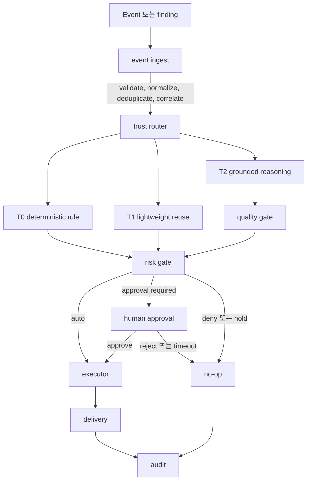
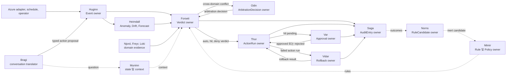
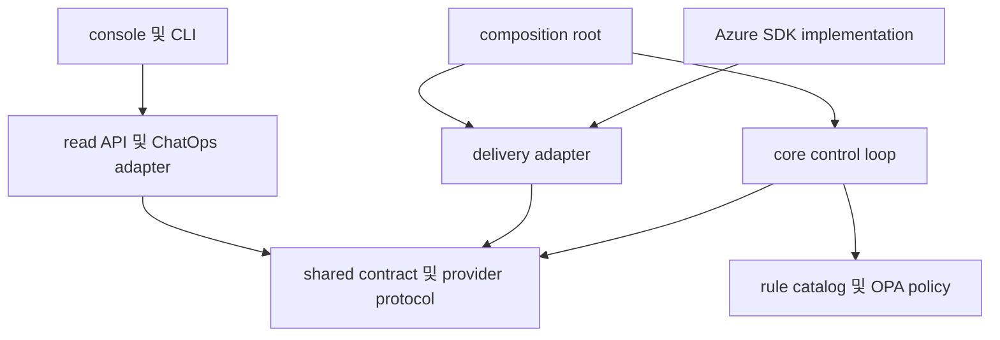

# FDAI 아키텍처

FDAI는 에이전트 주도 아키텍처를 사용합니다. 독립 실행 가능한 agent가 bounded
responsibility를 소유하고 schema-validated event를 통해 협업합니다. FDAI는 thin read-only
console, pull-request-native delivery, ChatOps approval을 갖춘 headless event-driven control
plane입니다. Architecture는 관찰, 판단, 승인, 실행, 감사를 담당하는 component를 분리하여
하나의 surface가 제안을 privileged change로 조용히 바꾸지 못하게 합니다.

고정된 15-agent organization은 이러한 responsibility를 명시적으로 만듭니다. Agent는
control plane 안에서 typed object와 lifecycle role을 소유하며 control loop를 대체하거나
deterministic safety gate를 우회하지 않습니다.

> Azure가 구현된 target입니다. Cloud access는 provider contract 뒤에 있으므로 core는
> Azure SDK를 import하거나 하나의 hosting product에 의존하지 않습니다.

## 전체 구조

느슨하게 결합된 5개 layer는 하나의 application process 또는 identity를 공유하는 대신
typed event, versioned contract, Git을 통해 통신합니다.

<fdai-architecture-diagram manifest="../../diagrams/generated/fdai-system-overview.manifest.json" locale="ko" style="display:block">
  
</fdai-architecture-diagram>

Console은 state 및 audit store의 projection을 읽습니다. Executor identity를 공유하거나
change를 승인하거나 Azure mutation API를 호출하지 않습니다.

## 5개 architecture layer

| Layer | 책임 | 주요 boundary |
|-------|------|---------------|
| Headless control plane | Event를 normalize하고 trust tier를 선택하며 proposal을 검증하고 risk를 분류하며 execution을 coordinate합니다. | UI logic과 direct cloud SDK import가 없습니다. |
| Action delivery | Approved action을 수정 pull request 또는 registered provider call로 render합니다. | 모든 action은 typed safety contract와 rollback reference를 유지합니다. |
| Operator console | State, evidence, audit history, shadow result, pending approval을 표시합니다. | Execution permission이 없는 read-only identity입니다. |
| Human channel | ChatOps를 통해 approval request와 operational alert를 전달합니다. | Approval principal은 executor와 구분됩니다. |
| Rule catalog | Rule, policy, action type, prompt, promotion evidence를 code로 versioning합니다. | Catalog change는 review, regression, shadow evaluation을 통과합니다. |

이러한 layer는 독립적으로 실패하거나 scale할 수 있습니다. Console outage는 event processing을
중지하지 않으며 ChatOps outage는 high-risk work를 approval 없이 실행하는 대신 queue에
보관합니다.

## 하나의 event가 system을 통과하는 방식

Azure resource change, SLO burn detector, scheduled job, operator request 중 어디에서
시작하든 모든 event는 동일한 control loop를 따릅니다.



1. **Ingest 및 correlate**: FDAI는 event schema를 검증하고 stable idempotency key로
   deduplicate하며 관련 signal을 incident로 그룹화합니다.
2. **결정 가능한 가장 낮은 tier 선택**: T0는 deterministic rule을 사용하고 T1은
   evidence-backed incident pattern을 재사용하며 T2는 novel 또는 ambiguous case만 처리합니다.
3. **Risk 분류 전 검증**: T2 proposal은 mixed-model agreement, 근거 확인, schema,
   policy, security, what-if check를 통과합니다.
4. **Autonomy ceiling 적용**: 안전성 검토는 action risk, scope, system health, policy를
   결합합니다. Auto, approval required 또는 deny를 반환합니다.
5. **한 번 실행하고 모든 path 기록**: Executor는 per-resource lock을 획득하고 idempotent
   action을 적용한 뒤 result를 기록합니다. Reject, timeout, hold, rollback, no-op outcome도
   audit됩니다.

Tier boundary는 [결정론 우선](concepts/deterministic-first-ko.md)을, autonomy decision은
[신뢰 tier](concepts/risk-tiers-ko.md)를 참조하세요.

## Control plane 내부의 agent organization

FDAI의 15개 named agent는 **control loop 위의 organizational ownership layer**입니다.
15개의 독립 Azure service가 아니며 free-form decision을 내리는 chatbot group도 아닙니다.
각 agent는 하나의 mandate, owned object type, declared topic subscription, bounded
permission을 가진 first-class runtime object입니다.

물리적으로 agent는 modular Python control-plane process 안에서 실행되며 injected event
bus를 통해 통신합니다. 하나의 runtime을 공유하더라도 논리적인 ownership boundary는
엄격하게 유지됩니다. 나중에 별도 process로 이동하더라도 typed topic 또는 authority
model은 변경되지 않습니다.

### 15개 역할의 결합 방식

| Architecture function | Agent | Control loop ownership |
|-----------------------|-------|------------------------|
| Sense 및 observe | Huginn, Heimdall | Huginn은 normalized event와 real-time resource discovery ingress를 소유합니다. Heimdall은 anomaly, drift, forecast 발견된 문제를 소유합니다. |
| Judge 및 arbitrate | Forseti, Odin | Forseti가 결정을 발행합니다. Odin은 Forseti가 결정을 확정하기 전에 cross-vertical conflict를 해결합니다. |
| Execute, approve, recover, explain | Thor, Var, Vidar, Bragi | Thor는 sole privileged executor입니다. Var는 human approval을 전달합니다. Vidar는 rollback을 소유합니다. Bragi는 operator conversation을 번역합니다. |
| Evidence 및 knowledge govern | Saga, Mimir, Norns, Muninn | Saga는 append-only audit을 소유합니다. Mimir는 rule을 관리합니다. Norns는 inert learning candidate를 propose합니다. Muninn은 state snapshot과 context index를 소유합니다. |
| Domain evidence 공급 | Njord, Freyr, Loki | Cost, capacity, chaos specialist는 judgment에 조언하며 실행하지 않습니다. |

Pantheon은 upstream에서 고정되므로 fork가 incompatible role을 합치거나 authority boundary의
이름을 변경할 수 없습니다. Fork는 provider binding, threshold configuration, optional agent
disable, catalog entry 추가를 할 수 있지만 Saga와 Vidar는 hard dependency이므로 disable할
수 없습니다.

### Runtime data flow

Organization chart는 reporting line을 설명합니다. 다음 diagram은 agent-owned object type
사이의 authoritative data flow를 설명합니다.



Mermaid view를 사용하면 topic ownership을 빠르게 확인할 수 있습니다. 아래에서 생성 도구로
만든 architecture view는 같은 topology를 사용하여 runtime invariant를 보여 줍니다. Agent는
independent subscriber로 실행되고 work는 동시에 fan-out될 수 있으며 authoritative object는
이를 소유한 agent만 publish합니다. Gateway와 worker는 event를 relay하며 숨겨진 decision
maker가 되지 않습니다.

#### 생성된 에이전트 주도 아키텍처

<fdai-architecture-diagram manifest="../../diagrams/generated/fdai-agent-driven-runtime.manifest.json" locale="ko" style="display:block">
  
</fdai-architecture-diagram>

이 flow는 간단한 rule을 유지합니다. Information은 여러 reader로 fan out할 수 있지만 각
authoritative object type에는 writer가 하나뿐입니다. 예를 들어 여러 agent가 결정을
consume할 수 있지만 `object.verdict`는 Forseti만 publish할 수 있습니다. Publish-side
registry는 ownership을 검사하고 event-bus bridge는 declared producer principal이 topic
owner와 충돌하는 record를 dead-letter 처리합니다. Missing principal은 boundary hardening을
위해 별도로 surface됩니다. Topic name만으로는 authority가 되지 않습니다.

### Single-writer topic ownership

Single-writer ownership은 agent role을 설명이 아니라 enforce 가능한 boundary로 만듭니다.

| Object 또는 topic | Single writer | Architecture effect |
|--------------------|---------------|---------------------|
| `Event` / `object.event` | Huginn | Cloud adapter가 normalized control-plane ingress를 impersonate할 수 없습니다. |
| `Verdict` / `object.verdict` | Forseti | Specialist와 model은 조언할 수 있지만 execution eligibility를 부여할 수 없습니다. |
| `ArbitrationDecision` | Odin | Cross-vertical trade-off에 하나의 deterministic tie-break authority가 있습니다. |
| `ActionRun` / `object.action-run` | Thor | Executor만 mutation attempt를 claim하고 report할 수 있습니다. |
| `Approval` / `object.approval` | Var | Executor가 approval을 fabricate할 수 없습니다. |
| `Rollback` / `object.rollback` | Vidar | Recovery가 distinct하고 test 가능한 path로 유지됩니다. |
| `AuditEntry` / `object.audit-entry` | Saga | Terminal evidence에 하나의 append-only authority가 있습니다. |
| `RuleCandidate` / `object.rule-candidate` | Norns | Learning은 inert data를 propose하며 catalog를 직접 편집할 수 없습니다. |
| `Rule` 및 `Policy` | Mimir | Promotion과 revocation이 governed catalog operation으로 유지됩니다. |

Agent module은 handler를 직접 호출하기 위해 서로 import하지 않습니다. Owned object를
publish하고 declared topic을 subscribe하므로 runtime wiring이 authority table과 일치합니다.

### ActionType role binding

등록된 모든 `ActionType`은 lifecycle을 named principal에 bind합니다.

```text
initiator -> Forseti (judge) -> Thor (executor) -> Var (필요한 경우 approver)
                                            -> Saga (모든 terminal path의 auditor)
                                            -> Vidar (필요한 경우 compensation)
```

Initiator는 action마다 달라질 수 있지만 judge, executor, approver, auditor boundary는
upstream에서 고정됩니다. Binding에는 rollback contract, irreversibility flag,
compensating action도 포함됩니다. 따라서 downstream fork가 domain specialist를
self-approve하게 만들거나 change를 실행한 component로 auditor를 대체할 수 없습니다.

### 두 port와 하나의 authority path

모든 agent는 분리된 두 port를 노출합니다.

- **Typed pub/sub port**: Authoritative machine path입니다. Registered topic,
  schema-checked payload, producer-principal verification, deterministic-first control loop를
  사용합니다.
- **Conversational port**: Operator question 및 agent-to-agent introspection을 위한 bounded
  natural-language path입니다. Bragi는 question을 route하고 answer를 render하지만 judge하거나
  execute하지 않습니다.

두 port는 correlation trace만 공유합니다. Operator가 Bragi에게 action 수행을 요청하면
Bragi는 typed proposal을 만들고 Huginn을 통해 전송하여 validation, judgment, risk,
approval, execution, audit에 다시 진입시킵니다. Conversation은 authority를 설명할 수 있지만
authority 자체가 될 수 없습니다.

### Runtime placement와 promotion

현재 runtime은 pantheon을 established control-loop consumer 옆의 measurable shadow overlay로
wire합니다.

> **현재 구현 상태:** Pantheon은 opt-in이며 기본값은 shadow입니다. Named ownership은
> fixed authority contract를 설명하며 모든 agent가 live mutation으로 promote됐다는 의미가
> 아닙니다. Durable safety binding이 모두 준비될 때까지 적용 모드는 차단됩니다.

- **Shared ingress와 distinct consumer**: 두 path는 separate consumer group을 통해 같은 raw
  Kafka topic을 consume하므로 pantheon이 event를 가져가 버리지 않습니다.
- **기본값은 shadow**: Thor는 agent가 수행할 동작을 기록하지만 mutate할 수 없습니다.
  Parity를 측정하는 동안 duplicate execution을 방지합니다.
- **명시적인 enforce promotion**: Enforce startup에는 live Thor executor, durable ActionRun
  storage, durable Saga audit chain, registered Vidar rollback executor가 필요합니다. Binding이
  하나라도 없으면 startup이 차단됩니다.
- **Failure isolation**: Pantheon task는 established consumer와 별도로 monitoring됩니다.
  Shadow-runtime failure는 primary event consumer를 종료하지 않고 surface됩니다.

이 placement를 통해 FDAI는 execution authority를 이동하기 전에 stage-level outcome과
agent-owned outcome을 비교할 수 있습니다. Implementation을 점진적으로 promote하는 동안에도
logical architecture를 안정적으로 유지합니다.

## Trust와 authority boundary

FDAI는 authority 분리를 user interface convention이 아니라 architecture property로
취급합니다.

| Boundary | 존재 이유 | 적용되는 동작 |
|----------|-----------|---------------|
| Judgment와 execution | Change를 propose하거나 judge하는 component가 직접 적용하지 않아야 합니다. | Forseti가 판단하고 Thor가 accepted typed action을 실행합니다. |
| Approval과 execution | Privileged executor가 자신의 작업을 승인할 수 없어야 합니다. | Var가 별도로 authorized된 channel을 통해 approval을 전달합니다. |
| Console과 control plane | Browser session이 mutation permission을 보유하지 않아야 합니다. | Console은 projection과 evidence만 읽습니다. |
| Model proposal과 eligibility | 그럴듯한 model output은 execution evidence가 아닙니다. | Deterministic verification이 T2 proposal의 진행 가능 여부를 결정합니다. |
| Shadow와 enforce | 새 capability는 mutation 전에 동작을 입증하는 것이 좋습니다. | New action은 먼저 관찰하고 audit되며 enforcement는 별도로 promote됩니다. |
| Replay와 re-execution | Investigation이 production mutation을 반복하지 않아야 합니다. | Audit replay는 action을 다시 실행하지 않고 judgment를 재구성합니다. |

[Agent 조직](concepts/agents-and-self-healing-ko.md)은 이러한 역할을 named agent에
할당하지만 agent는 typed control loop를 우회하지 않습니다. Conversational request도 다른
request와 동일한 event, verification, risk, audit path로 다시 들어가야 합니다.

## Code와 data boundary

Repository는 runtime system과 동일한 dependency direction을 따릅니다.



- **`core/`**에는 decision 및 coordination logic이 있습니다. Azure SDK 또는 UI
  component가 아니라 shared contract에 의존합니다.
- **`shared/`**는 versioned event, action, rule, workflow, provider contract를 정의합니다.
  Core를 import하지 않습니다.
- **`delivery/`**는 contract 뒤에서 persistence, Azure access, GitOps, notification,
  ChatOps, read API를 구현합니다.
- **`rule-catalog/` 및 `policies/`**에는 governed data가 있습니다. Rule 또는 action
  type을 추가할 때 control loop를 다시 작성하지 않습니다.
- **Composition root**는 validated configuration에서 concrete provider를 선택하고
  startup에 inject합니다.

전체 dependency map은 [Project Structure](../roadmap/architecture/project-structure-ko.md)를
참조하세요.

## Azure 구현

첫 번째 구현은 portable contract를 minimum Azure resource set에 매핑합니다.
Provider-specific call은 adapter 안에 유지됩니다.

| Portable concern | Contract | Azure 구현 |
|------------------|----------|-----------|
| Event stream | Kafka wire protocol | Kafka endpoint를 통한 Event Hubs |
| Core runtime | OCI image와 portable manifest | Azure Container Apps |
| Scheduled work | Job 또는 cron contract | Container Apps Jobs |
| State, audit, T1 vector | PostgreSQL과 pgvector | Azure Database for PostgreSQL Flexible Server |
| Secret | Environment 또는 mounted secret | Container Apps가 inject하는 Key Vault reference |
| Workload identity | OIDC token | User-assigned Managed Identity |
| Inventory | Resource graph contract | Azure Resource Graph와 activity delta |
| Observability | OpenTelemetry-compatible signal | Log Analytics와 Application Insights |
| Console | Static read-only application | Azure Static Web Apps |
| human approval | Typed approval message | Teams bot와 Adaptive Cards |

Continuously running core는 credential-free Kafka-lag scaler를 검증할 때까지 현재 하나의
replica를 유지합니다. Scheduled job과 static surface는 scale to zero할 수 있습니다. 전체
provider surface는 [CSP-neutrality contract](../roadmap/architecture/csp-neutrality-ko.md)를
참조하세요.

## 모든 action에 포함된 safety

Action type이 다음 4개 control을 선언하지 않으면 action은 완전하지 않습니다.

- **Stop condition**: Execution을 중지하는 measurable signal입니다.
- **Rollback path**: State를 복원하거나 안전하게 forward하는 검증된 방법입니다.
- **영향 범위 limit**: Action이 영향을 줄 수 있는 maximum scope, batch, concurrency
  또는 rate입니다.
- **Audit record**: Event, 결정, authority, execution, outcome을 재구성하는 데 필요한
  evidence입니다.

Execution에는 policy 및 what-if check, per-resource lock, idempotency key도 필요합니다.
Audit store와 같은 required dependency를 사용할 수 없으면 system은 fail open하지 않고
autonomy를 shadow로 낮추거나 review를 위해 hold합니다.

## 예시: Configuration drift

Network access를 policy보다 넓게 여는 resource change를 예로 들어 보겠습니다.

1. Azure가 Kafka-compatible event bus를 통해 resource-change event를 생성합니다.
2. Event ingest가 payload를 normalize하고 inventory context를 연결하며 resource의
   correlation key를 찾습니다.
3. T0가 versioned network policy를 match하고 typed 수정을 propose합니다.
4. What-if가 intended diff를 확인하고 안전성 검토는 scope에 approval이 필요함을 감지합니다.
5. ChatOps가 rule, evidence, scope, stop condition, rollback reference가 포함된 approval
   card를 보냅니다.
6. Approval 후 executor는 console에서 resource를 mutate하는 대신 수정 pull
   request를 생성합니다.
7. Delivery, approval, terminal outcome이 append-only audit trail에서 연결되고 console에
   read-only evidence로 표시됩니다.

동일한 path가 denial, rejection, timeout, rollback도 처리합니다. Terminal branch만
달라집니다.

## Failure isolation

| Failure | System response |
|---------|-----------------|
| Console을 사용할 수 없음 | Core processing, Git delivery, ChatOps가 계속됩니다. |
| ChatOps를 사용할 수 없음 | Approval-required action이 queue에 보관되며 auto-execute되지 않습니다. |
| Event backlog가 증가함 | Backpressure가 concurrency를 제한하고 retry 또는 dead-letter 처리를 위해 work를 보존합니다. |
| Audit 또는 critical provider를 사용할 수 없음 | Autonomy가 shadow로 제한되거나 action이 hold됩니다. |
| Duplicate delivery | Idempotency와 resource lock이 duplicate mutation을 방지합니다. |
| T2 model이 disagreement함 | Competing evidence가 보존되고 case가 human review로 이동합니다. |
| Rollback verification이 실패함 | Incident가 open 상태로 유지되고 typed pipeline을 통해 recovery가 escalate됩니다. |
| Forseti를 사용할 수 없음 | New agent 결정이 발행되지 않으며 work는 review를 위해 hold됩니다. |
| Thor를 사용할 수 없음 | Detection, judgment, audit은 계속될 수 있지만 mutation은 실행되지 않습니다. |
| Var를 사용할 수 없음 | Approval-required work가 queue에 유지되고 timeout은 audited no-op이 됩니다. |
| Saga 또는 Vidar를 사용할 수 없음 | Audit과 rollback이 hard dependency이므로 enforce startup 또는 mutation이 차단됩니다. |
| Shadow pantheon task가 실패함 | Established primary consumer를 종료하지 않고 failure가 log됩니다. |

## 다음 단계

| 알아볼 내용 | 문서 |
|-------------|------|
| Tier가 decision method를 선택하는 방식 | [결정론 우선](concepts/deterministic-first-ko.md) |
| Action이 auto, approval required 또는 deny가 되는 방식 | [신뢰 tier](concepts/risk-tiers-ko.md) |
| Typed action과 workflow가 loop에 맞는 방식 | [Ontology 기반 자동화](concepts/ontology-driven-automation-ko.md) |
| Named agent가 responsibility를 나누는 방식 | [Agent와 self-healing](concepts/agents-and-self-healing-ko.md) |
| Azure resource를 안전하게 준비하는 방식 | [Deployment preflight](../roadmap/deployment/deployment-preflight-ko.md) |
| Operator가 incident에 대응하는 방식 | [SRE runbook](../runbooks/README-ko.md) |
