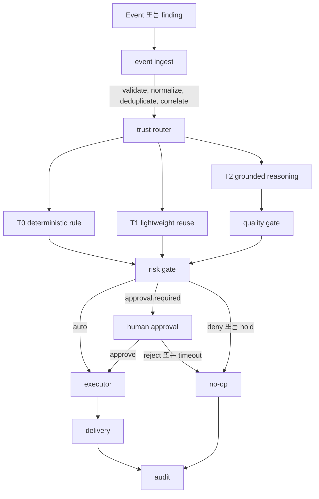
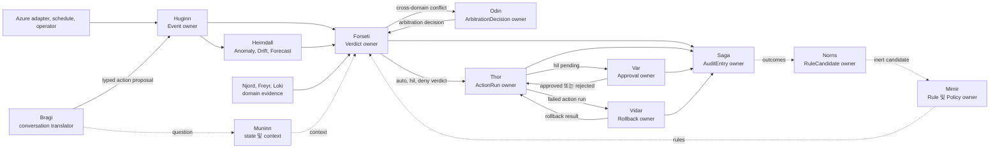
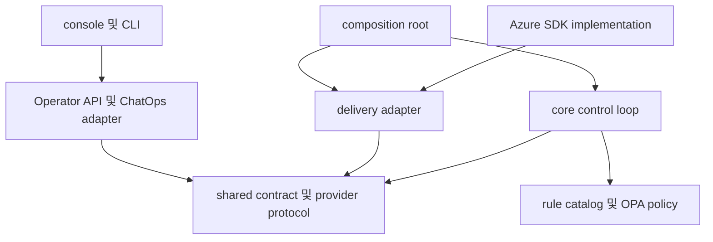

# FDAI 아키텍처

FDAI는 독립적인 에이전트로 구성됩니다. 각 에이전트는 한 가지 역할만 맡고 스키마가 검증된
이벤트로만 서로 대화합니다. 그래서 관찰, 판단, 승인, 실행, 감사가 하나의 컴포넌트로
뭉치지 않습니다. 컨트롤 플레인은 화면 없이 동작하고, 콘솔은 읽기 전용이며, 수정은 pull
request로 도착하고, 승인은 채팅에서 이루어집니다.

15개로 고정된 에이전트 조직이 이 책임 분담을 명확하게 만듭니다. 각 에이전트는 컨트롤
플레인 안에서 타입이 정의된 객체와 생애주기 역할을 소유합니다. 에이전트는 컨트롤 루프
위에 소유권을 더할 뿐입니다. 컨트롤 루프를 대신하지도, 결정론적 안전성 검토를 건너뛰지도
않습니다.

> 구현 대상은 Azure입니다. 모든 클라우드 호출은 provider 계약을 거치므로 core는 Azure
> SDK를 직접 가져오지 않고, 나중에 다른 호스트로 옮겨도 판단 로직을 다시 쓸 필요가
> 없습니다.

## 전체 구조

FDAI는 느슨하게 결합된 5개 레이어로 이루어집니다. 레이어끼리는 타입이 정의된 이벤트,
버전이 관리되는 contract, Git을 공유합니다. 하나의 프로세스나 하나의 자격 증명을 공유하지는
않습니다.

<fdai-architecture-diagram manifest="../../diagrams/generated/fdai-system-overview.manifest.json" locale="ko" style="display:block">
  
</fdai-architecture-diagram>

콘솔은 상태 저장소와 감사 저장소의 조회용 데이터만 읽습니다. 실행기 자격 증명을 사용하지
않고, 변경을 승인할 수 없으며, 무언가를 바꾸는 Azure API를 호출하지도 않습니다.

## Azure 배포 토폴로지

논리적인 컨트롤 루프 책임 대신 production private-network baseline을 추적하려면 배포
다이어그램을 사용하세요. 번호가 지정된 연결선은 주요 신호, 결정, 근거, 승인 및 전달
경로를 보여 줍니다. 중첩된 경계는 Azure region, virtual network 및 delegated subnet을
나타냅니다.

<fdai-architecture-diagram manifest="../../diagrams/generated/fdai-azure-deployment-topology.manifest.json" locale="ko" style="display:block">
  
</fdai-architecture-diagram>

이 다이어그램은 특정 tenant의 resource name이 아니라 parameterized Terraform 배포를
나타냅니다. Azure OpenAI와 일부 private endpoint는 선택 사항입니다. 사람 App Role과
권한 있는 executor managed identity는 모든 profile에서 분리됩니다.

## Azure resource network flow

현재 및 target-state 연결을 Azure resource 수준에서 추적하려면 이 보기를 사용하세요.
Private Application Gateway, Container Apps infrastructure 및 private endpoint subnet을
분리하고, 각 private endpoint를 해당 managed service backend에 연결합니다.
이 다이어그램은 FDAI Web Console 경로를 표시합니다. FDAI CLI는 동일한 Operator API를
사용하지만 가독성을 위해 이 보기에서는 생략합니다.

<fdai-architecture-diagram manifest="../../diagrams/generated/fdai-azure-resource-network-flow.manifest.json" locale="ko" style="display:block">
  
</fdai-architecture-diagram>

Baseline 영역은 `enable_private_postgres=false`일 때 `postgresqlServer` private endpoint를
추가하는 기본 private-networking profile을 표시합니다. `enable_private_postgres=true`로
설정하면 이 경로 대신 PostgreSQL Flexible Server를 delegated subnet에 배치하고 endpoint를
생성하지 않습니다.
Optional document-ingestion 경로는 Ingestion Gateway, Blob 및 DFS private endpoint와 ADLS
Gen2 account를 표시합니다. Case-history storage와 development operations gateway는 각각의
feature-specific profile에 남아 있습니다. APIM은 표시하지 않습니다.

같은 보기에는 의도한 gateway, model platform, observability 및 delivery provider topology도
겹쳐서 표시합니다. Product 및 network label을 안정적으로 유지하기 위해 상태는 다이어그램이
아니라 이 문서에서 관리합니다.

| Target-state 요소 | Day-zero baseline | 상태 |
|-------------------|-------------------|------|
| Application Gateway와 WAF policy가 있는 private Application Gateway subnet | 프로비전되지 않음 | TBD - Terraform profile을 추가하고 private operator access 경로를 검증합니다. |
| Microsoft Foundry private endpoint와 Azure Managed Grafana | 프로비전되지 않음 | TBD - 각 서비스를 feature-specific deployment profile로 연결합니다. |
| Email, Teams 및 Slack 승인 채널 | Adapter 선택지 | 배포별 TBD - 채널, credential, callback identity 및 fallback policy를 선택합니다. |
| GitHub, GitLab 및 Azure DevOps 전달 provider | Provider 선택지 | 배포별 TBD - Git host를 선택하고 review 및 rollback binding을 구성합니다. |

Azure Resource Graph 조회와 observability 쓰기는 Azure control-plane 및 telemetry contract를
사용하므로 private data-plane 경로 밖에 표시합니다. Day-zero Terraform baseline은 여전히
Application Gateway, WAF, Managed Grafana 또는 load balancer를 추가하지 않습니다.

## 5개 아키텍처 레이어

| 레이어 | 책임 | 주요 경계 |
|--------|------|-----------|
| 화면 없는 컨트롤 플레인 | 이벤트를 정규화하고, 결정 수준을 고르고, 제안을 검증하고, 위험을 분류하고, 실행을 조율합니다. | UI 로직이 없고 클라우드 SDK를 직접 가져오지 않습니다. |
| 작업 전달 | 승인된 작업을 수정 pull request나 등록된 provider 호출로 바꿉니다. | 모든 작업이 안전성 계약과 롤백 참조를 그대로 유지합니다. |
| 운영자 콘솔 | 상태, 근거, 감사 이력, 관찰 모드 결과, 승인 대기 항목을 보여 줍니다. | 실행 권한이 없는 읽기 전용 자격 증명입니다. |
| 사람 채널 | ChatOps로 승인 요청과 운영 알림을 전달합니다. | 승인자는 절대 실행자가 되지 않습니다. |
| 룰 카탈로그 | 룰, 정책, 작업 유형, 프롬프트, 승격 근거를 코드로 버전 관리합니다. | 카탈로그 변경은 리뷰, 회귀 테스트, 관찰 모드 평가를 거칩니다. |

각 레이어는 따로 실패하고 따로 확장됩니다. 콘솔이 멈춰도 이벤트 처리는 계속됩니다.
ChatOps가 멈추면 위험도가 높은 작업은 승인 없이 실행되는 대신 대기열에서 기다립니다.

## 하나의 이벤트가 시스템을 통과하는 방식

Azure 리소스 변경, SLO 소진 감지, 예약 작업, 운영자 요청 중 어디에서 시작하든 모든
이벤트는 같은 경로를 따릅니다.


```mermaid
flowchart TD
  E[Event 또는 finding] --> I[event ingest]
  I -->|validate, normalize, deduplicate, correlate| R[trust router]
  R --> T0[T0 deterministic rule]
  R --> T1[T1 lightweight reuse]
  R --> T2[T2 grounded reasoning]
  T2 --> Q[quality gate]
  T0 --> G[risk gate]
  T1 --> G
  Q --> G
  G -->|auto| X[executor]
  G -->|approval required| H[human approval]
  G -->|deny 또는 hold| N[no-op]
  H -->|approve| X
  H -->|reject 또는 timeout| N
  X --> D[delivery]
  D --> A[audit]
  N --> A
```

1. **수집과 상관관계 연결**: FDAI는 이벤트 스키마를 확인하고, 재시도를 안전하게 만드는
   idempotency key로 중복을 걸러낸 뒤, 관련된 신호를 하나의 인시던트로 묶습니다.
2. **판단할 수 있는 가장 낮은 수준 선택**: T0(결정론적 룰)은 반복되는 대다수를 처리하고,
   T1(비슷한 과거 사례를 가볍게 재사용)은 이미 알려진 패턴을 처리하며, T2(근거 기반 LLM
   추론)는 새롭거나 모호한 사례만 맡습니다.
3. **위험을 분류하기 전에 먼저 검증**: T2 제안은 서로 다른 모델의 합의, 근거 확인, 스키마,
   정책, 보안, what-if 검사를 모두 통과해야 합니다. 그럴듯한 답변만으로는 부족합니다.
4. **자율성 상한 적용**: 안전성 검토는 작업의 위험도, 영향 범위, 시스템 상태, 정책을 함께
   저울질합니다. 결과는 자동 실행, 승인 필요, 거부 중 하나입니다.
5. **한 번만 실행하고 모든 경로를 기록**: 실행기는 리소스별 잠금을 잡고, 재시도해도 안전한
   작업을 적용한 뒤 결과를 기록합니다. 거부, 시간 초과, 보류, 롤백, 미실행도 똑같이
   감사됩니다.

수준을 나누는 기준은 [결정론 우선](concepts/deterministic-first-ko.md), 자율성 결정은
[신뢰 수준](concepts/risk-tiers-ko.md)을 참조하세요.

## 컨트롤 플레인 안의 에이전트 조직

FDAI의 15개 에이전트는 **컨트롤 루프 위에 얹혀진 소유권 레이어**입니다. 15개의 별도 Azure
서비스도 아니고, 자유롭게 결정을 내리는 챗봇도 아닙니다. 각 에이전트는 하나의 임무,
자신이 소유하는 객체 유형, 구독하는 토픽, 제한된 권한을 가진 런타임 객체입니다.

모든 에이전트는 같은 Python 컨트롤 플레인 프로세스 안에서 실행되며 주입된 이벤트 버스로
통신합니다. 프로세스를 공유한다고 경계가 느슨해지지는 않습니다. 에이전트는 여전히 자신이
소유한 객체만 발행합니다. 나중에 별도 프로세스로 분리하더라도 토픽과 권한 모델은
그대로입니다.

### 15개 역할의 결합 방식

| 아키텍처 기능 | 에이전트 | 컨트롤 루프에서의 소유권 |
|-----------------|-----------|--------------------------|
| 감지와 관찰 | Huginn, Heimdall | Huginn은 정규화된 이벤트와 실시간 리소스 탐색 유입을 소유합니다. Heimdall은 이상 징후, 드리프트, 예측으로 발견된 문제를 소유합니다. |
| 판단과 조정 | Forseti, Odin | Forseti가 결정을 발행합니다. Odin은 Forseti가 결정을 확정하기 전에 영역 간 충돌을 정리합니다. |
| 실행, 승인, 복구, 설명 | Thor, Var, Vidar, Bragi | Thor는 유일한 권한 실행기입니다. Var는 사람 승인을 전달합니다. Vidar는 롤백을 소유합니다. Bragi는 운영자와의 대화를 옮깁니다. |
| 근거와 지식 관리 | Saga, Mimir, Norns, Muninn | Saga는 추가 전용 감사 기록을 소유합니다. Mimir는 룰을 관리합니다. Norns는 아직 작동하지 않는 학습 후보를 제안합니다. Muninn은 상태 스냅샷과 맥락 색인을 소유합니다. |
| 도메인 근거 공급 | Njord, Freyr, Loki | 비용, 용량, 카오스 전문 에이전트는 판단에 조언할 뿐 직접 실행하지 않습니다. |

15개 역할은 상위 프로젝트에서 고정되므로, 포크가 서로 충돌하는 역할을 합치거나 권한 경계의
이름을 바꿀 수 없습니다. 포크는 provider를 연결하고, 임계값을 조정하고, 선택적인 에이전트를
끄고, 카탈로그 항목을 추가할 수 있습니다. 다만 Saga와 Vidar는 필수 의존 항목이므로 감사와
롤백은 끕 수 없습니다.

### 런타임 데이터 흐름

위 표는 조직도입니다. 아래 다이어그램은 데이터 흐름, 즉 에이전트가 소유한 객체가 어디로
이동하는지를 보여 줍니다.


```mermaid
flowchart LR
  EXT[Azure adapter, schedule, operator]
  HUG[Huginn<br/>Event owner]
  HEI[Heimdall<br/>Anomaly, Drift, Forecast]
  DOM[Njord, Freyr, Loki<br/>domain evidence]
  FOR[Forseti<br/>Verdict owner]
  ODI[Odin<br/>ArbitrationDecision owner]
  THO[Thor<br/>ActionRun owner]
  VAR[Var<br/>Approval owner]
  VID[Vidar<br/>Rollback owner]
  SAG[Saga<br/>AuditEntry owner]
  NOR[Norns<br/>RuleCandidate owner]
  MIM[Mimir<br/>Rule 및 Policy owner]
  MUN[Muninn<br/>state 및 context]
  BRA[Bragi<br/>conversation translator]

  EXT --> HUG
  HUG --> HEI
  HUG --> FOR
  HEI --> FOR
  DOM --> FOR
  MIM -. rules .-> FOR
  MUN -. context .-> FOR
  FOR -->|cross-domain conflict| ODI
  ODI -->|arbitration decision| FOR
  FOR -->|auto, hil, deny verdict| THO
  THO -->|hil pending| VAR
  VAR -->|approved 또는 rejected| THO
  THO -->|failed action run| VID
  VID -->|rollback result| THO
  FOR --> SAG
  THO --> SAG
  VAR --> SAG
  VID --> SAG
  SAG -. outcomes .-> NOR
  NOR -. inert candidate .-> MIM
  BRA -. question .-> MUN
  BRA -->|typed action proposal| HUG
```

위 Mermaid 도해로 토픽 소유권을 빠르게 훑어볼 수 있습니다. 아래 상세 도해는 같은 구조를 런타임
관점에서 보여 줍니다. 에이전트는 각자 독립적으로 구독하고, 작업은 동시에 여러 곳으로 퍼질 수
있으며, 권위 있는 객체는 그것을 소유한 에이전트만 발행합니다. 게이트웨이와 워커는 이벤트를
중계할 뿐, 숨은 의사 결정자가 되지 않습니다.

#### 에이전트 주도 런타임

<fdai-architecture-diagram manifest="../../diagrams/generated/fdai-agent-driven-runtime.manifest.json" locale="ko" style="display:block">
  
</fdai-architecture-diagram>

이 흐름은 한 가지 간단한 규칙을 따릅니다. 정보는 여러 독자에게 퍼질 수 있지만, 권위 있는 객체
유형은 쓰는 주체가 딱 하나입니다. 여러 에이전트가 결정을 읽을 수 있지만 `object.verdict`는
Forseti만 발행합니다. 발행 측 레지스트리가 이 소유권을 검사합니다. 선언된 발행 주체가 토픽
소유자와 다르면 이벤트 버스 브리지가 해당 레코드를 dead-letter로 보냅니다. 발행 주체가 아예
없는 레코드는 경계를 더 조이기 위해 따로 보고됩니다. 토픽 이름을 안다고 권한이 생기지는
않습니다.

### 단일 쓰기 주체 소유권

단일 쓰기 주체 소유권은 에이전트 역할을 문서 설명이 아니라 런타임이 강제할 수 있는 경계로
만듭니다.

| 객체 또는 토픽 | 단일 쓰기 주체 | 아키텍처적 효과 |
|-------------------|-----------------|-------------------|
| `Event` / `object.event` | Huginn | 클라우드 어댑터가 정규화된 컨트롤 플레인 유입인 체할 수 없습니다. |
| `Verdict` / `object.verdict` | Forseti | 전문 에이전트와 모델은 조언할 수 있지만 작업을 실행 가능하게 만들 수는 없습니다. |
| `ArbitrationDecision` | Odin | 영역 간 트레이드오프에 결정론적 중재자가 하나만 존재합니다. |
| `ActionRun` / `object.action-run` | Thor | 실행기만 변경 시도를 점유하고 결과를 보고할 수 있습니다. |
| `Approval` / `object.approval` | Var | 실행기가 자기 승인을 지어낼 수 없습니다. |
| `Rollback` / `object.rollback` | Vidar | 복구가 따로 테스트할 수 있는 별도 경로로 남습니다. |
| `AuditEntry` / `object.audit-entry` | Saga | 최종 근거의 추가 전용 소유자가 하나입니다. |
| `RuleCandidate` / `object.rule-candidate` | Norns | 학습은 아직 작동하지 않는 데이터를 제안할 뿐 카탈로그를 직접 고칠 수 없습니다. |
| `Rule` 및 `Policy` | Mimir | 룰을 켜고 끄는 일은 관리되는 카탈로그 작업으로 남습니다. |

에이전트 모듈은 핸들러를 직접 호출하려고 서로를 import하지 않습니다. 자신이 소유한 객체를
발행하고 선언한 토픽을 구독하므로 런타임 구성이 위 권한 표와 항상 일치합니다.

### ActionType 역할 바인딩

등록된 모든 `ActionType`은 작업 생애주기를 지정된 에이전트에 연결합니다.

```text
initiator -> Forseti (judge) -> Thor (executor) -> Var (필요한 경우 approver)
                                            -> Saga (모든 terminal path의 auditor)
                                            -> Vidar (필요한 경우 compensation)
```

시작 주체는 작업마다 달라집니다. 반면 판단자, 실행자, 승인자, 감사자 역할은 상위
프로젝트에서 고정됩니다. 바인딩에는 롤백 contract, 비가역성 표시, 보상 작업도 함께
담깁니다. 덕분에 포크가 도메인 전문 에이전트에게 자기 승인을 허용하거나, 변경을 실행한
컴포넌트를 그 변경의 감사자로 지정하는 일을 막을 수 있습니다.

### 두 개의 포트와 하나의 권한 경로

모든 에이전트는 두 개의 포트를 노출합니다.

- **타입 기반 pub/sub 포트**: 권위 있는 기계 경로입니다. 등록된 토픽, 스키마가 검증된
  페이로드, 발행 주체 확인, 결정론 우선 컨트롤 루프를 사용합니다.
- **대화 포트**: 운영자 질문과 에이전트 간 조회를 위한 제한된 자연어 경로입니다. Bragi가
  질문을 전달하고 답변을 작성합니다. Bragi는 판단하지도, 실행하지도 않습니다.

두 포트는 상관관계 추적 정보만 공유합니다. 운영자가 Bragi에게 작업 수행을 요청하면
Bragi는 타입이 정의된 제안을 만들어 Huginn으로 보냅니다. 그래서 다른 이벤트와 똑같이 검증,
판단, 위험 평가, 승인, 실행, 감사를 다시 거칩니다. 대화는 권한을 설명할 수는 있지만
권한 자체가 될 수는 없습니다.

### 런타임 배치와 승격

런타임은 기존 컨트롤 루프 소비자 옆에서 에이전트 조직을 함께 실행하고 둘을 서로
비교합니다.

> **현재 구현 상태:** 에이전트는 컨트롤 플레인과 함께 시작하며, 판단과 기록만 하고 실제
> 변경은 하지 않는 관찰 모드로 동작합니다. 역할 이름은 권한 contract를 설명할 뿐, 모든
> 에이전트가 실제 변경 권한을 받았다는 뜻은 아닙니다. 지속 저장 기반 안전 연결이 모두
> 갖춰질 때까지 적용 모드는 차단됩니다.

- **유입은 공유, 소비자는 분리**: 두 경로는 서로 다른 소비자 그룹으로 같은 Kafka 토픽을
  읽습니다. 따라서 에이전트는 기존 루프의 이벤트를 가로채지 않고 같이 관찰합니다.
- **기본값은 관찰 모드**: Thor는 에이전트가 했을 법한 작업을 기록하지만 아무것도 변경할 수
  없습니다. 두 경로를 비교하는 동안 같은 작업이 두 번 실행되지 않습니다. 유지보수 때문에
  에이전트 런타임을 멈춰야 할 때만 `FDAI_START_PANTHEON=0`을 설정하세요.
- **적용은 별도 승격 절차**: 적용 모드로 시작하려면 동작 중인 Thor 실행기, 지속 저장되는
  작업 실행 기록, 지속 저장되는 Saga 감사 체인, 등록된 Vidar 롤백 실행기, 그리고 시작
  준비 보고서의 배포 단계 권한 상한이 모두 필요합니다. 하나라도 없으면 시작이
  중단됩니다.
- **장애 격리**: 에이전트 런타임은 따로 감시됩니다. 이쪽이 실패해도 장애만 보고되고 기존
  이벤트 소비자는 계속 동작합니다.

이 배치 덕분에 실행 권한을 옮기기 전에 단계별 결과와 에이전트 소유 결과를 비교할 수
있습니다. 구현을 단계적으로 승격하는 동안에도 아키텍처는 그대로 유지됩니다.

## 신뢰와 권한 경계

FDAI에서 권한 분리는 아키텍처 속성입니다. 나중에 손쉬운 변경으로 되돌릴 수 있는 UI
관례가 아닙니다.

| 경계 | 존재 이유 | 적용되는 동작 |
|------|-----------|-------------------|
| 판단과 실행 | 변경을 제안하거나 판단한 쪽이 직접 적용하지 않는 것이 좋습니다. | Forseti가 판단하고 Thor가 승인된 작업을 실행합니다. |
| 승인과 실행 | 권한 실행기가 자신의 작업을 승인할 수 없어야 합니다. | Var가 별도로 권한이 부여된 채널로 승인을 전달합니다. |
| 콘솔과 컨트롤 플레인 | 브라우저 세션이 변경 권한을 가지지 않아야 합니다. | 콘솔은 조회용 데이터와 근거만 읽습니다. |
| 모델 제안과 실행 자격 | 그럴듯한 모델 답변은 근거가 아닙니다. | 결정론적 검증이 T2 제안의 진행 가능 여부를 결정합니다. |
| 관찰과 적용 | 새 기능은 무언가를 바꾸기 전에 스스로를 증명하는 것이 좋습니다. | 새 작업은 먼저 관찰하고 감사되며 적용은 별도로 승격됩니다. |
| 재생과 재실행 | 조사 작업이 운영 변경을 다시 일으키지 않아야 합니다. | 감사 재생은 작업을 다시 실행하지 않고 판단 과정만 재구성합니다. |

[에이전트 조직](concepts/agents-and-self-healing-ko.md)은 이러한 역할을 각 에이전트에
할당하며, 어느 에이전트도 컨트롤 루프를 건너뛸 수 없습니다. 대화로 들어온 요청도 다른
요청과 똑같은 이벤트, 검증, 위험 평가, 감사 경로를 다시 거칩니다.

## 코드와 데이터 경계

리포지토리는 런타임 시스템과 같은 의존 방향을 따릅니다.


```mermaid
flowchart TB
  UI[console 및 CLI] --> API[Operator API 및 ChatOps adapter]
  API --> CONTRACTS[shared contract 및 provider protocol]
  DELIVERY[delivery adapter] --> CONTRACTS
  CORE[core control loop] --> CONTRACTS
  CORE --> CATALOG[rule catalog 및 OPA policy]
  COMPOSE[composition root] --> CORE
  COMPOSE --> DELIVERY
  AZURE[Azure SDK implementation] --> DELIVERY
```

- **`core/`**에는 판단과 조율 로직이 들어 있습니다. Azure SDK나 UI 컴포넌트가 아니라 공유
  contract에만 의존합니다.
- **`shared/`**는 버전이 관리되는 이벤트, 작업, 룰, 워크플로, provider contract를
  정의합니다. core를 가져오지 않습니다.
- **`delivery/`**는 contract 뒤에서 영속화, Azure 접근, GitOps, 알림, ChatOps, 조회
  API를 구현합니다.
- **`rule-catalog/` 및 `policies/`**에는 관리 대상 데이터가 들어 있습니다. 룰이나 작업
  유형을 추가할 때 컨트롤 루프를 다시 쓸 필요가 없습니다.
- **컴포지션 루트**는 검증된 설정을 읽고 실제 provider를 골라 시작 시점에 주입합니다.

전체 의존 관계 지도는 [Project Structure](../roadmap/architecture/project-structure-ko.md)를
참조하세요.

## Azure 구현

첫 번째 구현은 각 이식 가능한 contract를 작은 Azure 리소스 집합에 매핑합니다. provider에
종속적인 호출은 어댑터 안에만 머물므로, 리소스를 바꿔도 판단 로직은 건들지 않습니다.

| 이식 가능한 요소 | Contract | Azure 구현 |
|-------------------|----------|-----------|
| 이벤트 스트림 | Kafka wire protocol | Kafka endpoint를 통한 Event Hubs |
| 코어 런타임 | OCI 이미지와 이식 가능한 매니페스트 | Azure Container Apps |
| 예약 작업 | Job 또는 cron contract | Container Apps Jobs |
| 상태, 감사, T1 벡터 | PostgreSQL과 pgvector | Azure Database for PostgreSQL Flexible Server |
| 시크릿 | 환경 변수 또는 마운트된 시크릿 | Container Apps가 주입하는 Key Vault 참조 |
| 워크로드 자격 증명 | OIDC 토큰 | 사용자 할당 관리 자격 증명 |
| 인벤토리 | Resource graph contract | Azure Resource Graph와 활동 로그 변화량 |
| 관측 | OpenTelemetry 호환 신호 | Log Analytics와 Application Insights |
| 콘솔 | 정적 읽기 전용 앱 | Azure Static Web Apps |
| 콘솔 조회 API | HTTP 조회 contract | 자체 읽기 전용 자격 증명을 가진 Container App |
| 문서 수집 | 업로드와 분할 contract | Container App과 Data Lake Storage |
| 사람 승인 | 타입이 정의된 승인 메시지 | Teams 봇과 Adaptive Cards |

코어는 최소 복제본 1개, 최대 3개로 상시 실행됩니다. 0개까지 줄이려면 자격 증명 없이
동작하는 Kafka 지연 기반 스케일 규칙이 필요합니다. 그 규칙 없이 0으로 내리면 들어오는
이벤트가 앱을 깨우지 못하므로 최소값을 1로 유지합니다. 예약 작업과 정적 서비스는 0까지
줄일 수 있습니다. 전체 provider 목록은
[CSP-neutrality contract](../roadmap/architecture/csp-neutrality-ko.md)를 참조하세요.

## 모든 작업에 들어 있는 안전장치

작업 유형은 다음 4가지를 선언해야 비로소 완성됩니다.

- **중단 조건**: 실행을 멈추는 측정 가능한 신호입니다.
- **롤백 경로**: 이전 상태로 되돌리거나 안전하게 앞으로 나아가는 검증된 방법입니다.
- **영향 범위 제한**: 작업이 건드릴 수 있는 최대 범위, 배치 크기, 동시성, 속도입니다.
- **감사 기록**: 이벤트, 결정, 권한을 부여한 주체, 실행 내용, 최종 결과를 다시 구성하는 데
  필요한 근거입니다.

실행에는 정책 검사와 what-if 검사, 리소스별 잠금, idempotency key도 필요합니다. 감사
저장소처럼 필수적인 의존 항목을 쓰지 못하면 FDAI는 자율성을 관찰 모드로 낮추거나 작업을
검토 대기로 둘니다. 위험한 쪽으로 열어 두지 않습니다.

## 예시: 설정 드리프트

네트워크 접근을 정책보다 넓게 여는 리소스 변경을 예로 들어 보겠습니다.

1. Azure가 Kafka 호환 이벤트 버스로 리소스 변경 이벤트를 보냅니다.
2. 이벤트 수집이 페이로드를 정규화하고 인벤토리 맥락을 붙인 뒤 리소스의 상관관계 키를
   찾습니다.
3. T0가 버전 관리되는 네트워크 룰을 찾아 타입이 정의된 수정을 제안합니다.
4. what-if가 정확한 변경 내용을 확인하고, 안전성 검토는 영향 범위상 승인이 필요하다고
   판단합니다.
5. ChatOps가 룰, 근거, 영향 범위, 중단 조건, 롤백 참조가 담긴 승인 카드를 보냅니다.
6. 승인 후 실행기는 콘솔에서 리소스를 직접 바꾸는 대신 수정 pull request를 엽니다.
7. 전달, 승인, 최종 결과가 추가 전용 감사 기록에서 연결되고 콘솔에 읽기 전용 근거로
   표시됩니다.

거부, 반려, 시간 초과, 롤백도 같은 경로를 따릅니다. 마지막 단계만 달라집니다.

## 장애 격리

| 장애 | 시스템 대응 |
|------|-------------|
| 콘솔을 사용할 수 없음 | 코어 처리, Git 전달, ChatOps가 계속 동작합니다. |
| ChatOps를 사용할 수 없음 | 승인이 필요한 작업은 대기열에 남으며 자동 실행되지 않습니다. |
| 이벤트 백로그가 늘어남 | 백프레셔가 동시성을 제한하고 재시도 또는 dead-letter 처리를 위해 작업을 보관합니다. |
| 감사나 핵심 provider를 사용할 수 없음 | 자율성이 관찰 모드로 낮춰지거나 작업이 보류됩니다. |
| 중복 전달 | idempotency key와 리소스 잠금이 두 번째 변경을 막습니다. |
| T2 모델의 의견이 갈림 | 상반된 근거를 보관하고 사례를 사람 검토로 보냅니다. |
| 롤백 검증 실패 | 인시던트가 열린 상태로 유지되고 복구가 타입 기반 파이프라인을 통해 에스컬레이션됩니다. |
| Forseti를 사용할 수 없음 | 새 에이전트 결정이 발행되지 않고 작업은 검토 대기로 보관됩니다. |
| Thor를 사용할 수 없음 | 감지, 판단, 감사는 계속되지만 아무것도 변경되지 않습니다. |
| Var를 사용할 수 없음 | 승인이 필요한 작업은 대기열에 남고 시간 초과는 감사된 미실행으로 처리됩니다. |
| Saga나 Vidar를 사용할 수 없음 | 감사와 롤백은 필수 의존 항목이므로 적용 모드 시작과 변경이 차단됩니다. |
| 에이전트 런타임 실패 | 장애를 기록하고 기존 주 소비자는 계속 동작합니다. |

## 다음 단계

| 알아볼 내용 | 문서 |
|-------------|------|
| 수준별로 판단 방식을 고르는 기준 | [결정론 우선](concepts/deterministic-first-ko.md) |
| 작업이 자동 실행, 승인 필요, 거부로 나뉘는 기준 | [신뢰 수준](concepts/risk-tiers-ko.md) |
| 타입이 정의된 작업과 워크플로의 위치 | [에이전트 기반 자동화](concepts/ontology-driven-automation-ko.md) |
| 각 에이전트가 책임을 나누는 방식 | [에이전트와 자가 복구](concepts/agents-and-self-healing-ko.md) |
| Azure 리소스를 안전하게 준비하는 방법 | [배포 사전 점검](../roadmap/deployment/deployment-preflight-ko.md) |
| 운영자가 인시던트에 대응하는 방법 | [SRE 런북](../runbooks/README-ko.md) |
