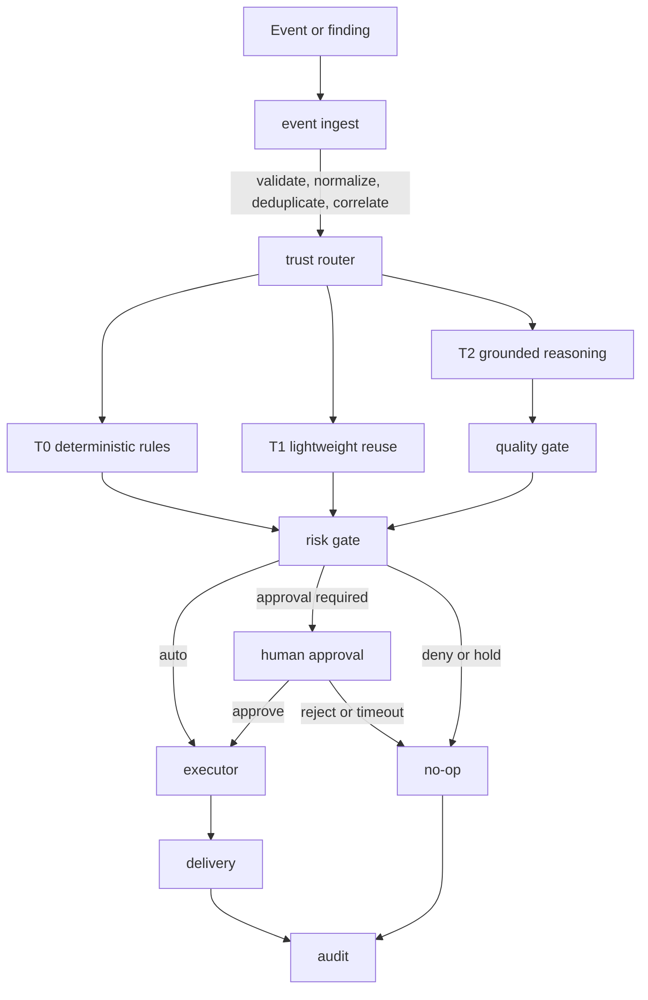
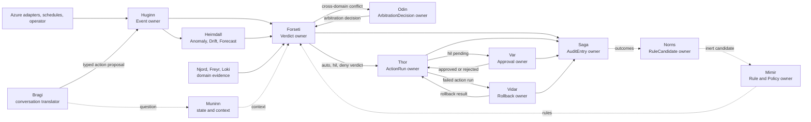
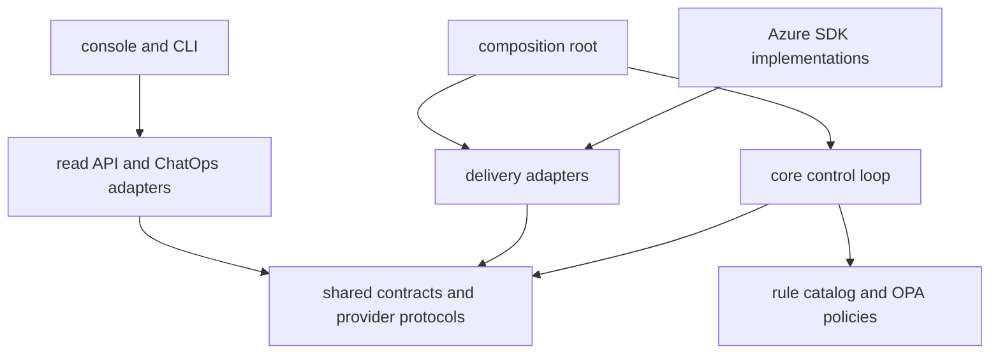

# FDAI Architecture

FDAI uses an agent-driven architecture: independently runnable agents own
bounded responsibilities and coordinate through schema-validated events. It is
a headless, event-driven control plane with a thin read-only console,
pull-request-native delivery, and ChatOps approval. The architecture separates
the components that observe, decide, approve, execute, and audit so no single
surface can silently turn a suggestion into a privileged change.

A fixed organization of 15 agents makes those responsibilities explicit. The
agents own typed objects and lifecycle roles inside the control plane; they do
not replace the control loop or bypass its deterministic safety gates.

> Azure is the implemented target. Cloud access stays behind provider contracts
> so the core does not import Azure SDKs or depend on one hosting product.

## Design at a glance

Five loosely coupled layers communicate through typed events, versioned
contracts, and Git rather than sharing one application process or identity.

<fdai-architecture-diagram manifest="../diagrams/generated/fdai-system-overview.manifest.json" locale="en" style="display:block">
  
</fdai-architecture-diagram>

The console reads projections from the state and audit stores. It does not
share the executor identity, approve changes, or call Azure mutation APIs.

## The five architecture layers

| Layer | Responsibility | Primary boundary |
|-------|----------------|------------------|
| Headless control plane | Normalize events, select a trust tier, verify proposals, classify risk, and coordinate execution | No UI logic and no direct cloud SDK imports |
| Action delivery | Render approved actions as fix pull requests or registered provider calls | Every action keeps its typed safety contract and rollback reference |
| Operator console | Show state, evidence, audit history, shadow results, and pending approvals | Read-only identity with no execution permission |
| Human channel | Deliver approval requests and operational alerts through ChatOps | Approval principal stays distinct from the executor |
| Rule catalog | Version rules, policies, action types, prompts, and promotion evidence as code | Catalog changes pass review, regression, and shadow evaluation |

These layers can fail or scale independently. A console outage does not stop
event processing, and a ChatOps outage queues high-risk work rather than
allowing it to execute without approval.

## How one event moves through the system

Every event follows the same control loop, whether it comes from an Azure
resource change, an SLO burn detector, a scheduled job, or an operator request.



1. **Ingest and correlate**: FDAI validates the event schema, deduplicates by a
   stable idempotency key, and groups related signals into an incident.
2. **Choose the lowest competent tier**: T0 uses deterministic rules, T1 reuses
   evidence-backed incident patterns, and T2 handles only novel or ambiguous
   cases.
3. **Verify before risk classification**: T2 proposals pass mixed-model
   agreement, evidence check, schema, policy, security, and what-if checks.
4. **Apply the autonomy ceiling**: The safety check combines action risk, scope,
   system health, and policy. It returns auto, approval required, or deny.
5. **Execute once and record every path**: The executor takes a per-resource
   lock, applies an idempotent action, and writes the result. Reject, timeout,
   hold, rollback, and no-op outcomes are audited too.

Read [Deterministic first](concepts/deterministic-first.md) for the tier
boundaries and [Trust tiers](concepts/risk-tiers.md) for the autonomy decision.

## The agent organization inside the control plane

FDAI's 15 named agents are an **organizational ownership layer over the control
loop**. They are not 15 independent Azure services, and they are not a group of
chatbots making free-form decisions. Each agent is a first-class runtime object
with one mandate, owned object types, declared topic subscriptions, and bounded
permissions.

Physically, the agents run inside the modular Python control-plane process and
communicate through an injected event bus. Logically, their ownership boundaries
remain strict even when they share one runtime. Moving them into separate
processes later would not change the typed topics or authority model.

### How the 15 roles fit together

| Architecture function | Agents | Ownership in the control loop |
|-----------------------|--------|-------------------------------|
| Sense and observe | Huginn, Heimdall | Huginn owns normalized events and real-time resource discovery ingress. Heimdall owns anomaly, drift, and forecast detected issues. |
| Judge and arbitrate | Forseti, Odin | Forseti issues decisions. Odin resolves cross-vertical conflicts before Forseti finalizes a decision. |
| Execute, approve, recover, and explain | Thor, Var, Vidar, Bragi | Thor is the sole privileged executor. Var carries human approval. Vidar owns rollback. Bragi translates operator conversations. |
| Govern evidence and knowledge | Saga, Mimir, Norns, Muninn | Saga owns append-only audit. Mimir owns rules. Norns proposes inert learning candidates. Muninn owns state snapshots and context indexes. |
| Supply domain evidence | Njord, Freyr, Loki | Cost, capacity, and chaos specialists advise judgment. They never execute. |

The pantheon is fixed upstream so a fork cannot collapse incompatible roles or
rename an authority boundary. A fork can bind providers, configure thresholds,
disable optional agents, and add catalog entries, but Saga and Vidar are hard
dependencies and cannot be disabled.

### Runtime data flow

The organization chart describes reporting lines. The diagram below describes
the authoritative data flow between agent-owned object types.



The Mermaid view keeps topic ownership easy to scan. The generated architecture
view below uses the same topology to show the runtime invariant: agents run as
independent subscribers, work can fan out concurrently, and only the owning
agent publishes each authoritative object. Gateways and workers relay events;
they do not become hidden decision makers.

#### Generated agent-driven architecture

<fdai-architecture-diagram manifest="../diagrams/generated/fdai-agent-driven-runtime.manifest.json" locale="en" style="display:block">
  
</fdai-architecture-diagram>

This flow preserves a simple rule: information may fan out to many readers,
but each authoritative object type has one writer. For example, several agents
can consume a decision, but only Forseti can publish `object.verdict`. The
publish-side registry checks ownership, and the event-bus bridge dead-letters a
record whose declared producer principal conflicts with the topic owner.
Missing principals are surfaced separately for boundary hardening. A topic name
alone is not authority.

### Single-writer topic ownership

Single-writer ownership makes an agent role enforceable rather than descriptive.

| Object or topic | Single writer | Architectural effect |
|-----------------|---------------|----------------------|
| `Event` / `object.event` | Huginn | Cloud adapters cannot impersonate normalized control-plane ingress. |
| `Verdict` / `object.verdict` | Forseti | Specialists and models can advise but cannot grant execution eligibility. |
| `ArbitrationDecision` | Odin | Cross-vertical trade-offs have one deterministic tie-break authority. |
| `ActionRun` / `object.action-run` | Thor | Only the executor can claim and report a mutation attempt. |
| `Approval` / `object.approval` | Var | An approval cannot be fabricated by the executor. |
| `Rollback` / `object.rollback` | Vidar | Recovery remains a distinct, testable path. |
| `AuditEntry` / `object.audit-entry` | Saga | Terminal evidence has one append-only authority. |
| `RuleCandidate` / `object.rule-candidate` | Norns | Learning proposes inert data and cannot edit the catalog directly. |
| `Rule` and `Policy` | Mimir | Promotion and revocation remain governed catalog operations. |

Agent modules do not import one another to call handlers directly. They publish
owned objects and subscribe to declared topics, which keeps runtime wiring
consistent with the authority table.

### ActionType role binding

Every registered `ActionType` binds the lifecycle to named principals:

```text
initiator -> Forseti (judge) -> Thor (executor) -> Var (approver when required)
                                            -> Saga (auditor on every terminal path)
                                            -> Vidar (compensation when required)
```

The initiator can vary by action, but the judge, executor, approver, and auditor
boundaries are fixed upstream. The binding also carries the rollback contract,
irreversibility flag, and compensating action. This prevents a downstream fork
from making a domain specialist self-approve or replacing the auditor with the
component that executed the change.

### Two ports, one authority path

Every agent exposes two separate ports:

- **Typed pub/sub port**: The authoritative machine path. It uses registered
  topics, schema-checked payloads, producer-principal verification, and the
  deterministic-first control loop.
- **Conversational port**: A bounded natural-language path for operator questions
  and agent-to-agent introspection. Bragi routes the question and renders the
  answer, but does not judge or execute.

The two ports share only the correlation trace. If an operator asks Bragi to
perform an action, Bragi creates a typed proposal and sends it through Huginn so
it re-enters validation, judgment, risk, approval, execution, and audit. A
conversation can explain authority, but it cannot become authority.

### Runtime placement and promotion

The current runtime wires the pantheon as a measurable shadow overlay beside
the established control-loop consumer:

> **Current implementation status:** The pantheon is opt-in and shadow by
> default. Named ownership describes the fixed authority contract; it does not
> mean every agent has been promoted for live mutation. Enforcement mode remains
> blocked until all durable safety bindings are present.

- **Shared ingress, distinct consumers**: Both paths consume the same raw Kafka
  topic through separate consumer groups, so the pantheon does not steal events.
- **Shadow by default**: Thor records what the agents would do but cannot mutate,
  which prevents duplicate execution while parity is measured.
- **Explicit enforce promotion**: Enforce startup requires a live Thor executor,
  durable ActionRun storage, a durable Saga audit chain, and registered Vidar
  rollback executors. Missing any binding blocks startup.
- **Failure isolation**: The pantheon task is monitored separately from the
  established consumer. A shadow-runtime failure is surfaced without terminating
  the primary event consumer.

This placement lets FDAI compare stage-level and agent-owned outcomes before
moving execution authority. It also keeps the logical architecture stable while
the implementation is promoted incrementally.

## Trust and authority boundaries

FDAI treats separation of authority as an architecture property, not a user
interface convention.

| Boundary | Why it exists | Enforced behavior |
|----------|---------------|-------------------|
| Judgment vs execution | A component that proposes or judges a change should not apply it | Forseti judges; Thor executes the accepted typed action |
| Approval vs execution | A privileged executor cannot approve its own work | Var carries approval through a separately authorized channel |
| Console vs control plane | A browser session should not hold mutation permission | The console reads projections and evidence only |
| Model proposal vs eligibility | Plausible model output is not execution evidence | Deterministic verification decides whether a T2 proposal can proceed |
| Shadow vs enforce | New capability should prove behavior before mutation | New actions observe and audit first; enforcement is promoted separately |
| Replay vs re-execution | Investigation should not repeat a production mutation | Audit replay reconstructs judgment without running the action again |

The [agent organization](concepts/agents-and-self-healing.md) assigns these
roles to named agents, but agents do not bypass the typed control loop. A
conversational request must re-enter the same event, verification, risk, and
audit path as any other request.

## Code and data boundaries

The repository follows the same dependency direction as the runtime system.



- **`core/`** contains decision and coordination logic. It depends on shared
  contracts, not Azure SDKs or UI components.
- **`shared/`** defines versioned event, action, rule, workflow, and provider
  contracts. It does not import the core.
- **`delivery/`** implements persistence, Azure access, GitOps, notifications,
  ChatOps, and read APIs behind those contracts.
- **`rule-catalog/` and `policies/`** hold governed data. Adding a rule or
  action type does not require rewriting the control loop.
- **The composition root** selects concrete providers from validated
  configuration and injects them at startup.

For the complete dependency map, read [Project
Structure](../roadmap/architecture/project-structure.md).

## Azure implementation

The first implementation maps portable contracts to a minimum Azure resource
set. Provider-specific calls remain in adapters.

| Portable concern | Contract | Azure implementation |
|------------------|----------|----------------------|
| Event stream | Kafka wire protocol | Event Hubs through its Kafka endpoint |
| Core runtime | OCI image and portable manifest | Azure Container Apps |
| Scheduled work | Job or cron contract | Container Apps Jobs |
| State, audit, and T1 vectors | PostgreSQL and pgvector | Azure Database for PostgreSQL Flexible Server |
| Secrets | Environment or mounted secret | Key Vault reference injected by Container Apps |
| Workload identity | OIDC token | User-assigned Managed Identity |
| Inventory | Resource graph contract | Azure Resource Graph plus activity deltas |
| Observability | OpenTelemetry-compatible signals | Log Analytics and Application Insights |
| Console | Static read-only application | Azure Static Web Apps |
| human approval | Typed approval message | Teams bot and Adaptive Cards |

The continuously running core currently keeps one replica until a
credential-free Kafka-lag scaler is verified. Scheduled jobs and static
surfaces can scale to zero. See [CSP-neutrality
contracts](../roadmap/architecture/csp-neutrality.md) for the complete provider
surface.

## Safety built into every action

An action is incomplete unless its type declares four controls:

- **Stop condition**: the measurable signal that halts execution.
- **Rollback path**: the tested way to restore or move state forward safely.
- **Impact scope limit**: the maximum scope, batch, concurrency, or rate the
  action can affect.
- **Audit record**: the evidence needed to reconstruct the event, decision,
  authority, execution, and outcome.

Execution also requires policy and what-if checks, a per-resource lock, and an
idempotency key. When a required dependency such as the audit store is
unavailable, the system lowers autonomy to shadow or holds for review instead
of failing open.

## Example: configuration drift

Consider a resource change that opens network access beyond policy:

1. Azure emits a resource-change event through the Kafka-compatible event bus.
2. Event ingest normalizes the payload, attaches inventory context, and finds
   the resource's correlation key.
3. T0 matches a versioned network policy and proposes a typed fix.
4. What-if confirms the intended diff, while the safety check detects that the
   scope requires approval.
5. ChatOps sends an approval card containing the rule, evidence, scope, stop
   condition, and rollback reference.
6. After approval, the executor opens a fix pull request rather than
   mutating the resource from the console.
7. Delivery, approval, and terminal outcome are linked in the append-only audit
   trail and appear in the console as read-only evidence.

The same path handles a denial, rejection, timeout, or rollback. Only the
terminal branch changes.

## Failure isolation

| Failure | System response |
|---------|-----------------|
| Console unavailable | Core processing, Git delivery, and ChatOps continue |
| ChatOps unavailable | Approval-required actions queue; they do not auto-execute |
| Event backlog grows | Backpressure bounds concurrency and retains work for retry or dead-letter handling |
| Audit or critical provider unavailable | Autonomy is capped to shadow or the action is held |
| Duplicate delivery | Idempotency and resource locks prevent duplicate mutation |
| T2 models disagree | The competing evidence is preserved and the case moves to human review |
| Rollback verification fails | The incident remains open and recovery escalates through the typed pipeline |
| Forseti unavailable | No new agent decision is issued; work remains held for review |
| Thor unavailable | Detection, judgment, and audit can continue, but no mutation runs |
| Var unavailable | Approval-required work remains queued and timeout becomes an audited no-op |
| Saga or Vidar unavailable | Enforce startup or mutation is blocked because audit and rollback are hard dependencies |
| Shadow pantheon task fails | The failure is logged without terminating the established primary consumer |

## Next steps

| To learn about | Read |
|----------------|------|
| How tiers choose a decision method | [Deterministic first](concepts/deterministic-first.md) |
| How actions become auto, approval required, or deny | [Trust tiers](concepts/risk-tiers.md) |
| How typed actions and workflows fit the loop | [Ontology-driven automation](concepts/ontology-driven-automation.md) |
| How the named agents divide responsibility | [Agents and self-healing](concepts/agents-and-self-healing.md) |
| How Azure resources are prepared safely | [Deployment preflight](../roadmap/deployment/deployment-preflight.md) |
| How operators respond to incidents | [SRE runbooks](../runbooks/README.md) |
