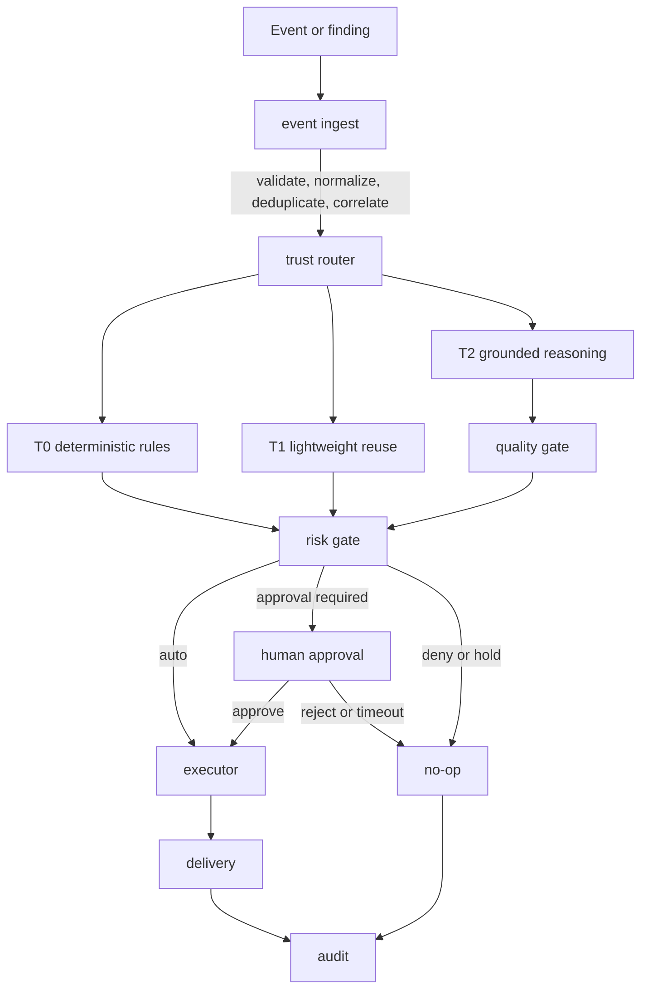
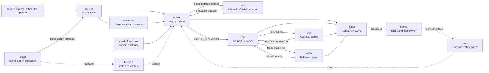
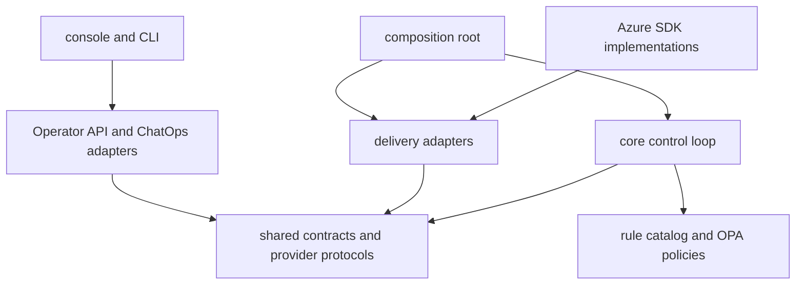

# FDAI Architecture

FDAI is built from independent agents. Each agent owns one job and talks to the
others only through schema-checked events, so the parts that observe, decide,
approve, execute, and audit never collapse into a single component. The control
plane runs headless, the console stays read-only, fixes arrive as pull requests,
and approvals happen in chat.

A fixed organization of 15 agents makes those responsibilities explicit. Each
agent owns typed objects and a lifecycle role inside the control plane. Agents
add ownership on top of the control loop. They never replace it and never skip
its deterministic safety checks.

> Azure is the implemented target. Every cloud call goes through a provider
> contract, so the core never imports an Azure SDK and you can move to another
> host without rewriting decision logic.

## Design at a glance

FDAI has five loosely coupled layers. They share typed events, versioned
contracts, and Git. They do not share one process or one identity.

<fdai-architecture-diagram manifest="../diagrams/generated/fdai-system-overview.manifest.json" locale="en" style="display:block">
  
</fdai-architecture-diagram>

The console reads projections from the state and audit stores. It does not use
the executor identity, it cannot approve a change, and it never calls an Azure
API that changes anything.

## Azure deployment topology

Use the deployment view to trace the production private-network baseline rather
than the logical control-loop responsibilities. Numbered connectors follow the
primary signal, decision, evidence, approval, and delivery paths. Nested
boundaries show the Azure region, virtual network, and delegated subnets.

<fdai-architecture-diagram manifest="../diagrams/generated/fdai-azure-deployment-topology.manifest.json" locale="en" style="display:block">
  
</fdai-architecture-diagram>

The diagram maps the parameterized Terraform deployment, not one tenant's
resource names. Azure OpenAI and some private endpoints remain optional. Human
App Roles and the privileged executor managed identity stay separate in every
profile.

## Azure resource network flow

Use this view to trace current and target-state connections at the Azure resource
level. It separates the private Application Gateway, Container Apps infrastructure,
and private endpoint subnets, then maps each private endpoint to its managed service
backend.
The diagram shows the FDAI Web Console path. The FDAI CLI uses the same
Operator API but is omitted from this view for clarity.

<fdai-architecture-diagram manifest="../diagrams/generated/fdai-azure-resource-network-flow.manifest.json" locale="en" style="display:block">
  
</fdai-architecture-diagram>

The baseline portion shows the default private-networking profile, where
`enable_private_postgres=false` adds a `postgresqlServer` private endpoint.
Setting `enable_private_postgres=true` replaces that path with PostgreSQL
Flexible Server in its delegated subnet and doesn't create the endpoint.
The optional document-ingestion path shows its Ingestion Gateway, Blob and DFS
private endpoints, and ADLS Gen2 account. Case-history storage is enabled by
default but isn't drawn yet. The development operations gateway and APIM remain
in their feature-specific profiles.

The same view overlays the intended gateway, model platform, observability, and
delivery-provider topology. Status remains in this document rather than on the
diagram so product and network labels stay stable.

| Target-state element | Terraform status | Documentation decision |
|----------------------|------------------|------------------------|
| Private Application Gateway subnet with Application Gateway and WAF policy | Not provisioned | Keep in the diagram as planned topology; add its Terraform profile before treating the path as deployable |
| Microsoft Foundry account, project, and private endpoint | Opt-in feature profile | Keep in the diagram; availability depends on LLM and web-search settings |
| Azure Managed Grafana | Not provisioned | Keep in the diagram as planned observability topology |
| Email, Teams, and Slack approval channels | Email is opt-in; Teams and Slack are deployment adapters | Keep as provider choices; each deployment selects credentials, callback identity, and fallback policy |
| GitHub, GitLab, and Azure DevOps delivery providers | Deployment adapters | Keep as provider choices; each deployment selects the Git host and review bindings |

The diagram does not need every Terraform resource as a separate node. Use the
following inclusion rule: draw a resource when it changes a network boundary,
creates a distinct data path, or is a user-visible delivery endpoint. Group or
document resources that only support those paths.

| Terraform resource or resource group | Diagram treatment | Reason |
|--------------------------------------|-------------------|--------|
| Operational Event Hubs namespace and its private endpoint | Add in the next diagram revision | It is an always-on second namespace with a distinct Kafka and private-link path |
| Case-history Blob account and its private endpoint | Add in the next diagram revision | It is enabled by default and carries a distinct replay and case-artifact path |
| Container Apps environment | Keep aggregated | The Container Apps subnet boundary and app/job nodes already communicate its hosting role |
| Private DNS zones and VNet links | Keep implicit in private-endpoint paths | Drawing each zone and link would duplicate every private endpoint without changing the workload flow |
| Action group, metric alerts, and diagnostic settings | Keep aggregated under App Insights and Logs | These resources implement observability routing rather than a separate workload data path |
| Event Grid realtime inventory topic | Exclude from this private profile | Terraform enables it only when private networking is disabled |

This means no immediate expansion is required. The next diagram update should
add only the operational Event Hubs and case-history paths; the other omissions
remain intentional abstractions.

Azure Resource Graph reads and observability writes are shown outside the
private data-plane path because they use Azure control-plane and telemetry
contracts. The day-zero Terraform baseline still doesn't add an Application
Gateway, WAF, Managed Grafana, or load balancer.

## The five architecture layers

| Layer | Responsibility | Primary boundary |
|-------|----------------|------------------|
| Headless control plane | Normalize events, pick a trust tier, verify proposals, classify risk, and coordinate execution | No UI logic and no direct cloud SDK imports |
| Action delivery | Turn approved actions into fix pull requests or registered provider calls | Every action keeps its typed safety contract and rollback reference |
| Operator console | Show state, evidence, audit history, observation-mode results, and pending approvals | Read-only identity with no permission to execute |
| Human channel | Deliver approval requests and operational alerts through ChatOps | The approver is never the executor |
| Rule catalog | Keep rules, policies, action types, prompts, and promotion evidence versioned as code | Catalog changes go through review, regression tests, and observation-mode evaluation |

These layers fail and scale independently. If the console goes down, event
processing keeps running. If ChatOps goes down, high-risk work waits in a queue
instead of executing without approval.

## How one event moves through the system

Every event takes the same path, whether it comes from an Azure resource change,
an SLO burn detector, a scheduled job, or an operator request.


```mermaid
flowchart TD
  E[Event or finding] --> I[event ingest]
  I -->|validate, normalize, deduplicate, correlate| R[trust router]
  R --> T0[T0 deterministic rules]
  R --> T1[T1 lightweight reuse]
  R --> T2[T2 grounded reasoning]
  T2 --> Q[quality gate]
  T0 --> G[risk gate]
  T1 --> G
  Q --> G
  G -->|auto| X[executor]
  G -->|approval required| H[human approval]
  G -->|deny or hold| N[no-op]
  H -->|approve| X
  H -->|reject or timeout| N
  X --> D[delivery]
  D --> A[audit]
  N --> A
```

1. **Ingest and correlate**: FDAI checks the event schema, drops repeats using a
   stable idempotency key (a key that makes a retry safe), and groups related
   signals into one incident.
2. **Pick the lowest tier that can decide**: T0 (deterministic rules) handles the
   repeatable majority, T1 (lightweight reuse of similar past incidents) handles
   known patterns, and T2 (grounded LLM reasoning) handles only the new or
   ambiguous cases.
3. **Verify before you classify risk**: a T2 proposal has to pass mixed-model
   agreement, an evidence check, and schema, policy, security, and what-if
   checks. A plausible answer is not enough.
4. **Apply the autonomy ceiling**: the safety check weighs action risk, impact
   scope, system health, and policy. It answers auto, approval required, or deny.
5. **Execute once, record every path**: the executor takes a per-resource lock,
   applies an action that is safe to retry, and writes the result. Rejections,
   timeouts, holds, rollbacks, and no-ops are audited the same way.

Read [Deterministic first](concepts/deterministic-first.md) for the tier
boundaries and [Trust tiers](concepts/risk-tiers.md) for the autonomy decision.

## The agent organization inside the control plane

FDAI's 15 named agents are an **ownership layer over the control loop**. They
are not 15 separate Azure services, and they are not chatbots making free-form
decisions. Each agent is a runtime object with one mandate, a set of object
types it owns, the topics it subscribes to, and bounded permissions.

All agents run inside the same Python control-plane process and talk through an
injected event bus. Sharing a process does not soften the boundaries: an agent
still publishes only what it owns. If you later split them into separate
processes, the topics and the authority model stay the same.

### How the 15 roles fit together

| Architecture function | Agents | Ownership in the control loop |
|-----------------------|--------|-------------------------------|
| Sense and observe | Huginn, Heimdall | Huginn owns normalized events and real-time resource discovery ingress. Heimdall owns anomaly, drift, and forecast detected issues. |
| Judge and arbitrate | Forseti, Odin | Forseti issues decisions. Odin resolves cross-vertical conflicts before Forseti finalizes a decision. |
| Execute, approve, recover, and explain | Thor, Var, Vidar, Bragi | Thor is the sole privileged executor. Var carries human approval. Vidar owns rollback. Bragi translates operator conversations. |
| Govern evidence and knowledge | Saga, Mimir, Norns, Muninn | Saga owns append-only audit. Mimir owns rules. Norns proposes inert learning candidates. Muninn owns state snapshots and context indexes. |
| Supply domain evidence | Njord, Freyr, Loki | Cost, capacity, and chaos specialists advise judgment. They never execute. |

The 15 roles are fixed upstream, so a fork cannot merge two conflicting roles or
rename an authority boundary. A fork can bind providers, tune thresholds, turn
off optional agents, and add catalog entries. Saga and Vidar are hard
dependencies, so you cannot turn off audit or rollback.

### Runtime data flow

The table above is the organization chart. The diagram below is the data flow:
which agent-owned object moves where.


```mermaid
flowchart LR
  EXT[Azure adapters, schedules, operator]
  HUG[Huginn<br/>Event owner]
  HEI[Heimdall<br/>Anomaly, Drift, Forecast]
  DOM[Njord, Freyr, Loki<br/>domain evidence]
  FOR[Forseti<br/>Verdict owner]
  ODI[Odin<br/>ArbitrationDecision owner]
  THO[Thor<br/>ActionRun owner]
  VAR[Var<br/>Approval owner]
  VID[Vidar<br/>Rollback owner]
  SAG[Saga<br/>AuditEntry owner]
  NOR[Norns<br/>RuleCandidate owner]
  MIM[Mimir<br/>Rule and Policy owner]
  MUN[Muninn<br/>state and context]
  BRA[Bragi<br/>conversation translator]

  EXT --> HUG
  HUG --> HEI
  HUG --> FOR
  HEI --> FOR
  DOM --> FOR
  MIM -. rules .-> FOR
  MUN -. context .-> FOR
  FOR -->|cross-domain conflict| ODI
  ODI -->|arbitration decision| FOR
  FOR -->|auto, hil, deny verdict| THO
  THO -->|hil pending| VAR
  VAR -->|approved or rejected| THO
  THO -->|failed action run| VID
  VID -->|rollback result| THO
  FOR --> SAG
  THO --> SAG
  VAR --> SAG
  VID --> SAG
  SAG -. outcomes .-> NOR
  NOR -. inert candidate .-> MIM
  BRA -. question .-> MUN
  BRA -->|typed action proposal| HUG
```

The Mermaid view above makes topic ownership easy to scan. The detailed view
below shows the same topology at runtime: agents subscribe independently, work
can fan out in parallel, and only the owning agent publishes each authoritative
object. Gateways and workers relay events. They never become hidden decision
makers.

#### Agent-driven runtime

<fdai-architecture-diagram manifest="../diagrams/generated/fdai-agent-driven-runtime.manifest.json" locale="en" style="display:block">
  
</fdai-architecture-diagram>

The flow follows one simple rule: information can fan out to many readers, but
each authoritative object type has exactly one writer. Many agents can read a
decision, for example, and only Forseti can publish `object.verdict`. The
publish-side registry checks that ownership. If a record declares a producer
that does not match the topic owner, the event-bus bridge sends it to the dead
letter queue. Records with no declared producer are reported separately so the
boundary can be tightened. Knowing a topic name is not the same as holding
authority over it.

### Single-writer topic ownership

Single-writer ownership turns an agent role into something the runtime can
enforce, not just something the docs describe.

| Object or topic | Single writer | Architectural effect |
|-----------------|---------------|----------------------|
| `Event` / `object.event` | Huginn | A cloud adapter cannot pretend to be normalized control-plane ingress. |
| `Verdict` / `object.verdict` | Forseti | Specialists and models can advise, but they cannot make an action eligible to run. |
| `ArbitrationDecision` | Odin | Cross-vertical trade-offs have one deterministic tie-breaker. |
| `ActionRun` / `object.action-run` | Thor | Only the executor can claim an attempted change and report how it ended. |
| `Approval` / `object.approval` | Var | The executor cannot fabricate its own approval. |
| `Rollback` / `object.rollback` | Vidar | Recovery stays a separate path you can test on its own. |
| `AuditEntry` / `object.audit-entry` | Saga | Final evidence has one append-only owner. |
| `RuleCandidate` / `object.rule-candidate` | Norns | Learning proposes inactive data and cannot edit the catalog directly. |
| `Rule` and `Policy` | Mimir | Turning a rule on or off stays a governed catalog operation. |

Agent modules never import one another to call a handler directly. They publish
the objects they own and subscribe to the topics they declared, so the runtime
wiring always matches the table above.

### ActionType role binding

Every registered `ActionType` ties the action lifecycle to named agents:

```text
initiator -> Forseti (judge) -> Thor (executor) -> Var (approver when required)
                                            -> Saga (auditor on every terminal path)
                                            -> Vidar (compensation when required)
```

The initiator changes from action to action. The judge, executor, approver, and
auditor roles are fixed upstream. The binding also carries the rollback
contract, the irreversibility flag, and the compensating action. That is what
stops a fork from letting a domain specialist approve its own work, or from
naming the component that made the change as its own auditor.

### Two ports, one authority path

Every agent exposes two ports:

- **Typed pub/sub port**: the authoritative machine path. It uses registered
  topics, schema-checked payloads, producer verification, and the
  deterministic-first control loop.
- **Conversational port**: a bounded natural-language path for operator
  questions and agent-to-agent lookups. Bragi routes the question and writes the
  answer. Bragi never judges and never executes.

The two ports share only the correlation trace. If you ask Bragi to perform an
action, Bragi builds a typed proposal and sends it through Huginn, so the
request goes through validation, judgment, risk, approval, execution, and audit
like any other event. A conversation can explain authority. It cannot become
authority.

### Runtime placement and promotion

The runtime starts the agent organization beside the established control-loop
consumer and measures the two against each other.

> **Current implementation status:** The agents start with the control plane and
> run in observation mode, where they judge and log but apply no changes. Named
> ownership describes the authority contract. It does not mean every agent is
> cleared to make live changes. Enforcement mode stays blocked until every
> durable safety binding is in place.

- **Shared ingress, separate consumers**: both paths read the same Kafka topic
  under different consumer groups, so the agents observe events instead of
  taking them away from the established loop.
- **Observation mode by default**: Thor records what the agents would have done
  but cannot change anything, so nothing executes twice while you compare the
  two paths. Set `FDAI_START_PANTHEON=0` only when you need to stop the agent
  runtime for maintenance.
- **Enforcement is a separate promotion**: starting in enforcement mode requires
  a live Thor executor, durable action-run storage, a durable Saga audit chain,
  registered Vidar rollback executors, and a deployment-level authority ceiling
  in the startup readiness report. If any one is missing, startup stops.
- **Failure isolation**: the agent runtime is watched separately. If it fails,
  the failure is reported and the established event consumer keeps running.

This layout lets you compare stage-level and agent-owned outcomes before you
move execution authority. The architecture stays stable while the
implementation is promoted step by step.

## Trust and authority boundaries

In FDAI, separation of authority is an architecture property. It is not a user
interface convention that a later change can quietly undo.

| Boundary | Why it exists | Enforced behavior |
|----------|---------------|-------------------|
| Judgment vs execution | Whoever proposes or judges a change should not apply it | Forseti judges, and Thor executes the accepted typed action |
| Approval vs execution | A privileged executor cannot approve its own work | Var carries approval through a separately authorized channel |
| Console vs control plane | A browser session should not hold permission to change anything | The console reads projections and evidence only |
| Model proposal vs eligibility | A plausible model answer is not evidence | Deterministic verification decides whether a T2 proposal may proceed |
| Observation vs enforcement | A new capability should prove itself before it changes anything | New actions observe and audit first, and enforcement is promoted separately |
| Replay vs re-execution | Investigating an incident should not repeat a production change | Audit replay rebuilds the judgment without running the action again |

The [agent organization](concepts/agents-and-self-healing.md) assigns these
roles to named agents, and no agent may skip the typed control loop. A request
that arrives through a conversation re-enters the same event, verification,
risk, and audit path as any other request.

## Code and data boundaries

The repository follows the same dependency direction as the runtime system.


```mermaid
flowchart TB
  UI[console and CLI] --> API[Operator API and ChatOps adapters]
  API --> CONTRACTS[shared contracts and provider protocols]
  DELIVERY[delivery adapters] --> CONTRACTS
  CORE[core control loop] --> CONTRACTS
  CORE --> CATALOG[rule catalog and OPA policies]
  COMPOSE[composition root] --> CORE
  COMPOSE --> DELIVERY
  AZURE[Azure SDK implementations] --> DELIVERY
```

- **`core/`** holds decision and coordination logic. It depends on shared
  contracts, never on Azure SDKs or UI components.
- **`shared/`** defines versioned event, action, rule, workflow, and provider
  contracts. It never imports the core.
- **`delivery/`** implements persistence, Azure access, GitOps, notifications,
  ChatOps, and Operator APIs behind those contracts.
- **`rule-catalog/` and `policies/`** hold governed data. You can add a rule or
  an action type without rewriting the control loop.
- **The composition root** reads validated configuration, picks the concrete
  providers, and injects them at startup.

For the complete dependency map, read [Project
Structure](../roadmap/architecture/project-structure.md).

## Azure implementation

The first implementation maps each portable contract to a small Azure resource
set. Provider-specific calls stay inside adapters, so swapping a resource does
not touch decision logic.

| Portable concern | Contract | Azure implementation |
|------------------|----------|----------------------|
| Event stream | Kafka wire protocol | Event Hubs through its Kafka endpoint |
| Core runtime | OCI image and portable manifest | Azure Container Apps |
| Scheduled work | Job or cron contract | Container Apps Jobs |
| State, audit, and T1 vectors | PostgreSQL and pgvector | Azure Database for PostgreSQL Flexible Server |
| Secrets | Environment or mounted secret | Key Vault reference injected by Container Apps |
| Workload identity | OIDC token | User-assigned Managed Identity |
| Inventory | Resource graph contract | Azure Resource Graph plus activity deltas |
| Observability | OpenTelemetry-compatible signals | Log Analytics and Application Insights |
| Console | Static read-only application | Azure Static Web Apps |
| Console Operator API | HTTP read contract | Container App with its own read-only identity |
| Document ingestion | Upload and chunking contract | Container App plus Data Lake Storage |
| Human approval | Typed approval message | Teams bot and Adaptive Cards |

The core runs continuously with a floor of one replica and a ceiling of three.
The floor stays at one because scale-to-zero needs a credential-free Kafka-lag
scale rule, and without that rule an incoming event would never wake the app.
Scheduled jobs and static surfaces can still scale to zero. For the full
provider surface, read [CSP-neutrality
contracts](../roadmap/architecture/csp-neutrality.md).

## Safety built into every action

An action type is incomplete until it declares four controls:

- **Stop condition**: the measurable signal that halts execution.
- **Rollback path**: the tested way to restore the old state or move forward
  safely.
- **Impact scope limit**: the largest scope, batch size, concurrency, or rate
  the action may touch.
- **Audit record**: the evidence needed to reconstruct the event, the decision,
  who authorized it, what ran, and how it ended.

Execution also needs policy and what-if checks, a per-resource lock, and an
idempotency key. If a required dependency such as the audit store is
unavailable, FDAI drops autonomy to observation mode or holds the work for
review. It does not fail open.

## Example: configuration drift

Consider a resource change that opens network access wider than policy allows:

1. Azure emits a resource-change event onto the Kafka-compatible event bus.
2. Event ingest normalizes the payload, attaches inventory context, and finds
   the resource's correlation key.
3. T0 matches a versioned network rule and proposes a typed fix.
4. What-if confirms the exact diff. The safety check sees that the impact scope
   needs approval.
5. ChatOps sends an approval card with the rule, the evidence, the impact scope,
   the stop condition, and the rollback reference.
6. After approval, the executor opens a fix pull request instead of changing the
   resource from the console.
7. Delivery, approval, and the final outcome are linked in the append-only audit
   trail, and the console shows them as read-only evidence.

A denial, rejection, timeout, or rollback follows the same path. Only the last
step differs.

## Failure isolation

| Failure | System response |
|---------|-----------------|
| Console unavailable | Core processing, Git delivery, and ChatOps keep running |
| ChatOps unavailable | Work that needs approval waits in a queue and never auto-executes |
| Event backlog grows | Backpressure caps concurrency and keeps work for retry or dead-letter handling |
| Audit or critical provider unavailable | Autonomy drops to observation mode, or the action is held |
| Duplicate delivery | Idempotency keys and resource locks stop a second change |
| T2 models disagree | The competing evidence is kept and the case goes to human review |
| Rollback verification fails | The incident stays open and recovery escalates through the typed pipeline |
| Forseti unavailable | No new agent decision is issued, and work is held for review |
| Thor unavailable | Detection, judgment, and audit continue, but nothing changes |
| Var unavailable | Work that needs approval stays queued, and a timeout becomes an audited no-op |
| Saga or Vidar unavailable | Enforcement startup and changes are blocked, because audit and rollback are hard dependencies |
| Agent runtime fails | The failure is logged and the established primary consumer keeps running |

## Next steps

| To learn about | Read |
|----------------|------|
| How tiers choose a decision method | [Deterministic first](concepts/deterministic-first.md) |
| How actions become auto, approval required, or deny | [Trust tiers](concepts/risk-tiers.md) |
| How typed actions and workflows fit the loop | [Agent-driven automation](concepts/ontology-driven-automation.md) |
| How the named agents divide responsibility | [Agents and self-healing](concepts/agents-and-self-healing.md) |
| How Azure resources are prepared safely | [Deployment preflight](../roadmap/deployment/deployment-preflight.md) |
| How operators respond to incidents | [SRE runbooks](../runbooks/README.md) |
