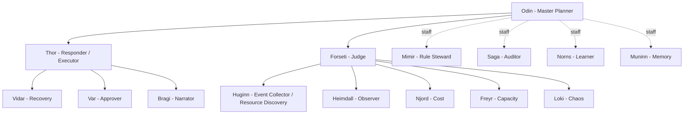
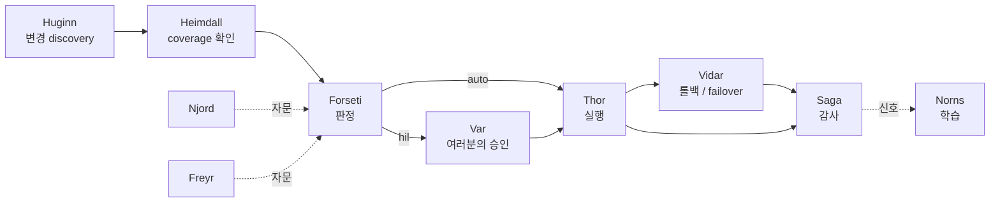

# 에이전트와 자가 치유(Agents and self-healing)

FDAI는 **이름 있는 15개 에이전트의 고정된 조직**으로 동작합니다. 각 에이전트는
하나의 임무를 맡고 객체 및 액션 타입 집합을 소유하며, 스키마 검증을 거친 이벤트
버스에서 통신합니다. 조직도가 곧 안전 모델입니다. 판단하는 에이전트는 실행하지 않고,
실행 에이전트는 승인 권한을 갖지 않습니다. 리소스에 드리프트나 장애가 발생하면
에이전트들이 협력해 해결합니다. 승격된 저위험 액션은 자율적으로 처리하고 고위험
액션은 여러분의 승인을 기다립니다. 자율 처리 비율은 측정할 목표이며 가정된 제품
성과가 아닙니다.

이 페이지는 에이전트가 누구인지, 어떻게 직무를 분리하는지, 여러분이 어떻게 승인-
거절 수준에서 운영하는지, 그리고 장애를 처음부터 끝까지 어떻게 자가 치유하는지를
설명합니다.

## 조직

판테온은 업스트림에서 한 번 정의되고 포크가 바꾸지 않습니다. Odin이 계획하고,
Forseti가 판단하고, Thor가 실행하며, 스태프 에이전트가 카탈로그와 메모리를
관장합니다.

| 에이전트 | 역할 | 한 줄 |
|----------|------|-------|
| Odin | Master Planner | 크로스 버티컬 충돌 중재; 최종 타이브레이커 |
| Forseti | Judge | 판정(auto / HIL / deny) 발행; 실행하지 않음 |
| Thor | Responder | 판정 디스패치; 유일한 특권 executor |
| Var | Approver | 사람의 HIL 승인 결정을 담당하며 Thor와 분리 |
| Vidar | Recovery | 롤백과 DR failover 소유 |
| Huginn | Event Collector / Resource Discovery | 실시간 resource-change ingress와 correlation 소유 |
| Heimdall | Observer | discovery freshness, coverage, drift, resource change 감시 |
| Njord / Freyr / Loki | 도메인 전문가 | 비용·용량·카오스 자문 - 실행하지 않음 |
| Mimir / Norns / Muninn | 거버넌스 스태프 | 규칙 관리·학습·메모리 |
| Saga | Auditor | append-only 감사 로그 기록 |
| Bragi | Narrator | 여러분의 질문을 파이프라인으로 오가며 번역 |

## 직무 분리

안전 보장은 누가 무엇을 *할 수 없는지*에서 나옵니다:

- **판단자와 실행자 분리.** Forseti가 결정하고 Thor가 실행합니다. 판단과 실행을
  동시에 하는 에이전트가 없으므로, 나쁜 판단이 스스로 승인하여 변경으로 갈 수
  없습니다.
- **승인은 별개의 주체.** Var가 여러분의 승인 결정을 담당합니다. Thor는 여러분을 대신해
  승인할 수 없습니다.
- **전문가의 자문 역할.** Njord, Freyr, Loki는 판단에 정보를 제공할
  뿐 executor에 직접 닿지 않습니다.
- **두 포트, 우회 없음.** 모든 에이전트는 타입 있는 pub/sub 포트(기계 트래픽)와
  대화형 포트(여러분의 질문)를 가집니다. 액션을 요청하는 대화형 요청은 반드시 타입
  있는 파이프라인으로 다시 진입해야 합니다 - narrator는 결코 직접 실행할 수 없습니다.

## 여러분은 승인과 거부 수준에서 운영

여러분은 에이전트를 작업 단위로 몰지 않습니다. 조직이 루프를 돌리고 여러분에게
결정을 가져옵니다:

- **승격된 저위험 액션은 자동 처리할 수 있습니다.** Stop-condition, 롤백 경로,
  blast-radius 제한, 감사 엔트리를 갖추며 새 액션은 증거 게이트를 통과할 때까지
  shadow에 머뭅니다.
- **고위험 액션은 여러분의 승인을 기다립니다.** HIL 카드가 이미 쓰는 채널(Teams 또는
  Slack)로 도착하고, 여러분은 승인하거나 거절합니다. 거절과 타임아웃은 no-op이며
  둘 다 감사 로그에 기록됩니다.
- Bragi를 통해 자연어로 **질문**할 수 있고("왜 failover 됐지?") executor의 특권
  아이덴티티를 갖지 않고도 근거가 제시된 답변을 얻습니다.

전체 워크스루: [../guides/approve-change-ko.md](../guides/approve-change-ko.md).

## 장애는 어떻게 자가 치유되는가

리소스가 저하되면 에이전트들은 모든 이벤트를 다루는 바로 그 파이프라인을 통해
협력합니다. 다음은 하나의 failover, 처음부터 끝까지입니다:

1. **감지.** Huginn이 resource change와 장애 signal을 실시간으로 수집하고, periodic Inventory
  job이 누락된 변경을 reconcile합니다. Heimdall은 freshness와 coverage를 확인한 뒤 alert storm
  대신 하나의 incident로 correlate합니다.
2. **판단.** Forseti가 인시던트를 점수화하고, 비용·용량 트레이드오프를 위해
   전문가에게 자문하며, 판정을 발행합니다: auto·HIL·deny.
3. **행동.** Thor가 디스패치합니다. 저위험 복구는 자율 실행되고, 고위험 failover는
  Var가 여러분의 승인 결정을 전달할 때까지 멈춥니다.
4. **복구.** Vidar가 액션의 stop-conditions와 blast-radius로 한정된 롤백 또는 DR
   failover를 소유합니다.
5. **기록과 학습.** Saga가 감사 엔트리를 쓰고 Norns가 반복 패턴을 비활성 카탈로그
  후보로 만듭니다. 후보는 승격 전에 출처, 검토, 회귀 테스트, shadow 증거를 갖춰야
  합니다.

전문가들이 같은 리소스에서 의견이 갈릴 때 - Njord는 비용을 위해 `scale_down`,
Freyr는 용량을 위해 `scale_up` - Odin이 Forseti가 확정하기 전에 중재하므로,
충돌하는 목표가 실행 단계로 동시에 전달되지 않습니다.

## 에이전트를 사용할 수 없는 경우

자가 치유에는 에이전트 조직 자체도 포함됩니다. 필수 역할을 사용할 수 없으면 자율성을
낮추며, 다른 에이전트가 호환되지 않는 권한을 대신 갖게 하지 않습니다.

| 사용할 수 없는 역할 | 안전한 성능 저하 방식 |
|----------------------|-----------------------|
| Forseti (판단자) | 새 판정을 발행하지 않고 HIL을 위해 보류 |
| Thor (실행자) | 판단과 감사는 계속할 수 있지만 변경 실행은 중지 |
| Var (승인자) | HIL 요청을 대기열에 유지하고 시간 초과는 감사되는 no-op으로 처리 |
| Vidar (복구) | 롤백이나 failover가 필요한 액션은 자동 실행 불가 |
| Saga (감사자) | 어떤 종료 경로도 감사 불변식을 충족할 수 없으므로 변경 실행 중지 |
| Odin (중재자) | 크로스 버티컬 충돌에서 승자를 선택하지 않고 HIL로 전달 |

에이전트는 장애가 발생한 동료를 조용히 가장하지 않습니다. 복구 시 선언된 역할을
되살리고 대기 중인 판단만 replay합니다. 대화나 오래된 전달 메시지에서 액션을 다시
실행하지 않습니다.

## 조직의 상태를 확인하는 방법

에이전트와 컨트롤 루프 결과를 함께 보는 상태 신호가 유용합니다:

- 이벤트 수집 지연, dead-letter 깊이, 상관 관계 처리 적체.
- 판정 지연, 다중 모델 불일치, HIL 만료 비율.
- 실행 성공률, stop-condition 발동, 롤백 비율.
- 감사 완전성과 종료 결과가 영구 레코드로 기록될 때까지 걸린 시간.
- 에이전트별 성능 저하 상태와 정상 자율성 상한 아래에서 머문 시간.

목표는 자동 실행을 최대화하는 것이 아닙니다. 건전한 조직은 이 신호가 악화될 때
자율성을 낮추고 그 이유를 운영자에게 보여 줍니다.

## 다음 단계

| 학습 대상 | 문서 |
|-----------|------|
| 모든 액션이 안전 계약을 물려받는 방식 | [ontology-driven-automation-ko.md](ontology-driven-automation-ko.md) |
| 판정이 auto vs HIL이 되는 방식 | [risk-tiers-ko.md](risk-tiers-ko.md) |
| 대기 중인 변경 승인 또는 거절 | [../guides/approve-change-ko.md](../guides/approve-change-ko.md) |
| 감사 로그로 결정 추적하기 | [../guides/read-audit-log-ko.md](../guides/read-audit-log-ko.md) |
| 전체 판테온 설계 | [../../roadmap/agents/agent-pantheon-ko.md](../../roadmap/agents/agent-pantheon-ko.md) |
