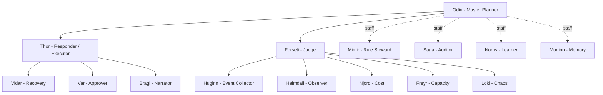
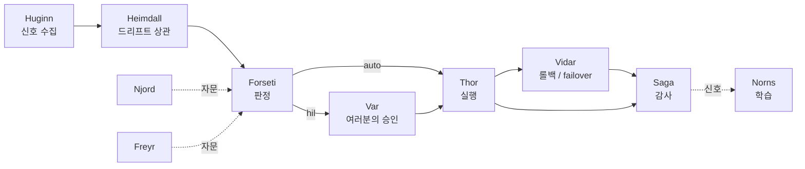

# 에이전트와 자가 치유(Agents and self-healing)

FDAI는 **이름 있는 15개 에이전트의 고정된 조직**으로 돌아갑니다. 각 에이전트는
하나의 mandate를 가지고, 객체·액션 타입 집합을 소유하며, schema-checked 이벤트
버스에서 통신합니다. 조직도가 곧 안전 모델입니다. 판단하는 에이전트는 결코 실행
에이전트가 아니고, 실행 에이전트는 결코 여러분의 승인을 쥐지 않습니다. 리소스가
드리프트되거나 장애가 생기면 에이전트들이 협력하여 해결합니다 - 안전한 다수는
자율적으로, 위험한 소수는 여러분의 승인으로.

이 페이지는 에이전트가 누구인지, 어떻게 직무를 분리하는지, 여러분이 어떻게 승인-
거절 수준에서 운영하는지, 그리고 장애를 처음부터 끝까지 어떻게 자가 치유하는지를
설명합니다.

## 조직

판테온은 상류에서 한 번 정의되고 포크가 바꾸지 않습니다. Odin이 계획하고,
Forseti가 판단하고, Thor가 실행하며, 스태프 에이전트가 카탈로그와 메모리를
관장합니다.

| 에이전트 | 역할 | 한 줄 |
|----------|------|-------|
| Odin | Master Planner | 크로스 버티컬 충돌 중재; 최종 타이브레이커 |
| Forseti | Judge | 판정(auto / HIL / deny) 발행; 실행하지 않음 |
| Thor | Responder | 판정 디스패치; 유일한 특권 executor |
| Var | Approver | 사람 HIL 승인 운반; Thor와 별개 |
| Vidar | Recovery | 롤백과 DR failover 소유 |
| Huginn | Event Collector | raw 이벤트 수집·상관 |
| Heimdall | Observer | 드리프트와 리소스 변경 감시 |
| Njord / Freyr / Loki | 도메인 전문가 | 비용·용량·카오스 자문 - 실행하지 않음 |
| Mimir / Norns / Muninn | 거버넌스 스태프 | 규칙 관리·학습·메모리 |
| Saga | Auditor | append-only 감사 로그 기록 |
| Bragi | Narrator | 여러분의 질문을 파이프라인으로 오가며 번역 |

## 직무 분리

안전 보장은 누가 무엇을 *할 수 없는지*에서 나옵니다:

- **판단자는 실행자가 아니다.** Forseti가 결정하고 Thor가 행동합니다. 판단과 실행을
  동시에 하는 에이전트가 없으므로, 나쁜 판단이 스스로 승인하여 변경으로 갈 수
  없습니다.
- **승인은 별개 principal.** Var가 여러분의 승인을 운반합니다. Thor는 여러분을 대신해
  승인할 수 없습니다.
- **전문가는 자문할 뿐 행동하지 않는다.** Njord·Freyr·Loki는 판단에 정보를 공급할
  뿐 executor에 직접 닿지 않습니다.
- **두 포트, 우회 없음.** 모든 에이전트는 타입 있는 pub/sub 포트(기계 트래픽)와
  대화형 포트(여러분의 질문)를 가집니다. 액션을 요청하는 대화형 요청은 반드시 타입
  있는 파이프라인으로 다시 진입해야 합니다 - narrator는 결코 직접 실행할 수 없습니다.

## 여러분은 승인-거절 수준에서 운영한다

여러분은 에이전트를 작업 단위로 몰지 않습니다. 조직이 루프를 돌리고 여러분에게
결정을 가져옵니다:

- **안전한 다수는 자동 해소**됩니다 - stop-condition·롤백 경로·blast-radius 제한·
  감사 엔트리와 함께, 사람 없이.
- **위험한 소수는 여러분을 위해 멈춥니다.** HIL 카드가 이미 쓰는 채널(Teams 또는
  Slack)로 도착하고, 여러분은 승인하거나 거절합니다. 거절과 타임아웃은 no-op이며
  둘 다 감사됩니다.
- Bragi를 통해 자연어로 **질문**할 수 있고("왜 failover 됐지?") executor의 특권
  아이덴티티를 쥐지 않고도 grounded 답변을 얻습니다.

전체 워크스루: [../guides/approve-change-ko.md](../guides/approve-change-ko.md).

## 장애는 어떻게 자가 치유되는가

리소스가 저하되면 에이전트들은 모든 이벤트를 다루는 바로 그 파이프라인을 통해
협력합니다. 다음은 하나의 failover, 처음부터 끝까지입니다:

1. **감지.** Huginn이 장애 신호를 수집하고, Heimdall이 알림 폭풍이 아니라 하나의
   인시던트로 상관합니다.
2. **판단.** Forseti가 인시던트를 점수화하고, 비용·용량 트레이드오프를 위해
   전문가에게 자문하며, 판정을 발행합니다: auto·HIL·deny.
3. **행동.** Thor가 디스패치합니다. 저위험 복구는 자율 실행되고, 고위험 failover는
   Var가 여러분의 승인을 운반하도록 멈춥니다.
4. **복구.** Vidar가 액션의 stop-conditions와 blast-radius로 한정된 롤백 또는 DR
   failover를 소유합니다.
5. **기록과 학습.** Saga가 감사 엔트리를 쓰고, Norns가 반복 패턴을 카탈로그 갱신
   제안으로 바꿔 다음 발생은 결정론적으로 해소되게 합니다.

전문가들이 같은 리소스에서 의견이 갈릴 때 - Njord는 비용을 위해 `scale_down`,
Freyr는 용량을 위해 `scale_up` - Odin이 Forseti가 확정하기 전에 중재하므로,
충돌하는 목표가 executor로 경주하는 일이 없습니다.

## 다음 단계

| 학습 대상 | 문서 |
|-----------|------|
| 모든 액션이 안전 계약을 물려받는 방식 | [ontology-driven-automation-ko.md](ontology-driven-automation-ko.md) |
| 판정이 auto vs HIL이 되는 방식 | [risk-tiers-ko.md](risk-tiers-ko.md) |
| 큐잉된 변경 승인 또는 거절 | [../guides/approve-change-ko.md](../guides/approve-change-ko.md) |
| 감사 로그로 결정 추적하기 | [../guides/read-audit-log-ko.md](../guides/read-audit-log-ko.md) |
| 전체 판테온 설계 | [../../roadmap/agent-pantheon-ko.md](../../roadmap/agent-pantheon-ko.md) |
