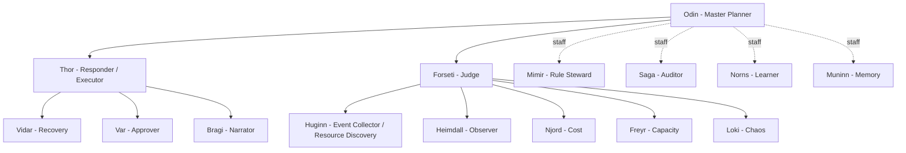
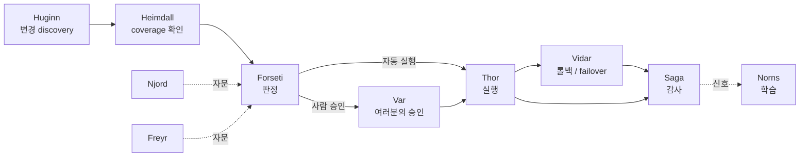

# 에이전트와 자가 치유(Agents and self-healing)

FDAI는 **이름 있는 15개 에이전트의 고정된 조직**으로 동작합니다. 각 에이전트는 하나의
임무를 맡고 객체 및 작업 타입 집합을 소유하며, 스키마가 검증된 이벤트 버스에서
대화합니다. 조직도가 곧 안전 모델입니다. 판단하는 에이전트는 실행하지 않고, 실행하는
에이전트는 승인 권한을 갖지 않습니다. 리소스에 드리프트나 장애가 생기면 에이전트들이
함께 해결합니다. 승격된 저위험 작업은 스스로 처리하고, 고위험 작업은 여러분의 승인을
기다립니다. 자동으로 처리되는 비율은 측정해야 할 목표이지 약속된 제품 수치가 아닙니다.

이 페이지는 에이전트가 누구인지, 직무를 어떻게 나누는지, 여러분이 어떻게 승인과 거절
수준에 머무는지, 그리고 장애를 처음부터 끝까지 어떻게 스스로 회복하는지를 설명합니다.

## 조직

에이전트 구성은 상위 프로젝트에서 한 번 정의되고 포크가 바꾸지 않습니다. Odin이
계획하고, Forseti가 판단하고, Thor가 실행하며, 스태프 에이전트가 카탈로그와 메모리를
관리합니다.

```mermaid
graph TD
  Odin["Odin - Master Planner"]
  Odin --> Thor["Thor - Responder / Executor"]
  Odin --> Forseti["Forseti - Judge"]
  Odin -. staff .-> Mimir["Mimir - Rule Steward"]
  Odin -. staff .-> Saga["Saga - Auditor"]
  Odin -. staff .-> Norns["Norns - Learner"]
  Odin -. staff .-> Muninn["Muninn - Memory"]
  Thor --> Vidar["Vidar - Recovery"]
  Thor --> Var["Var - Approver"]
  Thor --> Bragi["Bragi - Narrator"]
  Forseti --> Huginn["Huginn - Event Collector / Resource Discovery"]
  Forseti --> Heimdall["Heimdall - Observer"]
  Forseti --> Njord["Njord - Cost"]
  Forseti --> Freyr["Freyr - Capacity"]
  Forseti --> Loki["Loki - Chaos"]
```

| 에이전트 | 역할 | 한 줄 |
|----------|------|-------|
| Odin | Master Planner | 영역 간 충돌을 중재하는 최종 조정자 |
| Forseti | Judge | 결정(자동 실행 / 사람 승인 / 거부)을 발행하고 실행하지 않음 |
| Thor | Responder | 결정을 배분하는 유일한 권한 실행기 |
| Var | Approver | 사람 승인을 전달하며 Thor와 분리 |
| Vidar | Recovery | 롤백과 DR 장애 조치를 소유 |
| Huginn | Event Collector / Resource Discovery | 실시간 리소스 변경 수집과 상관관계 연결을 소유 |
| Heimdall | Observer | 탐색 최신성, 커버리지, 드리프트, 리소스 변경을 감시 |
| Njord / Freyr / Loki | 도메인 전문가 | 비용, 용량, 카오스를 자문하며 실행하지 않음 |
| Mimir / Norns / Muninn | 거버넌스 스태프 | 룰 관리, 학습, 메모리 |
| Saga | Auditor | 추가 전용 감사 로그를 기록 |
| Bragi | Narrator | 여러분의 질문을 파이프라인 안팎으로 옮김 |

## 직무 분리

안전 보장은 각 에이전트가 무엇을 *할 수 없는지*에서 나옵니다.

- **판단자와 실행자를 분리합니다.** Forseti가 결정하고 Thor가 실행합니다. 판단과
  실행을 동시에 하는 에이전트가 없으므로, 잘못된 판단이 스스로를 승인해 변경으로
  이어질 수 없습니다.
- **승인은 별개의 주체입니다.** Var가 여러분의 승인을 전달합니다. Thor는 여러분을
  대신해 승인할 수 없습니다.
- **전문가는 자문만 합니다.** Njord, Freyr, Loki는 판단에 정보를 제공할 뿐 실행기에
  직접 닿지 않습니다.
- **두 포트, 우회 없음.** 모든 에이전트는 기계 트래픽용 타입 기반 pub/sub 포트와
  질문용 대화 포트를 가집니다. 작업을 요청하는 대화는 반드시 타입 기반 파이프라인으로
  다시 들어가야 하므로, 내레이터가 직접 실행하는 일은 없습니다.

## 여러분은 승인과 거절 수준에서 운영

여러분이 에이전트를 작업 단위로 지시할 필요는 없습니다. 조직이 루프를 돌리고 여러분에게
결정을 가져옵니다.

- **승격된 저위험 작업은 스스로 처리할 수 있습니다.** 중단 조건, 롤백 경로, 영향 범위
  제한, 감사 기록를 갖추며, 새 작업은 승격 기준을 통과할 때까지 관찰 모드에
  머무릅니다.
- **위험한 소수는 여러분을 기다립니다.** 승인 카드가 이미 쓰는 채널인 Teams나 Slack으로
  도착하고, 여러분은 승인하거나 거절합니다. 거절과 시간 초과는 모두 감사되는
  미실행으로 끝납니다.
- Bragi에게 "왜 장애 조치가 일어났지?" 같은 **질문을 평범한 말로** 할 수 있고, 실행기의
  특권 자격 증명 없이도 근거가 붙은 답을 받습니다.

전체 워크스루: [../guides/approve-change-ko.md](../guides/approve-change-ko.md).

## 장애는 어떻게 자가 치유되는가

리소스가 나빠지면 에이전트들은 모든 이벤트를 다루는 바로 그 파이프라인에서 함께
움직입니다. 장애 조치 하나를 처음부터 끝까지 따라가 보겠습니다.

```mermaid
graph LR
  Huginn["Huginn<br/>변경 discovery"] --> Heimdall["Heimdall<br/>coverage 확인"]
  Heimdall --> Forseti["Forseti<br/>판정"]
  Njord -. 자문 .-> Forseti
  Freyr -. 자문 .-> Forseti
  Forseti -->|자동 실행| Thor["Thor<br/>실행"]
  Forseti -->|사람 승인| Var["Var<br/>여러분의 승인"]
  Var --> Thor
  Thor --> Vidar["Vidar<br/>롤백 / failover"]
  Vidar --> Saga["Saga<br/>감사"]
  Thor --> Saga
  Saga -. 신호 .-> Norns["Norns<br/>학습"]
```

1. **감지.** Huginn이 리소스 변경과 장애 신호를 실시간으로 모읍니다. 주기적인 Inventory
  작업이 놓친 변경을 메우고, Heimdall이 최신성과 커버리지를 확인해 알림 폭주 대신 하나의
  인시던트로 묶습니다.
2. **판단.** Forseti가 인시던트를 점수화하고, 비용과 용량 절충을 전문가에게 물은 뒤,
   자동 실행, 사람 승인, 거부 중 하나를 결정합니다.
3. **행동.** Thor가 작업을 배분합니다. 저위험 복구는 스스로 실행되고, 고위험 장애 조치는
  Var가 여러분의 승인을 전달할 때까지 기다립니다.
4. **복구.** Vidar가 작업의 중단 조건과 영향 범위 안에서 롤백이나 DR 장애 조치를
   담당합니다.
5. **기록과 학습.** Saga가 감사 기록를 남기고, Norns가 반복되는 패턴을 아직 작동하지
  않는 카탈로그 후보로 만듭니다. 후보는 승격 전에 출처, 검토, 회귀 테스트, 관찰 모드
  근거를 갖춰야 합니다.

전문가들이 같은 리소스를 두고 엇갈릴 때가 있습니다. Njord는 비용을 위해 `scale_down`을,
Freyr는 용량을 위해 `scale_up`을 원할 수 있습니다. 이때 Forseti가 결정을 확정하기 전에
Odin이 정리하므로, 상충하는 목표가 실행 단계로 동시에 달려가지 않습니다.

## 에이전트를 사용할 수 없는 경우

자가 회복에는 조직 자체도 포함됩니다. 역할 하나가 빠지면 자율성이 낮아질 뿐, 다른
에이전트가 받지 않은 권한을 대신 갖지는 않습니다.

| 사용할 수 없는 역할 | 안전한 성능 저하 방식 |
|----------------------|-----------------------|
| Forseti (판단자) | 새 결정을 발행하지 않고 사람 승인으로 보류합니다 |
| Thor (실행자) | 판단과 감사는 계속되지만 아무것도 바뀌지 않습니다 |
| Var (승인자) | 승인 요청이 대기열에 남고 시간 초과는 감사되는 미실행으로 끝납니다 |
| Vidar (복구) | 롤백이나 장애 조치가 필요한 작업은 자동 실행할 수 없습니다 |
| Saga (감사자) | 감사 요건을 충족할 경로가 없으므로 변경이 중지됩니다 |
| Odin (중재자) | 영역 간 충돌에서 승자를 고르지 않고 사람 승인으로 넘깁니다 |

에이전트는 장애가 난 동료를 조용히 대신하지 않습니다. 복구는 선언된 역할을 되살리고
대기 중인 판단만 다시 재생합니다. 대화나 오래된 전달 메시지에서 작업을 다시 실행하지는
않습니다.

## 조직의 상태를 확인하는 방법

에이전트 상태와 컨트롤 루프 결과를 함께 보는 신호가 유용합니다.

- 이벤트 수집 지연, dead-letter 적체, 상관관계 처리 대기
- 결정 지연, 모델 간 불일치, 승인 만료 비율
- 실행 성공률, 중단 조건 발동, 롤백 비율
- 감사 완전성과 최종 결과가 영구 기록으로 남기까지 걸린 시간
- 에이전트별 성능 저하 상태와 정상 자율성 상한 아래에 머문 시간

목표는 자동 실행을 최대로 늘리는 것이 아닙니다. 건강한 조직은 이 신호가 나빠지면
자율성을 낮추고 그 이유를 운영자에게 보여 줍니다.

## 다음 단계

| 학습 대상 | 문서 |
|-----------|------|
| 모든 액션이 안전 계약을 물려받는 방식 | [ontology-driven-automation-ko.md](ontology-driven-automation-ko.md) |
| 결정이 자동 실행과 사람 승인으로 갈리는 방식 | [risk-tiers-ko.md](risk-tiers-ko.md) |
| 대기 중인 변경 승인 또는 거절 | [../guides/approve-change-ko.md](../guides/approve-change-ko.md) |
| 감사 로그로 결정 추적하기 | [../guides/read-audit-log-ko.md](../guides/read-audit-log-ko.md) |
| 전체 판테온 설계 | [../../roadmap/agents/agent-pantheon-ko.md](../../roadmap/agents/agent-pantheon-ko.md) |
