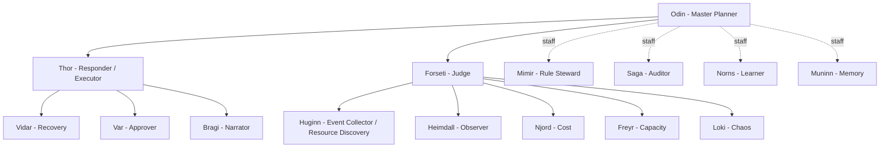
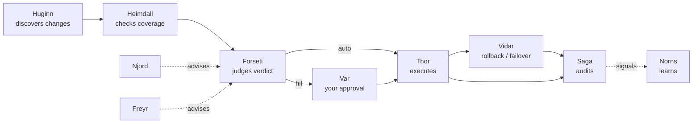

# Agents and self-healing

FDAI runs as a fixed **organization of 15 named agents**. Each agent has one
mandate, owns a set of object and action types, and communicates on a
schema-checked event bus. The org chart is the safety model: the agent that
judges is never the agent that executes, and the agent that executes never holds
your approval. When a resource drifts or a failure occurs, the agents
collaborate to resolve it - autonomously for promoted low-risk actions, and with
your approval for high-risk actions. The autonomous share is a measured target,
not an assumed product result.

This page explains who the agents are, how they separate duties, how you operate
at the approve-or-reject level, and how they self-heal a failure end to end.

## The organization

The pantheon is defined once upstream and never changed by a fork. Odin plans,
Forseti judges, Thor executes, and staff agents govern the catalog and memory.

| Agent | Role | In one line |
|-------|------|-------------|
| Odin | Master Planner | Arbitrates cross-vertical conflicts; final tie-breaker |
| Forseti | Judge | Issues the verdict (auto / HIL / deny); never executes |
| Thor | Responder | Dispatches verdicts; the sole privileged executor |
| Var | Approver | Carries the human HIL approval; distinct from Thor |
| Vidar | Recovery | Owns rollback and DR failover |
| Huginn | Event Collector / Resource Discovery | Owns real-time resource-change ingress and correlation |
| Heimdall | Observer | Watches discovery freshness, coverage, drift, and resource change |
| Njord / Freyr / Loki | Specialists | Advise on cost, capacity, chaos - they never execute |
| Mimir / Norns / Muninn | Governance staff | Rule stewardship, learning, memory |
| Saga | Auditor | Writes the append-only audit log |
| Bragi | Narrator | Translates your questions to and from the pipeline |

## Separation of duties

The safety guarantees come from who is *not* allowed to do what:

- **Judge is not executor.** Forseti decides; Thor acts. No agent both judges
  and executes, so a bad judgment cannot self-approve into a change.
- **Approval is a separate principal.** Var carries your approval; Thor cannot
  approve on your behalf.
- **Specialists advise, they do not act.** Njord, Freyr, and Loki feed
  judgment; they never reach the executor directly.
- **Two ports, no bypass.** Every agent has a typed pub/sub port (machine
  traffic) and a conversational port (your questions). A conversational request
  that asks for an action must re-enter the typed pipeline - the narrator can
  never execute directly.

## You operate at approve-or-reject

You do not drive the agents task by task. The organization runs the loop and
brings you decisions:

- **Promoted low-risk actions can auto-resolve** with a stop-condition,
  rollback path, blast-radius limit, and audit entry. New actions remain in
  shadow until their evidence gate passes.
- The **risky few pause for you.** A HIL card reaches you through the channel
  you already use (Teams or Slack), and you approve or reject. Rejection and
  timeout are no-ops, and both are audited.
- You can **ask questions** in natural language through Bragi ("why did this
  fail over?") and get a grounded answer, without ever holding the executor's
  privileged identity.

Full walkthrough: [../guides/approve-change.md](../guides/approve-change.md).

## How a failure self-heals

When a resource degrades, the agents collaborate through the same pipeline that
handles every event. Here is one failover, end to end:

1. **Sense.** Huginn ingests resource changes and failure signals in real time;
  the periodic Inventory job reconciles missed changes, and Heimdall checks
  freshness and coverage before correlating one incident instead of an alert storm.
2. **Judge.** Forseti scores the incident, consults the specialists for cost and
   capacity trade-offs, and issues a verdict: auto, HIL, or deny.
3. **Act.** Thor dispatches. Low-risk recovery runs autonomously; a high-risk
   failover pauses for Var to carry your approval.
4. **Recover.** Vidar owns the rollback or DR failover, bounded by the action's
   stop-conditions and blast-radius.
5. **Record and learn.** Saga writes the audit entry; Norns turns recurring
  patterns into inert catalog candidates. A candidate still needs provenance,
  review, regression testing, and shadow evidence before promotion.

When specialists disagree on the same resource - Njord wants `scale_down` for
cost while Freyr wants `scale_up` for capacity - Odin arbitrates before Forseti
finalizes, so conflicting objectives never race to the executor.

## When an agent is unavailable

Self-healing includes the organization itself. A missing role lowers autonomy;
it never allows another agent to absorb incompatible authority.

| Unavailable role | Safe degradation |
|------------------|------------------|
| Forseti (judge) | No new verdict is issued; the case is held for HIL |
| Thor (executor) | Judgment and audit may continue, but no mutation runs |
| Var (approver) | HIL requests remain queued; timeout is an audited no-op |
| Vidar (recovery) | Actions that require rollback or failover cannot auto-execute |
| Saga (auditor) | Mutation stops because no terminal path can satisfy the audit invariant |
| Odin (arbitrator) | Cross-vertical conflicts go to HIL instead of choosing a winner |

An agent does not silently impersonate a failed peer. Recovery restores the
declared role and replays pending judgment only; it never re-executes an action
from conversation or an old delivery message.

## How to know the organization is healthy

Useful health signals combine agent and control-loop outcomes:

- event ingestion lag, dead-letter depth, and correlation backlog;
- verdict latency, mixed-model disagreement, and HIL expiry rate;
- execution success, stop-condition activation, and rollback rate;
- audit completeness and time from terminal outcome to durable record;
- per-agent degradation state and time spent below its normal autonomy ceiling.

The goal is not to maximize auto execution. A healthy organization lowers
autonomy when these signals degrade and makes the reason visible to operators.

## Next steps

| To learn about | Read |
|----------------|------|
| How every action inherits its safety contract | [ontology-driven-automation.md](ontology-driven-automation.md) |
| How verdicts become auto vs HIL | [risk-tiers.md](risk-tiers.md) |
| Approving or rejecting a queued change | [../guides/approve-change.md](../guides/approve-change.md) |
| Tracing a decision through the audit log | [../guides/read-audit-log.md](../guides/read-audit-log.md) |
| The full pantheon design | [../../roadmap/agents/agent-pantheon.md](../../roadmap/agents/agent-pantheon.md) |
