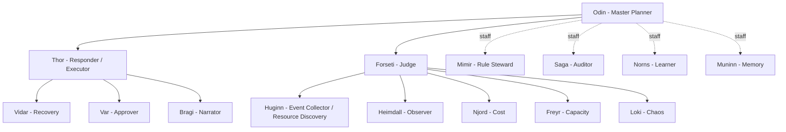
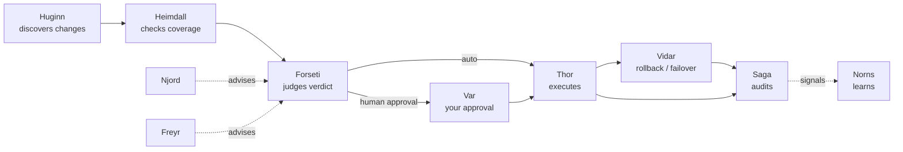

# Agents and self-healing

FDAI runs as a fixed **organization of 15 named agents**. Each agent has one
mandate, owns a set of object and action types, and talks on a schema-checked
event bus. The org chart is the safety model: the agent that judges never
executes, and the agent that executes never holds your approval. When a resource
drifts or something fails, the agents work together to fix it. Promoted low-risk
actions run on their own, and high-risk actions wait for your approval. How much
runs automatically is a measured target, not a promised product number.

This page explains who the agents are, how they split duties, how you stay at the
approve-or-reject level, and how they heal a failure end to end.

## The organization

The set of agents is defined once upstream and a fork never changes it. Odin
plans, Forseti judges, Thor executes, and the staff agents govern the catalog and
the memory.

```mermaid
graph TD
  Odin["Odin - Master Planner"]
  Odin --> Thor["Thor - Responder / Executor"]
  Odin --> Forseti["Forseti - Judge"]
  Odin -. staff .-> Mimir["Mimir - Rule Steward"]
  Odin -. staff .-> Saga["Saga - Auditor"]
  Odin -. staff .-> Norns["Norns - Learner"]
  Odin -. staff .-> Muninn["Muninn - Memory"]
  Thor --> Vidar["Vidar - Recovery"]
  Thor --> Var["Var - Approver"]
  Thor --> Bragi["Bragi - Narrator"]
  Forseti --> Huginn["Huginn - Event Collector / Resource Discovery"]
  Forseti --> Heimdall["Heimdall - Observer"]
  Forseti --> Njord["Njord - Cost"]
  Forseti --> Freyr["Freyr - Capacity"]
  Forseti --> Loki["Loki - Chaos"]
```

| Agent | Role | In one line |
|-------|------|-------------|
| Odin | Master Planner | Arbitrates cross-vertical conflicts; final tie-breaker |
| Forseti | Judge | Issues the decision (auto / human approval / deny); never executes |
| Thor | Responder | Dispatches decisions; the sole privileged executor |
| Var | Approver | Carries human approval; distinct from Thor |
| Vidar | Recovery | Owns rollback and DR failover |
| Huginn | Event Collector / Resource Discovery | Owns real-time resource-change ingress and correlation |
| Heimdall | Observer | Watches discovery freshness, coverage, drift, and resource change |
| Njord / Freyr / Loki | Specialists | Advise on cost, capacity, and chaos, and never execute |
| Mimir / Norns / Muninn | Governance staff | Rule ownership, learning, memory |
| Saga | Auditor | Writes the append-only audit log |
| Bragi | Narrator | Translates your questions to and from the pipeline |

## Separation of duties

The safety guarantees come from what each agent is *not* allowed to do:

- **The judge is not the executor.** Forseti decides and Thor acts. No agent both
  judges and executes, so a bad judgment cannot approve itself into a change.
- **Approval is a separate principal.** Var carries your approval, and Thor
  cannot approve on your behalf.
- **Specialists advise, they do not act.** Njord, Freyr, and Loki feed the
  judgment. They never reach the executor directly.
- **Two ports, no bypass.** Every agent has a typed pub/sub port for machine
  traffic and a conversational port for your questions. A conversation that asks
  for an action has to re-enter the typed pipeline, so the narrator can never
  execute anything itself.

## You operate at approve-or-reject

You do not drive the agents task by task. The organization runs the loop and
brings decisions to you:

- **Promoted low-risk actions can resolve themselves** with a stop condition, a
  rollback path, an impact scope limit, and an audit entry. A new action stays in
  observation mode until its evidence clears the promotion gate.
- **The risky few wait for you.** An approval card arrives in the channel you
  already use, such as Teams or Slack, and you approve or reject it. A rejection
  and a timeout both end as an audited no-op.
- **You can ask questions** in plain language through Bragi, such as "why did
  this fail over?", and get an answer backed by evidence. You never need the
  executor's privileged identity to do it.

Full walkthrough: [../guides/approve-change.md](../guides/approve-change.md).

## How a failure self-heals

When a resource degrades, the agents collaborate through the same pipeline that
handles every event. Here is one failover, end to end:

```mermaid
graph LR
  Huginn["Huginn<br/>discovers changes"] --> Heimdall["Heimdall<br/>checks coverage"]
  Heimdall --> Forseti["Forseti<br/>judges verdict"]
  Njord -. advises .-> Forseti
  Freyr -. advises .-> Forseti
  Forseti -->|auto| Thor["Thor<br/>executes"]
  Forseti -->|human approval| Var["Var<br/>your approval"]
  Var --> Thor
  Thor --> Vidar["Vidar<br/>rollback / failover"]
  Vidar --> Saga["Saga<br/>audits"]
  Thor --> Saga
  Saga -. signals .-> Norns["Norns<br/>learns"]
```

1. **Sense.** Huginn takes in resource changes and failure signals in real time.
  The periodic Inventory job catches anything missed, and Heimdall checks
  freshness and coverage so the signals become one incident instead of an alert
  storm.
2. **Judge.** Forseti scores the incident, asks the specialists about cost and
   capacity trade-offs, and issues a decision: run it, request approval, or deny.
3. **Act.** Thor dispatches. Low-risk recovery runs on its own, while a high-risk
   failover waits for Var to carry your approval.
4. **Recover.** Vidar owns the rollback or DR failover, bounded by the action's
   stop conditions and impact scope.
5. **Record and learn.** Saga writes the audit entry. Norns turns recurring
  patterns into inactive catalog candidates, and each candidate still needs
  provenance, review, regression tests, and observation-mode evidence before it
  can be promoted.

Specialists sometimes disagree about the same resource. Njord may want
`scale_down` to cut cost while Freyr wants `scale_up` for capacity. Odin settles
that before Forseti finalizes the decision, so competing goals never race each
other to the executor.

## When an agent is unavailable

Self-healing covers the organization itself. A missing role lowers autonomy. It
never lets another agent take over authority it was not given.

| Unavailable role | Safe degradation |
|------------------|------------------|
| Forseti (judge) | No new decision is issued, and the case waits for human approval |
| Thor (executor) | Judgment and audit continue, but nothing changes |
| Var (approver) | Approval requests stay queued, and a timeout ends as an audited no-op |
| Vidar (recovery) | Actions that need rollback or failover cannot run automatically |
| Saga (auditor) | Changes stop, because no outcome could satisfy the audit requirement |
| Odin (arbitrator) | Cross-vertical conflicts go to human approval instead of picking a winner |

An agent never quietly stands in for a failed peer. Recovery restores the
declared role and replays pending judgment only. It never re-runs an action from
a conversation or an old delivery message.

## How to know the organization is healthy

Useful health signals mix agent state with control-loop outcomes:

- event ingestion lag, dead-letter depth, and correlation backlog
- decision latency, disagreement between models, and how often approvals expire
- execution success, stop-condition activations, and rollback rate
- audit completeness and the time from final outcome to a durable record
- each agent's degradation state and how long it stayed below its normal
  autonomy ceiling

The goal is not to maximize automatic execution. A healthy organization lowers
autonomy when these signals degrade and shows operators why.

## Next steps

| To learn about | Read |
|----------------|------|
| How every action inherits its safety contract | [ontology-driven-automation.md](ontology-driven-automation.md) |
| How decisions become auto vs human approval | [risk-tiers.md](risk-tiers.md) |
| Approving or rejecting a queued change | [../guides/approve-change.md](../guides/approve-change.md) |
| Tracing a decision through the audit log | [../guides/read-audit-log.md](../guides/read-audit-log.md) |
| The full pantheon design | [../../roadmap/agents/agent-pantheon.md](../../roadmap/agents/agent-pantheon.md) |
